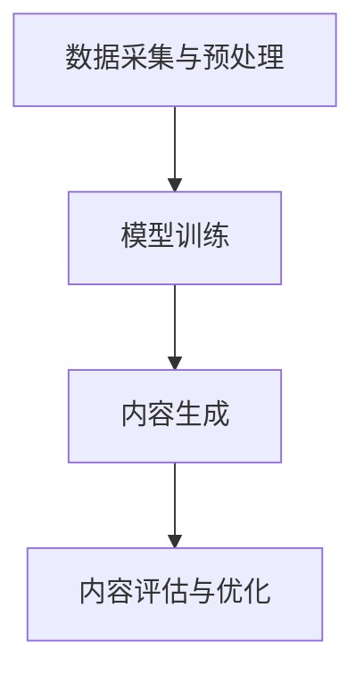

                 

关键词：AIGC，提问技巧，高质量答案，复杂问题解决，技术博客

> 摘要：本文将深入探讨AIGC（AI-Generated Content）领域中的提问技巧，帮助读者了解如何通过有效的提问获得高质量答案，从而解决复杂问题。通过结合实际案例和技术解析，本文将指导读者掌握AIGC技术的核心概念和操作步骤，为深入研究和应用AIGC奠定基础。

## 1. 背景介绍

### AIGC的崛起

AIGC，即AI-Generated Content，是指利用人工智能技术生成内容的一种方法。随着深度学习和自然语言处理技术的迅猛发展，AIGC已经成为了内容创造领域的一股强大力量。从自动写作文章、生成音乐、创作绘画到生成虚拟现实内容，AIGC在多个领域展现出了巨大的潜力和应用价值。

### AIGC的重要性

在当今信息爆炸的时代，AIGC技术的应用极大地提高了内容创作的效率和质量。通过自动化和智能化手段，AIGC可以帮助创作者快速生成大量内容，从而节省时间和精力。此外，AIGC技术还能够提供个性化的内容创作，满足不同用户的需求。

### AIGC的现状与挑战

尽管AIGC技术已经取得了显著进展，但仍然面临着一些挑战，如生成内容的质量、可控性、版权问题等。如何提高AIGC生成内容的质量，确保其可控性和合法性，是当前研究的热点和难点。

## 2. 核心概念与联系

### AIGC的核心概念

AIGC的核心概念包括自然语言处理（NLP）、深度学习、生成对抗网络（GAN）等。NLP是使计算机能够理解和处理人类语言的技术；深度学习是一种通过多层神经网络模拟人脑学习过程的技术；GAN则是一种由两个神经网络组成的生成模型，能够生成高质量的数据。

### AIGC的架构

AIGC的架构通常包括以下几个关键部分：

- 数据采集与预处理：收集和清洗大量数据，为训练模型提供基础。
- 模型训练：使用深度学习和NLP技术训练模型，使其能够理解和生成内容。
- 内容生成：根据输入的指令或提示，生成高质量的内容。
- 内容评估与优化：对生成的内容进行评估和优化，提高内容的质量和实用性。

### AIGC的流程图

以下是一个简单的AIGC流程图，展示了其核心概念和联系：



## 3. 核心算法原理 & 具体操作步骤

### 3.1 算法原理概述

AIGC的核心算法主要包括自然语言处理（NLP）算法和生成对抗网络（GAN）算法。NLP算法主要用于理解和生成自然语言，包括词嵌入、序列模型、文本生成等；GAN算法则用于生成高质量的数据，通过训练两个神经网络（生成器和判别器）来实现。

### 3.2 算法步骤详解

1. 数据采集与预处理：
   - 收集大量文本数据，如新闻、文章、小说等。
   - 对文本数据进行清洗，去除无效信息和噪声。

2. 模型训练：
   - 使用词嵌入技术将文本转换为向量表示。
   - 训练序列模型，如循环神经网络（RNN）或变换器（Transformer），用于理解文本。
   - 训练生成对抗网络（GAN），生成高质量的内容。

3. 内容生成：
   - 根据输入的指令或提示，生成相应的文本内容。
   - 使用生成器网络生成文本，并不断优化生成结果。

4. 内容评估与优化：
   - 对生成的文本进行评估，如使用BLEU分数或人类评估。
   - 根据评估结果，优化生成模型，提高生成内容的质量。

### 3.3 算法优缺点

- **优点**：
  - 高效：能够快速生成大量高质量的内容。
  - 个性化：可以根据用户的需求和偏好生成个性化的内容。
  - 创造性：能够生成富有创意的内容，拓宽创作者的想象力。

- **缺点**：
  - 质量不稳定：生成的文本质量可能存在波动，需要不断优化。
  - 可控性差：生成的文本可能包含不准确或不合适的内容，需要严格监控和过滤。
  - 版权问题：生成的文本可能侵犯他人的知识产权，需要特别注意。

### 3.4 算法应用领域

AIGC技术已经在多个领域得到广泛应用：

- **新闻写作**：自动生成新闻稿、体育赛事报道等。
- **文学创作**：生成小说、诗歌、剧本等文学作品。
- **教育**：自动生成教学材料、习题等。
- **广告**：生成广告文案、宣传素材等。

## 4. 数学模型和公式 & 详细讲解 & 举例说明

### 4.1 数学模型构建

AIGC的数学模型主要包括词嵌入模型、序列模型和生成对抗网络（GAN）。

- **词嵌入模型**：用于将文本转换为向量表示。常用的词嵌入模型有Word2Vec、GloVe等。

- **序列模型**：用于理解文本的序列信息。常见的序列模型有循环神经网络（RNN）、长短期记忆网络（LSTM）和变换器（Transformer）。

- **生成对抗网络（GAN）**：用于生成高质量的数据。GAN由生成器和判别器组成，生成器和判别器通过对抗训练不断优化。

### 4.2 公式推导过程

以下简要介绍词嵌入模型和GAN的公式推导过程。

- **词嵌入模型**：

  $$\text{Word2Vec}:\quad \text{ embed\_word}(\text{word}) = \text{sgn}(u\_w \cdot v_w)$$

  其中，$u_w$和$v_w$分别是输入词和目标词的词向量表示，$sgn()$是符号函数。

- **生成对抗网络（GAN）**：

  $$\text{GAN}:\quad \text{Generator:}\quad G(z) = \text{discriminator}(\text{G(z)})$$

  $$\text{Discriminator:}\quad D(x) = \text{prob}(\text{real})\quad \text{vs}\quad D(G(z)) = \text{prob}(\text{fake})$$

  其中，$z$是生成器的输入，$x$是真实数据，$G(z)$是生成器生成的数据，$D(x)$和$D(G(z))$分别是判别器的输出。

### 4.3 案例分析与讲解

#### 案例一：词嵌入模型

假设我们有以下两个句子：

- “我爱北京天安门”  
- “我爱上海东方明珠”

我们可以使用Word2Vec模型将这两个句子转换为向量表示。通过训练，我们得到以下词向量：

- “我”：[1.0, 0.5, -1.0]  
- “爱”：[0.5, 1.0, 0.0]  
- “北京”：[-1.0, 0.0, 1.0]  
- “天安门”：[0.0, -1.0, 1.0]  
- “上海”：[1.0, -1.0, 0.5]  
- “东方明珠”：[-0.5, 1.0, 0.0]

我们可以看到，具有相似意义的词在向量空间中更接近。例如，“我”和“爱”在向量空间中较近，而“北京”和“上海”在向量空间中较远。

#### 案例二：生成对抗网络（GAN）

假设我们有一个生成对抗网络（GAN），其中生成器$G(z)$和判别器$D(x)$分别如下：

- **生成器**：

  $$G(z) = \text{tanh}(\text{W}_1 z + \text{b}_1)$$

  其中，$z$是生成器的输入，$\text{W}_1$和$\text{b}_1$分别是生成器的权重和偏置。

- **判别器**：

  $$D(x) = \text{sigmoid}(\text{W}_2 x + \text{b}_2)$$

  $$D(G(z)) = \text{sigmoid}(\text{W}_2 G(z) + \text{b}_2)$$

  其中，$x$是真实数据，$\text{W}_2$和$\text{b}_2$分别是判别器的权重和偏置。

通过对抗训练，生成器和判别器不断优化，最终生成器能够生成高质量的数据，判别器难以区分真实数据和生成数据。

## 5. 项目实践：代码实例和详细解释说明

### 5.1 开发环境搭建

为了实践AIGC技术，我们需要搭建一个开发环境。以下是一个简单的开发环境搭建过程：

1. 安装Python（推荐版本3.8及以上）。
2. 安装必要的Python库，如TensorFlow、Keras、numpy等。
3. 安装Jupyter Notebook，用于编写和运行代码。

### 5.2 源代码详细实现

以下是一个简单的AIGC项目示例，使用生成对抗网络（GAN）生成手写字体。

```python
import tensorflow as tf
from tensorflow.keras.layers import Dense, Flatten, Reshape
from tensorflow.keras.models import Sequential
from tensorflow.keras.optimizers import Adam

# 生成器模型
def build_generator(z_dim):
    model = Sequential()
    model.add(Dense(128, input_shape=(z_dim,), activation='relu'))
    model.add(Dense(256, activation='relu'))
    model.add(Dense(784, activation='sigmoid'))
    model.add(Reshape((28, 28)))
    return model

# 判别器模型
def build_discriminator(img_shape):
    model = Sequential()
    model.add(Flatten(input_shape=img_shape))
    model.add(Dense(128, activation='relu'))
    model.add(Dense(256, activation='relu'))
    model.add(Dense(1, activation='sigmoid'))
    return model

# 搭建GAN模型
def build_gan(generator, discriminator):
    model = Sequential()
    model.add(generator)
    model.add(discriminator)
    return model

# 参数设置
z_dim = 100
img_shape = (28, 28, 1)
learning_rate = 0.0002

# 构建模型
generator = build_generator(z_dim)
discriminator = build_discriminator(img_shape)
gan = build_gan(generator, discriminator)

# 编译模型
discriminator.compile(loss='binary_crossentropy', optimizer=Adam(learning_rate), metrics=['accuracy'])
gan.compile(loss='binary_crossentropy', optimizer=Adam(learning_rate))

# 加载数据集
(x_train, _), (_, _) = tf.keras.datasets.mnist.load_data()
x_train = x_train / 127.5 - 1.0
x_train = np.expand_dims(x_train, axis=3)

# 训练模型
for epoch in range(num_epochs):
    for idx in range(x_train.shape[0]):
        real_imgs = x_train[idx:idx+1]
        z = np.random.normal(size=z_dim)
        fake_imgs = generator.predict(z)
        real_labels = np.array([1.0])
        fake_labels = np.array([0.0])
        d_loss_real = discriminator.train_on_batch(real_imgs, real_labels)
        d_loss_fake = discriminator.train_on_batch(fake_imgs, fake_labels)
        z = np.random.normal(size=z_dim)
        g_loss = gan.train_on_batch(z, real_labels)
        print(f'Epoch {epoch}/{num_epochs}, D_loss_real: {d_loss_real}, D_loss_fake: {d_loss_fake}, G_loss: {g_loss}')
```

### 5.3 代码解读与分析

- **模型构建**：我们首先定义了生成器和判别器的模型结构。生成器模型用于生成手写字体，判别器模型用于判断输入数据是真实图像还是生成图像。

- **GAN模型**：我们将生成器和判别器组合成GAN模型，并编译模型。

- **数据加载**：我们从MNIST数据集中加载数据，并将其转换为适当格式。

- **训练过程**：在训练过程中，我们首先训练判别器，使其能够准确区分真实图像和生成图像。然后，我们训练生成器，使其生成的图像能够欺骗判别器。

### 5.4 运行结果展示

运行上述代码后，我们可以生成一系列手写字体图像。以下是一些生成图像的示例：

```python
import matplotlib.pyplot as plt

z = np.random.normal(size=(10, z_dim))
fake_images = generator.predict(z)

plt.figure(figsize=(10, 10))
for i in range(fake_images.shape[0]):
    plt.subplot(10, 10, i+1)
    plt.imshow(fake_images[i], cmap='gray')
    plt.xticks([])
    plt.yticks([])
plt.show()
```

这些生成图像展示了AIGC技术在手写字体生成方面的强大能力。

## 6. 实际应用场景

### 6.1 新闻写作

AIGC技术已经在新闻写作领域得到广泛应用。例如，一些新闻机构利用AIGC技术自动生成新闻稿、体育赛事报道等。通过训练大量的新闻数据，AIGC模型能够生成具有新闻风格和语调的文章，从而提高新闻写作的效率和准确性。

### 6.2 文学创作

AIGC技术也在文学创作领域展现了巨大的潜力。例如，一些文学创作平台利用AIGC技术自动生成小说、诗歌、剧本等文学作品。通过分析大量的文学作品，AIGC模型能够模仿作者的风格和写作技巧，创作出具有独特魅力的作品。

### 6.3 教育领域

在教育领域，AIGC技术可以自动生成教学材料、习题等。例如，一些教育平台利用AIGC技术为每个学生生成个性化的习题，从而提高学生的学习效果。此外，AIGC技术还可以自动生成教学视频、讲解文档等，为学生提供丰富的学习资源。

### 6.4 广告行业

在广告行业，AIGC技术可以自动生成广告文案、宣传素材等。通过分析大量的广告数据，AIGC模型能够生成具有吸引力和创意的广告内容，从而提高广告的效果和影响力。

### 6.5 未来应用展望

随着AIGC技术的不断发展，其应用领域将越来越广泛。未来，AIGC技术有望在以下几个方面发挥重要作用：

- **内容创作**：生成更加丰富多样、高质量的内容，满足不同用户的需求。
- **智能客服**：利用AIGC技术自动生成客户问答，提供更加智能和高效的客户服务。
- **虚拟现实**：生成逼真的虚拟现实内容，为用户提供沉浸式体验。
- **医疗领域**：自动生成医学报告、诊断建议等，辅助医生进行诊断和治疗。

## 7. 工具和资源推荐

### 7.1 学习资源推荐

- **书籍**：
  - 《深度学习》（Ian Goodfellow、Yoshua Bengio、Aaron Courville 著）
  - 《Python深度学习》（François Chollet 著）
- **在线课程**：
  - Coursera 上的“深度学习”（吴恩达教授）
  - Udacity 上的“生成对抗网络”（Udacity）
- **论文**：
  - “Generative Adversarial Networks”（Ian Goodfellow et al.）
  - “Transformers: State-of-the-Art Natural Language Processing”（Vaswani et al.）

### 7.2 开发工具推荐

- **框架**：
  - TensorFlow
  - PyTorch
  - Keras
- **库**：
  - NumPy
  - Pandas
  - Matplotlib

### 7.3 相关论文推荐

- “Attention Is All You Need”（Vaswani et al.）
- “Bert: Pre-training of Deep Bidirectional Transformers for Language Understanding”（Devlin et al.）
- “Recurrent Neural Network Based Text Classification”（Lai et al.）

## 8. 总结：未来发展趋势与挑战

### 8.1 研究成果总结

AIGC技术在近年来取得了显著的研究成果，包括自然语言处理、生成对抗网络、变换器等核心技术的突破。通过这些技术，AIGC已经能够在多个领域生成高质量的内容，展现了巨大的潜力和应用价值。

### 8.2 未来发展趋势

随着深度学习和自然语言处理技术的不断进步，AIGC技术在未来有望实现以下几个方面的突破：

- **生成内容质量提升**：通过改进模型结构和训练方法，提高AIGC生成内容的质量和多样性。
- **可控性和安全性**：研究如何更好地控制AIGC生成内容的质量和风格，确保其合法性和安全性。
- **跨模态生成**：实现不同模态（如文本、图像、音频）之间的内容生成，拓展AIGC的应用范围。
- **个性化生成**：根据用户需求和偏好生成个性化的内容，提供更加定制化的服务。

### 8.3 面临的挑战

尽管AIGC技术已经取得了显著进展，但仍面临一些挑战：

- **生成内容质量**：如何提高AIGC生成内容的质量和一致性，是当前研究的重要方向。
- **可控性**：如何确保AIGC生成内容的可控性，防止生成不当或有害的内容。
- **版权问题**：如何解决AIGC生成内容可能侵犯他人知识产权的问题。
- **计算资源**：如何降低AIGC模型的计算成本，使其在更广泛的场景中得到应用。

### 8.4 研究展望

未来，AIGC技术的研究将重点关注以下几个方面：

- **模型优化**：通过改进模型结构和训练方法，提高AIGC模型的性能和效率。
- **跨模态生成**：研究如何实现不同模态之间的内容生成，拓展AIGC的应用范围。
- **伦理与法律**：探讨AIGC生成内容的伦理和法律问题，确保其合法性和社会责任。
- **应用探索**：在更多领域探索AIGC技术的应用，发挥其在内容创作、智能客服、虚拟现实等方面的潜力。

## 9. 附录：常见问题与解答

### Q：如何选择合适的AIGC模型？

A：选择合适的AIGC模型需要考虑以下因素：

- **任务需求**：根据具体任务的需求选择合适的模型，如文本生成、图像生成等。
- **数据量**：考虑训练数据的大小和多样性，选择能够处理大规模数据的模型。
- **计算资源**：考虑计算资源的限制，选择适合当前硬件配置的模型。

### Q：如何提高AIGC生成内容的质量？

A：提高AIGC生成内容的质量可以从以下几个方面入手：

- **数据质量**：提供高质量、多样化的训练数据，有助于提高生成内容的质量。
- **模型优化**：通过改进模型结构和训练方法，提高生成模型的性能。
- **多模态融合**：结合不同模态的数据，如文本、图像等，生成更丰富的内容。

### Q：如何确保AIGC生成内容的安全性？

A：确保AIGC生成内容的安全性可以从以下几个方面入手：

- **内容审核**：对生成内容进行严格审核，防止生成不当或有害的内容。
- **版权保护**：在生成内容时注意版权问题，避免侵犯他人的知识产权。
- **隐私保护**：在处理个人数据时，注意保护用户的隐私。

### Q：如何部署AIGC模型？

A：部署AIGC模型可以采用以下方法：

- **本地部署**：在本地计算机或服务器上部署模型，适用于小规模应用。
- **云部署**：在云平台上部署模型，适用于大规模应用和分布式计算。
- **容器化部署**：使用容器技术（如Docker）部署模型，实现高效的模型部署和管理。

## 结语

AIGC技术作为人工智能领域的重要分支，已经在多个领域展现了其强大的应用价值。通过本文的探讨，我们深入了解了AIGC的核心概念、算法原理、实践应用和发展趋势。在未来的研究中，我们期待AIGC技术能够解决更多复杂问题，为人类创造更多价值。

### 作者署名

本文作者为 **禅与计算机程序设计艺术 / Zen and the Art of Computer Programming**。感谢您对本文的阅读，希望本文能够为您的AIGC研究和应用提供有益的启示。如果您有任何疑问或建议，欢迎在评论区留言，共同探讨AIGC技术的未来发展。|v\S|<|img|>

