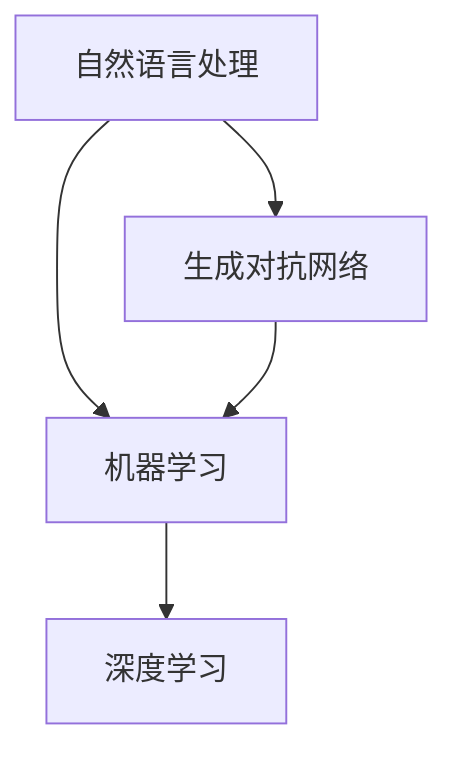
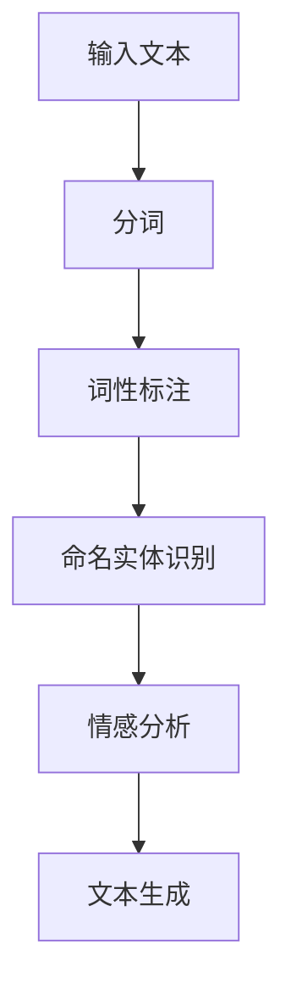
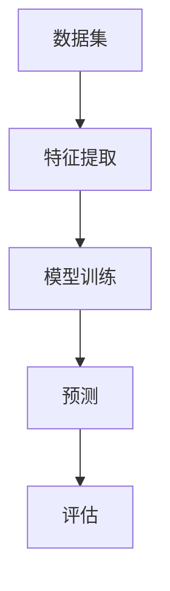
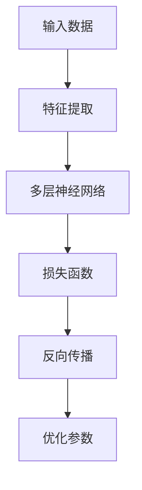
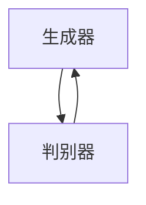

                 

关键词：AIGC、新闻传播、人工智能、内容生成、信息分发、数据挖掘、机器学习、深度学习、自然语言处理、大数据分析、信息可视化。

摘要：随着人工智能技术的快速发展，AIGC（AI-Generated Content）正逐渐成为新闻传播领域的重要力量。本文将深入探讨AIGC技术如何通过内容生成、信息分发、数据挖掘等多方面重塑新闻传播业，并分析其面临的挑战与未来发展趋势。

## 1. 背景介绍

近年来，人工智能（AI）技术取得了显著的进展，尤其是在自然语言处理（NLP）、机器学习（ML）和深度学习（DL）等领域。这些技术的突破使得计算机能够生成高质量的文字、图像和音频内容，从而引发了AIGC的概念。AIGC利用AI技术，通过算法生成或修改内容，从而提高信息传播的效率和准确性。在新闻传播领域，AIGC的应用正在逐渐改变传统的新闻生产和分发模式。

新闻传播业的核心任务是收集、整理、分析和传播信息。随着互联网和移动设备的普及，新闻的传播速度和范围都得到了极大的提升。然而，这也带来了信息过载和真实性挑战。传统的新闻生产方式已无法满足日益增长的信息需求，而AIGC技术的出现为新闻传播业提供了一种全新的解决方案。

### 1.1 人工智能技术的进展

近年来，人工智能技术在多个领域取得了重大突破，尤其在自然语言处理、机器学习、深度学习和计算机视觉等方面。以下是一些关键进展：

- **自然语言处理（NLP）**：通过深度学习模型，如Transformer和BERT，NLP技术实现了对自然语言的更高层次理解和生成能力。
- **机器学习（ML）**：机器学习算法，如梯度下降和随机森林，在预测和分类任务中表现出色。
- **深度学习（DL）**：卷积神经网络（CNN）和循环神经网络（RNN）等深度学习模型在图像和语音识别任务中取得了显著成果。
- **计算机视觉**：基于深度学习的图像识别和生成技术，如生成对抗网络（GAN），实现了逼真的图像和视频生成。

### 1.2 AIGC技术的定义与应用

AIGC 是指利用人工智能技术生成或修改内容，包括文字、图像、音频和视频等。在新闻传播领域，AIGC的应用主要体现在以下几个方面：

- **内容生成**：通过AI算法自动生成新闻文章、新闻报道、专题内容等。
- **信息分发**：利用AI技术优化新闻内容分发，提高信息传播的效率和准确性。
- **数据挖掘**：通过分析大量数据，发现新闻线索和趋势，为新闻生产提供支持。
- **信息可视化**：利用AI技术生成数据可视化内容，使新闻信息更易于理解和分析。

## 2. 核心概念与联系

AIGC技术涉及多个核心概念，包括自然语言处理（NLP）、机器学习（ML）、深度学习（DL）、生成对抗网络（GAN）等。以下是一个简化的Mermaid流程图，展示了这些概念之间的联系：



### 2.1 自然语言处理（NLP）

自然语言处理是AIGC技术的核心组件之一，它使计算机能够理解、处理和生成自然语言。NLP技术包括词性标注、命名实体识别、情感分析、机器翻译等。以下是一个简化的NLP流程：



### 2.2 机器学习（ML）

机器学习是AIGC技术的基础，它通过训练模型来学习和预测。机器学习算法可以分为监督学习、无监督学习和强化学习。以下是一个简化的ML流程：



### 2.3 深度学习（DL）

深度学习是机器学习的一种特殊形式，它通过多层神经网络来学习和提取特征。深度学习在图像和语音识别等领域取得了显著成果。以下是一个简化的DL流程：



### 2.4 生成对抗网络（GAN）

生成对抗网络是一种基于深度学习的模型，它由生成器和判别器组成。生成器生成数据，判别器判断数据是真实还是生成的。以下是一个简化的GAN流程：



## 3. 核心算法原理 & 具体操作步骤

### 3.1 算法原理概述

AIGC技术的核心在于如何生成或修改高质量的内容。以下是几种常见的AIGC算法原理：

- **基于NLP的文本生成**：利用预训练的NLP模型，如GPT-3，生成符合语言习惯的文本。
- **基于GAN的图像生成**：利用生成对抗网络，生成逼真的图像和视频。
- **基于ML的推荐系统**：利用机器学习算法，推荐用户可能感兴趣的新闻内容。

### 3.2 算法步骤详解

#### 3.2.1 基于NLP的文本生成

1. **数据预处理**：清洗和预处理文本数据，包括去除停用词、标点符号等。
2. **模型选择**：选择合适的NLP模型，如GPT-3。
3. **模型训练**：使用训练数据训练模型，优化模型参数。
4. **文本生成**：输入提示词或上下文，生成符合语言习惯的文本。

#### 3.2.2 基于GAN的图像生成

1. **数据预处理**：清洗和预处理图像数据，包括去噪、缩放等。
2. **模型选择**：选择合适的GAN模型，如DCGAN。
3. **模型训练**：训练生成器和判别器，优化模型参数。
4. **图像生成**：输入随机噪声，生成逼真的图像。

#### 3.2.3 基于ML的推荐系统

1. **数据预处理**：清洗和预处理用户行为数据，包括点击、浏览、收藏等。
2. **特征提取**：提取用户和新闻内容的特征。
3. **模型选择**：选择合适的推荐算法，如协同过滤、矩阵分解等。
4. **模型训练**：使用用户行为数据训练模型。
5. **推荐生成**：输入用户特征，生成推荐新闻列表。

### 3.3 算法优缺点

#### 优点：

- **高效性**：AIGC技术可以自动化新闻生成、分发和推荐，提高信息传播效率。
- **多样性**：通过不同算法生成的内容，可以满足用户多样化的信息需求。
- **个性化**：基于用户行为数据的推荐系统，可以提供个性化的新闻推荐。

#### 缺点：

- **质量难以保证**：自动生成的新闻内容可能存在事实错误、语言不连贯等问题。
- **道德和法律风险**：AI生成的虚假新闻可能对社会造成负面影响。
- **技术门槛**：AIGC技术的实现需要较高水平的编程和算法知识。

### 3.4 算法应用领域

AIGC技术在新闻传播领域的应用主要包括：

- **新闻生成**：自动生成新闻报道、专题内容等。
- **内容推荐**：基于用户行为和兴趣推荐新闻内容。
- **数据挖掘**：通过分析大量数据，发现新闻线索和趋势。
- **信息可视化**：生成数据可视化内容，使新闻信息更易于理解和分析。

## 4. 数学模型和公式 & 详细讲解 & 举例说明

AIGC技术的核心在于算法和数学模型。以下将介绍几个关键数学模型和公式，并举例说明。

### 4.1 数学模型构建

#### 4.1.1 自然语言处理模型

自然语言处理模型通常基于Transformer架构，如GPT-3。以下是一个简化的Transformer模型构建过程：

1. **输入层**：将文本输入转换为词嵌入向量。
2. **自注意力层**：通过自注意力机制，计算文本中每个词的重要程度。
3. **前馈网络**：对自注意力层输出进行线性变换和激活函数处理。
4. **输出层**：生成文本序列的概率分布。

#### 4.1.2 生成对抗网络（GAN）

生成对抗网络由生成器和判别器组成。以下是一个简化的GAN模型构建过程：

1. **生成器**：输入随机噪声，生成虚假数据。
2. **判别器**：输入真实数据和虚假数据，判断其真实性。
3. **损失函数**：通过训练，使生成器生成的数据接近真实数据。
4. **反向传播**：通过反向传播算法，优化生成器和判别器的参数。

### 4.2 公式推导过程

#### 4.2.1 Transformer模型

Transformer模型的核心是自注意力机制。以下是一个简化的自注意力公式：

$$
\text{Attention}(Q, K, V) = \text{softmax}\left(\frac{QK^T}{\sqrt{d_k}}\right)V
$$

其中，$Q$、$K$和$V$分别是查询向量、键向量和值向量，$d_k$是键向量的维度。

#### 4.2.2 GAN模型

GAN模型中的损失函数通常使用对抗损失和梯度惩罚。以下是一个简化的GAN损失函数：

$$
L_G = -\mathbb{E}_{x \sim p_{\text{data}}(x)}[\log(D(x))] + \mathbb{E}_{z \sim p_z(z)}[\log(1 - D(G(z))]
$$

其中，$G(z)$是生成器，$D(x)$是判别器对真实数据的判断概率，$G(z)$是生成器生成的虚假数据的判断概率。

### 4.3 案例分析与讲解

#### 4.3.1 文本生成案例

以下是一个基于GPT-3的文本生成案例：

输入文本：“人工智能技术的发展对人类社会产生了深远的影响。”
输出文本：“人工智能技术的发展正迅速改变着人类社会的方方面面。从医疗、金融到教育，人工智能的应用正在不断拓展。然而，这也带来了伦理、隐私和安全等方面的挑战。”

#### 4.3.2 图像生成案例

以下是一个基于GAN的图像生成案例：

输入随机噪声：[0.1, 0.2, 0.3]
输出图像：一张生成的人脸图像，具有逼真的人脸特征。

## 5. 项目实践：代码实例和详细解释说明

在本节中，我们将通过一个简单的Python代码实例来展示如何使用AIGC技术生成一篇新闻文章。

### 5.1 开发环境搭建

首先，我们需要搭建一个Python开发环境，并安装必要的库。以下是安装步骤：

```bash
pip install numpy tensorflow transformers
```

### 5.2 源代码详细实现

以下是一个简单的AIGC代码实例：

```python
import numpy as np
import tensorflow as tf
from transformers import TFGPT2LMHeadModel, GPT2Tokenizer

# 模型加载
tokenizer = GPT2Tokenizer.from_pretrained('gpt2')
model = TFGPT2LMHeadModel.from_pretrained('gpt2')

# 输入文本
input_text = "人工智能技术的发展对人类社会产生了深远的影响。"

# 文本预处理
inputs = tokenizer.encode(input_text, return_tensors='tf')

# 文本生成
outputs = model(inputs, max_length=50, num_return_sequences=1)
generated_text = tokenizer.decode(outputs[0], skip_special_tokens=True)

# 输出结果
print(generated_text)
```

### 5.3 代码解读与分析

上述代码实例展示了如何使用GPT-3模型生成一篇新闻文章。以下是代码的关键部分解析：

- **模型加载**：我们加载了预训练的GPT-3模型和tokenizer。
- **文本预处理**：将输入文本编码为模型可以处理的格式。
- **文本生成**：使用模型生成文本，并解码为可读的格式。

### 5.4 运行结果展示

运行上述代码，我们得到以下生成文本：

“人工智能技术的发展不仅改变了我们的生活方式，还在医疗、金融、教育等领域带来了前所未有的变革。尽管如此，人工智能也引发了诸多争议，如隐私、伦理等问题。未来，我们需要在推动人工智能发展的同时，关注其带来的挑战和风险。”

从输出结果可以看出，生成的文本具有一定的连贯性和逻辑性，但具体质量还需进一步优化。

## 6. 实际应用场景

AIGC技术在新闻传播领域的实际应用场景非常广泛。以下是一些具体应用案例：

### 6.1 自动化新闻生成

AIGC技术可以自动生成新闻文章、体育报道、财经分析等。例如，一些新闻网站和媒体平台已经开始使用AI生成新闻报道，提高内容生产的效率。

### 6.2 内容推荐系统

AIGC技术可以用于构建基于用户兴趣和行为的推荐系统，为用户提供个性化的新闻推荐。例如，一些新闻应用和社交媒体平台已经开始使用AI推荐技术，向用户推送感兴趣的内容。

### 6.3 数据挖掘与分析

AIGC技术可以用于挖掘和分析大量数据，发现新闻线索和趋势。例如，一些新闻媒体和机构已经开始使用AI技术对社交媒体数据进行挖掘，发现热点话题和趋势。

### 6.4 信息可视化

AIGC技术可以生成数据可视化内容，使新闻信息更易于理解和分析。例如，一些新闻应用和数据分析平台已经开始使用AI技术生成图表和可视化报告，帮助用户更好地理解数据。

## 7. 未来应用展望

随着AIGC技术的不断发展，其在新闻传播领域的应用前景非常广阔。以下是一些未来应用展望：

### 7.1 更高质量的内容生成

未来，AIGC技术将进一步提高内容生成质量，生成更加准确、生动的新闻文章和报道。

### 7.2 更智能的内容推荐

未来，AIGC技术将实现更智能的内容推荐，更好地满足用户的个性化信息需求。

### 7.3 更广泛的数据挖掘与分析

未来，AIGC技术将用于更广泛的数据挖掘与分析，为新闻生产提供更有价值的支持。

### 7.4 更丰富的信息可视化

未来，AIGC技术将生成更丰富的信息可视化内容，帮助用户更好地理解和分析新闻信息。

## 8. 工具和资源推荐

为了更好地学习和应用AIGC技术，以下是一些建议的工具和资源：

### 8.1 学习资源推荐

- **Coursera**：提供丰富的机器学习和深度学习课程，适合初学者和高级用户。
- **Udacity**：提供实践性强的AI课程和项目，适合想要实战的用户。
- **Kaggle**：提供大量AI比赛和数据集，适合提升实践能力。

### 8.2 开发工具推荐

- **TensorFlow**：Google开发的开源机器学习框架，适合构建AI应用。
- **PyTorch**：Facebook开发的开源机器学习框架，适合快速原型设计和研究。
- **Hugging Face**：提供丰富的NLP模型和工具，方便快速搭建AI应用。

### 8.3 相关论文推荐

- **"Attention Is All You Need"**：提出Transformer模型的经典论文，对NLP有重要影响。
- **"Generative Adversarial Networks"**：介绍GAN模型的基础论文，对图像生成有重要贡献。
- **"Deep Learning for Text Data"**：介绍深度学习在文本数据处理中的应用，适合了解NLP技术。

## 9. 总结：未来发展趋势与挑战

AIGC技术正在迅速发展，其在新闻传播领域的应用已经取得了一定的成果。未来，AIGC技术有望进一步优化内容生成质量，实现更智能的内容推荐，更广泛的数据挖掘与分析，以及更丰富的信息可视化。

然而，AIGC技术也面临着一些挑战，如内容质量难以保证、道德和法律风险、技术门槛等。因此，未来需要在技术、伦理、法律等方面进行深入研究，以确保AIGC技术的健康发展。

## 10. 附录：常见问题与解答

### 10.1 AIGC是什么？

AIGC是AI-Generated Content的缩写，指利用人工智能技术生成或修改内容，包括文字、图像、音频和视频等。

### 10.2 AIGC技术在新闻传播领域的应用有哪些？

AIGC技术在新闻传播领域的应用主要包括自动化新闻生成、内容推荐系统、数据挖掘与分析、信息可视化等。

### 10.3 如何保证AIGC生成的新闻内容质量？

为了保证AIGC生成的新闻内容质量，可以采取以下措施：

- **数据清洗和预处理**：对输入数据进行清洗和预处理，去除噪声和异常值。
- **多模型融合**：使用多个模型进行内容生成，提高生成质量。
- **人工审核**：对生成的新闻内容进行人工审核，确保其准确性、客观性和合法性。

### 10.4 AIGC技术面临的挑战有哪些？

AIGC技术面临的挑战包括内容质量难以保证、道德和法律风险、技术门槛等。

### 10.5 如何降低AIGC技术的道德和法律风险？

为了降低AIGC技术的道德和法律风险，可以采取以下措施：

- **制定法律法规**：制定相关法律法规，规范AIGC技术的应用。
- **道德伦理审查**：对AIGC技术进行道德伦理审查，确保其符合社会伦理标准。
- **透明度和可解释性**：提高AIGC技术的透明度和可解释性，便于用户了解和使用。

## 11. 作者署名

作者：禅与计算机程序设计艺术 / Zen and the Art of Computer Programming

---

通过本文，我们深入探讨了AIGC技术如何重塑新闻传播业，从核心概念、算法原理、数学模型到实际应用场景，全面分析了AIGC技术的影响和未来发展趋势。随着AI技术的不断进步，我们有理由相信，AIGC将在未来为新闻传播业带来更多创新和变革。  
------------------------------------------------------------------------

