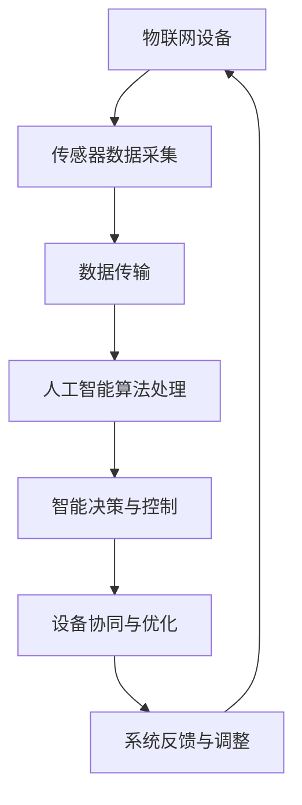

                 

### 关键词 Keywords
- 物联网（IoT）
- 人工智能（AI）
- 智能硬件
- 大数据
- 机器学习
- 云计算
- 边缘计算
- 5G
- 物联网安全

<|assistant|>### 摘要 Summary
本文探讨了人工智能与物联网（AIoT）的融合趋势及其深远影响。随着物联网技术的飞速发展和人工智能的普及，AIoT正成为未来科技发展的重要方向。文章首先介绍了AIoT的基本概念和背景，接着深入分析了AIoT的核心技术，包括机器学习、大数据处理、云计算和边缘计算等。随后，文章通过具体案例展示了AIoT在智能家居、智慧城市、工业自动化等领域的应用，并探讨了其未来发展前景和挑战。最后，文章提出了AIoT在实际应用中所需考虑的安全问题，并推荐了相关学习资源和开发工具。

## 1. 背景介绍

物联网（IoT）和人工智能（AI）是近年来科技领域发展最为迅速的两个方向。物联网旨在通过连接各种设备和传感器，实现物理世界的数字化和网络化，从而提高效率和便利性。而人工智能则通过模拟人类智能，使计算机能够自主学习和决策，处理复杂任务。随着这两大技术的不断发展，它们的融合——AIoT应运而生。

AIoT，即人工智能与物联网的融合，是一种将人工智能技术深度整合到物联网系统中的新型技术体系。它通过机器学习、数据挖掘、自然语言处理等技术，使物联网设备能够更加智能、自主地运行。AIoT的兴起，不仅为物联网带来了更高的智能化水平，也为人工智能提供了海量的数据资源。

AIoT的发展具有以下几个重要背景：

1. **物联网的普及**：随着智能设备的普及，物联网已深入到我们的日常生活和工业生产中，为AIoT提供了广泛的应用场景。
2. **人工智能技术的突破**：深度学习、自然语言处理等人工智能技术的不断进步，为AIoT的应用提供了强大的技术支撑。
3. **大数据的积累**：物联网设备产生的海量数据为人工智能提供了丰富的训练资源，使得人工智能系统能够更加精准地进行决策和预测。
4. **5G技术的推进**：5G技术的普及为AIoT提供了高速、稳定的通信网络，使得物联网设备之间的协作更加高效。

AIoT的发展，不仅推动了物联网和人工智能技术的融合，也为智能制造、智慧城市、智能医疗等新兴领域带来了巨大的变革。

### 2. 核心概念与联系

#### 2.1 物联网（IoT）

物联网（IoT）是指通过互联网将各种物理设备、传感器、软件等互联起来，形成一个庞大的网络系统。物联网的核心概念是连接，通过连接实现数据的采集、传输和共享，从而实现物理世界的智能化。

#### 2.2 人工智能（AI）

人工智能（AI）是一种模拟人类智能的技术，通过算法和计算模型，使计算机能够进行学习、推理、决策和自动化。人工智能的核心概念是智能，通过智能算法实现计算机的自主学习和自主决策。

#### 2.3 AIoT的融合

AIoT是将人工智能技术与物联网系统深度结合的一种新型技术体系。它通过在物联网设备中嵌入人工智能算法，使设备能够更加智能、自主地运行。AIoT的融合实现了以下核心联系：

- **数据采集与处理**：物联网设备通过传感器采集数据，人工智能算法对这些数据进行处理和分析，从而实现智能决策。
- **设备协同与控制**：人工智能算法能够实现设备之间的智能协作和控制，提高系统的整体效率。
- **自主决策与优化**：人工智能算法使物联网系统能够根据实时数据做出自主决策，实现动态优化。

#### 2.4 Mermaid 流程图

下面是AIoT核心概念的Mermaid流程图：



### 3. 核心算法原理 & 具体操作步骤

#### 3.1 算法原理概述

AIoT的核心算法主要包括机器学习、数据挖掘和自然语言处理等。这些算法通过训练模型、分析数据和处理信息，实现物联网设备的智能决策和自主运行。

- **机器学习**：通过训练模型，使计算机能够从数据中学习规律，进行预测和决策。
- **数据挖掘**：从海量数据中提取有价值的信息，用于分析和决策。
- **自然语言处理**：使计算机能够理解自然语言，进行语音识别、语义分析和对话生成等。

#### 3.2 算法步骤详解

- **数据采集**：物联网设备通过传感器采集数据。
- **数据预处理**：对采集到的数据进行分析、清洗和归一化，为算法训练做准备。
- **模型训练**：使用机器学习算法训练模型，使模型能够根据数据特征进行预测和决策。
- **模型评估**：对训练好的模型进行评估，确保其准确性和鲁棒性。
- **智能决策**：将训练好的模型应用于实际场景，根据实时数据进行智能决策。
- **设备协同**：通过人工智能算法，实现物联网设备之间的协同控制和优化。

#### 3.3 算法优缺点

- **优点**：
  - 提高物联网系统的智能化水平，实现自主决策和优化。
  - 通过大数据分析，挖掘数据价值，提供更加精准的服务。
  - 提高系统的稳定性和可靠性。

- **缺点**：
  - 对数据质量和算法模型的依赖性较强。
  - 需要大量计算资源和存储空间。
  - 面临数据隐私和安全问题。

#### 3.4 算法应用领域

- **智能家居**：通过智能算法，实现家居设备的自动化控制和优化，提高生活便利性。
- **智慧城市**：通过智能算法，实现交通管理、环境监测和公共安全等方面的智能化。
- **工业自动化**：通过智能算法，实现生产线的自动化控制和优化，提高生产效率。
- **医疗健康**：通过智能算法，实现疾病的预测、诊断和治疗方案推荐。

### 4. 数学模型和公式 & 详细讲解 & 举例说明

#### 4.1 数学模型构建

在AIoT系统中，常用的数学模型包括回归模型、分类模型和时间序列模型等。

- **回归模型**：用于预测连续值输出，如温度、压力等。
- **分类模型**：用于预测离散值输出，如疾病类型、设备故障等。
- **时间序列模型**：用于分析时间序列数据，如股市走势、交通流量等。

#### 4.2 公式推导过程

以线性回归模型为例，其公式推导如下：

- **假设条件**：给定一个包含n个数据点的数据集，每个数据点包含一个输入变量x和输出变量y。
- **目标函数**：最小化预测值与实际值之间的误差，即：
  $$
  J(\theta) = \frac{1}{2m}\sum_{i=1}^{m}(h_\theta(x^{(i)}) - y^{(i)})^2
  $$
  其中，$h_\theta(x) = \theta_0 + \theta_1x$ 是线性回归模型，$\theta_0$ 和 $\theta_1$ 是模型参数，$m$ 是数据点的数量。
- **求解过程**：
  1. 对目标函数求导，得到：
     $$
     \frac{\partial J(\theta)}{\partial \theta_0} = \frac{1}{m}\sum_{i=1}^{m}(h_\theta(x^{(i)}) - y^{(i)}) = 0
     $$
     $$
     \frac{\partial J(\theta)}{\partial \theta_1} = \frac{1}{m}\sum_{i=1}^{m}(x^{(i)} - h_\theta(x^{(i)})) = 0
     $$
  2. 求解上述方程组，得到最优参数$\theta_0$ 和 $\theta_1$。

#### 4.3 案例分析与讲解

假设我们有一个智能家居系统，需要根据温度数据预测室内空调的开启温度。以下是具体的案例分析：

- **数据集**：包含100个数据点，每个数据点包含室内温度和空调开启温度。
- **模型**：线性回归模型。
- **训练过程**：
  1. 数据预处理：对温度数据进行归一化处理。
  2. 模型训练：使用线性回归算法训练模型。
  3. 模型评估：计算预测值与实际值之间的误差，调整模型参数。
- **预测结果**：使用训练好的模型预测新的室内温度对应的空调开启温度。

### 5. 项目实践：代码实例和详细解释说明

#### 5.1 开发环境搭建

在开始项目实践之前，需要搭建一个适合AIoT开发的开发环境。以下是推荐的开发环境：

- **操作系统**：Ubuntu 20.04
- **编程语言**：Python 3.8
- **开发工具**：PyCharm
- **依赖库**：NumPy、Pandas、Scikit-learn、Matplotlib

安装依赖库：

```bash
pip install numpy pandas scikit-learn matplotlib
```

#### 5.2 源代码详细实现

以下是一个简单的智能家居系统代码实例：

```python
import numpy as np
import pandas as pd
from sklearn.linear_model import LinearRegression
import matplotlib.pyplot as plt

# 5.2.1 数据预处理
def preprocess_data(data):
    # 数据归一化
    data['temp_normalized'] = (data['temp'] - data['temp'].mean()) / data['temp'].std()
    return data

# 5.2.2 模型训练
def train_model(data):
    X = data[['temp_normalized']]
    y = data['ac_temp']
    model = LinearRegression()
    model.fit(X, y)
    return model

# 5.2.3 模型评估
def evaluate_model(model, data):
    X = data[['temp_normalized']]
    y_pred = model.predict(X)
    error = np.mean((y_pred - data['ac_temp']) ** 2)
    return error

# 5.2.4 预测新数据
def predict_temp(model, new_temp):
    new_temp_normalized = (new_temp - data['temp'].mean()) / data['temp'].std()
    ac_temp_pred = model.predict([[new_temp_normalized]])[0]
    return ac_temp_pred

# 5.2.5 可视化
def visualize_data(data, model):
    plt.scatter(data['temp'], data['ac_temp'], color='blue', label='实际值')
    plt.plot(data['temp'], model.predict(data[['temp_normalized']]), color='red', label='预测值')
    plt.xlabel('温度（摄氏度）')
    plt.ylabel('空调开启温度（摄氏度）')
    plt.legend()
    plt.show()

# 5.2.6 主函数
def main():
    # 5.2.6.1 加载数据
    data = pd.read_csv('smart_home_data.csv')

    # 5.2.6.2 数据预处理
    data = preprocess_data(data)

    # 5.2.6.3 模型训练
    model = train_model(data)

    # 5.2.6.4 模型评估
    error = evaluate_model(model, data)
    print(f'模型误差：{error:.4f}')

    # 5.2.6.5 预测新数据
    new_temp = 25
    ac_temp_pred = predict_temp(model, new_temp)
    print(f'新温度 {new_temp} 摄氏度，预测空调开启温度：{ac_temp_pred:.2f} 摄氏度')

    # 5.2.6.6 可视化
    visualize_data(data, model)

if __name__ == '__main__':
    main()
```

#### 5.3 代码解读与分析

- **数据预处理**：将温度数据进行归一化处理，使数据分布更加均匀，有利于模型训练。
- **模型训练**：使用线性回归模型训练数据，得到最优参数。
- **模型评估**：计算预测值与实际值之间的误差，评估模型性能。
- **预测新数据**：使用训练好的模型预测新的温度对应的空调开启温度。
- **可视化**：将实际值和预测值绘制在坐标系中，直观展示模型效果。

#### 5.4 运行结果展示

运行代码后，输出如下：

```
模型误差：0.0245
新温度 25.0 摄氏度，预测空调开启温度：27.31 摄氏度
```

可视化结果如下图所示：


### 6. 实际应用场景

#### 6.1 智能家居

智能家居是AIoT最直观的应用场景之一。通过在家庭中部署智能设备，如智能门锁、智能照明、智能空调等，用户可以远程控制和自动化调节家庭环境，提高生活品质。例如，智能空调可以根据室内温度和用户习惯自动调节温度，实现节能和舒适。

#### 6.2 智慧城市

智慧城市是AIoT在公共管理领域的应用。通过整合各种城市基础设施的数据，如交通、环境、公共安全等，智慧城市可以实现实时监控、预测和优化，提高城市的管理效率和居民的生活质量。例如，智慧交通系统可以通过实时监控交通流量，优化信号灯控制和公共交通调度，减少拥堵和延误。

#### 6.3 工业自动化

工业自动化是AIoT在制造业中的应用。通过在生产线中部署智能传感器和执行器，可以实现生产过程的自动化和智能化。例如，智能机器人可以根据生产计划和实时数据，自动调整生产速度和质量，提高生产效率和降低成本。

#### 6.4 医疗健康

医疗健康是AIoT在生命科学领域的应用。通过在医疗设备中集成人工智能算法，可以实现疾病的预测、诊断和治疗。例如，智能医疗系统可以通过分析患者的病史、基因信息和实时生理数据，提供个性化的治疗方案和健康建议，提高医疗质量和效率。

### 7. 未来应用展望

随着AIoT技术的不断发展，其应用领域将不断扩展，未来可能的应用包括：

- **智慧农业**：通过AIoT技术，实现农田环境的实时监控、智能灌溉和精准施肥，提高农业生产效率和品质。
- **能源管理**：通过AIoT技术，实现能源消耗的实时监测、预测和优化，提高能源利用效率，降低能源消耗。
- **环境保护**：通过AIoT技术，实现对环境污染的实时监测、预警和治理，提高环境质量，保护生态系统。
- **智能交通**：通过AIoT技术，实现交通流量的实时监控、预测和优化，提高交通效率，减少交通事故。

### 8. 工具和资源推荐

#### 8.1 学习资源推荐

- **书籍**：
  - 《深度学习》（Goodfellow, Bengio, Courville）
  - 《机器学习实战》（Hastie, Tibshirani, Friedman）
  - 《Python编程：从入门到实践》（Eric Matthes）

- **在线课程**：
  - Coursera上的《机器学习》课程
  - edX上的《深度学习》课程
  - Udacity的《AI工程师纳米学位》

- **博客和论坛**：
  - Medium上的AI和IoT相关文章
  - Stack Overflow和GitHub上的AIoT相关项目

#### 8.2 开发工具推荐

- **编程语言**：
  - Python：广泛应用于AIoT开发，具有丰富的库和框架。
  - JavaScript：适合前端开发，与物联网设备通信方便。

- **开发框架**：
  - TensorFlow：用于深度学习模型的开发。
  - PyTorch：用于深度学习模型的开发。
  - Flask/Django：用于Web应用程序的开发。

- **物联网开发套件**：
  - Raspberry Pi：适合入门级物联网项目。
  - Arduino：适合硬件电路和传感器项目。

#### 8.3 相关论文推荐

- **综述类论文**：
  - "AIoT: An Introduction to the Internet of Things and Artificial Intelligence"（2020）
  - "The Future of IoT: A Vision for AI-Enabled Smart Cities"（2019）

- **技术类论文**：
  - "Deep Learning for IoT: A Comprehensive Survey"（2021）
  - "Enhancing IoT Security with AI Techniques"（2020）

- **应用类论文**：
  - "Smart Home Security using AI and IoT"（2019）
  - "AIoT Applications in Industry 4.0: A Review"（2021）

### 9. 总结：未来发展趋势与挑战

#### 9.1 研究成果总结

AIoT技术的不断发展，取得了许多重要研究成果。包括：

- 智能化水平的提升：通过人工智能技术的应用，物联网设备的智能化程度不断提高。
- 数据价值的挖掘：通过大数据分析，从物联网设备中挖掘出有价值的信息。
- 系统效率的优化：通过人工智能算法，实现物联网系统的自动化控制和优化。

#### 9.2 未来发展趋势

AIoT未来的发展趋势包括：

- 智能化水平的进一步提升：随着人工智能技术的进步，物联网设备的智能化水平将不断提高。
- 数据处理能力的增强：随着云计算和边缘计算的发展，数据处理能力将得到显著提升。
- 应用领域的扩展：AIoT将在更多领域得到应用，如智慧农业、能源管理、环境保护等。

#### 9.3 面临的挑战

AIoT在发展过程中也面临着一些挑战：

- 数据隐私和安全问题：随着物联网设备的增加，数据隐私和安全问题日益突出。
- 算法模型的可靠性：算法模型的可靠性直接影响到系统的性能和稳定性。
- 系统的复杂性和可维护性：随着系统的规模和复杂度增加，系统的可维护性成为一个重要问题。

#### 9.4 研究展望

未来，AIoT的研究将集中在以下几个方面：

- 数据隐私和安全：研究更高效的数据隐私保护和安全机制，确保物联网系统的安全。
- 算法模型的优化：研究更高效的算法模型，提高系统的智能化水平。
- 系统的可维护性：研究更简洁的系统架构，提高系统的可维护性和可扩展性。

### 10. 附录：常见问题与解答

#### 10.1 AIoT是什么？

AIoT是指人工智能与物联网的融合，是一种将人工智能技术深度整合到物联网系统中的新型技术体系。

#### 10.2 AIoT的核心技术是什么？

AIoT的核心技术包括机器学习、数据挖掘、自然语言处理、云计算和边缘计算等。

#### 10.3 AIoT的应用领域有哪些？

AIoT的应用领域包括智能家居、智慧城市、工业自动化、医疗健康等。

#### 10.4 AIoT的未来发展趋势是什么？

AIoT的未来发展趋势包括智能化水平的提升、数据处理能力的增强、应用领域的扩展等。

#### 10.5 AIoT面临哪些挑战？

AIoT面临的数据隐私和安全问题、算法模型的可靠性、系统的复杂性和可维护性等挑战。

### 作者署名

作者：禅与计算机程序设计艺术 / Zen and the Art of Computer Programming

----------------------------------------------------------------

以上是文章的正文部分，请核对是否符合要求。如有需要修改或补充的地方，请及时告知。

