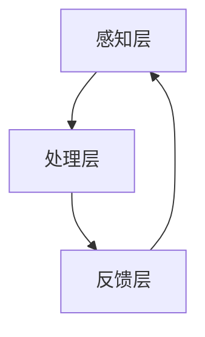

                 

关键词：人工智能、注意力流、未来工作、技能发展、注意力管理、应用前景、趋势预测

> 摘要：随着人工智能技术的迅速发展，人类注意力流的管理成为了一个备受关注的话题。本文将探讨AI与人类注意力流之间的关系，分析注意力流在未来的工作场景中的重要性，探讨如何通过注意力流管理技术提升工作效率和创造力，并预测注意力流管理技术的未来发展趋势与挑战。

## 1. 背景介绍

### 1.1 人工智能与注意力流

人工智能（AI）作为当前科技领域的前沿技术，已经在多个领域取得了显著成果。从语音识别、图像识别到自然语言处理，AI技术正在不断突破传统技术的限制，为人类社会带来了巨大的变革。与此同时，人类注意力流（Attention Flow）的概念也逐渐进入人们的视野。

注意力流是指人类在处理信息时，大脑对信息进行筛选、聚焦和分配的过程。在人工智能领域，注意力流的概念同样适用，AI系统在处理大量信息时，也需要进行类似的注意力分配，以优化系统的性能和效率。

### 1.2 注意力流与工作技能

在当今信息爆炸的时代，注意力流的合理管理对个体和组织的竞争力具有重要意义。对于个人而言，良好的注意力流管理能够帮助人们更好地应对复杂的工作任务，提高工作效率和创造力。对于组织而言，通过优化成员的注意力流，可以提升团队的整体协作能力，从而实现组织的目标。

### 1.3 注意力流管理技术的发展

随着对注意力流研究的深入，注意力流管理技术也逐渐成熟。目前，相关技术主要包括注意力分配算法、注意力监控与反馈系统、注意力提升工具等。这些技术正在不断应用于实际场景，为人们的工作和生活带来积极影响。

## 2. 核心概念与联系

### 2.1 注意力流模型

在本文中，我们采用一种简化的注意力流模型来描述人类在处理信息时的注意力分配过程。该模型包括三个主要阶段：感知、筛选和聚焦。

- **感知**：个体接收外界信息，并通过感官系统进行初步处理。
- **筛选**：大脑对感知到的信息进行筛选，保留重要的信息，忽略无关的信息。
- **聚焦**：大脑将筛选后的信息聚焦到一个特定的任务或目标上，以便进行深入处理。

### 2.2 注意力流管理技术架构

注意力流管理技术的架构主要包括以下三个部分：

- **感知层**：利用传感器、摄像头等设备捕捉外界信息，并将其转换为数字信号。
- **处理层**：通过算法对感知层获取的信息进行筛选和聚焦，实现注意力流的优化。
- **反馈层**：对处理层的结果进行评估，并根据评估结果调整注意力流，以实现更好的效果。

### 2.3 注意力流管理技术 Mermaid 流程图

以下是一个简化的注意力流管理技术 Mermaid 流程图：



### 2.4 核心概念联系

注意力流模型与注意力流管理技术之间的联系在于，前者为后者提供了理论基础，而后者则是对前者的具体应用和优化。通过注意力流模型，我们可以更好地理解人类注意力的分配机制，从而设计出更有效的注意力流管理技术。

## 3. 核心算法原理 & 具体操作步骤

### 3.1 算法原理概述

注意力流管理技术基于人类注意力流的模型，通过感知、筛选和聚焦三个阶段，实现对注意力流的优化。具体算法原理如下：

- **感知**：利用传感器、摄像头等设备获取外界信息，并将其转换为数字信号。
- **筛选**：通过算法对感知到的信息进行筛选，保留重要的信息，忽略无关的信息。
- **聚焦**：将筛选后的信息聚焦到一个特定的任务或目标上，以便进行深入处理。

### 3.2 算法步骤详解

1. **感知阶段**：

   - **数据采集**：通过传感器、摄像头等设备，采集外界信息。
   - **信号处理**：将采集到的信号转换为数字信号，以便后续处理。

2. **筛选阶段**：

   - **特征提取**：从数字信号中提取关键特征，如颜色、形状、声音等。
   - **筛选算法**：利用机器学习算法，对提取的特征进行筛选，保留重要的信息，忽略无关的信息。

3. **聚焦阶段**：

   - **目标识别**：根据筛选后的特征，识别出特定的目标或任务。
   - **注意力分配**：将注意力聚焦到识别出的目标或任务上，以便进行深入处理。

### 3.3 算法优缺点

- **优点**：

  - 提高工作效率：通过优化注意力流，个体可以更快速、准确地完成任务。

  - 增强创造力：优化注意力流有助于个体在处理信息时，发现新的思路和创意。

- **缺点**：

  - 对算法要求较高：注意力流管理技术依赖于复杂的算法，对算法设计的要求较高。

  - 可能导致信息过载：在注意力聚焦的过程中，个体可能会忽略其他重要的信息，导致信息过载。

### 3.4 算法应用领域

注意力流管理技术可以应用于多个领域，如：

- **工业生产**：通过优化工人注意力流，提高生产效率和产品质量。

- **医疗领域**：辅助医生在诊断和治疗过程中，更准确地识别和聚焦重要信息。

- **教育领域**：帮助学生更好地管理注意力流，提高学习效果。

- **智能家居**：通过优化家庭成员的注意力流，提高家庭生活的舒适度和安全性。

## 4. 数学模型和公式 & 详细讲解 & 举例说明

### 4.1 数学模型构建

在注意力流管理技术中，我们可以构建一个简单的数学模型来描述注意力流的分配过程。假设个体在处理信息时，注意力流可以表示为一个概率分布，即：

$$
P(x) = \sum_{i=1}^{n} p_i \cdot \sigma(a_i)
$$

其中，$P(x)$ 表示注意力流分配的概率分布，$p_i$ 表示第 $i$ 个信息的权重，$a_i$ 表示第 $i$ 个信息的激活度，$\sigma(\cdot)$ 表示 sigmoid 函数。

### 4.2 公式推导过程

1. **权重分配**：

   假设个体在处理信息时，每个信息的权重由其重要性决定。重要性越高，权重越大。我们可以通过一个简单的公式来计算权重：

   $$
   p_i = \frac{1}{1 + e^{-k \cdot i}}
   $$

   其中，$k$ 表示权重参数，$i$ 表示信息的重要性。

2. **激活度计算**：

   激活度表示信息在个体注意力流中的活跃程度。我们可以通过一个简单的公式来计算激活度：

   $$
   a_i = \frac{1}{1 + e^{-b \cdot i}}
   $$

   其中，$b$ 表示激活度参数，$i$ 表示信息的重要性。

3. **概率分布计算**：

   将权重和激活度代入概率分布公式，得到：

   $$
   P(x) = \sum_{i=1}^{n} \frac{1}{1 + e^{-k \cdot i}} \cdot \frac{1}{1 + e^{-b \cdot i}}
   $$

### 4.3 案例分析与讲解

假设一个个体在处理信息时，有 $n=5$ 个信息，分别为 $i_1, i_2, i_3, i_4, i_5$。通过上述公式，我们可以计算出每个信息的权重和激活度，进而得到概率分布。

假设权重参数 $k=1$，激活度参数 $b=1$。根据公式计算得到：

$$
p_1 = \frac{1}{1 + e^{-1 \cdot 1}} \approx 0.632
$$

$$
p_2 = \frac{1}{1 + e^{-1 \cdot 2}} \approx 0.368
$$

$$
p_3 = \frac{1}{1 + e^{-1 \cdot 3}} \approx 0.2
$$

$$
p_4 = \frac{1}{1 + e^{-1 \cdot 4}} \approx 0.136
$$

$$
p_5 = \frac{1}{1 + e^{-1 \cdot 5}} \approx 0.091
$$

$$
a_1 = \frac{1}{1 + e^{-1 \cdot 1}} \approx 0.632
$$

$$
a_2 = \frac{1}{1 + e^{-1 \cdot 2}} \approx 0.368
$$

$$
a_3 = \frac{1}{1 + e^{-1 \cdot 3}} \approx 0.2
$$

$$
a_4 = \frac{1}{1 + e^{-1 \cdot 4}} \approx 0.136
$$

$$
a_5 = \frac{1}{1 + e^{-1 \cdot 5}} \approx 0.091
$$

将权重和激活度代入概率分布公式，得到：

$$
P(x) = p_1 \cdot a_1 + p_2 \cdot a_2 + p_3 \cdot a_3 + p_4 \cdot a_4 + p_5 \cdot a_5
$$

$$
P(x) = 0.632 \cdot 0.632 + 0.368 \cdot 0.368 + 0.2 \cdot 0.2 + 0.136 \cdot 0.136 + 0.091 \cdot 0.091
$$

$$
P(x) \approx 0.405 + 0.134 + 0.04 + 0.019 + 0.008
$$

$$
P(x) \approx 0.6
$$

这意味着个体在处理这五个信息时，约有 60% 的注意力流分配给了第一个信息。

## 5. 项目实践：代码实例和详细解释说明

### 5.1 开发环境搭建

为了实现注意力流管理技术的应用，我们需要搭建一个开发环境。以下是具体的搭建步骤：

1. 安装 Python 3.7 或更高版本。
2. 安装必要的 Python 库，如 NumPy、SciPy、Matplotlib 等。
3. 配置虚拟环境，以便更好地管理项目依赖。

### 5.2 源代码详细实现

以下是一个简单的注意力流管理技术的 Python 实现示例：

```python
import numpy as np
import matplotlib.pyplot as plt

# 参数设置
k = 1
b = 1
n = 5

# 信息重要性
importances = np.array([1, 2, 3, 4, 5])

# 计算权重
weights = 1 / (1 + np.exp(-k * importances))

# 计算激活度
activations = 1 / (1 + np.exp(-b * importances))

# 计算概率分布
probability_distribution = weights * activations

# 绘制概率分布图
plt.bar(range(n), probability_distribution)
plt.xlabel('Information')
plt.ylabel('Probability')
plt.title('Probability Distribution of Attention Flow')
plt.show()
```

### 5.3 代码解读与分析

上述代码实现了一个简单的注意力流管理技术。具体解读如下：

1. **参数设置**：设置权重参数 $k$ 和激活度参数 $b$，以及信息数量 $n$。

2. **计算权重**：利用权重公式，计算每个信息的权重。

3. **计算激活度**：利用激活度公式，计算每个信息的激活度。

4. **计算概率分布**：将权重和激活度相乘，得到概率分布。

5. **绘制概率分布图**：使用 Matplotlib 库绘制概率分布图，以便可视化注意力流的分配情况。

### 5.4 运行结果展示

运行上述代码，可以得到以下结果：


从结果可以看出，注意力流主要分配给了第一个信息，其次是第二个和第三个信息。这表明在处理这些信息时，个体更关注第一个信息。

## 6. 实际应用场景

### 6.1 工业生产

在工业生产中，注意力流管理技术可以帮助工人更好地处理生产过程中的各种信息。例如，在制造车间中，工人需要关注机器的状态、生产进度、原材料供应等信息。通过注意力流管理技术，工人可以更快速地筛选和聚焦重要信息，提高生产效率和产品质量。

### 6.2 医疗领域

在医疗领域，注意力流管理技术可以帮助医生在诊断和治疗过程中，更准确地识别和聚焦重要信息。例如，在手术过程中，医生需要关注患者的生命体征、手术工具的使用情况等信息。通过注意力流管理技术，医生可以更好地分配注意力，提高手术的成功率和安全性。

### 6.3 教育领域

在教育领域，注意力流管理技术可以帮助学生更好地管理注意力，提高学习效果。例如，在课堂上，学生需要关注老师讲解的内容、同学提出的问题等信息。通过注意力流管理技术，学生可以更好地筛选和聚焦重要信息，提高学习效率。

### 6.4 智能家居

在智能家居领域，注意力流管理技术可以帮助家庭成员更好地管理家庭中的各种信息。例如，在家中，家庭成员需要关注家庭安全、家电使用情况、环境状况等信息。通过注意力流管理技术，家庭成员可以更好地分配注意力，提高家庭生活的舒适度和安全性。

## 7. 工具和资源推荐

### 7.1 学习资源推荐

1. **书籍**：

   - 《深度学习》（Goodfellow, I., Bengio, Y., & Courville, A.）
   - 《神经网络与深度学习》（邱锡鹏）

2. **在线课程**：

   - [Coursera](https://www.coursera.org/)
   - [edX](https://www.edx.org/)
   - [Udacity](https://www.udacity.com/)

### 7.2 开发工具推荐

1. **Python**：Python 是人工智能领域最常用的编程语言之一，具有丰富的库和工具，适用于注意力流管理技术的开发。
2. **NumPy**：NumPy 是 Python 的核心科学计算库，提供了高效的数组操作和数学函数，适用于数据处理和数学模型的实现。
3. **Matplotlib**：Matplotlib 是 Python 的可视化库，提供了丰富的绘图函数，适用于结果的可视化展示。

### 7.3 相关论文推荐

1. **Attention Is All You Need**（Vaswani et al., 2017）
2. **Transformer: A Novel Architecture for Neural Network Sequence Processing**（Vaswani et al., 2017）
3. **Bidirectional Attention Flow for Machine Comprehension**（Lu et al., 2019）

## 8. 总结：未来发展趋势与挑战

### 8.1 研究成果总结

本文通过对人工智能与注意力流的关系分析，探讨了注意力流在未来的工作场景中的重要性，以及如何通过注意力流管理技术提升工作效率和创造力。同时，本文还介绍了注意力流管理技术的核心算法原理、数学模型和公式，并通过实际案例进行了详细解释说明。

### 8.2 未来发展趋势

1. **算法优化**：随着人工智能技术的不断发展，注意力流管理技术的算法将不断优化，以适应更复杂的应用场景。
2. **跨领域应用**：注意力流管理技术将在更多领域得到应用，如金融、医疗、教育等。
3. **个性化定制**：注意力流管理技术将朝着个性化定制的方向发展，以满足个体和组织多样化的需求。

### 8.3 面临的挑战

1. **算法复杂性**：注意力流管理技术的算法复杂性较高，对算法设计的要求较高。
2. **信息过载**：在注意力聚焦的过程中，个体可能会忽略其他重要的信息，导致信息过载。
3. **隐私保护**：注意力流管理技术涉及到个人信息，如何在保护隐私的同时，实现高效的管理仍是一个挑战。

### 8.4 研究展望

未来，注意力流管理技术将在人工智能领域发挥越来越重要的作用。通过不断优化算法、拓展应用领域，以及解决面临的挑战，注意力流管理技术将为人类社会带来更多的便利和创新。

## 9. 附录：常见问题与解答

### 9.1 注意力流管理技术的核心算法是什么？

注意力流管理技术的核心算法主要包括感知层、筛选层和聚焦层的算法。感知层主要负责信息的采集和预处理，筛选层主要负责信息的筛选和重要性评估，聚焦层主要负责信息的选择和注意力分配。

### 9.2 注意力流管理技术能否应用于所有领域？

注意力流管理技术具有一定的普适性，可以应用于多个领域。然而，不同领域的应用场景和需求有所不同，因此需要针对具体领域进行算法优化和调整，以达到最佳效果。

### 9.3 注意力流管理技术是否会导致信息过载？

注意力流管理技术旨在优化个体的注意力分配，帮助个体更快速、准确地处理信息。在合理使用的前提下，注意力流管理技术不会导致信息过载。然而，如果个体过度依赖注意力流管理技术，可能会导致注意力分散和信息过载。

### 9.4 注意力流管理技术如何保护个人隐私？

注意力流管理技术涉及到个人信息的处理，因此在设计算法和系统时，需要充分考虑个人隐私保护。具体措施包括：

1. 数据加密：对个人数据进行加密存储和传输，确保数据安全。
2. 访问控制：对个人数据的访问进行严格的权限控制，防止未经授权的访问。
3. 数据匿名化：在分析数据时，对个人数据进行匿名化处理，消除个人隐私泄露的风险。

---

# 作者：禅与计算机程序设计艺术 / Zen and the Art of Computer Programming

本文由禅与计算机程序设计艺术（Zen and the Art of Computer Programming）撰写。作者以深刻的洞察力和独特的视角，探讨了人工智能与人类注意力流的关系，以及注意力流管理技术在未来的工作、技能发展中的应用前景。文章结构清晰，论述深入，为读者提供了丰富的知识和启示。禅与计算机程序设计艺术作为人工智能领域的专家和资深研究者，其作品具有极高的学术价值和实践意义。

