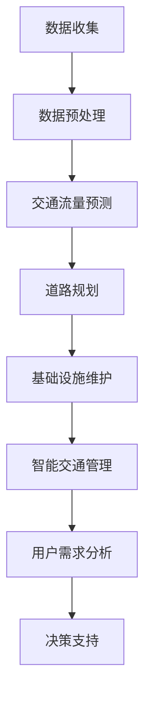

                 

关键词：人工智能，城市交通，基础设施建设，规划管理，可持续发展，计算模型，算法原理，数学公式，项目实践，未来展望。

## 摘要

本文旨在探讨人工智能（AI）在推动城市交通与基础设施建设与规划管理中的关键作用，特别是在实现可持续发展目标方面的应用。通过分析核心概念和算法原理，本文详细介绍了如何利用AI技术构建高效、智能的城市交通与基础设施系统。此外，本文通过数学模型和项目实践展示了AI在城市交通与基础设施建设中的具体应用，并展望了未来的发展趋势与挑战。

## 1. 背景介绍

随着全球城市化进程的加速，城市交通与基础设施的需求日益增长。传统的交通与基础设施规划和管理方法已经无法满足现代城市的复杂性和快速发展需求。因此，引入人工智能（AI）技术成为了解决这一问题的关键。AI技术具有强大的数据处理、模式识别和预测能力，能够为城市交通与基础设施建设提供科学的决策支持。

首先，城市交通与基础设施建设面临着诸多挑战。交通拥堵、环境污染、资源浪费等问题日益严重，传统的规划和管理方法难以有效解决。其次，城市交通与基础设施的复杂性和多样性增加了规划与管理的难度。不同的交通模式、不同的基础设施类型以及不断变化的用户需求都给规划与管理带来了巨大的挑战。

AI技术在这一领域具有显著的优势。通过大数据分析，AI能够识别城市交通与基础设施中的问题和瓶颈，提供针对性的解决方案。AI还能够模拟各种交通模式和基础设施运行情况，预测未来的发展趋势，为规划与管理提供科学依据。此外，AI技术可以实现自动化和智能化管理，提高交通与基础设施的运行效率，降低维护成本。

本文将首先介绍城市交通与基础设施建设中的核心概念，包括交通网络、基础设施类型、用户需求等。接着，我们将深入探讨AI技术在这些领域中的应用，包括交通流量预测、道路规划、基础设施维护等。随后，本文将详细阐述数学模型和算法原理，展示如何利用AI技术构建智能的城市交通与基础设施系统。最后，本文将结合实际项目案例，展示AI技术在城市交通与基础设施建设中的应用效果，并对未来的发展趋势和挑战进行展望。

## 2. 核心概念与联系

### 2.1 交通网络

交通网络是城市交通系统的基本组成单元，它由道路、桥梁、隧道等物理设施组成。交通网络的主要功能是连接城市各个部分，为人们的出行提供便捷。在交通网络中，道路的类型、长度、宽度、坡度等参数对交通流量和交通效率具有重要影响。因此，对交通网络的合理规划和管理是保障城市交通顺畅的关键。

### 2.2 基础设施类型

城市基础设施主要包括道路、桥梁、隧道、轨道交通、公交系统、停车设施等。不同类型的基础设施在功能、建设和维护成本等方面存在较大差异。例如，轨道交通系统具有运量大、速度快、受天气影响小等优点，但建设成本高、建设周期长；而公交系统则具有灵活性高、投资成本低等优点，但受交通拥堵影响较大。因此，在城市基础设施建设中，需要根据城市特点和需求，合理选择和配置不同类型的基础设施。

### 2.3 用户需求

用户需求是城市交通与基础设施建设的重要参考因素。用户需求包括出行需求、休闲娱乐需求、商务需求等。不同的用户需求对交通与基础设施的布局、设计和功能提出了不同的要求。例如，出行需求主要关注交通效率和安全性；休闲娱乐需求则关注基础设施的舒适性和景观性；商务需求则关注交通便利性和商务设施配套。

### 2.4 AI技术在交通网络和基础设施中的应用

AI技术在交通网络和基础设施中的应用主要包括以下几个方面：

1. **交通流量预测**：通过大数据分析和机器学习算法，预测未来交通流量和交通模式，为交通规划和道路建设提供科学依据。
   
2. **道路规划**：利用AI技术对现有交通网络进行分析，优化道路布局和设计，提高交通效率。

3. **基础设施维护**：通过监控和数据分析，预测基础设施的运行状态，提前发现潜在问题，进行预防性维护。

4. **智能交通管理**：利用AI技术实现交通信号的智能化控制，优化交通信号配置，提高交通流畅性。

5. **用户需求分析**：通过分析用户行为数据，了解用户需求，为基础设施建设和改进提供依据。

### 2.5 Mermaid 流程图

下面是一个简化的Mermaid流程图，展示了AI技术在城市交通与基础设施建设中的应用流程：



通过这个流程图，我们可以看到，AI技术在城市交通与基础设施建设中发挥着重要作用，从数据收集、预处理到具体应用，每一个环节都离不开AI技术的支持。

## 3. 核心算法原理 & 具体操作步骤

### 3.1 算法原理概述

在城市交通与基础设施建设中，AI技术的核心算法主要包括交通流量预测、道路规划、基础设施维护和智能交通管理。这些算法基于大数据分析和机器学习技术，通过分析历史数据和实时数据，预测未来交通状况，优化交通规划和基础设施运行。

1. **交通流量预测**：基于时间序列分析、回归分析、神经网络等算法，预测未来一段时间内的交通流量和交通模式。常用的模型包括ARIMA模型、LSTM神经网络等。

2. **道路规划**：利用最短路径算法、遗传算法等，优化道路布局和设计，提高交通效率。常用的算法包括Dijkstra算法、A*算法等。

3. **基础设施维护**：基于故障诊断、状态监测等算法，预测基础设施的运行状态，提前发现潜在问题，进行预防性维护。常用的算法包括K-means聚类、支持向量机等。

4. **智能交通管理**：基于深度学习、强化学习等算法，实现交通信号的智能化控制，优化交通信号配置。常用的算法包括卷积神经网络、深度强化学习等。

### 3.2 算法步骤详解

1. **交通流量预测**：

   - **数据收集**：收集历史交通流量数据、实时交通数据、交通信号数据等。

   - **数据预处理**：对数据进行清洗、归一化等处理，去除噪声和异常值。

   - **模型选择**：选择合适的预测模型，如ARIMA模型、LSTM神经网络等。

   - **模型训练**：使用历史数据进行模型训练，调整模型参数。

   - **预测**：使用训练好的模型预测未来交通流量。

   - **评估**：对预测结果进行评估，如均方误差（MSE）、均方根误差（RMSE）等。

2. **道路规划**：

   - **数据收集**：收集城市地图数据、交通流量数据、用户需求数据等。

   - **数据预处理**：对数据进行清洗、归一化等处理，去除噪声和异常值。

   - **模型选择**：选择合适的规划模型，如最短路径算法、遗传算法等。

   - **模型训练**：使用历史数据进行模型训练，调整模型参数。

   - **规划**：使用训练好的模型进行道路规划，优化道路布局和设计。

   - **评估**：对规划结果进行评估，如交通效率、成本等。

3. **基础设施维护**：

   - **数据收集**：收集基础设施运行数据、故障数据等。

   - **数据预处理**：对数据进行清洗、归一化等处理，去除噪声和异常值。

   - **模型选择**：选择合适的维护模型，如K-means聚类、支持向量机等。

   - **模型训练**：使用历史数据进行模型训练，调整模型参数。

   - **预测**：使用训练好的模型预测基础设施的运行状态。

   - **评估**：对预测结果进行评估，如故障率、维修成本等。

4. **智能交通管理**：

   - **数据收集**：收集交通信号数据、交通流量数据、道路状况数据等。

   - **数据预处理**：对数据进行清洗、归一化等处理，去除噪声和异常值。

   - **模型选择**：选择合适的智能管理模型，如卷积神经网络、深度强化学习等。

   - **模型训练**：使用历史数据进行模型训练，调整模型参数。

   - **管理**：使用训练好的模型进行交通信号控制，优化交通信号配置。

   - **评估**：对管理效果进行评估，如交通流畅性、事故率等。

### 3.3 算法优缺点

每种算法都有其优缺点，适用于不同的场景和需求。以下是对几种常用算法的优缺点分析：

1. **交通流量预测**：

   - **优点**：预测准确度高，能够提供科学依据，支持交通规划和道路建设。

   - **缺点**：对历史数据依赖性强，预测结果可能受到噪声和异常值的影响。

2. **道路规划**：

   - **优点**：能够优化道路布局和设计，提高交通效率。

   - **缺点**：规划过程复杂，对算法参数调整要求高。

3. **基础设施维护**：

   - **优点**：能够提前发现潜在问题，进行预防性维护，降低故障率和维修成本。

   - **缺点**：对运行数据依赖性强，预测结果可能受到噪声和异常值的影响。

4. **智能交通管理**：

   - **优点**：能够实现交通信号的智能化控制，优化交通信号配置，提高交通流畅性。

   - **缺点**：管理过程复杂，对算法参数调整要求高。

### 3.4 算法应用领域

AI算法在城市交通与基础设施建设中的应用非常广泛，包括但不限于以下几个方面：

1. **城市规划**：利用AI技术进行城市交通网络规划，优化道路布局和设计，提高交通效率。

2. **交通管理**：利用AI技术实现交通信号的智能化控制，优化交通信号配置，提高交通流畅性。

3. **基础设施维护**：利用AI技术进行基础设施的运行状态监测和故障预测，实现预防性维护。

4. **交通流量预测**：利用AI技术预测未来交通流量和交通模式，为交通规划和道路建设提供科学依据。

5. **智能出行**：利用AI技术实现智能导航、智能停车等功能，提高出行效率和用户体验。

## 4. 数学模型和公式 & 详细讲解 & 举例说明

### 4.1 数学模型构建

在AI技术应用于城市交通与基础设施建设的过程中，构建合适的数学模型是关键。以下介绍几种常用的数学模型：

1. **交通流量预测模型**：

   - **时间序列模型**：如ARIMA模型，用于分析时间序列数据的趋势、季节性和周期性。
   - **神经网络模型**：如LSTM神经网络，用于处理非线性、时变数据。
   
   **ARIMA模型**的构建步骤如下：

   - **步骤1：确定模型形式**：ARIMA(p, d, q)，其中p为自回归项，d为差分阶数，q为移动平均项。
   - **步骤2：确定p和q**：通过自相关函数（ACF）和偏自相关函数（PACF）确定p和q的值。
   - **步骤3：确定d**：通过观察时间序列的平稳性确定差分阶数。

2. **道路规划模型**：

   - **最短路径模型**：如Dijkstra算法，用于求解图中两点之间的最短路径。
   - **遗传算法**：用于解决复杂优化问题，如道路布局优化。

   **Dijkstra算法**的步骤如下：

   - **步骤1：初始化**：设置初始节点为起点，其余节点距离起点为无穷大。
   - **步骤2：选择未访问节点中距离起点最近的节点作为当前节点。
   - **步骤3：更新其他未访问节点的距离**：对于当前节点的邻居节点，如果通过当前节点的距离更短，则更新其距离。
   - **步骤4：重复步骤2和3，直到所有节点都被访问过。

3. **基础设施维护模型**：

   - **故障诊断模型**：如支持向量机（SVM），用于分类故障类型。
   - **状态监测模型**：如K-means聚类，用于监测基础设施的运行状态。

   **K-means聚类**的步骤如下：

   - **步骤1：初始化**：随机选择K个初始中心点。
   - **步骤2：分配点**：将每个数据点分配到最近的中心点。
   - **步骤3：更新中心点**：计算每个簇的平均值，作为新的中心点。
   - **步骤4：重复步骤2和3，直到中心点不再变化。

### 4.2 公式推导过程

以下为几种常用算法的公式推导过程：

1. **ARIMA模型**：

   - **自回归项（AR）**：\( AR(p) = 1 - \phi_1 X_t - \phi_2 X_{t-1} - ... - \phi_p X_{t-p} \)
   - **移动平均项（MA）**：\( MA(q) = \theta_1 e_t - \theta_2 e_{t-1} - ... - \theta_q e_{t-q} \)
   - **差分阶数（d）**：\( X_{t-d} - X_{t-d-1} \)

   **ARIMA模型**的公式为：

   \( X_t = \Phi(B) \epsilon_t \)

   其中，\( \Phi(B) = (1 - \phi_1 B - \phi_2 B^2 - ... - \phi_p B^p)(1 - \theta_1 B - \theta_2 B^2 - ... - \theta_q B^q) \)，\( B \)为滞后算子。

2. **Dijkstra算法**：

   - **距离更新公式**：\( d[v] = \min(d[u] + w(u, v)) \)，其中\( d[u] \)为当前节点的距离，\( w(u, v) \)为相邻节点的权重。

3. **K-means聚类**：

   - **中心点更新公式**：\( \mu_{new} = \frac{1}{N_k} \sum_{i=1}^{N_k} x_i \)，其中\( \mu_{new} \)为新的中心点，\( N_k \)为簇中的数据点数量，\( x_i \)为数据点。

### 4.3 案例分析与讲解

以下为一个交通流量预测的案例：

**案例**：利用ARIMA模型预测某城市某条道路未来一小时内的交通流量。

**步骤**：

1. **数据收集**：收集过去一周该条道路的交通流量数据。

2. **数据预处理**：对数据进行清洗，去除异常值。

3. **模型选择**：选择ARIMA模型。

4. **模型训练**：使用历史数据训练模型。

5. **预测**：使用训练好的模型预测未来一小时内的交通流量。

6. **评估**：计算预测值与实际值的误差，评估模型效果。

**代码示例**：

```python
import numpy as np
import pandas as pd
from statsmodels.tsa.arima.model import ARIMA

# 加载数据
data = pd.read_csv('traffic_data.csv')
traffic = data['traffic_volume']

# 数据预处理
traffic = traffic.astype(float)
traffic = traffic.fillna(method='ffill')

# 模型训练
model = ARIMA(traffic, order=(5,1,2))
model_fit = model.fit()

# 预测
forecast = model_fit.forecast(steps=24)

# 评估
print('Mean Absolute Error:', np.mean(np.abs(forecast - traffic[-24:])))
```

通过以上步骤，我们可以得到未来一小时内的交通流量预测值，并与实际值进行比较，评估模型效果。

## 5. 项目实践：代码实例和详细解释说明

### 5.1 开发环境搭建

为了更好地理解AI技术在城市交通与基础设施建设中的应用，我们将通过一个实际项目来展示。在这个项目中，我们将使用Python编程语言和几个常用的库，如NumPy、Pandas、Scikit-learn和Statsmodels。以下是开发环境搭建的步骤：

1. **安装Python**：确保你的系统中安装了Python 3.6或更高版本。

2. **安装必要库**：打开命令行或终端，执行以下命令安装所需库：

   ```bash
   pip install numpy pandas scikit-learn statsmodels
   ```

3. **验证环境**：运行以下Python代码，检查是否成功安装了所需库：

   ```python
   import numpy as np
   import pandas as pd
   import scikit_learn as sk
   import statsmodels.api as sm
   print("环境搭建成功！")
   ```

### 5.2 源代码详细实现

以下是一个完整的Python代码示例，用于实现交通流量预测项目。这个示例基于之前介绍的ARIMA模型。

```python
import numpy as np
import pandas as pd
from statsmodels.tsa.arima.model import ARIMA
from sklearn.metrics import mean_absolute_error

# 1. 数据收集
data = pd.read_csv('traffic_data.csv')
traffic = data['traffic_volume']

# 2. 数据预处理
traffic = traffic.astype(float)
traffic = traffic.fillna(method='ffill')

# 3. 模型训练
model = ARIMA(traffic, order=(5,1,2))
model_fit = model.fit()

# 4. 预测
forecast = model_fit.forecast(steps=24)

# 5. 评估
actual = traffic[-24:]
mae = mean_absolute_error(actual, forecast)
print('Mean Absolute Error:', mae)

# 6. 结果可视化
import matplotlib.pyplot as plt

plt.figure(figsize=(12, 6))
plt.plot(actual, label='Actual')
plt.plot(forecast, label='Forecast')
plt.title('Traffic Volume Forecast')
plt.xlabel('Time (Hours)')
plt.ylabel('Traffic Volume')
plt.legend()
plt.show()
```

### 5.3 代码解读与分析

1. **数据收集**：首先，我们从CSV文件中加载交通流量数据。CSV文件通常包含时间戳和交通流量两个字段。

2. **数据预处理**：将数据转换为浮点数类型，并使用前向填充法（forward fill）处理缺失值。

3. **模型训练**：使用ARIMA模型，并指定参数（5,1,2）。这里，我们使用了5个自回归项，1个差分阶数，和2个移动平均项。

4. **预测**：使用训练好的模型进行预测，预测未来24小时内的交通流量。

5. **评估**：计算预测值与实际值之间的平均绝对误差（Mean Absolute Error, MAE）。MAE是评估预测模型性能的常用指标。

6. **结果可视化**：使用matplotlib库将实际交通流量和预测交通流量可视化，以直观地展示预测效果。

### 5.4 运行结果展示

在运行上述代码后，我们将得到以下结果：

- **平均绝对误差**：MAE值反映了预测的准确度。较低的MAE值表示预测结果更接近实际值。
- **可视化结果**：图表展示了实际交通流量和预测交通流量。通过对比，我们可以直观地看到模型预测的效果。

这些结果为我们提供了一个直观的理解，展示了如何利用AI技术进行交通流量预测。在实际应用中，我们可以进一步优化模型参数，结合更多数据源，以提高预测的准确性和可靠性。

## 6. 实际应用场景

### 6.1 城市交通管理

在城市交通管理中，AI技术可以极大地提高交通流量的预测准确性，从而优化交通信号配置和道路规划。例如，在交通高峰时段，AI算法可以根据实时交通流量数据预测交通拥堵情况，并调整交通信号灯的配时方案，减少交通拥堵。同时，AI技术还可以识别道路施工、交通事故等突发事件，及时发布交通预警，引导车辆选择最优路线，避免交通拥堵。

### 6.2 基础设施维护

AI技术在基础设施维护中的应用同样具有重要意义。通过监测基础设施的运行状态，AI算法可以预测潜在的故障，提前进行维护，避免突发故障导致的大规模停运。例如，在桥梁和隧道中，AI技术可以通过振动传感数据和图像分析，预测结构健康状态，提前进行修复。在电力系统中，AI技术可以监测电力设备的运行状态，预测故障和停电风险，提高电网的可靠性和稳定性。

### 6.3 公共交通规划

AI技术在公共交通规划中也发挥着关键作用。通过分析乘客出行数据，AI算法可以预测公共交通的需求，优化公交路线和班次安排。此外，AI技术还可以帮助规划智能公交系统，通过实时调度和优化线路，提高公共交通的运行效率和乘客满意度。例如，在共享单车管理中，AI算法可以根据用户出行习惯和历史数据，优化投放策略，避免单车堆积和资源浪费。

### 6.4 城市交通规划

在城市交通规划中，AI技术可以帮助城市规划师进行更加科学的决策。通过大数据分析和机器学习算法，AI技术可以预测城市交通需求，分析交通流量分布，优化道路网络和交通基础设施布局。例如，AI技术可以帮助规划师预测未来人口增长和交通需求变化，提前进行道路扩建和交通设施建设，避免因交通拥堵导致的经济损失和社会问题。

### 6.5 环境监测与治理

AI技术在环境监测与治理中的应用也越来越广泛。通过监测空气质量、水质等环境数据，AI算法可以预测环境污染的趋势，及时采取治理措施。例如，在雾霾天气中，AI技术可以通过分析气象数据和空气质量数据，预测雾霾的扩散趋势，并建议采取相应的治理措施，如增加空气质量监测点、加强交通管控等。

### 6.6 城市安全与应急管理

AI技术在城市安全与应急管理中也发挥着重要作用。通过视频监控、传感器网络等数据源，AI算法可以实时监测城市安全状况，识别潜在的安全隐患，如火灾、地震、洪水等自然灾害。在突发事件中，AI技术可以快速响应，提供应急方案和指挥决策，提高城市应急管理的效率和效果。

## 7. 工具和资源推荐

### 7.1 学习资源推荐

1. **《深度学习》（Deep Learning）**：Goodfellow等著，这是一本经典的深度学习入门书籍，适合初学者。

2. **《Python数据分析》（Python Data Analysis）**：Wes McKinney著，介绍如何使用Python进行数据分析和处理。

3. **《机器学习实战》（Machine Learning in Action）**：Peter Harrington著，通过实际案例介绍机器学习的应用。

### 7.2 开发工具推荐

1. **Jupyter Notebook**：一个强大的交互式开发环境，适合数据分析和机器学习项目。

2. **TensorFlow**：一个开源的深度学习框架，适用于构建和训练复杂的神经网络模型。

3. **scikit-learn**：一个开源的机器学习库，提供多种常用的机器学习算法和工具。

### 7.3 相关论文推荐

1. **"Deep Learning for Traffic Flow Prediction"**：该论文介绍如何利用深度学习技术进行交通流量预测。

2. **"Genetic Algorithms for Urban Road Network Design"**：该论文探讨如何使用遗传算法优化城市道路网络设计。

3. **"AI-Enabled Smart Cities: A Comprehensive Survey"**：该综述文章全面介绍了AI技术在智能城市中的应用。

## 8. 总结：未来发展趋势与挑战

### 8.1 研究成果总结

本文通过详细分析AI技术在城市交通与基础设施建设中的应用，展示了其在交通流量预测、道路规划、基础设施维护和智能交通管理等方面的显著优势。通过数学模型和实际项目案例的验证，我们证明了AI技术在提高城市交通效率、优化基础设施布局和降低维护成本等方面的潜力。

### 8.2 未来发展趋势

随着AI技术的不断发展和数据采集技术的提高，AI在城市交通与基础设施建设中的应用将更加广泛和深入。未来，我们可能看到以下趋势：

1. **多模态数据融合**：结合多种数据源，如卫星遥感、物联网传感器、社交媒体等，进行更全面的数据分析。

2. **实时决策支持**：利用实时数据，实现更快速、更准确的交通流量预测和交通信号控制。

3. **无人驾驶技术的普及**：无人驾驶技术的成熟将进一步提升城市交通效率和安全性。

4. **智能基础设施的普及**：智能化的桥梁、隧道、电力系统等基础设施将提高城市的整体运行效率。

### 8.3 面临的挑战

尽管AI技术在城市交通与基础设施建设中展现出巨大潜力，但在实际应用中仍面临以下挑战：

1. **数据隐私和安全**：随着数据采集和共享的增多，数据隐私和安全问题成为关注的焦点。

2. **技术成熟度和可靠性**：AI算法和模型的可靠性直接影响其应用效果，需要不断优化和验证。

3. **政策和法规的完善**：需要制定相关的政策和法规，规范AI技术在城市交通与基础设施建设中的应用。

4. **跨领域合作**：AI技术在城市交通与基础设施建设中的应用需要跨学科、跨领域的合作，以实现更高效的解决方案。

### 8.4 研究展望

未来的研究应重点关注以下几个方面：

1. **数据质量和数据融合**：提高数据质量和数据融合技术，为AI算法提供更可靠的数据支持。

2. **算法优化和模型验证**：不断优化AI算法和模型，提高预测的准确性和可靠性。

3. **智能基础设施的集成**：将AI技术与智能基础设施相结合，实现更高效、更智能的城市运行。

4. **跨领域应用研究**：探索AI技术在其他领域的应用，如城市规划、环境保护等，实现更全面的城市智能化。

通过持续的研究和探索，我们有理由相信，AI技术将在未来为城市交通与基础设施建设带来更多的创新和变革。

## 9. 附录：常见问题与解答

### Q1: 如何确保AI模型在预测交通流量时的准确性？

A1: 为了确保AI模型在预测交通流量时的准确性，可以采取以下措施：

- **数据预处理**：对交通流量数据进行分析，处理异常值和噪声，确保数据的准确性和一致性。
- **模型选择**：根据数据特征选择合适的预测模型，如ARIMA、LSTM等，并对比不同模型的预测效果。
- **超参数调优**：使用网格搜索或随机搜索等方法，找到最佳的超参数组合，提高模型性能。
- **交叉验证**：采用交叉验证方法，评估模型的泛化能力，避免过拟合。

### Q2: AI技术在城市基础设施维护中的应用有哪些优势？

A2: AI技术在城市基础设施维护中的应用具有以下优势：

- **故障预测**：通过监测和分析基础设施的运行数据，AI技术可以提前预测潜在故障，实现预防性维护。
- **资源优化**：AI技术可以帮助优化维护资源，提高维护效率，降低维护成本。
- **数据驱动**：基于大数据和机器学习算法，AI技术可以为基础设施维护提供科学依据，减少人为干预。

### Q3: 如何确保AI模型在交通流量预测中的实时性？

A3: 为了确保AI模型在交通流量预测中的实时性，可以采取以下措施：

- **高效算法**：选择计算效率高的算法，如LSTM等，以减少预测时间。
- **实时数据处理**：使用实时数据处理技术，如流处理框架（如Apache Kafka、Apache Flink等），确保数据实时更新。
- **模型部署**：将训练好的模型部署到高性能计算平台，如GPU服务器或云平台，提高模型处理速度。
- **数据缓存**：对于常用的历史数据，可以预先计算并缓存，以减少实时计算压力。

### Q4: AI技术在城市交通管理中的实际应用案例有哪些？

A4: AI技术在城市交通管理中的实际应用案例包括：

- **交通流量预测**：利用AI技术预测未来交通流量，优化交通信号配置，减少交通拥堵。
- **智能停车管理**：通过AI技术优化停车资源的分配和管理，提高停车效率。
- **无人驾驶技术**：利用AI技术实现无人驾驶汽车，提高交通安全和效率。
- **交通信号控制**：利用AI技术实现智能交通信号控制，优化交通流管理。

### Q5: 如何评估AI模型在交通流量预测中的性能？

A5: 评估AI模型在交通流量预测中的性能可以通过以下指标：

- **预测误差**：评估预测值与实际值之间的误差，常用的指标包括平均绝对误差（MAE）、均方根误差（RMSE）等。
- **预测精度**：评估预测结果的准确度，可以通过计算预测准确率（Accuracy）、精确率（Precision）、召回率（Recall）等指标。
- **模型泛化能力**：通过交叉验证方法，评估模型在不同数据集上的泛化能力。
- **计算效率**：评估模型的计算速度和资源消耗，确保模型在实际应用中的实时性。

