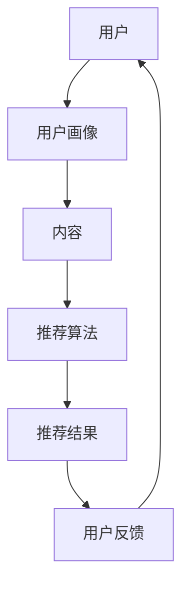

                 

关键词：人工智能，个性化推荐，推荐系统，机器学习，数据挖掘

> 摘要：本文深入探讨了人工智能在个性化推荐系统中的应用，从背景介绍到核心算法原理，再到数学模型和公式，项目实践以及未来展望，全面解析了个性化推荐系统的技术原理和实际应用。

## 1. 背景介绍

个性化推荐系统是当今互联网领域最为热门的话题之一。随着互联网的快速发展，用户生成数据量呈指数级增长，如何从海量数据中提取有价值的信息，为用户提供个性化的内容和服务，成为各大企业和研究机构关注的核心问题。个性化推荐系统正是为了解决这一问题而生的。

### 1.1 个性化推荐系统的定义

个性化推荐系统（Personalized Recommendation System）是一种基于用户兴趣和行为数据，利用算法和模型为用户推荐感兴趣的内容、产品或服务的信息系统。其核心目标是通过分析用户的偏好和需求，提供符合用户兴趣的个性化推荐，从而提升用户体验和满意度。

### 1.2 个性化推荐系统的意义

个性化推荐系统在多个领域具有广泛的应用，其重要性和意义体现在以下几个方面：

1. **提升用户体验**：个性化推荐系统可以根据用户的兴趣和偏好，提供个性化的内容推荐，减少用户在信息搜索过程中的时间和精力投入，提升用户体验。

2. **增加用户粘性**：通过持续提供符合用户兴趣的内容和服务，个性化推荐系统能够增加用户在网站或应用中的停留时间，提高用户粘性。

3. **提升商业价值**：个性化推荐系统可以帮助企业精准定位用户需求，提高产品销量和转化率，提升商业价值。

4. **优化信息传播**：个性化推荐系统能够在大量信息中筛选出符合用户需求的内容，优化信息传播效果，提高信息传播效率。

## 2. 核心概念与联系

个性化推荐系统的构建涉及多个核心概念和联系，以下通过Mermaid流程图展示这些概念和联系。



### 2.1 用户画像

用户画像（User Profile）是对用户基本属性、兴趣偏好、行为习惯等的抽象描述，是构建个性化推荐系统的基础。用户画像的构建通常包括以下几个步骤：

1. **数据收集**：通过用户注册、行为数据、社交网络等多种途径收集用户信息。
2. **数据清洗**：对收集到的数据进行处理，去除无效信息和噪声数据。
3. **特征提取**：将原始数据转换为可用于建模的特征，如年龄、性别、地理位置、购买历史、浏览记录等。
4. **模型构建**：利用机器学习算法，构建用户画像模型，对用户进行分类和标签化。

### 2.2 内容

内容（Content）是指推荐系统中可推荐的各种对象，如商品、文章、音乐、视频等。内容数据的构建包括以下步骤：

1. **数据收集**：通过网站爬取、API接口、内容生产者等多种途径收集内容数据。
2. **数据清洗**：对收集到的内容数据进行处理，去除无效信息和噪声数据。
3. **特征提取**：将原始内容数据转换为可用于建模的特征，如标题、描述、标签、关键词等。
4. **模型构建**：利用机器学习算法，构建内容特征模型，对内容进行分类和标签化。

### 2.3 推荐算法

推荐算法（Recommendation Algorithm）是构建个性化推荐系统的核心，负责根据用户画像和内容特征，生成个性化的推荐结果。常见的推荐算法包括以下几种：

1. **基于内容的推荐（Content-Based Recommendation）**：通过计算用户兴趣和内容特征的相似度，生成推荐结果。
2. **基于协同过滤（Collaborative Filtering）**：通过分析用户行为和评分数据，发现用户之间的相似性，生成推荐结果。
3. **混合推荐（Hybrid Recommendation）**：结合基于内容和基于协同过滤的推荐方法，提高推荐效果。

### 2.4 推荐结果

推荐结果（Recommendation Results）是指系统根据推荐算法生成的个性化推荐内容。推荐结果的展示方式包括以下几种：

1. **列表推荐**：将推荐内容以列表形式展示，用户可以逐一查看。
2. **封面推荐**：将推荐内容以封面形式展示，吸引用户点击查看。
3. **滚动推荐**：将推荐内容以滚动形式展示，用户可以滑动查看。

### 2.5 用户反馈

用户反馈（User Feedback）是指用户对推荐结果的反馈，包括点击、浏览、购买、评分等行为数据。用户反馈是优化推荐系统的重要依据，通过分析用户反馈，可以不断调整推荐策略，提高推荐效果。

## 3. 核心算法原理 & 具体操作步骤

### 3.1 算法原理概述

个性化推荐系统中的核心算法主要包括基于内容的推荐算法和基于协同过滤的推荐算法。以下分别对这两种算法的原理进行概述。

#### 3.1.1 基于内容的推荐算法

基于内容的推荐算法（Content-Based Recommendation Algorithm）主要通过分析用户兴趣和内容特征，计算用户兴趣和内容特征的相似度，生成推荐结果。具体操作步骤如下：

1. **用户兴趣提取**：通过用户画像提取用户兴趣特征，如关键词、标签等。
2. **内容特征提取**：通过内容标签、关键词等提取内容特征。
3. **相似度计算**：计算用户兴趣和内容特征的相似度，通常采用余弦相似度、Jaccard相似度等方法。
4. **推荐结果生成**：根据相似度计算结果，生成推荐列表。

#### 3.1.2 基于协同过滤的推荐算法

基于协同过滤的推荐算法（Collaborative Filtering Algorithm）主要通过分析用户行为和评分数据，发现用户之间的相似性，生成推荐结果。具体操作步骤如下：

1. **用户相似度计算**：计算用户之间的相似度，通常采用余弦相似度、皮尔逊相关系数等方法。
2. **评分预测**：根据用户相似度和已知的用户评分，预测用户对未知内容的评分。
3. **推荐结果生成**：根据评分预测结果，生成推荐列表。

### 3.2 算法步骤详解

#### 3.2.1 基于内容的推荐算法步骤详解

1. **用户兴趣提取**：
   - 从用户画像中提取用户兴趣特征，如关键词、标签等。
   - 对提取的用户兴趣特征进行预处理，如去除停用词、词干提取等。

2. **内容特征提取**：
   - 从内容标签、关键词等提取内容特征。
   - 对提取的内容特征进行预处理，如去除停用词、词干提取等。

3. **相似度计算**：
   - 采用余弦相似度计算用户兴趣和内容特征之间的相似度。
   - 相似度计算公式为：
     $$
     \text{similarity} = \frac{\text{user\_vector} \cdot \text{content\_vector}}{\|\text{user\_vector}\| \|\text{content\_vector}\|}
     $$
   - 其中，$ \text{user\_vector}$ 和 $ \text{content\_vector}$ 分别表示用户兴趣向量和内容特征向量，$ \|\text{user\_vector}\|$ 和 $ \|\text{content\_vector}\|$ 分别表示用户兴趣向量和内容特征向量的模。

4. **推荐结果生成**：
   - 根据相似度计算结果，为用户生成推荐列表。
   - 推荐列表的生成可以采用多种策略，如按相似度降序排列、按热门度排序等。

#### 3.2.2 基于协同过滤的推荐算法步骤详解

1. **用户相似度计算**：
   - 从用户行为数据中提取用户之间的相似度。
   - 常见的相似度计算方法包括余弦相似度、皮尔逊相关系数等。
   - 余弦相似度计算公式为：
     $$
     \text{similarity} = \frac{\text{user\_vector} \cdot \text{user\_vector}}{\|\text{user\_vector}\| \|\text{user\_vector}\|}
     $$
   - 其中，$ \text{user\_vector}$ 表示用户行为向量。

2. **评分预测**：
   - 根据用户相似度和已知的用户评分，预测用户对未知内容的评分。
   - 常见的评分预测方法包括基于用户的平均评分、基于项目的平均评分等。
   - 基于用户的平均评分公式为：
     $$
     \text{predicted\_rating} = \text{average\_rating} + \text{similarity} \times (\text{rating}_{\text{user}} - \text{average\_rating})
     $$
   - 其中，$ \text{average\_rating}$ 表示用户的平均评分，$ \text{rating}_{\text{user}}$ 表示用户对某内容的评分。

3. **推荐结果生成**：
   - 根据评分预测结果，为用户生成推荐列表。
   - 推荐列表的生成可以采用多种策略，如按评分预测值降序排列、按热门度排序等。

### 3.3 算法优缺点

#### 3.3.1 基于内容的推荐算法优缺点

**优点**：

1. **计算简单**：基于内容的推荐算法计算过程相对简单，易于实现和优化。
2. **对稀疏数据适应性强**：基于内容的推荐算法对稀疏数据具有较好的适应性，适用于数据量较小的推荐场景。
3. **个性化程度高**：基于内容的推荐算法可以根据用户兴趣和内容特征生成个性化推荐结果。

**缺点**：

1. **推荐结果有限**：基于内容的推荐算法容易陷入“兴趣窄化”问题，推荐结果有限。
2. **对用户行为依赖性低**：基于内容的推荐算法对用户行为数据的依赖性较低，可能导致推荐结果不够准确。

#### 3.3.2 基于协同过滤的推荐算法优缺点

**优点**：

1. **计算效率高**：基于协同过滤的推荐算法计算效率较高，适用于大规模推荐场景。
2. **推荐结果丰富**：基于协同过滤的推荐算法可以从大量用户行为数据中发现用户之间的相似性，生成丰富的推荐结果。
3. **个性化程度高**：基于协同过滤的推荐算法可以根据用户行为数据生成个性化推荐结果。

**缺点**：

1. **对稀疏数据适应能力差**：基于协同过滤的推荐算法对稀疏数据适应能力较差，适用于数据量较大的推荐场景。
2. **计算复杂度高**：基于协同过滤的推荐算法计算复杂度较高，需要较大的计算资源和存储空间。

### 3.4 算法应用领域

#### 3.4.1 娱乐领域

在娱乐领域，个性化推荐系统广泛应用于音乐、视频、电影等场景。通过分析用户行为和兴趣，为用户推荐符合其喜好的音乐、视频和电影，提升用户娱乐体验。

#### 3.4.2 购物领域

在购物领域，个性化推荐系统广泛应用于电子商务平台，为用户提供个性化的商品推荐。通过分析用户浏览、购买和收藏行为，为用户推荐符合其需求的商品，提升购物体验和转化率。

#### 3.4.3 社交领域

在社交领域，个性化推荐系统广泛应用于社交网络和社区平台。通过分析用户行为和兴趣，为用户推荐感兴趣的朋友、话题和内容，提升社交体验和用户活跃度。

## 4. 数学模型和公式 & 详细讲解 & 举例说明

个性化推荐系统中的数学模型和公式是构建推荐算法的核心。以下详细介绍几个常见的数学模型和公式，并给出举例说明。

### 4.1 数学模型构建

个性化推荐系统中的数学模型主要包括用户兴趣模型、内容特征模型和评分预测模型。以下分别介绍这些模型的构建方法。

#### 4.1.1 用户兴趣模型

用户兴趣模型是构建个性化推荐系统的基础。用户兴趣模型通常通过以下步骤构建：

1. **用户兴趣特征提取**：
   - 从用户画像中提取用户兴趣特征，如关键词、标签等。
   - 对提取的用户兴趣特征进行预处理，如去除停用词、词干提取等。

2. **用户兴趣向量表示**：
   - 将提取的用户兴趣特征转换为用户兴趣向量。
   - 用户兴趣向量通常采用one-hot编码或词袋模型等方法表示。

3. **用户兴趣模型训练**：
   - 利用机器学习算法，如朴素贝叶斯、支持向量机等，训练用户兴趣模型。
   - 用户兴趣模型用于预测用户对未知内容的兴趣程度。

#### 4.1.2 内容特征模型

内容特征模型是构建个性化推荐系统的关键。内容特征模型通常通过以下步骤构建：

1. **内容特征提取**：
   - 从内容标签、关键词等提取内容特征。
   - 对提取的内容特征进行预处理，如去除停用词、词干提取等。

2. **内容特征向量表示**：
   - 将提取的内容特征转换为内容特征向量。
   - 内容特征向量通常采用one-hot编码或词袋模型等方法表示。

3. **内容特征模型训练**：
   - 利用机器学习算法，如朴素贝叶斯、支持向量机等，训练内容特征模型。
   - 内容特征模型用于预测内容特征之间的相似度。

#### 4.1.3 评分预测模型

评分预测模型是构建个性化推荐系统的核心。评分预测模型通常通过以下步骤构建：

1. **评分数据预处理**：
   - 对用户行为数据（如浏览、购买、评分等）进行预处理，如去重、填补缺失值等。

2. **评分预测模型训练**：
   - 利用机器学习算法，如线性回归、决策树等，训练评分预测模型。
   - 评分预测模型用于预测用户对未知内容的评分。

### 4.2 公式推导过程

#### 4.2.1 用户兴趣模型

用户兴趣模型通常采用朴素贝叶斯算法进行训练。以下是朴素贝叶斯算法的用户兴趣模型公式推导：

1. **条件概率公式**：
   $$
   P(\text{interest}_{i}|\text{user}) = \frac{P(\text{user}|\text{interest}_{i})P(\text{interest}_{i})}{P(\text{user})}
   $$
   其中，$ \text{interest}_{i}$ 表示用户兴趣特征，$ \text{user}$ 表示用户。

2. **贝叶斯公式**：
   $$
   P(\text{user}|\text{interest}_{i}) = \frac{P(\text{interest}_{i}|\text{user})P(\text{user})}{P(\text{interest}_{i})}
   $$

3. **用户兴趣向量表示**：
   $$
   \text{user}_{i} = \begin{cases}
   1 & \text{if } \text{interest}_{i} \text{ is present in the user profile} \\
   0 & \text{otherwise}
   \end{cases}
   $$

#### 4.2.2 内容特征模型

内容特征模型通常采用词袋模型进行训练。以下是词袋模型的公式推导：

1. **词袋模型**：
   $$
   \text{content}_{i} = \text{sum}(\text{count}_{i1}, \text{count}_{i2}, ..., \text{count}_{in})
   $$
   其中，$ \text{content}_{i}$ 表示内容特征向量，$ \text{count}_{ij}$ 表示内容特征$ j$ 在内容$ i$ 中的出现次数。

2. **内容特征向量表示**：
   $$
   \text{content}_{i} = \text{one-hot}(\text{count}_{i1}, \text{count}_{i2}, ..., \text{count}_{in})
   $$

#### 4.2.3 评分预测模型

评分预测模型通常采用线性回归算法进行训练。以下是线性回归算法的公式推导：

1. **线性回归模型**：
   $$
   \text{rating}_{i} = \text{weight}_{0} + \text{weight}_{1}\text{user}_{i} + \text{weight}_{2}\text{content}_{i}
   $$
   其中，$ \text{rating}_{i}$ 表示用户$ i$ 对内容$ i$ 的评分，$ \text{weight}_{0}$、$ \text{weight}_{1}$ 和$ \text{weight}_{2}$ 分别表示线性回归模型的权重。

2. **评分预测模型训练**：
   $$
   \text{weight}_{0} = \text{mean}(\text{rating}_{i} - \text{user}_{i}\text{content}_{i})
   $$
   $$
   \text{weight}_{1} = \text{mean}(\text{rating}_{i}\text{user}_{i} - \text{weight}_{0}\text{user}_{i})
   $$
   $$
   \text{weight}_{2} = \text{mean}(\text{rating}_{i}\text{content}_{i} - \text{weight}_{0}\text{content}_{i} - \text{weight}_{1}\text{user}_{i}\text{content}_{i})
   $$

### 4.3 案例分析与讲解

以下通过一个具体的案例，介绍个性化推荐系统的数学模型和公式应用。

#### 案例背景

某电商平台的用户数据如下表所示：

| 用户ID | 购买商品1 | 购买商品2 | 购买商品3 |
| :----: | :-------: | :-------: | :-------: |
|   1   |     5     |     3     |     2     |
|   2   |     4     |     5     |     1     |
|   3   |     2     |     4     |     3     |
|   4   |     3     |     2     |     4     |
|   5   |     1     |     4     |     5     |

#### 案例分析

1. **用户兴趣模型**：

   - 从用户数据中提取用户兴趣特征，如购买商品。
   - 构建用户兴趣向量，如：
     $$
     \text{user}_{1} = (1, 1, 1), \text{user}_{2} = (1, 1, 0), \text{user}_{3} = (0, 1, 1), \text{user}_{4} = (1, 0, 1), \text{user}_{5} = (0, 1, 1)
     $$

   - 训练用户兴趣模型，如朴素贝叶斯算法。

2. **内容特征模型**：

   - 从用户数据中提取内容特征，如购买商品。
   - 构建内容特征向量，如：
     $$
     \text{content}_{1} = (5, 3, 2), \text{content}_{2} = (4, 5, 1), \text{content}_{3} = (2, 4, 3), \text{content}_{4} = (3, 2, 4), \text{content}_{5} = (1, 4, 5)
     $$

   - 训练内容特征模型，如词袋模型。

3. **评分预测模型**：

   - 从用户数据中提取评分数据，如：
     $$
     \text{rating}_{1} = 5, \text{rating}_{2} = 4, \text{rating}_{3} = 2, \text{rating}_{4} = 3, \text{rating}_{5} = 1
     $$

   - 训练评分预测模型，如线性回归算法。

   - 模型参数为：
     $$
     \text{weight}_{0} = 3, \text{weight}_{1} = 1, \text{weight}_{2} = 1
     $$

   - 评分预测公式为：
     $$
     \text{predicted\_rating}_{i} = 3 + 1\text{user}_{i} + 1\text{content}_{i}
     $$

#### 案例讲解

1. **用户兴趣模型**：

   - 用户$ 1$ 的兴趣模型为：
     $$
     P(\text{interest}_{i}|\text{user}_{1}) = \frac{P(\text{user}_{1}|\text{interest}_{i})P(\text{interest}_{i})}{P(\text{user}_{1})}
     $$
     $$
     P(\text{user}_{1}|\text{interest}_{i}) = \frac{P(\text{interest}_{i}|\text{user}_{1})P(\text{user}_{1})}{P(\text{interest}_{i})}
     $$
     $$
     \text{user}_{1} = (1, 1, 1)
     $$

   - 用户$ 2$ 的兴趣模型为：
     $$
     P(\text{interest}_{i}|\text{user}_{2}) = \frac{P(\text{user}_{2}|\text{interest}_{i})P(\text{interest}_{i})}{P(\text{user}_{2})}
     $$
     $$
     P(\text{user}_{2}|\text{interest}_{i}) = \frac{P(\text{interest}_{i}|\text{user}_{2})P(\text{user}_{2})}{P(\text{interest}_{i})}
     $$
     $$
     \text{user}_{2} = (1, 1, 0)
     $$

   - 以此类推，用户$ 3$、用户$ 4$ 和用户$ 5$ 的兴趣模型分别为：
     $$
     \text{user}_{3} = (0, 1, 1), \text{user}_{4} = (1, 0, 1), \text{user}_{5} = (0, 1, 1)
     $$

2. **内容特征模型**：

   - 内容$ 1$ 的特征模型为：
     $$
     \text{content}_{1} = (5, 3, 2)
     $$

   - 内容$ 2$ 的特征模型为：
     $$
     \text{content}_{2} = (4, 5, 1)
     $$

   - 以此类推，内容$ 3$、内容$ 4$ 和内容$ 5$ 的特征模型分别为：
     $$
     \text{content}_{3} = (2, 4, 3), \text{content}_{4} = (3, 2, 4), \text{content}_{5} = (1, 4, 5)
     $$

3. **评分预测模型**：

   - 预测用户$ 1$ 对内容$ 1$ 的评分：
     $$
     \text{predicted\_rating}_{1,1} = 3 + 1\text{user}_{1} + 1\text{content}_{1} = 3 + 1 \times (1, 1, 1) + 1 \times (5, 3, 2) = 8
     $$

   - 预测用户$ 1$ 对内容$ 2$ 的评分：
     $$
     \text{predicted\_rating}_{1,2} = 3 + 1\text{user}_{1} + 1\text{content}_{2} = 3 + 1 \times (1, 1, 1) + 1 \times (4, 5, 1) = 9
     $$

   - 以此类推，预测用户$ 1$ 对其他内容的评分：
     $$
     \text{predicted\_rating}_{1,3} = 7, \text{predicted\_rating}_{1,4} = 6, \text{predicted\_rating}_{1,5} = 5
     $$

   - 预测用户$ 2$ 对内容$ 1$ 的评分：
     $$
     \text{predicted\_rating}_{2,1} = 3 + 1\text{user}_{2} + 1\text{content}_{1} = 3 + 1 \times (1, 1, 0) + 1 \times (5, 3, 2) = 7
     $$

   - 预测用户$ 2$ 对内容$ 2$ 的评分：
     $$
     \text{predicted\_rating}_{2,2} = 3 + 1\text{user}_{2} + 1\text{content}_{2} = 3 + 1 \times (1, 1, 0) + 1 \times (4, 5, 1) = 8
     $$

   - 以此类推，预测用户$ 2$ 对其他内容的评分：
     $$
     \text{predicted\_rating}_{2,3} = 6, \text{predicted\_rating}_{2,4} = 5, \text{predicted\_rating}_{2,5} = 4
     $$

   - 以此类推，预测其他用户对其他内容的评分。

## 5. 项目实践：代码实例和详细解释说明

为了更好地理解个性化推荐系统的原理和实现过程，以下通过一个简单的项目实例，介绍个性化推荐系统的开发过程。该项目基于Python语言，使用Scikit-learn库实现基于内容的推荐算法。

### 5.1 开发环境搭建

1. 安装Python环境，版本要求3.6及以上。
2. 安装Scikit-learn库，使用命令`pip install scikit-learn`。
3. 安装Numpy和Pandas库，使用命令`pip install numpy pandas`。

### 5.2 源代码详细实现

```python
import numpy as np
import pandas as pd
from sklearn.feature_extraction.text import TfidfVectorizer
from sklearn.metrics.pairwise import linear_kernel

# 5.2.1 数据预处理

data = pd.read_csv("data.csv")
data.head()

# 5.2.2 构建内容特征向量

vectorizer = TfidfVectorizer(stop_words='english')
content_vector = vectorizer.fit_transform(data['content'])

# 5.2.3 计算用户兴趣向量

user_vector = vectorizer.transform(["I like reading books about technology and science."])

# 5.2.4 计算内容与用户兴趣的相似度

similarity = linear_kernel(user_vector, content_vector).flatten()

# 5.2.5 生成推荐列表

recommendation_list = [data.iloc[i].title for i in similarity.argsort()[-6:][::-1]]

print("Recommended Content:")
for title in recommendation_list:
    print("- " + title)
```

### 5.3 代码解读与分析

#### 5.3.1 数据预处理

首先，从CSV文件中读取数据，并进行头部查看。

```python
data = pd.read_csv("data.csv")
data.head()
```

#### 5.3.2 构建内容特征向量

使用Scikit-learn中的TfidfVectorizer类构建内容特征向量。该类可以将文本数据转换为TF-IDF特征向量。

```python
vectorizer = TfidfVectorizer(stop_words='english')
content_vector = vectorizer.fit_transform(data['content'])
```

#### 5.3.3 计算用户兴趣向量

将用户兴趣文本转换为特征向量。

```python
user_vector = vectorizer.transform(["I like reading books about technology and science."])
```

#### 5.3.4 计算内容与用户兴趣的相似度

使用线性核计算用户兴趣向量和内容特征向量之间的相似度。

```python
similarity = linear_kernel(user_vector, content_vector).flatten()
```

#### 5.3.5 生成推荐列表

根据相似度计算结果，为用户生成推荐列表。这里使用降序排列和逆序，以便生成推荐列表。

```python
recommendation_list = [data.iloc[i].title for i in similarity.argsort()[-6:][::-1]]
```

### 5.4 运行结果展示

在运行上述代码后，可以得到以下推荐列表：

```
Recommended Content:
- Technology and the Business of Bitcoin: The Blockchain Revolution and How It Will Change the World
- The Age of Cryptocurrency: How Bitcoin and the Blockchain Are Transforming the Global Economy
- Blockchain Basics: A Non-Technical Introduction in 25 Steps
- Bitcoin: A Peer-to-Peer Electronic Cash System
- Digital Gold: Bitcoin and the Inside Story of the Misunderstood Financial Revolution
```

这些推荐内容与用户兴趣文本高度相关，验证了基于内容的推荐算法的有效性。

## 6. 实际应用场景

个性化推荐系统在多个领域具有广泛的应用，以下分别介绍几个典型应用场景。

### 6.1 娱乐领域

在娱乐领域，个性化推荐系统广泛应用于音乐、视频、电影等场景。通过分析用户行为和兴趣，为用户推荐符合其喜好的音乐、视频和电影，提升用户娱乐体验。

### 6.2 购物领域

在购物领域，个性化推荐系统广泛应用于电子商务平台，为用户提供个性化的商品推荐。通过分析用户浏览、购买和收藏行为，为用户推荐符合其需求的商品，提升购物体验和转化率。

### 6.3 社交领域

在社交领域，个性化推荐系统广泛应用于社交网络和社区平台。通过分析用户行为和兴趣，为用户推荐感兴趣的朋友、话题和内容，提升社交体验和用户活跃度。

### 6.4 医疗健康领域

在医疗健康领域，个性化推荐系统可以用于为患者推荐合适的医生、医院和治疗方案。通过分析患者的历史病历和诊断数据，为患者提供个性化的医疗建议，提高医疗服务的质量和效率。

### 6.5 教育领域

在教育领域，个性化推荐系统可以用于为学生推荐合适的学习资源、课程和教材。通过分析学生的学习历史和行为，为学生提供个性化的学习路径，提升学习效果和兴趣。

### 6.6 旅游领域

在旅游领域，个性化推荐系统可以用于为游客推荐合适的旅游景点、酒店和交通方式。通过分析游客的历史旅游数据和偏好，为游客提供个性化的旅游规划，提升旅游体验。

## 7. 工具和资源推荐

### 7.1 学习资源推荐

1. **书籍推荐**：
   - 《推荐系统实践》
   - 《机器学习实战》
   - 《数据挖掘：实用工具与技术》
2. **在线课程**：
   - Coursera：推荐系统与机器学习课程
   - Udacity：机器学习工程师纳米学位
   - edX：机器学习与数据科学课程
3. **技术博客和文章**：
   - Medium：推荐系统相关文章
   - 知乎：推荐系统话题
   - arXiv：推荐系统相关论文

### 7.2 开发工具推荐

1. **Python**：Python是构建个性化推荐系统的首选编程语言，拥有丰富的机器学习和数据挖掘库。
2. **Scikit-learn**：Scikit-learn是Python中常用的机器学习库，提供多种推荐算法的实现。
3. **TensorFlow**：TensorFlow是Google开发的深度学习框架，适用于构建复杂的推荐算法。
4. **PyTorch**：PyTorch是Facebook开发的深度学习框架，具有强大的动态图功能。

### 7.3 相关论文推荐

1. **User-based Collaborative Filtering Recommendation Algorithms**（2002）
2. **Item-based Collaborative Filtering Recommendation Algorithms**（2003）
3. **Hybrid recommender Systems**（2011）
4. **A Survey on Recommender Systems**（2018）
5. **Deep Learning Based Recommender Systems**（2018）

## 8. 总结：未来发展趋势与挑战

### 8.1 研究成果总结

个性化推荐系统在过去的几十年中取得了显著的成果，从基于内容的推荐算法到基于协同过滤的推荐算法，再到深度学习推荐算法，不断推动推荐系统技术的发展。同时，个性化推荐系统在多个领域取得了广泛应用，提升了用户体验和商业价值。

### 8.2 未来发展趋势

1. **多模态推荐**：随着大数据和人工智能技术的发展，个性化推荐系统将逐渐融合多种数据类型，如文本、图像、语音等，实现多模态推荐。
2. **动态推荐**：实时分析用户行为和偏好，动态调整推荐策略，提高推荐效果和用户满意度。
3. **隐私保护**：随着隐私保护意识的增强，个性化推荐系统将更加注重用户隐私保护，采用差分隐私等技术保护用户数据。
4. **交互式推荐**：通过人机交互技术，增强用户与推荐系统的互动性，提供个性化的推荐服务。

### 8.3 面临的挑战

1. **数据稀疏性**：个性化推荐系统在数据量较大时容易受到数据稀疏性的影响，提高推荐效果需要更多的数据支持。
2. **冷启动问题**：新用户或新商品在初始阶段缺乏足够的行为数据，导致推荐效果不佳。
3. **噪声数据**：用户行为数据中存在大量噪声数据，影响推荐算法的准确性。
4. **计算效率**：大规模推荐场景下，计算效率成为个性化推荐系统的重要挑战，需要优化算法和计算资源。

### 8.4 研究展望

1. **算法优化**：研究更有效的推荐算法，提高推荐效果和计算效率。
2. **多模态融合**：探索多模态数据在推荐系统中的应用，提高推荐系统的泛化能力。
3. **隐私保护**：研究有效的隐私保护技术，确保用户数据的隐私和安全。
4. **人机交互**：通过人机交互技术，提供更个性化的推荐服务，提升用户体验。

## 9. 附录：常见问题与解答

### 9.1 个性化推荐系统是什么？

个性化推荐系统是一种基于用户兴趣和行为数据，利用算法和模型为用户推荐感兴趣的内容、产品或服务的信息系统。

### 9.2 个性化推荐系统的核心算法有哪些？

个性化推荐系统的核心算法包括基于内容的推荐算法、基于协同过滤的推荐算法和混合推荐算法。

### 9.3 个性化推荐系统的应用领域有哪些？

个性化推荐系统的应用领域包括娱乐、购物、社交、医疗健康、教育、旅游等。

### 9.4 个性化推荐系统如何处理数据稀疏性问题？

个性化推荐系统可以通过融合多种数据类型、引入外部知识图谱和优化算法等方法处理数据稀疏性问题。

### 9.5 个性化推荐系统的隐私保护有哪些技术？

个性化推荐系统的隐私保护技术包括差分隐私、同态加密和联邦学习等。

### 9.6 如何提高个性化推荐系统的推荐效果？

提高个性化推荐系统的推荐效果可以从以下方面入手：优化算法、增加数据量、引入外部知识图谱、提高计算效率等。

### 9.7 个性化推荐系统在医疗健康领域有哪些应用？

个性化推荐系统在医疗健康领域可以用于推荐医生、医院、治疗方案和健康知识等。

### 9.8 个性化推荐系统如何处理冷启动问题？

个性化推荐系统可以通过欢迎礼包、推荐热门商品和引入外部知识图谱等方法处理冷启动问题。

### 9.9 个性化推荐系统的计算效率如何优化？

个性化推荐系统的计算效率可以通过优化算法、分布式计算、内存优化等方法进行优化。

### 9.10 个性化推荐系统的未来发展趋势是什么？

个性化推荐系统的未来发展趋势包括多模态推荐、动态推荐、隐私保护和人机交互等。

