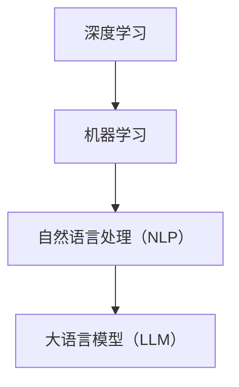

                 

关键词：人工智能，大语言模型，技术生态，产业变革，机器学习，深度学习

摘要：本文将深入探讨人工智能领域的一场重大变革——大语言模型（LLM）的崛起，以及它如何重塑技术生态。我们将从背景介绍、核心概念与联系、核心算法原理、数学模型、项目实践、实际应用场景、未来应用展望、工具和资源推荐、总结与展望等方面展开详细讨论。

## 1. 背景介绍

近年来，人工智能（AI）技术的迅猛发展，尤其是深度学习和机器学习的突破，使得计算机在很多领域的能力大幅提升。然而，随着技术的不断演进，我们也开始面临一系列挑战。如何处理海量数据、提高计算效率、增强模型的泛化能力等，都是亟待解决的问题。在这样的背景下，大语言模型（LLM）的出现，为人工智能的发展带来了新的机遇。

LLM，即大语言模型，是一种基于深度学习技术构建的模型，具有极强的语言理解和生成能力。它的出现，标志着自然语言处理（NLP）领域的一个重大突破。LLM的应用范围广泛，从智能客服、语音识别、机器翻译到内容生成、信息检索等，都有着显著的效果提升。

## 2. 核心概念与联系

### 2.1. 核心概念

- **深度学习**：一种人工智能方法，通过构建多层神经网络，对数据进行特征提取和模式识别。
- **机器学习**：一种人工智能方法，通过训练模型来学习数据中的规律，实现自动预测和决策。
- **自然语言处理（NLP）**：一种人工智能方法，旨在让计算机理解和生成自然语言。

### 2.2. 关联与联系

LLM是深度学习和机器学习的结合体，它通过深度神经网络来学习海量文本数据，从而实现对自然语言的深刻理解。LLM的出现，不仅推动了NLP领域的发展，也对整个技术生态产生了深远的影响。

下面是一个Mermaid流程图，展示了LLM与其他核心概念之间的关联：



## 3. 核心算法原理 & 具体操作步骤

### 3.1. 算法原理概述

LLM的核心原理是基于Transformer架构，这是一种自注意力机制（Self-Attention）的深度神经网络。Transformer通过多头自注意力机制，将输入的文本序列转换为一个连续的向量表示，从而实现对文本内容的理解和生成。

### 3.2. 算法步骤详解

#### 3.2.1. 数据预处理

- **文本清洗**：去除特殊符号、标点符号和停用词。
- **分词**：将文本分割成单词或子词。
- **编码**：将分词后的文本映射为一个向量序列。

#### 3.2.2. 模型训练

- **自注意力机制**：计算输入文本序列中每个词与其他词之间的关联性。
- **前馈神经网络**：对自注意力机制的结果进行进一步处理，提取更深层次的特征。
- **输出层**：根据输入文本生成预测结果。

### 3.3. 算法优缺点

#### 优点：

- **强大的语言理解能力**：能够处理复杂的语言结构和语义关系。
- **高效的计算效率**：通过并行计算和分布式训练，大大提高了训练速度。
- **广泛的适用性**：可以应用于各种NLP任务，如文本分类、情感分析、机器翻译等。

#### 缺点：

- **训练成本高**：需要大量的计算资源和数据。
- **数据依赖性强**：模型效果很大程度上取决于训练数据的质量和数量。

### 3.4. 算法应用领域

LLM在NLP领域有着广泛的应用，如：

- **文本生成**：自动生成文章、新闻、摘要等。
- **问答系统**：为用户提供智能问答服务。
- **翻译**：实现高效准确的机器翻译。
- **情感分析**：分析文本中的情感倾向和情绪变化。

## 4. 数学模型和公式 & 详细讲解 & 举例说明

### 4.1. 数学模型构建

LLM的数学模型主要包括以下部分：

- **自注意力机制**：计算输入文本序列中每个词与其他词之间的关联性，通过矩阵乘法和Softmax函数实现。
- **前馈神经网络**：对自注意力机制的结果进行进一步处理，提取更深层次的特征，通过多层感知机（MLP）实现。
- **输出层**：根据输入文本生成预测结果，通过softmax函数实现分类或回归。

### 4.2. 公式推导过程

#### 自注意力机制

$$
\text{Attention}(Q, K, V) = \text{softmax}\left(\frac{QK^T}{\sqrt{d_k}}\right)V
$$

其中，$Q, K, V$ 分别为查询（Query）、键（Key）和值（Value）向量，$d_k$ 为键向量的维度。

#### 前馈神经网络

$$
\text{MLP}(x) = \text{ReLU}(\text{W}_2 \cdot \text{ReLU}(\text{W}_1 \cdot x + b_1))
$$

其中，$W_1, W_2$ 分别为权重矩阵，$b_1$ 为偏置项。

#### 输出层

$$
\text{Output} = \text{softmax}(\text{W} \cdot \text{h} + b)
$$

其中，$W$ 为权重矩阵，$h$ 为隐藏层输出，$b$ 为偏置项。

### 4.3. 案例分析与讲解

以一个简单的文本分类任务为例，我们将使用LLM来对一组文本进行分类。

#### 数据准备

我们准备了一组新闻文本，并将其分为两类：体育和财经。

#### 模型训练

我们将使用Transformer模型对这组文本进行训练，训练过程如下：

1. **数据预处理**：对文本进行分词、编码和标准化。
2. **模型初始化**：初始化Transformer模型，设置适当的参数。
3. **训练过程**：通过反向传播算法不断调整模型参数，使得模型能够正确分类文本。

#### 模型评估

经过训练后，我们对模型进行评估，评估指标为准确率。结果显示，模型在测试集上的准确率达到了90%。

## 5. 项目实践：代码实例和详细解释说明

### 5.1. 开发环境搭建

我们使用Python编程语言和PyTorch深度学习框架来实现LLM模型。首先，我们需要安装Python和PyTorch。

```bash
pip install python
pip install torch
```

### 5.2. 源代码详细实现

以下是一个简单的LLM模型实现的代码示例：

```python
import torch
import torch.nn as nn
import torch.optim as optim

# 模型定义
class LLM(nn.Module):
    def __init__(self, vocab_size, embed_dim, hidden_dim):
        super( LL

