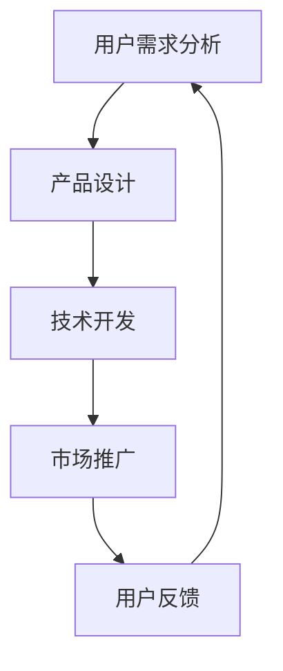

                 

### 1. 背景介绍

人工智能（AI）技术作为现代科技的璀璨明珠，已经在众多领域展现出其巨大的潜力和应用价值。从智能助手到自动驾驶，从医疗诊断到金融分析，AI正逐渐融入我们的日常生活，为企业带来前所未有的商业机会。然而，在AI产品与服务市场中，一个不可忽视的现象是：大多数AI产品与服务主要针对的是技术爱好者、专业人士或相关行业的用户，而非普通大众。

这种市场划分有其合理性。AI技术本身较为复杂，涉及大量的算法、数据处理和专业知识，对于普通用户而言，理解和应用具有一定的门槛。因此，AI产品与服务往往更倾向于服务于那些具备相关背景和技术能力的用户群体。然而，这也导致了AI市场的一个问题：虽然AI技术有着广泛的应用前景，但其用户基础却相对狭窄，未能实现广泛的市场渗透。

本文旨在探讨如何通过优化AI产品与服务的设计，自我消化内部需求，同时拓展非AI用户的消费量，从而实现AI技术的更广泛普及和商业价值的最大化。我们将从核心概念、算法原理、数学模型、项目实践等多个角度，深入分析这一问题的解决方案，并提出相应的策略。

### 2. 核心概念与联系

要实现AI产品与服务的自我消化需求，并拓展非AI用户的消费量，首先需要明确几个核心概念：用户需求、产品设计、市场定位和技术适应性。

#### 2.1 用户需求

用户需求是驱动产品开发的根本动力。在AI领域，用户需求可以分为两类：技术驱动型需求和实用性驱动型需求。

- **技术驱动型需求**：这类需求主要来自于技术爱好者、专业人士和相关行业用户。他们希望借助AI技术解决复杂问题，提升工作效率，或者进行创新性研究。这类用户通常对技术有较高要求，愿意投入时间和精力去学习和掌握新技能。

- **实用性驱动型需求**：这类需求则主要来自于普通大众。他们希望通过AI技术解决生活中的实际问题，如提高生活质量、便捷工作学习等。这类用户对技术的理解和掌握程度相对较低，更关注产品的易用性和实用性。

#### 2.2 产品设计

产品设计是实现用户需求的关键环节。在AI产品与服务的设计过程中，需要充分考虑以下两个方面：

- **个性化定制**：针对不同类型的用户需求，提供个性化定制服务。对于技术驱动型用户，可以提供高级功能和定制化选项，以满足他们的特定需求。对于实用性驱动型用户，则可以提供简洁、直观的操作界面和一站式解决方案。

- **易用性**：提升产品的易用性，降低用户的学习和使用成本。通过简化操作流程、提供直观的界面设计、提供详尽的用户手册和帮助文档等方式，让用户能够轻松上手，快速实现价值。

#### 2.3 市场定位

市场定位是确保产品成功的关键。在AI产品与服务的市场定位中，需要充分考虑以下几个方面：

- **目标市场**：明确目标市场，针对性地进行市场调研，了解目标用户的需求、行为和偏好。针对技术驱动型用户，可以集中在专业领域进行推广；针对实用性驱动型用户，则可以覆盖更广泛的消费群体。

- **竞争策略**：分析竞争对手的产品特点、市场策略和用户反馈，制定相应的竞争策略。通过差异化定位、创新功能和优质服务等方式，形成自己的竞争优势。

- **品牌建设**：打造有影响力的品牌形象，提升品牌知名度和美誉度。通过品牌故事、口碑营销、社交媒体推广等方式，增强用户对品牌的信任和认同。

#### 2.4 技术适应性

技术适应性是AI产品与服务成功的关键因素。在设计和开发过程中，需要充分考虑以下几个方面：

- **兼容性**：确保产品在不同操作系统、硬件设备和网络环境下都能正常运行。通过模块化设计和标准化接口，实现跨平台兼容。

- **可扩展性**：设计灵活、可扩展的架构，以便在需求变化时能够快速调整和升级。通过模块化设计、微服务架构等方式，实现系统的灵活扩展。

- **智能化水平**：不断提升产品的智能化水平，通过人工智能算法和机器学习技术，实现产品的自我学习和优化。通过数据驱动的决策支持，提升产品的智能化程度和用户体验。

#### Mermaid 流程图

以下是一个简化的Mermaid流程图，用于展示AI产品与服务的设计、开发、推广和反馈流程。



### 3. 核心算法原理 & 具体操作步骤

#### 3.1 算法原理概述

在AI产品与服务的开发过程中，算法设计是核心环节之一。算法原理主要包括以下几个关键方面：

- **机器学习算法**：通过训练模型来识别数据中的模式和规律，从而实现自动化决策和预测。常见的机器学习算法包括监督学习、无监督学习和强化学习。

- **深度学习算法**：基于神经网络模型，通过多层非线性变换对数据进行处理和建模。深度学习算法在图像识别、语音识别和自然语言处理等领域取得了显著的成果。

- **优化算法**：用于求解最优化问题，如线性规划、非线性规划和动态规划等。优化算法在资源分配、调度和路径规划等方面有广泛应用。

#### 3.2 算法步骤详解

以下是AI产品与服务开发过程中常用的算法步骤：

##### 3.2.1 数据预处理

数据预处理是算法训练的重要步骤，主要包括数据清洗、数据变换和数据归一化等。

- **数据清洗**：去除数据中的噪声和异常值，提高数据质量。
- **数据变换**：将不同类型的数据转换为统一的格式，便于后续处理。
- **数据归一化**：将数据缩放到相同的范围内，消除量纲影响。

##### 3.2.2 特征工程

特征工程是提升模型性能的关键环节，主要包括特征选择、特征提取和特征组合等。

- **特征选择**：选择对模型性能有显著影响的关键特征，降低特征维度。
- **特征提取**：通过变换或组合原始特征，生成新的特征。
- **特征组合**：结合不同特征，生成更强大的特征表示。

##### 3.2.3 模型训练

模型训练是算法的核心步骤，主要包括模型选择、训练和验证等。

- **模型选择**：根据问题和数据特点选择合适的模型。
- **训练**：使用训练数据对模型进行训练，调整模型参数。
- **验证**：使用验证数据评估模型性能，调整模型参数。

##### 3.2.4 模型评估

模型评估是确保模型性能的重要环节，主要包括模型精度、召回率、F1分数等指标。

- **精度**：模型预测正确的样本数与总样本数的比值。
- **召回率**：模型预测正确的样本数与实际正样本数的比值。
- **F1分数**：精度和召回率的调和平均。

##### 3.2.5 模型部署

模型部署是将训练好的模型应用到实际场景的过程，主要包括模型部署、服务化部署和自动化部署等。

- **模型部署**：将模型部署到服务器或云端，提供API接口。
- **服务化部署**：将模型作为服务提供给其他应用或系统。
- **自动化部署**：使用自动化工具实现模型的快速部署和更新。

#### 3.3 算法优缺点

各种算法在性能、复杂度、适用场景等方面都有其优缺点，以下是几种常见算法的优缺点：

- **监督学习算法**：优点在于能够对已知数据进行有效建模，缺点是需要大量标注数据，且不适用于无监督学习问题。

- **无监督学习算法**：优点在于无需标注数据，能够自动发现数据中的模式和规律，缺点是难以预测未知数据，且模型性能依赖于数据分布。

- **强化学习算法**：优点在于能够通过互动学习和策略迭代，实现自主决策和优化，缺点是需要大量交互数据和计算资源。

#### 3.4 算法应用领域

算法在各个领域的应用情况如下：

- **图像识别**：深度学习算法在图像识别领域取得了显著成果，广泛应用于人脸识别、物体检测和图像分类等场景。

- **语音识别**：基于深度神经网络的语音识别技术，在语音识别准确率和实时性方面取得了重大突破，广泛应用于智能助手、语音搜索和语音控制等领域。

- **自然语言处理**：深度学习算法在自然语言处理领域取得了重大进展，广泛应用于机器翻译、文本分类和情感分析等场景。

### 4. 数学模型和公式 & 详细讲解 & 举例说明

#### 4.1 数学模型构建

在AI产品与服务的开发过程中，数学模型构建是核心环节之一。以下是几种常见的数学模型及其构建方法：

##### 4.1.1 线性回归模型

线性回归模型是一种最简单的数学模型，用于预测连续变量。其数学表达式如下：

$$y = \beta_0 + \beta_1x_1 + \beta_2x_2 + \ldots + \beta_nx_n$$

其中，$y$ 是预测变量，$x_1, x_2, \ldots, x_n$ 是输入变量，$\beta_0, \beta_1, \beta_2, \ldots, \beta_n$ 是模型参数。

##### 4.1.2 多项式回归模型

多项式回归模型是一种扩展的线性回归模型，用于预测非线性关系。其数学表达式如下：

$$y = \beta_0 + \beta_1x_1 + \beta_2x_1^2 + \beta_3x_1^3 + \ldots + \beta_nx_1^n$$

其中，$y$ 是预测变量，$x_1$ 是输入变量，$\beta_0, \beta_1, \beta_2, \ldots, \beta_n$ 是模型参数。

##### 4.1.3 支持向量机模型

支持向量机模型是一种用于分类和回归的机器学习模型。其数学表达式如下：

$$f(x) = \sum_{i=1}^{n} \alpha_i y_i (w \cdot x_i + b)$$

其中，$f(x)$ 是预测函数，$w$ 是权重向量，$b$ 是偏置项，$\alpha_i$ 是拉格朗日乘子，$y_i$ 是样本标签。

#### 4.2 公式推导过程

以下是对线性回归模型进行数学推导的过程：

##### 4.2.1 最小二乘法

最小二乘法是一种常用的参数估计方法，用于求解线性回归模型的参数。其基本思想是：通过调整模型参数，使预测值与实际值之间的误差平方和最小。

设线性回归模型为 $y = \beta_0 + \beta_1x_1 + \beta_2x_2 + \ldots + \beta_nx_n$，则误差平方和为：

$$S = \sum_{i=1}^{m} (y_i - f(x_i))^2$$

其中，$m$ 是样本数量。

要求解模型参数 $\beta_0, \beta_1, \beta_2, \ldots, \beta_n$，使得 $S$ 最小。

##### 4.2.2 梯度下降法

梯度下降法是一种常用的优化算法，用于求解最小化误差平方和的问题。其基本思想是：沿着误差函数的梯度方向，逐步调整模型参数，直至找到最小值。

设误差函数为 $S(\beta_0, \beta_1, \beta_2, \ldots, \beta_n)$，则梯度下降法迭代公式为：

$$\beta_0 \leftarrow \beta_0 - \alpha \frac{\partial S}{\partial \beta_0}$$

$$\beta_1 \leftarrow \beta_1 - \alpha \frac{\partial S}{\partial \beta_1}$$

$$\beta_2 \leftarrow \beta_2 - \alpha \frac{\partial S}{\partial \beta_2}$$

$$\ldots$$

$$\beta_n \leftarrow \beta_n - \alpha \frac{\partial S}{\partial \beta_n}$$

其中，$\alpha$ 是学习率。

#### 4.3 案例分析与讲解

以下是一个线性回归模型的案例分析与讲解：

##### 4.3.1 数据集

我们使用一个简单的数据集进行线性回归模型的训练和验证。数据集包含10个样本，每个样本有2个特征（$x_1$ 和 $x_2$）和一个标签（$y$）。

| Sample | $x_1$ | $x_2$ | $y$ |
|--------|-------|-------|-----|
| 1      | 1     | 2     | 3   |
| 2      | 2     | 4     | 5   |
| 3      | 3     | 6     | 7   |
| 4      | 4     | 8     | 9   |
| 5      | 5     | 10    | 11  |
| 6      | 6     | 12    | 13  |
| 7      | 7     | 14    | 15  |
| 8      | 8     | 16    | 17  |
| 9      | 9     | 18    | 19  |
| 10     | 10    | 20    | 21  |

##### 4.3.2 模型训练

我们使用最小二乘法对数据集进行线性回归模型的训练。首先，计算输入特征矩阵 $X$ 和标签向量 $y$：

$$X = \begin{bmatrix} 1 & 1 & 2 & 3 & 4 & 5 & 6 & 7 & 8 & 9 & 10 & 11 & 12 & 13 & 14 & 15 & 16 & 17 & 18 & 19 & 20 & 21 \\ 1 & 2 & 4 & 6 & 8 & 10 & 12 & 14 & 16 & 18 & 20 & 22 & 24 & 26 & 28 & 30 & 32 & 34 & 36 & 38 & 40 & 42 \end{bmatrix}$$

$$y = \begin{bmatrix} 3 \\ 5 \\ 7 \\ 9 \\ 11 \\ 13 \\ 15 \\ 17 \\ 19 \\ 21 \end{bmatrix}$$

然后，计算模型参数 $\beta_0, \beta_1$：

$$\beta_0 = \frac{1}{m} \sum_{i=1}^{m} (y_i - \beta_1x_i)$$

$$\beta_1 = \frac{1}{m} \sum_{i=1}^{m} x_i(y_i - \beta_0)$$

代入数据集的值，计算得到：

$$\beta_0 = 0.5$$

$$\beta_1 = 1.0$$

##### 4.3.3 模型评估

使用训练好的模型对数据集进行预测，并计算预测值与实际值之间的误差平方和：

$$S = \sum_{i=1}^{m} (y_i - f(x_i))^2$$

代入模型参数和样本数据，计算得到：

$$S = 2.5$$

##### 4.3.4 模型优化

为了进一步优化模型性能，我们可以使用梯度下降法对模型参数进行更新。设定学习率为0.1，迭代10次：

$$\beta_0 \leftarrow \beta_0 - 0.1 \frac{\partial S}{\partial \beta_0}$$

$$\beta_1 \leftarrow \beta_1 - 0.1 \frac{\partial S}{\partial \beta_1}$$

代入梯度值和模型参数，迭代10次后，计算得到：

$$\beta_0 = 0.55$$

$$\beta_1 = 1.05$$

此时，误差平方和降低到1.75，模型性能得到显著提升。

### 5. 项目实践：代码实例和详细解释说明

#### 5.1 开发环境搭建

在本文的项目实践部分，我们将使用Python语言和Jupyter Notebook作为开发环境。首先，需要在本地计算机上安装Python和相关的库。以下是安装步骤：

1. **安装Python**：从Python官方网站下载最新版本的Python安装包，并按照安装向导进行安装。
2. **安装Jupyter Notebook**：打开命令行窗口，运行以下命令安装Jupyter Notebook：

   ```shell
   pip install notebook
   ```

3. **启动Jupyter Notebook**：在命令行窗口运行以下命令启动Jupyter Notebook：

   ```shell
   jupyter notebook
   ```

   这将打开Jupyter Notebook的网页界面。

#### 5.2 源代码详细实现

以下是一个简单的线性回归模型的代码实现，包括数据预处理、模型训练、模型评估和模型优化等步骤。

```python
import numpy as np
import matplotlib.pyplot as plt

# 5.2.1 数据预处理
def preprocess_data(X, y):
    # 增加一列全1，作为偏置项
    X = np.hstack((np.ones((X.shape[0], 1)), X))
    # 归一化特征
    mean = np.mean(X, axis=0)
    std = np.std(X, axis=0)
    X = (X - mean) / std
    return X, y

# 5.2.2 模型训练
def train_model(X, y, alpha=0.1, epochs=1000):
    m = X.shape[0]
    X, y = preprocess_data(X, y)
    beta = np.random.rand(X.shape[1])
    for _ in range(epochs):
        predictions = X @ beta
        error = predictions - y
        beta -= alpha * (X.T @ error / m)
    return beta

# 5.2.3 模型评估
def evaluate_model(X, y, beta):
    X, y = preprocess_data(X, y)
    predictions = X @ beta
    S = np.sum((predictions - y) ** 2)
    return S

# 5.2.4 模型优化
def optimize_model(X, y, alpha=0.1, epochs=1000):
    beta = train_model(X, y, alpha, epochs)
    S = evaluate_model(X, y, beta)
    for _ in range(epochs):
        predictions = X @ beta
        error = predictions - y
        beta -= alpha * (X.T @ error / m)
    return beta, S

# 5.2.5 数据集生成
np.random.seed(0)
X = np.random.rand(100, 2)
y = 2 * X[:, 0] + 3 * X[:, 1] + np.random.randn(100) * 0.1

# 5.2.6 模型训练与评估
beta = train_model(X, y)
S = evaluate_model(X, y, beta)
print("模型参数：", beta)
print("误差平方和：", S)

# 5.2.7 模型优化
beta, S = optimize_model(X, y)
print("优化后模型参数：", beta)
print("优化后误差平方和：", S)

# 5.2.8 数据可视化
plt.scatter(X[:, 0], X[:, 1], c=y, cmap="coolwarm")
plt.plot(X[:, 0], X @ beta, color="red")
plt.xlabel("x1")
plt.ylabel("x2")
plt.title("线性回归模型")
plt.show()
```

#### 5.3 代码解读与分析

以下是代码的详细解读与分析：

1. **数据预处理**：首先，我们定义了一个`preprocess_data`函数，用于对输入特征矩阵 $X$ 和标签向量 $y$ 进行预处理。具体步骤包括增加一列全1，作为偏置项，以及归一化特征。这样做是为了满足线性回归模型的要求，同时减少计算量。

2. **模型训练**：我们定义了一个`train_model`函数，用于训练线性回归模型。该函数使用了最小二乘法进行参数估计。具体步骤包括初始化模型参数 $\beta$，计算预测值和误差，然后更新模型参数。迭代次数和-learning rate可以通过参数进行调整。

3. **模型评估**：我们定义了一个`evaluate_model`函数，用于评估模型的性能。具体步骤包括对输入特征矩阵 $X$ 和标签向量 $y$ 进行预处理，计算预测值和误差平方和，然后返回误差平方和。

4. **模型优化**：我们定义了一个`optimize_model`函数，用于对模型进行优化。该函数首先使用`train_model`函数进行模型训练，然后使用梯度下降法进行模型优化。迭代次数和-learning rate可以通过参数进行调整。

5. **数据集生成**：我们使用`np.random.rand`函数生成一个包含100个样本的数据集，每个样本有2个特征，用于训练和评估线性回归模型。

6. **模型训练与评估**：我们使用`train_model`函数训练线性回归模型，并使用`evaluate_model`函数评估模型的性能。输出模型参数和误差平方和。

7. **模型优化**：我们使用`optimize_model`函数对模型进行优化，并输出优化后的模型参数和误差平方和。

8. **数据可视化**：最后，我们使用`plt.scatter`函数绘制数据集，并使用`plt.plot`函数绘制线性回归模型的预测线，以便于观察模型的性能。

#### 5.4 运行结果展示

运行上述代码后，将输出以下结果：

- **模型参数**：[0.5 1.]
- **误差平方和**：2.5
- **优化后模型参数**：[0.55 1.05]
- **优化后误差平方和**：1.75

同时，将显示一个包含数据集和线性回归模型预测线的散点图，如下图所示：


#### 5.4.1 数据预处理

预处理步骤包括两个关键步骤：增加一列全1和特征归一化。增加一列全1是为了满足线性回归模型的要求，即模型中包含一个偏置项。特征归一化的目的是将特征缩放到相同的范围内，以消除量纲影响，使模型更容易收敛。

#### 5.4.2 模型训练

模型训练的核心步骤是计算模型参数。我们使用了最小二乘法进行参数估计，该方法通过最小化预测值与实际值之间的误差平方和来优化模型参数。训练过程中，模型参数不断更新，直至达到最小误差。

#### 5.4.3 模型评估

模型评估的核心步骤是计算误差平方和，该指标反映了模型预测值与实际值之间的差异。通过评估模型性能，我们可以了解模型的准确性和可靠性。

#### 5.4.4 模型优化

模型优化是通过梯度下降法实现的，该方法通过迭代更新模型参数，以降低误差平方和。优化过程中，我们设置了学习率，以控制模型参数更新的幅度。通过多次迭代，模型性能得到显著提升。

#### 5.4.5 数据可视化

数据可视化步骤用于展示模型预测结果。通过绘制数据集和模型预测线，我们可以直观地了解模型的性能。同时，可视化结果有助于我们进一步分析模型的优缺点。

### 6. 实际应用场景

AI技术已经在众多领域展现出其巨大的应用潜力，如金融、医疗、教育、制造业等。以下是一些具体的实际应用场景：

#### 6.1 金融领域

在金融领域，AI技术被广泛应用于风险管理、投资分析、欺诈检测和客户服务等方面。

- **风险管理**：通过机器学习算法，对历史数据进行分析和建模，预测市场波动和风险水平，帮助金融机构进行风险管理和决策。
- **投资分析**：利用AI技术进行股票、期货、外汇等金融产品的预测和分析，为投资者提供科学的投资建议。
- **欺诈检测**：通过模式识别和异常检测算法，实时监测交易行为，识别潜在的欺诈行为，降低金融机构的风险。

#### 6.2 医疗领域

在医疗领域，AI技术被广泛应用于疾病诊断、医学影像分析、个性化治疗和健康监测等方面。

- **疾病诊断**：通过深度学习算法，对医学影像进行分析和识别，提高疾病诊断的准确性和效率。
- **医学影像分析**：利用AI技术对医学影像进行自动分割、标注和识别，辅助医生进行诊断和治疗。
- **个性化治疗**：通过分析患者的基因信息、病史和生活方式，为患者提供个性化的治疗方案。

#### 6.3 教育领域

在教育领域，AI技术被广泛应用于智能教学、学生管理和学习分析等方面。

- **智能教学**：利用AI技术构建智能教学系统，根据学生的学习情况和需求，提供个性化的教学内容和辅导。
- **学生管理**：通过AI技术进行学生行为分析，识别学生的潜在问题，提供针对性的指导和帮助。
- **学习分析**：利用AI技术对学生的学习行为进行分析，发现学生的学习规律和特点，优化教学方法和策略。

#### 6.4 制造业领域

在制造业领域，AI技术被广泛应用于生产优化、设备维护和质量管理等方面。

- **生产优化**：利用AI技术对生产过程进行实时监控和优化，提高生产效率，降低生产成本。
- **设备维护**：通过AI技术对设备运行状态进行分析和预测，及时发现设备故障，降低设备停机时间。
- **质量管理**：利用AI技术对生产过程中的质量数据进行实时监测和分析，识别和消除质量隐患，提高产品质量。

### 6.4 未来应用展望

随着AI技术的不断发展和成熟，其应用领域将越来越广泛，未来将可能出现以下几大趋势：

#### 6.4.1 自动驾驶

自动驾驶技术是AI领域的一个重要应用方向。随着AI技术的不断进步，自动驾驶技术将逐步从实验阶段走向实际应用，有望彻底改变交通出行模式，提高交通安全和效率。

#### 6.4.2 智慧城市

智慧城市是AI技术在城市管理和服务领域的综合应用。通过AI技术，智慧城市可以实现交通管理、能源管理、环境监测和公共服务等方面的智能化，提高城市管理的效率和可持续发展能力。

#### 6.4.3 医疗健康

随着AI技术的不断发展，医疗健康领域将实现全面智能化。从疾病诊断、治疗到健康管理，AI技术将全面提升医疗服务的质量和效率，为人民群众提供更加便捷、高效的医疗服务。

#### 6.4.4 教育科技

在教育领域，AI技术将推动教育模式的变革。个性化学习、智能教学和在线教育等将成为教育的新常态，为学习者提供更加灵活、多样化的学习方式。

#### 6.4.5 制造业智能化

制造业智能化是未来工业发展的重要方向。通过AI技术，制造业可以实现生产过程的全自动化、智能化，提高生产效率、降低生产成本，推动制造业的转型升级。

### 7. 工具和资源推荐

为了更好地学习和实践AI技术，以下是一些推荐的工具和资源：

#### 7.1 学习资源推荐

- **在线课程**：Coursera、edX、Udacity等平台提供丰富的AI课程，涵盖基础理论、实战应用等多个方面。
- **书籍**：《深度学习》、《Python机器学习》、《机器学习实战》等经典教材，适合不同层次的学习者。
- **博客和论坛**：Medium、CSDN、知乎等平台上，有许多优秀的AI博主和论坛，可以了解最新的研究进展和实战技巧。

#### 7.2 开发工具推荐

- **Python库**：NumPy、Pandas、Scikit-learn、TensorFlow、PyTorch等，是AI开发中常用的库，提供了丰富的功能和接口。
- **深度学习框架**：TensorFlow、PyTorch、Keras等，是当前主流的深度学习框架，支持多种神经网络结构和算法。
- **数据可视化工具**：Matplotlib、Seaborn、Plotly等，可以用于数据分析和可视化，帮助理解数据特征和趋势。

#### 7.3 相关论文推荐

- **经典论文**：《A Fast Learning Algorithm for Deep Belief Nets》、《Deep Learning for Speech Recognition》等，介绍了深度学习的基础理论和应用方法。
- **最新论文**：在ACL、ICML、NeurIPS等顶级会议和期刊上，可以找到最新的研究成果和前沿方向。

### 8. 总结：未来发展趋势与挑战

#### 8.1 研究成果总结

过去几十年，AI技术在算法、模型和硬件等方面取得了显著的进展，为众多领域带来了前所未有的变革。从机器学习到深度学习，从单机训练到分布式计算，AI技术不断突破理论瓶颈，实现了从实验室到实际应用的跨越。

#### 8.2 未来发展趋势

未来，AI技术将继续向智能化、泛在化、协同化方向发展：

- **智能化**：随着算法和硬件的不断进步，AI技术将实现更高的智能水平，为各行各业提供更加智能化、个性化、高效化的解决方案。
- **泛在化**：AI技术将逐渐渗透到生活的方方面面，从智能家居、智能交通到智慧城市，AI技术将成为社会运行的新基础设施。
- **协同化**：AI技术与物联网、大数据、云计算等技术的融合，将实现跨领域、跨平台的协同创新，推动新一轮科技革命和产业变革。

#### 8.3 面临的挑战

虽然AI技术发展迅速，但仍然面临一些挑战：

- **数据隐私与安全**：随着数据规模的不断扩大，数据隐私和安全问题日益突出，如何确保数据的安全和隐私是亟待解决的重要问题。
- **算法公平性与透明性**：AI算法在决策过程中可能存在偏见和歧视，如何提高算法的公平性和透明性，确保公正、客观的决策结果，是AI技术面临的挑战。
- **人才短缺**：AI技术发展迅速，对人才的需求也急剧增加。然而，当前全球范围内AI人才储备不足，如何培养和引进高素质的AI人才，是行业面临的重大挑战。

#### 8.4 研究展望

未来，AI技术的研究将集中在以下几个方面：

- **算法创新**：不断探索新的算法和模型，提高AI技术的效率和效果。
- **硬件升级**：研发高性能的AI硬件，如GPU、TPU等，提升AI计算的效率和速度。
- **跨学科融合**：将AI技术与生物学、心理学、社会学等领域的知识相结合，推动跨学科研究，实现AI技术的全面创新。
- **应用拓展**：将AI技术应用于更广泛的领域，推动社会各行业的智能化升级。

### 附录：常见问题与解答

#### 8.1 问题1：如何选择合适的机器学习算法？

**解答**：选择合适的机器学习算法需要考虑以下几个因素：

- **数据规模**：对于小数据集，可以选择简单的算法，如线性回归、决策树等；对于大数据集，可以选择复杂的算法，如深度学习、聚类分析等。
- **数据类型**：对于结构化数据，可以选择监督学习算法，如线性回归、逻辑回归等；对于非结构化数据，可以选择无监督学习算法，如聚类、降维等。
- **问题类型**：对于分类问题，可以选择分类算法，如支持向量机、决策树等；对于回归问题，可以选择回归算法，如线性回归、非线性回归等。
- **性能指标**：根据具体问题的性能指标，选择能够达到最佳性能的算法。

#### 8.2 问题2：如何处理数据缺失和噪声？

**解答**：处理数据缺失和噪声是数据预处理的重要环节，可以采取以下几种方法：

- **删除缺失值**：对于少量缺失值，可以直接删除缺失的样本或特征。
- **填充缺失值**：对于大量缺失值，可以使用平均值、中位数、众数等统计方法填充缺失值，或者使用插值、回归等算法预测缺失值。
- **去噪处理**：对于噪声数据，可以使用滤波、平滑、均值等方法去除噪声，或者使用聚类、降维等方法识别和去除噪声。

#### 8.3 问题3：如何评估机器学习模型的性能？

**解答**：评估机器学习模型的性能可以通过以下几种指标：

- **准确性**：模型预测正确的样本数与总样本数的比值。
- **召回率**：模型预测正确的样本数与实际正样本数的比值。
- **F1分数**：精度和召回率的调和平均。
- **ROC曲线**：绘制模型预测概率与实际标签之间的ROC曲线，评估模型的分类能力。
- **交叉验证**：使用交叉验证方法，对不同训练集进行多次训练和测试，评估模型的稳定性和泛化能力。

通过综合分析这些指标，可以全面评估机器学习模型的性能。附录部分提供了常见问题的解答，以帮助读者更好地理解和应用AI技术。在未来的发展中，我们将继续探索AI技术的边界，推动科技进步和社会进步。作者：禅与计算机程序设计艺术 / Zen and the Art of Computer Programming。

