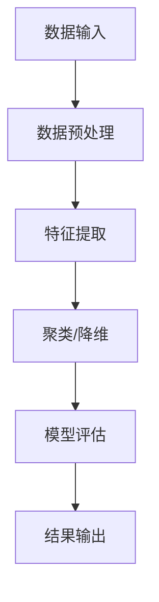

                 

关键词：人工智能，无监督学习，预测模型，深度学习，数据挖掘

摘要：本文将深入探讨人工智能（AI）领域中的一种关键技术——无监督学习，以及它如何被应用于开发智能预测模型。我们将介绍无监督学习的核心概念、算法原理、数学模型、应用实例，以及未来的发展趋势和面临的挑战。

## 1. 背景介绍

在当今快速发展的信息技术时代，人工智能（AI）已经成为驱动创新和变革的重要力量。从自动化到智能推荐系统，AI 的应用无处不在。然而，AI 的成功依赖于预测模型的有效构建，而这些模型往往需要大量的标注数据。这种对标注数据的依赖带来了两个主要问题：

1. **数据获取困难**：在某些领域，如医学和金融，获取足够的标注数据是一项复杂的任务，可能需要大量的人力和时间成本。
2. **隐私和安全问题**：在处理敏感数据时，特别是在涉及个人隐私的数据时，共享和公开标注数据可能会引发伦理和法律问题。

为了解决这些问题，无监督学习（Unsupervised Learning）应运而生。无监督学习是一种无需标签数据就能自动发现数据中隐藏模式的机器学习方法。这种方法在数据挖掘、图像识别、自然语言处理等领域中有着广泛的应用。通过无监督学习，我们可以从大量的未标注数据中提取有价值的信息，从而降低对标注数据的依赖，提高预测模型的准确性。

本文将重点探讨无监督学习在构建智能预测模型中的应用，详细介绍其核心概念、算法原理、数学模型以及实际应用案例。同时，我们还将探讨无监督学习未来的发展趋势和面临的挑战，为读者提供全面的技术视角。

## 2. 核心概念与联系

### 2.1 无监督学习概述

无监督学习是一种从未标注数据中学习数据内在结构和模式的方法。与监督学习（Supervised Learning）相反，监督学习需要使用标签数据来训练模型，而无监督学习不需要这样的标签。无监督学习的目的是通过将数据点分组或聚类，揭示数据中的隐藏结构。

### 2.2 无监督学习的应用领域

无监督学习在以下领域有着广泛的应用：

- **数据挖掘**：通过聚类技术，发现数据中的模式和关联。
- **图像识别**：无监督学习在图像识别中的应用，如自动分割图像中的对象。
- **自然语言处理**：通过无监督学习方法，对大量未标注的文本进行分类和主题建模。
- **推荐系统**：无监督学习可用于构建个性化的推荐系统，无需依赖用户的历史行为数据。

### 2.3 无监督学习与深度学习的关联

无监督学习与深度学习（Deep Learning）有着紧密的联系。深度学习通常依赖于大量的未标注数据进行训练，而其中的许多算法（如自编码器、生成对抗网络）本身就是无监督学习的一种形式。深度学习通过多层神经网络的结构，能够自动提取数据的特征表示，这些特征表示在预测任务中非常有用。

### 2.4 Mermaid 流程图

以下是一个简单的 Mermaid 流程图，展示了无监督学习的基本流程：



在这个流程图中，数据输入是未标注的数据集，经过数据预处理后，使用特征提取技术提取数据中的关键特征。接下来，通过聚类或降维技术，对数据点进行分组或压缩。最后，对模型进行评估，并将结果输出。

## 3. 核心算法原理 & 具体操作步骤

### 3.1 算法原理概述

无监督学习的核心在于利用数据自身的内在结构，自动发现数据中的模式。常见的无监督学习算法包括：

- **聚类算法**：如 K-Means、层次聚类等，通过将数据点分为多个组，使得组内数据点之间的相似度最高，组间数据点之间的相似度最低。
- **降维算法**：如 Principal Component Analysis（PCA）、t-Distributed Stochastic Neighbor Embedding（t-SNE）等，通过降低数据维度，同时保留数据的主要结构信息。
- **生成模型**：如生成对抗网络（GANs）、变分自编码器（VAEs）等，通过学习数据分布，生成新的数据。

### 3.2 算法步骤详解

以下是一个典型的无监督学习流程：

1. **数据收集**：从各种来源收集大量的未标注数据。
2. **数据预处理**：清洗数据，包括去除噪声、填充缺失值、标准化等。
3. **特征提取**：使用降维技术，如 PCA，提取数据的主要特征。
4. **模型选择**：选择合适的无监督学习算法，如 K-Means。
5. **模型训练**：使用训练数据，对模型进行训练。
6. **模型评估**：使用测试数据，评估模型的性能。
7. **结果输出**：根据模型输出，对数据进行分类或聚类。

### 3.3 算法优缺点

**优点**：

- **无需标签数据**：适用于标注数据获取困难或成本高昂的领域。
- **数据探索性**：通过无监督学习，可以揭示数据中的隐藏结构和模式。
- **减少过拟合**：由于无需使用标签数据，可以减少模型对特定样本的依赖，降低过拟合的风险。

**缺点**：

- **可解释性低**：无监督学习模型通常较为复杂，难以解释。
- **性能受限**：在一些任务中，无监督学习可能无法达到与监督学习相同的性能。

### 3.4 算法应用领域

无监督学习在以下领域有着广泛的应用：

- **客户行为分析**：通过聚类分析，发现客户的购买行为模式。
- **图像识别**：自动分割图像中的对象，进行图像识别。
- **文本分类**：对大量未标注的文本进行分类和主题建模。
- **异常检测**：在金融、安全等领域，用于检测异常行为。

## 4. 数学模型和公式

### 4.1 数学模型构建

无监督学习中的数学模型通常涉及以下两个主要部分：

- **数据分布模型**：描述数据点的概率分布。
- **损失函数**：衡量模型预测与实际数据之间的差异。

### 4.2 公式推导过程

以下是一个简单的 K-Means 聚类算法的数学推导：

1. **初始化聚类中心**：随机选择 K 个数据点作为初始聚类中心。
2. **分配数据点**：对于每个数据点，计算它与每个聚类中心的距离，并将其分配到最近的聚类中心。
3. **更新聚类中心**：计算每个聚类中心的平均值，作为新的聚类中心。
4. **重复步骤 2 和 3**，直到聚类中心不再发生显著变化。

### 4.3 案例分析与讲解

以下是一个简单的 K-Means 聚类算法的案例：

**数据集**：一个包含 100 个数据点的二维数据集。

**K 值**：2

**初始聚类中心**：选择数据集中的前两个数据点作为初始聚类中心。

**分配数据点**：计算每个数据点到两个聚类中心的距离，并将每个数据点分配到距离更近的聚类中心。

**更新聚类中心**：计算两个聚类中心的平均值，作为新的聚类中心。

**重复过程**：重复分配数据点和更新聚类中心的步骤，直到聚类中心不再发生变化。

最终，数据点将被分为两个聚类，每个聚类中心将代表一个聚类。

## 5. 项目实践：代码实例和详细解释说明

### 5.1 开发环境搭建

在本项目实践中，我们将使用 Python 和 Scikit-Learn 库进行无监督学习实验。

- 安装 Python（3.8 或更高版本）
- 安装 Scikit-Learn 库

```shell
pip install scikit-learn
```

### 5.2 源代码详细实现

以下是一个简单的 K-Means 聚类算法的实现：

```python
from sklearn.cluster import KMeans
import matplotlib.pyplot as plt
import numpy as np

# 加载示例数据
data = np.array([[1, 2], [1, 4], [1, 0],
                 [10, 2], [10, 4], [10, 0]])

# 初始化 K-Means 模型
kmeans = KMeans(n_clusters=2, random_state=0).fit(data)

# 输出聚类结果
print(kmeans.labels_)

# 绘制聚类结果
plt.scatter(data[:, 0], data[:, 1], c=kmeans.labels_)
plt.scatter(kmeans.cluster_centers_[:, 0], kmeans.cluster_centers_[:, 1], s=300, c='red')
plt.show()
```

### 5.3 代码解读与分析

- **数据加载**：我们使用了一个简单的二维数据集，包含 6 个数据点。
- **模型初始化**：我们使用 `KMeans` 类初始化一个 K-Means 模型，指定 `n_clusters=2` 表示我们希望将数据分为 2 个聚类。
- **模型训练**：使用 `fit` 方法对模型进行训练。
- **输出结果**：打印出每个数据点的标签，即它们被分配到的聚类。
- **绘制结果**：使用 `scatter` 函数绘制聚类结果，红色点表示聚类中心。

### 5.4 运行结果展示

运行上述代码后，我们将看到一个二维坐标系，其中包含 6 个数据点和 2 个聚类中心。每个数据点被分配到一个聚类，聚类中心用红色标记。

## 6. 实际应用场景

### 6.1 客户行为分析

无监督学习在客户行为分析中有着广泛的应用。通过聚类分析，企业可以识别出具有相似行为的客户群体，从而更好地进行市场营销和客户服务。例如，电子商务平台可以使用无监督学习来发现购买行为相似的客户，并根据这些客户的特点提供个性化的推荐。

### 6.2 图像识别

在图像识别领域，无监督学习可以用于自动分割图像中的对象。例如，在医疗影像分析中，无监督学习可以自动将图像中的病变区域与正常区域分开，为医生提供诊断参考。此外，无监督学习还可以用于图像合成和风格迁移，创造出令人惊叹的艺术作品。

### 6.3 文本分类

无监督学习在文本分类中也有着重要的应用。通过主题建模技术，如 Latent Dirichlet Allocation（LDA），可以自动发现文本数据中的潜在主题，从而为新闻分类、社交媒体分析等任务提供支持。

### 6.4 未来应用展望

随着无监督学习技术的不断进步，其在各个领域的应用将越来越广泛。未来，无监督学习有望在以下几个方面取得重要突破：

- **增强模型可解释性**：开发新的算法和技术，提高无监督学习模型的可解释性。
- **处理大规模数据**：优化算法，提高处理大规模数据的能力。
- **跨领域应用**：将无监督学习应用于新的领域，解决复杂的实际问题。

## 7. 工具和资源推荐

### 7.1 学习资源推荐

- **《深度学习》（Goodfellow et al.）**：提供了关于无监督学习和深度学习的全面介绍。
- **Scikit-Learn 官方文档**：提供了丰富的无监督学习算法实现和示例。

### 7.2 开发工具推荐

- **Jupyter Notebook**：用于编写和运行代码，非常适合进行机器学习实验。
- **Google Colab**：免费的云端 Jupyter Notebook 环境，适合进行大规模数据处理和模型训练。

### 7.3 相关论文推荐

- **“Unsupervised Learning of Visual Representations by Solving Jigsaw Puzzles”**：介绍了利用拼图游戏进行无监督学习的方法。
- **“Unsupervised Representation Learning”**：探讨了无监督学习在计算机视觉中的应用。

## 8. 总结：未来发展趋势与挑战

### 8.1 研究成果总结

无监督学习作为人工智能领域的一个重要分支，已经取得了显著的成果。通过自动发现数据中的隐藏模式，无监督学习在图像识别、文本分类、客户行为分析等领域中有着广泛的应用。未来，无监督学习将继续发挥重要作用，推动人工智能技术的发展。

### 8.2 未来发展趋势

- **算法优化**：开发更高效的算法，提高无监督学习在大规模数据集上的处理能力。
- **模型可解释性**：提高模型的可解释性，使研究人员和从业者能够更好地理解模型的决策过程。
- **跨领域应用**：将无监督学习应用于新的领域，解决复杂的实际问题。

### 8.3 面临的挑战

- **数据质量**：无监督学习对数据质量要求较高，数据中的噪声和异常值可能影响模型的性能。
- **模型泛化性**：如何提高无监督学习模型的泛化性，使其在不同数据集上都能保持良好的性能。

### 8.4 研究展望

无监督学习在未来将继续在人工智能领域中发挥重要作用。随着算法的优化和跨领域应用的拓展，无监督学习有望在更多的实际问题中取得突破，推动人工智能技术的发展。

## 9. 附录：常见问题与解答

### 9.1 无监督学习与监督学习有什么区别？

无监督学习不需要标签数据，而是从未标注的数据中自动发现模式。相比之下，监督学习需要使用标签数据来训练模型。

### 9.2 无监督学习有哪些常见的算法？

常见的无监督学习算法包括 K-Means、层次聚类、PCA、t-SNE 等。

### 9.3 无监督学习在哪些领域有应用？

无监督学习在图像识别、文本分类、客户行为分析、推荐系统等领域有广泛应用。

### 9.4 如何评估无监督学习模型的性能？

可以使用内部评估指标（如聚类系数、轮廓系数等）和外部评估指标（如精度、召回率等）来评估无监督学习模型的性能。

---

作者：禅与计算机程序设计艺术 / Zen and the Art of Computer Programming

