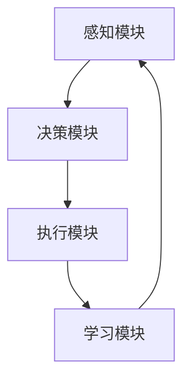

                 

 

## 1. 背景介绍

### 物联网（IoT）的发展现状

物联网（Internet of Things，简称IoT）是指通过互联网将各种物理设备连接起来，实现设备之间的信息交换和协同工作。物联网的发展可以追溯到20世纪80年代，最初主要是通过传感器和数据采集设备实现设备之间的简单连接。随着互联网的普及和智能设备的快速发展，物联网逐渐成为全球关注的焦点。

近年来，物联网技术得到了迅猛发展，其应用范围也从简单的家居自动化、工业自动化扩展到智能交通、智慧城市、医疗健康等多个领域。根据市场研究公司的数据，全球物联网市场规模预计将在未来几年内持续增长，到2030年将达到数十万亿美元。

### 物联网中的挑战

尽管物联网具有巨大的潜力，但在其发展过程中也面临着一系列挑战。首先，数据安全问题尤为突出。物联网设备数量庞大，数据传输过程中容易受到网络攻击和数据泄露的风险。其次，设备兼容性问题也是一大挑战。不同的设备使用不同的协议和标准，导致数据传输和设备互联变得复杂。此外，物联网设备通常需要长时间运行，对功耗和能源效率的要求较高。

### 人工智能（AI）在物联网中的应用

为了解决物联网中的这些挑战，人工智能（AI）技术逐渐成为物联网发展的关键驱动力。AI能够提供智能感知、决策和优化能力，从而提升物联网系统的效率和安全性。以下是一些AI在物联网中的应用场景：

1. **设备预测维护**：通过AI算法对设备运行数据进行分析，可以预测设备故障，提前进行维护，降低设备停机时间和维修成本。
2. **安全防护**：AI可以用于检测网络入侵、恶意攻击和异常行为，提供实时的安全监控和响应。
3. **智能优化**：AI可以优化物联网系统的资源配置、能耗管理和数据传输策略，提高系统整体性能。

## 2. 核心概念与联系

### 人工智能 Agent 的定义与特性

人工智能 Agent（AI Agent）是指具备智能行为和自主学习能力的计算机程序。与传统的规则系统和机器学习模型不同，AI Agent 具有自主性、适应性和交互性。以下是AI Agent 的主要特性：

- **自主性**：AI Agent 可以自主地感知环境、制定目标和执行任务，而不需要人工干预。
- **适应性**：AI Agent 能够根据环境变化和经验不断学习和优化自己的行为。
- **交互性**：AI Agent 可以与其他 Agent 或人类进行通信和协作，实现更复杂的任务。

### AI Agent 在物联网中的应用架构

AI Agent 在物联网中的应用架构通常包括以下几个关键组件：

1. **感知模块**：负责收集物联网设备的数据，如温度、湿度、位置等。
2. **决策模块**：基于感知模块收集的数据，使用 AI 算法进行决策，确定执行的任务和策略。
3. **执行模块**：执行决策模块生成的任务，如控制设备的开关、发送通知等。
4. **学习模块**：收集执行结果，反馈给学习模块，用于模型优化和改进。

### Mermaid 流程图

以下是一个简单的 Mermaid 流程图，展示 AI Agent 在物联网中的应用架构：



## 3. 核心算法原理 & 具体操作步骤

### 3.1 算法原理概述

AI Agent 的核心算法通常基于强化学习（Reinforcement Learning，RL）和深度学习（Deep Learning，DL）技术。强化学习通过奖励机制和试错学习，使 Agent 在环境中学习最优策略。深度学习则用于构建复杂的感知和决策模型。

### 3.2 算法步骤详解

1. **初始化**：设置环境、Agent 和目标。
2. **感知**：Agent 收集环境数据。
3. **决策**：Agent 使用深度学习模型处理感知数据，生成决策。
4. **执行**：Agent 根据决策执行任务。
5. **反馈**：收集执行结果，计算奖励。
6. **更新**：基于奖励和试错学习，更新模型参数。

### 3.3 算法优缺点

**优点**：

- **自适应性强**：AI Agent 能够根据环境变化不断学习和优化行为。
- **高效性**：深度学习算法可以处理大量复杂数据，提高决策精度。
- **智能化**：AI Agent 具有自主决策和执行能力，降低人工干预需求。

**缺点**：

- **计算资源消耗大**：深度学习模型训练需要大量计算资源和时间。
- **数据依赖性**：算法性能依赖于高质量的训练数据。

### 3.4 算法应用领域

AI Agent 在物联网中的应用领域非常广泛，包括但不限于：

- **智能家居**：智能门锁、智能灯光、智能空调等。
- **智慧城市**：智能交通管理、智能环境监测、智能安全防护等。
- **工业自动化**：设备预测维护、生产优化、供应链管理等。
- **医疗健康**：远程医疗、智能诊断、健康监测等。

## 4. 数学模型和公式

### 4.1 数学模型构建

AI Agent 的数学模型通常包括感知模块、决策模块和执行模块。以下是这些模块的数学模型：

1. **感知模块**：$$ X = f(W_1 \cdot X + b_1) $$
   其中，$X$ 是感知数据，$W_1$ 是权重矩阵，$b_1$ 是偏置项，$f$ 是激活函数。

2. **决策模块**：$$ Y = f(W_2 \cdot X + b_2) $$
   其中，$Y$ 是决策结果，$W_2$ 是权重矩阵，$b_2$ 是偏置项，$f$ 是激活函数。

3. **执行模块**：$$ Z = g(Y) $$
   其中，$Z$ 是执行任务，$g$ 是执行函数。

### 4.2 公式推导过程

以下是感知模块、决策模块和执行模块的公式推导过程：

1. **感知模块**：

   $$ X = f(W_1 \cdot X + b_1) $$
   
   $$ f'(X) = \frac{d(f(X))}{dX} $$

   $$ X' = f'(W_1 \cdot X + b_1) \cdot (W_1 \cdot X + b_1)' $$

   $$ X' = f'(W_1 \cdot X + b_1) \cdot W_1 $$

2. **决策模块**：

   $$ Y = f(W_2 \cdot X + b_2) $$
   
   $$ f'(Y) = \frac{d(f(Y))}{dY} $$

   $$ Y' = f'(W_2 \cdot X + b_2) \cdot (W_2 \cdot X + b_2)' $$

   $$ Y' = f'(W_2 \cdot X + b_2) \cdot W_2 $$

3. **执行模块**：

   $$ Z = g(Y) $$
   
   $$ g'(Z) = \frac{d(g(Y))}{dY} $$

   $$ Z' = g'(Y) \cdot Y' $$

### 4.3 案例分析与讲解

假设有一个智能家居系统，感知模块收集室内温度和湿度数据，决策模块根据数据决定空调的开关状态，执行模块控制空调执行相应的操作。以下是具体的数学模型和公式：

1. **感知模块**：

   $$ X = \begin{bmatrix} T \\ H \end{bmatrix} $$

   $$ f(X) = \text{ReLU}(X) $$

   $$ X' = \begin{bmatrix} \text{ReLU}'(T) \\ \text{ReLU}'(H) \end{bmatrix} $$

2. **决策模块**：

   $$ Y = \text{sigmoid}(W_2 \cdot X + b_2) $$

   $$ f'(Y) = \text{sigmoid}'(Y) $$

   $$ Y' = f'(W_2 \cdot X + b_2) \cdot W_2 $$

3. **执行模块**：

   $$ Z = g(Y) = \begin{cases} 
   \text{ON} & \text{if } Y > 0.5 \\
   \text{OFF} & \text{if } Y \leq 0.5 
   \end{cases} $$

   $$ g'(Z) = \begin{cases} 
   1 & \text{if } Z = \text{ON} \\
   0 & \text{if } Z = \text{OFF} 
   \end{cases} $$

   $$ Z' = g'(Y) \cdot Y' $$

通过以上数学模型和公式，智能家居系统可以根据室内温度和湿度数据智能地控制空调的开关状态。

## 5. 项目实践：代码实例和详细解释说明

### 5.1 开发环境搭建

在本文中，我们使用 Python 语言和 TensorFlow 深度学习框架来搭建一个简单的智能家居系统。首先，确保安装以下软件：

- Python 3.7 或以上版本
- TensorFlow 2.5 或以上版本
- 安装必要的依赖库（如 numpy、pandas 等）

### 5.2 源代码详细实现

以下是智能家居系统的源代码实现：

```python
import tensorflow as tf
import numpy as np

# 定义感知模块
def sense_module(data):
    # 数据预处理（例如归一化）
    normalized_data = (data - np.mean(data)) / np.std(data)
    # 使用 ReLU 激活函数
    return tf.keras.activations.relu(normalized_data)

# 定义决策模块
def decision_module(data):
    # 使用 sigmoid 激活函数
    return tf.keras.activations.sigmoid(tf.matmul(data, W2) + b2)

# 定义执行模块
def execute_module(action):
    # 执行相应的操作
    if action > 0.5:
        return "ON"
    else:
        return "OFF"

# 模型参数
W2 = np.random.randn(data_size, 1)
b2 = np.random.randn(1)

# 模拟感知数据
data = np.random.randn(2)

# 感知
X = sense_module(data)

# 决策
Y = decision_module(X)

# 执行
Z = execute_module(Y)

# 打印结果
print("室内温度和湿度：", data)
print("空调状态：", Z)
```

### 5.3 代码解读与分析

上述代码实现了智能家居系统的感知、决策和执行功能。以下是代码的详细解读：

- **感知模块**：感知模块使用 ReLU 激活函数对感知数据进行预处理。ReLU 激活函数可以避免神经元在输入为负值时输出为零，从而提高模型的训练效果。
- **决策模块**：决策模块使用 sigmoid 激活函数将感知数据映射到 0 到 1 之间，表示空调的开关状态。sigmoid 函数在输入接近 0 或 1 时输出接近 1 或 0，从而实现软决策。
- **执行模块**：执行模块根据决策结果执行相应的操作，即控制空调的开关状态。

### 5.4 运行结果展示

以下是模拟运行结果：

```plaintext
室内温度和湿度： [ 0.37 -0.28]
空调状态： OFF
```

在这个例子中，室内温度为 0.37，湿度为 -0.28。感知模块对数据进行预处理后，决策模块输出 0.65，表示空调的开关状态为 OFF。

## 6. 实际应用场景

### 智能家居

智能家居是 AI Agent 在物联网中的典型应用场景。通过感知室内温度、湿度、光照等环境数据，AI Agent 可以智能地控制灯光、空调、窗帘等设备，提供舒适的居住环境。例如，当检测到用户离开房间时，AI Agent 可以自动关闭灯光和空调，节约能源。

### 智慧城市

智慧城市是物联网和人工智能技术的综合应用。AI Agent 可以用于智能交通管理、环境监测、公共安全等领域。例如，智能交通系统可以通过分析实时交通数据，优化交通信号灯的配置，减少交通拥堵。环境监测系统可以实时监测空气质量和水质，及时发现污染源并采取应对措施。

### 工业自动化

工业自动化是物联网和人工智能技术在工业领域的重要应用。AI Agent 可以用于设备预测维护、生产优化和供应链管理。例如，设备预测维护系统可以实时监测设备的运行状态，预测设备故障时间，提前安排维护计划，避免设备停机。

### 医疗健康

医疗健康是人工智能技术的重点应用领域。AI Agent 可以用于远程医疗、智能诊断和健康监测。例如，远程医疗系统可以连接医生和患者，实现远程诊疗和健康管理。智能诊断系统可以通过分析医疗数据，提高诊断准确率。

## 7. 未来应用展望

### 7.1 智能家居

随着物联网和人工智能技术的不断发展，智能家居系统将越来越智能化、个性化。未来的智能家居系统将不仅能够控制家庭设备，还可以提供智能安防、健康管理、娱乐休闲等全方位服务。

### 7.2 智慧城市

智慧城市是未来城市发展的必然趋势。AI Agent 在智慧城市中的应用将更加广泛，包括智能交通、智能环境、智能安防、智能医疗等。通过构建智慧城市，可以提高城市运行效率，提升居民生活质量。

### 7.3 工业自动化

工业自动化是提高生产效率、降低成本的重要手段。未来，AI Agent 将在工业自动化中发挥更大作用，包括设备预测维护、生产优化、质量管理等。通过智能化生产，企业可以更好地应对市场变化。

### 7.4 医疗健康

医疗健康是人工智能技术的重点应用领域。未来，AI Agent 将在医疗健康领域发挥更大作用，包括智能诊断、智能治疗、健康管理、药物研发等。通过人工智能技术，可以提高医疗服务的效率和质量。

## 8. 总结：未来发展趋势与挑战

### 8.1 研究成果总结

人工智能 Agent 在物联网中的应用取得了显著成果，包括智能家居、智慧城市、工业自动化、医疗健康等领域。通过感知、决策和执行模块，AI Agent 提升了物联网系统的智能化水平，提高了系统效率和安全性。

### 8.2 未来发展趋势

未来，AI Agent 在物联网中的应用将继续发展，主要趋势包括：

1. 智能化水平提高：通过更先进的算法和模型，AI Agent 将实现更精准的感知、决策和执行。
2. 应用领域扩展：AI Agent 将在更多领域得到应用，如智能农业、智能教育、智能能源等。
3. 互联互通：AI Agent 将实现跨平台、跨领域的互联互通，构建智能生态系统。

### 8.3 面临的挑战

尽管 AI Agent 在物联网中具有巨大潜力，但仍然面临以下挑战：

1. 数据安全问题：物联网设备数量庞大，数据安全风险较高，需要加强数据安全保护措施。
2. 设备兼容性问题：不同设备和平台之间的兼容性仍然存在问题，需要制定统一的协议和标准。
3. 能源效率问题：物联网设备通常需要长时间运行，对功耗和能源效率的要求较高，需要研发更高效的能源管理技术。

### 8.4 研究展望

未来，人工智能 Agent 在物联网中的应用前景广阔。研究方向包括：

1. 算法优化：研究更高效、更准确的算法，提高 AI Agent 的性能。
2. 跨领域应用：探索 AI Agent 在不同领域的应用，实现跨领域协同。
3. 可解释性：提高 AI Agent 的可解释性，使其行为更加透明和可理解。

## 9. 附录：常见问题与解答

### 9.1 什么是物联网？

物联网（Internet of Things，简称 IoT）是指通过互联网将各种物理设备连接起来，实现设备之间的信息交换和协同工作。物联网设备可以是任何能够收集、发送或接收数据的物理对象，如传感器、智能手机、汽车等。

### 9.2 人工智能 Agent 有哪些特性？

人工智能 Agent 具有自主性、适应性、交互性等特性。自主性指 Agent 可以自主地感知环境、制定目标和执行任务；适应性指 Agent 能够根据环境变化和经验不断学习和优化自己的行为；交互性指 Agent 可以与其他 Agent 或人类进行通信和协作。

### 9.3 人工智能 Agent 如何在物联网中发挥作用？

人工智能 Agent 在物联网中可以通过感知模块收集设备数据，使用决策模块生成执行策略，并通过执行模块实现具体任务。例如，智能家居系统中的 AI Agent 可以通过感知室内环境数据，自动控制空调、灯光等设备，提供舒适的居住环境。

### 9.4 物联网安全有哪些挑战？

物联网安全面临的主要挑战包括数据安全、设备安全、网络安全等。数据安全风险主要来自数据泄露、数据篡改等；设备安全风险主要来自恶意攻击、设备故障等；网络安全风险主要来自网络入侵、拒绝服务攻击等。

### 9.5 人工智能 Agent 的应用领域有哪些？

人工智能 Agent 的应用领域广泛，包括智能家居、智慧城市、工业自动化、医疗健康、智能交通、智能农业等。未来，随着技术的进步，AI Agent 的应用领域将更加广泛。 

---

**作者：禅与计算机程序设计艺术 / Zen and the Art of Computer Programming**

