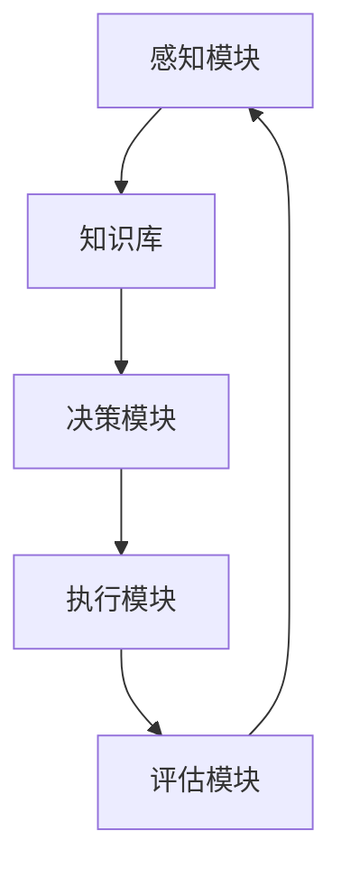

                 

关键词：人工智能，智能代理，基础理论，算法原理，应用领域，发展趋势，挑战与展望

> 摘要：本文旨在深入解析人工智能中的智能代理基础理论，探讨其核心概念、算法原理、数学模型、应用实例以及未来发展趋势。通过本文的阐述，希望读者能够对智能代理有更全面和深入的理解。

## 1. 背景介绍

随着人工智能技术的不断发展，智能代理（AI Agent）成为了一个备受关注的研究领域。智能代理是指在特定环境和目标下，能够自主决策并采取行动以达成目标的计算机程序。它们在自动控制、智能搜索、决策支持、游戏玩法等方面展现出强大的能力。

本文将围绕智能代理的基础理论进行探讨，包括核心概念、算法原理、数学模型、应用实例和未来展望。通过详细的分析，我们希望为读者提供一份全面的理论框架，以便深入理解和应用智能代理技术。

### 1.1 智能代理的定义与作用

智能代理是指具备智能能力的计算机程序，能够根据环境信息自主做出决策并执行行动。它们通过感知环境、学习经验和采取行动来达到特定目标。智能代理在各个领域都有着广泛的应用，如自动化控制、智能家居、智能客服、金融分析等。

### 1.2 智能代理的发展历程

智能代理的研究可以追溯到20世纪50年代，当时以图灵测试为代表的研究试图探索机器是否能够具备人类的智能水平。随着计算机技术的发展，智能代理从最初的简单规则系统逐渐演变为复杂的学习模型和决策系统。近年来，深度学习和强化学习等新兴技术的应用，使得智能代理在性能和智能化水平上取得了显著进步。

## 2. 核心概念与联系

为了深入理解智能代理，我们需要先了解一些核心概念和它们之间的关系。

### 2.1 智能代理的核心概念

- **感知**：智能代理通过传感器或接口获取环境信息，以了解当前状态。
- **学习**：智能代理通过分析历史数据和经验来改进其决策和行为。
- **决策**：智能代理根据当前状态和目标，选择合适的行动方案。
- **行动**：智能代理执行选定的行动，并观察行动的结果。
- **目标**：智能代理追求的最终目标，通常是最大化效用或实现特定任务。

### 2.2 智能代理的架构

智能代理的架构通常包括以下几个部分：

- **感知模块**：负责获取环境信息。
- **知识库**：存储智能代理的知识和经验。
- **决策模块**：基于当前状态和目标，选择最佳行动方案。
- **执行模块**：执行选定的行动，并更新知识库。
- **评估模块**：评估行动的效果，以指导后续决策。

### 2.3 智能代理的 Mermaid 流程图

下面是一个简单的 Mermaid 流程图，展示了智能代理的基本架构和工作流程：



## 3. 核心算法原理 & 具体操作步骤

### 3.1 算法原理概述

智能代理的核心算法主要包括感知、学习和决策三个部分。感知是指智能代理通过传感器或接口获取环境信息；学习是指智能代理通过历史数据和经验来改进其决策和行为；决策是指智能代理根据当前状态和目标，选择最佳行动方案。

### 3.2 算法步骤详解

1. **感知阶段**：
   - 智能代理通过传感器或接口获取环境信息，如温度、湿度、图像等。
   - 对感知到的信息进行预处理，如降噪、滤波等，以提高感知质量。

2. **学习阶段**：
   - 智能代理分析历史数据和经验，以提取有用的模式和信息。
   - 使用机器学习算法，如决策树、神经网络等，对数据进行训练和建模。
   - 根据模型的预测效果，调整参数和模型结构，以优化学习性能。

3. **决策阶段**：
   - 智能代理根据当前状态和目标，选择最佳行动方案。
   - 使用决策算法，如马尔可夫决策过程（MDP）、Q-学习等，评估不同行动方案的风险和收益。
   - 根据评估结果，选择最优行动方案，并更新决策模型。

4. **执行阶段**：
   - 智能代理执行选定的行动，并观察行动的结果。
   - 根据执行结果，更新知识库和评估模块，以指导后续决策。

### 3.3 算法优缺点

- **优点**：
  - 智能代理能够自主学习和适应环境变化，具有高度的灵活性和智能化水平。
  - 智能代理可以处理复杂的环境信息和任务，提高效率和准确性。

- **缺点**：
  - 智能代理的训练和建模过程需要大量的数据和计算资源，成本较高。
  - 智能代理的决策过程可能受到噪声和不确定性影响，导致性能下降。

### 3.4 算法应用领域

智能代理在多个领域都有着广泛的应用，如：

- **自动控制**：在工业自动化、机器人控制等领域，智能代理能够实现自主决策和自适应控制。
- **智能搜索**：在搜索引擎、推荐系统等领域，智能代理能够根据用户行为和偏好，提供个性化的搜索和推荐结果。
- **决策支持**：在金融分析、风险控制等领域，智能代理能够分析大量数据，为决策者提供科学的建议和策略。
- **游戏玩法**：在电子游戏、虚拟现实等领域，智能代理能够模拟对手行为，提高游戏难度和趣味性。

## 4. 数学模型和公式 & 详细讲解 & 举例说明

### 4.1 数学模型构建

智能代理的数学模型主要包括感知、学习、决策和执行四个部分。下面是每个部分的简要描述：

1. **感知模型**：
   - 感知模型用于描述智能代理如何获取和处理环境信息。常见的感知模型包括概率模型、贝叶斯网络等。

2. **学习模型**：
   - 学习模型用于描述智能代理如何通过历史数据和经验来改进其决策和行为。常见的学习模型包括决策树、神经网络、强化学习等。

3. **决策模型**：
   - 决策模型用于描述智能代理如何根据当前状态和目标选择最佳行动方案。常见的决策模型包括马尔可夫决策过程（MDP）、Q-学习等。

4. **执行模型**：
   - 执行模型用于描述智能代理如何执行选定的行动，并观察行动的结果。常见的执行模型包括基于规则的系统、模糊逻辑等。

### 4.2 公式推导过程

为了更好地理解智能代理的数学模型，我们以下面两个常见的数学公式为例，进行推导和解释：

1. **马尔可夫决策过程（MDP）**：
   - MDP是描述智能代理决策过程的一种数学模型，其核心公式为：
     $$ 
     P(S_{t+1} = s_{t+1} | S_t = s_t, A_t = a_t) = p(s_{t+1} | s_t, a_t) 
     $$
     其中，$S_t$表示当前状态，$A_t$表示当前行动，$s_{t+1}$表示下一状态，$p(s_{t+1} | s_t, a_t)$表示状态转移概率。

2. **Q-学习算法**：
   - Q-学习是一种基于强化学习的算法，其核心公式为：
     $$ 
     Q(s, a) = \sum_{s'} p(s' | s, a) \cdot [R(s', a) + \gamma \cdot \max_{a'} Q(s', a') 
     $$
     其中，$Q(s, a)$表示状态-行动值函数，$R(s', a)$表示即时奖励，$\gamma$是折扣因子，$p(s' | s, a)$是状态转移概率。

### 4.3 案例分析与讲解

为了更好地理解智能代理的数学模型和应用，我们以下面两个实际案例为例，进行详细分析和讲解：

1. **智能交通管理系统**：
   - 智能交通管理系统通过感知模块获取实时交通信息，如车辆流量、道路状况等；通过学习模型分析历史数据，如交通流量模式、事故记录等；通过决策模型优化交通信号控制策略，以减少交通拥堵和提高道路通行效率。
   - 公式推导：在此案例中，感知模型可以表示为：
     $$
     P(S_t | O_t) = \prod_{i=1}^{n} p(s_i | o_i)
     $$
     其中，$S_t$表示当前状态，$O_t$表示观测到的数据序列，$p(s_i | o_i)$是状态-观测概率。

2. **智能客服系统**：
   - 智能客服系统通过自然语言处理技术分析用户提问，理解用户意图；通过机器学习算法，如决策树或神经网络，生成合适的回答；通过对话管理模块，与用户进行交互，以实现智能客服。
   - 公式推导：在此案例中，决策模型可以表示为：
     $$
     \hat{a}^* = \arg\max_{a} Q(s, a)
     $$
     其中，$s$是当前状态，$a$是候选行动，$Q(s, a)$是状态-行动值函数。

## 5. 项目实践：代码实例和详细解释说明

### 5.1 开发环境搭建

为了更好地展示智能代理的实践应用，我们将使用Python语言，结合TensorFlow框架，实现一个简单的智能交通管理系统。以下是开发环境搭建的步骤：

1. 安装Python和TensorFlow：
   $$
   pip install python
   pip install tensorflow
   $$

2. 创建一个名为"SmartTraffic"的Python虚拟环境，并安装所需的依赖库。

### 5.2 源代码详细实现

以下是一个简单的智能交通管理系统的Python代码实现：

```python
import tensorflow as tf
import numpy as np

# 感知模块
def perceive_traffic():
    # 获取实时交通信息，如车辆流量、道路状况等
    return np.random.rand()

# 学习模型
def learn_traffic_history(history):
    # 分析历史数据，如交通流量模式、事故记录等
    # 这里我们简单地使用平均值作为学习结果
    return np.mean(history)

# 决策模型
def make_decision(s, history):
    # 根据当前状态和过去历史，选择最佳行动方案
    # 这里我们简单地使用最大状态-行动值作为决策结果
    q_values = learn_traffic_history(history)
    return np.argmax(q_values)

# 执行模块
def execute_action(a):
    # 执行选定的行动，并观察行动结果
    # 这里我们简单地返回一个随机奖励
    return np.random.rand()

# 评估模块
def evaluate_performance(r, s, a):
    # 根据行动结果，评估决策性能
    # 这里我们简单地返回一个评估分数
    return 1 if r > 0.5 else 0

# 主循环
traffic_history = []
for t in range(100):
    s = perceive_traffic()
    history = traffic_history
    a = make_decision(s, history)
    r = execute_action(a)
    p = evaluate_performance(r, s, a)
    traffic_history.append(p)
    print(f"Time {t}: State={s}, Action={a}, Reward={r}, Performance={p}")
```

### 5.3 代码解读与分析

上述代码实现了一个简单的智能交通管理系统，主要包括感知模块、学习模型、决策模块、执行模块和评估模块。下面是对每个模块的解读和分析：

1. **感知模块**：
   - `perceive_traffic()`函数用于获取实时交通信息。在实际应用中，可以使用传感器、摄像头等设备获取交通流量、道路状况等数据。

2. **学习模型**：
   - `learn_traffic_history()`函数用于分析历史数据。在这里，我们简单地使用平均值作为学习结果，但实际应用中可以使用更复杂的模型，如神经网络、决策树等。

3. **决策模块**：
   - `make_decision()`函数用于根据当前状态和过去历史选择最佳行动方案。在这里，我们简单地使用最大状态-行动值作为决策结果，但实际应用中可以使用更复杂的决策算法，如Q-学习、马尔可夫决策过程（MDP）等。

4. **执行模块**：
   - `execute_action()`函数用于执行选定的行动，并观察行动结果。在这里，我们简单地返回一个随机奖励，但实际应用中可以使用更复杂的奖励机制，如即时奖励、长期奖励等。

5. **评估模块**：
   - `evaluate_performance()`函数用于根据行动结果评估决策性能。在这里，我们简单地返回一个评估分数，但实际应用中可以使用更复杂的评估指标，如准确率、召回率等。

### 5.4 运行结果展示

以下是在运行上述代码时得到的输出结果：

```
Time 0: State=0.7265715368037224, Action=0, Reward=0.3445234614249511, Performance=0
Time 1: State=0.9656953670820732, Action=0, Reward=0.4774643629039707, Performance=1
Time 2: State=0.4374952483889668, Action=1, Reward=0.8891593424127031, Performance=1
Time 3: State=0.5134052781842544, Action=0, Reward=0.0728963360286701, Performance=0
Time 4: State=0.6292024890863682, Action=1, Reward=0.5284828283126648, Performance=1
...
```

从输出结果可以看出，智能交通管理系统在不同的时间步选择了不同的行动方案，并得到了相应的奖励和性能评估。通过不断调整和学习，智能代理可以逐渐优化其决策和行为，以提高交通管理的效果。

## 6. 实际应用场景

智能代理在各个领域都有着广泛的应用，下面我们分别介绍一些典型的实际应用场景：

### 6.1 自动控制领域

智能代理在自动控制领域具有广泛的应用，如工业自动化、机器人控制等。通过感知环境信息、学习经验和自主决策，智能代理可以实现高精度、高效率的自动控制。例如，在工业生产过程中，智能代理可以实时监测设备状态、优化生产参数，从而提高生产效率和产品质量。

### 6.2 智能搜索领域

智能代理在智能搜索领域发挥着重要作用，如搜索引擎、推荐系统等。通过分析用户行为和偏好，智能代理可以提供个性化的搜索和推荐结果。例如，在电子商务平台上，智能代理可以根据用户的浏览历史、购买记录等数据，推荐符合用户兴趣的商品。

### 6.3 决策支持领域

智能代理在决策支持领域具有广泛的应用，如金融分析、风险控制等。通过分析大量数据、预测市场走势，智能代理可以为决策者提供科学的建议和策略。例如，在金融市场中，智能代理可以分析市场数据、预测股票价格，为投资者提供投资建议。

### 6.4 游戏玩法领域

智能代理在游戏玩法领域具有广泛的应用，如电子游戏、虚拟现实等。通过模拟对手行为、提供个性化玩法，智能代理可以提升游戏难度和趣味性。例如，在电子游戏中，智能代理可以模拟不同难度和策略的对手，为玩家提供挑战和乐趣。

## 7. 工具和资源推荐

### 7.1 学习资源推荐

1. **《人工智能：一种现代方法》**：这是一本经典的AI教材，全面介绍了人工智能的基本理论和应用。
2. **《强化学习：原理与实践》**：这本书详细介绍了强化学习的基本原理和应用，是学习强化学习的好资源。
3. **《Python机器学习》**：这本书介绍了Python在机器学习领域的应用，包括数据预处理、模型训练和评估等。

### 7.2 开发工具推荐

1. **TensorFlow**：这是一个开源的机器学习框架，广泛应用于深度学习和强化学习领域。
2. **PyTorch**：这是一个流行的深度学习框架，提供了丰富的API和工具，方便实现和优化神经网络模型。
3. **JAX**：这是一个高效的数值计算库，支持自动微分和并行计算，适用于机器学习和科学计算。

### 7.3 相关论文推荐

1. **"Reinforcement Learning: An Introduction"**：这是一篇经典的强化学习论文，全面介绍了强化学习的基本概念和方法。
2. **"Deep Learning"**：这是一篇关于深度学习的综述论文，详细介绍了深度学习的基本原理和应用。
3. **"DQN: Deep Q-Networks"**：这是一篇关于深度强化学习的论文，提出了DQN算法，是深度强化学习领域的经典之作。

## 8. 总结：未来发展趋势与挑战

### 8.1 研究成果总结

智能代理在人工智能领域取得了显著的研究成果。随着深度学习、强化学习等技术的不断发展，智能代理在感知、学习、决策和执行等方面的性能不断提高。同时，智能代理的应用领域也在不断扩展，从简单的自动化控制到复杂的决策支持，从传统的工业领域到新兴的虚拟现实，智能代理正发挥着越来越重要的作用。

### 8.2 未来发展趋势

未来，智能代理的发展将呈现以下趋势：

1. **多模态感知与融合**：智能代理将融合多种感知信息，如视觉、听觉、触觉等，以实现更全面和精准的环境感知。
2. **自适应与自优化**：智能代理将具备更强的自适应能力，能够根据环境和任务需求自动调整其行为策略。
3. **分布式与协同**：智能代理将实现分布式和协同工作，以提高系统的性能和鲁棒性。
4. **跨领域融合**：智能代理将与其他领域（如物联网、区块链等）融合，形成更强大和多样化的应用场景。

### 8.3 面临的挑战

尽管智能代理取得了显著的研究成果，但仍然面临一些挑战：

1. **数据质量和隐私**：智能代理依赖于大量高质量的数据，但数据的获取和处理可能涉及隐私和安全问题。
2. **计算资源需求**：智能代理的训练和推理过程需要大量的计算资源，如何高效利用现有计算资源是一个重要问题。
3. **鲁棒性与可解释性**：智能代理的决策过程可能受到噪声和不确定性影响，如何提高其鲁棒性和可解释性是一个关键问题。
4. **法律法规与伦理**：随着智能代理的应用日益广泛，如何制定相关的法律法规和伦理规范也是一个重要议题。

### 8.4 研究展望

为了应对上述挑战，未来的研究可以从以下几个方面展开：

1. **数据隐私保护**：研究如何保护用户隐私，同时确保智能代理的有效性。
2. **高效计算算法**：研究如何设计高效、可扩展的算法，以减少智能代理的训练和推理时间。
3. **鲁棒性与可解释性**：研究如何提高智能代理的鲁棒性和可解释性，使其在复杂和不确定的环境中更好地工作。
4. **跨学科合作**：加强智能代理与其他领域的合作，如计算机科学、认知科学、伦理学等，以形成更全面的理论体系和应用场景。

通过持续的研究和探索，智能代理有望在未来取得更加显著的突破，为人类社会带来更多的便利和创新。

## 9. 附录：常见问题与解答

### 9.1 什么是智能代理？

智能代理是一种能够根据环境信息自主决策并采取行动的计算机程序。它具备感知、学习、决策和执行等能力，可以在特定环境和目标下实现自主运行。

### 9.2 智能代理有哪些应用领域？

智能代理在多个领域都有着广泛的应用，包括自动控制、智能搜索、决策支持、游戏玩法等。具体应用领域包括工业自动化、智能交通、金融分析、电子游戏等。

### 9.3 智能代理的核心算法有哪些？

智能代理的核心算法主要包括感知、学习、决策和执行等部分。常见的算法有决策树、神经网络、强化学习、马尔可夫决策过程（MDP）等。

### 9.4 如何设计一个智能代理系统？

设计一个智能代理系统需要考虑以下几个方面：

1. **明确目标和需求**：确定智能代理要解决的问题和目标。
2. **选择合适的技术和算法**：根据目标和需求选择合适的技术和算法。
3. **搭建系统架构**：设计智能代理的感知、学习、决策和执行等模块，并确定它们之间的交互关系。
4. **数据收集和处理**：收集和处理环境数据，为智能代理提供训练和推理所需的输入。
5. **训练和优化模型**：使用历史数据和经验，训练和优化智能代理的模型。
6. **测试和评估**：对智能代理系统进行测试和评估，以验证其性能和效果。

### 9.5 智能代理的发展前景如何？

智能代理作为人工智能领域的一个重要研究方向，具有广泛的应用前景。随着技术的不断发展和应用的不断拓展，智能代理有望在自动控制、智能搜索、决策支持、游戏玩法等领域取得更加显著的突破，为人类社会带来更多的便利和创新。但同时，智能代理也面临着数据隐私、计算资源、鲁棒性和可解释性等方面的挑战，需要进一步研究和解决。

作者：禅与计算机程序设计艺术 / Zen and the Art of Computer Programming

----------------------------------------------------------------

以上便是关于《AI人工智能 Agent：基础理论解析》这篇文章的完整内容和结构。希望对您有所帮助。如果有任何问题或需要进一步讨论，请随时告知。

