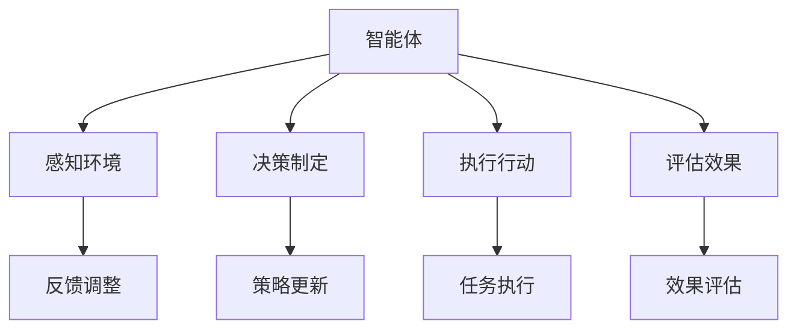

                 

关键词：人工智能、智能体、设计、实现、算法、数学模型、应用场景、代码实例

> 摘要：本文将探讨人工智能（AI）领域的核心概念——智能体的设计与实现。我们将介绍智能体的基本原理，包括其架构、核心算法及其在不同应用场景中的实现。通过详细讲解数学模型和公式，我们将深入理解智能体的运行机制。最后，我们将通过一个实际项目实例来展示智能体的代码实现，并讨论其在未来应用中的前景和挑战。

## 1. 背景介绍

人工智能（AI）是计算机科学的一个重要分支，致力于使机器具备人类智能。近年来，随着深度学习、神经网络等技术的飞速发展，AI在各个领域取得了显著的成果，从语音识别、图像处理到自然语言处理，AI的应用已经深入到我们的日常生活。然而，AI的核心之一——智能体（Agent）的概念依然在很大程度上被忽视。

智能体是一种能够感知环境、采取行动并能够自主决策的计算机程序。在人工智能系统中，智能体是执行任务、与外界交互的基本单元。设计并实现一个高效的智能体，是实现AI系统自动化的关键。

本文将详细介绍智能体的设计与实现，包括其核心概念、算法原理、数学模型和实际应用。通过本文的阅读，读者将能够全面了解智能体的构建方法，为将AI技术应用到实际项目中打下坚实的基础。

## 2. 核心概念与联系

### 2.1 智能体的定义

智能体（Agent）可以被视为一个决策实体，它能够感知环境中的信息，根据预先设定的目标或策略，选择并执行行动。智能体具有以下特点：

1. **自主性**：智能体能够独立做出决策，不受外部指令的强制影响。
2. **适应性**：智能体可以根据环境变化调整其行为策略。
3. **交互性**：智能体能够与外部实体（包括其他智能体和人类用户）进行通信和交互。
4. **社会性**：智能体可以参与复杂的集体行动，与群体中的其他智能体协作。

### 2.2 智能体与AI的关系

智能体是AI系统的核心组成部分。在AI系统中，智能体负责执行具体的任务，如数据收集、模式识别、决策制定等。智能体与AI的关系可以用图2.1表示：



### 2.3 智能体的架构

智能体的架构通常包括以下几个主要组件：

1. **感知器**：负责收集环境中的信息，如视觉、听觉、触觉等。
2. **知识库**：存储智能体所拥有的知识和信息。
3. **决策模块**：根据感知器收集的信息和知识库中的数据，制定行动策略。
4. **执行模块**：根据决策模块的指示，执行具体的行动。
5. **评估模块**：对行动效果进行评估，并反馈给决策模块。

### 2.4 智能体的分类

智能体可以根据其能力、目的和实现方法进行分类：

1. **反应型智能体**：只能对预定义的环境状态做出固定反应，无法处理复杂或未知的情况。
2. **目标型智能体**：具有明确的目标，根据当前环境和目标，采取最优的行动策略。
3. **学习型智能体**：具备自我学习能力，能够通过经验积累和优化调整行为策略。
4. **社会智能体**：能够与其他智能体或人类进行交互，协同完成任务。

## 3. 核心算法原理 & 具体操作步骤

### 3.1 算法原理概述

智能体的核心算法通常包括感知、决策和执行三个主要阶段。以下是这些算法的基本原理：

1. **感知**：通过传感器收集环境中的信息，如图像、声音、文本等。感知算法通常基于机器学习技术，如卷积神经网络（CNN）、循环神经网络（RNN）等。

2. **决策**：根据感知器收集的信息和知识库中的数据，智能体需要制定行动策略。决策算法可以是基于规则的、基于模型的，或基于学习的。

3. **执行**：执行模块根据决策模块的指示，执行具体的行动。执行算法可以是物理行动，如机器人控制，也可以是虚拟行动，如游戏中的策略执行。

### 3.2 算法步骤详解

#### 3.2.1 感知阶段

感知阶段主要包括以下几个步骤：

1. **数据预处理**：对原始数据进行预处理，如归一化、去噪等。
2. **特征提取**：利用机器学习算法提取数据中的特征，如使用CNN提取图像特征。
3. **状态编码**：将提取的特征转换为状态编码，便于后续的决策和执行。

#### 3.2.2 决策阶段

决策阶段主要包括以下几个步骤：

1. **策略评估**：根据当前状态，评估不同策略的效果。
2. **策略选择**：选择最优策略。
3. **策略执行**：根据选定的策略，制定具体的行动方案。

#### 3.2.3 执行阶段

执行阶段主要包括以下几个步骤：

1. **行动执行**：执行决策模块指定的行动。
2. **结果反馈**：记录行动的结果，并反馈给感知器和决策模块。

### 3.3 算法优缺点

#### 优缺点

- **反应型智能体**：实现简单，适用于规则明确的环境，但在复杂环境中效果较差。
- **目标型智能体**：具备明确目标，适用于需要决策的任务，但可能需要大量的训练数据。
- **学习型智能体**：能够通过学习适应新的环境，但训练过程可能需要较长的时间和资源。
- **社会智能体**：能够与多个智能体或人类协作，但实现较为复杂。

### 3.4 算法应用领域

智能体在多个领域具有广泛的应用，包括：

- **机器人**：用于自主导航、环境感知和任务执行。
- **游戏**：用于设计智能NPC（非玩家角色），提升游戏体验。
- **自动驾驶**：用于感知道路信息、决策和控制车辆。
- **智能家居**：用于智能设备的自动化控制和管理。
- **金融**：用于算法交易、风险管理和投资决策。

## 4. 数学模型和公式 & 详细讲解 & 举例说明

### 4.1 数学模型构建

智能体的设计和实现过程中，数学模型是关键。以下是几个常用的数学模型：

1. **马尔可夫决策过程（MDP）**：用于描述智能体在不确定环境中的决策过程。MDP包括状态空间、行动空间、奖励函数和转移概率矩阵。
2. **Q-learning**：一种基于值函数的强化学习算法，用于求解MDP的最优策略。
3. **策略梯度方法**：用于直接优化策略函数，而不是值函数。

### 4.2 公式推导过程

#### 马尔可夫决策过程（MDP）

假设智能体处于状态 \(s\)，选择行动 \(a\)，下一状态为 \(s'\)，奖励为 \(r\)。MDP可以用以下公式表示：

$$
P(s'|s,a) = p(s'|s,a) \quad \text{(转移概率矩阵)}
$$

$$
R(s,a) = r(s,a,s') \quad \text{(奖励函数)}
$$

#### Q-learning

Q-learning的目标是学习最优值函数 \(Q^*(s,a)\)。公式如下：

$$
Q(s,a) = \sum_{a'} \gamma \cdot p(s',r|s,a) \cdot \max_a' Q(s',a')
$$

$$
Q(s,a) \leftarrow Q(s,a) + \alpha \cdot (r + \gamma \cdot \max_a' Q(s',a') - Q(s,a))
$$

#### 策略梯度方法

策略梯度方法的公式如下：

$$
\theta \leftarrow \theta - \alpha \cdot \nabla_\theta J(\theta)
$$

$$
J(\theta) = \sum_s \pi(\theta)(s) \cdot \sum_a \pi(\theta)(a|s) \cdot Q(s,a)
$$

### 4.3 案例分析与讲解

假设一个简单的智能体任务：机器人需要在迷宫中找到出口。我们将使用Q-learning算法进行求解。

1. **状态空间**：迷宫中的每个位置。
2. **行动空间**：向上、向下、向左、向右。
3. **奖励函数**：到达出口得到 +100 分，其他位置得到 -1 分。
4. **转移概率**：每个行动的概率为 0.25。

经过一定次数的训练后，智能体能够找到迷宫的出口。

## 5. 项目实践：代码实例和详细解释说明

### 5.1 开发环境搭建

为了实现智能体，我们使用Python作为编程语言，并依赖以下库：

- TensorFlow：用于构建和训练神经网络。
- Gym：用于创建和测试智能体环境。

安装以上库后，开发环境搭建完成。

### 5.2 源代码详细实现

以下是一个简单的Q-learning算法实现：

```python
import numpy as np
import random
import gym

# 初始化环境
env = gym.make("GridWorld-v0")

# 初始化Q表
q_table = np.zeros((env.observation_space.n, env.action_space.n))

# 参数设置
alpha = 0.1
gamma = 0.9
episodes = 1000

# 训练智能体
for episode in range(episodes):
    state = env.reset()
    done = False
    
    while not done:
        # 选择行动
        action = np.argmax(q_table[state])
        
        # 执行行动
        next_state, reward, done, _ = env.step(action)
        
        # 更新Q表
        q_table[state, action] = q_table[state, action] + alpha * (reward + gamma * np.max(q_table[next_state]) - q_table[state, action])
        
        state = next_state

# 关闭环境
env.close()
```

### 5.3 代码解读与分析

1. **环境初始化**：使用`gym.make()`创建迷宫环境。
2. **Q表初始化**：使用`np.zeros()`创建一个全零的Q表，形状为（状态数，行动数）。
3. **参数设置**：设置学习率（alpha）和折扣因子（gamma），以及训练次数（episodes）。
4. **训练循环**：对每个训练轮次进行以下操作：
   - **选择行动**：使用`np.argmax()`从Q表中选择最优行动。
   - **执行行动**：使用`env.step()`执行行动，并获取下一个状态、奖励和是否结束。
   - **更新Q表**：使用Q-learning公式更新Q表。
5. **关闭环境**：训练完成后关闭环境。

### 5.4 运行结果展示

在完成训练后，我们可以通过运行智能体代码来展示其表现。智能体将能够在迷宫中找到出口，并学会避免陷阱。

```python
# 运行智能体
state = env.reset()
done = False

while not done:
    action = np.argmax(q_table[state])
    state, reward, done, _ = env.step(action)
    env.render()

# 关闭环境
env.close()
```

## 6. 实际应用场景

智能体在多个领域具有广泛的应用。以下是一些实际应用场景：

### 6.1 机器人

智能体可以用于自主导航、路径规划和任务执行。例如，自动驾驶汽车需要智能体来感知环境、决策和控制车辆。

### 6.2 游戏

智能体可以用于设计智能NPC，提升游戏体验。例如，在策略游戏中，智能体可以模拟对手的行为，帮助玩家制定最佳策略。

### 6.3 智能家居

智能体可以用于自动化控制和管理智能家居设备。例如，智能恒温器可以根据环境温度和用户习惯自动调节温度。

### 6.4 金融

智能体可以用于算法交易、风险管理和投资决策。例如，基于市场的历史数据和实时信息，智能体可以预测市场走势并制定交易策略。

## 7. 工具和资源推荐

### 7.1 学习资源推荐

- 《人工智能：一种现代方法》（作者：Stuart Russell & Peter Norvig）
- 《强化学习：原理与Python实现》（作者：Sutton & Barto）
- 《深度学习》（作者：Ian Goodfellow、Yoshua Bengio & Aaron Courville）

### 7.2 开发工具推荐

- TensorFlow：用于构建和训练神经网络。
- Gym：用于创建和测试智能体环境。
- Keras：用于简化TensorFlow的使用。

### 7.3 相关论文推荐

- “Reinforcement Learning: An Introduction”（作者：Richard S. Sutton & Andrew G. Barto）
- “Deep Reinforcement Learning”（作者：David Silver等）
- “Human-Level Control Through Deep Reinforcement Learning”（作者：Volodymyr Mnih等）

## 8. 总结：未来发展趋势与挑战

### 8.1 研究成果总结

智能体作为人工智能的核心组成部分，取得了显著的成果。随着深度学习、强化学习等技术的不断进步，智能体的性能和适用范围得到了极大的提升。智能体在机器人、游戏、智能家居、金融等领域已经展现出强大的潜力。

### 8.2 未来发展趋势

- **多智能体系统**：研究如何使多个智能体之间进行有效的协作和通信，提高整体系统的智能水平。
- **智能体伦理与法规**：探讨智能体在现实世界中的应用，特别是在道德和法律法规方面的挑战。
- **边缘计算与智能体**：研究如何在边缘设备上实现智能体，以提高系统的实时性和响应速度。

### 8.3 面临的挑战

- **计算资源**：智能体的设计和实现需要大量的计算资源，特别是在训练过程中。
- **数据隐私**：智能体在处理和分析大量数据时，需要确保数据隐私和安全。
- **算法公平性**：智能体的决策过程可能存在偏见和歧视，如何保证算法的公平性是一个重要挑战。

### 8.4 研究展望

智能体的未来发展方向包括：

- **可解释性智能体**：研究如何使智能体的决策过程更加透明和可解释，提高用户的信任度。
- **自适应智能体**：研究如何使智能体能够自动适应新的环境和任务。
- **跨领域智能体**：研究如何将智能体应用于多个领域，实现跨领域的知识共享和协作。

## 9. 附录：常见问题与解答

### 9.1 什么是智能体？

智能体（Agent）是一种能够感知环境、采取行动并能够自主决策的计算机程序。它具有自主性、适应性、交互性和社会性等特点。

### 9.2 智能体有哪些类型？

智能体可以分为反应型智能体、目标型智能体、学习型智能体和社会智能体。

### 9.3 智能体如何实现？

智能体的实现通常包括感知器、知识库、决策模块、执行模块和评估模块。具体实现方法依赖于应用场景和需求。

### 9.4 智能体在哪些领域有应用？

智能体在机器人、游戏、智能家居、金融、自动驾驶等多个领域具有广泛的应用。

### 9.5 如何设计一个智能体？

设计智能体需要明确任务目标、选择合适的算法和架构，并进行实验和优化。

### 9.6 智能体有哪些挑战？

智能体面临的主要挑战包括计算资源、数据隐私和算法公平性。

### 9.7 智能体的未来发展趋势是什么？

智能体的未来发展趋势包括多智能体系统、智能体伦理与法规、边缘计算与智能体等。

