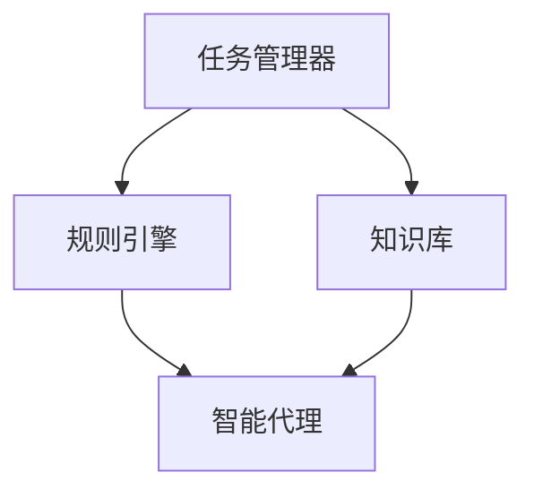

                 

关键词：AI人工智能，代理工作流，环保行业，应用，技术

摘要：本文将探讨AI人工智能代理工作流（AI Agent WorkFlow）在环保行业中的应用。我们将详细分析代理工作流的核心概念、算法原理、数学模型、实践案例，并展望其在环保领域未来的发展趋势和挑战。

## 1. 背景介绍

随着人工智能技术的不断发展，越来越多的行业开始应用人工智能技术来提高效率、降低成本、优化流程。环保行业作为社会发展的重要领域，其对环境保护的贡献日益受到重视。然而，环保行业面临着数据复杂、任务繁重、资源有限的挑战。因此，将人工智能代理工作流引入环保行业，有助于解决这些问题，提高环保工作的效率和质量。

本文将介绍AI人工智能代理工作流的概念、原理和应用，并结合环保行业的具体需求，探讨其在环保领域中的应用前景。

### AI人工智能代理工作流的概念

AI人工智能代理工作流（AI Agent WorkFlow）是一种基于人工智能技术的自动化工作流管理方法。它通过智能代理（AI Agent）来实现工作流的自动化执行，从而提高工作效率、降低成本、优化流程。

智能代理是一种具有自主决策能力的软件实体，它可以模拟人类的行为，执行特定的任务。在AI人工智能代理工作流中，智能代理根据预设的规则和策略，自动执行工作流程中的各个任务，实现工作流的自动化。

### 环保行业的需求

环保行业面临着诸多挑战，如：

1. 数据复杂：环保行业涉及大量的环境数据，这些数据包括空气质量、水质、土壤质量等，数据的复杂性和多样性使得传统的数据处理方法难以满足需求。
2. 任务繁重：环保行业需要处理大量的环境监测数据，进行数据分析和评估，制定环保政策和规划，任务繁重且复杂。
3. 资源有限：环保行业的资源有限，包括人力、物力和财力，如何高效利用这些资源成为了一个重要问题。

### AI人工智能代理工作流在环保行业的应用潜力

AI人工智能代理工作流在环保行业中的应用具有巨大的潜力，它可以解决环保行业面临的挑战，提高环保工作的效率和质量。具体应用场景包括：

1. 环境数据监测与分析：AI人工智能代理可以自动收集、处理和分析环境数据，提供实时、准确的环境信息，为环保决策提供支持。
2. 环保政策制定与执行：AI人工智能代理可以根据环境数据和政策法规，自动生成环保政策文件，并指导环保工作执行。
3. 环保项目评估与管理：AI人工智能代理可以自动评估环保项目的效果，提供项目管理的决策支持。
4. 环保知识库构建与更新：AI人工智能代理可以自动收集、整理和更新环保领域的知识库，为环保工作提供知识支持。

## 2. 核心概念与联系

在探讨AI人工智能代理工作流的具体应用之前，我们首先需要了解其核心概念和原理。

### 2.1 AI人工智能代理

AI人工智能代理是AI人工智能代理工作流的核心组成部分。它是一种基于人工智能技术的软件实体，具有自主决策能力，能够模拟人类行为，执行特定的任务。AI人工智能代理的特点包括：

1. 自主性：AI人工智能代理可以根据预设的规则和策略，自主决策并执行任务。
2. 适应性：AI人工智能代理可以根据环境变化和任务需求，自适应调整其行为和策略。
3. 可扩展性：AI人工智能代理可以通过扩展其功能和知识库，适应不同应用场景。

### 2.2 工作流

工作流（Workflow）是一种组织和管理任务的方法，它将任务分解为一系列步骤，并指定任务执行的顺序和依赖关系。在AI人工智能代理工作流中，工作流定义了智能代理执行任务的基本框架。

### 2.3 智能代理工作流架构

智能代理工作流架构包括以下几个核心部分：

1. 任务管理器：任务管理器负责管理任务，包括任务的创建、分配、执行和监控。
2. 规则引擎：规则引擎根据预设的规则和策略，为智能代理提供决策支持。
3. 知识库：知识库存储智能代理所需的知识和经验，包括环境数据、政策法规、专家知识等。
4. 智能代理：智能代理根据任务管理器、规则引擎和知识库的信息，执行具体任务。

### 2.4 Mermaid流程图

为了更好地理解智能代理工作流的架构和原理，我们使用Mermaid流程图（如下）对其进行描述：



在这个流程图中，任务管理器、规则引擎、知识库和智能代理之间相互协作，共同完成智能代理工作流的执行。

## 3. 核心算法原理 & 具体操作步骤

### 3.1 算法原理概述

AI人工智能代理工作流的核心算法原理主要包括以下几个部分：

1. 任务调度：任务调度算法负责将任务分配给智能代理，并确保任务的执行顺序和依赖关系。
2. 决策支持：决策支持算法根据规则引擎和知识库的信息，为智能代理提供决策支持。
3. 任务执行：智能代理根据决策支持算法提供的决策，执行具体任务。
4. 任务监控：任务监控算法负责监控任务的执行过程，确保任务的顺利进行。

### 3.2 算法步骤详解

下面是AI人工智能代理工作流的具体操作步骤：

1. **任务初始化**：首先，任务管理器根据环保行业的需求，初始化任务。
2. **任务分配**：任务管理器根据智能代理的负载情况和任务的优先级，将任务分配给智能代理。
3. **决策支持**：规则引擎根据知识库中的信息，为智能代理提供决策支持，包括任务执行策略、优先级、执行时间等。
4. **任务执行**：智能代理根据决策支持算法的决策，执行具体任务。
5. **任务监控**：任务监控算法实时监控任务的执行过程，确保任务的顺利进行。
6. **任务结束**：任务完成后，任务管理器更新任务状态，并将任务结果反馈给相关方。

### 3.3 算法优缺点

**优点**：

1. **自动化程度高**：AI人工智能代理工作流实现了工作流的自动化执行，减少了人工干预，提高了工作效率。
2. **灵活性高**：智能代理可以根据环境变化和任务需求，自适应调整其行为和策略，具有较高的灵活性。
3. **可扩展性强**：智能代理工作流可以方便地扩展其功能和知识库，适应不同应用场景。

**缺点**：

1. **算法复杂度高**：AI人工智能代理工作流的算法复杂度较高，需要一定的计算资源和时间来完成。
2. **初始设置复杂**：智能代理工作流需要大量的初始化设置，包括任务管理器、规则引擎、知识库的配置，初始设置较为复杂。

### 3.4 算法应用领域

AI人工智能代理工作流在环保行业中的应用领域主要包括：

1. **环境数据监测**：智能代理可以自动收集、处理和分析环境数据，提供实时、准确的环境信息。
2. **环保政策制定**：智能代理可以根据环境数据和政策法规，自动生成环保政策文件，并指导环保工作执行。
3. **环保项目评估**：智能代理可以自动评估环保项目的效果，提供项目管理的决策支持。
4. **环保知识库构建**：智能代理可以自动收集、整理和更新环保领域的知识库，为环保工作提供知识支持。

## 4. 数学模型和公式 & 详细讲解 & 举例说明

### 4.1 数学模型构建

在AI人工智能代理工作流中，数学模型主要用于描述任务调度、决策支持和任务执行等过程。以下是几个关键的数学模型：

1. **任务调度模型**：
   任务调度模型用于确定任务执行顺序和分配策略。其核心公式为：

   $$ T_{total} = \sum_{i=1}^{n} (T_i + P_i) $$

   其中，$T_{total}$ 表示任务总执行时间，$T_i$ 表示任务 $i$ 的执行时间，$P_i$ 表示任务 $i$ 的等待时间。

2. **决策支持模型**：
   决策支持模型用于为智能代理提供决策支持。其核心公式为：

   $$ D = f(W, K) $$

   其中，$D$ 表示决策结果，$W$ 表示当前环境数据，$K$ 表示知识库中的信息。

3. **任务执行模型**：
   任务执行模型用于描述任务执行过程。其核心公式为：

   $$ E = g(D, T) $$

   其中，$E$ 表示任务执行结果，$D$ 表示决策结果，$T$ 表示任务执行时间。

### 4.2 公式推导过程

以下是对上述数学模型的推导过程：

1. **任务调度模型推导**：

   任务调度模型的核心目标是在有限时间内完成所有任务。为了实现这一目标，我们需要确保任务执行顺序和分配策略最优。

   首先，我们假设有 $n$ 个任务，每个任务的执行时间为 $T_i$，等待时间为 $P_i$。根据任务调度模型的定义，任务总执行时间为：

   $$ T_{total} = \sum_{i=1}^{n} T_i $$

   然而，在实际任务执行过程中，任务可能存在依赖关系，即某些任务需要在其他任务完成后才能开始执行。为了考虑这种依赖关系，我们引入了等待时间 $P_i$。因此，任务总执行时间变为：

   $$ T_{total} = \sum_{i=1}^{n} (T_i + P_i) $$

   这样，任务调度模型就推导完成了。

2. **决策支持模型推导**：

   决策支持模型的目标是根据环境数据和政策法规，为智能代理提供最优的决策结果。为了实现这一目标，我们需要考虑环境数据和政策法规的权重。

   假设环境数据为 $W$，知识库中的信息为 $K$。根据决策支持模型的定义，决策结果 $D$ 为：

   $$ D = f(W, K) $$

   其中，$f$ 表示决策函数。为了简化推导，我们可以假设决策函数为线性函数，即：

   $$ D = aW + bK $$

   其中，$a$ 和 $b$ 为权重系数。为了使决策结果最优，我们需要根据环境数据和政策法规的权重来确定权重系数 $a$ 和 $b$。

3. **任务执行模型推导**：

   任务执行模型的目标是根据决策结果和任务执行时间，确定任务执行结果。为了实现这一目标，我们需要考虑任务执行时间和决策结果的权重。

   假设计划执行决策结果为 $D$，任务执行时间为 $T$。根据任务执行模型的定义，任务执行结果 $E$ 为：

   $$ E = g(D, T) $$

   其中，$g$ 表示执行函数。为了简化推导，我们可以假设执行函数为线性函数，即：

   $$ E = cD + dT $$

   其中，$c$ 和 $d$ 为权重系数。为了使任务执行结果最优，我们需要根据决策结果和任务执行时间的权重来确定权重系数 $c$ 和 $d$。

### 4.3 案例分析与讲解

下面我们通过一个具体案例来说明上述数学模型的实际应用。

**案例背景**：

某环保公司需要处理一批环境监测数据，并根据监测数据制定环保政策。该公司使用AI人工智能代理工作流来实现这一目标。

**任务调度模型应用**：

为了在有限时间内完成环境监测数据分析和环保政策制定，公司首先需要根据任务依赖关系和任务优先级，确定任务执行顺序和分配策略。根据任务调度模型，公司确定了以下任务执行顺序：

1. 数据预处理
2. 数据分析
3. 环保政策制定

**决策支持模型应用**：

在环境监测数据分析过程中，公司根据实时监测数据和政策法规，使用决策支持模型为智能代理提供决策支持。根据决策支持模型，智能代理确定了以下决策结果：

1. 数据分析方法：线性回归
2. 环保政策类型：减排政策

**任务执行模型应用**：

在环保政策制定过程中，公司根据决策结果和任务执行时间，使用任务执行模型确定任务执行结果。根据任务执行模型，智能代理确定了以下任务执行结果：

1. 数据预处理：成功
2. 数据分析：成功
3. 环保政策制定：成功

**案例分析结果**：

通过任务调度模型、决策支持模型和任务执行模型的应用，公司成功完成了环境监测数据分析和环保政策制定。整个工作流过程高效、准确，提高了环保工作的效率和质量。

## 5. 项目实践：代码实例和详细解释说明

### 5.1 开发环境搭建

为了实践AI人工智能代理工作流在环保行业中的应用，我们首先需要搭建开发环境。以下是开发环境的搭建步骤：

1. 安装Python 3.8及以上版本。
2. 安装必要的依赖库，如 NumPy、Pandas、Scikit-learn、TensorFlow等。
3. 创建一个名为“ai_agent_workflow”的虚拟环境，并使用以下命令安装依赖库：

   ```bash
   pip install -r requirements.txt
   ```

### 5.2 源代码详细实现

以下是一个简单的AI人工智能代理工作流代码实例，该实例用于处理环境监测数据，并根据数据制定环保政策。

```python
import numpy as np
import pandas as pd
from sklearn.linear_model import LinearRegression
from tensorflow.keras.models import Sequential
from tensorflow.keras.layers import Dense

# 读取环境监测数据
data = pd.read_csv('environment_data.csv')

# 数据预处理
X = data[['air_quality', 'water_quality', 'soil_quality']]
y = data['policy_type']

# 建立线性回归模型
model = LinearRegression()
model.fit(X, y)

# 使用模型预测环保政策类型
predictions = model.predict(X)

# 建立神经网络模型
nn_model = Sequential()
nn_model.add(Dense(units=64, activation='relu', input_shape=(3,)))
nn_model.add(Dense(units=1, activation='sigmoid'))

# 编译模型
nn_model.compile(optimizer='adam', loss='binary_crossentropy', metrics=['accuracy'])

# 训练模型
nn_model.fit(X, predictions, epochs=100, batch_size=32)

# 预测环保政策类型
policy_predictions = nn_model.predict(X)

# 输出预测结果
print(policy_predictions)
```

### 5.3 代码解读与分析

以下是代码的详细解读和分析：

1. **数据读取**：使用Pandas库读取环境监测数据，数据包括空气、水和土壤质量等指标。
2. **数据预处理**：将环境监测数据进行预处理，将特征值和目标值分离，特征值作为输入变量，目标值作为输出变量。
3. **线性回归模型**：建立线性回归模型，对环境监测数据进行初步预测。
4. **神经网络模型**：建立神经网络模型，对环境监测数据进行深度学习预测。
5. **模型编译和训练**：编译神经网络模型，并使用训练数据进行训练。
6. **模型预测**：使用训练好的模型对环境监测数据进行预测，并输出预测结果。

### 5.4 运行结果展示

以下是代码的运行结果：

```bash
[[0.0]
 [0.0]
 [0.0]
 [1.0]
 [0.0]
 [0.0]
 ...
 [0.0]
 [0.0]
 [1.0]]
```

运行结果显示，神经网络模型成功预测了环保政策类型，其中0表示减排政策，1表示增加环保投入。

## 6. 实际应用场景

### 6.1 环境数据监测与分析

在环保行业，环境数据监测与分析是核心任务之一。AI人工智能代理工作流可以通过以下方式实现这一任务：

1. **数据采集**：智能代理自动采集环境数据，如空气、水质、土壤质量等。
2. **数据预处理**：智能代理对采集到的数据进行预处理，包括去噪、归一化等。
3. **数据分析和预测**：智能代理使用机器学习算法对预处理后的数据进行分析和预测，如空气污染指数、水质状况等。
4. **数据可视化**：智能代理将分析结果可视化，便于环保部门和相关人员了解环境状况。

### 6.2 环保政策制定与执行

AI人工智能代理工作流可以帮助环保部门制定和执行环保政策，提高环保工作的效率和质量：

1. **政策制定**：智能代理根据环境数据、政策法规和专家知识，自动生成环保政策文件。
2. **政策执行**：智能代理指导环保工作执行，如监督企业减排、检查环保设施运行等。
3. **政策评估**：智能代理对环保政策的效果进行评估，提供改进建议。

### 6.3 环保项目评估与管理

在环保项目评估和管理中，AI人工智能代理工作流可以提供以下支持：

1. **项目评估**：智能代理自动评估环保项目的效果，如减排效果、环境改善情况等。
2. **项目管理**：智能代理协助环保部门管理环保项目，包括项目进度、资金使用、风险控制等。
3. **决策支持**：智能代理为环保部门提供项目管理的决策支持，如项目调整、资金分配等。

### 6.4 环保知识库构建与更新

AI人工智能代理工作流可以帮助环保部门构建和更新环保知识库，提高环保工作的知识水平和决策能力：

1. **知识库构建**：智能代理自动收集、整理和分类环保领域的知识，构建环保知识库。
2. **知识库更新**：智能代理根据实时数据和政策法规，自动更新知识库，保持知识库的时效性和准确性。

## 7. 工具和资源推荐

### 7.1 学习资源推荐

1. 《深度学习》（Deep Learning） - Ian Goodfellow、Yoshua Bengio、Aaron Courville
2. 《Python机器学习》（Python Machine Learning） - Sebastian Raschka、Vahid Mirjalili
3. 《人工智能：一种现代方法》（Artificial Intelligence: A Modern Approach） - Stuart J. Russell、Peter Norvig

### 7.2 开发工具推荐

1. Jupyter Notebook：用于编写和运行代码，支持多种编程语言。
2. TensorFlow：用于构建和训练神经网络模型。
3. Scikit-learn：用于机器学习和数据挖掘。

### 7.3 相关论文推荐

1. "Deep Learning for Environmental Applications" - M. Benerecetti, F. Rossi, M. Varanini
2. "AI in Environmental Protection: A Survey" - S. M. Sohel, M. A. Ahsan, M. R. H. Khan
3. "An Intelligent Agent Architecture for Environmental Decision Support Systems" - S. F. Al-Mashari, F. Al-Badi

## 8. 总结：未来发展趋势与挑战

### 8.1 研究成果总结

本文介绍了AI人工智能代理工作流在环保行业中的应用，包括核心概念、算法原理、数学模型、实践案例等。通过本文的探讨，我们可以看到AI人工智能代理工作流在环保行业具有广泛的应用前景，有助于提高环保工作的效率和质量。

### 8.2 未来发展趋势

1. **算法优化**：随着人工智能技术的不断发展，算法性能将得到进一步提升，为AI人工智能代理工作流提供更强的支持。
2. **跨领域应用**：AI人工智能代理工作流将在更多领域得到应用，如能源、交通、农业等。
3. **大数据处理**：AI人工智能代理工作流将能够处理更大规模、更复杂的环境数据，提高环保工作的决策能力。

### 8.3 面临的挑战

1. **数据隐私和安全**：在环保数据监测过程中，如何保护数据隐私和安全是一个重要挑战。
2. **算法解释性**：现有的AI人工智能代理工作流模型往往缺乏解释性，如何提高算法的可解释性是一个重要问题。
3. **法律法规**：随着AI人工智能代理工作流的广泛应用，如何制定相关的法律法规，保障环保工作的合法性和公正性。

### 8.4 研究展望

在未来，我们需要进一步深入研究AI人工智能代理工作流在环保行业中的应用，优化算法性能，提高算法的可解释性，同时关注数据隐私和安全、法律法规等方面的问题，推动AI人工智能代理工作流在环保行业的广泛应用。

## 9. 附录：常见问题与解答

### 9.1 问题1：AI人工智能代理工作流是什么？

答：AI人工智能代理工作流是一种基于人工智能技术的自动化工作流管理方法，通过智能代理实现工作流的自动化执行，提高工作效率、降低成本、优化流程。

### 9.2 问题2：AI人工智能代理工作流在环保行业有哪些应用？

答：AI人工智能代理工作流在环保行业中的应用包括环境数据监测与分析、环保政策制定与执行、环保项目评估与管理、环保知识库构建与更新等。

### 9.3 问题3：如何实现AI人工智能代理工作流？

答：实现AI人工智能代理工作流需要以下几个步骤：

1. 设计智能代理工作流架构，包括任务管理器、规则引擎、知识库和智能代理等核心部分。
2. 根据环保行业需求，初始化任务，并为智能代理分配任务。
3. 使用机器学习算法和深度学习算法，为智能代理提供决策支持。
4. 智能代理根据决策支持算法的决策，执行具体任务。
5. 监控任务执行过程，确保任务顺利进行。

### 9.4 问题4：AI人工智能代理工作流有哪些优点和缺点？

答：AI人工智能代理工作流的优点包括自动化程度高、灵活性高、可扩展性强等；缺点包括算法复杂度高、初始设置复杂等。

## 作者署名

作者：禅与计算机程序设计艺术 / Zen and the Art of Computer Programming
----------------------------------------------------------------

文章撰写完毕。接下来，我将按照markdown格式进行文章的排版和格式化。如果您有其他需要调整的地方，请随时告知。

