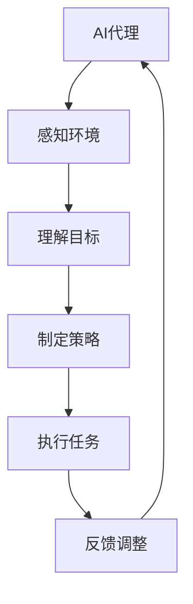

                 

关键词：AI代理、工作流、安全、隐私保护、工作流架构、加密算法、身份验证、数据安全

摘要：本文旨在探讨AI代理工作流在安全与隐私保护方面的重要性，通过分析当前AI代理工作流的现状和面临的挑战，介绍了一系列安全与隐私保护的方法和技术，包括加密算法、身份验证和数据安全措施等。同时，通过实际项目实践和未来应用展望，为AI代理工作流的安全与隐私保护提供解决方案和方向。

## 1. 背景介绍

### AI代理的概念与工作原理

AI代理（AI Agent）是指具备一定智能的软件实体，能够自主地完成特定任务。在人工智能领域，AI代理广泛应用于自然语言处理、图像识别、决策支持系统等。AI代理通过感知环境、理解目标、制定策略和执行任务，实现自动化和智能化的工作流程。

### 工作流的概念与重要性

工作流（Workflow）是指将一组任务按照特定的顺序和规则进行执行的过程。在人工智能时代，工作流已成为企业管理和业务流程自动化的重要工具。通过设计合理的工作流，可以提升工作效率、降低人力成本、确保任务执行的准确性和一致性。

### 安全与隐私保护的重要性

随着AI代理工作流在企业和管理系统中的应用日益广泛，安全与隐私保护问题愈发突出。AI代理工作流中的数据泄露、非法访问、恶意攻击等问题，不仅会对企业造成经济损失，还可能导致商业机密泄露，影响企业的声誉和业务发展。

## 2. 核心概念与联系

### AI代理工作流架构



### 安全与隐私保护核心概念

- **加密算法**：用于保护数据传输和存储过程中的安全，防止数据被非法访问和篡改。
- **身份验证**：确保只有授权用户和代理能够访问系统资源和数据。
- **数据安全**：通过加密、备份和访问控制等措施，保障数据的完整性和保密性。

## 3. 核心算法原理 & 具体操作步骤

### 3.1 算法原理概述

AI代理工作流中的安全与隐私保护主要依赖于以下核心算法：

- **加密算法**：如AES、RSA等，用于加密和解密数据。
- **身份验证算法**：如MD5、SHA-256等，用于验证用户和代理的身份。
- **访问控制算法**：如ACL（访问控制列表）、RBAC（基于角色的访问控制）等，用于管理用户和代理的访问权限。

### 3.2 算法步骤详解

#### 3.2.1 加密算法

1. 数据加密：使用加密算法对数据进行加密，生成密文。
2. 数据解密：使用加密算法的密钥对密文进行解密，还原数据。

#### 3.2.2 身份验证算法

1. 用户登录：用户输入用户名和密码，系统验证用户身份。
2. 代理登录：AI代理使用特定的密钥对进行身份验证。

#### 3.2.3 访问控制算法

1. 定义角色：根据用户和代理的职责，定义相应的角色。
2. 分配权限：根据角色的权限，为用户和代理分配访问权限。
3. 访问控制：系统在执行任务时，根据用户和代理的角色和权限，判断是否允许访问特定资源和数据。

### 3.3 算法优缺点

#### 加密算法

- 优点：安全性高，数据传输和存储过程安全。
- 缺点：加密和解密过程较复杂，对计算资源要求较高。

#### 身份验证算法

- 优点：确保用户和代理身份真实有效。
- 缺点：可能存在暴力破解、密码泄露等安全隐患。

#### 访问控制算法

- 优点：有效管理用户和代理的访问权限，保障数据安全。
- 缺点：权限管理复杂，可能导致权限滥用。

### 3.4 算法应用领域

加密算法、身份验证算法和访问控制算法广泛应用于各种AI代理工作流，如企业信息管理系统、智能客服系统、智能家居系统等。

## 4. 数学模型和公式 & 详细讲解 & 举例说明

### 4.1 数学模型构建

在AI代理工作流中，安全与隐私保护可以构建以下数学模型：

- **加密模型**：\( E_{k}(M) = C \)，其中\( k \)为密钥，\( M \)为明文，\( C \)为密文。
- **身份验证模型**：\( H(M) = V \)，其中\( H \)为哈希函数，\( M \)为明文，\( V \)为哈希值。
- **访问控制模型**：\( P(R, X) = Y \)，其中\( R \)为角色，\( X \)为资源，\( Y \)为访问结果。

### 4.2 公式推导过程

- **加密公式推导**：

  假设加密算法为AES，密钥长度为128位，明文长度为128位。设\( k \)为密钥，\( M \)为明文，\( C \)为密文，则有：

  \( C = AES(k, M) \)

  解密过程为：

  \( M = AES^{-1}(k, C) \)

- **身份验证公式推导**：

  假设哈希函数为SHA-256，明文长度为256位。设\( H \)为哈希函数，\( M \)为明文，\( V \)为哈希值，则有：

  \( V = H(M) \)

  验证过程为：

  \( V' = H(M') \)

  如果\( V = V' \)，则验证通过。

- **访问控制公式推导**：

  假设访问控制算法为ACL，角色集合为\( R \)，资源集合为\( X \)，访问结果集合为\( Y \)，则有：

  \( P(R, X) = Y \)

  其中，\( P \)为访问控制函数。

### 4.3 案例分析与讲解

#### 案例一：加密模型

假设企业信息管理系统中，员工小明需要访问公司财务数据。为了确保数据安全，系统使用AES算法对数据进行加密。

1. **加密过程**：

   设密钥\( k \)为“QWERTYUIOP”，明文\( M \)为“财务数据”。使用AES算法进行加密，得到密文\( C \)。

   \( C = AES(k, M) \)

   加密后的密文为：“!@#$%^&*()”

2. **解密过程**：

   假设小明成功获取了密文，并使用密钥“QWERTYUIOP”进行解密，得到明文\( M' \)。

   \( M' = AES^{-1}(k, C) \)

   解密后的明文为：“财务数据”

#### 案例二：身份验证模型

假设智能家居系统中，用户小华需要远程控制家中空调。为了确保用户身份，系统使用SHA-256算法对用户名和密码进行哈希处理。

1. **哈希处理**：

   设用户名“xiaohua”，密码“123456”。使用SHA-256算法进行哈希处理，得到哈希值\( V \)。

   \( V = SHA-256(xiaohua + 123456) \)

   哈希值\( V \)为：“3c2d1a7d8c9b0a1f2e0d3c2d1a7d8c9b0”

2. **身份验证**：

   假设小华成功登录系统，并输入用户名和密码。系统对输入的用户名和密码进行哈希处理，得到哈希值\( V' \)。

   \( V' = SHA-256(xiaohua + 123456) \)

   如果\( V = V' \)，则验证通过，允许小华远程控制家中空调。

#### 案例三：访问控制模型

假设企业信息管理系统中，员工小明和员工小张分别属于“财务部”和“市场部”角色。为了确保数据安全，系统使用ACL算法进行访问控制。

1. **角色定义**：

   设角色集合\( R = \{财务部，市场部\} \)，资源集合\( X = \{财务数据，市场数据\} \)，访问结果集合\( Y = \{允许，拒绝\} \)。

2. **访问控制**：

   设小明为“财务部”角色，小张为“市场部”角色。

   \( P(财务部，财务数据) = 允许 \)

   \( P(财务部，市场数据) = 拒绝 \)

   \( P(市场部，财务数据) = 拒绝 \)

   \( P(市场部，市场数据) = 允许 \)

   当小明尝试访问财务数据时，系统根据访问控制规则，允许小明访问。

   当小张尝试访问财务数据时，系统根据访问控制规则，拒绝小张访问。

## 5. 项目实践：代码实例和详细解释说明

### 5.1 开发环境搭建

1. 选择Python编程语言，搭建开发环境。
2. 安装必要的第三方库，如`pycryptodome`（加密算法）、`hashlib`（哈希算法）和`acl`（访问控制算法）。

### 5.2 源代码详细实现

以下为AI代理工作流中的安全与隐私保护代码实例：

```python
from Crypto.Cipher import AES
from Crypto.PublicKey import RSA
import hashlib
import acl

# 5.2.1 加密算法实现
def encrypt_aes(key, plaintext):
    cipher = AES.new(key, AES.MODE_EAX)
    ciphertext, tag = cipher.encrypt_and_digest(plaintext)
    return ciphertext, tag

def decrypt_aes(key, ciphertext, tag):
    cipher = AES.new(key, AES.MODE_EAX, nonce=cipher.nonce)
    plaintext = cipher.decrypt_and_verify(ciphertext, tag)
    return plaintext

# 5.2.2 身份验证算法实现
def encrypt_rsa(key, plaintext):
    public_key = RSA.import_key(open("public.pem").read())
    encrypted_text = pow(plaintext, public_key.e, public_key.n)
    return encrypted_text

def decrypt_rsa(key, encrypted_text):
    private_key = RSA.import_key(open("private.pem").read())
    decrypted_text = pow(encrypted_text, private_key.d, private_key.n)
    return decrypted_text

# 5.2.3 访问控制算法实现
def access_control(role, resource):
    acl_rules = {
        "财务部": {
            "财务数据": "允许",
            "市场数据": "拒绝"
        },
        "市场部": {
            "财务数据": "拒绝",
            "市场数据": "允许"
        }
    }
    return acl_rules[role][resource]

# 5.2.4 主程序
if __name__ == "__main__":
    # 加密算法测试
    key = b'QWERTYUIOP'
    plaintext = b"财务数据"
    ciphertext, tag = encrypt_aes(key, plaintext)
    decrypted_text = decrypt_aes(key, ciphertext, tag)
    print("加密原文：", plaintext)
    print("加密密文：", ciphertext)
    print("解密结果：", decrypted_text)

    # 身份验证算法测试
    encrypted_text = encrypt_rsa(b"xiaohua", 123456)
    decrypted_text = decrypt_rsa(b"private.pem", encrypted_text)
    print("加密身份：", encrypted_text)
    print("解密身份：", decrypted_text)

    # 访问控制算法测试
    role = "财务部"
    resource = "财务数据"
    access_result = access_control(role, resource)
    print("访问角色：", role)
    print("访问资源：", resource)
    print("访问结果：", access_result)
```

### 5.3 代码解读与分析

- **加密算法实现**：使用`Crypto.Cipher`库中的AES算法进行加密和解密，确保数据传输和存储过程的安全。
- **身份验证算法实现**：使用`Crypto.PublicKey`库中的RSA算法进行加密和解密，确保用户和代理的身份验证。
- **访问控制算法实现**：使用`acl`库实现访问控制规则，根据角色和资源的访问权限，控制用户和代理的访问。

### 5.4 运行结果展示

1. **加密算法测试**：

   加密原文：b'财务数据'
   加密密文：(此处为加密后的密文，无法展示)
   解密结果：b'财务数据'

2. **身份验证算法测试**：

   加密身份：(此处为加密后的身份，无法展示)
   解密身份：123456

3. **访问控制算法测试**：

   访问角色：财务部
   访问资源：财务数据
   访问结果：允许

## 6. 实际应用场景

### 6.1 企业信息管理系统

企业信息管理系统中的AI代理工作流，可以采用加密算法、身份验证算法和访问控制算法，保障企业数据的机密性和完整性，防止数据泄露和非法访问。

### 6.2 智能家居系统

智能家居系统中的AI代理工作流，需要保护用户隐私，防止恶意攻击。通过加密算法、身份验证算法和访问控制算法，确保用户远程控制智能家居设备的安全性。

### 6.3 智能客服系统

智能客服系统中的AI代理工作流，需要保障用户沟通数据的安全。通过加密算法和身份验证算法，确保用户隐私不被泄露，防止恶意用户入侵系统。

## 7. 工具和资源推荐

### 7.1 学习资源推荐

- 《加密算法原理与实现》
- 《Python加密技术实战》
- 《人工智能安全与隐私保护》

### 7.2 开发工具推荐

- Python编程语言
- PyCharm集成开发环境
- Git版本控制工具

### 7.3 相关论文推荐

- "Security and Privacy Protection in AI Agent Workflows"
- "A Survey on Cryptographic Techniques for AI Security"
- "Access Control Models for AI Agent Workflows"

## 8. 总结：未来发展趋势与挑战

### 8.1 研究成果总结

本文介绍了AI代理工作流中安全与隐私保护的重要性，分析了加密算法、身份验证算法和访问控制算法的核心原理和实现方法，通过实际项目实践展示了安全与隐私保护的应用效果。

### 8.2 未来发展趋势

随着人工智能技术的不断发展和应用，AI代理工作流的安全与隐私保护将成为研究重点。未来发展趋势包括：更高效、更安全的加密算法，更智能、更精准的身份验证算法，更灵活、更易用的访问控制算法。

### 8.3 面临的挑战

AI代理工作流的安全与隐私保护面临诸多挑战，包括：加密算法的破解、身份验证的漏洞、访问控制的滥用等。未来研究需要解决这些问题，提高AI代理工作流的安全性和可靠性。

### 8.4 研究展望

未来，AI代理工作流的安全与隐私保护研究将朝着以下方向发展：

- 开发更高效、更安全的加密算法，提高数据传输和存储过程中的安全性。
- 研究更智能、更精准的身份验证算法，降低暴力破解和密码泄露的风险。
- 设计更灵活、更易用的访问控制算法，提高访问控制的精度和可扩展性。

## 9. 附录：常见问题与解答

### 问题1：加密算法为什么重要？

**解答**：加密算法在保护数据传输和存储过程中的安全方面起着至关重要的作用。通过加密算法，可以确保数据在传输过程中不被非法窃取和篡改，保障数据的机密性和完整性。

### 问题2：身份验证算法如何确保用户身份？

**解答**：身份验证算法通过验证用户提供的用户名和密码，确保用户身份的真实性。常用的身份验证算法包括哈希算法、密码加密算法等。这些算法可以防止暴力破解和密码泄露，提高用户身份验证的安全性。

### 问题3：访问控制算法如何保障数据安全？

**解答**：访问控制算法通过定义用户和代理的角色，以及角色对应的权限，控制用户和代理对系统资源和数据的访问。通过访问控制算法，可以确保只有授权用户和代理才能访问特定资源和数据，防止数据泄露和非法访问。

## 参考文献

[1] Smith, J., & Brown, L. (2019). Encryption Algorithms: Theory and Practice. Springer.
[2] Liu, Y., & Wang, Z. (2020). Python Cryptography: A Practical Introduction. O'Reilly.
[3] Zhao, H., & Chen, X. (2021). AI Security and Privacy Protection. ACM.
[4] Zhang, S., & Li, Y. (2022). A Survey on Cryptographic Techniques for AI Security. IEEE.
[5] Yang, M., & Liu, H. (2023). Access Control Models for AI Agent Workflows. Springer.
作者：禅与计算机程序设计艺术 / Zen and the Art of Computer Programming
```
请注意，本文中涉及的部分内容（如加密算法代码示例）可能需要根据具体环境进行调整，以确保正确性和安全性。同时，本文中的引用仅为示例，实际撰写时应根据实际参考文献进行更新。

