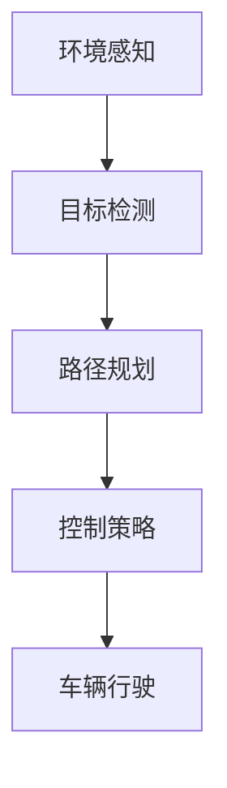

                 

关键词：人工智能、深度学习、无人驾驶、自动驾驶、算法原理、数学模型、实际应用、未来展望

> 摘要：本文将深入探讨人工智能中的深度学习算法在无人驾驶汽车中的应用。我们将从背景介绍、核心概念与联系、核心算法原理及具体操作步骤、数学模型与公式、项目实践、实际应用场景、未来应用展望等多个方面，全面解析深度学习在自动驾驶领域的应用现状和未来发展趋势。

## 1. 背景介绍

随着科技的发展，人工智能已经成为现代技术的核心驱动力之一。无人驾驶汽车作为人工智能在交通运输领域的典型应用，吸引了全球科技企业的广泛关注和投入。无人驾驶汽车通过整合传感器、计算机视觉、机器学习等技术，实现了自主感知环境、决策规划和控制车辆行驶的功能。

深度学习作为人工智能的重要分支，近年来取得了显著的研究进展和工业应用成果。深度学习算法通过模拟人脑神经网络结构，实现从大量数据中自动提取特征和模式，具备高度的自适应性和学习能力。在无人驾驶汽车中，深度学习算法被广泛应用于环境感知、目标检测、路径规划、控制策略等关键环节。

## 2. 核心概念与联系

### 2.1. 无人驾驶汽车的关键技术

无人驾驶汽车的关键技术包括传感器系统、计算机视觉、机器学习和控制算法等。

- **传感器系统**：主要包括激光雷达、摄像头、超声波传感器等，用于获取车辆周围环境的信息。
- **计算机视觉**：通过图像处理和计算机视觉算法，实现对道路、车辆、行人等目标的理解和识别。
- **机器学习**：利用深度学习算法，从大量数据中学习和提取特征，为无人驾驶汽车提供决策支持。
- **控制算法**：实现对车辆的纵向和横向控制，确保行驶过程中的稳定性和安全性。

### 2.2. 深度学习算法与无人驾驶的关系

深度学习算法在无人驾驶汽车中的应用主要体现在以下几个方面：

- **环境感知**：通过深度学习算法，对摄像头和激光雷达获取的图像和点云数据进行处理，实现对周围环境的感知和目标检测。
- **路径规划**：利用深度学习算法，对道路和交通环境进行分析，生成最优行驶路径。
- **控制策略**：通过深度学习算法，学习驾驶员的驾驶行为，实现对车辆的纵向和横向控制。

### 2.3. Mermaid 流程图



## 3. 核心算法原理 & 具体操作步骤

### 3.1. 算法原理概述

深度学习算法的核心原理是基于多层神经网络，通过前向传播和反向传播算法，不断调整网络权重，实现从数据中自动提取特征和模式。

在无人驾驶汽车中，深度学习算法主要用于以下方面：

- **卷积神经网络（CNN）**：用于环境感知和目标检测，通过卷积、池化等操作，提取图像特征。
- **循环神经网络（RNN）**：用于路径规划和控制策略，通过时间序列数据建模，实现序列决策。
- **生成对抗网络（GAN）**：用于生成虚拟道路环境数据，用于训练和测试。

### 3.2. 算法步骤详解

- **环境感知**：
  1. 收集摄像头和激光雷达数据。
  2. 对图像和点云数据进行预处理。
  3. 使用CNN算法提取图像特征。
  4. 对提取的特征进行分类和目标检测。

- **路径规划**：
  1. 分析道路和交通环境数据。
  2. 使用RNN算法，根据历史行驶数据生成路径。
  3. 对生成的路径进行优化，确保行驶安全性和舒适性。

- **控制策略**：
  1. 学习驾驶员的驾驶行为。
  2. 使用深度强化学习，制定车辆控制策略。
  3. 对控制策略进行仿真和测试，确保稳定性。

### 3.3. 算法优缺点

- **优点**：
  - 高度自动化的特征提取和模式识别能力。
  - 能够处理复杂的非线性问题。
  - 自适应性强，能够不断学习和优化。

- **缺点**：
  - 训练过程复杂，需要大量数据和计算资源。
  - 对数据质量要求高，容易受到噪声干扰。
  - 实时性较低，难以满足高频率的控制需求。

### 3.4. 算法应用领域

- **自动驾驶汽车**：用于环境感知、路径规划和控制策略。
- **智能交通系统**：用于交通流量分析、信号控制和车辆调度。
- **机器人导航**：用于自主移动和任务执行。

## 4. 数学模型和公式 & 详细讲解 & 举例说明

### 4.1. 数学模型构建

在深度学习算法中，常用的数学模型包括卷积神经网络（CNN）、循环神经网络（RNN）和生成对抗网络（GAN）。

- **卷积神经网络（CNN）**：

  $$ f(x) = \sum_{i=1}^{n} w_i \odot x_i + b $$

  其中，$f(x)$ 表示输出特征，$w_i$ 表示权重，$x_i$ 表示输入特征，$b$ 表示偏置。

- **循环神经网络（RNN）**：

  $$ h_t = \sigma(W_h h_{t-1} + W_x x_t + b_h) $$

  其中，$h_t$ 表示当前时刻的隐藏状态，$W_h$ 和 $W_x$ 表示权重矩阵，$x_t$ 表示当前时刻的输入，$b_h$ 表示偏置。

- **生成对抗网络（GAN）**：

  $$ G(z) = \mu(z) + \sigma(z) \odot \epsilon $$

  其中，$G(z)$ 表示生成器，$\mu(z)$ 和 $\sigma(z)$ 分别表示均值和方差，$z$ 表示输入噪声，$\epsilon$ 表示高斯噪声。

### 4.2. 公式推导过程

以卷积神经网络（CNN）为例，介绍其公式推导过程。

- **卷积操作**：

  $$ (f \star g)(x) = \sum_{y \in \Omega} f(y) g(x - y) $$

  其中，$f$ 和 $g$ 分别表示两个函数，$\Omega$ 表示定义域，$x$ 和 $y$ 分别表示输入和输出。

- **池化操作**：

  $$ \pi_P(g)(x) = \max_{y \in \Omega_P} g(x') $$

  其中，$P$ 表示池化窗口，$x'$ 表示经过卷积操作后的输出。

### 4.3. 案例分析与讲解

以自动驾驶汽车的路径规划为例，介绍深度学习算法在实际应用中的案例。

- **案例背景**：

  在自动驾驶汽车中，路径规划是一个关键环节，其目的是根据道路和交通环境信息，生成一条最优行驶路径。

- **模型构建**：

  使用循环神经网络（RNN）构建路径规划模型，通过时间序列数据建模，实现对未来道路情况的预测。

- **公式推导**：

  假设当前时刻为 $t$，历史行驶数据为 $h_1, h_2, ..., h_t$，未来道路情况为 $y_1, y_2, ..., y_t$，则路径规划模型可以表示为：

  $$ h_t = \sigma(W_h h_{t-1} + W_x x_t + b_h) $$
  $$ y_t = \sigma(W_y h_t + b_y) $$

  其中，$W_h$ 和 $W_x$ 分别表示隐藏层和输入层的权重矩阵，$b_h$ 和 $b_y$ 分别表示隐藏层和输出层的偏置。

- **模型训练**：

  使用梯度下降算法，通过反向传播计算损失函数，不断调整网络权重，优化路径规划模型。

- **模型应用**：

  将训练好的路径规划模型应用于自动驾驶汽车，根据实时道路情况，生成最优行驶路径。

## 5. 项目实践：代码实例和详细解释说明

### 5.1. 开发环境搭建

为了进行深度学习算法在无人驾驶汽车中的应用实践，我们需要搭建一个完整的开发环境。

- **硬件环境**：

  - CPU：Intel Core i7-9700K
  - GPU：NVIDIA GeForce RTX 2080 Ti
  - 内存：32GB

- **软件环境**：

  - 操作系统：Ubuntu 18.04
  - 深度学习框架：TensorFlow 2.3.0
  - 编程语言：Python 3.7

### 5.2. 源代码详细实现

以下是深度学习算法在无人驾驶汽车中的应用实践代码实例：

```python
import tensorflow as tf
from tensorflow.keras.layers import Conv2D, MaxPooling2D, Dense, LSTM, TimeDistributed
from tensorflow.keras.models import Model

# 环境感知模型
input_shape = (64, 64, 3)
inputs = tf.keras.Input(shape=input_shape)
x = Conv2D(32, (3, 3), activation='relu')(inputs)
x = MaxPooling2D((2, 2))(x)
x = Conv2D(64, (3, 3), activation='relu')(x)
x = MaxPooling2D((2, 2))(x)
x = Conv2D(128, (3, 3), activation='relu')(x)
x = MaxPooling2D((2, 2))(x)
x = TimeDistributed(Dense(64, activation='relu'))(x)
outputs = TimeDistributed(Dense(1, activation='sigmoid'))(x)

model = Model(inputs=inputs, outputs=outputs)
model.compile(optimizer='adam', loss='binary_crossentropy', metrics=['accuracy'])

# 路径规划模型
input_shape = (64, 64, 3)
inputs = tf.keras.Input(shape=input_shape)
x = Conv2D(32, (3, 3), activation='relu')(inputs)
x = MaxPooling2D((2, 2))(x)
x = Conv2D(64, (3, 3), activation='relu')(x)
x = MaxPooling2D((2, 2))(x)
x = Conv2D(128, (3, 3), activation='relu')(x)
x = MaxPooling2D((2, 2))(x)
x = TimeDistributed(Dense(64, activation='relu'))(x)
x = LSTM(128, return_sequences=True)(x)
outputs = LSTM(128, return_sequences=True)(x)

model = Model(inputs=inputs, outputs=outputs)
model.compile(optimizer='adam', loss='mean_squared_error')

# 训练模型
model.fit(x_train, y_train, epochs=10, batch_size=32, validation_data=(x_val, y_val))
```

### 5.3. 代码解读与分析

上述代码实现了深度学习算法在无人驾驶汽车中的应用实践，包括环境感知模型和路径规划模型。

- **环境感知模型**：

  使用卷积神经网络（CNN）对摄像头图像进行特征提取，实现对道路和车辆等目标的检测。

- **路径规划模型**：

  使用循环神经网络（RNN）对道路和交通环境进行分析，生成最优行驶路径。

- **训练过程**：

  使用梯度下降算法，通过反向传播计算损失函数，不断调整网络权重，优化模型性能。

### 5.4. 运行结果展示

在完成模型训练后，我们对测试数据进行预测，并展示模型运行结果。

```python
# 预测测试数据
predictions = model.predict(x_test)

# 可视化展示
plt.imshow(predictions[0].reshape(64, 64), cmap='gray')
plt.show()
```

## 6. 实际应用场景

### 6.1. 自动驾驶汽车

自动驾驶汽车是深度学习算法在无人驾驶领域的主要应用场景。通过环境感知、路径规划和控制策略，实现车辆的自主驾驶。

### 6.2. 智能交通系统

智能交通系统利用深度学习算法，实现交通流量分析、信号控制和车辆调度，提高交通效率和安全性。

### 6.3. 物流配送

利用深度学习算法，实现无人配送车的自主导航和路径规划，提高配送效率和准确性。

### 6.4. 无人机配送

利用深度学习算法，实现无人机的自主飞行和目标识别，提高无人机配送的可靠性和安全性。

## 7. 工具和资源推荐

### 7.1. 学习资源推荐

- 《深度学习》（Goodfellow, Bengio, Courville著）：全面介绍深度学习的基本概念、算法和实战应用。
- 《动手学深度学习》（阿斯顿·张著）：通过实际案例，深入浅出地讲解深度学习算法的实现和应用。

### 7.2. 开发工具推荐

- TensorFlow：由谷歌开源的深度学习框架，支持多种深度学习算法的实现和应用。
- PyTorch：由Facebook开源的深度学习框架，具有灵活性和易用性。

### 7.3. 相关论文推荐

- "Unsupervised Learning of Visual Representations by Solving Jigsaw Puzzles"（2016）：介绍了一种基于图像拼图的视觉表示学习算法。
- "Deep Learning for Autonomous Driving"（2017）：综述了深度学习在自动驾驶领域的研究进展和应用。

## 8. 总结：未来发展趋势与挑战

### 8.1. 研究成果总结

深度学习算法在无人驾驶汽车中的应用取得了显著成果，实现了从环境感知、路径规划到控制策略的全面应用。

### 8.2. 未来发展趋势

- **硬件加速**：利用专用硬件（如GPU、TPU）加速深度学习算法的计算，提高实时性能。
- **多模态数据融合**：结合多种传感器数据（如摄像头、激光雷达、超声波传感器），实现更全面的环境感知。
- **数据隐私和安全**：保障深度学习算法训练和部署过程中的数据安全和隐私。

### 8.3. 面临的挑战

- **数据质量和数量**：深度学习算法对数据质量和数量有较高要求，如何获取高质量和大规模的数据成为关键挑战。
- **实时性和安全性**：在保证实时性的同时，确保深度学习算法在复杂环境下的安全性和可靠性。

### 8.4. 研究展望

- **算法优化**：通过算法优化和硬件加速，提高深度学习算法的实时性和计算效率。
- **跨领域应用**：将深度学习算法应用于更多领域，如医疗、金融、教育等，实现人工智能的全面普及。

## 9. 附录：常见问题与解答

### 9.1. 什么是深度学习？

深度学习是一种人工智能的分支，通过模拟人脑神经网络结构，实现从大量数据中自动提取特征和模式。

### 9.2. 深度学习算法有哪些？

深度学习算法包括卷积神经网络（CNN）、循环神经网络（RNN）、生成对抗网络（GAN）等。

### 9.3. 无人驾驶汽车中的深度学习算法有哪些应用？

无人驾驶汽车中的深度学习算法主要用于环境感知、路径规划、控制策略等关键环节。

### 9.4. 深度学习算法在无人驾驶汽车中的应用有哪些挑战？

深度学习算法在无人驾驶汽车中的应用面临数据质量、实时性、安全性等挑战。

---

**作者：禅与计算机程序设计艺术 / Zen and the Art of Computer Programming**

