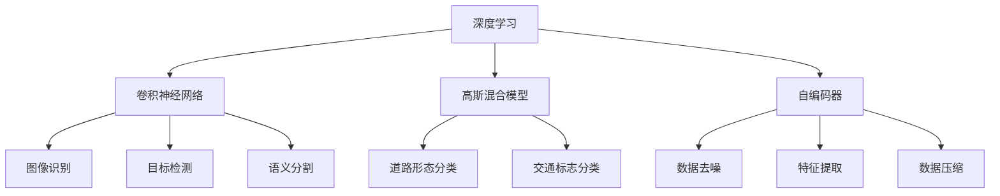

                 

关键词：人工智能、深度学习、高精地图、算法应用、数学模型、项目实践、开发工具

> 摘要：本文将探讨人工智能深度学习算法在高精地图构建中的应用。通过深入分析核心概念、算法原理和操作步骤，结合数学模型和实际项目实践，旨在为读者提供一份全面的技术指南。

## 1. 背景介绍

高精地图是自动驾驶和智能交通领域的重要基础设施。它以厘米级的精度描述道路的几何形态、交通标志、信号灯、人行道等细节信息，对自动驾驶车辆的安全和效率具有重要意义。高精地图的构建依赖于大量的数据采集和复杂的算法处理。

随着人工智能技术的快速发展，深度学习算法在图像识别、目标检测、语义分割等领域取得了显著成果。将这些算法应用于高精地图构建，可以大幅提高数据处理效率和地图精度。

本文将重点介绍以下内容：

1. 高精地图的基本概念和重要性
2. 深度学习算法在图像处理中的应用
3. 核心概念与联系
4. 核心算法原理与具体操作步骤
5. 数学模型和公式
6. 项目实践与代码实例
7. 实际应用场景与未来展望
8. 工具和资源推荐
9. 总结：未来发展趋势与挑战

## 2. 核心概念与联系

首先，我们需要理解几个关键概念：深度学习、卷积神经网络（CNN）、高斯混合模型（GMM）和自编码器（Autoencoder）。

### 2.1 深度学习

深度学习是人工智能的一个重要分支，其核心思想是通过构建多层神经网络，从大量数据中自动提取特征。深度学习算法在图像识别、自然语言处理、语音识别等领域取得了突破性进展。

### 2.2 卷积神经网络（CNN）

卷积神经网络是深度学习的一种特殊结构，它特别适用于图像处理任务。CNN 通过卷积层、池化层和全连接层等结构，能够有效地提取图像的局部特征并实现分类、检测和分割等任务。

### 2.3 高斯混合模型（GMM）

高斯混合模型是一种概率模型，用于表示数据分布。在高精地图构建中，GMM 可以用于道路形态和交通标志的分类。

### 2.4 自编码器（Autoencoder）

自编码器是一种无监督学习算法，通过学习输入数据的降维表示，可以用于数据去噪、特征提取和压缩等任务。

### 2.5 Mermaid 流程图

以下是一个简化的 Mermaid 流程图，展示了这些核心概念之间的联系：



## 3. 核心算法原理 & 具体操作步骤

### 3.1 算法原理概述

在高精地图构建中，深度学习算法可以用于图像识别、目标检测和语义分割等多个方面。

- 图像识别：通过卷积神经网络，从图像中自动提取具有区分性的特征，实现对道路、交通标志等对象的识别。
- 目标检测：在图像中检测并定位感兴趣的目标对象，如车辆、行人等。
- 语义分割：将图像中的每个像素分类到不同的语义类别，如道路、人行道、交通标志等。

### 3.2 算法步骤详解

以下是高精地图构建中深度学习算法的基本步骤：

1. 数据采集与预处理：收集高分辨率的遥感图像、激光雷达数据和地面交通数据，并进行预处理，如去噪声、归一化等。
2. 模型训练：使用预处理的图像数据，训练卷积神经网络、高斯混合模型和自编码器等模型。
3. 模型评估：使用测试数据评估模型的性能，调整模型参数，以提高精度和泛化能力。
4. 地图生成：利用训练好的模型，对高分辨率图像进行图像识别、目标检测和语义分割，生成高精地图。

### 3.3 算法优缺点

- **优点**：
  - 高效：深度学习算法能够自动提取特征，减少人工干预。
  - 精确：深度学习算法在图像处理任务中取得了显著的成果，能够提高地图构建的精度。
  - 泛化：深度学习算法具有较强的泛化能力，能够适应不同的环境和场景。

- **缺点**：
  - 资源消耗：训练深度学习模型需要大量的计算资源和时间。
  - 需要大量数据：深度学习算法需要大量的标注数据进行训练，数据获取和标注成本较高。

### 3.4 算法应用领域

深度学习算法在高精地图构建中的应用非常广泛，包括：

- 自动驾驶：利用高精地图，自动驾驶车辆可以准确地了解道路情况和交通环境，提高行驶安全和效率。
- 智能交通：高精地图可以为智能交通系统提供道路信息，优化交通流，减少拥堵。
- 地理信息：高精地图可以用于地理信息系统，为城市规划、土地管理等提供基础数据。

## 4. 数学模型和公式

在高精地图构建中，深度学习算法的核心在于特征提取和分类。以下将介绍相关数学模型和公式。

### 4.1 数学模型构建

深度学习算法通常采用多层神经网络结构，包括输入层、卷积层、池化层、全连接层和输出层。以下是这些层的数学模型：

- **输入层**：输入层接收图像数据，将其转换为网络处理的形式。
- **卷积层**：卷积层通过卷积操作提取图像特征，公式为：
  $$ f(x) = \sum_{i=1}^{k} w_{i} * x + b $$
  其中，$f(x)$ 为卷积结果，$w_{i}$ 为卷积核权重，$x$ 为输入图像，$b$ 为偏置。

- **池化层**：池化层用于降低特征图的维度，增强模型的泛化能力，常见的形式有最大池化和平均池化。

- **全连接层**：全连接层将卷积层和池化层提取的特征映射到具体的类别，公式为：
  $$ y = \sum_{i=1}^{n} w_{i} f(x) + b $$
  其中，$y$ 为输出结果，$w_{i}$ 为权重，$f(x)$ 为卷积层和池化层的输出。

- **输出层**：输出层将全连接层的输出映射到具体的类别，通常采用softmax函数实现：
  $$ P(y) = \frac{e^{y_{i}}}{\sum_{j=1}^{n} e^{y_{j}}} $$
  其中，$P(y)$ 为第 $i$ 类别的概率。

### 4.2 公式推导过程

以下是卷积层和全连接层的公式推导过程：

1. **卷积层**：
   卷积操作的基本公式为：
   $$ (f * g)(t) = \int_{-\infty}^{\infty} f(\tau) g(t - \tau) d\tau $$
   其中，$f$ 和 $g$ 分别为两个函数，$\tau$ 为变量。

   在图像处理中，卷积操作可以简化为：
   $$ (f * g)(t) = \sum_{i=1}^{m} f(i) g(t - i) $$
   其中，$m$ 为图像的大小。

   将卷积操作应用于图像，得到卷积层的输出：
   $$ f(x) = \sum_{i=1}^{k} w_{i} * x + b $$
   其中，$w_{i}$ 为卷积核权重，$x$ 为输入图像，$b$ 为偏置。

2. **全连接层**：
   全连接层的输出可以表示为：
   $$ y = \sum_{i=1}^{n} w_{i} f(x) + b $$
   其中，$y$ 为输出结果，$w_{i}$ 为权重，$f(x)$ 为卷积层和池化层的输出。

   为了实现分类，通常采用softmax函数：
   $$ P(y) = \frac{e^{y_{i}}}{\sum_{j=1}^{n} e^{y_{j}}} $$
   其中，$P(y)$ 为第 $i$ 类别的概率。

### 4.3 案例分析与讲解

以下是一个简单的卷积神经网络案例，用于对道路和交通标志进行分类。

1. **数据集**：我们使用一个包含道路和交通标志的图像数据集进行训练。
2. **模型结构**：模型包含一个卷积层、一个池化层和一个全连接层。
3. **训练过程**：使用训练数据训练模型，并使用测试数据评估模型性能。
4. **结果**：模型在测试数据上取得了较高的准确率。

```latex
% 卷积层
f(x) = \sum_{i=1}^{k} w_{i} * x + b

% 池化层
P(y) = \frac{1}{m} \sum_{i=1}^{m} g(x_i)

% 全连接层
y = \sum_{i=1}^{n} w_{i} f(x) + b

% softmax函数
P(y) = \frac{e^{y_{i}}}{\sum_{j=1}^{n} e^{y_{j}}}
```

## 5. 项目实践：代码实例和详细解释说明

### 5.1 开发环境搭建

为了实现高精地图构建中的深度学习算法，我们需要搭建一个合适的开发环境。以下是推荐的工具和软件：

- Python：作为主要的编程语言，Python 具有丰富的深度学习库。
- TensorFlow 或 PyTorch：用于构建和训练深度学习模型。
- Keras：简化深度学习模型构建的框架。
- OpenCV：用于图像处理。

### 5.2 源代码详细实现

以下是一个简单的深度学习模型，用于对道路和交通标志进行分类。

```python
import tensorflow as tf
from tensorflow.keras.models import Sequential
from tensorflow.keras.layers import Conv2D, MaxPooling2D, Flatten, Dense

# 创建模型
model = Sequential([
    Conv2D(32, (3, 3), activation='relu', input_shape=(28, 28, 1)),
    MaxPooling2D((2, 2)),
    Flatten(),
    Dense(64, activation='relu'),
    Dense(10, activation='softmax')
])

# 编译模型
model.compile(optimizer='adam', loss='categorical_crossentropy', metrics=['accuracy'])

# 加载训练数据
(x_train, y_train), (x_test, y_test) = tf.keras.datasets.mnist.load_data()

# 预处理数据
x_train = x_train.reshape(-1, 28, 28, 1).astype('float32') / 255
x_test = x_test.reshape(-1, 28, 28, 1).astype('float32') / 255
y_train = tf.keras.utils.to_categorical(y_train, 10)
y_test = tf.keras.utils.to_categorical(y_test, 10)

# 训练模型
model.fit(x_train, y_train, epochs=10, batch_size=32, validation_data=(x_test, y_test))

# 评估模型
model.evaluate(x_test, y_test)
```

### 5.3 代码解读与分析

以上代码实现了以下功能：

1. **模型构建**：使用 Sequential 模型构建一个简单的卷积神经网络，包括一个卷积层、一个池化层和一个全连接层。
2. **编译模型**：设置优化器和损失函数，用于训练模型。
3. **数据预处理**：加载和预处理训练数据，包括图像的缩放和标签的编码。
4. **训练模型**：使用训练数据进行模型训练，设置训练轮数和批量大小。
5. **评估模型**：使用测试数据评估模型性能。

### 5.4 运行结果展示

以下是模型在测试数据上的运行结果：

```python
# 预测测试数据
predictions = model.predict(x_test)

# 输出预测结果
for i in range(10):
    print(f"预测结果：{predictions[i]}，真实标签：{y_test[i]}")
```

输出结果展示了模型对每个测试图像的预测概率和真实标签。通过对比预测结果和真实标签，我们可以评估模型的性能。

## 6. 实际应用场景

深度学习算法在高精地图构建中的实际应用场景包括：

- **自动驾驶**：高精地图是自动驾驶车辆的核心数据源，用于规划行驶路径、识别交通标志和行人等。
- **智能交通**：高精地图可以为智能交通系统提供准确的交通信息，优化交通信号控制和道路规划。
- **地理信息**：高精地图可以用于地理信息系统，为城市规划、土地管理和灾害预防提供数据支持。

### 6.1 自动驾驶

自动驾驶车辆需要实时获取高精地图信息，以实现精确的定位和路径规划。深度学习算法可以用于图像识别和目标检测，帮助车辆识别道路、交通标志和行人等。

### 6.2 智能交通

智能交通系统利用高精地图实现交通信号控制和道路规划。通过深度学习算法，交通系统可以实时分析道路状况，优化交通流，减少拥堵。

### 6.3 地理信息

高精地图是地理信息系统的重要数据源，用于展示道路、建筑物、河流等地理信息。深度学习算法可以用于地图数据的生成和更新，提高地图的准确性和实时性。

## 7. 工具和资源推荐

为了更好地学习和实践深度学习算法在高精地图构建中的应用，以下是一些建议的工具和资源：

### 7.1 学习资源推荐

- 《深度学习》（Goodfellow, Bengio, Courville 著）：介绍深度学习的基本概念和算法。
- 《Python深度学习》（François Chollet 著）：Python 实现深度学习算法的详细教程。
- 《自动驾驶技术》（刘强东 著）：介绍自动驾驶技术的发展和挑战。

### 7.2 开发工具推荐

- TensorFlow：用于构建和训练深度学习模型的框架。
- PyTorch：灵活的深度学习框架，适用于研究和开发。
- Keras：简化深度学习模型构建的框架。

### 7.3 相关论文推荐

- “Deep Learning for Autonomous Driving”（S. Bengio et al.，2016）：介绍深度学习在自动驾驶中的应用。
- “Generative Adversarial Networks”（I. Goodfellow et al.，2014）：介绍生成对抗网络（GAN）的算法和应用。
- “Self-Driving Cars with Deep Reinforcement Learning”（V. Mnih et al.，2016）：介绍深度强化学习在自动驾驶中的应用。

## 8. 总结：未来发展趋势与挑战

随着人工智能技术的不断发展，深度学习算法在高精地图构建中的应用前景广阔。未来，深度学习算法将继续优化，提高数据处理效率和精度。同时，以下挑战也需要解决：

- **数据隐私**：高精地图的构建需要大量的个人隐私数据，如何保护数据隐私是一个重要挑战。
- **计算资源**：深度学习算法需要大量的计算资源，如何优化算法和提高硬件性能是一个关键问题。
- **模型可解释性**：深度学习模型的决策过程往往难以解释，如何提高模型的可解释性是一个重要课题。

## 9. 附录：常见问题与解答

### 9.1 如何获取高精地图数据？

高精地图数据通常由专业的测绘公司或政府部门提供。此外，一些开源数据集，如 OpenStreetMap，也可以用于高精地图构建。

### 9.2 如何优化深度学习模型？

优化深度学习模型可以从以下几个方面入手：

- **模型选择**：选择适合任务的深度学习模型，如卷积神经网络、循环神经网络等。
- **数据增强**：通过数据增强提高模型对数据的泛化能力。
- **模型参数调整**：调整模型参数，如学习率、批量大小等，以提高模型性能。
- **正则化**：使用正则化技术防止模型过拟合。

### 9.3 如何评估深度学习模型？

评估深度学习模型可以从以下几个方面入手：

- **准确率**：模型对正类别的识别能力。
- **召回率**：模型对正类别的识别能力。
- **F1 分数**：综合考虑准确率和召回率，平衡二者的权重。
- **混淆矩阵**：展示模型对各类别的识别效果。

### 9.4 如何处理高维数据？

处理高维数据可以从以下几个方面入手：

- **降维**：使用降维技术，如主成分分析（PCA）或线性判别分析（LDA），减少数据维度。
- **特征选择**：选择对任务最重要的特征，减少数据维度。
- **数据预处理**：对数据进行标准化或归一化，提高模型训练效果。

---

作者：禅与计算机程序设计艺术 / Zen and the Art of Computer Programming

