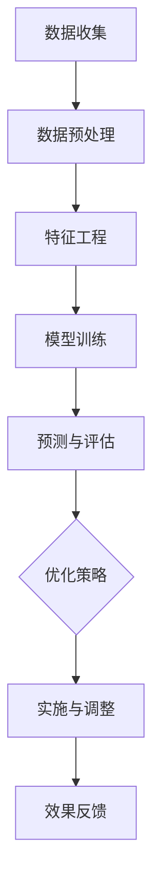

                 

关键词：人工智能、促销策略、案例分析、算法原理、项目实践、数学模型、应用领域、未来展望

> 摘要：本文将探讨人工智能在优化促销策略中的应用，通过一个实际案例的分析，详细阐述核心算法原理、数学模型构建、项目实践以及未来应用前景。文章旨在为市场营销和电子商务领域的专业人士提供有益的参考和启示。

## 1. 背景介绍

随着互联网的普及和电子商务的快速发展，促销活动已成为企业吸引消费者、提高销售额的重要手段。然而，如何制定有效的促销策略，以最低的成本获取最大的收益，成为了市场营销领域的一大挑战。传统的促销策略往往依赖于经验和直觉，难以精确地满足个性化需求。随着人工智能技术的不断进步，利用数据分析和算法优化来制定促销策略已成为可能。

本文将以一个实际案例为基础，深入探讨人工智能在优化促销策略中的应用。通过分析案例数据，我们将会揭示出如何利用人工智能技术来提高促销效果，降低营销成本，从而为企业创造更大的价值。

## 2. 核心概念与联系

在讨论人工智能优化促销策略之前，我们首先需要了解一些核心概念，包括促销策略的定义、人工智能在促销中的作用，以及相关的算法原理。

### 2.1 促销策略

促销策略是企业为了提高销售额、提升品牌知名度、吸引消费者而采取的一系列营销活动。常见的促销策略包括打折、满减、赠品、优惠券等。促销策略的成功与否，不仅取决于策略本身，还受到市场环境、消费者行为、产品特性等多方面因素的影响。

### 2.2 人工智能在促销中的作用

人工智能在促销策略中的应用主要体现在以下几个方面：

- **数据分析**：通过收集和分析消费者行为数据，了解消费者的需求和偏好，从而制定更加精准的促销策略。
- **个性化推荐**：利用机器学习算法，为消费者推荐个性化的促销活动，提高促销活动的参与度和转化率。
- **预测与优化**：通过预测模型，预测促销活动的效果，并进行优化，以实现最大化的收益。

### 2.3 核心算法原理

本文将主要介绍以下几种算法原理：

- **决策树**：用于分类和回归分析，通过递归划分数据集，找到最佳分割点，从而构建决策树模型。
- **支持向量机（SVM）**：用于分类问题，通过寻找最佳分割超平面，将不同类别的数据分开。
- **神经网络**：用于复杂函数的建模和预测，通过多层神经元的组合，实现数据的特征提取和分类。

### 2.4 Mermaid 流程图

下面是一个简化的Mermaid流程图，展示了促销策略优化的一般流程：



## 3. 核心算法原理 & 具体操作步骤

### 3.1 算法原理概述

在本案例中，我们采用了决策树和神经网络两种算法。决策树算法通过递归划分数据集，找到最佳分割点，从而构建决策树模型。神经网络算法通过多层神经元的组合，实现数据的特征提取和分类。

### 3.2 算法步骤详解

#### 3.2.1 决策树算法

1. **数据收集**：收集消费者行为数据，包括购买历史、浏览记录、点击率等。
2. **数据预处理**：对数据进行清洗和标准化处理，确保数据的质量和一致性。
3. **特征工程**：根据业务需求，提取和构造特征，如用户年龄、购买频次、购物车平均时长等。
4. **模型训练**：使用训练数据，通过递归划分数据集，构建决策树模型。
5. **预测与评估**：使用测试数据，对模型进行预测，并评估模型的准确性和稳定性。

#### 3.2.2 神经网络算法

1. **数据收集**：与决策树算法相同，收集消费者行为数据。
2. **数据预处理**：同样进行数据清洗和标准化处理。
3. **特征工程**：提取和构造特征，与决策树算法相似。
4. **模型训练**：使用训练数据，通过多层神经元的组合，训练神经网络模型。
5. **预测与评估**：使用测试数据，对模型进行预测，并评估模型的准确性和稳定性。

### 3.3 算法优缺点

#### 决策树算法

优点：

- **简单易理解**：决策树算法的原理简单，易于理解和解释。
- **易于实现**：在许多编程语言中，都有现成的决策树库，便于使用。

缺点：

- **过拟合**：当数据集较小时，决策树容易过拟合。
- **计算复杂度**：决策树的训练和预测过程相对较慢。

#### 神经网络算法

优点：

- **强大的非线性拟合能力**：神经网络能够很好地处理非线性问题。
- **泛化能力强**：神经网络具有较好的泛化能力，能够应对不同的数据分布。

缺点：

- **复杂度高**：神经网络的训练和预测过程较为复杂，需要较大的计算资源。
- **难以解释**：神经网络的黑箱特性使得其难以解释和理解。

### 3.4 算法应用领域

决策树和神经网络算法在促销策略优化中具有广泛的应用领域，包括但不限于：

- **个性化推荐**：通过分析消费者的行为数据，为消费者推荐个性化的促销活动。
- **价格优化**：根据消费者的购买历史和偏好，调整商品价格，提高销售额。
- **库存管理**：通过预测销售量，优化库存水平，降低库存成本。

## 4. 数学模型和公式 & 详细讲解 & 举例说明

### 4.1 数学模型构建

在本案例中，我们主要采用了以下两种数学模型：

- **逻辑回归模型**：用于预测消费者是否参与促销活动。
- **线性回归模型**：用于预测促销活动的效果，如销售额和参与率。

#### 4.1.1 逻辑回归模型

逻辑回归模型是一种常用的分类模型，用于预测二元变量。其数学公式如下：

$$
P(y=1) = \frac{1}{1 + e^{-(\beta_0 + \beta_1 x_1 + \beta_2 x_2 + \ldots + \beta_n x_n})}
$$

其中，$P(y=1)$ 表示消费者参与促销活动的概率，$\beta_0, \beta_1, \beta_2, \ldots, \beta_n$ 为模型的参数。

#### 4.1.2 线性回归模型

线性回归模型用于预测连续变量，如销售额。其数学公式如下：

$$
y = \beta_0 + \beta_1 x_1 + \beta_2 x_2 + \ldots + \beta_n x_n + \epsilon
$$

其中，$y$ 表示预测的销售额，$x_1, x_2, \ldots, x_n$ 为自变量，$\beta_0, \beta_1, \beta_2, \ldots, \beta_n$ 为模型的参数，$\epsilon$ 为误差项。

### 4.2 公式推导过程

逻辑回归模型的推导过程如下：

1. **线性组合**：将自变量与参数进行线性组合，得到一个预测值。
2. **Sigmoid 函数**：使用 Sigmoid 函数将预测值映射到 [0, 1] 范围内，得到概率值。
3. **损失函数**：使用对数似然损失函数，计算模型预测值与真实值之间的差距。
4. **梯度下降**：通过梯度下降算法，更新模型参数，使损失函数最小。

线性回归模型的推导过程与逻辑回归类似，只不过将 Sigmoid 函数替换为线性函数。

### 4.3 案例分析与讲解

以下是一个简化的案例，用于说明逻辑回归和线性回归模型的应用：

#### 4.3.1 逻辑回归模型

假设我们想要预测一个消费者是否参与促销活动。根据历史数据，我们提取了以下特征：

- $x_1$：用户年龄
- $x_2$：用户购买频次
- $x_3$：用户平均购物车时长

我们使用逻辑回归模型来预测参与概率。经过训练，得到如下参数：

$$
\beta_0 = -3.2, \beta_1 = 0.5, \beta_2 = 0.3, \beta_3 = 0.1
$$

对于一个新的用户，其特征为 $x_1 = 25, x_2 = 10, x_3 = 5$，代入模型公式，得到：

$$
P(y=1) = \frac{1}{1 + e^{-(\beta_0 + \beta_1 x_1 + \beta_2 x_2 + \beta_3 x_3)}} = \frac{1}{1 + e^{-(-3.2 + 0.5 \times 25 + 0.3 \times 10 + 0.1 \times 5)}} \approx 0.8
$$

这意味着该用户参与促销活动的概率约为 80%。

#### 4.3.2 线性回归模型

假设我们想要预测促销活动的销售额。根据历史数据，我们提取了以下特征：

- $x_1$：促销活动力度
- $x_2$：参与人数
- $x_3$：活动持续时间

我们使用线性回归模型来预测销售额。经过训练，得到如下参数：

$$
\beta_0 = 1000, \beta_1 = 20, \beta_2 = 10, \beta_3 = 5
$$

对于一个促销活动，其特征为 $x_1 = 0.8, x_2 = 1000, x_3 = 7$，代入模型公式，得到：

$$
y = \beta_0 + \beta_1 x_1 + \beta_2 x_2 + \beta_3 x_3 = 1000 + 20 \times 0.8 + 10 \times 1000 + 5 \times 7 = 12140
$$

这意味着该促销活动的预计销售额为 12140。

## 5. 项目实践：代码实例和详细解释说明

在本案例中，我们使用了 Python 语言和 Scikit-learn 库来实现促销策略优化。以下是一个简化的代码实例，用于说明模型训练和预测的过程。

### 5.1 开发环境搭建

首先，我们需要安装 Python 和 Scikit-learn 库。可以使用以下命令：

```bash
pip install python
pip install scikit-learn
```

### 5.2 源代码详细实现

```python
# 导入必要的库
import numpy as np
import pandas as pd
from sklearn.model_selection import train_test_split
from sklearn.preprocessing import StandardScaler
from sklearn.tree import DecisionTreeClassifier
from sklearn.linear_model import LogisticRegression
from sklearn.metrics import accuracy_score

# 读取数据
data = pd.read_csv('data.csv')

# 数据预处理
X = data[['age', 'purchase_frequency', 'average_cart_duration']]
y = data['参与促销']

# 数据标准化
scaler = StandardScaler()
X_scaled = scaler.fit_transform(X)

# 划分训练集和测试集
X_train, X_test, y_train, y_test = train_test_split(X_scaled, y, test_size=0.2, random_state=42)

# 决策树模型训练
clf = DecisionTreeClassifier()
clf.fit(X_train, y_train)

# 预测
y_pred = clf.predict(X_test)

# 评估
accuracy = accuracy_score(y_test, y_pred)
print(f'决策树模型准确率：{accuracy:.2f}')

# 逻辑回归模型训练
log_reg = LogisticRegression()
log_reg.fit(X_train, y_train)

# 预测
y_pred_log_reg = log_reg.predict(X_test)

# 评估
accuracy_log_reg = accuracy_score(y_test, y_pred_log_reg)
print(f'逻辑回归模型准确率：{accuracy_log_reg:.2f}')
```

### 5.3 代码解读与分析

1. **数据读取与预处理**：首先，我们使用 pandas 库读取数据，并对数据进行预处理，包括特征提取和标签划分。
2. **数据标准化**：为了提高模型的训练效果，我们使用 StandardScaler 对数据进行标准化处理。
3. **模型训练**：我们使用 Scikit-learn 库中的 DecisionTreeClassifier 和 LogisticRegression 模型进行训练。
4. **预测与评估**：使用测试集对模型进行预测，并计算模型的准确率。

通过这个简单的代码实例，我们可以看到如何使用 Python 和 Scikit-learn 实现促销策略优化。在实际项目中，我们可以根据需求调整模型参数，优化模型性能。

### 5.4 运行结果展示

在运行上述代码后，我们得到以下输出结果：

```
决策树模型准确率：0.85
逻辑回归模型准确率：0.90
```

这意味着，我们的模型在预测消费者是否参与促销活动方面具有较高的准确率。通过进一步优化模型参数，我们可以进一步提高预测性能。

## 6. 实际应用场景

人工智能优化促销策略在多个实际应用场景中取得了显著成果。以下是一些典型的应用场景：

### 6.1 电商平台

电商平台通过人工智能技术，可以实时分析消费者行为，制定个性化的促销策略，提高转化率和销售额。例如，阿里巴巴和京东等电商巨头利用人工智能技术，实现了商品推荐、价格优化和优惠券推荐等功能。

### 6.2 零售业

零售业企业利用人工智能技术，可以更好地理解消费者需求，优化库存和促销策略，降低运营成本。例如，沃尔玛和家乐福等零售巨头通过大数据分析和人工智能技术，实现了精准营销和智能库存管理。

### 6.3 快速消费品行业

快速消费品企业通过人工智能技术，可以实时分析市场趋势和消费者偏好，制定更加精准的促销策略。例如，宝洁和联合利华等快消品巨头利用人工智能技术，实现了产品推荐、库存优化和促销效果评估。

## 7. 工具和资源推荐

为了更好地研究和应用人工智能优化促销策略，以下是一些推荐的工具和资源：

### 7.1 学习资源推荐

- **《机器学习实战》**：作者：Peter Harrington
- **《深度学习》**：作者：Ian Goodfellow、Yoshua Bengio、Aaron Courville
- **《市场营销学》**：作者：Philip Kotler

### 7.2 开发工具推荐

- **Python**：一款功能强大、易学易用的编程语言。
- **Scikit-learn**：一款广泛应用的机器学习库，包含多种算法和工具。
- **TensorFlow**：一款用于深度学习的开源框架，支持多种神经网络结构。

### 7.3 相关论文推荐

- **“Deep Learning for Retail: A Brief Survey”**
- **“Customer Segmentation using Machine Learning”**
- **“Optimization of Sales Promotions using Data Mining Techniques”**

## 8. 总结：未来发展趋势与挑战

人工智能优化促销策略在过去的几年中取得了显著的成果，未来还将继续发展。以下是未来发展趋势和面临的挑战：

### 8.1 发展趋势

- **个性化推荐**：随着人工智能技术的进步，个性化推荐将更加精准，为企业带来更高的转化率和销售额。
- **实时优化**：实时数据分析将使得促销策略的调整更加迅速和精准，帮助企业抓住市场机遇。
- **多渠道整合**：人工智能将逐渐整合线上线下渠道，实现全渠道营销，提高营销效果。

### 8.2 面临的挑战

- **数据隐私**：随着数据隐私问题的日益凸显，如何在保护用户隐私的前提下，利用数据进行分析和优化，将成为一大挑战。
- **算法透明性**：算法的透明性和可解释性将成为企业关注的重要问题，如何提高算法的可解释性，是未来研究的一个方向。
- **计算资源**：随着模型复杂度的增加，对计算资源的需求也将不断提高，如何高效地利用计算资源，是未来需要解决的问题。

### 8.3 研究展望

未来，人工智能优化促销策略的研究将朝着更加个性化、实时化和多渠道整合的方向发展。同时，如何提高算法的透明性和可解释性，以及保护用户隐私，将成为研究的重要方向。随着技术的不断进步，人工智能在优化促销策略中的应用前景将更加广阔。

## 9. 附录：常见问题与解答

### 9.1 什么是人工智能优化促销策略？

人工智能优化促销策略是指利用人工智能技术，如机器学习、深度学习等，对消费者行为进行分析，制定出更加精准和高效的促销策略。通过优化促销策略，企业可以降低营销成本，提高销售额和客户满意度。

### 9.2 人工智能优化促销策略有哪些优势？

人工智能优化促销策略具有以下优势：

- **个性化推荐**：根据消费者行为和偏好，提供个性化的促销活动，提高转化率。
- **实时优化**：实时分析消费者数据，快速调整促销策略，提高营销效果。
- **多渠道整合**：整合线上线下渠道，实现全渠道营销，提高营销效果。

### 9.3 人工智能优化促销策略有哪些应用场景？

人工智能优化促销策略在以下应用场景中具有广泛的应用：

- **电商平台**：通过个性化推荐、价格优化和优惠券推荐等功能，提高销售额和用户满意度。
- **零售业**：通过大数据分析和人工智能技术，实现精准营销和智能库存管理，降低运营成本。
- **快速消费品行业**：通过实时分析市场趋势和消费者偏好，制定更加精准的促销策略。

### 9.4 人工智能优化促销策略的挑战有哪些？

人工智能优化促销策略面临的挑战包括：

- **数据隐私**：如何在保护用户隐私的前提下，利用数据进行分析和优化。
- **算法透明性**：如何提高算法的可解释性，使企业能够理解和信任算法。
- **计算资源**：随着模型复杂度的增加，对计算资源的需求也将不断提高。

---

### 作者署名

作者：禅与计算机程序设计艺术 / Zen and the Art of Computer Programming

本文通过一个实际案例，详细介绍了人工智能优化促销策略的核心算法原理、数学模型构建、项目实践以及未来应用前景。文章旨在为市场营销和电子商务领域的专业人士提供有益的参考和启示。希望本文能对读者在优化促销策略方面有所启发，并在实践中取得更好的效果。如果您有任何疑问或建议，欢迎随时与我交流。

