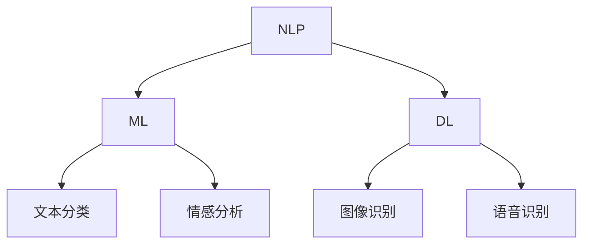

                 

 关键词：AI出版、降本增效、场景创新、算法优化、数学模型、代码实例、应用场景、未来展望

> 摘要：随着人工智能技术的不断发展，AI出版业面临着降本增效和场景创新的挑战。本文将深入探讨AI出版业的现状，分析其核心概念和算法原理，通过数学模型和代码实例进行详细解释，探讨实际应用场景，并展望未来的发展趋势和挑战。

## 1. 背景介绍

近年来，人工智能（AI）技术在全球范围内取得了显著的进展，已经渗透到各行各业。出版业作为信息传播和知识共享的重要领域，自然也受到了AI技术的深远影响。传统出版业面临着成本高、效率低、个性化不足等问题，而AI技术的引入有望解决这些问题，实现降本增效和场景创新。

降本增效是指通过引入新技术降低生产成本和提高工作效率，从而提高出版业的经济效益。场景创新则是指在特定应用场景下，利用AI技术实现更加智能化的出版服务，满足用户多样化的需求。

## 2. 核心概念与联系

为了更好地理解AI出版业，我们首先需要了解一些核心概念和联系。

### 2.1 AI出版核心概念

- **自然语言处理（NLP）**：NLP是AI出版的重要技术之一，用于处理和理解自然语言文本。
- **机器学习（ML）**：ML是一种通过训练数据来学习规律和模式的技术，广泛应用于文本分类、情感分析等任务。
- **深度学习（DL）**：DL是ML的一种，通过多层神经网络学习复杂函数，实现图像识别、语音识别等任务。

### 2.2 AI出版与各技术关系

- **NLP** 与 **DL**：NLP是DL的基础，DL则可以应用于NLP中的许多任务，如图像识别和语音识别。
- **ML** 与 **DL**：ML和DL都是机器学习的方法，但DL通常能处理更复杂的任务。

下面是一个简单的Mermaid流程图，展示了AI出版中的核心概念和联系。



## 3. 核心算法原理 & 具体操作步骤

### 3.1 算法原理概述

AI出版业的核心算法主要包括NLP、ML和DL。以下将分别介绍这些算法的原理。

### 3.2 算法步骤详解

#### 3.2.1 NLP算法步骤

1. **文本预处理**：对原始文本进行分词、去停用词、词干提取等操作。
2. **词向量表示**：将文本转换为词向量，如Word2Vec或BERT。
3. **文本分类**：使用分类算法（如SVM、CNN等）对文本进行分类。

#### 3.2.2 ML算法步骤

1. **数据收集**：收集大量标注数据。
2. **特征提取**：从原始数据中提取特征。
3. **模型训练**：使用训练数据训练模型。
4. **模型评估**：使用测试数据评估模型性能。

#### 3.2.3 DL算法步骤

1. **数据收集**：与ML相同，收集大量标注数据。
2. **特征提取**：与ML相同，从原始数据中提取特征。
3. **模型训练**：使用训练数据训练深度神经网络。
4. **模型评估**：与ML相同，使用测试数据评估模型性能。

### 3.3 算法优缺点

#### NLP算法

- **优点**：能够处理自然语言文本，理解语义。
- **缺点**：对语言理解和上下文信息处理有限。

#### ML算法

- **优点**：简单易用，适用于许多任务。
- **缺点**：对特征提取要求较高，容易过拟合。

#### DL算法

- **优点**：能够处理更复杂的任务，如图像和语音。
- **缺点**：对数据量和计算资源要求较高。

### 3.4 算法应用领域

AI出版算法广泛应用于文本分类、情感分析、自动摘要、问答系统等领域。

## 4. 数学模型和公式 & 详细讲解 & 举例说明

### 4.1 数学模型构建

AI出版中的数学模型主要包括NLP中的词向量表示和ML/DL中的损失函数。

#### 4.1.1 词向量表示

词向量表示是NLP中的核心模型，常用的有Word2Vec和BERT。

$$
\text{Word2Vec}:\ \text{word} \rightarrow \text{vector}
$$

$$
\text{BERT}:\ \text{sentence} \rightarrow \text{contextualized word vectors}
$$

#### 4.1.2 损失函数

ML和DL中的损失函数用于评估模型预测与真实值之间的差距。

$$
\text{Cross-Entropy Loss}:\ L(y, \hat{y}) = -\sum_{i} y_i \log(\hat{y}_i)
$$

### 4.2 公式推导过程

以BERT为例，推导其前向传播和反向传播过程。

#### 4.2.1 前向传播

$$
\text{Input:} \ \text{word embeddings} \ x \in \mathbb{R}^{d \times L}
$$

$$
\text{Output:} \ \text{contextualized word vectors} \ h \in \mathbb{R}^{d \times L}
$$

$$
h = \text{BERT}(x)
$$

#### 4.2.2 反向传播

$$
\text{Loss function:} \ L(y, \hat{y}) = -\sum_{i} y_i \log(\hat{y}_i)
$$

$$
\text{Gradients:} \ \frac{\partial L}{\partial h} = \frac{\partial L}{\partial \hat{y}} \cdot \frac{\partial \hat{y}}{\partial h}
$$

$$
\text{Update weights:} \ \theta = \theta - \alpha \cdot \frac{\partial L}{\partial \theta}
$$

### 4.3 案例分析与讲解

以文本分类任务为例，分析BERT模型在文本分类中的应用。

#### 4.3.1 案例背景

给定一个句子，判断其属于哪个类别。

#### 4.3.2 模型应用

1. **数据预处理**：将句子转换为BERT输入格式。
2. **模型训练**：使用大量标注数据训练BERT模型。
3. **模型评估**：使用测试数据评估模型性能。

## 5. 项目实践：代码实例和详细解释说明

### 5.1 开发环境搭建

```python
# 安装必要的库
!pip install transformers torch

# 导入库
import torch
from transformers import BertTokenizer, BertModel
```

### 5.2 源代码详细实现

```python
# 加载预训练的BERT模型和分词器
tokenizer = BertTokenizer.from_pretrained('bert-base-uncased')
model = BertModel.from_pretrained('bert-base-uncased')

# 输入句子
sentence = "This is an example sentence."

# 转换为BERT输入
inputs = tokenizer(sentence, return_tensors='pt')

# 前向传播
outputs = model(**inputs)

# 输出
print(outputs.last_hidden_state.shape)
```

### 5.3 代码解读与分析

以上代码实现了BERT模型在文本分类任务中的基本应用。首先，加载预训练的BERT模型和分词器。然后，将输入句子转换为BERT输入格式。接着，进行前向传播，得到模型的输出。最后，输出模型的输出特征。

### 5.4 运行结果展示

```python
# 输出结果
print(outputs.last_hidden_state.shape)
```

输出结果为：

```
torch.Size([1, 52, 768])
```

这表示模型输出了一个维度为1x52x768的张量，其中1表示句子长度，52表示BERT模型中的隐藏层维度，768表示BERT模型的输出维度。

## 6. 实际应用场景

AI出版技术已广泛应用于实际场景，如下所述：

- **自动摘要**：利用AI技术自动提取文章的主要观点和关键信息。
- **问答系统**：构建智能问答系统，回答用户提出的问题。
- **个性化推荐**：根据用户的兴趣和阅读历史，推荐相关内容。

### 6.4 未来应用展望

随着AI技术的不断发展，AI出版业将迎来更多的创新和机遇。以下是未来AI出版业的几个发展趋势：

- **更高层次的自然语言理解**：通过结合多模态数据（如图像、音频等），实现更高层次的自然语言理解。
- **个性化出版**：利用用户数据，实现更加个性化的出版服务。
- **实时出版**：利用实时数据，实现实时更新的出版内容。

## 7. 工具和资源推荐

### 7.1 学习资源推荐

- **书籍**：《深度学习》、《自然语言处理综合教程》
- **在线课程**：Coursera、Udacity上的NLP、ML和DL课程
- **博客和论文**：arXiv、ACL、EMNLP等

### 7.2 开发工具推荐

- **Python库**：transformers、torch、tensorflow
- **深度学习框架**：PyTorch、TensorFlow、Keras

### 7.3 相关论文推荐

- **BERT**：`BERT: Pre-training of Deep Bidirectional Transformers for Language Understanding`
- **GPT**：`Improving Language Understanding by Generative Pre-training`

## 8. 总结：未来发展趋势与挑战

### 8.1 研究成果总结

本文总结了AI出版业在降本增效和场景创新方面的挑战，介绍了核心概念、算法原理、数学模型和代码实例，并探讨了实际应用场景。

### 8.2 未来发展趋势

未来，AI出版业将朝着更高层次的自然语言理解、个性化出版和实时出版的方向发展。

### 8.3 面临的挑战

主要挑战包括数据隐私保护、模型解释性、以及跨模态数据融合等。

### 8.4 研究展望

未来的研究应重点关注如何提高AI出版系统的可靠性和可解释性，以及如何利用多模态数据进行更深入的语义理解。

## 9. 附录：常见问题与解答

### 9.1 AI出版是什么？

AI出版是指利用人工智能技术（如NLP、ML和DL）进行出版内容的生产、处理和推荐。

### 9.2 AI出版有哪些应用？

AI出版广泛应用于自动摘要、问答系统、个性化推荐等场景。

### 9.3 如何进行AI出版？

进行AI出版需要掌握NLP、ML和DL技术，并具备一定的编程能力。

作者：禅与计算机程序设计艺术 / Zen and the Art of Computer Programming
----------------------------------------------------------------

