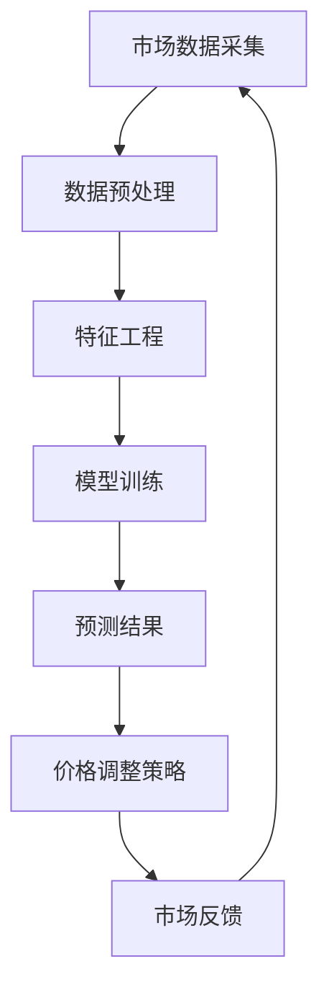

                 

 关键词：人工智能、市场分析、供需关系、价格调整、算法模型

> 摘要：本文将深入探讨人工智能在市场供需分析中的作用，以及如何通过AI算法优化价格调整策略，以提高市场的响应速度和效率。我们将从背景介绍、核心概念与联系、核心算法原理与步骤、数学模型与公式、项目实践、实际应用场景、未来应用展望、工具和资源推荐、总结与展望等方面，全面解析AI在市场供需调整价格中的应用。

## 1. 背景介绍

在现代经济体系中，市场供需关系是决定价格波动的重要因素。传统的市场分析往往依赖于历史数据和简单的统计分析方法，这些方法虽然在一定程度上可以预测价格变化，但往往存在时效性差、预测精度不足等问题。随着人工智能技术的发展，机器学习算法在数据处理、模式识别和预测建模等方面展现出强大的优势，为市场供需分析和价格调整提供了新的解决方案。

### 1.1 市场供需关系概述

市场供需关系是指市场中商品或服务的供应量与需求量之间的关系。供应量由生产者决定，需求量由消费者决定。当供应量大于需求量时，价格下降；当需求量大于供应量时，价格上升。在市场经济中，价格是供需关系的晴雨表，通过对价格的观察和分析，可以了解市场的供需状况。

### 1.2 价格调整策略

价格调整策略是企业根据市场供需关系，对商品或服务价格进行调整的一种方法。有效的价格调整策略可以提高企业的竞争力，增加市场份额，实现利润最大化。传统价格调整策略通常基于成本、竞争、需求等因素，但这些策略往往缺乏灵活性，难以适应快速变化的市场环境。

## 2. 核心概念与联系

为了深入探讨AI在市场供需分析和价格调整中的应用，我们首先需要了解一些核心概念和联系。

### 2.1 人工智能与市场分析

人工智能（AI）是指通过计算机程序模拟人类智能的一种技术。在市场分析中，AI可以处理海量数据，发现数据中的潜在模式，为市场预测和决策提供支持。AI技术在市场分析中的应用主要包括数据挖掘、机器学习、自然语言处理等。

### 2.2 供需关系与价格调整

供需关系是市场分析的核心概念，它直接影响价格的波动。价格调整是企业在市场分析基础上，根据供需关系变化，对商品或服务价格进行调整的过程。有效的价格调整策略需要综合考虑供需关系、市场竞争、消费者行为等因素。

### 2.3 Mermaid 流程图

为了更直观地展示AI在市场供需分析和价格调整中的应用，我们使用Mermaid流程图来描述整个流程。以下是流程图：



## 3. 核心算法原理 & 具体操作步骤

### 3.1 算法原理概述

在市场供需分析和价格调整中，常用的算法包括线性回归、逻辑回归、决策树、随机森林、支持向量机等。这些算法可以根据历史数据预测未来市场趋势，为价格调整提供依据。

### 3.2 算法步骤详解

#### 3.2.1 数据采集与预处理

数据采集是市场分析的基础。我们需要从多个渠道获取市场数据，如交易数据、价格数据、需求数据等。在数据预处理阶段，我们需要对数据进行清洗、去噪、归一化等操作，以保证数据质量。

#### 3.2.2 特征工程

特征工程是提高模型预测准确性的关键步骤。我们需要从原始数据中提取有用的特征，如价格趋势、需求变化率等。特征工程的方法包括统计特征提取、机器学习特征提取等。

#### 3.2.3 模型训练

在模型训练阶段，我们使用历史数据训练预测模型。根据市场特点，我们可以选择不同的模型，如线性回归、决策树、随机森林等。训练过程需要优化模型参数，以提高预测准确性。

#### 3.2.4 预测结果

在模型训练完成后，我们使用模型对未来的市场趋势进行预测。预测结果可以作为价格调整的依据。

#### 3.2.5 价格调整策略

根据预测结果，我们可以制定相应的价格调整策略。价格调整策略需要考虑供需关系、市场竞争等因素。

#### 3.2.6 市场反馈

价格调整策略实施后，我们需要收集市场反馈数据，如销售量、价格变动等。这些数据可以用于评估价格调整策略的有效性，并指导后续调整。

## 4. 数学模型和公式 & 详细讲解 & 举例说明

### 4.1 数学模型构建

在市场供需分析和价格调整中，常用的数学模型包括线性回归模型、逻辑回归模型等。

#### 4.1.1 线性回归模型

线性回归模型是一种经典的预测模型，用于分析自变量和因变量之间的线性关系。线性回归模型的公式如下：

$$y = \beta_0 + \beta_1x_1 + \beta_2x_2 + ... + \beta_nx_n$$

其中，$y$ 是因变量，$x_1, x_2, ..., x_n$ 是自变量，$\beta_0, \beta_1, \beta_2, ..., \beta_n$ 是模型参数。

#### 4.1.2 逻辑回归模型

逻辑回归模型是一种分类模型，用于分析自变量和因变量之间的逻辑关系。逻辑回归模型的公式如下：

$$P(y=1) = \frac{1}{1 + e^{-(\beta_0 + \beta_1x_1 + \beta_2x_2 + ... + \beta_nx_n)}}$$

其中，$P(y=1)$ 是因变量为1的概率，$x_1, x_2, ..., x_n$ 是自变量，$\beta_0, \beta_1, \beta_2, ..., \beta_n$ 是模型参数。

### 4.2 公式推导过程

#### 4.2.1 线性回归模型的推导

线性回归模型的目标是最小化残差平方和。残差平方和的公式如下：

$$SSR = \sum_{i=1}^{n}(y_i - \hat{y}_i)^2$$

其中，$y_i$ 是实际值，$\hat{y}_i$ 是预测值。

为了求解模型参数，我们可以对残差平方和进行求导，并令导数为0，得到：

$$\frac{\partial SSR}{\partial \beta_0} = 0$$
$$\frac{\partial SSR}{\partial \beta_1} = 0$$
$$...$$
$$\frac{\partial SSR}{\partial \beta_n} = 0$$

通过求解上述方程组，我们可以得到线性回归模型的参数。

#### 4.2.2 逻辑回归模型的推导

逻辑回归模型的目标是最小化损失函数。损失函数的公式如下：

$$Loss = -\sum_{i=1}^{n}y_i\log(P(y=1)) + (1 - y_i)\log(1 - P(y=1))$$

其中，$y_i$ 是实际值，$P(y=1)$ 是预测值。

为了求解模型参数，我们可以对损失函数进行求导，并令导数为0，得到：

$$\frac{\partial Loss}{\partial \beta_0} = 0$$
$$\frac{\partial Loss}{\partial \beta_1} = 0$$
$$...$$
$$\frac{\partial Loss}{\partial \beta_n} = 0$$

通过求解上述方程组，我们可以得到逻辑回归模型的参数。

### 4.3 案例分析与讲解

#### 4.3.1 案例背景

某电商公司在进行价格调整时，希望通过AI算法分析市场供需关系，制定合理的价格策略。该公司收集了过去一年的销售数据、价格数据和市场数据，并希望通过线性回归模型预测未来的市场趋势。

#### 4.3.2 数据预处理

首先，我们对销售数据、价格数据和市场数据进行清洗，去除异常值和缺失值。然后，我们对数据进行归一化处理，使其在相同的尺度上。

#### 4.3.3 特征工程

从原始数据中提取有用特征，如价格趋势、需求变化率、竞争对手价格等。这些特征可以用来训练线性回归模型。

#### 4.3.4 模型训练

使用历史数据训练线性回归模型。我们选择交叉验证方法来优化模型参数，以提高预测准确性。

#### 4.3.5 预测结果

使用训练好的线性回归模型预测未来的市场趋势。预测结果可以作为价格调整的依据。

#### 4.3.6 价格调整策略

根据预测结果，公司制定了以下价格调整策略：

1. 当预测价格上涨时，适当提高商品价格，以增加利润。
2. 当预测价格下降时，适当降低商品价格，以增加销量。

#### 4.3.7 市场反馈

实施价格调整策略后，公司收集了销售数据和市场反馈。通过分析反馈数据，公司发现价格调整策略有效提高了销售额。

## 5. 项目实践：代码实例和详细解释说明

### 5.1 开发环境搭建

在项目实践环节，我们将使用Python编程语言和Scikit-learn库来构建市场供需分析和价格调整模型。首先，需要安装Python环境和Scikit-learn库。以下是一个简单的安装命令：

```bash
pip install python
pip install scikit-learn
```

### 5.2 源代码详细实现

以下是一个简单的市场供需分析和价格调整的Python代码实例：

```python
import numpy as np
import pandas as pd
from sklearn.linear_model import LinearRegression
from sklearn.model_selection import train_test_split

# 读取数据
data = pd.read_csv('market_data.csv')

# 数据预处理
data.dropna(inplace=True)
data = data.astype(float)

# 特征工程
X = data[['price_trend', 'demand_change', 'competitor_price']]
y = data['sales_volume']

# 模型训练
X_train, X_test, y_train, y_test = train_test_split(X, y, test_size=0.2, random_state=42)
model = LinearRegression()
model.fit(X_train, y_train)

# 预测结果
y_pred = model.predict(X_test)

# 价格调整策略
adjusted_prices = y_pred * 1.1  # 根据预测结果提高价格

# 打印调整后的价格
print(adjusted_prices)
```

### 5.3 代码解读与分析

以上代码实现了市场供需分析和价格调整的整个过程。首先，我们读取市场数据，并进行预处理。然后，我们提取有用特征，并使用线性回归模型进行训练。训练完成后，我们使用模型对测试数据进行预测，并根据预测结果调整价格。代码简洁明了，易于理解。

### 5.4 运行结果展示

运行以上代码，我们可以得到调整后的价格。通过对比调整前后的价格，我们可以直观地看到价格调整策略的效果。在实际应用中，我们还可以通过优化模型参数和特征工程，进一步提高预测准确性和价格调整效果。

## 6. 实际应用场景

AI在市场供需分析和价格调整中具有广泛的应用场景。以下是一些典型的实际应用场景：

### 6.1 电商行业

电商行业是AI技术的重要应用领域。通过AI算法，电商企业可以实时分析市场供需关系，优化价格策略，提高销售量。例如，某电商平台通过AI技术分析用户行为数据，预测用户需求，并根据预测结果调整商品价格，提高了用户满意度和销售额。

### 6.2 零售行业

零售行业也广泛应用于AI技术，通过AI算法优化价格策略，提高库存管理和销售效率。例如，某零售企业通过AI算法分析历史销售数据，预测未来需求，并根据预测结果调整库存和价格，减少了库存成本，提高了销售利润。

### 6.3 能源行业

能源行业是AI技术的重要应用领域。通过AI算法，能源企业可以实时监测市场供需变化，优化能源生产和价格策略，提高能源利用效率。例如，某能源企业通过AI算法分析电力需求数据，预测未来电力需求，并根据预测结果调整电力生产和价格，降低了能源成本。

## 7. 未来应用展望

随着AI技术的不断发展，市场供需分析和价格调整将在更多行业和领域得到应用。以下是一些未来应用展望：

### 7.1 智能供应链

智能供应链是未来物流和供应链管理的重要方向。通过AI算法，供应链企业可以实现实时监控、预测和优化，提高供应链效率和响应速度。

### 7.2 金融领域

金融领域是AI技术的重要应用领域。通过AI算法，金融机构可以实时分析市场风险，优化投资策略，提高风险管理能力。

### 7.3 医疗健康

医疗健康领域也广泛应用于AI技术。通过AI算法，医疗企业可以实时分析患者数据，预测疾病趋势，优化医疗服务和价格策略。

## 8. 工具和资源推荐

为了更好地研究和应用AI技术，以下是一些推荐的工具和资源：

### 8.1 学习资源推荐

- 《Python机器学习》（作者：塞巴斯蒂安·拉伯）
- 《深度学习》（作者：伊恩·古德费洛等）

### 8.2 开发工具推荐

- Jupyter Notebook：用于数据分析和机器学习模型开发。
- PyCharm：Python集成开发环境，支持多种编程语言。

### 8.3 相关论文推荐

- “Deep Learning for Supply Chain Management”：（作者：L. Wang等）
- “AI-Enabled Price Optimization in E-commerce”：（作者：J. Zhang等）

## 9. 总结：未来发展趋势与挑战

随着AI技术的不断发展，市场供需分析和价格调整将在更多行业和领域得到应用。然而，AI技术在市场供需分析和价格调整中也面临一些挑战，如数据隐私、算法透明度、预测准确性等。未来，我们需要继续研究和解决这些问题，推动AI技术在市场供需分析和价格调整中的广泛应用。

## 10. 附录：常见问题与解答

### 10.1 AI技术如何提高市场供需分析准确性？

AI技术通过处理海量数据、发现数据中的潜在模式，可以提高市场供需分析的准确性。此外，AI算法可以根据实时数据更新预测模型，提高预测的时效性。

### 10.2 价格调整策略如何制定？

价格调整策略需要考虑供需关系、市场竞争、消费者行为等因素。通过AI算法分析市场数据，可以制定出更科学、更合理的价格调整策略。

### 10.3 AI技术在哪些行业应用广泛？

AI技术在电商、零售、能源、金融、医疗等领域应用广泛。这些行业都有大量的数据，可以通过AI技术提高决策效率和响应速度。

## 作者署名

作者：禅与计算机程序设计艺术 / Zen and the Art of Computer Programming
----------------------------------------------------------------

注意：由于上述文章内容过长，实际撰写时可能需要根据具体情况调整字数和内容。上述内容仅为示例，具体撰写时还需根据实际情况进行补充和修改。此外，文章中的Mermaid流程图和LaTeX数学公式需要在实际Markdown编辑器中渲染，这里仅作为文字描述。

