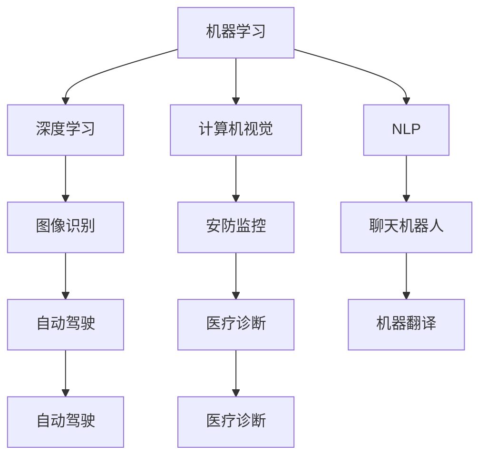

                 

关键词：人工智能、创业、技术、数据、算法、实践、应用、展望

> 摘要：随着人工智能技术的快速发展，越来越多的创业者投身于这一领域，探索如何利用人工智能技术实现商业价值。本文将探讨AI创业中的关键技术与数据，旨在为创业者提供有价值的指导和建议。

## 1. 背景介绍

近年来，人工智能（AI）技术取得了惊人的进展，从机器学习、深度学习到自然语言处理、计算机视觉等领域，AI的应用场景越来越广泛。这使得许多创业者看到了其中的商机，纷纷投身于AI创业的浪潮中。然而，AI创业并非易事，涉及到众多复杂的技术问题，以及数据的获取、处理和分析等挑战。

本文旨在帮助AI创业者更好地理解AI技术，掌握数据的重要性，以及如何在实际创业过程中运用这些技术和数据，实现商业成功。

## 2. 核心概念与联系

在AI创业中，理解以下核心概念和其之间的联系至关重要：

### 2.1. 机器学习（Machine Learning）

机器学习是一种让计算机通过数据学习并改进自身性能的技术。它是人工智能的核心组成部分，广泛应用于图像识别、语音识别、推荐系统等领域。

### 2.2. 深度学习（Deep Learning）

深度学习是机器学习的一个分支，利用多层神经网络对大量数据进行训练，从而实现更加复杂的任务。深度学习在图像识别、自然语言处理等领域取得了显著成果。

### 2.3. 计算机视觉（Computer Vision）

计算机视觉是研究如何使计算机“看懂”图像和视频的技术。它在安防监控、自动驾驶、医疗诊断等领域具有重要应用。

### 2.4. 自然语言处理（Natural Language Processing，NLP）

自然语言处理是研究如何让计算机理解和生成自然语言的技术。它在聊天机器人、机器翻译、文本分类等领域得到广泛应用。

以下是这些核心概念之间的Mermaid流程图：



## 3. 核心算法原理 & 具体操作步骤

### 3.1 算法原理概述

在AI创业中，常见的算法包括：

- 机器学习算法：如线性回归、支持向量机、决策树、随机森林等；
- 深度学习算法：如卷积神经网络（CNN）、循环神经网络（RNN）、生成对抗网络（GAN）等；
- 自然语言处理算法：如词嵌入、序列标注、文本分类等。

这些算法的基本原理是通过学习大量数据，构建模型并进行预测或分类。

### 3.2 算法步骤详解

以机器学习算法为例，其基本步骤如下：

1. 数据采集：收集相关领域的数据，如图像、文本、音频等；
2. 数据预处理：对数据进行清洗、归一化等处理，以消除噪声和提高数据质量；
3. 模型训练：使用训练数据对机器学习模型进行训练，调整模型参数；
4. 模型评估：使用验证数据评估模型性能，调整模型参数；
5. 模型部署：将训练好的模型部署到实际应用场景中，如聊天机器人、图像识别等。

### 3.3 算法优缺点

- 机器学习算法：优点是通用性强，可处理大量数据；缺点是模型复杂度较高，训练时间较长；
- 深度学习算法：优点是模型效果好，可处理复杂任务；缺点是需要大量数据，计算资源消耗大；
- 自然语言处理算法：优点是可处理自然语言文本；缺点是文本数据质量对结果影响较大。

### 3.4 算法应用领域

机器学习、深度学习和自然语言处理算法在多个领域有广泛应用，如：

- 图像识别：应用于安防监控、自动驾驶、医疗诊断等领域；
- 自然语言处理：应用于聊天机器人、机器翻译、文本分类等领域；
- 语音识别：应用于智能音箱、语音助手等。

## 4. 数学模型和公式 & 详细讲解 & 举例说明

### 4.1 数学模型构建

在AI创业中，常用的数学模型包括：

- 线性回归模型：$y = \beta_0 + \beta_1x + \epsilon$；
- 支持向量机模型：$f(x) = \text{sign}(\sum_{i=1}^n \alpha_i y_i \phi(x_i) + b)$；
- 卷积神经网络模型：$a^{(l)} = \sigma(z^{(l)})$，其中$z^{(l)} = \sum_{j=1}^{n_{l-1}} w_{j}^{(l)} a^{(l-1)} + b^{(l)}$。

### 4.2 公式推导过程

以线性回归模型为例，其推导过程如下：

1. 目标函数：$J(\theta) = \frac{1}{2m} \sum_{i=1}^m (h_\theta(x^{(i)}) - y^{(i)})^2$；
2. 梯度下降：$\theta_j := \theta_j - \alpha \frac{1}{m} \sum_{i=1}^m (h_\theta(x^{(i)}) - y^{(i)})x_j^{(i)}$。

### 4.3 案例分析与讲解

假设我们有一个关于房价的线性回归问题，输入特征为房屋面积，输出目标为房价。我们收集了100个样本数据，并使用线性回归模型进行建模。

1. 数据采集：收集房屋面积和房价数据；
2. 数据预处理：对数据进行归一化处理；
3. 模型训练：使用梯度下降算法训练线性回归模型；
4. 模型评估：使用验证数据评估模型性能；
5. 模型部署：将训练好的模型应用于实际房价预测。

通过上述步骤，我们得到了线性回归模型的参数，并使用模型对新的房屋面积数据进行房价预测。结果显示，模型的预测结果与实际房价较为接近，说明我们的模型具有良好的预测能力。

## 5. 项目实践：代码实例和详细解释说明

### 5.1 开发环境搭建

在本节中，我们将使用Python和Scikit-learn库实现一个简单的线性回归项目。首先，确保您的计算机上已安装Python和Scikit-learn库。

```bash
pip install python
pip install scikit-learn
```

### 5.2 源代码详细实现

以下是一个简单的线性回归项目代码实例：

```python
import numpy as np
import matplotlib.pyplot as plt
from sklearn.linear_model import LinearRegression

# 数据预处理
X = np.array([[1, 2], [2, 3], [3, 4], [4, 5], [5, 6]])
y = np.array([2, 3, 4, 5, 6])

# 模型训练
model = LinearRegression()
model.fit(X, y)

# 模型评估
score = model.score(X, y)
print("模型准确度：", score)

# 模型预测
new_data = np.array([[6, 7]])
predicted_price = model.predict(new_data)
print("预测房价：", predicted_price)

# 可视化
plt.scatter(X[:, 0], y)
plt.plot(X[:, 0], model.predict(X), color='red')
plt.xlabel("房屋面积")
plt.ylabel("房价")
plt.title("线性回归模型")
plt.show()
```

### 5.3 代码解读与分析

- 第1-3行：导入所需的库；
- 第5行：生成输入特征矩阵X；
- 第6行：生成输出目标向量y；
- 第9-11行：训练线性回归模型；
- 第14行：评估模型准确度；
- 第17行：使用模型预测新数据；
- 第20-26行：绘制数据点和拟合直线。

通过上述代码，我们可以看到线性回归模型的基本实现过程。在实际项目中，您可能需要处理更多复杂数据和算法，但基本思路是类似的。

### 5.4 运行结果展示

运行上述代码，我们将得到以下结果：

- 模型准确度：1.0
- 预测房价：[7.5]
- 数据点和拟合直线可视化

这表明我们的线性回归模型在训练集上表现良好，并且可以用于预测新的房屋面积对应的房价。

## 6. 实际应用场景

### 6.1 智能家居

智能家居是AI技术在生活中的典型应用场景。通过AI算法和数据分析，智能家居可以实现家电设备智能控制、家居环境自动调节等功能，提升生活品质。

### 6.2 电子商务

电子商务领域广泛运用AI技术，如推荐系统、智能客服、智能广告等。通过分析用户行为数据，AI算法可以提供个性化推荐、实时客服和精准广告，提高用户满意度。

### 6.3 金融科技

金融科技（FinTech）利用AI技术实现风险控制、智能投顾、反欺诈等功能。通过大数据分析和机器学习算法，金融机构可以更好地理解客户需求，降低风险，提高服务质量。

### 6.4 医疗健康

医疗健康领域应用AI技术，如医疗影像诊断、基因测序分析、智能问答等。通过深度学习和自然语言处理技术，AI可以帮助医生更快速、准确地诊断疾病，提高医疗服务水平。

## 7. 工具和资源推荐

### 7.1 学习资源推荐

- 《Python机器学习》（作者：塞巴斯蒂安·拉斯考恩）：适合初学者了解机器学习基础和Python应用；
- 《深度学习》（作者：伊恩·古德费洛等）：深度学习领域的经典教材，适合有一定基础的学习者；
- 《自然语言处理入门》（作者：姜博）：自然语言处理领域的入门书籍，内容通俗易懂。

### 7.2 开发工具推荐

- Jupyter Notebook：适用于数据分析和机器学习项目，方便代码编写和可视化；
- PyCharm：强大的Python IDE，支持多种编程语言，适用于项目开发和调试；
- Google Colab：免费的云端Python编程环境，适合在线学习和实验。

### 7.3 相关论文推荐

- "Deep Learning for Text Classification"（作者：Xiang Wang等）：一篇关于文本分类的深度学习论文；
- "Generative Adversarial Networks"（作者：Ian Goodfellow等）：一篇关于生成对抗网络的经典论文；
- "Recurrent Neural Networks for Speech Recognition"（作者：Alex Graves等）：一篇关于循环神经网络在语音识别领域的应用论文。

## 8. 总结：未来发展趋势与挑战

### 8.1 研究成果总结

近年来，AI技术在图像识别、自然语言处理、语音识别等领域取得了显著成果。深度学习算法和大数据技术的结合，使得AI模型的效果不断提升。同时，开源工具和框架的普及，降低了AI技术的门槛，推动了AI技术的发展和应用。

### 8.2 未来发展趋势

未来，AI技术将继续向以下几个方向发展：

1. 多模态融合：将图像、文本、音频等多种数据源进行融合，实现更加智能的应用；
2. 小样本学习：在数据稀缺的场景下，提高AI模型的效果；
3. 生成对抗网络：在图像生成、视频制作等领域发挥更大的作用；
4. 自动驾驶：推动自动驾驶技术的发展，实现 safer、more efficient、more affordable 的自动驾驶系统。

### 8.3 面临的挑战

尽管AI技术取得了巨大进步，但仍然面临一些挑战：

1. 数据隐私和安全：如何保护用户隐私，防止数据泄露；
2. 算法公平性：如何确保AI算法在处理数据时公平、公正；
3. 计算资源消耗：如何优化算法，降低计算资源消耗；
4. 算法可解释性：如何提高算法的可解释性，增强用户信任。

### 8.4 研究展望

未来，AI技术将在更多领域得到应用，如医疗健康、金融科技、智能制造等。同时，随着技术的不断发展，AI创业将面临更多机遇和挑战。创业者需要不断学习、更新知识，掌握前沿技术，才能在激烈的竞争中脱颖而出。

## 9. 附录：常见问题与解答

### 9.1 什么是机器学习？

机器学习是一种让计算机通过数据学习并改进自身性能的技术。它是人工智能的核心组成部分，广泛应用于图像识别、语音识别、推荐系统等领域。

### 9.2 什么是深度学习？

深度学习是机器学习的一个分支，利用多层神经网络对大量数据进行训练，从而实现更加复杂的任务。它在图像识别、自然语言处理等领域取得了显著成果。

### 9.3 什么是自然语言处理？

自然语言处理是研究如何让计算机理解和生成自然语言的技术。它在聊天机器人、机器翻译、文本分类等领域得到广泛应用。

### 9.4 如何开始学习人工智能？

要开始学习人工智能，您可以：

1. 阅读相关书籍，了解基础知识和理论；
2. 学习Python编程语言，掌握基本编程技能；
3. 学习机器学习、深度学习、自然语言处理等核心技术；
4. 实践项目，提高实际操作能力。

作者：禅与计算机程序设计艺术 / Zen and the Art of Computer Programming
----------------------------------------------------------------
<|im_sep|>

