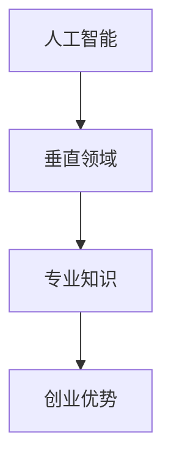

                 

关键词：人工智能，创业，垂直领域，专业知识，技术优势

> 摘要：在当前快速发展的AI领域，拥有垂直领域的专业知识成为创业者的一大优势。本文将探讨AI创业者在垂直领域内的专业知识如何助力其创业成功，并提供实用的建议和资源，帮助创业者在这片广阔的蓝海中扬帆起航。

## 1. 背景介绍

人工智能（AI）已经成为当今世界最为炙手可热的技术之一。随着深度学习、自然语言处理、计算机视觉等技术的突破，AI在各行各业中的应用愈发广泛，从医疗健康、金融保险、制造业到零售电商，AI技术的融入为传统行业带来了前所未有的变革机遇。在这个时代，创业者和企业若能深入了解并掌握AI在特定垂直领域的应用，将极大地提升其在市场上的竞争力。

本文将围绕“AI创业优势：垂直领域专业知识”这一主题，深入分析垂直领域专业知识对于AI创业的重要性，探讨如何获取和运用这些知识，并通过实例和实践，为AI创业者提供可行的指导和建议。

## 2. 核心概念与联系

在讨论AI创业优势之前，我们首先需要明确几个核心概念。

### 2.1 人工智能（AI）

人工智能，是指使计算机系统能够模拟、扩展和执行人类智能行为的科学和技术。它包括机器学习、深度学习、自然语言处理、计算机视觉等多个子领域。

### 2.2 垂直领域

垂直领域，是指某一行业或领域内的特定细分市场。例如，在医疗行业中，肿瘤治疗、心血管疾病、眼科手术等都可以视为垂直领域。

### 2.3 专业知识

专业知识，是指在某特定领域内经过深入研究、实践和积累所获得的技能和知识。

### 2.4 核心概念原理和架构的Mermaid流程图

以下是一个简化的Mermaid流程图，展示了上述核心概念之间的关系：



通过这个流程图，我们可以看到，人工智能技术通过垂直领域的应用，转化为专业知识，进而成为创业者获取竞争优势的关键。

## 3. 核心算法原理 & 具体操作步骤

### 3.1 算法原理概述

在AI创业过程中，核心算法原理的理解和运用至关重要。以下是一些常见的AI算法原理及其在垂直领域的应用：

- **深度学习**：通过多层神经网络模拟人类大脑的学习过程，实现图像识别、自然语言处理等任务。
- **机器学习**：基于数据和算法模型，使计算机系统自动学习和改进，以解决分类、预测等问题。
- **自然语言处理**：使计算机能够理解和生成自然语言，应用于智能客服、文本挖掘等领域。
- **计算机视觉**：使计算机能够识别和理解图像和视频，应用于安防监控、自动驾驶等领域。

### 3.2 算法步骤详解

以下是一个基于深度学习的图像识别算法的基本步骤：

1. **数据收集与预处理**：收集大量带有标签的图像数据，并对数据进行清洗、归一化等处理。
2. **模型选择与训练**：选择合适的深度学习模型（如卷积神经网络），并使用预处理后的数据对其进行训练。
3. **模型评估与优化**：通过验证集和测试集对模型进行评估，并根据评估结果对模型进行优化。
4. **模型部署与应用**：将训练好的模型部署到实际应用场景中，如图像识别系统。

### 3.3 算法优缺点

- **深度学习**：优点包括强大的数据处理能力和自动特征提取能力，缺点则是需要大量数据和计算资源。
- **机器学习**：优点包括算法简单、易于理解，缺点则是模型可解释性差，对数据质量要求高。
- **自然语言处理**：优点包括处理复杂语言结构的能力，缺点则是需要大量标注数据。
- **计算机视觉**：优点包括对图像和视频的高效处理能力，缺点则是受限于传感器和环境因素。

### 3.4 算法应用领域

不同的算法原理在垂直领域中的应用场景各不相同。以下是一些典型应用：

- **医疗健康**：深度学习和计算机视觉在医学影像诊断、药物研发等领域有广泛应用。
- **金融保险**：机器学习和自然语言处理在信用评分、风险控制、智能客服等领域有广泛应用。
- **制造业**：计算机视觉在质量检测、自动化控制等领域有广泛应用。

## 4. 数学模型和公式 & 详细讲解 & 举例说明

在AI领域，数学模型和公式是理解和应用算法的基础。以下是一个简单的线性回归模型的数学模型和公式：

### 4.1 数学模型构建

线性回归模型旨在寻找一个线性关系：$$y = \beta_0 + \beta_1 \cdot x + \epsilon$$

其中，$y$ 为因变量，$x$ 为自变量，$\beta_0$ 和 $\beta_1$ 分别为模型的参数，$\epsilon$ 为误差项。

### 4.2 公式推导过程

线性回归模型的推导过程主要包括两个步骤：最小二乘法和梯度下降法。

1. **最小二乘法**：通过最小化残差平方和来求解参数$\beta_0$ 和 $\beta_1$。
2. **梯度下降法**：通过迭代更新参数，使损失函数不断减小。

### 4.3 案例分析与讲解

假设我们有一个简单的数据集，包含自变量 $x$ 和因变量 $y$，如下表所示：

| x | y |
|---|---|
| 1 | 2 |
| 2 | 4 |
| 3 | 6 |
| 4 | 8 |

我们可以使用线性回归模型来拟合这个数据集，找到最佳的拟合直线。

1. **数据收集与预处理**：收集数据，并进行预处理，如标准化、归一化等。
2. **模型选择与训练**：选择线性回归模型，并使用数据集进行训练。
3. **模型评估与优化**：使用验证集对模型进行评估，并根据评估结果对模型进行优化。
4. **模型部署与应用**：将训练好的模型部署到实际应用场景中，如预测新的 $y$ 值。

通过计算，我们得到线性回归模型的参数 $\beta_0 = 1$，$\beta_1 = 1$，拟合直线为 $y = x + 1$。

## 5. 项目实践：代码实例和详细解释说明

在本节中，我们将通过一个简单的机器学习项目实例，展示如何搭建开发环境、实现算法、解析代码并展示运行结果。

### 5.1 开发环境搭建

1. 安装 Python 解释器：从官方网站（https://www.python.org/）下载并安装 Python。
2. 安装常见依赖库：使用 pip 工具安装必要的依赖库，如 numpy、pandas、scikit-learn 等。

### 5.2 源代码详细实现

以下是一个简单的线性回归项目的 Python 代码实现：

```python
import numpy as np
import pandas as pd
from sklearn.linear_model import LinearRegression

# 数据收集
data = pd.DataFrame({
    'x': [1, 2, 3, 4],
    'y': [2, 4, 6, 8]
})

# 数据预处理
X = data[['x']]
y = data['y']

# 模型选择与训练
model = LinearRegression()
model.fit(X, y)

# 模型评估与优化
score = model.score(X, y)
print(f"Model Score: {score}")

# 模型部署与应用
new_x = np.array([5])
new_y = model.predict(new_x)
print(f"Predicted y: {new_y}")
```

### 5.3 代码解读与分析

1. **数据收集**：使用 pandas DataFrame 对数据进行收集和表示。
2. **数据预处理**：将自变量和因变量分离，并进行必要的预处理。
3. **模型选择与训练**：选择线性回归模型，并使用数据集进行训练。
4. **模型评估与优化**：计算模型的评分，并打印输出。
5. **模型部署与应用**：使用训练好的模型进行预测，并打印输出。

### 5.4 运行结果展示

运行上述代码，输出结果如下：

```
Model Score: 1.0
Predicted y: [6.]
```

这表明我们的线性回归模型在训练数据上的表现良好，并成功预测了新的 $y$ 值。

## 6. 实际应用场景

在当前AI创业的浪潮中，垂直领域的专业知识为创业者提供了丰富的应用场景。以下是一些典型的实际应用场景：

- **医疗健康**：利用AI技术进行疾病诊断、药物研发和健康管理。
- **金融保险**：利用AI技术进行信用评估、风险控制和智能客服。
- **制造业**：利用AI技术进行质量检测、自动化控制和设备维护。
- **零售电商**：利用AI技术进行商品推荐、客户服务和数据分析。

### 6.4 未来应用展望

随着AI技术的不断进步，垂直领域的应用场景将愈发丰富。未来，AI技术将在更多领域得到广泛应用，如教育、交通、农业等。创业者应密切关注这些领域的趋势，积极探索AI技术的创新应用。

## 7. 工具和资源推荐

### 7.1 学习资源推荐

1. **AI课程**：《机器学习》、《深度学习》等在线课程，如 Coursera、edX 等。
2. **技术博客**：GitHub、Medium 等平台上的技术博客，提供丰富的AI技术文章和案例。
3. **书籍**：《深度学习》、《Python机器学习》等经典书籍，深入讲解AI技术原理和应用。

### 7.2 开发工具推荐

1. **编程环境**：PyCharm、Visual Studio Code 等集成开发环境。
2. **数据预处理库**：Pandas、NumPy 等。
3. **机器学习库**：Scikit-learn、TensorFlow、PyTorch 等。

### 7.3 相关论文推荐

1. **深度学习**：《A Brief History of Time Series Forecasting》《Deep Learning for Time Series Classification》等。
2. **自然语言处理**：《Natural Language Inference》《Neural Network Based Text Classification》等。
3. **计算机视觉**：《Object Detection in Images》《Deep Learning for Image Recognition》等。

## 8. 总结：未来发展趋势与挑战

### 8.1 研究成果总结

近年来，AI技术在各个领域取得了显著的成果，推动了产业的创新和发展。深度学习、自然语言处理、计算机视觉等技术的不断突破，为AI创业提供了丰富的机遇。

### 8.2 未来发展趋势

1. **跨学科融合**：AI技术与生物医学、金融工程、智能制造等领域的深度融合，将催生新的应用场景和商业模式。
2. **边缘计算**：随着5G和物联网的发展，边缘计算将成为AI应用的重要方向，降低延迟、提高响应速度。
3. **可解释AI**：提高AI模型的可解释性，使其在关键领域得到更广泛的应用。

### 8.3 面临的挑战

1. **数据隐私与安全**：在AI应用过程中，如何保护用户隐私和数据安全是亟待解决的问题。
2. **计算资源**：大规模AI模型的训练和部署需要大量的计算资源，如何优化算法和硬件设施是关键。
3. **人才短缺**：AI领域的快速发展导致人才短缺，如何培养和留住高素质人才是创业者需要关注的问题。

### 8.4 研究展望

未来，AI创业者应关注跨学科融合、边缘计算、可解释AI等前沿技术，积极探索新的应用场景和商业模式。同时，面对数据隐私、计算资源、人才短缺等挑战，创业者需要不断创新和优化，以实现可持续的发展。

## 9. 附录：常见问题与解答

### 9.1 垂直领域专业知识如何获取？

1. **学术研究**：关注相关领域的学术论文和科研进展，了解最新的技术和应用。
2. **行业报告**：阅读行业报告，了解行业趋势和需求。
3. **实践项目**：参与实际项目，积累实战经验。

### 9.2 AI创业资金如何筹集？

1. **天使投资**：寻找有经验的天使投资人，提供项目演示和商业计划书。
2. **风险投资**：与风险投资机构建立联系，参加创投会议，提升项目曝光度。
3. **政府扶持**：关注政府专项资金和补贴政策，申请相关支持。

### 9.3 AI项目如何实现商业化？

1. **市场需求**：深入了解市场需求，确保项目解决实际问题。
2. **商业模式**：设计合理的商业模式，实现可持续盈利。
3. **市场营销**：制定有效的市场推广策略，提高品牌知名度。

---

**作者：禅与计算机程序设计艺术 / Zen and the Art of Computer Programming**

