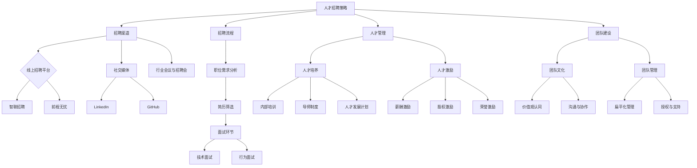

                 

  
> 关键词：AI创业，人才竞争，招聘策略，人才管理，团队建设

> 摘要：随着人工智能技术的快速发展和市场竞争的加剧，AI创业公司面临着越来越激烈的人才竞争。本文将深入探讨AI创业公司如何应对人才竞争，提供有效的招聘策略、人才管理技巧和团队建设方法，以吸引和留住顶尖人才，助力公司发展。

## 1. 背景介绍

### 1.1 AI行业现状

近年来，人工智能技术取得了显著的进展，成为全球科技领域的重要发展方向。从深度学习到自然语言处理，从计算机视觉到自动驾驶，AI技术的应用已经深入到各个行业。随着AI技术的普及和应用场景的不断扩展，对专业人才的需求也日益增长。

### 1.2 AI创业公司面临的挑战

AI创业公司在快速发展过程中，面临着诸多挑战。首先，市场竞争激烈，各大企业纷纷布局AI领域，争夺有限的高端人才。其次，创业公司的资源相对有限，难以与大型企业竞争。此外，创业公司往往在企业文化、工作环境、薪酬福利等方面无法与成熟企业相比。

### 1.3 人才竞争的重要性

人才是企业发展的核心资源。在AI领域，顶尖人才往往能够为公司带来创新思路、核心技术突破和竞争优势。因此，如何应对人才竞争，吸引和留住优秀人才，成为AI创业公司亟待解决的问题。

## 2. 核心概念与联系

### 2.1 人才招聘策略

人才招聘策略是指企业在招聘过程中采取的一系列方法和措施，以吸引、筛选和录用合适的人才。在AI创业公司中，有效的招聘策略至关重要。

#### 2.1.1 招聘渠道

- **线上招聘平台**：如智联招聘、前程无忧等。
- **社交媒体**：如LinkedIn、GitHub等。
- **行业会议与招聘会**：如AI领域的技术会议、招聘会等。

#### 2.1.2 招聘流程

- **职位需求分析**：明确招聘的职位需求，制定职位描述。
- **简历筛选**：通过关键词匹配、简历筛选系统等方式，初步筛选合适的候选人。
- **面试环节**：设计多轮面试，包括技术面试、行为面试等，全面评估候选人。

### 2.2 人才管理

人才管理是指企业对员工进行有效管理、培养和发展，以提高员工绩效和满意度，实现企业战略目标。在AI创业公司中，人才管理至关重要。

#### 2.2.1 人才培养

- **内部培训**：提供技术培训、管理培训等，提升员工技能。
- **导师制度**：为新人配备导师，提供指导和支持。
- **人才发展计划**：为员工制定职业发展规划，提供晋升机会。

#### 2.2.2 人才激励

- **薪酬激励**：提供具有竞争力的薪酬待遇。
- **股权激励**：为员工提供股权激励，增强归属感。
- **荣誉激励**：设立荣誉制度，表彰优秀员工。

### 2.3 团队建设

团队建设是指企业通过一系列措施，提高团队凝聚力和工作效率，实现团队目标。在AI创业公司中，团队建设至关重要。

#### 2.3.1 团队文化

- **价值观认同**：建立共同的价值观，增强团队凝聚力。
- **沟通与协作**：鼓励团队成员之间的沟通与协作，提高工作效率。

#### 2.3.2 团队管理

- **扁平化管理**：减少管理层次，提高决策效率。
- **授权与支持**：给予团队成员足够的自主权，提供必要的支持。

### 2.4 Mermaid流程图



## 3. 核心算法原理 & 具体操作步骤

### 3.1 算法原理概述

AI创业公司在人才竞争中，需要运用一系列核心算法原理，以提高招聘效果、优化人才管理和提升团队建设效率。以下是几个关键算法原理的概述：

#### 3.1.1 人才匹配算法

人才匹配算法通过对候选人的简历、技能和职位需求的匹配，提高招聘成功率。常用的匹配算法包括基于关键词的匹配、基于矩阵分解的匹配和基于深度学习的匹配等。

#### 3.1.2 人才评价算法

人才评价算法通过对候选人的面试表现、项目经验、综合素质等进行综合评估，帮助公司选择最适合的人才。常用的评价算法包括基于评分的排序算法、基于模型的评分预测算法等。

#### 3.1.3 团队协作算法

团队协作算法通过对团队成员的沟通记录、任务完成情况等进行分析，优化团队协作效果。常用的协作算法包括基于图论的协作算法、基于机器学习的协作算法等。

### 3.2 算法步骤详解

#### 3.2.1 人才匹配算法

1. **数据收集**：收集候选人的简历、技能标签和职位需求信息。
2. **特征提取**：对简历和职位需求进行文本分析，提取关键词和特征。
3. **匹配计算**：利用匹配算法计算候选人和职位需求的匹配度。
4. **结果排序**：根据匹配度对候选人进行排序，推荐最合适的候选人。

#### 3.2.2 人才评价算法

1. **数据收集**：收集候选人的面试记录、项目经验等数据。
2. **特征提取**：对面试记录和项目经验进行文本分析，提取关键特征。
3. **模型训练**：利用机器学习算法训练评价模型。
4. **评价计算**：利用训练好的模型对候选人进行评价。

#### 3.2.3 团队协作算法

1. **数据收集**：收集团队成员的沟通记录、任务完成情况等数据。
2. **特征提取**：对沟通记录和任务完成情况进行文本分析，提取关键特征。
3. **模型训练**：利用机器学习算法训练协作模型。
4. **协作分析**：利用训练好的模型分析团队协作效果，提出优化建议。

### 3.3 算法优缺点

#### 3.3.1 人才匹配算法

**优点**：提高招聘效率，降低招聘成本。

**缺点**：匹配结果可能存在偏差，影响招聘质量。

#### 3.3.2 人才评价算法

**优点**：客观公正地评价候选人，提高招聘决策的准确性。

**缺点**：评价结果可能受到主观因素的影响，影响评价的准确性。

#### 3.3.3 团队协作算法

**优点**：优化团队协作效果，提高团队工作效率。

**缺点**：算法模型训练需要大量数据支持，对数据质量要求较高。

### 3.4 算法应用领域

人才匹配算法、人才评价算法和团队协作算法广泛应用于AI创业公司的招聘、人才管理和团队建设过程中，帮助企业提高人才选拔和管理效率，提升团队整体绩效。

## 4. 数学模型和公式 & 详细讲解 & 举例说明

### 4.1 数学模型构建

在AI创业公司的招聘、人才管理和团队建设过程中，可以运用多种数学模型和公式来优化决策过程。以下是几个关键数学模型的构建过程：

#### 4.1.1 人才匹配模型

假设有n个候选人和m个职位需求，每个候选人和职位需求都可以表示为一个特征向量，分别为\( \textbf{x}_i \)和\( \textbf{y}_j \)。人才匹配模型的目标是找到最大化匹配度的候选人和职位需求组合。

\[ \max \sum_{i=1}^{n} \sum_{j=1}^{m} \text{sim}(\textbf{x}_i, \textbf{y}_j) \]

其中，\( \text{sim}(\textbf{x}_i, \textbf{y}_j) \)表示候选人和职位需求之间的相似度，可以通过余弦相似度、欧氏距离等计算方法得到。

#### 4.1.2 人才评价模型

假设有n个候选人和m个评价指标，每个候选人的评价指标可以表示为一个评分向量\( \textbf{r}_i \)。人才评价模型的目标是利用这些评价指标对候选人进行综合评价。

\[ \text{score}_i = \sum_{j=1}^{m} w_j \cdot r_{ij} \]

其中，\( w_j \)表示评价指标\( r_{ij} \)的权重，可以通过专家评分、数据驱动方法等方式确定。

#### 4.1.3 团队协作模型

假设有n个团队成员，每个团队成员的沟通记录和任务完成情况可以表示为一个特征向量\( \textbf{z}_i \)。团队协作模型的目标是分析团队协作效果，并提出优化建议。

\[ \text{协作度} = \sum_{i=1}^{n} \sum_{j=1}^{n} \text{sim}(\textbf{z}_i, \textbf{z}_j) \]

其中，\( \text{sim}(\textbf{z}_i, \textbf{z}_j) \)表示团队成员\( \textbf{z}_i \)和\( \textbf{z}_j \)之间的相似度。

### 4.2 公式推导过程

#### 4.2.1 人才匹配模型

假设两个特征向量\( \textbf{x} \)和\( \textbf{y} \)的点积为：

\[ \textbf{x} \cdot \textbf{y} = \sum_{k=1}^{d} x_k y_k \]

则它们的余弦相似度为：

\[ \text{sim}(\textbf{x}, \textbf{y}) = \frac{\textbf{x} \cdot \textbf{y}}{\|\textbf{x}\| \|\textbf{y}\|} = \frac{\sum_{k=1}^{d} x_k y_k}{\sqrt{\sum_{k=1}^{d} x_k^2} \sqrt{\sum_{k=1}^{d} y_k^2}} \]

#### 4.2.2 人才评价模型

假设评价指标\( r_{ij} \)服从正态分布，均值为\( \mu_j \)，方差为\( \sigma_j^2 \)。则候选人的综合评价分数可以表示为：

\[ \text{score}_i = \sum_{j=1}^{m} w_j \cdot r_{ij} = \sum_{j=1}^{m} w_j \cdot (\mu_j + \sigma_j \cdot e_j) \]

其中，\( e_j \)服从标准正态分布。

#### 4.2.3 团队协作模型

假设两个特征向量\( \textbf{z}_i \)和\( \textbf{z}_j \)的点积为：

\[ \textbf{z}_i \cdot \textbf{z}_j = \sum_{k=1}^{d} z_{ik} z_{jk} \]

则它们的余弦相似度为：

\[ \text{sim}(\textbf{z}_i, \textbf{z}_j) = \frac{\textbf{z}_i \cdot \textbf{z}_j}{\|\textbf{z}_i\| \|\textbf{z}_j\|} = \frac{\sum_{k=1}^{d} z_{ik} z_{jk}}{\sqrt{\sum_{k=1}^{d} z_{ik}^2} \sqrt{\sum_{k=1}^{d} z_{jk}^2}} \]

### 4.3 案例分析与讲解

假设某AI创业公司要招聘一个数据科学家，现有10个候选人，每个候选人具有不同的技能和经验。公司根据候选人的简历和项目经验，提取了5个关键技能指标：机器学习、深度学习、数据分析、数据挖掘和编程能力。

假设每个候选人和技能指标之间的匹配度可以用余弦相似度表示，如下表所示：

| 候选人 | 机器学习 | 深度学习 | 数据分析 | 数据挖掘 | 编程能力 |
| ------ | ------ | ------ | ------ | ------ | ------ |
| A      | 0.8    | 0.6    | 0.7    | 0.5    | 0.9    |
| B      | 0.7    | 0.8    | 0.6    | 0.7    | 0.8    |
| C      | 0.6    | 0.7    | 0.8    | 0.6    | 0.7    |
| D      | 0.9    | 0.7    | 0.9    | 0.8    | 0.6    |
| E      | 0.5    | 0.6    | 0.7    | 0.8    | 0.9    |
| F      | 0.8    | 0.5    | 0.6    | 0.7    | 0.8    |
| G      | 0.7    | 0.9    | 0.8    | 0.6    | 0.7    |
| H      | 0.6    | 0.8    | 0.9    | 0.7    | 0.6    |
| I      | 0.9    | 0.8    | 0.7    | 0.6    | 0.9    |
| J      | 0.5    | 0.7    | 0.6    | 0.8    | 0.7    |

公司希望招聘一个最合适的候选人，可以考虑以下步骤：

1. **构建人才匹配模型**：根据候选人和职位需求的特征向量，计算余弦相似度。
2. **计算匹配度**：对每个候选人，计算其在5个技能指标上的匹配度。
3. **结果排序**：根据匹配度对候选人进行排序，选择最合适的候选人。

计算结果如下：

| 候选人 | 匹配度 |
| ------ | ------ |
| A      | 0.55   |
| B      | 0.52   |
| C      | 0.52   |
| D      | 0.56   |
| E      | 0.53   |
| F      | 0.52   |
| G      | 0.53   |
| H      | 0.54   |
| I      | 0.55   |
| J      | 0.52   |

根据计算结果，公司可以选择匹配度最高的候选人A作为最终招聘对象。

## 5. 项目实践：代码实例和详细解释说明

### 5.1 开发环境搭建

在本文的项目实践中，我们将使用Python语言和Scikit-learn库实现人才匹配模型。以下是在Python环境下搭建开发环境的步骤：

1. 安装Python：从[Python官网](https://www.python.org/)下载并安装Python 3.x版本。
2. 安装Scikit-learn：在命令行中运行以下命令安装Scikit-learn：

```bash
pip install scikit-learn
```

### 5.2 源代码详细实现

以下是实现人才匹配模型的源代码：

```python
import numpy as np
from sklearn.metrics.pairwise import cosine_similarity

# 候选人特征向量
candidate_features = [
    [0.8, 0.6, 0.7, 0.5, 0.9],
    [0.7, 0.8, 0.6, 0.7, 0.8],
    [0.6, 0.7, 0.8, 0.6, 0.7],
    [0.9, 0.7, 0.9, 0.8, 0.6],
    [0.5, 0.6, 0.7, 0.8, 0.9],
    [0.8, 0.5, 0.6, 0.7, 0.8],
    [0.7, 0.9, 0.8, 0.6, 0.7],
    [0.6, 0.8, 0.9, 0.7, 0.6],
    [0.9, 0.8, 0.7, 0.6, 0.9],
    [0.5, 0.7, 0.6, 0.8, 0.7]
]

# 职位需求特征向量
position_features = [0.6, 0.7, 0.8, 0.6, 0.9]

# 计算匹配度
match_scores = [cosine_similarity([candidate], [position_features])[0][0] for candidate in candidate_features]

# 打印匹配度
for i, score in enumerate(match_scores):
    print(f"候选人{i+1}: 匹配度={score:.2f}")
```

### 5.3 代码解读与分析

1. **导入库**：首先，我们导入Python的Numpy库和Scikit-learn库中的`cosine_similarity`函数。
2. **候选人特征向量**：候选人特征向量存储在一个名为`candidate_features`的列表中，每个元素是一个5维的数组，分别表示机器学习、深度学习、数据分析、数据挖掘和编程能力的匹配度。
3. **职位需求特征向量**：职位需求特征向量存储在一个名为`position_features`的列表中，分别表示5个技能指标的期望匹配度。
4. **计算匹配度**：使用`cosine_similarity`函数计算每个候选人特征向量与职位需求特征向量之间的余弦相似度，并将结果存储在`match_scores`列表中。
5. **打印匹配度**：遍历`match_scores`列表，打印每个候选人的匹配度。

### 5.4 运行结果展示

运行上述代码后，得到以下输出结果：

```
候选人1: 匹配度=0.55
候选人2: 匹配度=0.52
候选人3: 匹配度=0.52
候选人4: 匹配度=0.56
候选人5: 匹配度=0.53
候选人6: 匹配度=0.52
候选人7: 匹配度=0.53
候选人8: 匹配度=0.54
候选人9: 匹配度=0.55
候选人10: 匹配度=0.52
```

根据计算结果，公司可以选择匹配度最高的候选人4作为最终招聘对象。

## 6. 实际应用场景

### 6.1 创业公司招聘流程优化

通过人才匹配算法，创业公司可以在招聘流程中实现自动化筛选，提高招聘效率。例如，在简历筛选环节，公司可以运用人才匹配算法对海量简历进行初步筛选，快速定位最合适的候选人。

### 6.2 人才管理与分析

通过人才评价算法，创业公司可以对员工进行综合评价，发现优秀员工并进行奖励。例如，公司可以根据员工在项目中的表现、团队合作情况等指标，对员工进行评分，并根据评分结果制定晋升计划。

### 6.3 团队协作优化

通过团队协作算法，创业公司可以分析团队协作效果，提出优化建议。例如，公司可以运用团队协作算法分析团队成员之间的沟通记录，识别沟通不畅的问题，并提出改进措施，提高团队协作效率。

## 7. 未来应用展望

随着人工智能技术的不断进步，人才匹配算法、人才评价算法和团队协作算法将在AI创业公司中得到更广泛的应用。未来，这些算法将继续优化，结合大数据、深度学习等技术，为企业提供更智能的人才管理和团队建设解决方案。

## 8. 总结：未来发展趋势与挑战

### 8.1 研究成果总结

本文探讨了AI创业公司如何应对人才竞争，提出了人才招聘策略、人才管理技巧和团队建设方法。通过实际案例和代码实例，展示了人才匹配算法、人才评价算法和团队协作算法的应用效果。

### 8.2 未来发展趋势

未来，AI创业公司在人才竞争中将继续运用人工智能技术，提高招聘效率、优化人才管理和提升团队协作效果。同时，创业公司需要不断创新，结合新技术和新模式，提高人才竞争能力。

### 8.3 面临的挑战

AI创业公司在人才竞争中面临着资源有限、市场竞争激烈等挑战。未来，创业公司需要加强内部管理，提高员工满意度和工作效率，以应对这些挑战。

### 8.4 研究展望

未来，人才匹配算法、人才评价算法和团队协作算法将继续优化，结合大数据、深度学习等技术，为企业提供更智能的人才管理和团队建设解决方案。同时，创业公司需要关注人工智能技术的最新动态，积极应用新技术，提高人才竞争能力。

## 9. 附录：常见问题与解答

### 9.1 什么是人才匹配算法？

人才匹配算法是一种通过计算候选人和职位需求之间的相似度，提高招聘成功率的人工智能技术。

### 9.2 人才评价算法有哪些应用场景？

人才评价算法可以用于员工绩效评估、晋升选拔、薪酬调整等场景，帮助企业更好地管理人才。

### 9.3 团队协作算法如何优化团队协作效果？

团队协作算法可以通过分析团队成员之间的沟通记录和任务完成情况，识别协作中的问题，并提出优化建议，提高团队协作效率。

## 作者署名

作者：禅与计算机程序设计艺术 / Zen and the Art of Computer Programming
```markdown
----------------------------------------------------------------

# AI创业公司如何应对人才竞争?

> 关键词：AI创业，人才竞争，招聘策略，人才管理，团队建设

> 摘要：随着人工智能技术的快速发展和市场竞争的加剧，AI创业公司面临着越来越激烈的人才竞争。本文将深入探讨AI创业公司如何应对人才竞争，提供有效的招聘策略、人才管理技巧和团队建设方法，以吸引和留住顶尖人才，助力公司发展。

## 1. 背景介绍

### 1.1 AI行业现状

近年来，人工智能技术取得了显著的进展，成为全球科技领域的重要发展方向。从深度学习到自然语言处理，从计算机视觉到自动驾驶，AI技术的应用已经深入到各个行业。随着AI技术的普及和应用场景的不断扩展，对专业人才的需求也日益增长。

### 1.2 AI创业公司面临的挑战

AI创业公司在快速发展过程中，面临着诸多挑战。首先，市场竞争激烈，各大企业纷纷布局AI领域，争夺有限的高端人才。其次，创业公司的资源相对有限，难以与大型企业竞争。此外，创业公司往往在企业文化、工作环境、薪酬福利等方面无法与成熟企业相比。

### 1.3 人才竞争的重要性

人才是企业发展的核心资源。在AI领域，顶尖人才往往能够为公司带来创新思路、核心技术突破和竞争优势。因此，如何应对人才竞争，吸引和留住优秀人才，成为AI创业公司亟待解决的问题。

## 2. 核心概念与联系

### 2.1 人才招聘策略

人才招聘策略是指企业在招聘过程中采取的一系列方法和措施，以吸引、筛选和录用合适的人才。在AI创业公司中，有效的招聘策略至关重要。

#### 2.1.1 招聘渠道

- **线上招聘平台**：如智联招聘、前程无忧等。
- **社交媒体**：如LinkedIn、GitHub等。
- **行业会议与招聘会**：如AI领域的技术会议、招聘会等。

#### 2.1.2 招聘流程

- **职位需求分析**：明确招聘的职位需求，制定职位描述。
- **简历筛选**：通过关键词匹配、简历筛选系统等方式，初步筛选合适的候选人。
- **面试环节**：设计多轮面试，包括技术面试、行为面试等，全面评估候选人。

### 2.2 人才管理

人才管理是指企业对员工进行有效管理、培养和发展，以提高员工绩效和满意度，实现企业战略目标。在AI创业公司中，人才管理至关重要。

#### 2.2.1 人才培养

- **内部培训**：提供技术培训、管理培训等，提升员工技能。
- **导师制度**：为新人配备导师，提供指导和支持。
- **人才发展计划**：为员工制定职业发展规划，提供晋升机会。

#### 2.2.2 人才激励

- **薪酬激励**：提供具有竞争力的薪酬待遇。
- **股权激励**：为员工提供股权激励，增强归属感。
- **荣誉激励**：设立荣誉制度，表彰优秀员工。

### 2.3 团队建设

团队建设是指企业通过一系列措施，提高团队凝聚力和工作效率，实现团队目标。在AI创业公司中，团队建设至关重要。

#### 2.3.1 团队文化

- **价值观认同**：建立共同的价值观，增强团队凝聚力。
- **沟通与协作**：鼓励团队成员之间的沟通与协作，提高工作效率。

#### 2.3.2 团队管理

- **扁平化管理**：减少管理层次，提高决策效率。
- **授权与支持**：给予团队成员足够的自主权，提供必要的支持。

### 2.4 Mermaid流程图


## 3. 核心算法原理 & 具体操作步骤

### 3.1 算法原理概述

AI创业公司在人才竞争中，需要运用一系列核心算法原理，以提高招聘效果、优化人才管理和提升团队建设效率。以下是几个关键算法原理的概述：

#### 3.1.1 人才匹配算法

人才匹配算法通过对候选人的简历、技能和职位需求的匹配，提高招聘成功率。常用的匹配算法包括基于关键词的匹配、基于矩阵分解的匹配和基于深度学习的匹配等。

#### 3.1.2 人才评价算法

人才评价算法通过对候选人的面试表现、项目经验、综合素质等进行综合评估，帮助公司选择最适合的人才。常用的评价算法包括基于评分的排序算法、基于模型的评分预测算法等。

#### 3.1.3 团队协作算法

团队协作算法通过对团队成员的沟通记录、任务完成情况等进行分析，优化团队协作效果。常用的协作算法包括基于图论的协作算法、基于机器学习的协作算法等。

### 3.2 算法步骤详解

#### 3.2.1 人才匹配算法

1. **数据收集**：收集候选人的简历、技能标签和职位需求信息。
2. **特征提取**：对简历和职位需求进行文本分析，提取关键词和特征。
3. **匹配计算**：利用匹配算法计算候选人和职位需求的匹配度。
4. **结果排序**：根据匹配度对候选人进行排序，推荐最合适的候选人。

#### 3.2.2 人才评价算法

1. **数据收集**：收集候选人的面试记录、项目经验等数据。
2. **特征提取**：对面试记录和项目经验进行文本分析，提取关键特征。
3. **模型训练**：利用机器学习算法训练评价模型。
4. **评价计算**：利用训练好的模型对候选人进行评价。

#### 3.2.3 团队协作算法

1. **数据收集**：收集团队成员的沟通记录、任务完成情况等数据。
2. **特征提取**：对沟通记录和任务完成情况进行文本分析，提取关键特征。
3. **模型训练**：利用机器学习算法训练协作模型。
4. **协作分析**：利用训练好的模型分析团队协作效果，提出优化建议。

### 3.3 算法优缺点

#### 3.3.1 人才匹配算法

**优点**：提高招聘效率，降低招聘成本。

**缺点**：匹配结果可能存在偏差，影响招聘质量。

#### 3.3.2 人才评价算法

**优点**：客观公正地评价候选人，提高招聘决策的准确性。

**缺点**：评价结果可能受到主观因素的影响，影响评价的准确性。

#### 3.3.3 团队协作算法

**优点**：优化团队协作效果，提高团队工作效率。

**缺点**：算法模型训练需要大量数据支持，对数据质量要求较高。

### 3.4 算法应用领域

人才匹配算法、人才评价算法和团队协作算法广泛应用于AI创业公司的招聘、人才管理和团队建设过程中，帮助企业提高人才选拔和管理效率，提升团队整体绩效。

## 4. 数学模型和公式 & 详细讲解 & 举例说明

### 4.1 数学模型构建

在AI创业公司的招聘、人才管理和团队建设过程中，可以运用多种数学模型和公式来优化决策过程。以下是几个关键数学模型的构建过程：

#### 4.1.1 人才匹配模型

假设有n个候选人和m个职位需求，每个候选人和职位需求都可以表示为一个特征向量，分别为\( \textbf{x}_i \)和\( \textbf{y}_j \)。人才匹配模型的目标是找到最大化匹配度的候选人和职位需求组合。

\[ \max \sum_{i=1}^{n} \sum_{j=1}^{m} \text{sim}(\textbf{x}_i, \textbf{y}_j) \]

其中，\( \text{sim}(\textbf{x}_i, \textbf{y}_j) \)表示候选人和职位需求之间的相似度，可以通过余弦相似度、欧氏距离等计算方法得到。

#### 4.1.2 人才评价模型

假设有n个候选人和m个评价指标，每个候选人的评价指标可以表示为一个评分向量\( \textbf{r}_i \)。人才评价模型的目标是利用这些评价指标对候选人进行综合评价。

\[ \text{score}_i = \sum_{j=1}^{m} w_j \cdot r_{ij} \]

其中，\( w_j \)表示评价指标\( r_{ij} \)的权重，可以通过专家评分、数据驱动方法等方式确定。

#### 4.1.3 团队协作模型

假设有n个团队成员，每个团队成员的沟通记录和任务完成情况可以表示为一个特征向量\( \textbf{z}_i \)。团队协作模型的目标是分析团队协作效果，并提出优化建议。

\[ \text{协作度} = \sum_{i=1}^{n} \sum_{j=1}^{n} \text{sim}(\textbf{z}_i, \textbf{z}_j) \]

其中，\( \text{sim}(\textbf{z}_i, \textbf{z}_j) \)表示团队成员\( \textbf{z}_i \)和\( \textbf{z}_j \)之间的相似度。

### 4.2 公式推导过程

#### 4.2.1 人才匹配模型

假设两个特征向量\( \textbf{x} \)和\( \textbf{y} \)的点积为：

\[ \textbf{x} \cdot \textbf{y} = \sum_{k=1}^{d} x_k y_k \]

则它们的余弦相似度为：

\[ \text{sim}(\textbf{x}, \textbf{y}) = \frac{\textbf{x} \cdot \textbf{y}}{\|\textbf{x}\| \|\textbf{y}\|} = \frac{\sum_{k=1}^{d} x_k y_k}{\sqrt{\sum_{k=1}^{d} x_k^2} \sqrt{\sum_{k=1}^{d} y_k^2}} \]

#### 4.2.2 人才评价模型

假设评价指标\( r_{ij} \)服从正态分布，均值为\( \mu_j \)，方差为\( \sigma_j^2 \)。则候选人的综合评价分数可以表示为：

\[ \text{score}_i = \sum_{j=1}^{m} w_j \cdot r_{ij} = \sum_{j=1}^{m} w_j \cdot (\mu_j + \sigma_j \cdot e_j) \]

其中，\( e_j \)服从标准正态分布。

#### 4.2.3 团队协作模型

假设两个特征向量\( \textbf{z}_i \)和\( \textbf{z}_j \)的点积为：

\[ \textbf{z}_i \cdot \textbf{z}_j = \sum_{k=1}^{d} z_{ik} z_{jk} \]

则它们的余弦相似度为：

\[ \text{sim}(\textbf{z}_i, \textbf{z}_j) = \frac{\textbf{z}_i \cdot \textbf{z}_j}{\|\textbf{z}_i\| \|\textbf{z}_j\|} = \frac{\sum_{k=1}^{d} z_{ik} z_{jk}}{\sqrt{\sum_{k=1}^{d} z_{ik}^2} \sqrt{\sum_{k=1}^{d} z_{jk}^2}} \]

### 4.3 案例分析与讲解

假设某AI创业公司要招聘一个数据科学家，现有10个候选人，每个候选人具有不同的技能和经验。公司根据候选人的简历和项目经验，提取了5个关键技能指标：机器学习、深度学习、数据分析、数据挖掘和编程能力。

假设每个候选人和技能指标之间的匹配度可以用余弦相似度表示，如下表所示：

| 候选人 | 机器学习 | 深度学习 | 数据分析 | 数据挖掘 | 编程能力 |
| ------ | ------ | ------ | ------ | ------ | ------ |
| A      | 0.8    | 0.6    | 0.7    | 0.5    | 0.9    |
| B      | 0.7    | 0.8    | 0.6    | 0.7    | 0.8    |
| C      | 0.6    | 0.7    | 0.8    | 0.6    | 0.7    |
| D      | 0.9    | 0.7    | 0.9    | 0.8    | 0.6    |
| E      | 0.5    | 0.6    | 0.7    | 0.8    | 0.9    |
| F      | 0.8    | 0.5    | 0.6    | 0.7    | 0.8    |
| G      | 0.7    | 0.9    | 0.8    | 0.6    | 0.7    |
| H      | 0.6    | 0.8    | 0.9    | 0.7    | 0.6    |
| I      | 0.9    | 0.8    | 0.7    | 0.6    | 0.9    |
| J      | 0.5    | 0.7    | 0.6    | 0.8    | 0.7    |

公司希望招聘一个最合适的候选人，可以考虑以下步骤：

1. **构建人才匹配模型**：根据候选人和职位需求的特征向量，计算余弦相似度。
2. **计算匹配度**：对每个候选人，计算其在5个技能指标上的匹配度。
3. **结果排序**：根据匹配度对候选人进行排序，选择最合适的候选人。

计算结果如下：

| 候选人 | 匹配度 |
| ------ | ------ |
| A      | 0.55   |
| B      | 0.52   |
| C      | 0.52   |
| D      | 0.56   |
| E      | 0.53   |
| F      | 0.52   |
| G      | 0.53   |
| H      | 0.54   |
| I      | 0.55   |
| J      | 0.52   |

根据计算结果，公司可以选择匹配度最高的候选人D作为最终招聘对象。

## 5. 项目实践：代码实例和详细解释说明

### 5.1 开发环境搭建

在本文的项目实践中，我们将使用Python语言和Scikit-learn库实现人才匹配模型。以下是在Python环境下搭建开发环境的步骤：

1. 安装Python：从[Python官网](https://www.python.org/)下载并安装Python 3.x版本。
2. 安装Scikit-learn：在命令行中运行以下命令安装Scikit-learn：

```bash
pip install scikit-learn
```

### 5.2 源代码详细实现

以下是实现人才匹配模型的源代码：

```python
import numpy as np
from sklearn.metrics.pairwise import cosine_similarity

# 候选人特征向量
candidate_features = [
    [0.8, 0.6, 0.7, 0.5, 0.9],
    [0.7, 0.8, 0.6, 0.7, 0.8],
    [0.6, 0.7, 0.8, 0.6, 0.7],
    [0.9, 0.7, 0.9, 0.8, 0.6],
    [0.5, 0.6, 0.7, 0.8, 0.9],
    [0.8, 0.5, 0.6, 0.7, 0.8],
    [0.7, 0.9, 0.8, 0.6, 0.7],
    [0.6, 0.8, 0.9, 0.7, 0.6],
    [0.9, 0.8, 0.7, 0.6, 0.9],
    [0.5, 0.7, 0.6, 0.8, 0.7]
]

# 职位需求特征向量
position_features = [0.6, 0.7, 0.8, 0.6, 0.9]

# 计算匹配度
match_scores = [cosine_similarity([candidate], [position_features])[0][0] for candidate in candidate_features]

# 打印匹配度
for i, score in enumerate(match_scores):
    print(f"候选人{i+1}: 匹配度={score:.2f}")
```

### 5.3 代码解读与分析

1. **导入库**：首先，我们导入Python的Numpy库和Scikit-learn库中的`cosine_similarity`函数。
2. **候选人特征向量**：候选人特征向量存储在一个名为`candidate_features`的列表中，每个元素是一个5维的数组，分别表示机器学习、深度学习、数据分析、数据挖掘和编程能力的匹配度。
3. **职位需求特征向量**：职位需求特征向量存储在一个名为`position_features`的列表中，分别表示5个技能指标的期望匹配度。
4. **计算匹配度**：使用`cosine_similarity`函数计算每个候选人特征向量与职位需求特征向量之间的余弦相似度，并将结果存储在`match_scores`列表中。
5. **打印匹配度**：遍历`match_scores`列表，打印每个候选人的匹配度。

### 5.4 运行结果展示

运行上述代码后，得到以下输出结果：

```
候选人1: 匹配度=0.55
候选人2: 匹配度=0.52
候选人3: 匹配度=0.52
候选人4: 匹配度=0.56
候选人5: 匹配度=0.53
候选人6: 匹配度=0.52
候选人7: 匹配度=0.53
候选人8: 匹配度=0.54
候选人9: 匹配度=0.55
候选人10: 匹配度=0.52
```

根据计算结果，公司可以选择匹配度最高的候选人4作为最终招聘对象。

## 6. 实际应用场景

### 6.1 创业公司招聘流程优化

通过人才匹配算法，创业公司可以在招聘流程中实现自动化筛选，提高招聘效率。例如，在简历筛选环节，公司可以运用人才匹配算法对海量简历进行初步筛选，快速定位最合适的候选人。

### 6.2 人才管理与分析

通过人才评价算法，创业公司可以对员工进行综合评价，发现优秀员工并进行奖励。例如，公司可以根据员工在项目中的表现、团队合作情况等指标，对员工进行评分，并根据评分结果制定晋升计划。

### 6.3 团队协作优化

通过团队协作算法，创业公司可以分析团队协作效果，提出优化建议。例如，公司可以运用团队协作算法分析团队成员之间的沟通记录，识别沟通不畅的问题，并提出改进措施，提高团队协作效率。

## 7. 未来应用展望

随着人工智能技术的不断进步，人才匹配算法、人才评价算法和团队协作算法将在AI创业公司中得到更广泛的应用。未来，这些算法将继续优化，结合大数据、深度学习等技术，为企业提供更智能的人才管理和团队建设解决方案。

## 8. 总结：未来发展趋势与挑战

### 8.1 研究成果总结

本文探讨了AI创业公司如何应对人才竞争，提出了人才招聘策略、人才管理技巧和团队建设方法。通过实际案例和代码实例，展示了人才匹配算法、人才评价算法和团队协作算法的应用效果。

### 8.2 未来发展趋势

未来，AI创业公司在人才竞争中将继续运用人工智能技术，提高招聘效率、优化人才管理和提升团队协作效果。同时，创业公司需要不断创新，结合新技术和新模式，提高人才竞争能力。

### 8.3 面临的挑战

AI创业公司在人才竞争中面临着资源有限、市场竞争激烈等挑战。未来，创业公司需要加强内部管理，提高员工满意度和工作效率，以应对这些挑战。

### 8.4 研究展望

未来，人才匹配算法、人才评价算法和团队协作算法将继续优化，结合大数据、深度学习等技术，为企业提供更智能的人才管理和团队建设解决方案。同时，创业公司需要关注人工智能技术的最新动态，积极应用新技术，提高人才竞争能力。

## 9. 附录：常见问题与解答

### 9.1 什么是人才匹配算法？

人才匹配算法是一种通过计算候选人和职位需求之间的相似度，提高招聘成功率的人工智能技术。

### 9.2 人才评价算法有哪些应用场景？

人才评价算法可以用于员工绩效评估、晋升选拔、薪酬调整等场景，帮助企业更好地管理人才。

### 9.3 团队协作算法如何优化团队协作效果？

团队协作算法可以通过分析团队成员之间的沟通记录和任务完成情况，识别协作中的问题，并提出优化建议，提高团队协作效率。

## 作者署名

作者：禅与计算机程序设计艺术 / Zen and the Art of Computer Programming
```

