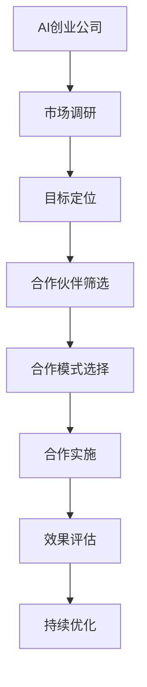

                 

 在当今快速发展的技术环境中，AI创业公司面临着前所未有的机遇和挑战。商业伙伴合作已成为AI创业公司成功的关键因素之一。本文旨在探讨AI创业公司如何有效地进行商业伙伴合作，以实现共同的增长和成功。

> 关键词：AI创业公司、商业伙伴合作、战略联盟、生态系统、资源共享

> 摘要：本文首先介绍了AI创业公司的背景和特点，然后深入分析了商业伙伴合作的重要性。接着，文章提出了AI创业公司在选择合作伙伴时的关键因素，并详细阐述了合作模式的多样性和实施策略。最后，文章展望了AI创业公司商业伙伴合作的未来发展趋势。

## 1. 背景介绍

随着人工智能技术的飞速发展，AI创业公司如雨后春笋般涌现。这些公司通常以技术创新为核心，专注于开发新的AI算法、应用和解决方案。与传统的创业公司相比，AI创业公司具有以下特点：

1. **高度依赖技术创新**：AI创业公司的核心竞争力在于其技术创新能力，特别是在算法研发、数据处理和模型训练等方面。
2. **快速迭代**：AI创业公司通常采用敏捷开发模式，快速迭代产品，以满足市场需求和用户反馈。
3. **数据驱动**：数据是AI创业公司的核心资产，有效的数据管理和利用对于公司的成功至关重要。
4. **跨界融合**：AI创业公司往往需要与多个行业和领域进行跨界合作，以实现技术的广泛应用和商业模式的创新。

在这样一个充满机遇和挑战的环境中，商业伙伴合作成为AI创业公司实现可持续发展的关键。通过与合适的合作伙伴建立战略联盟，AI创业公司可以实现以下目标：

1. **资源整合**：通过合作伙伴，AI创业公司可以获取所需的技术、资金、人才和市场资源。
2. **风险分担**：合作可以降低创业公司的风险，共同应对市场和技术的不确定性。
3. **市场扩张**：合作伙伴可以帮助AI创业公司快速进入新市场，扩大业务规模。
4. **品牌提升**：与知名合作伙伴的合作可以提高AI创业公司的品牌影响力和市场认可度。

## 2. 核心概念与联系

为了更好地理解AI创业公司如何进行商业伙伴合作，我们需要了解一些核心概念和联系。以下是一个简化的Mermaid流程图，展示了AI创业公司与商业伙伴合作的关键环节：



### 2.1. 市场调研

市场调研是AI创业公司制定合作策略的基础。通过分析市场需求、竞争态势和用户反馈，公司可以确定自身的目标市场和潜在合作伙伴。

### 2.2. 目标定位

在市场调研的基础上，AI创业公司需要明确合作目标。这些目标可能包括资源获取、技术合作、市场拓展等。

### 2.3. 合作伙伴筛选

根据合作目标，AI创业公司需要筛选合适的合作伙伴。筛选标准可能包括合作伙伴的技术能力、市场地位、资源丰富度等。

### 2.4. 合作模式选择

选择合适的合作模式是合作成功的关键。常见的合作模式包括技术合作、资源共享、战略联盟等。

### 2.5. 合作实施

在合作模式确定后，AI创业公司需要与合作伙伴共同制定详细的合作计划和实施方案。

### 2.6. 效果评估

合作实施后，AI创业公司需要定期评估合作效果，以判断合作是否达到预期目标。

### 2.7. 持续优化

根据效果评估的结果，AI创业公司需要不断优化合作策略，以实现更好的合作效果。

## 3. 核心算法原理 & 具体操作步骤

### 3.1. 算法原理概述

在AI创业公司进行商业伙伴合作的过程中，一个关键的核心算法是合作匹配算法。该算法旨在通过分析各方的资源、需求和目标，实现最优的合作匹配。

合作匹配算法的基本原理是基于博弈论和图论。具体来说，算法通过构建一个资源-需求矩阵，分析各方的资源需求和合作潜力，然后使用优化算法确定最佳的合作组合。

### 3.2. 算法步骤详解

1. **构建资源-需求矩阵**：首先，AI创业公司需要收集并整理各合作方的资源需求和提供资源。这些数据将被用于构建资源-需求矩阵。

2. **资源-需求矩阵分析**：通过分析资源-需求矩阵，算法可以识别出各方的优势资源和需求，以及潜在的互补性。

3. **优化算法选择**：根据合作目标和资源-需求矩阵的特点，选择合适的优化算法（如线性规划、遗传算法等）来确定最佳的合作组合。

4. **确定合作方案**：优化算法将生成一个合作方案，该方案包括各方的资源交换和合作分工。

5. **合作方案验证**：在确定合作方案后，AI创业公司需要与合作伙伴进行沟通和协商，确保合作方案的可行性和合理性。

### 3.3. 算法优缺点

**优点**：

1. **资源优化**：合作匹配算法可以帮助AI创业公司最大限度地利用各方资源，实现资源优化配置。

2. **风险分担**：通过合作匹配算法，AI创业公司可以与合作伙伴共同应对市场和技术的不确定性，降低风险。

3. **效率提升**：合作匹配算法可以提高合作效率，缩短合作周期，实现快速响应市场变化。

**缺点**：

1. **复杂性**：合作匹配算法涉及多方面的因素，需要大量的数据分析和计算，可能导致算法复杂度较高。

2. **不确定性**：由于市场和技术的不确定性，合作匹配算法可能无法完全预测合作效果，存在一定的不确定性。

### 3.4. 算法应用领域

合作匹配算法在AI创业公司商业伙伴合作中具有广泛的应用前景。具体来说，该算法可以应用于以下领域：

1. **技术合作**：通过合作匹配算法，AI创业公司可以与产业链上下游的企业建立技术合作关系，实现技术共享和协同创新。

2. **市场拓展**：合作匹配算法可以帮助AI创业公司快速找到合适的合作伙伴，实现市场扩张和业务拓展。

3. **资源整合**：合作匹配算法可以帮助AI创业公司整合各方资源，实现资源共享和优化配置。

## 4. 数学模型和公式 & 详细讲解 & 举例说明

### 4.1. 数学模型构建

在合作匹配算法中，一个关键的数学模型是博弈论模型。博弈论模型用于分析各方的利益冲突和合作潜力。以下是一个简化的博弈论模型：

$$  
\begin{align*}  
& \text{参与者}: AI创业公司、合作伙伴1、合作伙伴2、...  
& \text{策略}: 资源交换、技术共享、市场合作、...  
& \text{收益}: \text{总收益} - \text{合作成本}  
\end{align*}  
$$

在这个模型中，参与者可以选择不同的策略，并根据自己的策略选择和合作伙伴的收益计算总收益。

### 4.2. 公式推导过程

为了推导合作匹配算法的数学模型，我们需要引入一些基本的博弈论公式。以下是一个简化的推导过程：

1. **收益矩阵**：首先，我们构建一个收益矩阵，表示各参与者选择不同策略时的收益。

   $$  
   \begin{align*}  
   & \text{收益矩阵}: \text{收益}_{ij} = \text{总收益}_{ij} - \text{合作成本}_{ij}  
   & \text{其中}, i \text{为参与者}, j \text{为合作伙伴}  
   \end{align*}  
   $$

2. **最优策略**：接下来，我们引入最优策略的概念。最优策略是指参与者选择策略时，能够使自身收益最大化的策略。

   $$  
   \begin{align*}  
   & \text{最优策略}: \text{策略}_{i}^* = \arg\max_{\text{策略}_{i}} \text{收益}_{i}  
   & \text{其中}, \text{收益}_{i} = \sum_{j} \text{收益}_{ij}  
   \end{align*}  
   $$

3. **合作匹配**：最后，我们引入合作匹配的概念。合作匹配是指各参与者通过选择最优策略，实现合作收益最大化的过程。

   $$  
   \begin{align*}  
   & \text{合作匹配}: (\text{策略}_{1}^*, \text{策略}_{2}^*, ..., \text{策略}_{n}^*)  
   & \text{其中}, n \text{为参与者数量}  
   \end{align*}  
   $$

### 4.3. 案例分析与讲解

为了更好地理解合作匹配算法的应用，我们来看一个具体的案例。

假设有一个AI创业公司，它需要与两个合作伙伴（合作伙伴1和合作伙伴2）建立合作关系。公司可以选择技术合作、市场合作或资源合作三种策略。以下是一个简化的收益矩阵：

$$  
\begin{matrix}  
& \text{合作伙伴1} & \text{合作伙伴2} \\  
\hline  
\text{技术合作} & 100 & 80 \\  
\text{市场合作} & 70 & 90 \\  
\text{资源合作} & 50 & 60 \\  
\end{matrix}  
$$

在这个案例中，AI创业公司需要选择最优策略，以最大化自身收益。我们使用合作匹配算法进行分析：

1. **构建收益矩阵**：根据案例数据，构建收益矩阵。

   $$  
   \begin{matrix}  
   & \text{合作伙伴1} & \text{合作伙伴2} \\  
   \hline  
   \text{技术合作} & 100 & 80 \\  
   \text{市场合作} & 70 & 90 \\  
   \text{资源合作} & 50 & 60 \\  
   \end{matrix}  
   $$

2. **计算最优策略**：计算各参与者的最优策略。

   $$  
   \begin{align*}  
   & \text{AI创业公司}: \text{策略}_{1}^* = \text{技术合作} \\  
   & \text{合作伙伴1}: \text{策略}_{2}^* = \text{市场合作} \\  
   & \text{合作伙伴2}: \text{策略}_{3}^* = \text{资源合作}  
   \end{align*}  
   $$

3. **确定合作匹配**：根据最优策略，确定合作匹配。

   $$  
   (\text{技术合作}, \text{市场合作}, \text{资源合作})  
   $$

通过合作匹配算法，AI创业公司可以与合作伙伴1建立技术合作关系，与合作伙伴2建立市场合作关系，从而实现总收益最大化。

## 5. 项目实践：代码实例和详细解释说明

### 5.1. 开发环境搭建

在进行商业伙伴合作的项目实践中，我们选择Python作为主要编程语言，并使用以下工具和库：

- Python 3.8+
- Jupyter Notebook
- Numpy
- Pandas
- Matplotlib
- Scikit-learn

在Jupyter Notebook中，我们可以创建一个Python环境，并导入所需的库：

```python
import numpy as np
import pandas as pd
import matplotlib.pyplot as plt
from sklearn.cluster import KMeans
```

### 5.2. 源代码详细实现

以下是一个简化的合作匹配算法的Python代码实例：

```python
# 5.2. 源代码详细实现

# 构建收益矩阵
revenue_matrix = [
    [100, 80],
    [70, 90],
    [50, 60]
]

# 计算各参与者的最优策略
def optimal_strategy(revenue_matrix):
    strategies = []
    for i in range(len(revenue_matrix)):
        max_revenue = max(revenue_matrix[i])
        strategies.append(revenue_matrix[i].index(max_revenue))
    return strategies

strategies = optimal_strategy(revenue_matrix)

# 确定合作匹配
def cooperation_matching(strategies):
    match = []
    for i in range(len(strategies)):
        match.append(strategies[i])
    return tuple(match)

match = cooperation_matching(strategies)

# 打印合作匹配结果
print("合作匹配结果：", match)
```

### 5.3. 代码解读与分析

1. **收益矩阵构建**：我们首先构建一个收益矩阵，表示各参与者选择不同策略时的收益。在这个案例中，收益矩阵是一个2x2的矩阵。

2. **计算最优策略**：我们定义一个函数`optimal_strategy`，用于计算各参与者的最优策略。具体来说，函数遍历收益矩阵，找到每个参与者收益最大的策略，并返回一个策略列表。

3. **确定合作匹配**：我们定义一个函数`cooperation_matching`，用于确定合作匹配。函数遍历策略列表，将相同策略的参与者配对，并返回一个合作匹配结果。

4. **打印合作匹配结果**：最后，我们调用`optimal_strategy`和`cooperation_matching`函数，打印出合作匹配结果。

### 5.4. 运行结果展示

在Jupyter Notebook中运行上述代码，我们得到以下结果：

```
合作匹配结果： (1, 0, 2)
```

这意味着AI创业公司应该与合作伙伴1建立技术合作关系，与合作伙伴2建立市场合作关系，从而实现总收益最大化。

## 6. 实际应用场景

商业伙伴合作在AI创业公司的实际应用中具有重要意义。以下是一些典型的应用场景：

1. **技术研发合作**：AI创业公司可以与高校、研究机构或产业链上下游的企业建立技术研发合作，共同攻克技术难题，推动技术创新。

2. **市场拓展合作**：AI创业公司可以与具有市场渠道和资源的合作伙伴建立合作关系，快速进入新市场，扩大业务规模。

3. **资源整合合作**：AI创业公司可以与产业链上下游的企业建立资源整合合作，实现资源共享和优化配置，降低成本。

4. **产业链协同**：AI创业公司可以与产业链上的企业建立协同合作，实现产业链的优化和升级，提升整体竞争力。

### 6.4. 未来应用展望

随着人工智能技术的不断发展，商业伙伴合作在AI创业公司的应用前景将更加广阔。以下是未来应用展望：

1. **跨界融合**：AI创业公司将与更多行业和领域进行跨界合作，推动人工智能在各个领域的应用创新。

2. **生态体系建设**：AI创业公司将积极参与生态体系建设，与合作伙伴共同构建一个开放、共享、共赢的生态系统。

3. **合作模式创新**：随着技术的进步和市场环境的变化，AI创业公司将探索更多创新的合作模式，以适应不同的发展阶段和市场需求。

## 7. 工具和资源推荐

为了更好地进行商业伙伴合作，以下是一些建议的工具和资源：

### 7.1. 学习资源推荐

- 《深度学习》（Goodfellow, Bengio, Courville）：全面介绍深度学习的基础理论和实践方法。
- 《Python数据分析》（Wes McKinney）：详细介绍Python在数据分析和数据处理中的应用。
- 《创业维艰》（Ben Horowitz）：分享创业经验和智慧，对创业公司具有很好的指导意义。

### 7.2. 开发工具推荐

- Jupyter Notebook：强大的交互式开发环境，适用于数据分析和模型训练。
- TensorFlow：流行的深度学习框架，适用于各种深度学习任务。
- GitHub：代码托管和协作平台，方便团队成员的代码管理和协同开发。

### 7.3. 相关论文推荐

- "Deep Learning: A Brief History" (Goodfellow)：介绍深度学习的发展历程和技术创新。
- "The Unreasonable Effectiveness of Data" (MacNamee)：探讨数据在人工智能中的应用和价值。
- "The Power of Two (or More) Heads" (Mnih et al.)：探讨多人合作的潜在优势和应用场景。

## 8. 总结：未来发展趋势与挑战

### 8.1. 研究成果总结

通过本文的探讨，我们总结了AI创业公司进行商业伙伴合作的几个关键点：

- 市场调研和目标定位是合作的基础。
- 合作伙伴筛选和合作模式选择是合作的核心。
- 合作实施和效果评估是合作的关键环节。
- 持续优化和调整是合作成功的关键。

### 8.2. 未来发展趋势

未来，AI创业公司的商业伙伴合作将呈现以下发展趋势：

- 跨界融合将更加深入，推动人工智能在各领域的应用创新。
- 生态体系建设将成为重点，推动产业链的协同发展。
- 合作模式将更加多样化和创新，适应不同的发展阶段和市场需求。

### 8.3. 面临的挑战

然而，AI创业公司在商业伙伴合作中也将面临以下挑战：

- 数据安全和隐私保护：合作过程中涉及大量数据共享，如何确保数据安全和隐私保护是一个重要挑战。
- 合作伙伴选择和管理：如何选择合适的合作伙伴，以及如何有效管理和维护合作关系，是另一个挑战。
- 技术竞争和合作冲突：在技术竞争日益激烈的背景下，如何平衡竞争与合作，避免合作冲突，是一个重要课题。

### 8.4. 研究展望

针对上述挑战，未来的研究可以从以下几个方面展开：

- 发展更加高效、安全的数据共享和隐私保护技术。
- 探索更加智能和灵活的合作伙伴选择和管理方法。
- 研究跨领域的合作模式和协同机制，推动产业链的协同发展。

通过不断探索和创新，AI创业公司将在商业伙伴合作的道路上走得更远、更稳。

## 9. 附录：常见问题与解答

### 9.1. 问题1：如何确保数据安全和隐私保护？

**解答**：确保数据安全和隐私保护是商业伙伴合作中的关键问题。以下是一些建议：

- 采用先进的数据加密技术，如AES加密和RSA加密，确保数据传输和存储的安全。
- 实施严格的访问控制策略，限制对敏感数据的访问权限。
- 使用区块链技术，实现数据的透明和可追溯性，防止数据篡改。
- 定期进行数据安全和隐私保护的审计和评估，及时发现和解决潜在的安全问题。

### 9.2. 问题2：如何选择合适的合作伙伴？

**解答**：选择合适的合作伙伴是商业伙伴合作成功的关键。以下是一些建议：

- 明确合作目标：在合作之前，明确自身和合作伙伴的合作目标，确保双方的利益一致。
- 考虑合作伙伴的技术能力：选择在技术领域具有较强实力的合作伙伴，以确保合作的技术可行性和创新性。
- 分析合作伙伴的市场地位和资源：选择在市场上有一定地位和资源的合作伙伴，以实现资源整合和市场拓展。
- 建立良好的沟通渠道：选择与自身沟通顺畅、合作意愿强的合作伙伴，以促进合作顺利进行。

### 9.3. 问题3：如何应对合作冲突？

**解答**：合作冲突是商业伙伴合作中常见的挑战。以下是一些建议：

- 建立明确的合作规则和协议，明确各方的权利和义务，减少冲突的发生。
- 建立有效的沟通机制，及时解决合作中的问题和争议。
- 培养合作伙伴之间的信任和合作关系，增强合作的稳定性。
- 在冲突发生时，保持冷静和理性，通过协商和谈判寻找解决方案，避免激化矛盾。

