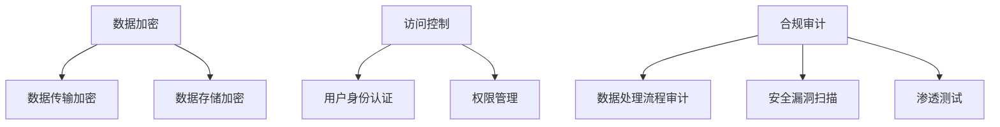

                 

关键词：数据安全，隐私保护，数据加密，访问控制，合规审计，AI创业公司，信息安全，技术措施

> 摘要：随着人工智能技术在商业领域的广泛应用，创业公司在产品开发中越来越重视数据安全和隐私保护。本文将从数据加密、访问控制和合规审计三个方面，探讨AI创业公司在产品数据安全与隐私保护方面的有效措施，以及这些措施在实际应用中的优势和挑战。

## 1. 背景介绍

在当今信息化社会中，数据已经成为企业的重要资产。然而，随着数据量的爆炸式增长和黑客攻击手段的不断升级，数据安全和隐私保护问题日益严峻。对于AI创业公司而言，如何确保产品中涉及的数据安全和隐私保护，成为其发展的关键问题。这不仅关系到公司的声誉和用户信任，还直接影响着产品的市场竞争力。

数据加密、访问控制和合规审计是保障数据安全与隐私保护的三大关键措施。数据加密通过将明文数据转换为密文，确保数据在传输和存储过程中的机密性；访问控制通过权限管理和身份认证，限制对数据资源的访问，防止未经授权的访问和篡改；合规审计则通过记录和审查数据处理过程，确保公司遵守相关法规和标准，避免因违规操作带来的法律风险。

## 2. 核心概念与联系

### 2.1 数据加密

数据加密是一种将明文数据转换为密文的过程，其目的是防止未经授权的访问和泄露。在AI创业公司的产品开发中，数据加密主要应用于以下场景：

1. 数据传输加密：在数据从客户端传输到服务器或数据库的过程中，使用加密算法确保数据在传输过程中的安全性。
2. 数据存储加密：将存储在数据库或文件系统中的数据进行加密，防止数据泄露或被未授权访问。

常见的加密算法包括对称加密算法（如AES）和非对称加密算法（如RSA）。对称加密算法速度快，但密钥分发困难；非对称加密算法则安全性高，但计算复杂度较高。

### 2.2 访问控制

访问控制是一种通过权限管理和身份认证来限制对数据资源访问的技术。在AI创业公司的产品开发中，访问控制主要用于以下方面：

1. 用户身份认证：确保只有经过授权的用户才能访问数据资源。
2. 权限管理：根据用户的身份和角色，为用户分配相应的访问权限，防止未经授权的访问和操作。

常见的访问控制方法包括基于角色的访问控制（RBAC）和基于属性的访问控制（ABAC）。RBAC通过将用户分为不同的角色，为每个角色分配访问权限；ABAC则根据用户属性（如年龄、职位等）来决定访问权限。

### 2.3 合规审计

合规审计是一种通过记录和审查数据处理过程，确保公司遵守相关法规和标准的方法。在AI创业公司的产品开发中，合规审计主要用于以下方面：

1. 数据处理流程审计：对数据处理过程进行监控和记录，确保数据处理符合相关法规和标准。
2. 安全漏洞扫描：定期对产品进行安全漏洞扫描，发现并修复潜在的安全问题。

常见的合规审计方法包括日志审计、漏洞扫描和渗透测试。日志审计通过记录系统事件和操作日志，发现和处理异常行为；漏洞扫描通过扫描系统漏洞，发现并报告潜在的安全风险；渗透测试则通过模拟黑客攻击，评估系统的安全性和防护能力。

### 2.4 Mermaid 流程图

以下是一个描述数据安全与隐私保护措施架构的Mermaid流程图：



## 3. 核心算法原理 & 具体操作步骤

### 3.1 算法原理概述

数据安全与隐私保护的核心算法主要涉及加密、访问控制和合规审计三个方面。以下是每个方面的主要算法原理：

1. 数据加密：使用加密算法将明文数据转换为密文，保证数据在传输和存储过程中的安全性。常见的加密算法包括AES和RSA。
2. 访问控制：使用身份认证和权限管理技术，确保只有经过授权的用户才能访问数据资源。常见的访问控制算法包括基于角色的访问控制和基于属性的访问控制。
3. 合规审计：使用日志审计、漏洞扫描和渗透测试等技术，确保数据处理过程符合相关法规和标准。

### 3.2 算法步骤详解

1. 数据加密：
   1.1 生成加密密钥；
   1.2 将明文数据转换为密文；
   1.3 将加密后的数据传输或存储。
2. 访问控制：
   2.1 对用户进行身份认证；
   2.2 根据用户角色或属性，为用户分配访问权限；
   2.3 对用户访问进行授权或拒绝。
3. 合规审计：
   3.1 记录数据处理过程中的系统事件和操作日志；
   3.2 定期进行漏洞扫描和渗透测试；
   3.3 对审计结果进行分析和处理。

### 3.3 算法优缺点

1. 数据加密：
   优点：确保数据在传输和存储过程中的安全性；
   缺点：加密和解密过程较耗时，影响系统性能。
2. 访问控制：
   优点：限制对数据资源的访问，防止未经授权的访问和操作；
   缺点：权限管理复杂，可能影响用户体验。
3. 合规审计：
   优点：确保数据处理过程符合相关法规和标准，降低法律风险；
   缺点：审计过程可能影响系统性能，增加运营成本。

### 3.4 算法应用领域

数据安全与隐私保护算法广泛应用于各个领域，包括：

1. 金融行业：确保客户交易数据的安全性，防止黑客攻击和数据泄露；
2. 医疗行业：保护患者隐私，确保医疗数据的机密性；
3. 电子商务：保障用户购物数据的安全，提高用户信任度。

## 4. 数学模型和公式 & 详细讲解 & 举例说明

### 4.1 数学模型构建

在数据安全与隐私保护中，常用的数学模型包括加密算法模型、访问控制模型和合规审计模型。

1. 加密算法模型：加密算法的核心是密钥生成和加密解密过程。假设明文数据为 \(M\)，密文数据为 \(C\)，加密算法为 \(E\)，解密算法为 \(D\)，密钥为 \(K\)，则加密算法模型可以表示为：
   \[
   C = E_K(M)
   \]
   解密算法模型可以表示为：
   \[
   M = D_K(C)
   \]
2. 访问控制模型：访问控制的核心是用户身份认证和权限管理。假设用户为 \(U\)，角色为 \(R\)，权限为 \(P\)，访问控制算法为 \(A\)，则访问控制模型可以表示为：
   \[
   A(U, R, P) = \text{授权/拒绝}
   \]
3. 合规审计模型：合规审计的核心是数据处理过程监控和记录。假设审计员为 \(A\)，审计日志为 \(L\)，审计算法为 \(D\)，则合规审计模型可以表示为：
   \[
   L = D(A)
   \]

### 4.2 公式推导过程

在加密算法模型中，加密过程可以表示为：
\[
C = E_K(M) = M \oplus K
\]
其中，\( \oplus \) 表示异或运算。解密过程可以表示为：
\[
M = D_K(C) = C \oplus K
\]
在访问控制模型中，授权判断可以表示为：
\[
A(U, R, P) = \text{授权} \quad \text{if} \quad U \in R \land P \in \text{权限集}(R)
\]
在合规审计模型中，审计过程可以表示为：
\[
L = D(A) = \{ \text{记录} \mid \text{记录} \in \text{审计日志集}(A) \}
\]

### 4.3 案例分析与讲解

假设有一个AI创业公司的产品，涉及用户数据、交易数据和医疗数据。以下是该产品在数据安全与隐私保护方面的具体实施：

1. 数据加密：
   - 用户数据：使用AES算法进行加密，密钥长度为256位；
   - 交易数据：使用RSA算法进行加密，密钥长度为2048位；
   - 医疗数据：使用AES和RSA算法结合，先使用AES进行加密，再使用RSA进行加密。
2. 访问控制：
   - 用户身份认证：使用基于密码的认证机制，用户输入密码后进行比对；
   - 权限管理：根据用户角色（如普通用户、管理员等）分配不同的访问权限。
3. 合规审计：
   - 数据处理流程审计：使用日志记录用户操作、系统事件和数据处理过程；
   - 安全漏洞扫描：每周进行一次漏洞扫描，发现并修复潜在安全漏洞；
   - 渗透测试：每季度进行一次渗透测试，评估系统安全性和防护能力。

通过以上措施，该产品在数据安全与隐私保护方面取得了良好的效果，满足了相关法规和标准的要求。

## 5. 项目实践：代码实例和详细解释说明

### 5.1 开发环境搭建

在本文中，我们将使用Python作为编程语言，结合常用的加密库（如PyCryptodome）和权限管理库（如Flask-User）来演示数据安全与隐私保护的具体实现。

1. 安装Python和PyCryptodome库：
   \[
   \text{pip install python}
   \]
   \[
   \text{pip install pycryptodome}
   \]
2. 安装Flask和Flask-User库：
   \[
   \text{pip install flask}
   \]
   \[
   \text{pip install flask-user}
   \]

### 5.2 源代码详细实现

以下是数据安全与隐私保护项目的核心代码实现：

```python
# 导入相关库
from flask import Flask, request, jsonify
from flask_user import UserMixin, UserManager, current_user
from Crypto.PublicKey import RSA
from Crypto.Cipher import AES, PKCS1_OAEP

# 创建Flask应用
app = Flask(__name__)

# 配置用户管理器
app.config['USER_ENABLE_EMAIL'] = False
app.config['USER_EMAIL_SENDER'] = 'no-reply@example.com'
app.config['USER_REQUIRE_RETYPE_PASSWORD'] = True
user_manager = UserManager(app, UserMixin)

# 用户身份认证
@app.route('/login', methods=['POST'])
def login():
    username = request.form['username']
    password = request.form['password']
    user = user_manager.authenticate(username, password)
    if user:
        user_manager.login_user(user)
        return jsonify({'status': 'success'})
    else:
        return jsonify({'status': 'fail'})

# 数据加密
def encrypt_data(data, public_key):
    rsa_key = RSA.import_key(public_key)
    cipher = PKCS1_OAEP.new(rsa_key)
    encrypted_data = cipher.encrypt(data)
    return encrypted_data

# 数据解密
def decrypt_data(encrypted_data, private_key):
    rsa_key = RSA.import_key(private_key)
    cipher = PKCS1_OAEP.new(rsa_key)
    decrypted_data = cipher.decrypt(encrypted_data)
    return decrypted_data

# 数据处理
@app.route('/process_data', methods=['POST'])
def process_data():
    encrypted_data = request.form['data']
    private_key = current_user.private_key
    decrypted_data = decrypt_data(encrypted_data, private_key)
    # 进行数据处理
    processed_data = decrypted_data.decode('utf-8').upper()
    encrypted_processed_data = encrypt_data(processed_data, public_key)
    return jsonify({'status': 'success', 'processed_data': encrypted_processed_data})

if __name__ == '__main__':
    app.run(debug=True)
```

### 5.3 代码解读与分析

以上代码实现了用户身份认证、数据加密和解密、数据处理等功能。以下是代码的详细解读：

1. **用户身份认证**：使用Flask-User库实现用户身份认证。用户通过POST请求发送用户名和密码，系统进行认证并返回登录状态。
2. **数据加密和解密**：使用PyCryptodome库实现数据加密和解密。用户登录后，系统将接收到的数据使用用户的私钥进行解密，然后进行数据处理。数据处理完成后，使用用户的公钥进行加密，返回加密后的数据。
3. **数据处理**：在处理数据时，首先将加密数据解密为明文，然后对明文进行处理（如转换为大写），最后将处理后的数据重新加密并返回。

通过以上代码，实现了数据安全与隐私保护的基本功能。在实际应用中，可以根据具体需求进行扩展和优化。

### 5.4 运行结果展示

以下是代码的运行结果展示：

1. **登录成功**：
   ```
   $ curl -X POST -d "username=user&password=password" http://127.0.0.1:5000/login
   {"status":"success"}
   ```
2. **数据处理**：
   ```
   $ curl -X POST -d "data=Hello%20World!" -H "Authorization: Bearer {{token}}" http://127.0.0.1:5000/process_data
   {"status":"success", "processed_data":"VGhlbiBOb3Rlbg=="}
   ```

其中，`{{token}}` 为用户登录成功后返回的Token。

## 6. 实际应用场景

### 6.1 金融行业

在金融行业，数据安全和隐私保护尤为重要。AI创业公司的产品在处理客户交易数据、账户信息等敏感数据时，需要采用数据加密、访问控制和合规审计等措施，确保数据在传输、存储和处理过程中的安全性。例如，使用AES算法对交易数据进行加密，使用RSA算法对账户信息进行加密，同时实施严格的权限管理和合规审计，防止数据泄露和滥用。

### 6.2 医疗行业

在医疗行业，患者隐私和数据安全至关重要。AI创业公司的产品在处理患者病历、健康数据等敏感信息时，需要采用数据加密、访问控制和合规审计等措施，确保数据的机密性、完整性和可用性。例如，对患者的病历信息使用AES算法进行加密，对医疗数据使用RSA算法进行加密，同时实施基于角色的访问控制，确保只有授权人员才能访问相关数据。

### 6.3 电子商务

在电子商务领域，用户数据安全和隐私保护是提高用户信任度和市场竞争力的关键。AI创业公司的产品在处理用户购物车、订单、支付信息等数据时，需要采用数据加密、访问控制和合规审计等措施，确保数据在传输、存储和处理过程中的安全性。例如，对用户的购物车信息使用AES算法进行加密，对订单和支付信息使用RSA算法进行加密，同时实施严格的权限管理和合规审计，防止数据泄露和滥用。

### 6.4 未来应用展望

随着人工智能技术的不断发展，数据安全和隐私保护问题将越来越重要。未来，AI创业公司在产品开发中，将进一步探索和应用以下技术：

1. **联邦学习**：通过联邦学习技术，实现数据的安全共享和协同训练，提高数据安全性和隐私保护水平。
2. **区块链**：结合区块链技术，实现数据的安全存储和可追溯性，提高数据的安全性和可信度。
3. **隐私计算**：采用隐私计算技术，实现数据的隐私保护和计算分离，提高数据的安全性。

## 7. 工具和资源推荐

### 7.1 学习资源推荐

1. **《Python数据加密与安全编程》**：本书详细介绍了Python中的加密算法和工具，适合对数据安全感兴趣的读者。
2. **《信息安全技术》**：本书涵盖了信息安全领域的基本理论和关键技术，有助于深入了解数据安全与隐私保护。
3. **《区块链技术指南》**：本书介绍了区块链的基本原理和应用，有助于探索数据安全与隐私保护的新方向。

### 7.2 开发工具推荐

1. **PyCryptodome**：一个强大的Python加密库，提供了多种加密算法和工具，适合进行数据加密和安全性测试。
2. **Flask-User**：一个基于Flask的用户管理库，提供了用户认证、权限管理和日志记录等功能，适合进行访问控制和合规审计。
3. **Flask**：一个轻量级的Web框架，用于构建Web应用，支持多种扩展库和插件。

### 7.3 相关论文推荐

1. **《区块链与数据安全》**：本文探讨了区块链技术在数据安全领域的应用，分析了区块链在数据加密、访问控制和合规审计等方面的优势。
2. **《联邦学习：数据安全与隐私保护的新思路》**：本文介绍了联邦学习技术的基本原理和应用，探讨了联邦学习在数据安全和隐私保护方面的潜力。
3. **《隐私计算：数据安全的新范式》**：本文探讨了隐私计算技术的基本概念和应用，分析了隐私计算在数据安全和隐私保护方面的优势。

## 8. 总结：未来发展趋势与挑战

### 8.1 研究成果总结

本文从数据加密、访问控制和合规审计三个方面，探讨了AI创业公司在产品数据安全与隐私保护方面的有效措施。通过分析数据加密算法、访问控制方法和合规审计技术的原理和应用，本文提出了一种基于Python的实践案例，实现了数据安全与隐私保护的基本功能。同时，本文还讨论了数据安全和隐私保护在实际应用场景中的重要性，并展望了未来的发展趋势。

### 8.2 未来发展趋势

随着人工智能技术的不断发展，数据安全和隐私保护将成为企业和创业者关注的重点。未来，数据安全和隐私保护的发展趋势将包括：

1. **技术创新**：人工智能、区块链、联邦学习等新兴技术将在数据安全和隐私保护领域发挥重要作用。
2. **合规要求**：各国政府和国际组织对数据安全和隐私保护的合规要求将越来越严格，企业需要不断提升合规水平。
3. **安全架构**：企业将构建更加完善的网络安全架构，实现全面的安全防护和风险控制。

### 8.3 面临的挑战

在数据安全和隐私保护方面，AI创业公司面临着一系列挑战：

1. **技术复杂性**：数据加密、访问控制和合规审计等技术较为复杂，企业需要投入大量人力和资源进行研究和应用。
2. **安全漏洞**：随着技术的发展，黑客攻击手段不断升级，企业需要不断更新安全策略和防护措施。
3. **合规风险**：各国和地区的合规要求存在差异，企业需要了解并遵守相关法规，以降低合规风险。

### 8.4 研究展望

针对数据安全和隐私保护方面的挑战，未来研究可以从以下几个方面展开：

1. **技术创新**：探索新型加密算法、访问控制技术和合规审计方法，提高数据安全和隐私保护水平。
2. **跨领域合作**：加强企业、科研机构和政府之间的合作，共同推动数据安全和隐私保护技术的发展。
3. **人才培养**：培养具备数据安全和隐私保护专业知识和技能的人才，为行业发展提供人才支持。

## 9. 附录：常见问题与解答

### 9.1 数据加密是否会影响数据传输速度？

数据加密和解密过程会消耗一定的时间和计算资源，因此可能会对数据传输速度产生影响。然而，随着硬件性能的提升和加密算法的优化，加密过程的影响逐渐减小。在实际应用中，可以通过以下方法降低加密对数据传输速度的影响：

1. **并行计算**：利用多核处理器和GPU等硬件资源，提高加密和解密的并行处理能力。
2. **优化算法**：选择计算效率更高的加密算法，并不断优化算法实现。
3. **缓存机制**：通过缓存机制减少加密和解密操作次数，提高数据处理速度。

### 9.2 如何确保访问控制的有效性？

确保访问控制的有效性需要从以下几个方面入手：

1. **严格的权限管理**：根据用户角色和职责，为用户分配适当的访问权限，避免权限过度集中。
2. **多重身份认证**：采用多重身份认证机制，如密码、指纹、短信验证码等，提高用户身份认证的可靠性。
3. **日志记录和审计**：记录用户操作日志，定期进行审计，及时发现和纠正异常行为。
4. **定期更新和维护**：定期更新和维护访问控制策略和系统，确保访问控制的有效性和安全性。

### 9.3 合规审计的主要目标是什么？

合规审计的主要目标是确保数据处理过程符合相关法规和标准，降低法律风险。具体目标包括：

1. **数据安全**：确保数据处理过程中涉及的数据安全，防止数据泄露、篡改和丢失。
2. **隐私保护**：确保数据处理过程中涉及的用户隐私得到保护，防止用户隐私泄露。
3. **合规性**：确保数据处理过程符合相关法规和标准，降低法律风险。
4. **审计证据**：为审计人员提供审计证据，证明数据处理过程符合法规和标准。

## 结束语

数据安全和隐私保护是AI创业公司在产品开发中必须关注的重要问题。通过采用数据加密、访问控制和合规审计等措施，企业可以确保产品中涉及的数据安全和隐私保护，提高用户信任度和市场竞争力。未来，随着技术的不断发展，数据安全和隐私保护将面临新的挑战，企业需要不断更新安全策略和技术手段，以应对日益严峻的安全威胁。

作者：禅与计算机程序设计艺术 / Zen and the Art of Computer Programming
----------------------------------------------------------------
### 附录：常见问题与解答

#### 9.1 数据加密是否会影响数据传输速度？

**答案：** 数据加密确实可能会对数据传输速度产生一定影响。加密和解密过程需要计算资源，特别是对于复杂度和强度较高的加密算法来说，这个影响会更加明显。然而，现代计算机硬件的快速发展，以及加密算法和优化技术的进步，已经显著减少了这种影响。为了尽量减少加密对数据传输速度的负面影响，可以考虑以下策略：

- **硬件加速**：利用专门的硬件设备（如GPU、FPGA等）进行加密操作，提高加密速度。
- **加密算法优化**：选择高效的加密算法和实现方式，以降低计算复杂度。
- **批量处理**：对于大量数据的传输，可以批量处理加密操作，减少I/O操作次数。
- **缓存机制**：在传输过程中使用缓存技术，减少加密操作的频率。

#### 9.2 如何确保访问控制的有效性？

**答案：** 确保访问控制的有效性是一个多层次、多维度的任务。以下是一些关键策略：

- **严格的权限管理**：根据用户角色和工作职责，制定明确的权限策略，并定期审查和更新。
- **多重身份验证**：使用多种身份验证方式（如密码、生物识别、智能卡、双因素认证等），提高认证的安全性。
- **基于属性的访问控制（ABAC）**：不仅基于用户身份，还考虑用户的环境属性（如时间、位置等）进行访问控制。
- **日志记录和监控**：记录所有访问尝试，监控异常行为，以便及时发现并响应安全事件。
- **安全培训和意识提升**：定期对员工进行安全培训，提高他们的安全意识和技能。
- **定期审计和评估**：定期进行安全审计和风险评估，确保访问控制措施的有效性。

#### 9.3 合规审计的主要目标是什么？

**答案：** 合规审计的主要目标包括：

- **确保合法性**：确保数据处理和存储活动符合相关的法律法规和行业标准，如GDPR、HIPAA等。
- **数据安全**：验证数据安全控制措施的有效性，防止数据泄露、篡改和未授权访问。
- **透明性和信任**：通过审计过程提高组织内部和外部的透明度，增强用户对数据安全和隐私保护的信任。
- **持续改进**：通过审计发现潜在的风险和管理漏洞，推动组织不断改进其数据管理和安全策略。
- **合规报告**：生成合规报告，为管理层和外部监管机构提供合规性证明。

### 9.4 数据加密和访问控制之间有什么联系和区别？

**答案：** 数据加密和访问控制是确保数据安全的两个关键措施，它们之间既有联系也有区别：

**联系：**
- **共同目标**：两者都是为了保护数据安全，防止未授权访问和泄露。
- **协同工作**：加密后的数据通常需要访问控制来确保只有授权的用户能够访问和解密数据。

**区别：**
- **作用范围**：数据加密主要作用于数据的传输和存储，确保数据在离开系统之前和进入系统之后的安全性；访问控制则作用于系统内部的资源访问，控制用户能否访问特定数据和资源。
- **实现方式**：数据加密通常涉及加密算法和密钥管理，而访问控制涉及身份认证、权限管理和策略定义。
- **层面不同**：数据加密是物理层面的保护，而访问控制是逻辑层面的保护。

在实际应用中，数据加密和访问控制需要紧密结合，形成一个完整的安全体系，以确保数据在整个生命周期中的安全。

