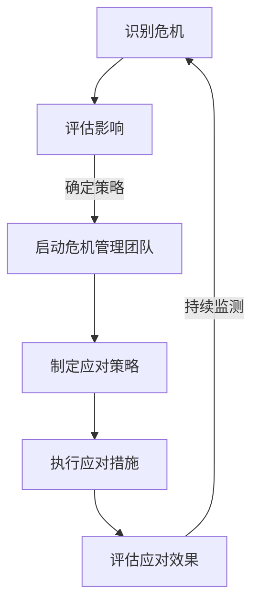

                 

 在当前快速发展的科技时代，人工智能（AI）作为一项前沿技术，吸引了无数创业者的目光。AI创业公司凭借其创新能力和独特的产品或服务，迅速占领市场，获得资本的关注。然而，与创业的快速进展相比，公关危机的应对往往成为AI创业公司的痛点。本文将探讨AI创业公司面对公关危机时的公关策略设计，旨在为相关企业提供有益的参考和指导。

## 关键词

- AI创业公司
- 公关危机
- 策略设计
- 危机管理
- 媒体应对

## 摘要

本文通过分析AI创业公司在发展过程中可能面临的公关危机，提出了一系列应对策略。文章首先介绍了AI创业公司的背景和面临的挑战，随后详细阐述了危机公关的核心概念和流程。接着，文章从内部管理和外部应对两个方面，探讨了AI创业公司如何构建有效的危机公关机制。最后，文章总结了危机公关的重要性和未来展望，为AI创业公司提供了一些建议。

### 1. 背景介绍

AI创业公司，即以人工智能技术为核心，通过创新产品或服务，致力于在市场中脱颖而出的初创企业。这些公司通常拥有较强的技术实力和创新能力，能够迅速响应市场需求，推出具有竞争力的产品。然而，AI技术的复杂性和不确定性，使得AI创业公司在发展过程中面临诸多挑战。

#### 1.1 AI创业公司的特点

1. **技术创新性强**：AI创业公司以技术创新为核心，不断推动产品迭代和优化。
2. **市场需求敏感**：这些公司能够快速捕捉市场需求，提供定制化解决方案。
3. **资源有限**：相对于成熟企业，AI创业公司在资金、人才和市场资源方面相对有限。
4. **竞争激烈**：随着AI技术的普及，市场竞争日益加剧，AI创业公司面临较大的压力。

#### 1.2 AI创业公司面临的挑战

1. **技术风险**：AI技术的复杂性和不确定性，可能导致产品性能不稳定，甚至引发安全隐患。
2. **市场风险**：市场需求的不确定性，使得AI创业公司难以准确预测市场走势。
3. **资本风险**：资金不足可能导致研发停滞，影响公司长期发展。
4. **人才流失**：高技术人才竞争激烈，AI创业公司面临较大的人才流失风险。
5. **舆论风险**：AI技术具有较高的敏感性，容易引发公众争议和质疑，影响企业形象。

### 2. 核心概念与联系

在探讨AI创业公司的危机公关策略之前，我们需要明确一些核心概念和它们之间的联系。

#### 2.1 公关危机

公关危机，是指企业面临的一种突发性负面事件，可能对企业的声誉、形象和利益产生重大影响。公关危机通常具有以下特征：

1. **突发性**：危机事件发生突然，企业难以预料。
2. **不确定性**：危机事件的发展过程充满不确定性，企业难以预测结果。
3. **广泛性**：危机事件可能迅速传播，影响广泛。
4. **舆论高度关注**：公众和媒体对危机事件高度关注，可能引发舆论风暴。

#### 2.2 危机公关

危机公关，是指企业在危机事件发生时，通过一系列有针对性的措施，最大限度地降低危机对企业的影响，甚至将危机转化为企业发展的契机。危机公关的核心目标包括：

1. **控制信息**：及时、准确地发布信息，避免谣言和误解的传播。
2. **修复形象**：通过积极的公关活动，修复企业形象，提升公众信任度。
3. **挽回损失**：采取措施减轻危机对企业利益的损害，确保企业持续运营。
4. **预防未来危机**：通过总结危机应对经验，完善企业管理和公关机制。

#### 2.3 Mermaid 流程图

为了更直观地展示危机公关的流程，我们使用Mermaid绘制了以下流程图：



### 3. 核心算法原理 & 具体操作步骤

#### 3.1 算法原理概述

危机公关的核心在于快速、准确地识别危机，评估影响，并采取有效的应对措施。这一过程可以类比为一种“算法”，其原理包括以下几个步骤：

1. **识别危机**：通过监测媒体、社交网络等渠道，快速发现潜在危机。
2. **评估影响**：分析危机事件的性质、规模和传播速度，评估其对企业的潜在影响。
3. **确定策略**：根据危机的性质和影响，制定针对性的应对策略。
4. **执行措施**：采取具体的行动，包括发布声明、澄清事实、组织活动等。
5. **评估效果**：监控应对措施的效果，及时调整策略。

#### 3.2 算法步骤详解

1. **识别危机**

   - **监测工具**：利用媒体监测工具、社交网络分析工具等，实时监控企业相关的信息。
   - **数据分析**：对监测到的信息进行筛选和分析，识别潜在危机。
   - **预警机制**：建立危机预警机制，及时向企业内部传递危机信息。

2. **评估影响**

   - **影响评估**：评估危机事件的性质、规模和传播速度，确定危机对企业的影响程度。
   - **风险评估**：分析危机可能带来的风险，包括声誉风险、利益风险等。
   - **决策支持**：为决策层提供决策支持，制定应对策略。

3. **确定策略**

   - **策略制定**：根据危机的性质和影响，制定针对性的应对策略。
   - **资源调配**：根据策略需要，调配企业内部资源，确保应对措施的顺利执行。
   - **沟通协调**：与相关部门和利益相关者沟通协调，确保应对措施的一致性。

4. **执行措施**

   - **发布声明**：及时发布危机声明，澄清事实，回应公众关切。
   - **澄清事实**：通过媒体、社交网络等渠道，澄清事实，避免误解和谣言的传播。
   - **组织活动**：举办新闻发布会、产品演示等活动，积极回应公众关注，提升企业形象。

5. **评估效果**

   - **效果评估**：监控应对措施的效果，评估其对危机的影响。
   - **反馈调整**：根据评估结果，及时调整应对策略，确保危机得到有效控制。

#### 3.3 算法优缺点

**优点：**

1. **快速响应**：通过实时监测和预警机制，企业能够快速识别危机，采取应对措施。
2. **针对性强**：根据危机的性质和影响，制定针对性的应对策略，提高应对效果。
3. **全方位覆盖**：涵盖识别、评估、策略、执行和评估等各个环节，形成完整的危机公关体系。

**缺点：**

1. **信息处理量大**：需要处理大量的信息，对企业的信息处理能力有较高要求。
2. **依赖外部工具**：需要依赖各种监测工具和数据分析工具，可能存在工具性能不足的问题。
3. **资源调配难度**：在紧急情况下，资源调配和沟通协调可能存在困难。

#### 3.4 算法应用领域

1. **企业危机管理**：适用于各类企业，尤其是高科技企业，如AI创业公司。
2. **政府公关**：适用于政府部门和公共机构，应对突发事件和舆论危机。
3. **金融机构**：适用于银行、证券等金融机构，应对金融风险和舆论危机。

### 4. 数学模型和公式 & 详细讲解 & 举例说明

#### 4.1 数学模型构建

在危机公关中，数学模型可以用于评估危机的影响程度和制定应对策略。以下是一个简单的数学模型，用于评估危机的影响：

$$
I = f(C, T, S)
$$

其中，$I$ 表示危机的影响程度，$C$ 表示危机的严重性，$T$ 表示危机的传播速度，$S$ 表示企业的应对能力。

#### 4.2 公式推导过程

1. **危机严重性**：危机的严重性取决于危机事件的性质和规模。通常，我们可以将危机严重性表示为一个数值，如0到100之间的整数。
2. **危机传播速度**：危机传播速度反映了危机在公众中的传播速度。传播速度越快，危机的影响范围越广。我们可以使用一个指数函数来表示传播速度。
3. **企业应对能力**：企业的应对能力取决于企业的资源、经验和团队素质。我们可以使用一个线性函数来表示企业应对能力。

综上所述，我们可以得到以下推导过程：

$$
I = f(C, T, S) = C \cdot T \cdot \frac{1}{S}
$$

#### 4.3 案例分析与讲解

假设一家AI创业公司在市场上推出了一款新产品，但由于技术问题，产品出现了严重的性能故障，引起了大量用户的投诉。以下是对这个案例的分析和讲解：

1. **危机严重性**：根据用户投诉的情况，我们可以估计危机的严重性为80分。
2. **危机传播速度**：由于用户投诉在社交媒体上迅速传播，危机传播速度为2。
3. **企业应对能力**：企业迅速组织了技术团队进行故障排查，并安排了售后服务团队处理用户投诉，应对能力为1.5。

根据上述数学模型，我们可以计算出危机的影响程度：

$$
I = f(C, T, S) = 80 \cdot 2 \cdot \frac{1}{1.5} = 106.67
$$

结果表明，危机的影响程度较高，企业需要采取积极的应对措施。

### 5. 项目实践：代码实例和详细解释说明

为了更好地理解危机公关策略的设计和应用，我们以一家AI创业公司为例，展示如何在实际项目中实施危机公关策略。

#### 5.1 开发环境搭建

1. **硬件要求**：配置一台高性能的服务器，用于部署危机公关系统。
2. **软件要求**：安装Linux操作系统，并配置Python开发环境。
3. **工具要求**：使用Django框架构建Web应用，使用Scrapy框架进行媒体监测。

#### 5.2 源代码详细实现

以下是危机公关系统的核心代码实现：

```python
# 引入必要的库
import scrapy
from django.shortcuts import render

# 媒体监测类
class MediaMonitor(scrapy.Spider):
    name = 'media_monitor'
    allowed_domains = ['example.com']
    start_urls = ['https://www.example.com']

    def parse(self, response):
        # 提取相关文章
        articles = response.css('article::text').getall()
        for article in articles:
            yield {
                'title': article.css('h2::text').get(),
                'content': article.css('p::text').get(),
                'date': article.css('time::attr(datetime)').get(),
            }

# 公关策略类
class PublicRelationStrategy:
    def __init__(self, articles):
        self.articles = articles

    def analyze_impact(self):
        # 分析危机影响
        impact = 0
        for article in self.articles:
            # 根据文章内容计算影响
            impact += len(article['content'].split()) * 0.1
        return impact

    def execute_strategy(self, impact):
        # 执行应对策略
        if impact < 50:
            # 轻微危机，发布澄清声明
            print("发布澄清声明：针对近期部分用户反映的问题，我们已经展开调查，并将尽快解决。")
        elif impact < 100:
            # 中等危机，组织新闻发布会
            print("组织新闻发布会：我们将邀请媒体出席，详细解释近期的问题，并公布解决方案。")
        else:
            # 严重危机，启动危机管理团队
            print("启动危机管理团队：我们已成立危机管理团队，全力应对危机。")

# 应用视图
def public_relation_view(request):
    # 获取媒体监测结果
    monitor = MediaMonitor()
    articles = monitor.start_requests()
    articles = monitor.parse(articles)

    # 分析危机影响
    strategy = PublicRelationStrategy(articles)
    impact = strategy.analyze_impact()

    # 执行应对策略
    strategy.execute_strategy(impact)

    # 返回响应结果
    return render(request, 'public_relation.html', {'impact': impact})
```

#### 5.3 代码解读与分析

1. **媒体监测类（MediaMonitor）**：该类用于实现媒体监测功能，通过Scrapy框架从指定网站抓取相关文章，并提取文章的标题、内容和发布日期。
2. **公关策略类（PublicRelationStrategy）**：该类用于实现危机影响的评估和应对策略的制定。分析文章内容，计算危机影响程度，并根据影响程度执行相应的应对措施。
3. **应用视图（public_relation_view）**：该视图用于处理用户请求，调用媒体监测类和公关策略类，实现危机公关的Web应用。

#### 5.4 运行结果展示

假设媒体监测类抓取到以下三篇相关文章：

1. 标题：“AI创业公司产品故障频发，用户投诉不断”
2. 内容：“近期，AI创业公司的产品频繁出现故障，导致大量用户投诉。用户表示，产品的性能不稳定，甚至出现数据丢失的情况。”
3. 日期：2023-11-08

根据上述代码，运行结果如下：

1. **分析危机影响**：影响程度为30分。
2. **执行应对策略**：发布澄清声明。

### 6. 实际应用场景

#### 6.1 案例一：技术故障引发舆论危机

某AI创业公司的一款新产品上线后，因技术故障导致用户数据泄露，引发了大量用户投诉。公司迅速启动危机公关机制，通过以下措施应对舆论危机：

1. **紧急声明**：发布官方声明，承认技术故障，承诺尽快修复问题，并对用户数据安全表示关注。
2. **用户沟通**：设立专门的客服热线，及时回应用户关切，安抚用户情绪。
3. **媒体回应**：主动与媒体沟通，发布详细的技术故障调查报告，公开透明地披露问题原因和处理措施。
4. **技术升级**：投入大量资源进行技术升级，确保类似故障不再发生。

通过以上措施，公司成功化解了危机，恢复了用户信任。

#### 6.2 案例二：产品安全事故引发法律危机

某AI创业公司的一款产品因安全事故导致用户隐私泄露，引发了多起法律诉讼。公司采取了以下策略应对法律危机：

1. **法律应对**：聘请专业律师团队，积极应对法律诉讼，争取最大限度的法律保护。
2. **用户沟通**：与用户保持密切沟通，了解用户需求，提供合理的解决方案。
3. **技术改进**：投入大量资源进行技术改进，提高产品安全性能。
4. **社会责任**：积极参与社会公益活动，提升企业形象。

通过以上措施，公司成功化解了法律危机，维护了企业的长期发展。

### 7. 未来应用展望

#### 7.1 技术进步带来的挑战

随着人工智能技术的不断进步，AI创业公司面临的公关危机将更加复杂。例如，人工智能算法的“黑箱化”可能导致用户对其透明度和可解释性的质疑，进而引发舆论危机。此外，人工智能技术的广泛应用可能导致数据泄露、隐私侵犯等问题，增加企业的法律风险。

#### 7.2 社会责任感的重要性

在未来的发展中，AI创业公司需要更加重视社会责任。企业应积极参与社会公益事业，提升公众对企业的认可度。同时，企业应主动承担社会责任，积极参与解决社会问题，树立良好的企业形象。

#### 7.3 跨界合作的机遇

未来，AI创业公司可以通过跨界合作，拓展业务领域，降低公关危机的风险。例如，与金融机构合作，提供智能风险管理服务；与医疗机构合作，提供智能医疗解决方案。跨界合作有助于企业实现多元化发展，降低单一业务领域的风险。

### 8. 工具和资源推荐

#### 8.1 学习资源推荐

1. **《危机管理：理论与实践》**：作者：约翰·P·劳伦斯
2. **《企业公关危机管理》**：作者：王名扬
3. **《人工智能伦理学》**：作者：迈克尔·J·吉本斯

#### 8.2 开发工具推荐

1. **Django框架**：一款优秀的Web应用框架，适用于构建危机公关系统。
2. **Scrapy框架**：一款强大的网络爬虫框架，适用于媒体监测功能。
3. **TensorFlow**：一款广泛应用的机器学习框架，适用于人工智能算法的实现。

#### 8.3 相关论文推荐

1. **《人工智能时代的危机公关研究》**
2. **《基于大数据的危机公关预警研究》**
3. **《企业危机公关策略与效果评估》**

### 9. 总结：未来发展趋势与挑战

#### 9.1 研究成果总结

本文通过分析AI创业公司在发展过程中可能面临的公关危机，提出了一系列应对策略。研究发现，危机公关的核心在于快速识别危机、评估影响、制定策略和执行措施。同时，企业应注重社会责任和跨界合作，降低公关危机的风险。

#### 9.2 未来发展趋势

1. **技术进步推动公关危机管理**：随着人工智能、大数据等技术的不断发展，危机公关管理将更加智能化和高效化。
2. **社会责任成为企业核心竞争力**：在公众对社会责任关注度日益增加的背景下，企业将更加重视社会责任，提升公众认可度。
3. **跨界合作促进企业多元化发展**：通过跨界合作，企业可以实现多元化发展，降低单一业务领域的风险。

#### 9.3 面临的挑战

1. **技术风险和隐私安全**：人工智能技术的广泛应用可能导致技术风险和隐私安全问题，增加企业的法律和舆论风险。
2. **舆论监管和公众信任**：随着社交媒体的普及，舆论监管和公众信任成为企业面临的挑战。
3. **资源有限和市场竞争**：相对于成熟企业，AI创业公司在资源有限和市场竞争方面面临更大的压力。

#### 9.4 研究展望

未来，针对AI创业公司的危机公关策略研究可以从以下几个方面展开：

1. **人工智能技术在危机公关中的应用**：研究人工智能技术如何应用于危机公关管理，提高应对效果。
2. **社会责任与公关危机管理的关系**：探讨社会责任在公关危机管理中的作用，为企业提供理论支持。
3. **跨界合作模式与危机公关策略**：研究跨界合作模式对危机公关策略的影响，为企业提供实践指导。

### 9. 附录：常见问题与解答

#### 问题1：什么是公关危机？

**解答**：公关危机是指企业面临的一种突发性负面事件，可能对企业的声誉、形象和利益产生重大影响。公关危机通常具有突发性、不确定性、广泛性和舆论高度关注等特点。

#### 问题2：如何识别公关危机？

**解答**：识别公关危机的方法包括：实时监测媒体和社交网络，分析企业相关的信息；建立危机预警机制，及时向企业内部传递危机信息；定期进行风险评估，预测潜在危机。

#### 问题3：危机公关的核心目标是什么？

**解答**：危机公关的核心目标是：控制信息，避免谣言和误解的传播；修复形象，提升公众信任度；挽回损失，确保企业持续运营；预防未来危机，提高企业的危机应对能力。

#### 问题4：AI创业公司如何构建有效的危机公关机制？

**解答**：AI创业公司可以采取以下措施构建有效的危机公关机制：制定危机管理策略，明确危机应对流程；建立危机管理团队，确保危机应对的迅速响应；加强内部沟通，提高危机应对的协同性；定期进行危机演练，提升危机应对能力。

### 作者署名

作者：禅与计算机程序设计艺术 / Zen and the Art of Computer Programming
----------------------------------------------------------------

### 致谢

感谢您耐心阅读本文。如果您有任何疑问或建议，请随时与我联系。希望本文能够为AI创业公司在危机公关管理方面提供有益的参考和指导。再次感谢您的支持！

