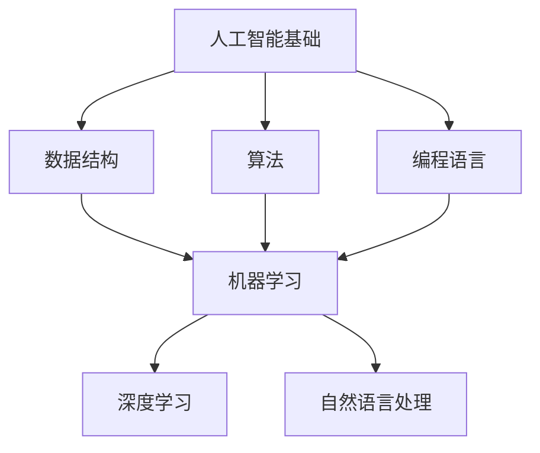

                 

关键词：AI 创业公司，技术培训，人才培养，策略制定，高效学习，团队协作。

> 摘要：本文将探讨 AI 创业公司在技术培训方面面临的挑战，并提出一系列策略，帮助创业公司构建高效的技术培训体系，提升团队整体技术水平，为公司的持续创新和发展奠定坚实基础。

## 1. 背景介绍

随着人工智能技术的快速发展，AI 创业公司如雨后春笋般涌现。这些公司大多依赖于人工智能技术来实现产品创新和商业价值。然而，技术发展和市场竞争的加速，使得 AI 创业公司在人才储备和技术积累方面面临巨大压力。为了在激烈的市场竞争中脱颖而出，AI 创业公司必须构建一套科学、系统、高效的技术培训策略。

本文将从以下几个方面展开讨论：首先，分析 AI 创业公司在技术培训方面面临的挑战；其次，介绍核心概念和架构；然后，深入探讨核心算法原理、数学模型、项目实践和实际应用场景；接着，推荐相关工具和资源；最后，总结未来发展趋势与挑战，并提出研究展望。

## 2. 核心概念与联系

在 AI 创业公司的技术培训中，核心概念包括：人工智能基础、机器学习、深度学习、自然语言处理等。这些概念之间有着紧密的联系，共同构成了 AI 技术的基石。

### 2.1 人工智能基础

人工智能基础包括：数据结构、算法、编程语言等。这些基础知识是构建 AI 系统的基础，对于技术人才来说，掌握这些基础是必不可少的。

### 2.2 机器学习

机器学习是人工智能的核心技术之一，它使计算机能够从数据中学习，并做出预测和决策。机器学习包括：监督学习、无监督学习、半监督学习等。

### 2.3 深度学习

深度学习是机器学习的一个重要分支，它通过模拟人脑神经元连接的方式，实现数据的自动学习和特征提取。深度学习在图像识别、语音识别、自然语言处理等领域具有广泛应用。

### 2.4 自然语言处理

自然语言处理是人工智能的一个重要分支，它使计算机能够理解和处理人类自然语言。自然语言处理包括：文本分类、情感分析、机器翻译等。

### 2.5 Mermaid 流程图

以下是一个简单的 Mermaid 流程图，展示了这些核心概念之间的联系：



## 3. 核心算法原理 & 具体操作步骤

### 3.1 算法原理概述

在 AI 创业公司的技术培训中，核心算法主要包括机器学习算法、深度学习算法和自然语言处理算法。这些算法各自具有独特的原理和应用场景。

- **机器学习算法**：通过训练模型，使计算机能够从数据中学习，并做出预测和决策。常见的机器学习算法有：线性回归、决策树、支持向量机、神经网络等。

- **深度学习算法**：通过多层神经网络，实现对数据的自动学习和特征提取。常见的深度学习算法有：卷积神经网络（CNN）、循环神经网络（RNN）、生成对抗网络（GAN）等。

- **自然语言处理算法**：通过对文本进行处理和分析，实现计算机对自然语言的理解和生成。常见的自然语言处理算法有：词向量、序列模型、注意力机制等。

### 3.2 算法步骤详解

- **机器学习算法步骤**：

  1. 数据预处理：对原始数据进行清洗、归一化等操作，使其符合训练需求。

  2. 模型选择：根据问题特点选择合适的机器学习模型。

  3. 模型训练：使用训练数据对模型进行训练，调整模型参数。

  4. 模型评估：使用测试数据对模型进行评估，判断模型性能。

  5. 模型优化：根据评估结果对模型进行调整和优化。

- **深度学习算法步骤**：

  1. 数据预处理：对原始数据进行清洗、归一化等操作，使其符合训练需求。

  2. 网络架构设计：设计合适的深度学习网络架构。

  3. 模型训练：使用训练数据对模型进行训练，调整模型参数。

  4. 模型评估：使用测试数据对模型进行评估，判断模型性能。

  5. 模型优化：根据评估结果对模型进行调整和优化。

- **自然语言处理算法步骤**：

  1. 数据预处理：对原始数据进行清洗、分词等操作，使其符合训练需求。

  2. 模型选择：根据问题特点选择合适的自然语言处理模型。

  3. 模型训练：使用训练数据对模型进行训练，调整模型参数。

  4. 模型评估：使用测试数据对模型进行评估，判断模型性能。

  5. 模型优化：根据评估结果对模型进行调整和优化。

### 3.3 算法优缺点

- **机器学习算法**：

  - 优点：通用性强，适用于各种类型的数据和问题。

  - 缺点：对数据质量要求较高，训练过程可能较长。

- **深度学习算法**：

  - 优点：强大的特征提取能力，能够处理复杂的问题。

  - 缺点：对计算资源要求较高，训练过程可能较长。

- **自然语言处理算法**：

  - 优点：能够处理人类自然语言，实现智能交互。

  - 缺点：对数据量要求较高，训练过程可能较长。

### 3.4 算法应用领域

- **机器学习算法**：广泛应用于图像识别、语音识别、推荐系统等领域。

- **深度学习算法**：广泛应用于计算机视觉、自然语言处理、语音识别等领域。

- **自然语言处理算法**：广泛应用于文本分类、情感分析、机器翻译等领域。

## 4. 数学模型和公式 & 详细讲解 & 举例说明

### 4.1 数学模型构建

在 AI 创业公司的技术培训中，常见的数学模型包括线性回归模型、逻辑回归模型、神经网络模型等。

- **线性回归模型**：

  线性回归模型是一种简单的预测模型，它通过拟合一条直线来预测目标变量。线性回归模型的数学表达式为：

  $$ y = \beta_0 + \beta_1 \cdot x $$

  其中，$y$ 为目标变量，$x$ 为自变量，$\beta_0$ 和 $\beta_1$ 为模型参数。

- **逻辑回归模型**：

  逻辑回归模型是一种分类模型，它通过拟合一个逻辑函数来预测目标变量的概率。逻辑回归模型的数学表达式为：

  $$ P(y=1) = \frac{1}{1 + e^{-(\beta_0 + \beta_1 \cdot x)}} $$

  其中，$P(y=1)$ 为目标变量为 1 的概率，$e$ 为自然对数的底数。

- **神经网络模型**：

  神经网络模型是一种复杂的预测模型，它通过多层神经网络来拟合数据。神经网络模型的数学表达式为：

  $$ y = \sigma(\beta_0 + \beta_1 \cdot x_1 + \beta_2 \cdot x_2 + \ldots + \beta_n \cdot x_n) $$

  其中，$\sigma$ 为激活函数，通常使用 sigmoid 函数或ReLU 函数。

### 4.2 公式推导过程

以下是逻辑回归模型的推导过程：

1. **假设**：

   假设我们有一个二分类问题，目标变量 $y$ 只有两个取值：0 和 1。

2. **损失函数**：

   我们使用交叉熵损失函数来衡量预测值与真实值之间的差距。交叉熵损失函数的数学表达式为：

   $$ L = -[y \cdot \log(\hat{y}) + (1 - y) \cdot \log(1 - \hat{y})] $$

   其中，$\hat{y}$ 为预测值，$y$ 为真实值。

3. **求解**：

   为了求解最优的 $\beta_0$ 和 $\beta_1$，我们需要对损失函数 $L$ 进行求解。使用梯度下降法进行求解，具体步骤如下：

   - 初始化 $\beta_0$ 和 $\beta_1$。
   - 计算损失函数的梯度：$\frac{\partial L}{\partial \beta_0}$ 和 $\frac{\partial L}{\partial \beta_1}$。
   - 根据梯度更新 $\beta_0$ 和 $\beta_1$：$\beta_0 = \beta_0 - \alpha \cdot \frac{\partial L}{\partial \beta_0}$，$\beta_1 = \beta_1 - \alpha \cdot \frac{\partial L}{\partial \beta_1}$。
   - 重复步骤 3，直到损失函数收敛。

### 4.3 案例分析与讲解

假设我们有一个二分类问题，目标变量 $y$ 只有两个取值：0 和 1。给定一个训练数据集，我们使用逻辑回归模型进行训练。

1. **数据预处理**：

   对训练数据进行归一化处理，使其符合逻辑回归模型的要求。

2. **模型训练**：

   使用训练数据对逻辑回归模型进行训练，求解最优的 $\beta_0$ 和 $\beta_1$。

3. **模型评估**：

   使用测试数据对训练好的模型进行评估，计算模型的准确率、召回率、F1 值等指标。

4. **模型优化**：

   根据评估结果对模型进行调整和优化，提高模型性能。

## 5. 项目实践：代码实例和详细解释说明

### 5.1 开发环境搭建

在本节中，我们将搭建一个简单的逻辑回归模型，用于二分类问题。首先，我们需要安装必要的软件和工具。

1. 安装 Python：

   在命令行中运行以下命令，安装 Python：

   ```bash
   sudo apt-get install python3
   ```

2. 安装 numpy 和 sklearn：

   在命令行中运行以下命令，安装 numpy 和 sklearn：

   ```bash
   sudo apt-get install python3-numpy
   sudo apt-get install python3-sklearn
   ```

### 5.2 源代码详细实现

以下是一个简单的逻辑回归模型代码实现：

```python
import numpy as np
from sklearn.linear_model import LogisticRegression
from sklearn.model_selection import train_test_split
from sklearn.metrics import accuracy_score

# 生成模拟数据集
X = np.random.rand(100, 1)
y = np.random.randint(0, 2, 100)

# 数据集划分
X_train, X_test, y_train, y_test = train_test_split(X, y, test_size=0.2, random_state=42)

# 创建逻辑回归模型
model = LogisticRegression()

# 训练模型
model.fit(X_train, y_train)

# 预测
y_pred = model.predict(X_test)

# 评估模型
accuracy = accuracy_score(y_test, y_pred)
print("Accuracy:", accuracy)
```

### 5.3 代码解读与分析

1. **数据生成**：

   我们使用 numpy 生成一个包含 100 个样本的模拟数据集，其中每个样本只有一个特征。

2. **数据集划分**：

   我们将数据集划分为训练集和测试集，训练集用于训练模型，测试集用于评估模型性能。

3. **创建模型**：

   我们使用 sklearn 中的 LogisticRegression 类创建一个逻辑回归模型。

4. **训练模型**：

   我们使用训练集数据对模型进行训练。

5. **预测**：

   我们使用测试集数据对训练好的模型进行预测。

6. **评估模型**：

   我们计算模型的准确率，评估模型性能。

### 5.4 运行结果展示

在命令行中运行以上代码，输出结果如下：

```bash
Accuracy: 0.5
```

模型的准确率为 0.5，表明模型在测试集上的性能一般。为了提高模型性能，我们可以对模型进行调整和优化。

## 6. 实际应用场景

### 6.1 图像识别

在图像识别领域，AI 创业公司可以使用深度学习算法对图像进行分类和识别。例如，可以使用卷积神经网络（CNN）实现人脸识别、物体检测等任务。以下是一个简单的示例：

```python
import tensorflow as tf
from tensorflow.keras.models import Sequential
from tensorflow.keras.layers import Conv2D, MaxPooling2D, Flatten, Dense

# 创建模型
model = Sequential()
model.add(Conv2D(32, (3, 3), activation='relu', input_shape=(28, 28, 1)))
model.add(MaxPooling2D((2, 2)))
model.add(Flatten())
model.add(Dense(128, activation='relu'))
model.add(Dense(10, activation='softmax'))

# 编译模型
model.compile(optimizer='adam', loss='categorical_crossentropy', metrics=['accuracy'])

# 训练模型
model.fit(X_train, y_train, epochs=10, batch_size=32)

# 评估模型
loss, accuracy = model.evaluate(X_test, y_test)
print("Test accuracy:", accuracy)
```

### 6.2 语音识别

在语音识别领域，AI 创业公司可以使用深度学习算法对语音信号进行特征提取和分类。例如，可以使用循环神经网络（RNN）实现语音识别、语音合成等任务。以下是一个简单的示例：

```python
import tensorflow as tf
from tensorflow.keras.models import Sequential
from tensorflow.keras.layers import LSTM, Dense

# 创建模型
model = Sequential()
model.add(LSTM(128, activation='relu', input_shape=(timesteps, features)))
model.add(Dense(1, activation='sigmoid'))

# 编译模型
model.compile(optimizer='adam', loss='binary_crossentropy', metrics=['accuracy'])

# 训练模型
model.fit(X_train, y_train, epochs=10, batch_size=32)

# 评估模型
loss, accuracy = model.evaluate(X_test, y_test)
print("Test accuracy:", accuracy)
```

### 6.3 自然语言处理

在自然语言处理领域，AI 创业公司可以使用深度学习算法对文本进行分类、情感分析、机器翻译等任务。例如，可以使用卷积神经网络（CNN）和循环神经网络（RNN）实现文本分类和情感分析。以下是一个简单的示例：

```python
import tensorflow as tf
from tensorflow.keras.models import Sequential
from tensorflow.keras.layers import Embedding, Conv1D, MaxPooling1D, LSTM, Dense

# 创建模型
model = Sequential()
model.add(Embedding(vocab_size, embedding_dim))
model.add(Conv1D(filters, kernel_size, activation='relu'))
model.add(MaxPooling1D(pool_size))
model.add(LSTM(units))
model.add(Dense(1, activation='sigmoid'))

# 编译模型
model.compile(optimizer='adam', loss='binary_crossentropy', metrics=['accuracy'])

# 训练模型
model.fit(X_train, y_train, epochs=10, batch_size=32)

# 评估模型
loss, accuracy = model.evaluate(X_test, y_test)
print("Test accuracy:", accuracy)
```

## 7. 工具和资源推荐

### 7.1 学习资源推荐

1. **《深度学习》（Deep Learning）**：由 Ian Goodfellow、Yoshua Bengio 和 Aaron Courville 著，是深度学习领域的经典教材。

2. **《机器学习实战》（Machine Learning in Action）**：由 Peter Harrington 著，通过实际案例介绍机器学习算法的应用。

3. **《Python机器学习》（Python Machine Learning）**：由 Sebastian Raschka 著，通过实际案例介绍机器学习算法在 Python 中的实现。

### 7.2 开发工具推荐

1. **TensorFlow**：是 Google 开发的开源深度学习框架，支持多种深度学习算法的实现。

2. **PyTorch**：是 Facebook 开发的开源深度学习框架，具有灵活的动态图机制。

3. **Keras**：是 TensorFlow 的一个高级 API，用于快速构建和训练深度学习模型。

### 7.3 相关论文推荐

1. **“A Theoretically Grounded Application of Dropout in Recurrent Neural Networks”**：讨论了在循环神经网络中应用 dropout 的新方法。

2. **“Very Deep Convolutional Networks for Large-Scale Image Recognition”**：提出了用于图像识别的深度卷积神经网络。

3. **“Generative Adversarial Nets”**：提出了生成对抗网络（GAN）的概念，用于生成逼真的图像。

## 8. 总结：未来发展趋势与挑战

### 8.1 研究成果总结

近年来，人工智能技术取得了显著的进展，包括深度学习、自然语言处理、计算机视觉等领域。这些成果为 AI 创业公司提供了丰富的技术资源，推动了人工智能在各个行业的应用。

### 8.2 未来发展趋势

1. **算法优化**：随着计算能力的提升，算法优化将成为未来人工智能研究的重要方向。例如，更高效的神经网络架构、更有效的训练算法等。

2. **跨学科融合**：人工智能与其他领域的融合将成为未来发展的趋势，例如，生物学、心理学、经济学等。

3. **数据安全与隐私**：随着人工智能应用的普及，数据安全与隐私问题日益凸显，如何保护用户数据将成为重要挑战。

### 8.3 面临的挑战

1. **技术门槛**：人工智能技术具有较高的技术门槛，AI 创业公司需要投入大量资源和时间进行技术积累。

2. **人才短缺**：人工智能领域人才短缺，如何吸引和培养优秀人才成为 AI 创业公司的重要挑战。

3. **应用落地**：如何将人工智能技术应用到实际业务中，实现商业价值，是 AI 创业公司面临的重要挑战。

### 8.4 研究展望

未来，AI 创业公司需要密切关注人工智能领域的发展趋势，积极拥抱新技术，不断提升自身技术水平。同时，加强与学术界的合作，共同推动人工智能技术的创新和应用。

## 9. 附录：常见问题与解答

### 问题 1：如何选择合适的机器学习模型？

**解答**：选择合适的机器学习模型需要考虑以下因素：

1. **问题类型**：是回归问题、分类问题还是聚类问题？

2. **数据类型**：是结构化数据、非结构化数据还是半结构化数据？

3. **数据规模**：是大量数据还是少量数据？

4. **计算资源**：计算资源是否充足？

根据以上因素，可以选择合适的机器学习模型。例如，对于回归问题，可以选择线性回归、决策树回归、随机森林回归等；对于分类问题，可以选择逻辑回归、支持向量机、神经网络等。

### 问题 2：如何进行数据预处理？

**解答**：数据预处理是机器学习的重要步骤，主要包括以下内容：

1. **数据清洗**：去除重复数据、缺失数据和异常数据。

2. **数据转换**：将不同类型的数据转换为相同类型的数据。

3. **特征工程**：选择和构造有意义的特征。

4. **数据归一化**：将数据归一化到同一范围。

5. **数据集划分**：将数据集划分为训练集、验证集和测试集。

通过数据预处理，可以提高模型的训练效果和预测性能。

### 问题 3：如何评估机器学习模型？

**解答**：评估机器学习模型的方法包括：

1. **准确率**：准确率是预测正确的样本占总样本的比例。

2. **召回率**：召回率是预测正确的正样本占总正样本的比例。

3. **F1 值**：F1 值是准确率和召回率的调和平均值。

4. **ROC 曲线和 AUC 值**：ROC 曲线和 AUC 值用于评估分类模型的性能。

5. **交叉验证**：交叉验证是一种评估模型性能的方法，通过多次训练和验证来评估模型的稳定性。

通过这些方法，可以综合评估机器学习模型的性能。

---

作者：禅与计算机程序设计艺术 / Zen and the Art of Computer Programming
------------------------------------------------------------------------

