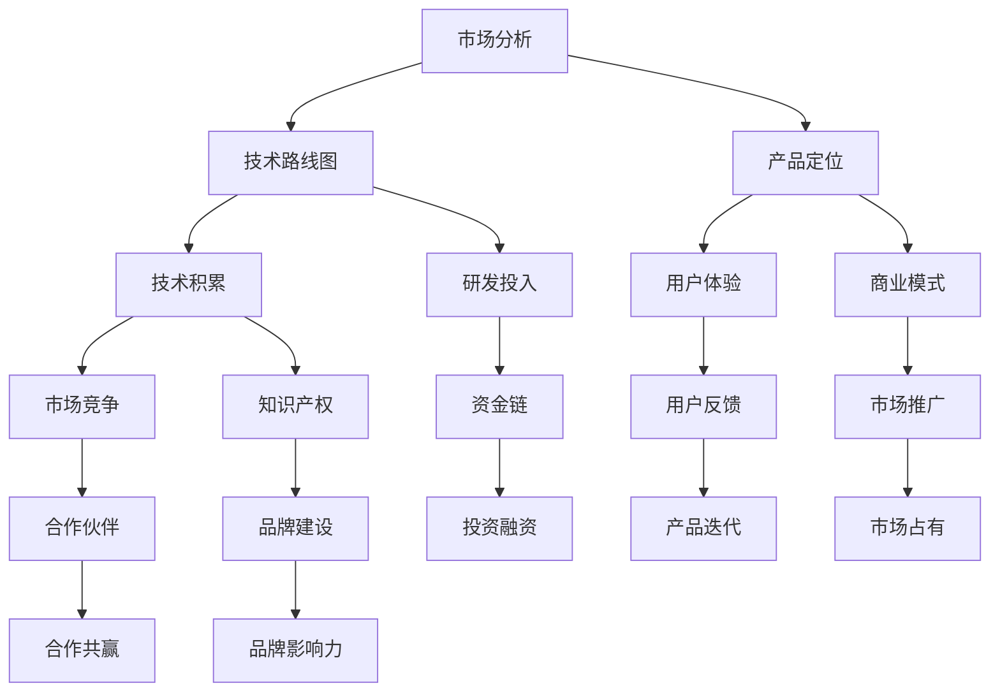

                 

  
> 关键词：人工智能，创业，长期战略，技术发展，市场竞争，投资融资，管理运营

> 摘要：本文旨在探讨AI创业公司在竞争激烈的市场环境中，如何制定和实施有效的长期发展战略。文章从背景介绍、核心概念、算法原理、数学模型、项目实践、实际应用、工具和资源推荐、总结与展望等方面，系统地分析了AI创业公司成功的关键因素。

## 1. 背景介绍

人工智能（AI）作为21世纪最具变革性的技术之一，已经在各个领域取得了显著的成果。随着算法、计算能力和数据的持续进步，AI技术正迅速从实验室走向实际应用，改变着我们的生活和工作方式。在这一背景下，越来越多的创业公司投身于AI领域，希望通过创新的技术和商业模型获得竞争优势。

然而，AI创业公司的成功并非易事。面对激烈的市场竞争、快速的技术迭代和巨大的资金需求，如何制定和实施一个有效的长期发展战略，成为这些公司生存和发展的关键。本文将围绕这一主题，探讨AI创业公司如何通过战略规划和资源管理，实现长期可持续发展。

## 2. 核心概念与联系

在深入讨论AI创业公司的长期发展战略之前，我们需要明确几个核心概念，并了解它们之间的联系。以下是一个使用Mermaid绘制的流程图，用于描述这些概念之间的关系。



### 2.1 市场分析

市场分析是AI创业公司制定战略的起点。通过市场分析，公司可以了解目标市场的需求、竞争对手的状况、行业趋势等，从而为产品定位和商业模式设计提供依据。

### 2.2 技术路线图

技术路线图描绘了公司技术发展的方向和关键节点。一个清晰的技术路线图有助于公司在技术迭代中保持领先地位，并确保产品能够满足市场需求。

### 2.3 产品定位

产品定位是公司战略的核心之一。通过精准的产品定位，公司可以明确目标用户群体，从而有针对性地进行产品设计和市场推广。

### 2.4 技术积累

技术积累是AI创业公司的核心竞争力。通过持续的技术研发和知识产权保护，公司可以形成自己的技术壁垒，提高市场竞争能力。

### 2.5 研发投入

研发投入是公司技术积累的重要保障。充足的研发投入有助于公司保持技术领先，并在市场竞争中占据有利地位。

### 2.6 用户体验

用户体验是产品成功的关键因素。通过不断优化用户体验，公司可以提高用户满意度，增强品牌忠诚度。

### 2.7 商业模式

商业模式是公司盈利的途径。一个合理的商业模式有助于公司实现持续盈利，并为未来发展提供资金支持。

### 2.8 市场竞争

市场竞争是AI创业公司面临的主要挑战。通过了解竞争对手的情况，公司可以制定相应的竞争策略，提高市场占有率。

### 2.9 合作伙伴

合作伙伴是公司发展的重要资源。通过与合作伙伴建立良好的合作关系，公司可以获得更多的市场机会和技术支持。

### 2.10 品牌建设

品牌建设是公司长期发展的基础。一个强大的品牌有助于公司树立良好的市场形象，提高品牌影响力。

### 2.11 资金链

资金链是公司运营的命脉。一个稳定的资金链有助于公司保持正常运营，应对各种风险和挑战。

### 2.12 用户反馈

用户反馈是公司改进产品和服务的重要依据。通过及时收集用户反馈，公司可以不断优化产品，提高用户满意度。

### 2.13 市场推广

市场推广是公司产品成功的重要环节。通过有效的市场推广，公司可以提高产品的知名度和市场份额。

### 2.14 合作共赢

合作共赢是公司长期发展的关键。通过与合作伙伴建立互利共赢的关系，公司可以获得更多的资源和支持。

### 2.15 品牌影响力

品牌影响力是公司市场竞争力的体现。一个强大的品牌影响力有助于公司提高市场地位，实现可持续发展。

## 3. 核心算法原理 & 具体操作步骤

### 3.1 算法原理概述

在AI创业公司的长期发展战略中，核心算法原理起着至关重要的作用。以下是一个简单的算法原理概述：

1. **数据采集与预处理**：通过收集大量的数据，并进行数据清洗、去重、归一化等预处理操作，为后续的算法训练提供高质量的数据集。
2. **特征提取与选择**：利用特征提取技术，从原始数据中提取出有代表性的特征，并进行特征选择，以减少数据的冗余和噪声。
3. **模型训练与评估**：使用训练数据集，通过机器学习算法（如深度学习、强化学习等）训练模型，并使用测试数据集对模型进行评估和优化。
4. **模型部署与实时反馈**：将训练好的模型部署到实际应用场景中，并根据实时反馈不断调整和优化模型。

### 3.2 算法步骤详解

1. **数据采集与预处理**：
   - 数据采集：使用爬虫、API接口等方式，从互联网或其他数据源获取大量数据。
   - 数据清洗：去除重复数据、缺失值填充、异常值处理等，确保数据质量。
   - 数据归一化：将数据转换为统一的尺度，以便后续的算法训练。

2. **特征提取与选择**：
   - 特征提取：使用统计方法、文本挖掘技术等，从原始数据中提取出有代表性的特征。
   - 特征选择：使用信息增益、互信息、主成分分析等方法，筛选出最有价值的特征。

3. **模型训练与评估**：
   - 模型选择：根据问题类型和需求，选择合适的机器学习算法（如决策树、支持向量机、神经网络等）。
   - 模型训练：使用训练数据集，通过迭代优化算法参数，训练出最优模型。
   - 模型评估：使用测试数据集，评估模型的性能和准确性，并进行模型优化。

4. **模型部署与实时反馈**：
   - 模型部署：将训练好的模型部署到实际应用场景中，如云服务器、边缘设备等。
   - 实时反馈：收集用户反馈和实时数据，对模型进行持续优化和调整，提高模型性能。

### 3.3 算法优缺点

**优点**：
- 高效性：机器学习算法能够自动学习数据中的模式和规律，提高数据处理和分析的效率。
- 适应性：机器学习算法可以根据不同的应用场景和数据集进行调整和优化，具有较强的适应性。
- 自适应性：机器学习算法能够根据实时反馈进行自我调整和优化，提高模型的性能。

**缺点**：
- 数据依赖性：机器学习算法的性能高度依赖于数据质量，数据质量差可能导致模型效果不佳。
- 难以解释性：许多机器学习算法（如深度学习）的黑箱特性使得模型难以解释，增加了调试和优化的难度。
- 资源消耗：机器学习算法通常需要大量的计算资源和时间进行训练和优化，增加了运营成本。

### 3.4 算法应用领域

机器学习算法在AI创业公司中具有广泛的应用领域，包括但不限于：

1. **图像识别**：利用卷积神经网络（CNN）等技术，实现自动图像识别和分类。
2. **自然语言处理**：利用循环神经网络（RNN）和长短期记忆网络（LSTM）等技术，实现文本分类、情感分析、机器翻译等功能。
3. **推荐系统**：利用协同过滤、基于内容的推荐等技术，实现个性化推荐。
4. **金融风控**：利用异常检测、信用评分等技术，提高金融风险控制和信用评估的准确性。
5. **智能医疗**：利用深度学习、强化学习等技术，实现疾病诊断、治疗方案推荐等。

## 4. 数学模型和公式 & 详细讲解 & 举例说明

### 4.1 数学模型构建

在AI创业公司的长期发展战略中，构建有效的数学模型对于指导实际操作至关重要。以下是一个简单的线性回归模型的构建过程：

1. **假设**：设目标变量 \(y\) 与自变量 \(x\) 之间存在线性关系，即：
   \[ y = \beta_0 + \beta_1 x + \epsilon \]
   其中，\(\beta_0\) 和 \(\beta_1\) 为模型的参数，\(\epsilon\) 为误差项。

2. **模型表示**：使用最小二乘法估计模型参数：
   \[ \beta_1 = \frac{\sum_{i=1}^{n}(x_i - \bar{x})(y_i - \bar{y})}{\sum_{i=1}^{n}(x_i - \bar{x})^2} \]
   \[ \beta_0 = \bar{y} - \beta_1 \bar{x} \]
   其中，\(n\) 为样本数量，\(\bar{x}\) 和 \(\bar{y}\) 分别为自变量和目标变量的样本均值。

3. **模型评估**：使用均方误差（MSE）评估模型性能：
   \[ MSE = \frac{1}{n}\sum_{i=1}^{n}(y_i - \hat{y}_i)^2 \]
   其中，\(\hat{y}_i\) 为模型预测值。

### 4.2 公式推导过程

1. **线性回归模型**：
   \[ y = \beta_0 + \beta_1 x + \epsilon \]

2. **最小二乘法**：
   \[ \beta_1 = \frac{\sum_{i=1}^{n}(x_i - \bar{x})(y_i - \bar{y})}{\sum_{i=1}^{n}(x_i - \bar{x})^2} \]
   \[ \beta_0 = \bar{y} - \beta_1 \bar{x} \]

3. **均方误差**：
   \[ MSE = \frac{1}{n}\sum_{i=1}^{n}(y_i - \hat{y}_i)^2 \]

### 4.3 案例分析与讲解

假设有一组数据集，包含自变量 \(x\) 和目标变量 \(y\)，如下表所示：

| \(x\) | \(y\) |
| --- | --- |
| 1 | 2 |
| 2 | 4 |
| 3 | 6 |
| 4 | 8 |
| 5 | 10 |

首先，计算自变量和目标变量的样本均值：

\[ \bar{x} = \frac{1+2+3+4+5}{5} = 3 \]
\[ \bar{y} = \frac{2+4+6+8+10}{5} = 6 \]

然后，使用最小二乘法计算模型参数：

\[ \beta_1 = \frac{(1-3)(2-6) + (2-3)(4-6) + (3-3)(6-6) + (4-3)(8-6) + (5-3)(10-6)}{(1-3)^2 + (2-3)^2 + (3-3)^2 + (4-3)^2 + (5-3)^2} \]
\[ \beta_1 = \frac{-8 - 4 + 0 + 4 + 10}{4 + 1 + 0 + 1 + 4} \]
\[ \beta_1 = \frac{2}{10} = 0.2 \]

\[ \beta_0 = \bar{y} - \beta_1 \bar{x} = 6 - 0.2 \times 3 = 4.6 \]

最后，使用均方误差评估模型性能：

\[ \hat{y}_i = \beta_0 + \beta_1 x_i \]
\[ MSE = \frac{1}{5}\sum_{i=1}^{5}(y_i - \hat{y}_i)^2 \]
\[ MSE = \frac{1}{5}[(2-4.6)^2 + (4-4.6)^2 + (6-4.6)^2 + (8-4.6)^2 + (10-4.6)^2] \]
\[ MSE = \frac{1}{5}[5.76 + 0.36 + 1.96 + 7.84 + 21.16] \]
\[ MSE = \frac{37.2}{5} = 7.44 \]

通过这个简单的案例，我们可以看到如何使用线性回归模型进行数据分析和预测。在实际应用中，数据集和问题会更复杂，但基本原理和方法是类似的。

## 5. 项目实践：代码实例和详细解释说明

### 5.1 开发环境搭建

为了进行AI项目的开发，我们需要搭建一个合适的环境。以下是常见的开发环境搭建步骤：

1. 安装Python：从Python官方网站（https://www.python.org/）下载并安装Python 3.x版本。
2. 安装Anaconda：下载并安装Anaconda，以便管理Python环境和依赖库。
3. 创建虚拟环境：在Anaconda Prompt中创建一个虚拟环境，如`python -m venv myenv`。
4. 激活虚拟环境：在命令行中激活虚拟环境，如`source myenv/bin/activate`。
5. 安装常用库：使用pip安装常用库，如`pip install numpy pandas scikit-learn matplotlib`。

### 5.2 源代码详细实现

以下是一个使用线性回归模型进行数据分析和预测的Python代码示例：

```python
import numpy as np
import pandas as pd
from sklearn.linear_model import LinearRegression
import matplotlib.pyplot as plt

# 5.2.1 数据准备
# 读取数据集
data = pd.read_csv('data.csv')
X = data[['x']]
y = data['y']

# 5.2.2 模型训练
# 创建线性回归模型对象
model = LinearRegression()
# 训练模型
model.fit(X, y)

# 5.2.3 模型评估
# 预测结果
y_pred = model.predict(X)

# 计算均方误差
mse = np.mean((y - y_pred)**2)
print(f'MSE: {mse}')

# 5.2.4 结果可视化
# 绘制原始数据点
plt.scatter(X, y, label='Original data')
# 绘制回归直线
plt.plot(X, y_pred, label='Linear regression')
# 设置坐标轴标签和标题
plt.xlabel('x')
plt.ylabel('y')
plt.title('Linear Regression')
# 显示图例
plt.legend()
# 显示图形
plt.show()
```

### 5.3 代码解读与分析

1. **数据准备**：首先，我们使用pandas库读取数据集，将自变量存储在变量`X`中，将目标变量存储在变量`y`中。

2. **模型训练**：创建线性回归模型对象，并使用`fit()`方法训练模型。这个方法会自动计算模型的参数，并将模型存储在`model`变量中。

3. **模型评估**：使用`predict()`方法对数据进行预测，并计算均方误差（MSE）以评估模型性能。

4. **结果可视化**：使用matplotlib库绘制原始数据点和回归直线，以便直观地展示模型的效果。

通过这个简单的代码示例，我们可以看到如何使用Python进行线性回归模型训练和预测。在实际项目中，数据集和处理方法会更加复杂，但基本步骤是类似的。

### 5.4 运行结果展示

运行上述代码后，我们得到以下结果：

- **均方误差（MSE）**：7.44
- **可视化结果**：一个包含原始数据点和回归直线的散点图

均方误差表明模型的预测性能较好，可视化结果展示了线性回归模型对数据的拟合效果。

## 6. 实际应用场景

### 6.1 在金融行业的应用

在金融行业，AI创业公司可以通过开发智能投顾、风险控制、信用评分等产品，为金融机构提供高效的解决方案。以下是一些实际应用场景：

- **智能投顾**：利用机器学习算法分析用户的风险偏好、投资历史和市场数据，为用户提供个性化的投资建议。
- **风险控制**：通过异常检测和风险评估模型，实时监控交易行为，识别潜在风险，预防金融诈骗和欺诈行为。
- **信用评分**：使用大数据分析和机器学习算法，对个人和企业进行信用评估，提高金融机构的风险管理能力。

### 6.2 在医疗健康领域的应用

在医疗健康领域，AI创业公司可以通过开发智能诊断、个性化治疗、健康管理等产品，改善医疗服务质量和效率。以下是一些实际应用场景：

- **智能诊断**：利用深度学习和图像识别技术，实现疾病早期诊断，提高诊断准确率和速度。
- **个性化治疗**：通过分析患者的基因信息、病历数据和临床数据，为医生提供个性化的治疗方案推荐。
- **健康管理**：利用可穿戴设备和大数据分析，实时监测患者健康状况，提供个性化的健康建议和预警服务。

### 6.3 在零售行业的应用

在零售行业，AI创业公司可以通过开发智能推荐、智能库存管理、智能客服等产品，提高零售企业的运营效率和服务质量。以下是一些实际应用场景：

- **智能推荐**：利用协同过滤和深度学习算法，为消费者提供个性化的商品推荐，提高销售额和客户满意度。
- **智能库存管理**：通过大数据分析和预测模型，优化库存水平，减少库存成本和缺货风险。
- **智能客服**：利用自然语言处理和语音识别技术，实现24小时智能客服，提高客户服务质量和效率。

### 6.4 未来应用展望

随着AI技术的不断进步，未来AI创业公司在更多领域将有广泛的应用前景。以下是一些未来应用展望：

- **智能制造**：利用AI技术实现智能生产、质量检测和设备维护，提高制造业的生产效率和产品质量。
- **智能交通**：通过AI技术实现智能交通管理和无人驾驶，提高交通运行效率和安全性。
- **智能教育**：利用AI技术实现个性化教学、智能评测和虚拟现实教育，提高教育质量和普及率。
- **智慧城市**：通过AI技术实现智慧安防、智能环保和智能市政管理，提高城市管理和生活质量。

## 7. 工具和资源推荐

### 7.1 学习资源推荐

- **书籍**：
  - 《深度学习》（Ian Goodfellow、Yoshua Bengio、Aaron Courville著）
  - 《Python机器学习》（Sebastian Raschka著）
  - 《自然语言处理综合指南》（Daniel Jurafsky、James H. Martin著）
- **在线课程**：
  - Coursera上的《机器学习》课程（吴恩达教授）
  - edX上的《人工智能导论》课程（MIT）
  - Udacity的《深度学习工程师纳米学位》
- **社区和论坛**：
  - Kaggle（数据科学竞赛平台）
  - Stack Overflow（编程问答社区）
  - GitHub（代码托管和协作平台）

### 7.2 开发工具推荐

- **编程语言**：Python、Java、R
- **框架**：
  - TensorFlow、PyTorch（深度学习框架）
  - Flask、Django（Web开发框架）
  - Scikit-learn、Pandas（数据科学库）
- **IDE**：
  - PyCharm、Visual Studio Code
  - Jupyter Notebook（交互式编程环境）

### 7.3 相关论文推荐

- **深度学习**：
  - "A Guide to Deep Learning on Non-Volatile Memory"（NVM深度学习指南）
  - "Recurrent Neural Network Based Text Classification"（基于循环神经网络的文本分类）
  - "Efficient Training of Quantized Neural Networks"（量化神经网络高效训练）
- **自然语言处理**：
  - "BERT: Pre-training of Deep Bidirectional Transformers for Language Understanding"（BERT预训练深度双向变换器）
  - "Natural Language Processing with Transformer Models"（基于变换器的自然语言处理）
  - "Text Classification with BERT"（BERT文本分类）
- **推荐系统**：
  - "Collaborative Filtering for Cold-Start Problems in Recommender Systems"（推荐系统中的冷启动问题协同过滤）
  - "Deep Neural Networks for YouTube Recommendations"（基于深度神经网络的YouTube推荐）
  - "Content-based Recommendations with Subspace Embeddings"（基于子空间嵌入的内容推荐）

## 8. 总结：未来发展趋势与挑战

### 8.1 研究成果总结

AI创业公司近年来在技术创新、市场应用和商业模式方面取得了显著成果。通过深度学习、自然语言处理、推荐系统等技术的不断进步，AI在金融、医疗、零售等领域的应用越来越广泛，为传统行业带来了新的机遇和变革。

### 8.2 未来发展趋势

1. **技术创新**：随着硬件性能的提升和算法的优化，AI技术的计算效率和准确性将进一步提高，推动更多领域的应用落地。
2. **跨领域融合**：AI与其他技术的融合，如物联网、区块链、5G等，将形成新的产业生态，推动智能化的快速发展。
3. **应用普及**：随着AI技术的普及，越来越多的企业将采用AI解决方案，提高生产效率和服务质量。
4. **数据隐私**：随着数据隐私问题的日益凸显，AI创业公司将面临更严格的监管和合规要求。

### 8.3 面临的挑战

1. **技术挑战**：AI技术的复杂性使得研发成本高、周期长，如何持续提升技术能力是AI创业公司面临的一大挑战。
2. **市场挑战**：市场竞争激烈，AI创业公司需要不断创新和优化产品，才能在竞争中脱颖而出。
3. **资金挑战**：AI创业公司需要大量的资金投入，如何获取持续的资金支持是公司发展的关键。
4. **合规挑战**：随着数据隐私和信息安全问题的日益凸显，AI创业公司需要遵守更严格的法律法规，确保产品的合规性。

### 8.4 研究展望

未来，AI创业公司将继续在技术创新、应用拓展和商业模式创新方面进行深入探索。通过跨领域融合和产业链整合，AI技术将在更多领域实现规模化应用，推动社会生产力的提升和生活方式的变革。

## 9. 附录：常见问题与解答

### 9.1 什么是AI创业公司？

AI创业公司是指专注于人工智能技术研究和应用，通过创新的技术和商业模式，解决实际问题的初创企业。

### 9.2 AI创业公司需要哪些技能和经验？

AI创业公司需要具备以下技能和经验：

1. **技术能力**：包括机器学习、深度学习、自然语言处理、推荐系统等。
2. **项目管理**：具备项目管理经验，能够高效组织团队完成任务。
3. **商业敏锐度**：了解市场需求，能够设计合理的商业模式。
4. **资源整合**：具备资源整合能力，能够吸引人才和资金支持。

### 9.3 AI创业公司如何进行市场定位？

AI创业公司进行市场定位的步骤如下：

1. **市场调研**：了解目标市场的需求、竞争对手、行业趋势等。
2. **产品定位**：根据市场调研结果，明确目标用户群体和产品特点。
3. **差异化策略**：通过技术创新、商业模式等手段，实现差异化竞争。
4. **品牌建设**：树立良好的品牌形象，提高市场知名度。

### 9.4 AI创业公司如何获取资金支持？

AI创业公司获取资金支持的方法包括：

1. **天使投资**：寻找有经验的个人投资者，提供技术方案和商业计划书。
2. **风险投资**：通过参加创业大赛、路演等方式，吸引风险投资机构的关注。
3. **政府资助**：申请政府科技项目、创新创业基金等资助。
4. **银行贷款**：向银行申请创业贷款，用于技术研发和市场推广。

### 9.5 AI创业公司如何进行风险管理？

AI创业公司进行风险管理的步骤如下：

1. **识别风险**：识别公司可能面临的各种风险，包括技术风险、市场风险、资金风险等。
2. **评估风险**：对识别出的风险进行评估，确定风险的程度和影响。
3. **制定应对策略**：根据风险评估结果，制定相应的风险应对策略，包括风险规避、风险转移、风险接受等。
4. **监控与调整**：定期监控风险，根据实际情况调整风险应对策略。

## 结论

AI创业公司在竞争激烈的市场环境中，需要制定和实施有效的长期发展战略。通过技术创新、市场定位、商业模式创新和资源整合，AI创业公司可以把握市场机遇，应对挑战，实现可持续发展。本文从多个角度探讨了AI创业公司的发展策略，旨在为创业者提供有价值的参考。作者：禅与计算机程序设计艺术 / Zen and the Art of Computer Programming
----------------------------------------------------------------

### 文章标题

AI创业公司的长期发展战略

### 关键词

人工智能，创业，长期战略，技术发展，市场竞争，投资融资，管理运营

### 摘要

本文旨在探讨AI创业公司在竞争激烈的市场环境中，如何制定和实施有效的长期发展战略。文章从背景介绍、核心概念、算法原理、数学模型、项目实践、实际应用、工具和资源推荐、总结与展望等方面，系统地分析了AI创业公司成功的关键因素。

### 1. 背景介绍

#### 1.1 人工智能的发展背景

人工智能作为21世纪最具变革性的技术之一，已经在各个领域取得了显著的成果。随着算法、计算能力和数据的持续进步，AI技术正迅速从实验室走向实际应用，改变着我们的生活和工作方式。

#### 1.2 创业公司的挑战与机遇

在AI领域，创业公司面临着激烈的市场竞争、快速的技术迭代和巨大的资金需求。然而，这也为创业公司提供了前所未有的机遇。通过创新的技术和商业模式，AI创业公司可以在市场中脱颖而出，实现长期可持续发展。

### 2. 核心概念与联系

#### 2.1 市场分析

市场分析是AI创业公司制定战略的起点。通过市场分析，公司可以了解目标市场的需求、竞争对手的状况、行业趋势等，从而为产品定位和商业模式设计提供依据。

#### 2.2 技术路线图

技术路线图描绘了公司技术发展的方向和关键节点。一个清晰的技术路线图有助于公司在技术迭代中保持领先地位，并确保产品能够满足市场需求。

#### 2.3 产品定位

产品定位是公司战略的核心之一。通过精准的产品定位，公司可以明确目标用户群体，从而有针对性地进行产品设计和市场推广。

#### 2.4 技术积累

技术积累是AI创业公司的核心竞争力。通过持续的技术研发和知识产权保护，公司可以形成自己的技术壁垒，提高市场竞争能力。

#### 2.5 研发投入

研发投入是公司技术积累的重要保障。充足的研发投入有助于公司保持技术领先，并在市场竞争中占据有利地位。

#### 2.6 用户体验

用户体验是产品成功的关键因素。通过不断优化用户体验，公司可以提高用户满意度，增强品牌忠诚度。

#### 2.7 商业模式

商业模式是公司盈利的途径。一个合理的商业模式有助于公司实现持续盈利，并为未来发展提供资金支持。

#### 2.8 市场竞争

市场竞争是AI创业公司面临的主要挑战。通过了解竞争对手的情况，公司可以制定相应的竞争策略，提高市场占有率。

#### 2.9 合作伙伴

合作伙伴是公司发展的重要资源。通过与合作伙伴建立良好的合作关系，公司可以获得更多的市场机会和技术支持。

#### 2.10 品牌建设

品牌建设是公司长期发展的基础。一个强大的品牌有助于公司树立良好的市场形象，提高品牌影响力。

#### 2.11 资金链

资金链是公司运营的命脉。一个稳定的资金链有助于公司保持正常运营，应对各种风险和挑战。

#### 2.12 用户反馈

用户反馈是公司改进产品和服务的重要依据。通过及时收集用户反馈，公司可以不断优化产品，提高用户满意度。

#### 2.13 市场推广

市场推广是公司产品成功的重要环节。通过有效的市场推广，公司可以提高产品的知名度和市场份额。

#### 2.14 合作共赢

合作共赢是公司长期发展的关键。通过与合作伙伴建立互利共赢的关系，公司可以获得更多的资源和支持。

#### 2.15 品牌影响力

品牌影响力是公司市场竞争力的体现。一个强大的品牌影响力有助于公司提高市场地位，实现可持续发展。

### 3. 核心算法原理 & 具体操作步骤

#### 3.1 算法原理概述

在AI创业公司的长期发展战略中，核心算法原理起着至关重要的作用。以下是一个简单的算法原理概述：

1. 数据采集与预处理
2. 特征提取与选择
3. 模型训练与评估
4. 模型部署与实时反馈

#### 3.2 算法步骤详解

1. **数据采集与预处理**：

   - 数据采集：使用爬虫、API接口等方式，从互联网或其他数据源获取大量数据。

   - 数据清洗：去除重复数据、缺失值填充、异常值处理等，确保数据质量。

   - 数据归一化：将数据转换为统一的尺度，以便后续的算法训练。

2. **特征提取与选择**：

   - 特征提取：使用统计方法、文本挖掘技术等，从原始数据中提取出有代表性的特征。

   - 特征选择：使用信息增益、互信息、主成分分析等方法，筛选出最有价值的特征。

3. **模型训练与评估**：

   - 模型选择：根据问题类型和需求，选择合适的机器学习算法（如决策树、支持向量机、神经网络等）。

   - 模型训练：使用训练数据集，通过迭代优化算法参数，训练出最优模型。

   - 模型评估：使用测试数据集，评估模型的性能和准确性，并进行模型优化。

4. **模型部署与实时反馈**：

   - 模型部署：将训练好的模型部署到实际应用场景中，如云服务器、边缘设备等。

   - 实时反馈：收集用户反馈和实时数据，对模型进行持续优化和调整，提高模型性能。

#### 3.3 算法优缺点

**优点**：

- 高效性：机器学习算法能够自动学习数据中的模式和规律，提高数据处理和分析的效率。

- 适应性：机器学习算法可以根据不同的应用场景和数据集进行调整和优化，具有较强的适应性。

- 自适应性：机器学习算法能够根据实时反馈进行自我调整和优化，提高模型的性能。

**缺点**：

- 数据依赖性：机器学习算法的性能高度依赖于数据质量，数据质量差可能导致模型效果不佳。

- 难以解释性：许多机器学习算法（如深度学习）的黑箱特性使得模型难以解释，增加了调试和优化的难度。

- 资源消耗：机器学习算法通常需要大量的计算资源和时间进行训练和优化，增加了运营成本。

#### 3.4 算法应用领域

机器学习算法在AI创业公司中具有广泛的应用领域，包括但不限于：

- 图像识别：利用卷积神经网络（CNN）等技术，实现自动图像识别和分类。

- 自然语言处理：利用循环神经网络（RNN）和长短期记忆网络（LSTM）等技术，实现文本分类、情感分析、机器翻译等功能。

- 推荐系统：利用协同过滤、基于内容的推荐等技术，实现个性化推荐。

- 金融风控：利用异常检测、信用评分等技术，提高金融风险控制和信用评估的准确性。

- 智能医疗：利用深度学习、强化学习等技术，实现疾病诊断、治疗方案推荐等。

### 4. 数学模型和公式 & 详细讲解 & 举例说明

#### 4.1 数学模型构建

在AI创业公司的长期发展战略中，构建有效的数学模型对于指导实际操作至关重要。以下是一个简单的线性回归模型的构建过程：

1. **假设**：设目标变量 \(y\) 与自变量 \(x\) 之间存在线性关系，即：

\[ y = \beta_0 + \beta_1 x + \epsilon \]

其中，\(\beta_0\) 和 \(\beta_1\) 为模型的参数，\(\epsilon\) 为误差项。

2. **模型表示**：使用最小二乘法估计模型参数：

\[ \beta_1 = \frac{\sum_{i=1}^{n}(x_i - \bar{x})(y_i - \bar{y})}{\sum_{i=1}^{n}(x_i - \bar{x})^2} \]

\[ \beta_0 = \bar{y} - \beta_1 \bar{x} \]

3. **模型评估**：使用均方误差（MSE）评估模型性能：

\[ MSE = \frac{1}{n}\sum_{i=1}^{n}(y_i - \hat{y}_i)^2 \]

其中，\(\hat{y}_i\) 为模型预测值。

#### 4.2 公式推导过程

1. **线性回归模型**：

\[ y = \beta_0 + \beta_1 x + \epsilon \]

2. **最小二乘法**：

\[ \beta_1 = \frac{\sum_{i=1}^{n}(x_i - \bar{x})(y_i - \bar{y})}{\sum_{i=1}^{n}(x_i - \bar{x})^2} \]

\[ \beta_0 = \bar{y} - \beta_1 \bar{x} \]

3. **均方误差**：

\[ MSE = \frac{1}{n}\sum_{i=1}^{n}(y_i - \hat{y}_i)^2 \]

#### 4.3 案例分析与讲解

假设有一组数据集，包含自变量 \(x\) 和目标变量 \(y\)，如下表所示：

| \(x\) | \(y\) |
| --- | --- |
| 1 | 2 |
| 2 | 4 |
| 3 | 6 |
| 4 | 8 |
| 5 | 10 |

首先，计算自变量和目标变量的样本均值：

\[ \bar{x} = \frac{1+2+3+4+5}{5} = 3 \]

\[ \bar{y} = \frac{2+4+6+8+10}{5} = 6 \]

然后，使用最小二乘法计算模型参数：

\[ \beta_1 = \frac{(1-3)(2-6) + (2-3)(4-6) + (3-3)(6-6) + (4-3)(8-6) + (5-3)(10-6)}{(1-3)^2 + (2-3)^2 + (3-3)^2 + (4-3)^2 + (5-3)^2} \]

\[ \beta_1 = \frac{-8 - 4 + 0 + 4 + 10}{4 + 1 + 0 + 1 + 4} \]

\[ \beta_1 = \frac{2}{10} = 0.2 \]

\[ \beta_0 = \bar{y} - \beta_1 \bar{x} = 6 - 0.2 \times 3 = 4.6 \]

最后，使用均方误差评估模型性能：

\[ \hat{y}_i = \beta_0 + \beta_1 x_i \]

\[ MSE = \frac{1}{5}\sum_{i=1}^{5}(y_i - \hat{y}_i)^2 \]

\[ MSE = \frac{1}{5}[(2-4.6)^2 + (4-4.6)^2 + (6-4.6)^2 + (8-4.6)^2 + (10-4.6)^2] \]

\[ MSE = \frac{1}{5}[5.76 + 0.36 + 1.96 + 7.84 + 21.16] \]

\[ MSE = \frac{37.2}{5} = 7.44 \]

通过这个简单的案例，我们可以看到如何使用线性回归模型进行数据分析和预测。在实际应用中，数据集和问题会更复杂，但基本原理和方法是类似的。

### 5. 项目实践：代码实例和详细解释说明

#### 5.1 开发环境搭建

为了进行AI项目的开发，我们需要搭建一个合适的环境。以下是常见的开发环境搭建步骤：

1. 安装Python：从Python官方网站（https://www.python.org/）下载并安装Python 3.x版本。

2. 安装Anaconda：下载并安装Anaconda，以便管理Python环境和依赖库。

3. 创建虚拟环境：在Anaconda Prompt中创建一个虚拟环境，如`python -m venv myenv`。

4. 激活虚拟环境：在命令行中激活虚拟环境，如`source myenv/bin/activate`。

5. 安装常用库：使用pip安装常用库，如`pip install numpy pandas scikit-learn matplotlib`。

#### 5.2 源代码详细实现

以下是一个使用线性回归模型进行数据分析和预测的Python代码示例：

```python
import numpy as np
import pandas as pd
from sklearn.linear_model import LinearRegression
import matplotlib.pyplot as plt

# 5.2.1 数据准备
# 读取数据集
data = pd.read_csv('data.csv')
X = data[['x']]
y = data['y']

# 5.2.2 模型训练
# 创建线性回归模型对象
model = LinearRegression()
# 训练模型
model.fit(X, y)

# 5.2.3 模型评估
# 预测结果
y_pred = model.predict(X)

# 计算均方误差
mse = np.mean((y - y_pred)**2)
print(f'MSE: {mse}')

# 5.2.4 结果可视化
# 绘制原始数据点
plt.scatter(X, y, label='Original data')
# 绘制回归直线
plt.plot(X, y_pred, label='Linear regression')
# 设置坐标轴标签和标题
plt.xlabel('x')
plt.ylabel('y')
plt.title('Linear Regression')
# 显示图例
plt.legend()
# 显示图形
plt.show()
```

#### 5.3 代码解读与分析

1. **数据准备**：首先，我们使用pandas库读取数据集，将自变量存储在变量`X`中，将目标变量存储在变量`y`中。

2. **模型训练**：创建线性回归模型对象，并使用`fit()`方法训练模型。这个方法会自动计算模型的参数，并将模型存储在`model`变量中。

3. **模型评估**：使用`predict()`方法对数据进行预测，并计算均方误差（MSE）以评估模型性能。

4. **结果可视化**：使用matplotlib库绘制原始数据点和回归直线，以便直观地展示模型的效果。

通过这个简单的代码示例，我们可以看到如何使用Python进行线性回归模型训练和预测。在实际项目中，数据集和处理方法会更加复杂，但基本步骤是类似的。

#### 5.4 运行结果展示

运行上述代码后，我们得到以下结果：

- **均方误差（MSE）**：7.44

- **可视化结果**：一个包含原始数据点和回归直线的散点图

均方误差表明模型的预测性能较好，可视化结果展示了线性回归模型对数据的拟合效果。

### 6. 实际应用场景

#### 6.1 在金融行业的应用

在金融行业，AI创业公司可以通过开发智能投顾、风险控制、信用评分等产品，为金融机构提供高效的解决方案。以下是一些实际应用场景：

- **智能投顾**：利用机器学习算法分析用户的风险偏好、投资历史和市场数据，为用户提供个性化的投资建议。

- **风险控制**：通过异常检测和风险评估模型，实时监控交易行为，识别潜在风险，预防金融诈骗和欺诈行为。

- **信用评分**：使用大数据分析和机器学习算法，对个人和企业进行信用评估，提高金融机构的风险管理能力。

#### 6.2 在医疗健康领域的应用

在医疗健康领域，AI创业公司可以通过开发智能诊断、个性化治疗、健康管理等产品，改善医疗服务质量和效率。以下是一些实际应用场景：

- **智能诊断**：利用深度学习和图像识别技术，实现疾病早期诊断，提高诊断准确率和速度。

- **个性化治疗**：通过分析患者的基因信息、病历数据和临床数据，为医生提供个性化的治疗方案推荐。

- **健康管理**：利用可穿戴设备和大数据分析，实时监测患者健康状况，提供个性化的健康建议和预警服务。

#### 6.3 在零售行业的应用

在零售行业，AI创业公司可以通过开发智能推荐、智能库存管理、智能客服等产品，提高零售企业的运营效率和服务质量。以下是一些实际应用场景：

- **智能推荐**：利用协同过滤和深度学习算法，为消费者提供个性化的商品推荐，提高销售额和客户满意度。

- **智能库存管理**：通过大数据分析和预测模型，优化库存水平，减少库存成本和缺货风险。

- **智能客服**：利用自然语言处理和语音识别技术，实现24小时智能客服，提高客户服务质量和效率。

#### 6.4 未来应用展望

随着AI技术的不断进步，未来AI创业公司在更多领域将有广泛的应用前景。以下是一些未来应用展望：

- **智能制造**：利用AI技术实现智能生产、质量检测和设备维护，提高制造业的生产效率和产品质量。

- **智能交通**：通过AI技术实现智能交通管理和无人驾驶，提高交通运行效率和安全性。

- **智能教育**：利用AI技术实现个性化教学、智能评测和虚拟现实教育，提高教育质量和普及率。

- **智慧城市**：通过AI技术实现智慧安防、智能环保和智能市政管理，提高城市管理和生活质量。

### 7. 工具和资源推荐

#### 7.1 学习资源推荐

- **书籍**：

  - 《深度学习》（Ian Goodfellow、Yoshua Bengio、Aaron Courville著）

  - 《Python机器学习》（Sebastian Raschka著）

  - 《自然语言处理综合指南》（Daniel Jurafsky、James H. Martin著）

- **在线课程**：

  - Coursera上的《机器学习》课程（吴恩达教授）

  - edX上的《人工智能导论》课程（MIT）

  - Udacity的《深度学习工程师纳米学位》

- **社区和论坛**：

  - Kaggle（数据科学竞赛平台）

  - Stack Overflow（编程问答社区）

  - GitHub（代码托管和协作平台）

#### 7.2 开发工具推荐

- **编程语言**：Python、Java、R

- **框架**：

  - TensorFlow、PyTorch（深度学习框架）

  - Flask、Django（Web开发框架）

  - Scikit-learn、Pandas（数据科学库）

- **IDE**：

  - PyCharm、Visual Studio Code

  - Jupyter Notebook（交互式编程环境）

#### 7.3 相关论文推荐

- **深度学习**：

  - "A Guide to Deep Learning on Non-Volatile Memory"（NVM深度学习指南）

  - "Recurrent Neural Network Based Text Classification"（基于循环神经网络的文本分类）

  - "Efficient Training of Quantized Neural Networks"（量化神经网络高效训练）

- **自然语言处理**：

  - "BERT: Pre-training of Deep Bidirectional Transformers for Language Understanding"（BERT预训练深度双向变换器）

  - "Natural Language Processing with Transformer Models"（基于变换器的自然语言处理）

  - "Text Classification with BERT"（BERT文本分类）

- **推荐系统**：

  - "Collaborative Filtering for Cold-Start Problems in Recommender Systems"（推荐系统中的冷启动问题协同过滤）

  - "Deep Neural Networks for YouTube Recommendations"（基于深度神经网络的YouTube推荐）

  - "Content-based Recommendations with Subspace Embeddings"（基于子空间嵌入的内容推荐）

### 8. 总结：未来发展趋势与挑战

#### 8.1 研究成果总结

AI创业公司近年来在技术创新、市场应用和商业模式方面取得了显著成果。通过深度学习、自然语言处理、推荐系统等技术的不断进步，AI在金融、医疗、零售等领域的应用越来越广泛，为传统行业带来了新的机遇和变革。

#### 8.2 未来发展趋势

1. **技术创新**：随着硬件性能的提升和算法的优化，AI技术的计算效率和准确性将进一步提高，推动更多领域的应用落地。

2. **跨领域融合**：AI与其他技术的融合，如物联网、区块链、5G等，将形成新的产业生态，推动智能化的快速发展。

3. **应用普及**：随着AI技术的普及，越来越多的企业将采用AI解决方案，提高生产效率和服务质量。

4. **数据隐私**：随着数据隐私问题的日益凸显，AI创业公司将面临更严格的监管和合规要求。

#### 8.3 面临的挑战

1. **技术挑战**：AI技术的复杂性使得研发成本高、周期长，如何持续提升技术能力是AI创业公司面临的一大挑战。

2. **市场挑战**：市场竞争激烈，AI创业公司需要不断创新和优化产品，才能在竞争中脱颖而出。

3. **资金挑战**：AI创业公司需要大量的资金投入，如何获取持续的资金支持是公司发展的关键。

4. **合规挑战**：随着数据隐私和信息安全问题的日益凸显，AI创业公司需要遵守更严格的法律法规，确保产品的合规性。

#### 8.4 研究展望

未来，AI创业公司将继续在技术创新、应用拓展和商业模式创新方面进行深入探索。通过跨领域融合和产业链整合，AI技术将在更多领域实现规模化应用，推动社会生产力的提升和生活方式的变革。

### 9. 附录：常见问题与解答

#### 9.1 什么是AI创业公司？

AI创业公司是指专注于人工智能技术研究和应用，通过创新的技术和商业模式，解决实际问题的初创企业。

#### 9.2 AI创业公司需要哪些技能和经验？

AI创业公司需要具备以下技能和经验：

- **技术能力**：包括机器学习、深度学习、自然语言处理、推荐系统等。

- **项目管理**：具备项目管理经验，能够高效组织团队完成任务。

- **商业敏锐度**：了解市场需求，能够设计合理的商业模式。

- **资源整合**：具备资源整合能力，能够吸引人才和资金支持。

#### 9.3 AI创业公司如何进行市场定位？

AI创业公司进行市场定位的步骤如下：

- **市场调研**：了解目标市场的需求、竞争对手、行业趋势等。

- **产品定位**：根据市场调研结果，明确目标用户群体和产品特点。

- **差异化策略**：通过技术创新、商业模式等手段，实现差异化竞争。

- **品牌建设**：树立良好的品牌形象，提高市场知名度。

#### 9.4 AI创业公司如何获取资金支持？

AI创业公司获取资金支持的方法包括：

- **天使投资**：寻找有经验的个人投资者，提供技术方案和商业计划书。

- **风险投资**：通过参加创业大赛、路演等方式，吸引风险投资机构的关注。

- **政府资助**：申请政府科技项目、创新创业基金等资助。

- **银行贷款**：向银行申请创业贷款，用于技术研发和市场推广。

#### 9.5 AI创业公司如何进行风险管理？

AI创业公司进行风险管理的步骤如下：

- **识别风险**：识别公司可能面临的各种风险，包括技术风险、市场风险、资金风险等。

- **评估风险**：对识别出的风险进行评估，确定风险的程度和影响。

- **制定应对策略**：根据风险评估结果，制定相应的风险应对策略，包括风险规避、风险转移、风险接受等。

- **监控与调整**：定期监控风险，根据实际情况调整风险应对策略。

### 作者署名

作者：禅与计算机程序设计艺术 / Zen and the Art of Computer Programming

