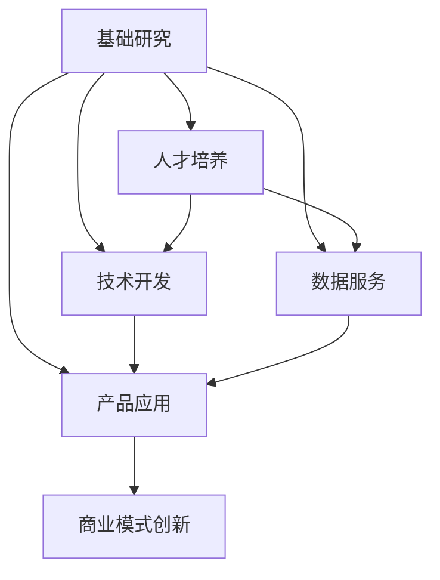

                 

关键词：AI创业、产业链、协同发展、技术趋势、生态构建

摘要：本文从AI创业的兴起背景出发，分析了产业链各环节的发展态势及协同效应，探讨了AI技术在各个领域的应用场景，展望了未来AI创业生态的发展趋势与挑战。

## 1. 背景介绍

近年来，人工智能（AI）技术的迅猛发展，带动了全球范围内的AI创业浪潮。AI创业生态日益丰富，不仅涌现出大量的初创企业，还吸引了众多资本的关注。这一现象背后，是AI技术在不同领域的广泛应用和商业模式的不断创新。

从产业链的角度来看，AI创业生态包括多个环节：基础研究、技术开发、产品应用、数据服务、人才培养等。这些环节相互关联、协同发展，共同推动了AI技术的进步和产业的繁荣。

## 2. 核心概念与联系

为了更好地理解AI创业生态的构建，我们需要明确一些核心概念和它们之间的联系。

### 2.1 AI创业的概念

AI创业是指依托人工智能技术，开发创新产品或服务，以满足市场需求或解决现实问题。AI创业的核心是技术创新，而商业模式创新则为其提供了广阔的发展空间。

### 2.2 产业链各环节

- **基础研究**：包括算法研究、数据处理、模型优化等，为AI技术的发展提供理论支持。
- **技术开发**：基于基础研究，开发具体的AI应用，如图像识别、自然语言处理、自动驾驶等。
- **产品应用**：将AI技术开发成果应用于实际场景，如安防、医疗、金融、教育等。
- **数据服务**：提供数据采集、清洗、存储、分析等服务，为AI技术提供高质量的数据支持。
- **人才培养**：培养具备AI技术知识的人才，为产业链各个环节提供人力支持。

### 2.3 核心概念关系

上述环节之间存在着密切的联系。基础研究为技术开发提供理论支持，技术开发又为产品应用提供技术保障。数据服务为AI技术提供数据支持，人才培养则为产业链各个环节提供人力保障。这些环节相互促进，共同构建了AI创业生态。

### 2.4 Mermaid 流程图

下面是一个简单的Mermaid流程图，展示了AI创业生态的核心概念及其联系：



## 3. 核心算法原理 & 具体操作步骤

### 3.1 算法原理概述

在AI创业生态中，核心算法原理是技术创新的重要基础。以下是一些常见的核心算法原理：

- **深度学习**：基于多层神经网络，通过学习大量数据，实现从数据中提取特征和模式。
- **强化学习**：通过不断尝试和反馈，使模型能够在特定环境中做出最优决策。
- **生成对抗网络（GAN）**：通过生成器和判别器的对抗训练，实现高质量数据的生成。
- **迁移学习**：利用预训练模型，迁移到新的任务和数据集，提高模型的泛化能力。

### 3.2 算法步骤详解

以深度学习为例，其具体操作步骤如下：

1. **数据预处理**：清洗、归一化、截断等，使数据满足模型输入要求。
2. **模型设计**：选择合适的网络结构，如卷积神经网络（CNN）、循环神经网络（RNN）等。
3. **训练过程**：通过反向传播算法，不断调整模型参数，使模型在训练数据上达到最佳性能。
4. **验证与测试**：在验证集和测试集上评估模型性能，调整模型参数，优化模型效果。
5. **部署应用**：将训练好的模型部署到实际应用场景，实现AI功能。

### 3.3 算法优缺点

- **深度学习**：优点包括强大的表达能力、良好的泛化能力；缺点包括对数据需求量大、训练过程复杂、对参数敏感。
- **强化学习**：优点包括自适应性强、能够处理复杂决策问题；缺点包括训练时间长、收敛速度慢、对环境依赖性高。
- **生成对抗网络（GAN）**：优点包括强大的生成能力、对数据分布的建模；缺点包括训练不稳定、生成质量难以保证、对训练技巧要求高。

### 3.4 算法应用领域

- **深度学习**：在图像识别、自然语言处理、语音识别等领域具有广泛的应用。
- **强化学习**：在游戏、推荐系统、自动驾驶等领域具有重要应用。
- **生成对抗网络（GAN）**：在图像生成、数据增强、风格迁移等领域具有广泛应用。

## 4. 数学模型和公式 & 详细讲解 & 举例说明

### 4.1 数学模型构建

在AI创业生态中，数学模型是核心算法原理的重要支撑。以下是一个简单的线性回归模型：

$$y = w_0 + w_1 \cdot x_1 + w_2 \cdot x_2 + \ldots + w_n \cdot x_n + \epsilon$$

其中，$y$ 是预测值，$w_0, w_1, w_2, \ldots, w_n$ 是模型参数，$x_1, x_2, \ldots, x_n$ 是输入特征，$\epsilon$ 是误差项。

### 4.2 公式推导过程

线性回归模型的推导过程如下：

1. **损失函数**：选择均方误差（MSE）作为损失函数：

$$L(\theta) = \frac{1}{2} \sum_{i=1}^{n} (y_i - \theta_0 - \theta_1 x_{i1} - \theta_2 x_{i2} - \ldots - \theta_n x_{in})^2$$

2. **梯度下降**：对损失函数求导，得到梯度：

$$\nabla L(\theta) = - \sum_{i=1}^{n} (y_i - \theta_0 - \theta_1 x_{i1} - \theta_2 x_{i2} - \ldots - \theta_n x_{in}) \cdot \frac{\partial L(\theta)}{\partial \theta}$$

3. **更新参数**：根据梯度下降算法，更新模型参数：

$$\theta_0 = \theta_0 - \alpha \cdot \nabla L(\theta_0)$$

$$\theta_1 = \theta_1 - \alpha \cdot \nabla L(\theta_1)$$

$$\theta_2 = \theta_2 - \alpha \cdot \nabla L(\theta_2)$$

$$\ldots$$

$$\theta_n = \theta_n - \alpha \cdot \nabla L(\theta_n)$$

其中，$\alpha$ 是学习率。

### 4.3 案例分析与讲解

假设我们要预测一个住房的价格，输入特征包括房屋面积、建筑年代、地理位置等。我们可以使用线性回归模型来建立预测模型。

1. **数据预处理**：将输入特征和标签进行标准化处理，使其满足线性回归模型的输入要求。
2. **模型训练**：使用梯度下降算法，训练线性回归模型，得到模型参数。
3. **模型评估**：在验证集和测试集上评估模型性能，调整模型参数，优化模型效果。
4. **模型部署**：将训练好的模型部署到实际应用场景，实现住房价格的预测。

## 5. 项目实践：代码实例和详细解释说明

### 5.1 开发环境搭建

在Python环境下，我们可以使用Scikit-learn库实现线性回归模型。首先，需要安装Scikit-learn库：

```bash
pip install scikit-learn
```

### 5.2 源代码详细实现

以下是一个简单的线性回归模型实现：

```python
import numpy as np
from sklearn.linear_model import LinearRegression
from sklearn.model_selection import train_test_split
from sklearn.metrics import mean_squared_error

# 生成模拟数据
np.random.seed(0)
X = np.random.rand(100, 1)
y = 2 * X[:, 0] + 1 + np.random.randn(100) * 0.1

# 数据预处理
X = X.reshape(-1, 1)
X_train, X_test, y_train, y_test = train_test_split(X, y, test_size=0.2, random_state=0)

# 模型训练
model = LinearRegression()
model.fit(X_train, y_train)

# 模型评估
y_pred = model.predict(X_test)
mse = mean_squared_error(y_test, y_pred)
print("均方误差：", mse)

# 模型部署
print("预测值：", y_pred)
```

### 5.3 代码解读与分析

1. **数据生成**：使用numpy库生成模拟数据，包括输入特征X和标签y。
2. **数据预处理**：将输入特征X进行 reshape 操作，使其符合线性回归模型的输入要求。使用 train_test_split 函数将数据集划分为训练集和测试集。
3. **模型训练**：使用 Scikit-learn 库中的 LinearRegression 类，创建线性回归模型实例，并调用 fit 方法进行模型训练。
4. **模型评估**：使用 predict 方法进行模型预测，并计算均方误差（MSE），评估模型性能。
5. **模型部署**：输出预测值，实现住房价格的预测。

## 6. 实际应用场景

### 6.1 安防领域

在安防领域，AI技术被广泛应用于人脸识别、行为分析、视频监控等。通过深度学习算法，可以实现实时的人脸识别和身份验证，提高安防系统的效率和准确性。

### 6.2 医疗领域

在医疗领域，AI技术被用于疾病诊断、影像分析、手术规划等。通过深度学习算法，可以实现医学图像的自动分析，辅助医生进行诊断和治疗。

### 6.3 金融领域

在金融领域，AI技术被用于风险控制、投资分析、客户服务等方面。通过机器学习算法，可以实现个性化投资策略和精准风险控制。

### 6.4 教育领域

在教育领域，AI技术被用于智能教学、个性化学习、在线教育等。通过智能算法，可以实现因材施教，提高教育质量和学习效果。

## 7. 工具和资源推荐

### 7.1 学习资源推荐

- **《深度学习》**：由Ian Goodfellow、Yoshua Bengio和Aaron Courville所著，是深度学习领域的经典教材。
- **《Python机器学习》**：由Sebastian Raschka所著，系统地介绍了机器学习在Python环境下的应用。
- **《机器学习实战》**：由Peter Harrington所著，通过实际案例介绍了机器学习算法的实现和应用。

### 7.2 开发工具推荐

- **TensorFlow**：谷歌开发的开源深度学习框架，适用于各种规模的深度学习项目。
- **PyTorch**：由Facebook开发的开源深度学习框架，具有灵活的动态计算图和高效的性能。
- **Scikit-learn**：Python机器学习库，提供了丰富的机器学习算法和工具。

### 7.3 相关论文推荐

- **"Deep Learning"**：由Ian Goodfellow等人所著，介绍了深度学习的基础理论和最新进展。
- **"Learning to Rank for Information Retrieval"**：由Christopher D. Manning和Prabhakar Raghavan所著，介绍了信息检索中的学习排名算法。
- **"Recurrent Neural Network Based Language Model for Spelling Error Correction"**：由Hang Li等人所著，介绍了基于循环神经网络的语言模型在拼写错误纠正中的应用。

## 8. 总结：未来发展趋势与挑战

### 8.1 研究成果总结

AI技术在各个领域的应用取得了显著的成果，推动了产业升级和社会发展。深度学习、强化学习、生成对抗网络等核心算法的不断进步，为AI创业提供了强大的技术支持。

### 8.2 未来发展趋势

未来，AI创业生态将继续丰富，产业链协同发展将成为主流。随着技术的不断突破，AI技术在各个领域的应用将更加深入，产业融合将进一步加速。

### 8.3 面临的挑战

尽管AI创业生态充满机遇，但仍然面临一些挑战。数据隐私、算法透明性、伦理问题等需要得到充分关注和解决。此外，人才培养和产业链协同发展的机制也需要不断完善。

### 8.4 研究展望

未来，AI创业生态将朝着更加智能化、个性化、协同化的方向发展。通过技术创新和产业协同，我们将迎来一个更加美好的智能未来。

## 9. 附录：常见问题与解答

### 9.1 什么是深度学习？

深度学习是一种人工智能方法，通过多层神经网络对大量数据进行训练，从而自动提取特征和模式。

### 9.2 机器学习和深度学习有什么区别？

机器学习是一种更广泛的人工智能方法，包括深度学习在内的多种算法。深度学习是机器学习的一个分支，特别适合处理具有复杂数据特征的场景。

### 9.3 如何选择合适的机器学习算法？

选择合适的机器学习算法需要考虑数据类型、数据量、计算资源等因素。通常，可以通过实验比较不同算法的性能，选择最优的算法。

### 9.4 AI技术在金融领域的应用有哪些？

AI技术在金融领域的应用包括风险控制、投资分析、客户服务等方面。通过机器学习和深度学习算法，可以实现精准的风险评估和个性化的投资策略。

## 参考文献

- Goodfellow, I., Bengio, Y., & Courville, A. (2016). *Deep Learning*.
- Raschka, S. (2015). *Python Machine Learning*.
- Harrington, P. (2012). *Machine Learning in Action*.
- Manning, C. D., & Raghavan, P. (2008). *Introduction to Information Retrieval*.
- Li, H., He, X., & Jurafsky, D. (2011). *Recurrent Neural Network Based Language Model for Spelling Error Correction*.

