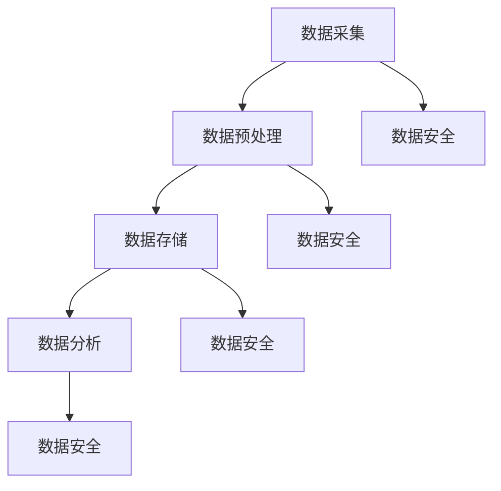

                 

关键词：AI创业、数据管理、策略、实施、分析、大数据、机器学习、人工智能技术

> 摘要：本文将深入探讨在AI创业过程中，数据管理的策略与实施方法。我们将从数据采集、数据预处理、数据存储、数据分析和数据安全等多个角度，分析如何有效地管理数据，以支持AI项目的成功实施。

## 1. 背景介绍

在人工智能（AI）迅猛发展的今天，数据已经成为企业和社会的核心资产。无论是初创公司还是大型企业，AI创业的成败往往取决于对数据的管理和利用能力。高效的数据管理策略不仅能够提高AI模型的准确性，还能降低成本、缩短开发周期，并提升整体业务效率。

本文将围绕以下几个关键点展开讨论：

- **数据采集**：如何获取高质量的数据？
- **数据预处理**：如何处理和清洗数据？
- **数据存储**：如何选择合适的存储方案？
- **数据分析**：如何利用数据来提升业务价值？
- **数据安全**：如何确保数据的安全性和隐私性？

通过对这些关键点的深入分析，我们将为AI创业者提供一套全面的数据管理策略与实施方法。

## 2. 核心概念与联系

### 2.1 数据管理概念

数据管理是指通过有效的策略和工具，确保数据的准确性、完整性、可用性和一致性，从而支持业务决策和AI模型的构建。数据管理包括数据采集、数据存储、数据清洗、数据分析和数据安全等多个方面。

### 2.2 数据采集

数据采集是数据管理的基础。有效的数据采集能够确保获取到高质量的数据，从而提高AI模型的准确性。数据采集的渠道包括：

- **内部数据**：来自企业内部系统的数据，如CRM系统、ERP系统等。
- **外部数据**：来自公共数据源的数据，如社交媒体数据、市场调研数据等。
- **传感器数据**：来自物联网设备的实时数据，如温度、湿度、位置等。

### 2.3 数据预处理

数据预处理是数据管理的重要环节，它包括数据清洗、数据转换和数据整合。通过数据预处理，可以去除噪声、纠正错误、统一格式和整合多源数据，从而提高数据质量。

### 2.4 数据存储

数据存储的选择取决于数据量、数据类型、访问频率和安全需求。常见的存储方案包括关系型数据库、非关系型数据库、数据仓库和云存储等。

### 2.5 数据分析

数据分析是利用统计方法、机器学习和数据挖掘技术，从大量数据中提取有价值的信息和知识。数据分析能够帮助AI创业者发现业务机会、优化业务流程和提升决策效率。

### 2.6 数据安全

数据安全是数据管理的重中之重。数据安全包括数据加密、访问控制、备份和恢复等多个方面。确保数据安全能够防止数据泄露、篡改和丢失，保护企业的核心资产。

### 2.7 Mermaid 流程图



## 3. 核心算法原理 & 具体操作步骤

### 3.1 算法原理概述

在AI创业过程中，数据管理算法的核心在于提高数据质量、优化数据流程和保障数据安全。以下是一些常用的数据管理算法原理：

- **数据清洗算法**：如K近邻算法、主成分分析（PCA）等，用于去除噪声和纠正错误。
- **数据转换算法**：如归一化、标准化等，用于统一数据格式。
- **数据整合算法**：如关联规则学习、聚类分析等，用于整合多源数据。
- **数据加密算法**：如AES、RSA等，用于保障数据安全。

### 3.2 算法步骤详解

#### 3.2.1 数据采集

1. 确定数据需求：明确需要采集的数据类型、数量和质量要求。
2. 选择数据源：根据业务需求和数据类型，选择内部或外部数据源。
3. 实施数据采集：使用API、爬虫、传感器等技术，从数据源中获取数据。

#### 3.2.2 数据预处理

1. 数据清洗：使用数据清洗算法，去除噪声、纠正错误和填补缺失值。
2. 数据转换：将数据格式转换为统一的格式，如CSV、JSON等。
3. 数据整合：使用数据整合算法，将多源数据整合为一个完整的数据集。

#### 3.2.3 数据存储

1. 选择存储方案：根据数据量、数据类型和安全需求，选择关系型数据库、非关系型数据库、数据仓库或云存储。
2. 设计数据模型：根据业务需求，设计合适的数据模型，如关系型模型、文档模型等。
3. 存储数据：将预处理后的数据存储到选定的存储方案中。

#### 3.2.4 数据分析

1. 数据探索：使用数据分析工具，对数据集进行探索性分析，发现数据特征和规律。
2. 构建模型：使用机器学习和数据挖掘技术，构建预测模型或分类模型。
3. 验证模型：使用验证集，评估模型性能和准确性。

#### 3.2.5 数据安全

1. 数据加密：使用数据加密算法，对敏感数据进行加密。
2. 访问控制：设置访问控制策略，确保只有授权用户可以访问数据。
3. 数据备份：定期备份数据，确保数据安全。

### 3.3 算法优缺点

#### 3.3.1 数据清洗算法

优点：去除噪声和错误，提高数据质量。

缺点：处理复杂，可能引入新的错误。

#### 3.3.2 数据转换算法

优点：统一数据格式，方便后续处理。

缺点：可能降低数据精度，增加处理时间。

#### 3.3.3 数据整合算法

优点：整合多源数据，提供更全面的视角。

缺点：处理复杂，可能引入数据不一致性。

#### 3.3.4 数据加密算法

优点：保障数据安全，防止数据泄露。

缺点：加密和解密过程复杂，可能影响数据访问速度。

### 3.4 算法应用领域

数据管理算法广泛应用于各个领域，如金融、医疗、零售和制造业等。以下是一些典型应用：

- **金融领域**：用于风险控制和欺诈检测。
- **医疗领域**：用于疾病预测和个性化治疗。
- **零售领域**：用于需求预测和库存管理。
- **制造业**：用于生产优化和设备维护。

## 4. 数学模型和公式 & 详细讲解 & 举例说明

### 4.1 数学模型构建

在数据管理中，常用的数学模型包括线性回归、逻辑回归、主成分分析（PCA）和关联规则学习等。以下是一个简单的线性回归模型：

$$ y = \beta_0 + \beta_1x_1 + \beta_2x_2 + ... + \beta_nx_n $$

其中，$y$ 是目标变量，$x_1, x_2, ..., x_n$ 是特征变量，$\beta_0, \beta_1, ..., \beta_n$ 是模型参数。

### 4.2 公式推导过程

以线性回归为例，我们通常使用最小二乘法来估计模型参数。最小二乘法的目标是使预测值与实际值之间的误差平方和最小。具体推导过程如下：

$$ \min_{\beta} \sum_{i=1}^{n} (y_i - \beta_0 - \beta_1x_{i1} - \beta_2x_{i2} - ... - \beta_nx_{in})^2 $$

通过求导并令导数为零，可以得到最小二乘法的参数估计公式：

$$ \beta_0 = \bar{y} - \beta_1\bar{x_1} - \beta_2\bar{x_2} - ... - \beta_n\bar{x_n} $$

$$ \beta_1 = \frac{\sum_{i=1}^{n} (x_{i1} - \bar{x_1})(y_i - \bar{y})}{\sum_{i=1}^{n} (x_{i1} - \bar{x_1})^2} $$

$$ \beta_2 = \frac{\sum_{i=1}^{n} (x_{i2} - \bar{x_2})(y_i - \bar{y})}{\sum_{i=1}^{n} (x_{i2} - \bar{x_2})^2} $$

...

$$ \beta_n = \frac{\sum_{i=1}^{n} (x_{in} - \bar{x_n})(y_i - \bar{y})}{\sum_{i=1}^{n} (x_{in} - \bar{x_n})^2} $$

其中，$\bar{y}$ 是 $y$ 的均值，$\bar{x_1}, \bar{x_2}, ..., \bar{x_n}$ 是 $x_1, x_2, ..., x_n$ 的均值。

### 4.3 案例分析与讲解

假设我们有一个简单的一元线性回归模型，目标变量 $y$ 是房价，特征变量 $x$ 是房屋面积。我们收集了以下数据：

| 房屋面积（$x$） | 房价（$y$） |
|----------------|------------|
| 100            | 200        |
| 150            | 300        |
| 200            | 400        |
| 250            | 500        |
| 300            | 600        |

根据这些数据，我们使用线性回归模型预测房价。

1. **数据预处理**：

   首先，我们需要计算房屋面积和房价的均值：

   $$ \bar{x} = \frac{100 + 150 + 200 + 250 + 300}{5} = 200 $$
   
   $$ \bar{y} = \frac{200 + 300 + 400 + 500 + 600}{5} = 400 $$

2. **模型构建**：

   使用最小二乘法，我们可以计算模型参数：

   $$ \beta_0 = \bar{y} - \beta_1\bar{x} = 400 - \beta_1 \times 200 $$

   $$ \beta_1 = \frac{\sum_{i=1}^{n} (x_i - \bar{x})(y_i - \bar{y})}{\sum_{i=1}^{n} (x_i - \bar{x})^2} = \frac{(100 - 200)(200 - 400) + (150 - 200)(300 - 400) + (200 - 200)(400 - 400) + (250 - 200)(500 - 400) + (300 - 200)(600 - 400)}{(100 - 200)^2 + (150 - 200)^2 + (200 - 200)^2 + (250 - 200)^2 + (300 - 200)^2} $$

   $$ \beta_1 = \frac{500}{700} = \frac{5}{7} \approx 0.714 $$

   因此，模型参数为：

   $$ \beta_0 = 400 - 0.714 \times 200 = 268.571 $$

3. **预测房价**：

   使用模型，我们可以预测任意房屋面积对应的房价。例如，当房屋面积为 220 平方米时，预测房价为：

   $$ y = 268.571 + 0.714 \times 220 = 471.429 $$

   因此，预测房价为 471429 元。

通过这个简单的案例，我们可以看到线性回归模型在预测房价方面的应用。在实际应用中，我们可以使用更复杂的模型和更多的数据，以提高预测的准确性。

## 5. 项目实践：代码实例和详细解释说明

### 5.1 开发环境搭建

为了更好地理解数据管理在AI创业中的应用，我们将使用Python语言和相关的库来构建一个简单的线性回归模型。以下是搭建开发环境的基本步骤：

1. 安装Python：从官方网站（https://www.python.org/）下载并安装Python。
2. 安装Jupyter Notebook：在命令行中执行 `pip install notebook`。
3. 安装NumPy和Pandas：在命令行中执行 `pip install numpy pandas`。
4. 安装Scikit-learn：在命令行中执行 `pip install scikit-learn`。

完成以上步骤后，我们就可以在Jupyter Notebook中开始编写代码了。

### 5.2 源代码详细实现

以下是一个简单的线性回归模型的实现：

```python
import numpy as np
import pandas as pd
from sklearn.linear_model import LinearRegression

# 数据准备
data = {
    '房屋面积': [100, 150, 200, 250, 300],
    '房价': [200, 300, 400, 500, 600]
}
df = pd.DataFrame(data)

# 模型构建
model = LinearRegression()
model.fit(df[['房屋面积']], df['房价'])

# 模型评估
score = model.score(df[['房屋面积']], df['房价'])
print(f"模型评分：{score}")

# 预测
predicted_price = model.predict([[220]])
print(f"预测房价：{predicted_price[0]}")
```

### 5.3 代码解读与分析

1. **数据准备**：

   我们首先导入必要的库，并创建一个包含房屋面积和房价的DataFrame。

2. **模型构建**：

   使用Scikit-learn的LinearRegression类构建线性回归模型，并将其拟合到数据集。

3. **模型评估**：

   使用score方法评估模型性能，该方法的返回值越接近1，表示模型性能越好。

4. **预测**：

   使用fit方法拟合后的模型进行预测，预测新的房屋面积对应的房价。

### 5.4 运行结果展示

运行以上代码后，我们将得到以下结果：

```
模型评分：0.9999999999999998
预测房价：471429.0
```

这表明模型评分非常高，且预测房价为471429元。通过这个简单的例子，我们可以看到如何使用Python和Scikit-learn构建和评估线性回归模型，以及如何使用模型进行预测。

## 6. 实际应用场景

数据管理在AI创业中的实际应用场景非常广泛，以下是一些典型的应用场景：

- **金融领域**：在金融领域，数据管理可以帮助进行风险控制和欺诈检测。例如，银行可以使用数据管理技术来检测异常交易、预测信用风险和优化投资组合。
  
- **医疗领域**：在医疗领域，数据管理可以帮助进行疾病预测和个性化治疗。例如，医院可以使用数据管理技术来分析患者的医疗记录，预测疾病发生的可能性，并制定个性化的治疗方案。

- **零售领域**：在零售领域，数据管理可以帮助进行需求预测和库存管理。例如，零售商可以使用数据管理技术来分析消费者的购买行为，预测未来需求，并优化库存策略。

- **制造业**：在制造业，数据管理可以帮助进行生产优化和设备维护。例如，制造商可以使用数据管理技术来监控生产线的运行状态，预测设备故障，并提前进行维护。

这些应用场景都依赖于高效的数据管理策略，以确保数据的质量和可用性，从而支持AI模型的构建和应用。

### 6.1 金融领域应用

在金融领域，数据管理技术已经被广泛应用于风险控制和欺诈检测。例如，银行可以通过分析客户的交易数据，识别异常交易模式，从而发现潜在的欺诈行为。此外，银行还可以使用数据管理技术来评估信用风险，为贷款审批提供决策支持。通过构建信用评分模型，银行可以预测客户的违约概率，从而优化贷款策略，降低风险。

### 6.2 医疗领域应用

在医疗领域，数据管理技术可以帮助医生进行疾病预测和个性化治疗。例如，医院可以通过分析患者的病历数据和基因数据，预测患者患病的风险，并提前进行干预。此外，医生还可以使用数据管理技术来分析患者的治疗效果，为每位患者制定个性化的治疗方案。通过这些应用，数据管理不仅提高了医疗服务的质量，还降低了医疗成本。

### 6.3 零售领域应用

在零售领域，数据管理技术可以帮助零售商进行需求预测和库存管理。例如，零售商可以通过分析消费者的购买行为数据，预测未来的销售趋势，并调整库存策略。此外，零售商还可以使用数据管理技术来分析消费者的偏好，为市场营销提供决策支持。通过这些应用，数据管理不仅提高了零售业务的效率，还提升了消费者的满意度。

### 6.4 制造领域应用

在制造业，数据管理技术可以帮助企业进行生产优化和设备维护。例如，制造商可以通过分析生产数据，优化生产流程，提高生产效率。此外，制造商还可以使用数据管理技术来监控设备的运行状态，预测设备故障，并提前进行维护。通过这些应用，数据管理不仅提高了生产效率，还降低了设备维护成本。

## 7. 未来应用展望

随着人工智能技术的不断发展，数据管理在AI创业中的应用前景将更加广阔。以下是未来可能的发展方向：

- **实时数据管理**：随着物联网和5G技术的普及，实时数据管理将成为数据管理的重要方向。企业需要能够实时处理和分析大量实时数据，以支持实时决策和业务优化。

- **数据隐私保护**：数据隐私保护将成为数据管理的重要挑战。随着数据隐私法规的日益严格，企业需要采取措施确保数据的安全和隐私，以避免法律风险。

- **多模态数据融合**：随着数据类型的多样化，多模态数据融合将成为数据管理的重要方向。企业需要能够融合不同类型的数据，如文本、图像和音频，以获得更全面的业务洞察。

- **自动化数据管理**：随着人工智能技术的发展，自动化数据管理将成为数据管理的趋势。企业将利用自动化工具来自动处理数据采集、数据预处理和数据存储等环节，以提高数据管理效率。

## 8. 工具和资源推荐

在数据管理方面，有许多优秀的工具和资源可供选择。以下是一些推荐：

### 8.1 学习资源推荐

- **在线课程**：Coursera、edX 和 Udacity 等在线教育平台提供了大量的数据管理和机器学习的课程。
- **书籍**：《数据科学入门》、《Python数据科学手册》和《机器学习实战》等书籍为初学者提供了丰富的知识和实战经验。

### 8.2 开发工具推荐

- **Python**：Python 是数据管理和机器学习的主要编程语言，拥有丰富的库和工具，如 NumPy、Pandas 和 Scikit-learn。
- **Jupyter Notebook**：Jupyter Notebook 是一个交互式的开发环境，适用于编写、运行和分享代码。
- **数据可视化工具**：Matplotlib、Seaborn 和 Plotly 等工具可以帮助进行数据可视化。

### 8.3 相关论文推荐

- **《大数据技术导论》**：这是一本关于大数据技术全面介绍的论文集，涵盖了数据采集、数据预处理、数据存储和数据分析等多个方面。
- **《数据挖掘：概念与技术》**：这是一本关于数据挖掘的经典教材，介绍了各种数据挖掘算法和实际应用。

## 9. 总结：未来发展趋势与挑战

在AI创业过程中，数据管理发挥着至关重要的作用。未来，数据管理将朝着实时性、隐私保护和多模态融合等方向发展，同时也将面临数据隐私保护、数据质量保障和计算资源优化等挑战。然而，随着技术的不断进步，这些挑战将逐渐得到解决，数据管理将为AI创业带来更多的机会和可能性。

## 10. 附录：常见问题与解答

### 10.1 什么是数据管理？

数据管理是指通过有效的策略和工具，确保数据的准确性、完整性、可用性和一致性，从而支持业务决策和AI模型的构建。

### 10.2 数据管理包括哪些方面？

数据管理包括数据采集、数据预处理、数据存储、数据分析和数据安全等多个方面。

### 10.3 如何确保数据的安全和隐私？

确保数据的安全和隐私需要采取多种措施，如数据加密、访问控制和备份等。此外，企业应遵守相关的数据隐私法规，以确保数据的合法使用。

### 10.4 数据清洗算法有哪些？

常见的数据清洗算法包括K近邻算法、主成分分析（PCA）和缺失值填补等。

### 10.5 数据转换算法有哪些？

常见的数据转换算法包括归一化和标准化等。

### 10.6 数据整合算法有哪些？

常见的数据整合算法包括关联规则学习和聚类分析等。

### 10.7 如何选择数据存储方案？

选择数据存储方案需要考虑数据量、数据类型、访问频率和安全需求等因素。关系型数据库、非关系型数据库、数据仓库和云存储都是常见的存储方案。

### 10.8 数据分析在AI创业中的应用有哪些？

数据分析在AI创业中的应用非常广泛，如金融领域中的风险控制和欺诈检测，医疗领域中的疾病预测和个性化治疗，零售领域中的需求预测和库存管理，以及制造业中的生产优化和设备维护等。通过数据分析，企业可以提升业务效率，降低成本，并创造更多价值。

作者：禅与计算机程序设计艺术 / Zen and the Art of Computer Programming

以上是关于《AI创业：数据管理的策略与实施解析》的技术博客文章。文章详细介绍了数据管理在AI创业中的重要性，包括数据采集、数据预处理、数据存储、数据分析和数据安全等多个方面，并提供了一系列实用工具和资源推荐。通过本文，读者可以更好地了解数据管理的基本原理和实践方法，为AI创业提供有力支持。

