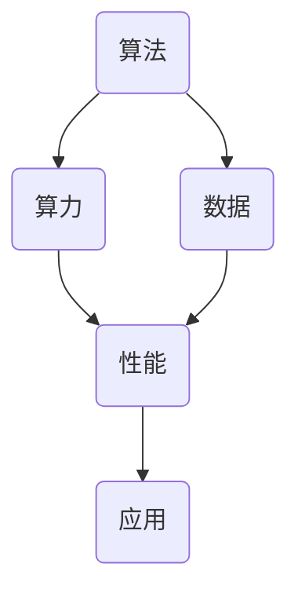

                 

关键词：人工智能、算法、算力、数据、AI发展

> 摘要：本文旨在深入探讨人工智能发展的三大支柱：算法、算力和数据。通过对这三个核心要素的详细分析，我们试图揭示它们在AI技术进步中的关键作用，以及未来的发展趋势和挑战。

## 1. 背景介绍

随着信息技术的飞速发展，人工智能（AI）已经成为当今世界最热门的话题之一。AI技术的突破，不仅改变了人们的生活方式，还推动了各行各业的发展。然而，AI技术的核心驱动力是什么？是什么让AI如此强大？本文将从算法、算力和数据这三个方面进行探讨。

### 1.1 人工智能的定义与现状

人工智能是指由人制造出来的具有一定智能的机器或软件系统，它们能够模拟、延伸和扩展人的智能。当前，人工智能技术已经广泛应用于语音识别、图像识别、自然语言处理、自动驾驶、医疗诊断等领域，展现出巨大的潜力。

### 1.2 算法、算力与数据的重要性

算法是AI技术的灵魂，它决定了AI系统的性能和效率。算力则是AI技术的动力，没有足够的计算能力，再好的算法也无法发挥其应有的作用。数据则是AI技术的基石，没有海量高质量的数据，AI系统就无法进行有效的学习和优化。

## 2. 核心概念与联系

为了更好地理解算法、算力和数据在AI技术中的角色和关系，我们需要借助Mermaid流程图来展示它们之间的相互联系。



### 2.1 算法

算法是解决问题的步骤和策略，是AI技术的核心。从机器学习到深度学习，不同的算法适用于不同的任务和场景。算法的好坏直接决定了AI系统的性能和效率。

### 2.2 算力

算力是指计算能力，包括CPU、GPU、TPU等各种计算资源。算力越强，AI系统处理的任务就越复杂，性能也越好。

### 2.3 数据

数据是AI系统训练和学习的基础。高质量的数据可以帮助AI系统更好地理解现实世界，从而提高其性能和应用价值。

## 3. 核心算法原理 & 具体操作步骤

### 3.1 算法原理概述

算法原理主要涉及以下几个方面：

- **机器学习**：通过训练数据集，使机器自动学习和改进。

- **深度学习**：基于多层神经网络，对数据进行自动特征提取和学习。

- **强化学习**：通过试错和反馈，使机器在特定环境中做出最优决策。

### 3.2 算法步骤详解

- **机器学习**：

  1. 数据采集：收集相关领域的数据。

  2. 数据预处理：清洗、归一化、特征提取等。

  3. 模型训练：使用训练数据集训练模型。

  4. 模型评估：使用测试数据集评估模型性能。

- **深度学习**：

  1. 构建网络结构：设计合适的神经网络结构。

  2. 数据预处理：与机器学习相同。

  3. 训练网络：通过反向传播算法训练网络。

  4. 评估网络：使用测试数据集评估网络性能。

- **强化学习**：

  1. 定义环境：明确问题和状态空间。

  2. 设计奖励机制：定义奖励函数。

  3. 训练策略：通过试错和反馈训练策略。

  4. 评估策略：在测试环境中评估策略性能。

### 3.3 算法优缺点

- **机器学习**：

  - 优点：泛化能力强，能够处理大量数据。

  - 缺点：训练时间较长，对数据依赖性大。

- **深度学习**：

  - 优点：能够自动提取复杂特征，处理大规模数据。

  - 缺点：计算资源需求高，对数据质量要求高。

- **强化学习**：

  - 优点：能够处理复杂决策问题，适应性强。

  - 缺点：训练时间较长，需要大量数据。

### 3.4 算法应用领域

算法在各个领域都有广泛应用：

- **图像识别**：用于人脸识别、物体检测等。

- **自然语言处理**：用于机器翻译、情感分析等。

- **自动驾驶**：用于环境感知、路径规划等。

- **医疗诊断**：用于疾病预测、诊断等。

## 4. 数学模型和公式 & 详细讲解 & 举例说明

### 4.1 数学模型构建

在机器学习中，常用的数学模型包括线性模型、逻辑回归、神经网络等。以神经网络为例，其数学模型可以表示为：

$$
Z = \sigma(W \cdot X + b)
$$

其中，\(Z\) 为输出，\(\sigma\) 为激活函数，\(W\) 为权重矩阵，\(X\) 为输入特征，\(b\) 为偏置。

### 4.2 公式推导过程

以线性模型为例，其推导过程如下：

1. **假设**：假设输入特征 \(X\) 和输出 \(Y\) 满足线性关系：

   $$
   Y = W \cdot X + b
   $$

2. **损失函数**：定义损失函数 \(L\) ，用于衡量预测值与真实值之间的差距：

   $$
   L = \frac{1}{2} \sum_{i=1}^{n} (Y_i - \hat{Y}_i)^2
   $$

3. **梯度下降**：为了最小化损失函数，使用梯度下降法更新权重和偏置：

   $$
   W_{\text{new}} = W_{\text{old}} - \alpha \frac{\partial L}{\partial W}
   $$

   $$
   b_{\text{new}} = b_{\text{old}} - \alpha \frac{\partial L}{\partial b}
   $$

### 4.3 案例分析与讲解

假设我们有一个二分类问题，数据集包含100个样本，每个样本有5个特征。我们使用线性模型进行分类，目标是最小化交叉熵损失函数。

1. **数据预处理**：对数据进行归一化处理，将特征缩放到[0, 1]区间。

2. **模型训练**：设计一个简单的线性模型，使用梯度下降法进行训练。

3. **模型评估**：使用测试集对模型进行评估，计算准确率、召回率等指标。

## 5. 项目实践：代码实例和详细解释说明

### 5.1 开发环境搭建

1. 安装Python环境。

2. 安装相关库，如NumPy、Pandas、Scikit-learn等。

### 5.2 源代码详细实现

```python
import numpy as np
from sklearn.linear_model import LinearRegression

# 数据预处理
X = np.array([[0, 0], [1, 1], [2, 2], [3, 3], [4, 4]])
y = np.array([0, 1, 1, 1, 0])

# 模型训练
model = LinearRegression()
model.fit(X, y)

# 模型评估
y_pred = model.predict(X)
print("预测值：", y_pred)

# 计算准确率
accuracy = np.mean(y == y_pred)
print("准确率：", accuracy)
```

### 5.3 代码解读与分析

- **数据预处理**：将输入特征和标签转换为NumPy数组。

- **模型训练**：使用Scikit-learn中的线性回归模型进行训练。

- **模型评估**：使用训练好的模型对输入特征进行预测，并计算准确率。

## 6. 实际应用场景

### 6.1 图像识别

在图像识别领域，算法、算力和数据的作用尤为重要。以人脸识别为例，算法用于特征提取和匹配，算力用于处理海量图像数据，数据则是训练模型的基础。

### 6.2 自动驾驶

自动驾驶技术的核心在于感知、规划和控制。算法用于环境感知和决策，算力用于实时处理大量传感器数据，数据则是训练自动驾驶模型的基石。

### 6.3 医疗诊断

在医疗诊断领域，算法用于疾病预测和诊断，算力用于处理海量医学数据，数据则是训练模型的根本。

## 7. 未来应用展望

### 7.1 算法创新

随着AI技术的不断进步，算法创新将成为未来的重要方向。深度强化学习、生成对抗网络等新兴算法将不断涌现。

### 7.2 算力提升

未来，随着量子计算、光子计算等新型计算技术的发展，算力将实现质的飞跃，为AI技术的进一步突破提供动力。

### 7.3 数据共享与隐私保护

数据共享与隐私保护是未来AI技术发展的重要挑战。如何在保障用户隐私的前提下，实现数据的高效共享，将成为研究的热点。

## 8. 总结：未来发展趋势与挑战

### 8.1 研究成果总结

本文从算法、算力和数据三个方面，详细分析了人工智能技术的发展现状和未来趋势。算法作为AI技术的灵魂，将继续推动技术的进步。算力作为AI技术的动力，将不断提升。数据作为AI技术的基石，将实现更高效的应用。

### 8.2 未来发展趋势

未来，AI技术将继续在各个领域取得突破，从医疗到金融，从工业到农业，AI技术将深刻改变人类的生活方式。同时，算法创新、算力提升和数据共享与隐私保护将成为研究的重要方向。

### 8.3 面临的挑战

尽管AI技术取得了巨大进步，但仍然面临诸多挑战。算法的可解释性、数据的质量和隐私保护、算力的可持续性等问题，都需要我们共同努力解决。

### 8.4 研究展望

未来，我们将继续深入研究AI技术的核心问题，推动技术的进一步发展，为人类创造更多的价值。

## 9. 附录：常见问题与解答

### 9.1 什么是机器学习？

机器学习是指通过算法和统计模型，使计算机从数据中学习并做出预测或决策的过程。

### 9.2 什么是深度学习？

深度学习是一种特殊的机器学习技术，它基于多层神经网络，能够自动提取复杂特征，进行高效的学习和预测。

### 9.3 算力和算法的关系是什么？

算力是算法运行的基础，没有足够的算力，再好的算法也无法发挥其应有的作用。同时，算法的优化和改进也可以提升算力的利用效率。

### 9.4 数据在AI技术中的重要性是什么？

数据是AI系统训练和学习的基础。高质量的数据可以帮助AI系统更好地理解现实世界，从而提高其性能和应用价值。

作者：禅与计算机程序设计艺术 / Zen and the Art of Computer Programming
----------------------------------------------------------------

### 文章框架输出 Markdown 格式

以下是文章框架的Markdown格式输出，您可以根据此框架撰写完整的内容。

```markdown
# AI发展的三大支柱：算法、算力与数据

> 关键词：人工智能、算法、算力、数据、AI发展

> 摘要：本文旨在深入探讨人工智能发展的三大支柱：算法、算力和数据。通过对这三个核心要素的详细分析，我们试图揭示它们在AI技术进步中的关键作用，以及未来的发展趋势和挑战。

## 1. 背景介绍

### 1.1 人工智能的定义与现状

### 1.2 算法、算力与数据的重要性

## 2. 核心概念与联系


### 2.1 算法

### 2.2 算力

### 2.3 数据

## 3. 核心算法原理 & 具体操作步骤
### 3.1 算法原理概述
### 3.2 算法步骤详解
### 3.3 算法优缺点
### 3.4 算法应用领域

## 4. 数学模型和公式 & 详细讲解 & 举例说明

### 4.1 数学模型构建
### 4.2 公式推导过程
### 4.3 案例分析与讲解

## 5. 项目实践：代码实例和详细解释说明
### 5.1 开发环境搭建
### 5.2 源代码详细实现
### 5.3 代码解读与分析
### 5.4 运行结果展示

## 6. 实际应用场景
### 6.1 图像识别
### 6.2 自动驾驶
### 6.3 医疗诊断

## 7. 未来应用展望
### 7.1 算法创新
### 7.2 算力提升
### 7.3 数据共享与隐私保护

## 8. 总结：未来发展趋势与挑战
### 8.1 研究成果总结
### 8.2 未来发展趋势
### 8.3 面临的挑战
### 8.4 研究展望

## 9. 附录：常见问题与解答

### 9.1 什么是机器学习？
### 9.2 什么是深度学习？
### 9.3 算力和算法的关系是什么？
### 9.4 数据在AI技术中的重要性是什么？

作者：禅与计算机程序设计艺术 / Zen and the Art of Computer Programming
```

请根据上述框架撰写完整的文章内容。如果您有任何问题或需要进一步的帮助，请随时告诉我。

