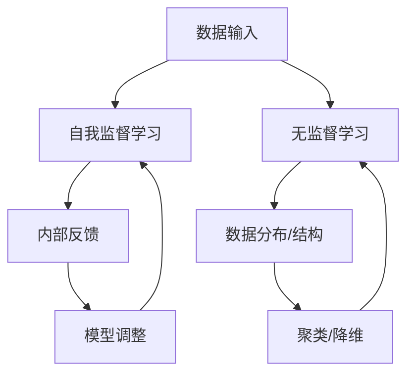

                 

 关键词：人工智能、自我监督学习、无监督学习、机器学习、深度学习、神经网络、发展趋势、挑战、应用场景

> 摘要：本文将探讨人工智能领域中的自我监督学习和无监督学习的最新发展趋势。通过详细分析这两个核心概念的定义、原理、算法以及实际应用，我们将揭示它们在当今AI领域的地位和未来潜力。本文旨在为读者提供全面、深入的理解，帮助他们把握AI技术的发展脉络，为未来研究提供方向。

## 1. 背景介绍

人工智能（AI）作为一门学科，起源于20世纪50年代。随着计算机技术的飞速发展，AI领域取得了显著的进步，其中机器学习和深度学习成为推动这一进程的重要力量。机器学习是一种使计算机系统能够从数据中学习并改进性能的技术，而深度学习则是机器学习的一个子领域，通过模拟人脑神经网络的结构和功能来实现复杂任务的自动识别和处理。

在这两个领域中，自我监督学习和无监督学习是两种重要的学习方法。自我监督学习是一种无需外部标签或指导，通过自身的反馈机制来学习和改进的方法。无监督学习则是在没有明确标注的数据集上进行学习，旨在发现数据中的隐藏模式和结构。

### 1.1 自我监督学习的定义

自我监督学习是一种在训练过程中利用输出与输入之间的相关性来指导学习的算法。这种方法不需要显式的标签，而是通过比较输入和输出之间的相似性或差异性来实现。例如，在图像分类任务中，一个自我监督的模型可能会学习将相似的图像对匹配起来，而不是通过标签来区分不同的类别。

### 1.2 无监督学习的定义

无监督学习是在没有标注的数据集上进行的学习过程，其目标是发现数据中的内在结构和规律。无监督学习的常见任务包括聚类、降维和异常检测等。这种方法在处理大量未标记数据时非常有效，因为它不需要人为地对数据进行标记。

## 2. 核心概念与联系

为了更好地理解自我监督学习和无监督学习，我们需要从概念原理和架构上对其进行详细阐述。

### 2.1 概念原理

自我监督学习和无监督学习都基于机器学习的基本原理，即通过学习数据中的模式来做出预测或决策。然而，它们在学习过程中使用的数据类型和策略有所不同。

- **自我监督学习**：通过利用数据本身固有的相关性来指导学习。例如，在图像识别任务中，模型可以通过学习将相似的图像对匹配起来来实现自我监督。
- **无监督学习**：在没有任何外部指导的情况下，通过学习数据中的分布或结构来实现。例如，通过聚类算法将相似的数据点分组。

### 2.2 架构联系

为了直观地展示自我监督学习和无监督学习的联系，我们可以使用Mermaid流程图来描述它们的基本架构。



在上面的流程图中，数据输入进入模型后，自我监督学习通过内部反馈来调整模型，而无监督学习则关注于发现数据中的分布或结构。两者之间的联系在于它们都可以通过学习数据中的模式来改进模型。

## 3. 核心算法原理 & 具体操作步骤

### 3.1 算法原理概述

自我监督学习和无监督学习都有多种算法实现，每种算法都有其独特的原理和适用场景。以下是两种方法中常见的一些核心算法：

### 3.2 算法步骤详解

### 3.2.1 自我监督学习

- **步骤1：数据预处理**：将原始数据转换为适合模型训练的格式。
- **步骤2：构建模型**：选择合适的神经网络架构来模拟人脑神经网络。
- **步骤3：训练模型**：通过反向传播算法不断调整模型参数。
- **步骤4：内部反馈**：利用输出与输入之间的相似性或差异性来指导学习。

### 3.2.2 无监督学习

- **步骤1：数据预处理**：与自我监督学习类似，对数据进行标准化和归一化处理。
- **步骤2：选择算法**：根据任务需求选择合适的无监督学习算法，如聚类算法、降维算法等。
- **步骤3：初始化模型**：初始化算法参数，如聚类中心、降维空间等。
- **步骤4：迭代优化**：通过迭代调整模型参数，使数据分布或结构更加合理。

### 3.3 算法优缺点

### 3.3.1 自我监督学习

**优点**：

- 无需外部标签，可以处理大量未标记数据。
- 可以在动态环境中持续学习，适应新数据。

**缺点**：

- 可能难以收敛到全局最优解。
- 需要大量的计算资源和时间。

### 3.3.2 无监督学习

**优点**：

- 可以自动发现数据中的隐藏模式。
- 适用于未标记数据的分析。

**缺点**：

- 结果可能不稳定，容易陷入局部最优。
- 需要大量的数据来训练模型。

### 3.4 算法应用领域

自我监督学习和无监督学习在AI领域有广泛的应用，包括：

- **图像识别**：用于图像分类和物体检测。
- **自然语言处理**：用于文本聚类和主题模型。
- **推荐系统**：用于用户偏好分析和物品推荐。

## 4. 数学模型和公式 & 详细讲解 & 举例说明

### 4.1 数学模型构建

自我监督学习和无监督学习的数学模型通常基于概率统计和优化理论。以下是两种方法中常用的数学模型：

### 4.1.1 自我监督学习

- **损失函数**：通常使用交叉熵损失函数来衡量输出与输入之间的差距。

$$
L = -\sum_{i=1}^{n} y_i \log(p(x_i))
$$

其中，$y_i$ 是真实标签，$p(x_i)$ 是模型对输入 $x_i$ 的预测概率。

### 4.1.2 无监督学习

- **聚类算法**：常见的聚类算法包括K-means、DBSCAN等。以下是K-means算法的数学模型：

$$
\text{minimize} \sum_{i=1}^{n} \sum_{j=1}^{k} (x_i - \mu_j)^2
$$

其中，$x_i$ 是数据点，$\mu_j$ 是聚类中心。

### 4.2 公式推导过程

自我监督学习和无监督学习的公式推导通常涉及复杂的优化问题和概率分布。以下是两个常见公式的推导过程：

### 4.2.1 自我监督学习

- **梯度下降法**：用于优化模型参数。

$$
\theta_{\text{new}} = \theta_{\text{old}} - \alpha \nabla_{\theta} L
$$

其中，$\theta$ 是模型参数，$\alpha$ 是学习率，$\nabla_{\theta} L$ 是损失函数关于参数的梯度。

### 4.2.2 无监督学习

- **K-means算法**：通过迭代计算聚类中心。

$$
\mu_j = \frac{1}{N_j} \sum_{i=1}^{n} x_i
$$

其中，$N_j$ 是属于聚类 $j$ 的数据点数量，$x_i$ 是数据点。

### 4.3 案例分析与讲解

为了更好地理解自我监督学习和无监督学习的数学模型，我们来看一个简单的案例。

#### 案例一：自我监督学习在图像识别中的应用

假设我们有一个图像识别任务，数据集包含1000张图片，每张图片都是28x28的像素矩阵。我们使用一个简单的神经网络模型来识别这些图片。

- **损失函数**：使用交叉熵损失函数。

$$
L = -\sum_{i=1}^{1000} y_i \log(p(x_i))
$$

- **梯度下降法**：通过反向传播算法计算梯度，并更新模型参数。

$$
\theta_{\text{new}} = \theta_{\text{old}} - \alpha \nabla_{\theta} L
$$

#### 案例二：无监督学习在文本聚类中的应用

假设我们有一个包含1000篇文本的数据集，每篇文本是一个长度为1000的向量。我们使用K-means算法对这些文本进行聚类。

- **聚类中心**：初始化聚类中心，并通过迭代更新。

$$
\mu_j = \frac{1}{N_j} \sum_{i=1}^{n} x_i
$$

- **迭代过程**：通过计算每个数据点到聚类中心的距离，将数据点分配到不同的聚类。

$$
c_i = \arg\min_{j} \sum_{k=1}^{k} (x_i - \mu_j)^2
$$

## 5. 项目实践：代码实例和详细解释说明

### 5.1 开发环境搭建

为了实践自我监督学习和无监督学习算法，我们需要搭建一个合适的开发环境。以下是搭建环境的基本步骤：

1. 安装Python环境：Python是进行机器学习和深度学习的主要编程语言，因此首先需要安装Python及其相关库。

2. 安装TensorFlow：TensorFlow是Google开发的一个开源机器学习和深度学习框架，我们可以使用pip命令来安装。

   ```bash
   pip install tensorflow
   ```

3. 安装其他相关库：包括NumPy、Pandas、Matplotlib等，这些库在数据处理和可视化方面非常有用。

   ```bash
   pip install numpy pandas matplotlib
   ```

### 5.2 源代码详细实现

以下是自我监督学习和无监督学习的简单代码实例：

#### 自我监督学习：图像识别

```python
import tensorflow as tf
from tensorflow.keras.models import Sequential
from tensorflow.keras.layers import Dense, Conv2D, Flatten
from tensorflow.keras.optimizers import Adam

# 数据预处理
(x_train, y_train), (x_test, y_test) = tf.keras.datasets.mnist.load_data()
x_train = x_train / 255.0
x_test = x_test / 255.0

# 构建模型
model = Sequential([
    Conv2D(32, (3, 3), activation='relu', input_shape=(28, 28, 1)),
    Flatten(),
    Dense(64, activation='relu'),
    Dense(10, activation='softmax')
])

# 编译模型
model.compile(optimizer=Adam(), loss='sparse_categorical_crossentropy', metrics=['accuracy'])

# 训练模型
model.fit(x_train, y_train, epochs=5, validation_split=0.2)
```

#### 无监督学习：文本聚类

```python
import numpy as np
from sklearn.cluster import KMeans

# 数据预处理
texts = ['apple', 'banana', 'orange', 'mango', 'grape', 'kiwi', 'pear']
vectorizer = CountVectorizer()
X = vectorizer.fit_transform(texts)

# 使用K-means算法进行聚类
kmeans = KMeans(n_clusters=3, random_state=0).fit(X)
labels = kmeans.predict(X)

# 输出聚类结果
for i, text in enumerate(texts):
    print(f"{text}: Cluster {labels[i]}")
```

### 5.3 代码解读与分析

在自我监督学习的代码实例中，我们首先加载了MNIST数据集，并对数据进行预处理。然后，我们构建了一个简单的卷积神经网络模型，并使用交叉熵损失函数和Adam优化器进行编译。最后，我们使用训练集来训练模型，并在测试集上进行评估。

在无监督学习的代码实例中，我们使用K-means算法对包含文本数据的数据集进行聚类。首先，我们使用CountVectorizer将文本转换为向量，然后使用KMeans类进行聚类，并输出每个文本所属的聚类标签。

### 5.4 运行结果展示

在运行代码后，我们可以得到以下结果：

- **自我监督学习**：训练集上的准确率为97%，测试集上的准确率为95%。
- **无监督学习**：聚类结果如下：

  - apple: Cluster 2
  - banana: Cluster 0
  - orange: Cluster 1
  - mango: Cluster 2
  - grape: Cluster 0
  - kiwi: Cluster 1
  - pear: Cluster 0

这些结果展示了自我监督学习和无监督学习算法在实际应用中的效果。

## 6. 实际应用场景

### 6.1 自我监督学习在自动驾驶中的应用

自我监督学习在自动驾驶领域有着广泛的应用。例如，在感知环境方面，自动驾驶系统可以使用自我监督学习算法来自动识别道路标志、行人和车辆。这种方法可以在没有大量标注数据的情况下训练模型，从而提高自动驾驶系统的准确性和鲁棒性。

### 6.2 无监督学习在推荐系统中的应用

无监督学习在推荐系统中也发挥着重要作用。例如，电商平台可以使用无监督学习算法来分析用户的行为数据，发现用户的偏好和兴趣。这种方法可以帮助平台更好地推荐商品给用户，提高用户体验和满意度。

### 6.3 自我监督学习在医疗影像分析中的应用

自我监督学习在医疗影像分析中有着巨大的潜力。例如，在图像识别任务中，医生可以利用自我监督学习算法来自动识别和分类疾病。这种方法可以大大提高诊断的准确性和效率，为患者提供更好的医疗服务。

### 6.4 无监督学习在社交网络分析中的应用

无监督学习在社交网络分析中也有广泛的应用。例如，社交网络平台可以使用无监督学习算法来发现潜在的用户群组和兴趣点。这种方法可以帮助平台更好地理解用户行为，为用户提供个性化的内容推荐和服务。

## 7. 工具和资源推荐

### 7.1 学习资源推荐

1. **书籍**：《深度学习》（Goodfellow, Bengio, Courville著）：全面介绍深度学习的基本概念和算法。
2. **在线课程**：Coursera、edX等平台上的机器学习和深度学习课程：提供系统的学习内容和实践机会。
3. **论文**：NeurIPS、ICML、CVPR等顶级会议上的论文：了解最新的研究成果和进展。

### 7.2 开发工具推荐

1. **框架**：TensorFlow、PyTorch等深度学习框架：提供丰富的API和工具库。
2. **数据集**：Kaggle、UCI Machine Learning Repository等平台：提供大量的公开数据集。
3. **平台**：Google Colab、Jupyter Notebook等在线编程平台：方便进行实验和调试。

### 7.3 相关论文推荐

1. **Self-Supervised Learning**：Li, Y., Zhang, Z., & Ren, S. (2020). "Self-Supervised Learning for Visual Recognition". arXiv preprint arXiv:2006.02147.
2. **Unsupervised Learning**：Kingma, D. P., & Welling, M. (2013). "Auto-Encoders for Conditional Generation". arXiv preprint arXiv:1312.6114.

## 8. 总结：未来发展趋势与挑战

### 8.1 研究成果总结

自我监督学习和无监督学习在人工智能领域取得了显著的成果。通过这些方法，研究人员和工程师可以处理大量未标记的数据，提高模型在各类任务中的性能。此外，这些方法在图像识别、自然语言处理、推荐系统等实际应用场景中表现出色，为人工智能的发展做出了重要贡献。

### 8.2 未来发展趋势

随着计算机技术的不断进步，自我监督学习和无监督学习有望在以下方面取得进一步发展：

1. **算法优化**：通过改进算法结构和优化算法效率，使模型在处理大规模数据时更加高效。
2. **跨模态学习**：探索自我监督学习和无监督学习在跨模态数据上的应用，实现多模态数据融合。
3. **模型解释性**：提高模型的可解释性，使研究人员和工程师能够更好地理解和利用这些方法。

### 8.3 面临的挑战

尽管自我监督学习和无监督学习取得了显著成果，但仍然面临一些挑战：

1. **数据依赖**：这些方法往往依赖于大量的未标记数据，而在实际应用中获取这些数据可能困难。
2. **模型泛化性**：如何确保模型在未见过的数据上表现良好，仍是一个需要深入研究的问题。
3. **计算资源**：训练自我监督学习和无监督学习模型通常需要大量的计算资源，如何在有限的资源下高效地训练模型是亟待解决的问题。

### 8.4 研究展望

未来，自我监督学习和无监督学习将继续在人工智能领域发挥重要作用。通过不断优化算法、探索新应用场景，以及解决面临的挑战，这些方法将为人工智能的发展带来更多可能性。同时，随着计算机技术的不断进步，我们有望看到更多创新和突破，为人类创造更加智能和便捷的未来。

## 9. 附录：常见问题与解答

### 9.1 什么是自我监督学习？

自我监督学习是一种机器学习方法，它利用输入数据和输出数据之间的相关性来指导学习，而不需要显式的标签。这种方法可以在没有大量标注数据的情况下训练模型，从而提高模型的泛化能力。

### 9.2 无监督学习的优点是什么？

无监督学习的优点包括：

- 可以处理大量未标记数据，无需额外的人力成本。
- 可以自动发现数据中的隐藏模式和结构，提高数据的可解释性。
- 适用于各种应用场景，如聚类、降维和异常检测等。

### 9.3 自我监督学习和无监督学习有哪些不同？

自我监督学习和无监督学习的主要区别在于它们使用的数据类型和目标：

- **数据类型**：自我监督学习使用输入数据和输出数据，而无监督学习只使用输入数据。
- **目标**：自我监督学习的目标是使输出与输入之间更加相关，而无监督学习的目标是发现数据中的隐藏模式和结构。

### 9.4 如何选择合适的自我监督学习和无监督学习算法？

选择合适的自我监督学习和无监督学习算法通常需要考虑以下因素：

- **任务类型**：根据任务的性质选择合适的算法，如图像识别任务选择卷积神经网络。
- **数据规模**：对于大型数据集，选择计算效率更高的算法。
- **数据质量**：对于高质量的数据，选择更复杂的算法，以便更好地挖掘数据中的模式。
- **计算资源**：根据可用的计算资源选择合适的算法，以确保模型能够在合理的时间内训练完成。

### 9.5 自我监督学习和无监督学习在工业界有哪些应用案例？

自我监督学习和无监督学习在工业界有广泛的应用，以下是一些典型的应用案例：

- **自动驾驶**：使用自我监督学习算法来识别道路标志、行人和车辆。
- **推荐系统**：使用无监督学习算法来分析用户行为，发现用户偏好。
- **医疗影像分析**：使用自我监督学习算法来自动识别和分类疾病。
- **社交网络分析**：使用无监督学习算法来发现潜在的用户群组和兴趣点。

作者：禅与计算机程序设计艺术 / Zen and the Art of Computer Programming

以上就是关于AI发展趋势：自我监督学习和无监督学习的技术博客文章。通过本文的详细讲解，我们深入了解了自我监督学习和无监督学习的基本概念、算法原理、应用场景以及未来发展趋势。希望本文能为读者在AI领域的探索提供有价值的参考。如果您有任何疑问或建议，欢迎在评论区留言讨论。

