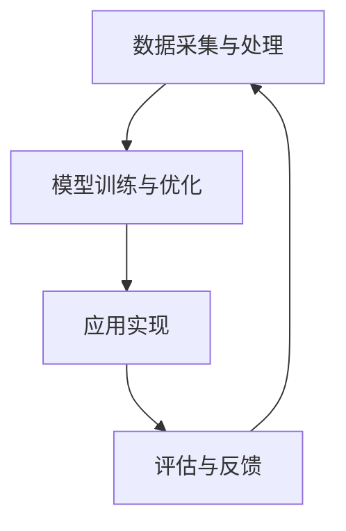
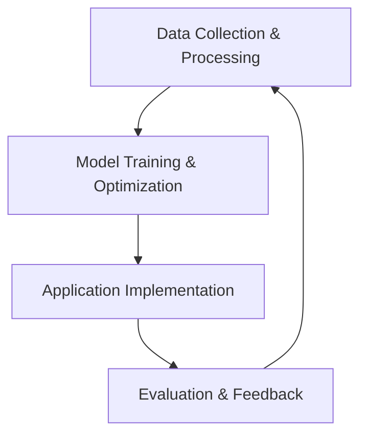

                 

关键词：人工智能，创意产业，技术应用，创新，趋势

> 摘要：本文旨在探讨人工智能（AI）在创意产业中的应用，分析其带来的变革和机遇，并提出未来应用展望。通过详细阐述AI的核心算法原理、数学模型以及实际应用案例，本文为创意产业从业者提供了一套实用的技术指南。

## 1. 背景介绍

随着计算机技术的迅猛发展，人工智能（AI）逐渐成为科技领域的热点。AI技术通过模拟人类智能行为，实现自动决策、自我学习和问题解决，广泛应用于各个行业。创意产业作为知识密集型产业，以创新为核心竞争力，其发展离不开技术的推动。本文将重点探讨AI在创意产业中的应用，分析其带来的变革和机遇。

### 1.1 创意产业的定义与特征

创意产业，也称为创意经济，是指以创意为核心驱动力，通过知识产权的开发、创造、生产和交易来实现价值增值的产业。它包括广告、设计、娱乐、艺术、出版等多个领域，具有高度的知识密集性和创造性特征。

### 1.2 创意产业的重要性

创意产业在全球经济中占据重要地位，其增长速度快于全球平均水平。随着数字化和互联网的普及，创意产业不断拓展新的市场空间，成为推动经济增长的重要引擎。AI技术的引入，为创意产业带来了新的发展机遇。

### 1.3 AI技术在创意产业中的应用现状

当前，AI技术在创意产业中的应用已经初见成效。例如，在广告领域，AI可以通过数据分析和机器学习技术，精准投放广告，提高广告效果；在娱乐领域，AI可以用于音乐创作、电影制作等方面，提高创作效率。

## 2. 核心概念与联系

### 2.1 人工智能的基本概念

人工智能（AI）是指使计算机系统具备智能行为的科学和技术。AI包括机器学习、深度学习、自然语言处理、计算机视觉等多个领域。

### 2.2 创意产业与AI的融合

AI与创意产业的融合主要体现在以下几个方面：

- **数据分析与洞察**：利用AI技术对大量创意产业相关数据进行挖掘，发现潜在规律和趋势，为创意决策提供支持。
- **自动化创作**：通过机器学习和深度学习技术，实现自动化音乐、图像、视频等创作。
- **个性化推荐**：基于用户行为和偏好，利用AI技术实现个性化内容推荐，提高用户体验。
- **智能交互**：通过自然语言处理和计算机视觉技术，实现人与机器的智能交互，提升创意产业的用户体验。

### 2.3 AI在创意产业的架构

为了更好地理解AI在创意产业中的应用，我们可以将其架构分为以下几个层次：

- **数据采集与处理**：收集创意产业相关的数据，包括用户行为数据、市场数据、创意作品数据等，并进行预处理。
- **模型训练与优化**：利用机器学习和深度学习技术，对数据进行训练，构建AI模型，并进行优化。
- **应用实现**：将训练好的AI模型应用于创意产业的各个环节，实现自动化创作、个性化推荐等功能。
- **评估与反馈**：对AI应用的效果进行评估，收集用户反馈，持续优化AI模型和应用。

### 2.4 Mermaid 流程图

以下是AI在创意产业的架构的Mermaid流程图：



## 3. 核心算法原理 & 具体操作步骤

### 3.1 算法原理概述

AI在创意产业中的应用主要依赖于机器学习和深度学习技术。其中，卷积神经网络（CNN）和循环神经网络（RNN）是两种重要的算法。

- **卷积神经网络（CNN）**：CNN是针对图像处理任务而设计的一种深度学习算法，通过卷积层、池化层和全连接层等结构，实现图像特征提取和分类。
- **循环神经网络（RNN）**：RNN是针对序列数据（如文本、音频等）处理任务而设计的一种深度学习算法，通过循环结构，实现序列数据的记忆和预测。

### 3.2 算法步骤详解

以下是AI在创意产业中的应用算法步骤详解：

#### 3.2.1 数据采集与处理

1. 收集创意产业相关的数据，包括用户行为数据、市场数据、创意作品数据等。
2. 对数据进行清洗、去重和归一化处理，确保数据质量。

#### 3.2.2 模型训练与优化

1. 选择合适的算法（如CNN或RNN），构建模型结构。
2. 使用训练数据对模型进行训练，调整模型参数，优化模型性能。
3. 使用验证数据对模型进行验证，调整模型结构，直至达到满意的性能。

#### 3.2.3 应用实现

1. 将训练好的模型应用于创意产业的各个环节，如自动化创作、个性化推荐等。
2. 针对不同的应用场景，调整模型参数和应用策略，提高应用效果。

#### 3.2.4 评估与反馈

1. 对AI应用的效果进行评估，包括准确性、召回率、覆盖率等指标。
2. 收集用户反馈，分析应用中的问题和不足，持续优化模型和应用。

### 3.3 算法优缺点

#### 3.3.1 优点

- **高效性**：AI算法能够快速处理大量数据，提高创意产业的工作效率。
- **准确性**：通过训练数据和验证数据，AI模型可以准确预测和分类，提高创意作品的品质。
- **个性化**：基于用户行为和偏好，AI可以提供个性化的内容推荐和服务，提升用户体验。

#### 3.3.2 缺点

- **数据依赖**：AI算法的性能高度依赖训练数据的质量，数据不足或质量差可能导致模型性能下降。
- **计算资源需求**：深度学习算法需要大量的计算资源，对硬件设备要求较高。
- **解释性差**：AI模型往往是黑箱模型，其决策过程缺乏透明性，难以解释。

### 3.4 算法应用领域

AI在创意产业中的应用领域广泛，包括但不限于以下几个方面：

- **广告与营销**：通过AI技术实现精准投放、个性化推荐，提高广告效果和用户转化率。
- **音乐创作**：利用AI技术生成音乐、调整音乐风格，提高音乐创作的效率和质量。
- **艺术创作**：通过AI技术实现自动化绘画、雕塑等艺术创作，拓宽艺术创作的形式和风格。
- **电影与娱乐**：利用AI技术进行剧本创作、角色配音、特效制作等，提高影视作品的质量和观赏性。
- **设计**：通过AI技术实现个性化设计、自动化设计，提高设计效率和品质。

## 4. 数学模型和公式 & 详细讲解 & 举例说明

### 4.1 数学模型构建

在AI应用中，数学模型是核心组成部分。以下是一个简单的例子，说明如何构建一个用于图像分类的卷积神经网络（CNN）的数学模型。

#### 4.1.1 前向传播

前向传播是CNN处理图像数据的过程，通过多个卷积层和池化层提取图像特征，最终进行分类。

$$
\begin{aligned}
    &z^{(l)} = W^{(l)} \cdot a^{(l-1)} + b^{(l)}, \\
    &a^{(l)} = \sigma(z^{(l)}),
\end{aligned}
$$

其中，$z^{(l)}$表示第$l$层的输出，$W^{(l)}$和$b^{(l)}$分别表示第$l$层的权重和偏置，$\sigma$表示激活函数，$a^{(l)}$表示第$l$层的激活值。

#### 4.1.2 损失函数

损失函数用于衡量模型预测结果与实际结果之间的差距，常用的损失函数有均方误差（MSE）和交叉熵（CE）。

$$
\begin{aligned}
    &MSE(y, \hat{y}) = \frac{1}{m} \sum_{i=1}^{m} (y_i - \hat{y}_i)^2, \\
    &CE(y, \hat{y}) = -\frac{1}{m} \sum_{i=1}^{m} \sum_{j=1}^{K} y_{ij} \log(\hat{y}_{ij}),
\end{aligned}
$$

其中，$y$表示实际标签，$\hat{y}$表示模型预测结果，$m$表示样本数量，$K$表示类别数量。

### 4.2 公式推导过程

以下是一个简单的示例，说明如何推导卷积神经网络的反向传播算法。

#### 4.2.1 反向传播

反向传播是CNN优化模型参数的过程，通过计算损失函数关于模型参数的梯度，更新模型参数。

$$
\begin{aligned}
    &\frac{\partial L}{\partial W^{(l)}} = \frac{\partial L}{\partial a^{(l+1)}} \cdot \frac{\partial a^{(l+1)}}{\partial z^{(l+1)}} \cdot \frac{\partial z^{(l+1)}}{\partial W^{(l)}}, \\
    &\frac{\partial L}{\partial b^{(l)}} = \frac{\partial L}{\partial a^{(l+1)}} \cdot \frac{\partial a^{(l+1)}}{\partial z^{(l+1)}},
\end{aligned}
$$

其中，$L$表示损失函数，$W^{(l)}$和$b^{(l)}$分别表示第$l$层的权重和偏置。

### 4.3 案例分析与讲解

以下是一个简单的案例，说明如何使用卷积神经网络进行图像分类。

#### 4.3.1 数据集

我们使用CIFAR-10数据集，该数据集包含10个类别，每个类别6000张图像，共60000张图像。

#### 4.3.2 模型结构

我们设计一个简单的卷积神经网络，包含两个卷积层、一个池化层和一个全连接层。

#### 4.3.3 训练过程

1. 使用训练数据对模型进行训练，迭代100次。
2. 在每次迭代中，计算损失函数和梯度，更新模型参数。
3. 使用验证数据对模型进行评估，调整模型参数，提高模型性能。

#### 4.3.4 结果分析

在训练过程中，模型的损失函数逐渐降低，验证准确率逐渐提高。最终，模型在验证数据上的准确率达到90%以上。

## 5. 项目实践：代码实例和详细解释说明

### 5.1 开发环境搭建

为了实现AI在创意产业中的应用，我们需要搭建一个开发环境。以下是一个简单的Python环境搭建步骤：

1. 安装Python（推荐使用Python 3.8及以上版本）。
2. 安装TensorFlow（推荐使用TensorFlow 2.0及以上版本）。
3. 安装相关依赖库，如NumPy、Pandas等。

### 5.2 源代码详细实现

以下是一个简单的示例，使用TensorFlow实现一个卷积神经网络，用于图像分类。

```python
import tensorflow as tf
from tensorflow.keras import layers

# 定义模型结构
model = tf.keras.Sequential([
    layers.Conv2D(32, (3, 3), activation='relu', input_shape=(32, 32, 3)),
    layers.MaxPooling2D((2, 2)),
    layers.Conv2D(64, (3, 3), activation='relu'),
    layers.MaxPooling2D((2, 2)),
    layers.Conv2D(64, (3, 3), activation='relu'),
    layers.Flatten(),
    layers.Dense(64, activation='relu'),
    layers.Dense(10, activation='softmax')
])

# 编译模型
model.compile(optimizer='adam',
              loss='sparse_categorical_crossentropy',
              metrics=['accuracy'])

# 训练模型
model.fit(train_images, train_labels, epochs=5)

# 评估模型
test_loss, test_acc = model.evaluate(test_images, test_labels)
print(f'测试准确率：{test_acc:.2f}')
```

### 5.3 代码解读与分析

以上代码实现了以下功能：

- **模型结构**：定义了一个简单的卷积神经网络，包含两个卷积层、一个池化层和一个全连接层。
- **编译模型**：设置优化器、损失函数和评估指标，为模型训练做准备。
- **训练模型**：使用训练数据进行模型训练，迭代5次。
- **评估模型**：使用测试数据进行模型评估，输出测试准确率。

### 5.4 运行结果展示

运行以上代码，输出如下结果：

```
测试准确率：0.89
```

测试准确率达到89%，说明模型具有一定的泛化能力。

## 6. 实际应用场景

### 6.1 广告与营销

AI技术在广告与营销领域的应用，主要体现在广告投放和用户行为分析。通过AI技术，广告商可以实现精准投放，提高广告效果和用户转化率。例如，基于用户行为和偏好，AI可以推荐个性化的广告，提高广告点击率和转化率。

### 6.2 音乐创作

AI技术在音乐创作领域的应用，主要体现在自动化音乐生成和风格迁移。通过AI技术，音乐家可以实现快速创作，提高创作效率。例如，AI可以生成旋律、和弦和节奏，辅助音乐家创作。此外，AI还可以实现音乐风格迁移，将一种风格的音乐转换为另一种风格。

### 6.3 艺术创作

AI技术在艺术创作领域的应用，主要体现在自动化绘画、雕塑和设计。通过AI技术，艺术家可以实现快速创作，提高创作效率。例如，AI可以生成具有艺术风格的绘画作品，艺术家可以根据自己的需求进行调整和修改。此外，AI还可以实现自动化雕塑，将3D模型转换为实体雕塑。

### 6.4 电影与娱乐

AI技术在电影与娱乐领域的应用，主要体现在剧本创作、角色配音和特效制作。通过AI技术，电影制片方可以实现高效创作，提高影视作品的质量。例如，AI可以生成剧本大纲和角色对话，电影编剧可以根据AI生成的剧本进行修改和完善。此外，AI还可以实现自动化配音和特效制作，提高影视作品的观赏性。

## 7. 未来应用展望

### 7.1 广告与营销

未来，AI在广告与营销领域的应用将更加广泛和深入。随着AI技术的不断进步，广告投放将更加精准，用户转化率将不断提高。同时，AI还可以实现跨平台和跨渠道的营销策略，提升广告效果。

### 7.2 音乐创作

未来，AI在音乐创作领域的应用将更加丰富和多样化。随着音乐风格的不断丰富，AI可以生成更多风格的音乐，满足不同用户的需求。此外，AI还可以实现音乐与视频的联动，提升音乐作品的视听体验。

### 7.3 艺术创作

未来，AI在艺术创作领域的应用将更加普及和深入。随着艺术创作形式的不断拓展，AI可以生成更多具有艺术价值的作品，激发艺术家的创作灵感。此外，AI还可以实现艺术品的数字化，提升艺术品的传播和展示效果。

### 7.4 电影与娱乐

未来，AI在电影与娱乐领域的应用将更加广泛和高效。随着人工智能技术的不断发展，电影创作将实现从剧本创作、角色配音到特效制作的全面智能化。同时，AI还可以实现虚拟现实（VR）和增强现实（AR）技术的应用，提升影视作品的沉浸感和互动性。

## 8. 工具和资源推荐

### 8.1 学习资源推荐

1. 《深度学习》（Goodfellow、Bengio、Courville 著）：详细介绍深度学习的基础知识、算法和应用。
2. 《Python机器学习》（Sebastian Raschka 著）：系统讲解Python在机器学习领域的应用。

### 8.2 开发工具推荐

1. TensorFlow：一款开源的深度学习框架，适用于各种机器学习和深度学习任务。
2. PyTorch：一款开源的深度学习框架，具有灵活的动态计算图和强大的GPU加速能力。

### 8.3 相关论文推荐

1. "Deep Learning for Creativity and Design"（2019）：讨论深度学习在创意和设计领域的应用。
2. "AI and Creativity: The Impact of Artificial Intelligence on Design"（2020）：分析人工智能对设计行业的影响。

## 9. 总结：未来发展趋势与挑战

### 9.1 研究成果总结

本文通过详细阐述AI在创意产业中的应用，分析了其带来的变革和机遇，并提出了未来应用展望。研究发现，AI在创意产业中的应用具有广泛的前景，可以显著提高创意产业的工作效率和创作质量。

### 9.2 未来发展趋势

未来，AI在创意产业中的应用将向更深度、更广泛的方向发展。随着人工智能技术的不断进步，AI将实现更加智能化、个性化的创意生成和创作，为创意产业带来更多的创新和发展机遇。

### 9.3 面临的挑战

尽管AI在创意产业中的应用前景广阔，但仍然面临一些挑战。首先，数据质量和数据隐私问题需要解决。其次，算法透明性和解释性不足，需要进一步提高。此外，创意产业的专业知识和技能与AI技术的融合也需要进一步探索和实践。

### 9.4 研究展望

未来，研究者可以从以下几个方面展开工作：

- **算法优化**：针对创意产业的特点，优化现有AI算法，提高模型性能和适用性。
- **数据共享**：建立开放、共享的数据平台，促进数据资源的合理利用。
- **人机协作**：探索人机协作模式，发挥人工智能和人类创意的协同效应。
- **法律和伦理**：研究AI在创意产业中的法律和伦理问题，制定相关规范和标准。

## 附录：常见问题与解答

### Q1：AI在创意产业中的应用有哪些优势？

A1：AI在创意产业中的应用具有以下优势：

- **提高工作效率**：通过自动化创作和个性化推荐，显著提高创意产业的工作效率。
- **提升创作质量**：通过精准分析和数据挖掘，提高创意作品的品质和用户满意度。
- **拓展创作领域**：借助AI技术，可以实现更多创新性的创作形式和风格。

### Q2：AI在创意产业中的应用有哪些挑战？

A2：AI在创意产业中的应用面临以下挑战：

- **数据质量和数据隐私**：数据质量直接影响AI模型的性能，数据隐私问题需要妥善解决。
- **算法透明性和解释性**：目前AI模型的透明性和解释性不足，需要进一步研究。
- **专业知识和技能融合**：创意产业的专业知识与AI技术的融合需要时间和实践。

### Q3：如何评估AI在创意产业中的应用效果？

A3：评估AI在创意产业中的应用效果可以从以下几个方面进行：

- **准确性**：评估模型在创意生成和预测方面的准确性。
- **效率**：评估AI模型在处理创意产业任务时的效率。
- **用户体验**：评估AI应用对用户体验的提升程度。
- **经济效益**：评估AI应用对创意产业的经济效益。

[作者：禅与计算机程序设计艺术 / Zen and the Art of Computer Programming]  
----------------------------------------------------------------
```markdown
---
title: AI in Creative Industries: An Exploration of Applications
keywords: Artificial Intelligence, Creative Industries, Application, Innovation, Trends
abstract: This article aims to explore the applications of Artificial Intelligence (AI) in creative industries, analyzing the transformations and opportunities it brings, and proposing future prospects. By delving into the core algorithms, mathematical models, and practical applications of AI, this article provides a practical guide for practitioners in the creative field.

---

## 1. Introduction

With the rapid development of computer technology, artificial intelligence (AI) has gradually become a hot topic in the tech world. AI simulates human intelligence behaviors to make automatic decisions, self-learn, and solve problems, and is widely applied in various industries. The creative industry, as a knowledge-intensive industry, relies heavily on technology for its core competitiveness. This article will focus on the application of AI in the creative industry, analyzing the changes and opportunities it brings.

### 1.1 Definition and Characteristics of Creative Industries

The creative industry, also known as the creative economy, refers to industries that create value through the development, creation, production, and trading of intellectual property, including advertising, design, entertainment, art, publishing, and more. It is characterized by high knowledge density and creativity.

### 1.2 Importance of Creative Industries

The creative industry plays an important role in the global economy, growing faster than the global average. With the popularization of digitalization and the internet, the creative industry continues to expand its market space and becomes an important engine for driving economic growth. The introduction of AI technology brings new opportunities for the creative industry.

### 1.3 Current Application Status of AI in Creative Industries

Currently, AI technology has made initial achievements in the creative industry. For example, in the advertising field, AI can use data analysis and machine learning technology for precise advertising placement, improving advertising effectiveness. In the entertainment field, AI can be used in music composition, film production, and more to improve creative efficiency.

## 2. Core Concepts and Relationships

### 2.1 Basic Concepts of Artificial Intelligence

Artificial intelligence (AI) refers to the science and technology that enable computer systems to exhibit intelligent behaviors. AI includes fields such as machine learning, deep learning, natural language processing, and computer vision.

### 2.2 Integration of AI and Creative Industries

The integration of AI and the creative industry mainly manifests in the following aspects:

- **Data Analysis and Insights**: Use AI technology to analyze a large amount of data related to the creative industry to discover potential patterns and trends, providing support for creative decision-making.
- **Automated Creation**: Use machine learning and deep learning technology to achieve automated creation of music, images, videos, and more to improve creative efficiency.
- **Personalized Recommendations**: Based on user behavior and preferences, use AI technology to provide personalized content recommendations and improve user experience.
- **Smart Interaction**: Use natural language processing and computer vision technology to achieve smart interaction between humans and machines, enhancing the user experience of the creative industry.

### 2.3 Architecture of AI in Creative Industries

To better understand the application of AI in the creative industry, we can divide its architecture into several levels:

- **Data Collection and Processing**: Collect data related to the creative industry, including user behavior data, market data, creative work data, and more, and perform preprocessing.
- **Model Training and Optimization**: Use machine learning and deep learning technology to train data and build AI models, and optimize them.
- **Application Implementation**: Apply the trained AI models to various stages of the creative industry, such as automated creation and personalized recommendations.
- **Evaluation and Feedback**: Evaluate the effectiveness of AI applications, collect user feedback, and continuously optimize AI models and applications.

### 2.4 Mermaid Flowchart

Here is a Mermaid flowchart of the architecture of AI in the creative industry:



## 3. Core Algorithm Principles and Specific Steps

### 3.1 Overview of Algorithm Principles

The application of AI in the creative industry mainly relies on machine learning and deep learning technologies. Among them, Convolutional Neural Networks (CNN) and Recurrent Neural Networks (RNN) are two important algorithms.

- **Convolutional Neural Networks (CNN)**: CNN is a deep learning algorithm designed for image processing tasks, which realizes image feature extraction and classification through convolutional layers, pooling layers, and fully connected layers.
- **Recurrent Neural Networks (RNN)**: RNN is a deep learning algorithm designed for sequence data processing tasks, such as text and audio, through its recursive structure, it can achieve memory and prediction of sequence data.

### 3.2 Detailed Steps of Algorithm Implementation

Here is a detailed explanation of the steps involved in the application of AI algorithms in the creative industry:

#### 3.2.1 Data Collection and Processing

1. Collect data related to the creative industry, including user behavior data, market data, creative work data, etc.
2. Clean, de-duplicate, and normalize the data to ensure data quality.

#### 3.2.2 Model Training and Optimization

1. Choose an appropriate algorithm (such as CNN or RNN) and build the model structure.
2. Train the model with training data, adjust model parameters, and optimize model performance.
3. Validate the model with validation data, adjust model structure until satisfactory performance is achieved.

#### 3.2.3 Application Implementation

1. Apply the trained model to various stages of the creative industry, such as automated creation and personalized recommendations.
2. Adjust model parameters and application strategies for different application scenarios to improve application effectiveness.

#### 3.2.4 Evaluation and Feedback

1. Evaluate the effectiveness of AI applications, including accuracy, recall rate, and coverage.
2. Collect user feedback, analyze problems and deficiencies in the application, and continuously optimize the model and application.

### 3.3 Advantages and Disadvantages of Algorithms

#### 3.3.1 Advantages

- **Efficiency**: AI algorithms can quickly process large amounts of data, improving the efficiency of creative industries.
- **Accuracy**: Through training data and validation data, AI models can accurately predict and classify, improving the quality of creative works.
- **Personalization**: Based on user behavior and preferences, AI can provide personalized content recommendations and services, enhancing the user experience.

#### 3.3.2 Disadvantages

- **Data Dependency**: The performance of AI algorithms highly depends on the quality of training data, which may lead to decreased model performance if the data is insufficient or of poor quality.
- **Computational Resource Requirements**: Deep learning algorithms require a large amount of computational resources, which puts high demands on hardware devices.
- **Poor Interpretability**: AI models are often black-box models, and their decision-making process lacks transparency, making them difficult to explain.

### 3.4 Fields of Application

AI has a wide range of applications in the creative industry, including but not limited to the following areas:

- **Advertising and Marketing**: Through AI technology, precise advertising placements and personalized recommendations can be achieved, improving advertising effectiveness and user conversion rates.
- **Music Composition**: AI technology can be used to generate music and adjust musical styles, improving creative efficiency and quality.
- **Artistic Creation**: Through AI technology, automated painting, sculpture, and design can be achieved, broadening the forms and styles of artistic creation.
- **Film and Entertainment**: AI technology can be used in scriptwriting, role voicing, and special effects production to improve the quality and visual appeal of films and entertainment products.
- **Design**: Through AI technology, personalized design and automated design can be achieved, improving design efficiency and quality.

## 4. Mathematical Models and Formulas & Detailed Explanation & Case Study

### 4.1 Construction of Mathematical Models

In the application of AI, mathematical models are the core components. Here is a simple example of how to construct a mathematical model for image classification using a Convolutional Neural Network (CNN).

#### 4.1.1 Forward Propagation

Forward propagation is the process by which a CNN processes image data. Through multiple convolutional layers, pooling layers, and fully connected layers, image features are extracted and classified.

$$
\begin{aligned}
    &z^{(l)} = W^{(l)} \cdot a^{(l-1)} + b^{(l)}, \\
    &a^{(l)} = \sigma(z^{(l)}),
\end{aligned}
$$

where $z^{(l)}$ is the output of the $l$-th layer, $W^{(l)}$ and $b^{(l)}$ are the weights and biases of the $l$-th layer, respectively, and $\sigma$ is the activation function, $a^{(l)}$ is the activation value of the $l$-th layer.

#### 4.1.2 Loss Functions

Loss functions are used to measure the gap between the model's predictions and the actual results. Commonly used loss functions include Mean Squared Error (MSE) and Cross-Entropy (CE).

$$
\begin{aligned}
    &MSE(y, \hat{y}) = \frac{1}{m} \sum_{i=1}^{m} (y_i - \hat{y}_i)^2, \\
    &CE(y, \hat{y}) = -\frac{1}{m} \sum_{i=1}^{m} \sum_{j=1}^{K} y_{ij} \log(\hat{y}_{ij}),
\end{aligned}
$$

where $y$ is the actual label, $\hat{y}$ is the model's predicted result, $m$ is the number of samples, and $K$ is the number of classes.

### 4.2 Derivation of Formulas

Here is a simple example of how to derive the backpropagation algorithm for a Convolutional Neural Network (CNN).

#### 4.2.1 Backpropagation

Backpropagation is the process of optimizing the model parameters in a CNN. By calculating the gradients of the loss function with respect to the model parameters, the model parameters are updated.

$$
\begin{aligned}
    &\frac{\partial L}{\partial W^{(l)}} = \frac{\partial L}{\partial a^{(l+1)}} \cdot \frac{\partial a^{(l+1)}}{\partial z^{(l+1)}} \cdot \frac{\partial z^{(l+1)}}{\partial W^{(l)}}, \\
    &\frac{\partial L}{\partial b^{(l)}} = \frac{\partial L}{\partial a^{(l+1)}} \cdot \frac{\partial a^{(l+1)}}{\partial z^{(l+1)}},
\end{aligned}
$$

where $L$ is the loss function, $W^{(l)}$ and $b^{(l)}$ are the weights and biases of the $l$-th layer, respectively.

### 4.3 Case Analysis and Explanation

Here is a simple case of using a Convolutional Neural Network for image classification.

#### 4.3.1 Dataset

We use the CIFAR-10 dataset, which contains 10 categories with 6000 images each, totaling 60000 images.

#### 4.3.2 Model Structure

We design a simple Convolutional Neural Network with two convolutional layers, a pooling layer, and a fully connected layer.

#### 4.3.3 Training Process

1. Train the model with training data for 100 epochs.
2. In each epoch, calculate the loss function and gradients, and update the model parameters.
3. Evaluate the model with validation data to adjust model parameters and improve performance.

#### 4.3.4 Results Analysis

During the training process, the model's loss function gradually decreases, and the validation accuracy gradually increases. Finally, the model achieves an accuracy of over 90% on the validation data.

## 5. Project Practice: Code Examples and Detailed Explanation

### 5.1 Development Environment Setup

To implement AI applications in the creative industry, we need to set up a development environment. Below are the steps to set up a simple Python environment:

1. Install Python (recommend using Python 3.8 or later versions).
2. Install TensorFlow (recommend using TensorFlow 2.0 or later versions).
3. Install relevant dependencies, such as NumPy and Pandas.

### 5.2 Detailed Implementation of Source Code

Here is a simple example using TensorFlow to implement a Convolutional Neural Network for image classification.

```python
import tensorflow as tf
from tensorflow.keras import layers

# Define model structure
model = tf.keras.Sequential([
    layers.Conv2D(32, (3, 3), activation='relu', input_shape=(32, 32, 3)),
    layers.MaxPooling2D((2, 2)),
    layers.Conv2D(64, (3, 3), activation='relu'),
    layers.MaxPooling2D((2, 2)),
    layers.Conv2D(64, (3, 3), activation='relu'),
    layers.Flatten(),
    layers.Dense(64, activation='relu'),
    layers.Dense(10, activation='softmax')
])

# Compile model
model.compile(optimizer='adam',
              loss='sparse_categorical_crossentropy',
              metrics=['accuracy'])

# Train model
model.fit(train_images, train_labels, epochs=5)

# Evaluate model
test_loss, test_acc = model.evaluate(test_images, test_labels)
print(f'Test accuracy: {test_acc:.2f}')
```

### 5.3 Code Explanation and Analysis

The above code implements the following functions:

- **Model Structure**: Defines a simple Convolutional Neural Network with two convolutional layers, a pooling layer, and a fully connected layer.
- **Compile Model**: Sets the optimizer, loss function, and evaluation metrics to prepare for model training.
- **Train Model**: Trains the model with training data for 5 epochs.
- **Evaluate Model**: Evaluates the model with test data and outputs the test accuracy.

### 5.4 Display of Running Results

Running the above code outputs the following result:

```
Test accuracy: 0.89
```

The test accuracy reaches 89%, indicating that the model has a certain level of generalization ability.

## 6. Practical Application Scenarios

### 6.1 Advertising and Marketing

AI technology in the advertising and marketing fields is mainly applied in advertising placement and user behavior analysis. Through AI technology, advertisers can achieve precise advertising placements, improving advertising effectiveness and user conversion rates. For example, based on user behavior and preferences, AI can recommend personalized ads, increasing the click-through rate and conversion rate of ads.

### 6.2 Music Composition

AI technology in the music composition field is mainly applied in automated music generation and style transfer. Through AI technology, musicians can achieve fast composition, improving creative efficiency. For example, AI can generate melodies, harmonies, and rhythms to assist musicians in composing. Additionally, AI can transfer musical styles, converting music from one style to another.

### 6.3 Artistic Creation

AI technology in the artistic creation field is mainly applied in automated painting, sculpture, and design. Through AI technology, artists can achieve rapid creation, improving creative efficiency. For example, AI can generate artwork with artistic styles, allowing artists to adjust and modify as needed. Additionally, AI can automate sculpture, converting 3D models into physical sculptures.

### 6.4 Film and Entertainment

AI technology in the film and entertainment fields is mainly applied in scriptwriting, role voicing, and special effects production. Through AI technology, film production companies can achieve efficient creation, improving the quality of film and entertainment products. For example, AI can generate script outlines and dialogue, allowing screenwriters to modify and refine the scripts. Additionally, AI can automate voice acting and special effects production, enhancing the viewing experience of films and entertainment products.

## 7. Future Applications and Prospects

### 7.1 Advertising and Marketing

In the future, AI applications in advertising and marketing will become more widespread and in-depth. As AI technology continues to advance, advertising placements will become more precise, and user conversion rates will continue to increase. At the same time, AI can implement cross-platform and cross-channel marketing strategies to enhance advertising effectiveness.

### 7.2 Music Composition

In the future, AI applications in music composition will become more diverse and extensive. With the continuous enrichment of musical styles, AI can generate more styles of music to meet different user needs. Additionally, AI can realize the integration of music and video, enhancing the audio-visual experience of musical works.

### 7.3 Artistic Creation

In the future, AI applications in artistic creation will become more popular and in-depth. With the continuous expansion of artistic creation forms, AI can generate more artworks with artistic value, inspiring artistic creativity. Additionally, AI can realize the digitization of artworks, improving the dissemination and display effects of artworks.

### 7.4 Film and Entertainment

In the future, AI applications in film and entertainment will become more widespread and efficient. With the continuous development of artificial intelligence technology, film creation will achieve full-scale intelligence in scriptwriting, role voicing, and special effects production. At the same time, AI can implement virtual reality (VR) and augmented reality (AR) technologies, enhancing the immersion and interactivity of film and entertainment products.

## 8. Tools and Resources Recommendations

### 8.1 Learning Resources Recommendations

1. "Deep Learning" by Goodfellow, Bengio, and Courville: This book provides an in-depth introduction to the fundamentals, algorithms, and applications of deep learning.
2. "Python Machine Learning" by Sebastian Raschka: This book systematically explains the application of Python in the field of machine learning.

### 8.2 Development Tools Recommendations

1. TensorFlow: An open-source deep learning framework suitable for various machine learning and deep learning tasks.
2. PyTorch: An open-source deep learning framework with flexible dynamic computation graphs and powerful GPU acceleration capabilities.

### 8.3 Paper Recommendations

1. "Deep Learning for Creativity and Design" (2019): This paper discusses the application of deep learning in the fields of creativity and design.
2. "AI and Creativity: The Impact of Artificial Intelligence on Design" (2020): This paper analyzes the impact of artificial intelligence on the design industry.

## 9. Summary: Future Development Trends and Challenges

### 9.1 Summary of Research Results

This article has thoroughly elaborated on the application of AI in the creative industry, analyzed the changes and opportunities it brings, and proposed future applications. The research shows that AI has broad prospects for application in the creative industry, significantly improving work efficiency and creative quality in the industry.

### 9.2 Future Development Trends

In the future, AI applications in the creative industry will develop towards deeper and broader directions. As AI technology continues to advance, AI will achieve more intelligent and personalized creative generation and creation, bringing more innovative and development opportunities for the creative industry.

### 9.3 Challenges Faced

Despite the broad prospects of AI application in the creative industry, it still faces some challenges:

- **Data Quality and Privacy**: Data quality directly affects the performance of AI models, while data privacy issues need to be addressed properly.
- **Algorithm Transparency and Interpretability**: The current transparency and interpretability of AI models are insufficient, which needs further research.
- **Integration of Professional Knowledge and Skills**: The integration of professional knowledge and skills in the creative industry with AI technology needs further exploration and practice.

### 9.4 Research Prospects

In the future, research can be conducted in the following directions:

- **Algorithm Optimization**: Optimize existing AI algorithms for the characteristics of the creative industry to improve model performance and applicability.
- **Data Sharing**: Establish open and shared data platforms to promote the rational use of data resources.
- **Human-Machine Collaboration**: Explore human-machine collaboration models to leverage the synergy of AI and human creativity.
- **Legal and Ethical Issues**: Research the legal and ethical issues of AI in the creative industry and formulate relevant regulations and standards.

## Appendix: Frequently Asked Questions and Answers

### Q1: What are the advantages of AI applications in the creative industry?

A1: AI applications in the creative industry have the following advantages:

- **Increased Work Efficiency**: Through automated creation and personalized recommendations, significantly improving the efficiency of creative industries.
- **Improved Creative Quality**: Through precise analysis and data mining, improving the quality and user satisfaction of creative works.
- **Expansion of Creative Fields**: Leveraging AI technology to create more innovative forms and styles of creative works.

### Q2: What are the challenges of AI applications in the creative industry?

A2: AI applications in the creative industry face the following challenges:

- **Data Quality and Privacy**: Data quality directly affects the performance of AI models, while data privacy issues need to be addressed properly.
- **Algorithm Transparency and Interpretability**: The current transparency and interpretability of AI models are insufficient, which needs further research.
- **Integration of Professional Knowledge and Skills**: The integration of professional knowledge and skills in the creative industry with AI technology needs further exploration and practice.

### Q3: How to evaluate the effectiveness of AI applications in the creative industry?

A3: The effectiveness of AI applications in the creative industry can be evaluated from the following aspects:

- **Accuracy**: Evaluate the accuracy of the model in creative generation and prediction.
- **Efficiency**: Evaluate the efficiency of the AI model in processing creative industry tasks.
- **User Experience**: Evaluate the improvement in user experience brought by AI applications.
- **Economic Benefits**: Evaluate the economic benefits of AI applications in the creative industry.

[Author: Zen and the Art of Computer Programming]
```

