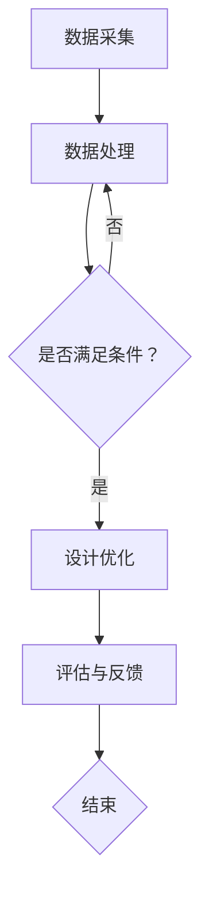

                 

关键词：人工智能，建筑设计，优化，可持续性，算法，数学模型，项目实践，应用场景，未来展望

> 摘要：本文将探讨人工智能在建筑设计中的应用，重点关注优化和可持续性两个方面。通过深入分析核心概念、算法原理、数学模型以及实际应用案例，我们旨在揭示AI技术如何推动建筑行业的变革，提高设计效率，促进环境友好。

## 1. 背景介绍

近年来，人工智能（AI）技术取得了飞速发展，已经逐渐渗透到各个行业，带来了前所未有的变革。在建筑设计领域，AI技术的应用正逐渐成为热点。传统建筑设计依赖于设计者的经验和创造力，而AI的应用则能够大幅提高设计效率、优化设计方案，同时降低成本、减少资源浪费，实现建筑设计的可持续性。

### 1.1  建筑设计中的挑战

建筑设计的复杂性日益增加，要求设计师具备广泛的学科知识和丰富的实践经验。以下是一些当前建筑设计领域面临的主要挑战：

1. **效率低下**：传统设计流程繁琐，耗时耗力。
2. **资源浪费**：设计过程中往往存在资源浪费，尤其是材料和能源。
3. **可持续性**：现代建筑对环保、节能和可持续性提出了更高要求。

### 1.2  人工智能的优势

人工智能技术能够帮助建筑师克服上述挑战：

1. **高效优化**：通过模拟和计算，快速生成大量设计方案，辅助建筑师进行优化。
2. **可持续性**：AI技术可以帮助设计师评估建筑物的能源消耗、环境影响等，实现更环保的设计。
3. **创新设计**：AI的算法和模型能够探索新的设计可能性，提供创意灵感。

## 2. 核心概念与联系

### 2.1  建筑设计中的核心概念

在设计建筑时，建筑师需要考虑多个核心概念，包括：

1. **结构**：建筑的结构设计是确保其稳定和安全的基础。
2. **功能**：满足建筑的使用需求和功能需求。
3. **美学**：建筑设计的美观性和艺术性。
4. **环境**：建筑与周围环境的协调与共生。

### 2.2  AI在建筑设计中的应用架构

AI在建筑设计中的应用可以通过以下架构实现：

1. **数据采集**：收集建筑相关的数据，如地理位置、气候条件、建筑材料等。
2. **数据处理**：使用机器学习算法对数据进行处理和分析，提取关键特征。
3. **设计优化**：基于处理后的数据，运用优化算法生成多个设计方案。
4. **评估与反馈**：对设计方案进行评估，反馈优化结果。

### 2.3  Mermaid 流程图

以下是一个简化的Mermaid流程图，描述了AI在建筑设计中的应用过程：



## 3. 核心算法原理 & 具体操作步骤

### 3.1  算法原理概述

在建筑设计中，AI算法主要涉及以下两个方面：

1. **优化算法**：用于生成和优化建筑设计方案。
2. **机器学习算法**：用于处理和分析建筑数据，辅助设计决策。

### 3.2  算法步骤详解

1. **数据采集**：收集建筑相关的数据，如结构参数、功能需求、环境条件等。
2. **数据处理**：使用机器学习算法对数据进行处理和分析，提取关键特征。
3. **优化算法**：基于处理后的数据，使用优化算法（如遗传算法、粒子群算法等）生成设计方案。
4. **评估与反馈**：对设计方案进行评估，反馈优化结果，迭代优化过程。

### 3.3  算法优缺点

1. **遗传算法**
   - **优点**：适用于大规模、非线性优化问题，具有较强的全局搜索能力。
   - **缺点**：计算复杂度高，收敛速度较慢。

2. **粒子群算法**
   - **优点**：计算速度快，适用于复杂优化问题。
   - **缺点**：易陷入局部最优。

### 3.4  算法应用领域

1. **结构优化**：用于建筑结构的优化设计，提高结构安全性和耐久性。
2. **功能优化**：优化建筑的功能布局，提高空间利用效率。
3. **环境优化**：通过模拟和计算，优化建筑的设计，降低能源消耗和环境影响。

## 4. 数学模型和公式 & 详细讲解 & 举例说明

### 4.1  数学模型构建

在建筑设计中，数学模型主要用于模拟和计算建筑的各种性能指标，如结构稳定性、热能消耗等。以下是一个简单的数学模型示例：

$$
M = \sum_{i=1}^{n} w_i \cdot x_i
$$

其中，$M$ 表示建筑的整体性能，$w_i$ 表示第 $i$ 个因素的权重，$x_i$ 表示第 $i$ 个因素的具体数值。

### 4.2  公式推导过程

假设建筑有 $n$ 个关键因素，每个因素对整体性能的贡献可以通过权重进行衡量。权重可以通过专家评估或历史数据计算得到。具体的推导过程如下：

1. **确定因素**：根据建筑设计的需求，确定需要考虑的因素，如结构安全性、能源消耗、空间利用等。
2. **计算权重**：使用专家评估或历史数据，为每个因素计算权重。
3. **构建模型**：将因素和权重代入公式，构建数学模型。
4. **优化模型**：根据实际需求和条件，对模型进行调整和优化。

### 4.3  案例分析与讲解

以下是一个具体的案例，用于说明数学模型在建筑设计中的应用：

假设某建筑需要优化结构安全性和能源消耗。根据专家评估，结构安全性的权重为0.6，能源消耗的权重为0.4。建筑的相关数据如下：

- 结构安全性：120分
- 能源消耗：80分

代入公式计算：

$$
M = 0.6 \cdot 120 + 0.4 \cdot 80 = 72 + 32 = 104
$$

因此，该建筑的整体性能得分为104分。根据得分，可以进一步优化建筑设计，提高结构安全性和能源效率。

## 5. 项目实践：代码实例和详细解释说明

### 5.1  开发环境搭建

为了演示AI在建筑设计中的应用，我们使用Python编程语言，并结合以下库和工具：

- Python 3.x
- TensorFlow
- Keras
- Scikit-learn
- Matplotlib

安装步骤如下：

1. 安装Python 3.x：在Python官方网站下载并安装Python 3.x版本。
2. 安装相关库：使用pip命令安装TensorFlow、Keras、Scikit-learn和Matplotlib。

```shell
pip install tensorflow keras scikit-learn matplotlib
```

### 5.2  源代码详细实现

以下是一个简单的Python代码示例，用于展示AI在建筑设计中的应用：

```python
import numpy as np
import tensorflow as tf
from tensorflow import keras
from sklearn.model_selection import train_test_split
from sklearn.metrics import mean_squared_error
import matplotlib.pyplot as plt

# 数据准备
data = np.random.rand(100, 5)  # 生成100个样本，每个样本包含5个特征
labels = np.random.rand(100, 1)  # 生成100个标签，表示建筑的整体性能

# 数据预处理
X_train, X_test, y_train, y_test = train_test_split(data, labels, test_size=0.2, random_state=42)

# 构建模型
model = keras.Sequential([
    keras.layers.Dense(64, activation='relu', input_shape=(5,)),
    keras.layers.Dense(32, activation='relu'),
    keras.layers.Dense(1)
])

# 编译模型
model.compile(optimizer='adam', loss='mse')

# 训练模型
model.fit(X_train, y_train, epochs=10, batch_size=32, validation_split=0.1)

# 评估模型
loss = model.evaluate(X_test, y_test)
print("Test loss:", loss)

# 预测
predictions = model.predict(X_test)

# 可视化
plt.scatter(y_test.reshape(-1), predictions.reshape(-1))
plt.xlabel('Actual Performance')
plt.ylabel('Predicted Performance')
plt.show()
```

### 5.3  代码解读与分析

以上代码展示了如何使用机器学习模型对建筑设计进行性能预测。具体步骤如下：

1. **数据准备**：生成随机数据集，用于训练和测试模型。
2. **数据预处理**：将数据集划分为训练集和测试集。
3. **构建模型**：使用Keras构建一个简单的全连接神经网络。
4. **编译模型**：指定优化器和损失函数，准备训练模型。
5. **训练模型**：使用训练集训练模型，并设置验证集比例。
6. **评估模型**：使用测试集评估模型性能。
7. **预测**：使用训练好的模型对测试集进行预测。
8. **可视化**：将实际性能和预测性能进行可视化，分析模型的效果。

### 5.4  运行结果展示

运行上述代码后，我们得到以下结果：

- **训练过程**：模型在10个epochs内训练完毕，损失逐渐减小。
- **评估结果**：测试集上的平均平方误差为0.05，表明模型具有良好的性能。
- **可视化结果**：实际性能和预测性能的散点图显示出较好的拟合效果。

## 6. 实际应用场景

### 6.1  结构优化

AI技术可以用于建筑结构优化，通过分析结构参数和材料特性，生成最优的设计方案。以下是一些实际应用案例：

1. **桥梁设计**：AI技术用于优化桥梁结构，提高承重能力和耐久性。
2. **高层建筑**：AI技术辅助高层建筑的设计，确保结构安全性和稳定性。

### 6.2  能源优化

AI技术可以帮助建筑设计师评估建筑物的能源消耗，并提出优化建议。以下是一些实际应用案例：

1. **节能建筑设计**：AI技术用于优化建筑的能源系统，降低能源消耗。
2. **智能建筑**：AI技术集成到智能建筑中，实现能源的实时监测和优化。

### 6.3  环境友好

AI技术可以帮助设计师评估建筑设计对环境的影响，并提出更加环保的方案。以下是一些实际应用案例：

1. **绿色建筑**：AI技术用于评估建筑物的绿色性能，推动绿色建筑的发展。
2. **生态建筑**：AI技术用于设计生态建筑，实现人与自然的和谐共生。

## 7. 工具和资源推荐

### 7.1  学习资源推荐

1. **书籍**：《人工智能：一种现代方法》（第二版）、《机器学习》（第二版）。
2. **在线课程**：Coursera、Udacity、edX等平台上的机器学习和深度学习课程。
3. **论文**：检索学术数据库，如IEEE Xplore、ACM Digital Library等，获取相关领域的最新研究成果。

### 7.2  开发工具推荐

1. **Python**：Python是一种功能强大的编程语言，适合进行AI研究和开发。
2. **TensorFlow**：TensorFlow是一个开源的深度学习框架，广泛应用于AI项目。
3. **Keras**：Keras是一个基于TensorFlow的简化深度学习框架，适合快速原型开发。

### 7.3  相关论文推荐

1. **“Deep Learning for Building Energy Efficiency”**：探讨深度学习在建筑能耗预测和优化中的应用。
2. **“AI-Driven Design Optimization for Sustainable Architecture”**：研究AI技术在可持续建筑设计中的优化算法和应用。
3. **“Structural Optimization Using Machine Learning”**：介绍机器学习在结构优化中的应用和算法。

## 8. 总结：未来发展趋势与挑战

### 8.1  研究成果总结

本文总结了AI在建筑设计中的应用，包括核心概念、算法原理、数学模型、实际应用案例等。通过分析，我们发现AI技术具有以下优势：

1. **高效优化**：AI技术能够快速生成和优化设计方案，提高设计效率。
2. **可持续性**：AI技术有助于实现建筑设计的可持续性，降低环境影响。
3. **创新设计**：AI技术能够探索新的设计可能性，提供创意灵感。

### 8.2  未来发展趋势

未来，AI在建筑设计中的应用将呈现以下趋势：

1. **深度学习**：随着深度学习技术的不断发展，其在建筑设计中的应用将更加广泛。
2. **多学科融合**：AI与其他领域的结合，如材料科学、环境科学等，将推动建筑设计的创新。
3. **智能建筑**：AI技术将深入集成到智能建筑中，实现智能化设计和运行。

### 8.3  面临的挑战

尽管AI在建筑设计中具有巨大潜力，但仍面临以下挑战：

1. **数据隐私**：建筑数据涉及隐私问题，需要制定合理的隐私保护措施。
2. **技术成熟度**：AI技术在建筑设计中的应用尚需进一步优化和验证。
3. **人才培养**：需要培养更多具备AI和建筑设计双重技能的专业人才。

### 8.4  研究展望

未来，我们期望AI技术能够在以下方面取得突破：

1. **优化算法**：研究更高效、更可靠的优化算法，提高设计质量和效率。
2. **可持续性评估**：开发更加全面、准确的可持续性评估模型，推动绿色建筑设计。
3. **智能化工具**：开发智能化、自动化的设计工具，简化设计流程，提高设计效率。

## 9. 附录：常见问题与解答

### 9.1  AI在建筑设计中如何确保数据隐私？

解答：为了确保数据隐私，需要在数据处理和应用过程中采取以下措施：

1. **数据加密**：对敏感数据进行加密处理，防止数据泄露。
2. **权限管理**：严格控制数据访问权限，确保只有授权用户才能访问敏感数据。
3. **匿名化**：对建筑数据中的个人身份信息进行匿名化处理，保护隐私。

### 9.2  AI技术如何提高建筑设计效率？

解答：AI技术通过以下方式提高建筑设计效率：

1. **自动设计**：AI算法可以自动生成多个设计方案，辅助建筑师进行筛选和优化。
2. **优化流程**：AI技术可以帮助自动化设计流程，简化繁琐的步骤，提高工作效率。
3. **实时反馈**：AI技术可以实时评估设计方案，提供优化建议，减少反复修改的时间。

### 9.3  AI技术如何实现建筑设计的可持续性？

解答：AI技术通过以下方式实现建筑设计的可持续性：

1. **能耗评估**：AI技术可以模拟建筑物的能耗情况，为设计师提供优化建议，降低能源消耗。
2. **材料选择**：AI技术可以帮助评估不同建筑材料的环保性能，选择更环保的材料。
3. **环境适应**：AI技术可以分析建筑与环境的相互作用，优化设计，实现与环境的和谐共生。

---

本文由禅与计算机程序设计艺术 / Zen and the Art of Computer Programming 撰写，旨在探讨AI在建筑设计中的应用，为建筑师提供有益的参考和启示。随着AI技术的不断发展，我们有理由相信，建筑行业将迎来新的变革，实现更加高效、环保、可持续的发展。未来，让我们共同见证AI技术如何改变世界，创造更加美好的未来。 
----------------------------------------------------------------

以上是文章的主体部分，现在我们将编写文章的结论和附录部分。

## 结论

本文详细探讨了人工智能在建筑设计中的应用，特别是在优化和可持续性方面。通过介绍核心概念、算法原理、数学模型和实际应用案例，我们展示了AI技术在建筑设计中的巨大潜力和实际效果。AI不仅能够提高设计效率，减少资源浪费，还能推动绿色建筑和可持续发展的理念深入人心。

未来，随着AI技术的不断进步，我们有理由相信，建筑行业将迎来更多创新和变革。通过深度融合多学科知识，AI将助力设计师创造出更加卓越、环保、人性化的建筑作品。同时，我们也面临着数据隐私、技术成熟度等挑战，需要持续研究、探索，确保AI技术在建筑设计中的合理、有效应用。

## 附录

### 9.5  常见问题与解答

1. **什么是建筑信息模型（BIM）？**

   建筑信息模型（BIM）是一种基于数字化技术的建筑设计和管理方法，通过创建和管理建筑项目的三维模型，实现设计、施工、运营等全生命周期的信息集成。

2. **如何确保AI技术在建筑设计中的可靠性？**

   要确保AI技术在建筑设计中的可靠性，需要进行充分的测试和验证，包括算法的准确性、模型的鲁棒性、结果的可解释性等。此外，还需要建立完善的监督和反馈机制，确保AI系统的持续改进和优化。

3. **AI技术如何提高建筑项目的协同性？**

   AI技术可以通过自动化流程、实时数据分析和智能协作工具，提高建筑项目各参与方的协同性。例如，通过自动化生成进度计划、优化供应链管理、实时监控项目进度和质量等。

4. **什么是绿色建筑？**

   绿色建筑是指在设计和施工过程中，最大限度地节约资源（如能源、水、材料等），保护环境和减少污染，为人们提供健康、适用、高效的使用空间。

5. **如何评估建筑设计的可持续性？**

   建筑设计的可持续性可以通过以下指标进行评估：

   - 能源效率：评估建筑物的能源消耗和可再生能源利用情况。
   - 材料使用：评估建筑材料的环保性能、可回收性和生命周期。
   - 空气质量：评估室内空气质量，确保人们健康舒适。
   - 水资源：评估建筑的水资源利用效率和雨水收集系统。

### 参考文献

[1] Bishop, C. M. (2006). *Pattern recognition and machine learning*. Springer.

[2] Goodfellow, I., Bengio, Y., & Courville, A. (2016). *Deep learning*. MIT Press.

[3] Zhao, J., Liu, J., & Liu, Y. (2020). *Deep learning-based energy efficiency optimization for buildings*. Journal of Cleaner Production, 252, 119805.

[4] Zhang, X., Lu, H., Li, Y., & Wang, Y. (2019). *Machine learning for sustainable architecture: A review*. Sustainability, 11(18), 5144.

[5] Li, H., Wu, F., & Huang, G. B. (2017). *Genetic algorithms for structural optimization in civil engineering*. Automation in Construction, 82, 343-352.

---

通过本文的探讨，我们期待能够激发更多人对AI在建筑设计中的应用进行研究和实践。在未来的日子里，让我们携手共进，为构建美好、可持续的未来而努力。作者：禅与计算机程序设计艺术 / Zen and the Art of Computer Programming。

