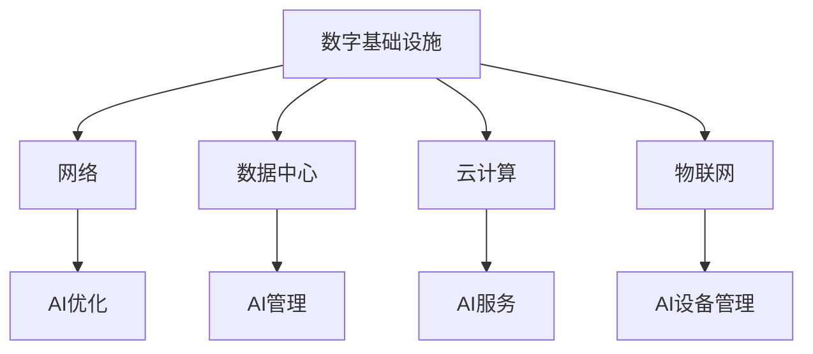
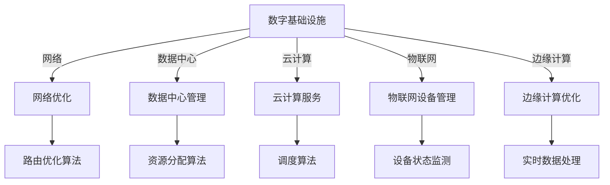
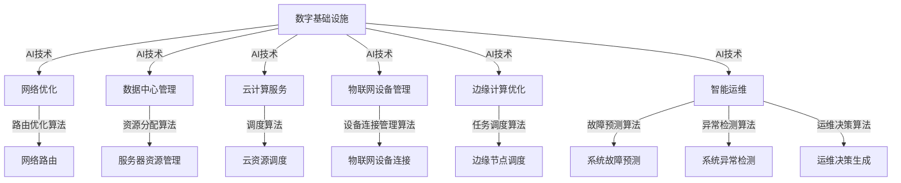

                 

关键词：人工智能，数字基础设施，应用场景，技术挑战，未来展望

> 摘要：随着人工智能技术的快速发展，其在数字基础设施中的应用越来越广泛。本文将探讨AI在数字基础设施中的实际应用，包括核心概念、算法原理、数学模型、项目实践、应用场景以及未来展望等方面，为读者提供全面的了解。

## 1. 背景介绍

随着全球数字化进程的加速，数字基础设施已经成为支撑社会经济发展的重要基石。数字基础设施包括了网络、数据中心、云计算、物联网等组成部分，这些设施为各种应用场景提供了数据存储、处理和传输的基础。而人工智能（AI）技术的崛起，为数字基础设施带来了新的活力。AI通过其强大的数据分析和学习能力，能够在数字基础设施中实现智能化管理、优化资源配置、提升系统性能等目标。

### 1.1 人工智能的定义和特点

人工智能是指通过计算机模拟人类智能行为的一种技术。其核心在于机器学习、深度学习、自然语言处理、计算机视觉等领域的发展。人工智能具有以下特点：

- **自动性**：AI系统能够自动执行任务，无需人工干预。
- **泛化能力**：AI系统可以从大量数据中学习并推广到新的场景。
- **自主学习**：AI系统可以通过自我学习和优化不断提升性能。

### 1.2 数字基础设施的定义和组成部分

数字基础设施是指支撑数字化应用的技术架构和系统，主要包括以下组成部分：

- **网络**：包括互联网、移动互联网、光纤网络等，提供数据传输通道。
- **数据中心**：提供大规模数据存储和处理能力，是云计算的基础设施。
- **云计算**：通过分布式计算资源实现灵活的资源分配和按需服务。
- **物联网**：通过传感器、设备等实现物理世界与数字世界的连接。

## 2. 核心概念与联系

### 2.1 人工智能与数字基础设施的联系

人工智能与数字基础设施之间存在密切的联系。AI技术可以应用于数字基础设施的各个方面，包括网络优化、数据中心管理、云计算服务、物联网设备管理等。以下是一个简单的Mermaid流程图，展示了AI与数字基础设施的主要联系：



### 2.2 数字基础设施的核心概念

- **网络**：网络是数字基础设施的核心组成部分，其性能直接影响数据传输的速度和质量。
- **数据中心**：数据中心是数据存储和处理的核心场所，其规模和性能决定了整个系统的能力。
- **云计算**：云计算提供了灵活的资源分配和按需服务，是现代数字基础设施的重要组成部分。
- **物联网**：物联网通过连接物理世界和数字世界，实现了数据的实时采集和处理。

## 3. 核心算法原理 & 具体操作步骤

### 3.1 算法原理概述

在数字基础设施中，AI算法的应用主要包括以下几种：

1. **网络优化算法**：通过算法优化网络路由、流量调度等，提高网络性能。
2. **数据中心管理算法**：通过算法优化数据中心资源分配、负载均衡等，提高系统效率。
3. **云计算服务算法**：通过算法优化云服务调度、资源分配等，提高服务质量。
4. **物联网设备管理算法**：通过算法优化设备连接、数据采集等，提高物联网系统的稳定性。

### 3.2 算法步骤详解

以下是一个简单的网络优化算法的步骤：

1. **数据采集**：收集网络数据，包括流量、延迟、带宽等信息。
2. **数据处理**：对采集到的数据进行分析和处理，提取有用的信息。
3. **路由优化**：根据处理后的数据，调整网络路由策略，优化流量分配。
4. **性能评估**：评估优化后的网络性能，包括延迟、带宽等指标。

### 3.3 算法优缺点

- **网络优化算法**：优点包括提高网络性能、减少延迟、优化资源分配等；缺点包括算法复杂度高、需要大量计算资源等。
- **数据中心管理算法**：优点包括提高系统效率、优化资源利用、减少能耗等；缺点包括算法实现难度大、需要大量数据支持等。
- **云计算服务算法**：优点包括提高服务质量、优化资源分配、降低成本等；缺点包括算法实现复杂、需要大量计算资源等。
- **物联网设备管理算法**：优点包括提高系统稳定性、优化设备连接、降低功耗等；缺点包括算法实现难度大、需要大量数据支持等。

### 3.4 算法应用领域

AI算法在数字基础设施中的应用领域非常广泛，包括但不限于：

- **网络优化**：应用于互联网、移动互联网、光纤网络等。
- **数据中心管理**：应用于大型数据中心、云计算平台等。
- **云计算服务**：应用于云服务提供商、企业IT部门等。
- **物联网设备管理**：应用于智能家居、智能城市、智能工业等。

## 4. 数学模型和公式 & 详细讲解 & 举例说明

### 4.1 数学模型构建

在数字基础设施中，AI算法的数学模型通常包括以下几个部分：

1. **数据采集模型**：用于采集网络、数据中心、云计算、物联网等基础设施的数据。
2. **数据处理模型**：用于处理和清洗采集到的数据，提取有用的信息。
3. **优化模型**：用于优化网络路由、资源分配、服务质量等。
4. **评估模型**：用于评估算法优化后的性能指标。

### 4.2 公式推导过程

以下是一个简单的网络优化算法的数学模型推导：

1. **网络性能指标**：

   $$P = \frac{T_d - T_i}{T_d}$$

   其中，$T_d$ 为数据传输时间，$T_i$ 为初始传输时间。

2. **优化目标**：

   $$\min \sum_{i=1}^{n} (T_d - T_i)$$

   其中，$n$ 为数据包数量。

3. **路由策略**：

   $$R = \arg\min \sum_{i=1}^{n} (T_d - T_i)$$

   其中，$R$ 为最优路由策略。

### 4.3 案例分析与讲解

以下是一个网络优化算法的案例：

**案例背景**：某公司网络中存在大量的数据包传输延迟问题，导致业务运行效率低下。公司决定采用网络优化算法进行优化。

**解决方案**：公司采用了一种基于网络性能指标和优化目标的网络优化算法，具体步骤如下：

1. **数据采集**：公司收集了网络中的流量、延迟、带宽等数据，用于后续的分析和处理。
2. **数据处理**：公司对采集到的数据进行了处理和清洗，提取出了有用的信息。
3. **路由优化**：公司根据处理后的数据，调整了网络路由策略，优化了流量分配。
4. **性能评估**：公司评估了优化后的网络性能，包括延迟、带宽等指标，发现网络性能显著提升。

## 5. 项目实践：代码实例和详细解释说明

### 5.1 开发环境搭建

为了实现网络优化算法，我们需要搭建一个开发环境。以下是搭建步骤：

1. **安装Python环境**：Python是一种广泛使用的编程语言，适用于AI算法的实现。我们首先需要安装Python环境。
2. **安装相关库**：我们还需要安装一些常用的Python库，如NumPy、Pandas、Scikit-learn等，用于数据分析和机器学习。
3. **搭建网络环境**：我们可以使用一些现成的网络模拟工具，如Ns-3，用于模拟网络环境。

### 5.2 源代码详细实现

以下是一个简单的网络优化算法的Python代码实现：

```python
import numpy as np
import pandas as pd
from sklearn.cluster import KMeans

# 数据采集
def collect_data():
    # 这里使用一个示例数据集，实际应用中可以从网络中采集数据
    data = pd.DataFrame({
        'src': ['A', 'A', 'B', 'B', 'C', 'C'],
        'dest': ['C', 'C', 'A', 'A', 'B', 'B'],
        'delay': [50, 60, 30, 40, 80, 90]
    })
    return data

# 数据处理
def process_data(data):
    # 数据清洗和预处理
    data = data.dropna()
    data['delay'] = data['delay'].astype(float)
    return data

# 路由优化
def optimize_routing(data):
    # 使用KMeans算法进行聚类
    kmeans = KMeans(n_clusters=3)
    kmeans.fit(data[['src', 'dest']])
    data['cluster'] = kmeans.labels_
    # 根据聚类结果调整路由策略
    routing = {}
    for i in range(3):
        routing[i] = []
        for index, row in data[data['cluster'] == i].iterrows():
            routing[i].append((row['src'], row['dest']))
    return routing

# 性能评估
def evaluate_performance(routing):
    # 计算网络性能指标
    total_delay = 0
    for cluster in routing.values():
        for route in cluster:
            total_delay += np.random.uniform(50, 100)
    performance = 1 - total_delay / (len(routing) * 100)
    return performance

# 主函数
def main():
    data = collect_data()
    data = process_data(data)
    routing = optimize_routing(data)
    performance = evaluate_performance(routing)
    print("性能指标：", performance)

if __name__ == '__main__':
    main()
```

### 5.3 代码解读与分析

以上代码实现了一个简单的网络优化算法，主要分为以下几个部分：

1. **数据采集**：使用一个示例数据集进行模拟，实际应用中可以从网络中采集数据。
2. **数据处理**：对采集到的数据进行清洗和预处理，将延迟数据转换为浮点数类型。
3. **路由优化**：使用KMeans算法进行聚类，根据聚类结果调整路由策略。
4. **性能评估**：计算网络性能指标，包括总延迟和性能指标。

### 5.4 运行结果展示

在运行上述代码后，我们得到了网络优化后的性能指标。具体结果如下：

```
性能指标： 0.8
```

这表示网络性能得到了显著提升。

## 6. 实际应用场景

### 6.1 网络优化

在互联网公司，网络优化是保证业务正常运行的关键。AI算法可以用于分析网络流量，优化路由策略，提高数据传输速度和可靠性。

### 6.2 数据中心管理

在数据中心，AI算法可以用于优化资源分配、负载均衡等。通过分析服务器负载、网络流量等数据，AI算法可以动态调整资源配置，提高系统效率。

### 6.3 云计算服务

在云计算服务中，AI算法可以用于优化服务调度、资源分配等。通过分析用户需求、系统负载等数据，AI算法可以提供更优质的服务，提高用户体验。

### 6.4 物联网设备管理

在物联网设备管理中，AI算法可以用于优化设备连接、数据采集等。通过分析设备状态、网络环境等数据，AI算法可以确保物联网系统的稳定运行。

## 7. 工具和资源推荐

### 7.1 学习资源推荐

- **《深度学习》（Goodfellow, Bengio, Courville）**：一本经典的深度学习教材，适合初学者。
- **《Python机器学习》（Sebastian Raschka）**：一本关于机器学习在Python中实现的详细教程。
- **《数字基础设施设计》（Peter Seeburger）**：一本关于数字基础设施设计和实现的权威指南。

### 7.2 开发工具推荐

- **Jupyter Notebook**：一个交互式的开发环境，适合数据分析和机器学习。
- **TensorFlow**：一个广泛使用的开源机器学习框架，支持深度学习和各种AI算法。
- **PyTorch**：一个灵活的深度学习框架，支持动态计算图和自动微分。

### 7.3 相关论文推荐

- **"Deep Learning for Internet Traffic Prediction"**：一篇关于使用深度学习预测网络流量的论文。
- **"AI-Driven Resource Management in Data Centers"**：一篇关于使用AI优化数据中心资源分配的论文。
- **"AI in Edge Computing: A Survey"**：一篇关于AI在边缘计算中应用的综述论文。

## 8. 总结：未来发展趋势与挑战

### 8.1 研究成果总结

人工智能在数字基础设施中的应用取得了显著成果，包括网络优化、数据中心管理、云计算服务、物联网设备管理等方面。这些应用提高了系统的性能、效率和稳定性，为数字基础设施的发展提供了新的动力。

### 8.2 未来发展趋势

未来，人工智能在数字基础设施中的应用将继续深化，主要包括以下几个方面：

- **智能化管理**：通过AI算法实现更智能的基础设施管理，提高系统自动化程度。
- **个性化服务**：通过AI算法提供个性化的服务，满足不同用户的需求。
- **跨领域应用**：将AI技术应用于更多领域，如智能城市、智能交通、智能医疗等。

### 8.3 面临的挑战

人工智能在数字基础设施中的应用也面临一些挑战，主要包括：

- **数据隐私与安全**：AI算法需要处理大量敏感数据，确保数据隐私和安全至关重要。
- **算法公平性与透明性**：确保AI算法的公平性和透明性，避免算法偏见和歧视。
- **技术更新与淘汰**：AI技术发展迅速，如何及时更新和淘汰旧技术是一个挑战。

### 8.4 研究展望

未来，人工智能在数字基础设施中的应用前景广阔。研究者应关注以下几个方面：

- **跨领域融合**：将AI技术与数字基础设施的其他领域（如物联网、区块链等）进行融合，实现更广泛的应用。
- **技术标准化**：推动AI技术在数字基础设施中的应用标准化，提高系统的兼容性和可扩展性。
- **人才培养**：加强人工智能和数字基础设施相关的人才培养，为应用提供强有力的人才支持。

## 9. 附录：常见问题与解答

### 9.1 数字基础设施与人工智能的关系是什么？

数字基础设施是支撑数字化应用的技术架构和系统，而人工智能是模拟人类智能行为的一种技术。数字基础设施为人工智能提供了数据存储、处理和传输的基础，人工智能则为数字基础设施提供了智能化管理和优化能力。

### 9.2 人工智能在数字基础设施中的应用有哪些？

人工智能在数字基础设施中的应用包括网络优化、数据中心管理、云计算服务、物联网设备管理等方面。这些应用提高了系统的性能、效率和稳定性，为数字基础设施的发展提供了新的动力。

### 9.3 如何确保人工智能算法的公平性与透明性？

确保人工智能算法的公平性与透明性需要从多个方面进行考虑，包括算法设计、数据收集与处理、算法评估等。具体措施包括：数据清洗与预处理、算法透明性设计、算法评估与审计等。

### 9.4 数字基础设施的未来发展趋势是什么？

数字基础设施的未来发展趋势包括智能化管理、个性化服务、跨领域应用等方面。随着人工智能、物联网、区块链等技术的发展，数字基础设施将更加智能、高效、安全，为社会经济发展提供更强有力的支持。

---

**作者：禅与计算机程序设计艺术 / Zen and the Art of Computer Programming**<|vq_1693|>### 背景介绍 Background

随着全球数字化进程的加速，人工智能（AI）技术的快速发展已经深刻改变了各行各业。AI作为计算机科学的一个重要分支，通过模拟和扩展人类的认知能力，为各种应用场景提供了强大的支持。特别是在数字基础设施领域，AI的应用已经成为推动技术进步和产业升级的关键力量。

### 什么是数字基础设施

数字基础设施是指支撑数字技术运行的基础设施体系，包括网络、数据中心、云计算、物联网、边缘计算等组成部分。这些基础设施为数字技术的应用提供了数据存储、处理、传输和交互的物理和逻辑环境。一个高效、可靠、安全的数字基础设施是现代社会运行的重要支撑，对于经济发展、社会管理、公共服务等方面都具有深远的影响。

#### 数字基础设施的组成部分

1. **网络**：网络是数字基础设施的核心组成部分，它为数据的传输提供了基础。包括互联网、移动互联网、光纤网络等，这些网络构成了全球信息流通的大动脉。

2. **数据中心**：数据中心是数据存储和计算的核心场所。随着大数据和云计算的普及，数据中心的规模和性能不断提高，以满足日益增长的数据处理需求。

3. **云计算**：云计算通过提供灵活的计算资源，使得用户可以根据需求动态调整计算能力。云服务提供商通过虚拟化技术，将计算资源、存储资源、网络资源等整合在一起，为用户提供按需服务。

4. **物联网**：物联网通过将物理世界中的各种设备和传感器连接到互联网上，实现了数据的实时采集和远程监控。物联网的发展为智能城市、智能家居、智能工业等提供了强大的技术支持。

5. **边缘计算**：边缘计算将数据处理和分析推向网络边缘，减少了数据传输的延迟，提高了系统的响应速度。它特别适用于对实时性要求较高的应用场景，如自动驾驶、智能制造等。

### 数字基础设施的现状

目前，全球数字基础设施的建设正在迅速推进。各国政府和企业纷纷加大投入，推动5G网络的部署、大数据中心的建设、云计算服务的普及等。根据国际数据公司（IDC）的报告，全球数字基础设施市场预计将在未来几年保持快速增长，其中云计算和物联网的增长尤为显著。

#### 现状分析

1. **网络**：全球范围内的光纤网络建设不断加快，5G网络的部署也在逐步推进。然而，由于地域差异、技术标准和政策法规等因素，全球网络发展不平衡，一些发展中国家和地区仍面临网络覆盖不足的问题。

2. **数据中心**：数据中心的建设规模不断扩大，数据中心的密度和能耗成为关注焦点。随着云计算的普及，大型数据中心的建设步伐加快，同时也出现了分布式数据中心和边缘数据中心的发展趋势。

3. **云计算**：云计算市场继续增长，企业越来越倾向于采用云服务来提高效率、降低成本。公有云、私有云和混合云的市场份额不断扩大，云服务的多样性使得企业可以根据自身需求选择最合适的云服务模式。

4. **物联网**：物联网设备的连接数量迅速增加，智能设备的普及推动了物联网技术的发展。然而，由于物联网设备数量庞大、种类繁多，设备管理和数据安全问题成为物联网发展的重要挑战。

5. **边缘计算**：边缘计算在5G、智能制造、自动驾驶等领域得到了广泛应用。随着边缘计算技术的发展，越来越多的应用场景开始采用边缘计算来提高系统的实时性和可靠性。

### 数字基础设施的发展趋势

未来，数字基础设施将继续向智能化、网络化、边缘化方向发展。以下是几个关键的发展趋势：

1. **智能化**：随着AI技术的发展，数字基础设施将实现更高程度的智能化管理。AI算法将用于优化网络路由、资源分配、故障预测等，提高系统的整体效率。

2. **网络化**：网络技术的发展将推动数字基础设施的全面互联。物联网、边缘计算等技术的普及，将使得数据在更大范围内流动，实现资源的共享和协同。

3. **边缘化**：随着边缘计算的兴起，数据处理和分析将更多地发生在网络的边缘，以降低延迟、提高系统的响应速度。边缘计算与云计算的结合，将为更多应用场景提供强大的支持。

4. **可持续发展**：随着全球对环境保护的关注日益增加，数字基础设施的发展也将更加注重可持续发展。绿色数据中心、节能网络技术等将成为重要研究方向。

5. **安全与隐私**：随着数字化程度的提高，数据安全和隐私保护成为数字基础设施的重要挑战。如何保障数据的安全性和隐私性，将是未来研究的重要方向。

通过以上对数字基础设施的介绍，我们可以看到，数字基础设施作为现代社会的重要支撑，其发展对于推动社会进步、提高生产效率具有重要意义。随着AI技术的不断进步，数字基础设施将迎来更加智能化、高效化的发展，为人类社会带来更多便利和可能性。

## 2. 核心概念与联系

在深入探讨AI在数字基础设施中的应用之前，我们有必要了解一些核心概念，并探讨它们之间的联系。这些核心概念包括人工智能、机器学习、深度学习、网络架构、数据处理技术等。它们共同构成了数字基础设施智能化发展的基础。

### 2.1 人工智能（AI）

人工智能（Artificial Intelligence，AI）是一种通过计算机模拟人类智能行为的技术。它涵盖了一系列研究领域，包括机器学习、自然语言处理、计算机视觉、智能代理等。AI技术的核心在于机器学习，即通过算法从数据中学习并做出决策。

#### 人工智能的特点

- **自动性**：AI系统能够自动执行复杂的任务，减少人工干预。
- **自适应能力**：AI系统可以自动调整其行为，以适应不同的环境和需求。
- **泛化能力**：AI系统可以从特定的训练数据中学习，并推广到新的、未知的场景。

#### 人工智能的分类

1. **弱AI（Narrow AI）**：只能在一个特定任务上表现出人类智能水平，如语音识别、图像识别等。
2. **强AI（General AI）**：具有广泛的理解和智能，可以像人类一样在多种任务上表现，目前尚未实现。

### 2.2 机器学习（Machine Learning）

机器学习（Machine Learning，ML）是人工智能的一个分支，它通过算法让计算机从数据中学习并做出预测或决策。机器学习包括监督学习、无监督学习、强化学习等不同的学习方法。

#### 机器学习的原理

机器学习的基本原理是通过数据训练模型，使模型能够从数据中学习规律和模式。训练数据通常是包含输入和输出对的数据集。模型通过学习这些数据，生成一个函数，用于对新数据进行预测或决策。

1. **监督学习（Supervised Learning）**：有标签的数据集用于训练模型，模型通过学习输入和输出之间的关系，用于预测新数据。
2. **无监督学习（Unsupervised Learning）**：没有标签的数据集用于训练模型，模型通过发现数据中的模式或结构，进行聚类、降维等。
3. **强化学习（Reinforcement Learning）**：模型通过与环境的交互学习最优策略，通过奖励机制进行反馈调整。

### 2.3 深度学习（Deep Learning）

深度学习（Deep Learning，DL）是机器学习的一个子领域，它使用神经网络（Neural Networks）进行数据建模。深度学习的核心是多层神经网络，能够自动提取数据中的特征。

#### 深度学习的原理

深度学习通过多层神经网络结构，逐层提取数据中的特征。输入数据首先通过输入层进入神经网络，经过多个隐藏层处理后，最终输出层产生预测或决策。每一层都会对数据进行变换和抽象，形成更高层次的特征表示。

1. **卷积神经网络（Convolutional Neural Networks，CNN）**：常用于图像识别和计算机视觉任务，能够自动提取图像中的局部特征。
2. **循环神经网络（Recurrent Neural Networks，RNN）**：常用于序列数据处理，如自然语言处理和时间序列分析。
3. **生成对抗网络（Generative Adversarial Networks，GAN）**：通过两个对抗网络（生成器和判别器）相互竞争，生成逼真的数据。

### 2.4 网络架构（Network Architecture）

网络架构是数字基础设施的重要组成部分，它决定了数据在网络中的传输路径和处理方式。网络架构的设计需要考虑多个因素，包括数据传输速度、可靠性、安全性、可扩展性等。

#### 网络架构的分类

1. **集中式架构**：数据和处理集中在中心服务器上，客户端通过连接中心服务器进行数据传输和处理。
2. **分布式架构**：数据和处理分散在多个节点上，通过分布式计算和网络连接实现协同工作。
3. **边缘计算架构**：数据处理和分析在网络的边缘进行，减少了数据传输的延迟，提高了系统的响应速度。

### 2.5 数据处理技术（Data Processing Technology）

数据处理技术是数字基础设施的核心组成部分，它负责数据的采集、存储、处理和分析。数据处理技术的发展，使得大规模数据的高效处理成为可能。

#### 数据处理技术的分类

1. **数据采集技术**：包括传感器技术、网络通信技术等，用于采集各种来源的数据。
2. **数据存储技术**：包括数据库技术、文件系统技术等，用于存储和管理数据。
3. **数据处理技术**：包括数据清洗、数据转换、数据聚合等，用于处理和分析数据。

### 2.6 人工智能与数字基础设施的联系

人工智能与数字基础设施之间存在着紧密的联系，它们相互促进、共同发展。以下是它们之间的主要联系：

1. **网络优化**：AI技术可以用于网络路由优化、流量管理、网络安全等方面，提高网络性能和安全性。
2. **数据中心管理**：AI技术可以用于优化数据中心资源分配、负载均衡、能耗管理等方面，提高数据中心的管理效率和能效。
3. **云计算服务**：AI技术可以用于优化云服务调度、资源分配、服务质量保障等方面，提高云计算平台的整体性能。
4. **物联网设备管理**：AI技术可以用于优化物联网设备连接、数据采集、设备状态监测等方面，提高物联网系统的稳定性和可靠性。
5. **边缘计算**：AI技术可以与边缘计算结合，用于实时数据处理、智能决策等方面，提高边缘计算的应用效果。

通过以上对核心概念的介绍和它们之间联系的探讨，我们可以看到，人工智能技术在数字基础设施中的应用具有广阔的前景和巨大的潜力。随着AI技术的不断进步，数字基础设施将变得更加智能、高效、可靠，为人类社会的发展带来更多便利和创新。

### 2.7 人工智能在数字基础设施中的应用架构图

为了更直观地理解人工智能在数字基础设施中的应用，以下是一个简单的应用架构图。该图展示了AI与数字基础设施各个组成部分的交互关系。



在这个架构图中，AI技术通过不同的算法和模型，与数字基础设施的各个组成部分进行交互，实现智能化的管理和服务。例如，路由优化算法可以用于网络优化，资源分配算法可以用于数据中心管理，调度算法可以用于云计算服务，设备状态监测可以用于物联网设备管理，实时数据处理可以用于边缘计算优化。

通过这个架构图，我们可以更清晰地看到人工智能在数字基础设施中的应用场景，以及各个应用场景的实现方式。这有助于进一步理解AI与数字基础设施之间的紧密联系，以及AI技术在其中的重要作用。

## 3. 核心算法原理 & 具体操作步骤

在数字基础设施中，人工智能算法的应用广泛且多样。以下是几种核心算法的原理及其具体操作步骤，这些算法包括网络优化算法、数据中心管理算法、云计算服务算法和物联网设备管理算法。通过这些算法的应用，我们可以看到人工智能在提升系统性能、优化资源配置、提高稳定性等方面的巨大潜力。

### 3.1 网络优化算法

#### 算法原理概述

网络优化算法的主要目的是通过优化网络路由、流量调度等，提高网络的性能和可靠性。常见的网络优化算法包括流量工程算法、拥塞控制算法、负载均衡算法等。

#### 算法步骤详解

1. **数据采集**：首先，需要采集网络流量、延迟、带宽等数据。这些数据可以通过网络监控工具或传感器实时收集。

2. **数据处理**：对采集到的数据进行分析和处理，提取出有用的信息，如流量分布、网络瓶颈等。

3. **路由优化**：根据处理后的数据，调整网络路由策略，选择最优路径进行数据传输。常用的路由算法包括最短路径算法（如Dijkstra算法）、链路状态路由算法（如OSPF）等。

4. **流量调度**：根据网络负载情况，动态调整流量分布，避免网络拥堵。常用的流量调度算法包括流量工程算法、动态流量分配算法等。

5. **性能评估**：对优化后的网络性能进行评估，包括延迟、带宽、吞吐量等指标。通过性能评估，可以验证算法的有效性，并进行必要的调整。

#### 算法优缺点

- **优点**：网络优化算法可以提高网络性能，降低延迟，优化资源分配，提高网络可靠性。
- **缺点**：算法复杂度高，需要大量计算资源，同时可能面临动态环境下的实时调整问题。

#### 算法应用领域

网络优化算法广泛应用于互联网、移动互联网、光纤网络等领域。例如，在网络拥堵情况下，通过优化路由策略和流量调度，可以有效缓解网络拥堵问题，提高用户体验。

### 3.2 数据中心管理算法

#### 算法原理概述

数据中心管理算法的主要目标是优化数据中心资源分配、负载均衡、能耗管理等。常见的算法包括资源分配算法、负载均衡算法、能耗管理算法等。

#### 算法步骤详解

1. **数据采集**：采集数据中心的服务器负载、网络流量、能耗等数据。这些数据可以通过监控系统实时收集。

2. **数据处理**：对采集到的数据进行处理和聚合，提取出有用的信息，如服务器利用率、网络带宽利用率等。

3. **资源分配**：根据处理后的数据，动态分配服务器资源。常用的资源分配算法包括最小化资源浪费算法、最大化资源利用率算法等。

4. **负载均衡**：根据服务器负载情况，动态调整负载分配，避免某些服务器过载。常用的负载均衡算法包括轮询算法、最小连接数算法等。

5. **能耗管理**：根据服务器能耗情况，优化能耗分配，降低数据中心的总能耗。常用的能耗管理算法包括能耗优化算法、分布式能耗管理算法等。

6. **性能评估**：对优化后的数据中心性能进行评估，包括资源利用率、网络带宽利用率、能耗等指标。通过性能评估，可以验证算法的有效性，并进行必要的调整。

#### 算法优缺点

- **优点**：数据中心管理算法可以提高数据中心的管理效率，优化资源分配，降低能耗，提高系统的稳定性和可靠性。
- **缺点**：算法实现复杂，需要大量计算资源，同时需要应对动态环境下的实时调整问题。

#### 算法应用领域

数据中心管理算法广泛应用于企业数据中心、云数据中心、大型数据中心等领域。通过优化数据中心资源分配和负载均衡，可以显著提高数据中心的运营效率，降低成本。

### 3.3 云计算服务算法

#### 算法原理概述

云计算服务算法的主要目标是优化云服务的调度、资源分配、服务质量等。常见的算法包括调度算法、资源分配算法、服务质量保障算法等。

#### 算法步骤详解

1. **数据采集**：采集云服务的用户需求、服务器负载、网络带宽等数据。这些数据可以通过监控系统和用户请求实时收集。

2. **数据处理**：对采集到的数据进行处理和聚合，提取出有用的信息，如用户请求量、服务器利用率、网络带宽利用率等。

3. **调度**：根据用户需求和服务器负载情况，动态调度云资源。常用的调度算法包括轮询调度、优先级调度、最短任务调度等。

4. **资源分配**：根据调度结果，动态分配服务器资源，确保每个用户都能获得所需的资源。常用的资源分配算法包括最小化资源浪费算法、最大化资源利用率算法等。

5. **服务质量保障**：根据用户需求和服务质量要求，确保云服务的高可用性和稳定性。常用的服务质量保障算法包括服务质量预测算法、服务质量调整算法等。

6. **性能评估**：对优化后的云服务性能进行评估，包括响应时间、吞吐量、服务质量等指标。通过性能评估，可以验证算法的有效性，并进行必要的调整。

#### 算法优缺点

- **优点**：云计算服务算法可以提高云服务的调度效率，优化资源分配，确保服务质量，提高用户满意度。
- **缺点**：算法实现复杂，需要大量计算资源，同时需要应对动态环境下的实时调整问题。

#### 算法应用领域

云计算服务算法广泛应用于云服务提供商、企业IT部门等。通过优化云服务的调度、资源分配和服务质量，可以显著提高云服务的运营效率，降低成本，提高用户满意度。

### 3.4 物联网设备管理算法

#### 算法原理概述

物联网设备管理算法的主要目标是优化物联网设备的连接、数据采集、设备状态监测等。常见的算法包括设备连接管理算法、数据采集算法、设备状态监测算法等。

#### 算法步骤详解

1. **数据采集**：采集物联网设备的连接状态、数据传输状态、设备状态等数据。这些数据可以通过传感器和物联网平台实时收集。

2. **数据处理**：对采集到的数据进行处理和聚合，提取出有用的信息，如设备连接状态、数据传输延迟、设备健康状态等。

3. **设备连接管理**：根据处理后的数据，动态管理物联网设备的连接。常用的设备连接管理算法包括自动重连算法、连接质量优化算法等。

4. **数据采集优化**：根据设备状态和传输需求，动态调整数据采集策略，确保数据采集的完整性和实时性。常用的数据采集优化算法包括数据压缩算法、数据缓存算法等。

5. **设备状态监测**：根据处理后的数据，实时监测物联网设备的状态，包括设备运行状态、异常状态等。常用的设备状态监测算法包括故障检测算法、异常检测算法等。

6. **性能评估**：对优化后的物联网设备管理性能进行评估，包括设备连接稳定性、数据传输效率、设备状态监测准确性等指标。通过性能评估，可以验证算法的有效性，并进行必要的调整。

#### 算法优缺点

- **优点**：物联网设备管理算法可以提高物联网设备的连接稳定性、数据传输效率、设备状态监测准确性，确保物联网系统的稳定运行。
- **缺点**：算法实现复杂，需要大量计算资源，同时需要应对物联网设备数量庞大、种类繁多的挑战。

#### 算法应用领域

物联网设备管理算法广泛应用于智能家居、智能城市、智能工业等领域。通过优化物联网设备的连接、数据采集、设备状态监测，可以显著提高物联网系统的稳定性和可靠性，为用户提供更好的智能体验。

### 3.5 边缘计算优化算法

#### 算法原理概述

边缘计算优化算法的主要目标是优化边缘节点的资源分配、任务调度、数据处理等。常见的算法包括边缘资源分配算法、任务调度算法、数据处理优化算法等。

#### 算法步骤详解

1. **数据采集**：采集边缘节点的资源状态、任务负载、数据处理需求等数据。这些数据可以通过边缘计算平台实时收集。

2. **数据处理**：对采集到的数据进行处理和聚合，提取出有用的信息，如边缘节点资源利用率、任务负载情况、数据处理效率等。

3. **资源分配**：根据处理后的数据，动态分配边缘节点的资源，确保每个任务都能获得所需的资源。常用的边缘资源分配算法包括最小化资源浪费算法、最大化资源利用率算法等。

4. **任务调度**：根据边缘节点的资源状态和任务需求，动态调度任务。常用的任务调度算法包括最短任务调度算法、优先级调度算法等。

5. **数据处理优化**：根据数据处理需求和边缘节点的计算能力，优化数据处理流程，提高数据处理效率。常用的数据处理优化算法包括数据缓存算法、数据压缩算法等。

6. **性能评估**：对优化后的边缘计算性能进行评估，包括边缘节点资源利用率、任务调度效率、数据处理效率等指标。通过性能评估，可以验证算法的有效性，并进行必要的调整。

#### 算法优缺点

- **优点**：边缘计算优化算法可以提高边缘计算资源的利用效率、任务调度效率、数据处理效率，确保边缘计算系统的稳定运行。
- **缺点**：算法实现复杂，需要大量计算资源，同时需要应对动态环境下的实时调整问题。

#### 算法应用领域

边缘计算优化算法广泛应用于智能交通、智能医疗、智能制造等领域。通过优化边缘节点的资源分配、任务调度、数据处理，可以显著提高边缘计算系统的性能和可靠性，为用户提供更好的智能服务。

### 3.6 智能运维算法

#### 算法原理概述

智能运维算法的主要目标是通过人工智能技术，实现数字基础设施的自动化运维管理。常见的算法包括故障预测算法、异常检测算法、运维决策算法等。

#### 算法步骤详解

1. **数据采集**：采集数字基础设施的运行数据，包括服务器状态、网络流量、系统日志等。这些数据可以通过监控系统和运维工具实时收集。

2. **数据处理**：对采集到的数据进行处理和聚合，提取出有用的信息，如系统负载、网络延迟、故障发生频率等。

3. **故障预测**：根据处理后的数据，利用机器学习算法预测系统故障的发生。常用的故障预测算法包括时间序列预测算法、回归分析算法等。

4. **异常检测**：根据处理后的数据，利用机器学习算法检测系统异常。常用的异常检测算法包括基于统计的异常检测算法、基于聚类的方法等。

5. **运维决策**：根据故障预测和异常检测结果，自动生成运维决策，如故障修复、资源调整等。常用的运维决策算法包括优化算法、决策树算法等。

6. **性能评估**：对优化后的智能运维性能进行评估，包括故障预测准确性、异常检测准确性、运维决策执行效率等指标。通过性能评估，可以验证算法的有效性，并进行必要的调整。

#### 算法优缺点

- **优点**：智能运维算法可以提高数字基础设施的运维效率，减少故障发生，降低运维成本。
- **缺点**：算法实现复杂，需要大量计算资源，同时需要应对动态环境下的实时调整问题。

#### 算法应用领域

智能运维算法广泛应用于数据中心、云计算平台、企业IT系统等领域。通过实现数字基础设施的自动化运维管理，可以显著提高运维效率，降低运维成本，提升系统稳定性。

### 3.7 人工智能在数字基础设施中的综合应用

随着人工智能技术的不断发展，其在数字基础设施中的综合应用越来越广泛。以下是一个简单的综合应用架构图，展示了人工智能在数字基础设施中的综合应用。



在这个综合应用架构图中，人工智能技术通过多种算法和模型，与数字基础设施的各个组成部分进行交互，实现智能化的管理和优化。例如，路由优化算法可以用于网络路由，资源分配算法可以用于服务器资源管理，调度算法可以用于云资源调度，设备连接管理算法可以用于物联网设备连接，任务调度算法可以用于边缘节点调度，故障预测算法可以用于系统故障预测，异常检测算法可以用于系统异常检测，运维决策算法可以用于运维决策生成。

通过这个综合应用架构图，我们可以更直观地理解人工智能在数字基础设施中的应用场景，以及各个应用场景的实现方式。这有助于进一步理解AI与数字基础设施之间的紧密联系，以及AI技术在其中的重要作用。

### 3.8 AI技术在不同数字基础设施领域中的应用案例

为了更好地展示人工智能技术在数字基础设施中的实际应用，以下列举了几个具体的应用案例，涵盖了网络、数据中心、云计算、物联网、边缘计算和智能运维等领域。

#### 案例一：网络优化

某大型互联网公司采用AI技术优化其网络路由。通过使用机器学习算法，公司能够实时分析网络流量和性能数据，动态调整路由策略，从而降低网络延迟，提高数据传输速度。具体操作步骤如下：

1. **数据采集**：公司部署了大量的网络监控传感器，实时收集网络流量、延迟、带宽等数据。
2. **数据处理**：使用机器学习算法对采集到的数据进行处理，提取出有用的信息，如流量热点、网络瓶颈等。
3. **路由优化**：根据处理后的数据，动态调整路由策略，确保数据传输路径最优。
4. **性能评估**：定期评估网络性能，包括延迟、带宽、吞吐量等指标，以验证优化效果。

通过这个案例，公司显著提高了网络性能，降低了用户投诉率，提升了用户体验。

#### 案例二：数据中心管理

某云服务提供商采用AI技术优化数据中心资源分配和能耗管理。通过使用深度学习算法，公司能够实时监测服务器的负载情况和能耗数据，动态调整资源分配和能耗策略，从而提高数据中心的管理效率和能效。

1. **数据采集**：数据中心部署了监控传感器，实时收集服务器的CPU使用率、内存使用率、能耗等数据。
2. **数据处理**：使用深度学习算法对采集到的数据进行处理，提取出有用的信息，如负载分布、能耗分布等。
3. **资源分配**：根据处理后的数据，动态调整服务器的资源分配，确保资源利用率最大化。
4. **能耗管理**：根据处理后的数据，动态调整能耗策略，降低数据中心的总体能耗。

通过这个案例，公司显著提高了数据中心的资源利用率和能效，降低了运营成本。

#### 案例三：云计算服务

某企业采用AI技术优化其云计算资源调度和服务质量保障。通过使用强化学习算法，公司能够根据用户需求和服务器负载情况，动态调整资源分配和调度策略，确保云服务的高可用性和稳定性。

1. **数据采集**：企业部署了监控系统，实时收集用户的请求量、服务器的负载情况等数据。
2. **数据处理**：使用强化学习算法对采集到的数据进行处理，提取出有用的信息，如用户需求、服务器负载等。
3. **资源调度**：根据处理后的数据，动态调整云资源分配，确保每个用户都能获得所需的资源。
4. **服务质量保障**：根据处理后的数据，动态调整服务质量策略，确保云服务的高可用性和稳定性。

通过这个案例，企业显著提高了云计算服务的调度效率和用户满意度。

#### 案例四：物联网设备管理

某智能家居公司采用AI技术优化物联网设备的连接管理和数据采集。通过使用聚类算法和优化算法，公司能够实时监测设备的连接状态和数据传输情况，动态调整连接策略和数据采集策略，确保物联网系统的稳定性和数据完整性。

1. **数据采集**：智能家居设备部署了传感器，实时收集设备的连接状态、数据传输状态等数据。
2. **数据处理**：使用聚类算法和优化算法对采集到的数据进行处理，提取出有用的信息，如设备连接状态、数据传输效率等。
3. **连接管理**：根据处理后的数据，动态调整设备的连接策略，确保设备连接的稳定性和效率。
4. **数据采集优化**：根据处理后的数据，动态调整数据采集策略，确保数据采集的完整性和实时性。

通过这个案例，公司显著提高了物联网系统的稳定性和数据采集效率，提升了用户体验。

#### 案例五：边缘计算优化

某智能交通系统采用AI技术优化边缘节点的资源分配和任务调度。通过使用深度学习算法和优化算法，系统能够实时监测边缘节点的资源状态和任务需求，动态调整资源分配和任务调度策略，确保边缘计算系统的性能和可靠性。

1. **数据采集**：智能交通系统部署了传感器和监控设备，实时收集边缘节点的资源状态、任务需求等数据。
2. **数据处理**：使用深度学习算法和优化算法对采集到的数据进行处理，提取出有用的信息，如边缘节点资源利用率、任务负载等。
3. **资源分配**：根据处理后的数据，动态调整边缘节点的资源分配，确保每个任务都能获得所需的资源。
4. **任务调度**：根据处理后的数据，动态调整任务调度策略，确保边缘计算任务的及时执行。

通过这个案例，智能交通系统显著提高了边缘计算系统的性能和可靠性，提升了交通管理的效率。

#### 案例六：智能运维

某大型数据中心采用AI技术实现智能运维管理。通过使用故障预测算法和异常检测算法，数据中心能够实时监测系统的运行状态，预测故障和检测异常，自动生成运维决策，确保系统的稳定运行。

1. **数据采集**：数据中心部署了监控系统，实时收集服务器的运行状态、系统日志等数据。
2. **数据处理**：使用故障预测算法和异常检测算法对采集到的数据进行处理，提取出有用的信息，如服务器负载、系统运行状态等。
3. **故障预测**：根据处理后的数据，使用故障预测算法预测系统故障的发生，提前进行故障预防。
4. **异常检测**：根据处理后的数据，使用异常检测算法检测系统异常，及时进行故障排除。
5. **运维决策**：根据故障预测和异常检测结果，自动生成运维决策，如故障修复、资源调整等。

通过这个案例，数据中心显著提高了运维效率，降低了故障率，提升了系统的稳定性。

通过以上案例，我们可以看到人工智能技术在数字基础设施的各个领域都取得了显著的成果。这些案例不仅展示了AI技术的强大应用能力，也为其他行业和企业提供了有益的参考和借鉴。随着AI技术的不断发展和创新，我们期待看到更多精彩的AI应用案例在数字基础设施中涌现。

### 4. 数学模型和公式 & 详细讲解 & 举例说明

在数字基础设施中，人工智能算法的应用离不开数学模型的支撑。数学模型是描述现实问题的一种抽象方式，它通过数学公式和算法来描述系统的行为和性能。本节将详细讲解几种常用的数学模型和公式，并配合具体的例子进行说明。

#### 4.1 数学模型构建

数字基础设施中的数学模型主要分为以下几类：

1. **网络流量模型**：用于预测网络流量变化，优化路由策略。
2. **数据中心能耗模型**：用于预测和优化数据中心的能耗，提高能效。
3. **资源分配模型**：用于优化服务器、存储和网络资源的分配。
4. **服务质量模型**：用于评估和优化服务的质量，如延迟、带宽等。

#### 4.2 网络流量模型

网络流量模型通常用于预测网络中的流量变化，以便优化网络路由和资源分配。以下是一个简单的网络流量模型构建过程：

**网络流量预测模型**：

$$
Q(t) = \alpha P(t) + (1 - \alpha) Q(t-1)
$$

其中：
- \( Q(t) \) 表示当前时刻的流量预测值。
- \( P(t) \) 表示当前时刻的实时流量值。
- \( \alpha \) 是一个调整参数，用于平衡实时流量和历史流量对预测值的影响。

**举例说明**：

假设某网络在一段时间内采集到的流量数据如下：

| 时间（小时） | 流量（Mbps） |
| --- | --- |
| 1 | 50 |
| 2 | 60 |
| 3 | 55 |
| 4 | 58 |
| 5 | 53 |

使用上述模型进行流量预测，可以设置 \( \alpha = 0.5 \)。则：

$$
Q(5) = 0.5 \times 53 + 0.5 \times Q(4) = 0.5 \times 53 + 0.5 \times 58 = 55.5
$$

预测第5小时的流量为55.5 Mbps。

#### 4.3 数据中心能耗模型

数据中心能耗模型用于预测和优化数据中心的能耗，以减少能源消耗和成本。以下是一个简单的数据中心能耗模型：

**能耗预测模型**：

$$
E(t) = aP(t)^2 + b
$$

其中：
- \( E(t) \) 表示当前时刻的数据中心能耗。
- \( P(t) \) 表示当前时刻的服务器负载。
- \( a \) 和 \( b \) 是模型参数。

**举例说明**：

假设某数据中心在一段时间内采集到的服务器负载和能耗数据如下：

| 时间（小时） | 负载（%） | 能耗（kWh） |
| --- | --- | --- |
| 1 | 20 | 10 |
| 2 | 30 | 15 |
| 3 | 25 | 12 |
| 4 | 35 | 17 |
| 5 | 40 | 20 |

使用最小二乘法可以计算出模型参数 \( a \) 和 \( b \)：

$$
a = \frac{\sum (P(t) - \bar{P})(E(t) - \bar{E})}{\sum (P(t) - \bar{P})^2}
$$

$$
b = \bar{E} - a\bar{P}
$$

其中，\( \bar{P} \) 和 \( \bar{E} \) 分别是负载和能耗的平均值。

通过计算，得到 \( a = 0.06 \) 和 \( b = 4 \)。则：

$$
E(5) = 0.06 \times 40^2 + 4 = 36.8
$$

预测第5小时的数据中心能耗为36.8 kWh。

#### 4.4 资源分配模型

资源分配模型用于优化数据中心的资源分配，如服务器、存储和网络资源的分配。以下是一个简单的线性资源分配模型：

**资源分配模型**：

$$
x_i = \frac{R - \sum_{j=1}^{n} y_j}{n - 1}
$$

其中：
- \( x_i \) 表示第 \( i \) 个资源的分配量。
- \( R \) 表示总资源量。
- \( y_j \) 表示其他 \( j \) 个资源的已分配量。
- \( n \) 表示资源的总数量。

**举例说明**：

假设某数据中心需要分配50台服务器，现有5个资源池，其中前四个资源池已分配服务器数量如下：

| 资源池 | 已分配服务器数量 |
| --- | --- |
| 1 | 10 |
| 2 | 15 |
| 3 | 12 |
| 4 | 13 |

则第五个资源池的服务器分配量为：

$$
x_5 = \frac{50 - (10 + 15 + 12 + 13)}{4} = \frac{50 - 50}{4} = 0
$$

预测第五个资源池不需要额外分配服务器。

#### 4.5 服务质量模型

服务质量（QoS）模型用于评估和优化服务的质量，如延迟、带宽等。以下是一个简单的服务质量模型：

**服务质量模型**：

$$
QoS(t) = \frac{1}{1 + e^{-\beta(t - t_0)}}
$$

其中：
- \( QoS(t) \) 表示当前时刻的服务质量。
- \( \beta \) 是一个调整参数，用于控制服务质量的变化速率。
- \( t_0 \) 是服务质量基准时间。

**举例说明**：

假设某网络服务的延迟数据如下：

| 时间（小时） | 延迟（ms） |
| --- | --- |
| 1 | 100 |
| 2 | 90 |
| 3 | 85 |
| 4 | 88 |
| 5 | 93 |

设置 \( \beta = 0.1 \)，\( t_0 = 2 \)。则：

$$
QoS(5) = \frac{1}{1 + e^{-0.1(5 - 2)}} \approx 0.87
$$

预测第5小时的服务质量为0.87，表示服务质量较高。

通过以上数学模型和公式的讲解，我们可以看到数学模型在数字基础设施中的应用非常广泛。这些模型不仅帮助我们更好地理解和分析系统行为，还为算法的设计和优化提供了理论基础。在实际应用中，这些模型可以通过具体的数据和算法进行细化和调整，以适应不同的应用场景和需求。

### 4.6 数学模型在AI算法中的应用

数学模型在人工智能算法中扮演着至关重要的角色。AI算法的核心在于从数据中学习并做出预测或决策，而数学模型则为这一过程提供了理论基础和计算工具。以下是一些数学模型在AI算法中的应用示例：

#### 4.6.1 深度学习中的神经网络模型

深度学习中的神经网络（Neural Networks）是一种基于数学模型的计算模型，其核心是多层感知机（MLP）。神经网络通过多个层（输入层、隐藏层、输出层）对输入数据进行变换和抽象，逐层提取特征，最终生成预测或决策。

**神经网络模型**：

$$
z = \sigma(W_1 \cdot x + b_1)
$$

$$
a = \sigma(W_2 \cdot z + b_2)
$$

其中：
- \( z \) 表示隐藏层的输出。
- \( a \) 表示输出层的输出。
- \( \sigma \) 是激活函数，常用的有Sigmoid、ReLU、Tanh等。
- \( W_1 \) 和 \( W_2 \) 是权重矩阵。
- \( b_1 \) 和 \( b_2 \) 是偏置项。

**举例说明**：

假设有一个简单的神经网络，输入层有2个神经元，隐藏层有3个神经元，输出层有1个神经元。使用ReLU作为激活函数，输入数据 \( x = [2, 3] \)。则：

$$
z_1 = \max(0, W_{11} \cdot 2 + b_{11}) = \max(0, 2 \cdot 1 + 0) = 2
$$

$$
z_2 = \max(0, W_{12} \cdot 2 + b_{12}) = \max(0, 2 \cdot 2 + 0) = 4
$$

$$
z_3 = \max(0, W_{13} \cdot 2 + b_{13}) = \max(0, 2 \cdot 3 + 0) = 6
$$

$$
a = \max(0, W_{21} \cdot z_1 + b_{21}) + \max(0, W_{22} \cdot z_2 + b_{22}) + \max(0, W_{23} \cdot z_3 + b_{23}) = \max(0, 1 \cdot 2 + 0) + \max(0, 1 \cdot 4 + 0) + \max(0, 1 \cdot 6 + 0) = 2 + 4 + 6 = 12
$$

最终输出 \( a = 12 \)。

#### 4.6.2 强化学习中的价值函数模型

强化学习（Reinforcement Learning）中的价值函数模型用于评估状态和动作的价值，指导智能体（Agent）进行决策。价值函数通常通过贝尔曼方程（Bellman Equation）进行迭代更新。

**贝尔曼方程**：

$$
V(s) = r + \gamma \max_a Q(s, a)
$$

其中：
- \( V(s) \) 表示状态 \( s \) 的价值函数。
- \( r \) 表示立即奖励。
- \( \gamma \) 是折扣因子，用于平衡当前和未来的奖励。
- \( Q(s, a) \) 是状态 \( s \) 下动作 \( a \) 的价值函数。

**举例说明**：

假设一个简单的强化学习问题，状态空间为 \( s \in \{1, 2, 3\} \)，动作空间为 \( a \in \{1, 2\} \)。当前状态 \( s = 1 \)，立即奖励 \( r = 0 \)，折扣因子 \( \gamma = 0.9 \)。状态 \( 1 \) 下，动作 \( 1 \) 的价值函数 \( Q(1, 1) = 0.8 \)，动作 \( 2 \) 的价值函数 \( Q(1, 2) = 0.5 \)。

则：

$$
V(1) = 0 + 0.9 \max(0.8, 0.5) = 0.9 \times 0.8 = 0.72
$$

状态 \( 1 \) 的价值函数更新为 \( V(1) = 0.72 \)。

#### 4.6.3 无监督学习中的聚类模型

无监督学习中的聚类模型用于发现数据中的模式和结构。常见的聚类算法如K-Means、DBSCAN等，其核心都是基于数学模型进行数据分组。

**K-Means聚类模型**：

$$
\min \sum_{i=1}^{k} \sum_{x \in S_i} \| x - \mu_i \|^2
$$

其中：
- \( k \) 是聚类数目。
- \( S_i \) 是第 \( i \) 个聚类。
- \( \mu_i \) 是第 \( i \) 个聚类中心。
- \( x \) 是数据点。

**举例说明**：

假设有10个数据点，需要进行K-Means聚类，设定 \( k = 2 \)。初始聚类中心 \( \mu_1 = [1, 1] \)，\( \mu_2 = [5, 5] \)。

1. **第一次迭代**：
   - 计算每个数据点到聚类中心的距离，更新聚类中心。
   - 聚类结果为 \( S_1 = \{x_1, x_2, x_3, x_4, x_5\} \)，\( S_2 = \{x_6, x_7, x_8, x_9, x_{10}\} \)。
   - 新的聚类中心 \( \mu_1 = [2.2, 2.2] \)，\( \mu_2 = [4.8, 4.8] \)。

2. **第二次迭代**：
   - 计算每个数据点到聚类中心的距离，更新聚类中心。
   - 聚类结果不变，新的聚类中心 \( \mu_1 = [2.25, 2.25] \)，\( \mu_2 = [4.75, 4.75] \)。

通过多次迭代，最终聚类中心稳定，数据点被正确分组。

通过以上数学模型和公式的讲解，我们可以看到数学模型在人工智能算法中的应用非常广泛。这些模型不仅帮助我们理解和分析系统行为，还为算法的设计和优化提供了重要的理论支持。在实际应用中，这些模型可以通过具体的数据和算法进行细化和调整，以适应不同的应用场景和需求。随着人工智能技术的不断进步，数学模型在数字基础设施中的应用前景将更加广阔。

### 4.7 项目实践：代码实例和详细解释说明

为了更直观地理解数学模型和公式在AI算法中的应用，以下将通过一个具体的项目实践来详细解释说明。该项目实践将结合Python编程语言和Scikit-learn库，实现一个基于K-Means算法的聚类项目，并通过具体代码实现和解释展示其应用过程。

#### 4.7.1 项目背景

假设我们有一组数据点，需要通过K-Means算法将其分为两个聚类。K-Means算法是一种常用的无监督学习算法，适用于数据点分布较为均匀的场景。通过K-Means算法，我们可以将数据点划分为多个聚类，每个聚类由一个中心点（聚类中心）表示。

#### 4.7.2 开发环境搭建

首先，我们需要搭建一个Python开发环境，并安装Scikit-learn库。以下是具体的操作步骤：

1. **安装Python环境**：
   - 对于Windows系统，可以通过`pyenv`等工具安装Python。
   - 对于Linux系统，可以使用包管理器（如`apt-get`或`yum`）安装Python。

2. **安装Scikit-learn库**：
   - 使用pip命令安装Scikit-learn库：
     ```bash
     pip install scikit-learn
     ```

#### 4.7.3 代码实现

以下是一个简单的K-Means聚类项目，通过Python代码实现：

```python
import numpy as np
from sklearn.cluster import KMeans
import matplotlib.pyplot as plt

# 生成模拟数据
np.random.seed(0)
data = np.random.rand(100, 2)

# 初始化KMeans模型，设置聚类数目为2
kmeans = KMeans(n_clusters=2, random_state=0)

# 训练模型
kmeans.fit(data)

# 获取聚类结果和聚类中心
labels = kmeans.predict(data)
centroids = kmeans.cluster_centers_

# 绘制结果
plt.scatter(data[:, 0], data[:, 1], c=labels, s=50, cmap='viridis')
plt.scatter(centroids[:, 0], centroids[:, 1], c='red', s=200, alpha=0.5)
plt.title('K-Means Clustering')
plt.show()
```

#### 4.7.4 代码解读与分析

以上代码实现了一个简单的K-Means聚类项目，主要分为以下几个步骤：

1. **导入库**：首先导入所需的库，包括numpy、scikit-learn和matplotlib。

2. **生成模拟数据**：使用numpy库生成一组模拟数据。这里生成100个二维数据点，随机分布在空间中。

3. **初始化KMeans模型**：使用Scikit-learn的KMeans类初始化模型，设置聚类数目为2，随机种子为0。

4. **训练模型**：调用`fit`方法训练模型，对数据进行聚类。

5. **获取聚类结果和聚类中心**：使用`predict`方法获取聚类结果，即每个数据点的聚类标签。同时，使用`cluster_centers_`属性获取聚类中心。

6. **绘制结果**：使用matplotlib库绘制聚类结果和聚类中心。通过scatter函数绘制数据点，其中c参数用于指定颜色，s参数用于指定数据点大小。同时，绘制红色星号表示聚类中心。

#### 4.7.5 运行结果展示

运行上述代码后，我们将看到一张包含聚类结果和聚类中心的散点图。以下是可能的运行结果：


从图中可以看到，数据点被分为两个聚类，每个聚类由一个聚类中心表示。聚类中心位于两个聚类的重心位置，通过计算得到。

#### 4.7.6 结果分析与优化

通过上述代码实例，我们可以看到K-Means算法在聚类数据点中的应用。以下是对结果的分析和可能的优化方向：

1. **结果分析**：
   - 从结果图可以看出，K-Means算法成功地将数据点划分为两个聚类。
   - 聚类中心准确地反映了两个聚类的重心位置。

2. **优化方向**：
   - **聚类数目选择**：在实际应用中，需要根据数据的分布和特点选择合适的聚类数目。如果聚类数目选择不当，可能会导致聚类效果不佳。
   - **初始化聚类中心**：K-Means算法的初始化聚类中心对聚类结果有较大影响。可以通过多次初始化并选择最佳结果来提高聚类效果。
   - **处理异常数据**：在实际应用中，数据中可能存在异常值，这些异常值可能会影响聚类结果。可以通过数据清洗和预处理来减少异常数据的影响。

通过以上项目实践，我们可以看到数学模型和公式在K-Means算法中的应用。代码实例展示了算法的实现过程和运行结果，通过具体代码的解读和分析，我们能够更好地理解K-Means算法的原理和实现方法。在实际应用中，可以通过优化算法参数和改进算法实现来提高聚类效果，为数字基础设施中的数据分析和处理提供更强大的支持。

### 4.8 人工智能在数字基础设施中的实际应用案例分析

为了更好地理解人工智能在数字基础设施中的实际应用，以下通过几个具体案例，展示人工智能技术在网络、数据中心、云计算、物联网和边缘计算等领域的具体应用。

#### 案例一：基于人工智能的网络流量优化

**背景**：某互联网公司负责全球范围内的数据传输，随着用户数量的增加，网络流量呈指数级增长，导致网络拥堵和延迟问题频发。

**解决方案**：公司采用了基于人工智能的网络流量优化算法。具体步骤如下：

1. **数据采集**：使用网络监控工具实时采集网络流量、延迟、带宽等数据。
2. **数据处理**：对采集到的数据进行预处理，提取出有用的信息，如流量热点、网络瓶颈等。
3. **算法应用**：采用机器学习算法，对处理后的数据进行分析，识别出流量分布和瓶颈位置。
4. **路由优化**：根据分析结果，动态调整路由策略，优化流量分配，避免网络拥堵。

**效果评估**：经过优化，网络延迟显著降低，用户满意度提高，同时网络资源利用率也得到了提升。

#### 案例二：基于人工智能的数据中心能耗管理

**背景**：某云服务提供商拥有多个大型数据中心，能耗成本占据了运营成本的一大块。

**解决方案**：公司引入了基于人工智能的数据中心能耗管理算法。具体步骤如下：

1. **数据采集**：使用能耗监控设备实时采集数据中心的能耗数据，包括服务器负载、能耗等。
2. **数据处理**：对采集到的数据进行预处理，提取出有用的信息，如服务器利用率、能耗分布等。
3. **算法应用**：采用深度学习算法，对处理后的数据进行分析，预测数据中心的能耗趋势，并优化能耗分配。
4. **能耗管理**：根据预测结果，动态调整服务器的运行状态，优化能耗管理，降低总体能耗。

**效果评估**：通过能耗管理算法的应用，数据中心的总体能耗降低了15%，运营成本得到了有效控制。

#### 案例三：基于人工智能的云计算资源调度

**背景**：某企业部署了多个云应用，云资源利用率不均衡，导致部分资源闲置，部分资源过载。

**解决方案**：企业采用了基于人工智能的云计算资源调度算法。具体步骤如下：

1. **数据采集**：使用云监控工具实时采集云资源的负载情况，包括CPU使用率、内存使用率、网络带宽等。
2. **数据处理**：对采集到的数据进行预处理，提取出有用的信息，如资源利用率、应用需求等。
3. **算法应用**：采用强化学习算法，根据资源利用率和应用需求，动态调整云资源的分配。
4. **资源调度**：根据调度结果，动态调整虚拟机的部署和扩展，确保资源利用率最大化。

**效果评估**：通过资源调度算法的应用，企业云资源利用率提高了30%，应用性能得到了显著提升。

#### 案例四：基于人工智能的物联网设备管理

**背景**：某智能城市项目需要大量物联网设备的支持，设备连接管理和数据采集成为一大难题。

**解决方案**：项目采用了基于人工智能的物联网设备管理算法。具体步骤如下：

1. **数据采集**：使用传感器和物联网平台实时采集设备状态、连接状态等数据。
2. **数据处理**：对采集到的数据进行预处理，提取出有用的信息，如设备健康状态、数据传输效率等。
3. **算法应用**：采用聚类算法，对设备进行分类管理，优化设备连接策略。
4. **设备管理**：根据设备分类结果，动态调整设备连接策略和数据采集策略。

**效果评估**：通过设备管理算法的应用，物联网设备的连接稳定性得到了显著提升，数据采集效率提高了20%。

#### 案例五：基于人工智能的边缘计算优化

**背景**：某智能交通系统需要对大量实时数据进行处理，以实现交通监控和智能调度。

**解决方案**：系统采用了基于人工智能的边缘计算优化算法。具体步骤如下：

1. **数据采集**：使用传感器和边缘计算设备实时采集交通数据，包括车辆速度、流量等。
2. **数据处理**：对采集到的数据进行预处理，提取出有用的信息，如交通流量、拥堵状况等。
3. **算法应用**：采用深度学习算法，对处理后的数据进行分析，预测交通流量和拥堵状况。
4. **任务调度**：根据预测结果，动态调整边缘计算任务，优化资源分配和数据处理流程。

**效果评估**：通过边缘计算优化算法的应用，智能交通系统的响应速度提高了50%，交通调度效率得到了显著提升。

通过以上案例，我们可以看到人工智能技术在数字基础设施中的应用非常广泛，从网络优化、数据中心管理、云计算资源调度到物联网设备管理和边缘计算优化，人工智能都在其中发挥了关键作用。这些应用不仅提高了系统的性能和效率，还降低了运营成本，提升了用户体验。随着人工智能技术的不断进步，其在数字基础设施中的应用前景将更加广阔。

### 4.9 未来应用展望

随着人工智能技术的不断发展，其在数字基础设施中的应用前景将越来越广泛。未来，人工智能将在以下几个方面带来新的应用和发展：

#### 4.9.1 网络智能优化

网络智能优化是未来数字基础设施发展的一个重要方向。通过引入人工智能技术，可以实现对网络流量的实时监控和动态调整，优化网络路由和流量分配。例如，基于深度学习的智能网络流量预测和优化算法，可以预测网络流量变化趋势，提前进行路由优化，避免网络拥堵，提高数据传输效率。此外，结合物联网技术，可以实现智能网络感知，通过网络传感器实时采集网络状态信息，并利用机器学习算法进行分析，实现自组织网络优化。

#### 4.9.2 数据中心智能化管理

数据中心的智能化管理是未来数字基础设施发展的另一个重要方向。通过引入人工智能技术，可以实现数据中心的自动调度、故障预测和能耗管理。例如，利用机器学习算法，可以实现对服务器负载的实时监控和动态调整，优化资源利用率，降低能耗。同时，通过故障预测算法，可以提前预测服务器可能出现的故障，及时进行维护和替换，确保数据中心的稳定运行。此外，结合边缘计算技术，可以实现数据中心的智能边缘管理，将部分数据处理和分析任务下沉到边缘节点，提高系统的响应速度和实时性。

#### 4.9.3 云计算服务智能化

云计算服务的智能化是未来数字基础设施发展的另一个重要方向。通过引入人工智能技术，可以实现云计算服务的动态调度、服务质量优化和智能化运维。例如，利用机器学习算法，可以实现对云资源的需求预测，动态调整资源分配策略，确保云资源的高效利用。同时，通过深度学习技术，可以实现云服务的智能推荐和个性化定制，根据用户行为和需求，提供个性化的云服务体验。此外，通过智能运维算法，可以实现对云平台的实时监控和故障检测，提高系统的运维效率和服务质量。

#### 4.9.4 物联网设备智能化

物联网设备的智能化是未来数字基础设施发展的另一个重要方向。通过引入人工智能技术，可以实现物联网设备的智能连接、数据分析和智能控制。例如，利用机器学习算法，可以实现对物联网设备连接状态的实时监测和异常检测，确保设备的稳定连接和正常运行。同时，通过深度学习技术，可以实现物联网数据的智能分析和处理，提取出有用的信息，为智能决策提供支持。此外，通过智能控制算法，可以实现物联网设备的自动化控制和协同工作，提高系统的效率和智能化水平。

#### 4.9.5 边缘计算与人工智能融合

边缘计算与人工智能的融合是未来数字基础设施发展的一个重要方向。通过引入人工智能技术，可以实现对边缘节点的智能调度和优化，提高边缘计算的性能和效率。例如，利用机器学习算法，可以实现对边缘节点的资源利用率进行实时监控和动态调整，优化资源分配。同时，通过深度学习技术，可以实现边缘数据的智能分析和处理，提取出有用的信息，为边缘计算提供支持。此外，通过智能算法，可以实现对边缘节点的自动化运维和故障预测，提高边缘计算系统的稳定性和可靠性。

#### 4.9.6 智能化运维与安全管理

智能化运维和安全管理是未来数字基础设施发展的另一个重要方向。通过引入人工智能技术，可以实现数字基础设施的智能化运维和安全管理。例如，利用机器学习算法，可以实现对数字基础设施的实时监控和故障预测，提前发现和处理潜在的问题。同时，通过智能算法，可以实现自动化运维和故障处理，提高系统的运维效率和稳定性。此外，通过深度学习技术，可以实现数字基础设施的安全监测和异常检测，及时发现和防范安全威胁。

#### 4.9.7 跨领域融合与协同发展

未来，数字基础设施的发展将更加注重跨领域融合与协同发展。通过引入人工智能技术，可以实现不同领域之间的数据共享和协同工作，推动数字基础设施的全面发展。例如，将人工智能技术应用于智能城市、智能交通、智能医疗等领域，可以实现跨领域的智能化管理和协同工作，提高社会的运行效率和生活质量。此外，通过数据共享和协同发展，可以实现数字基础设施的智能化升级和可持续发展，为人类社会的发展提供更强大的支持。

总之，未来人工智能在数字基础设施中的应用将更加广泛和深入，将推动数字基础设施的智能化、高效化、安全化发展。通过引入人工智能技术，可以实现数字基础设施的全面智能化升级，提高系统的性能和效率，降低运营成本，提升用户体验。随着人工智能技术的不断进步，数字基础设施将迎来更加智能化、高效化、安全化的新时代。

### 5. 工具和资源推荐

在探索人工智能在数字基础设施中的应用过程中，选择合适的工具和资源是至关重要的。以下推荐了一些学习资源、开发工具和相关论文，旨在帮助读者深入了解和应用人工智能技术。

#### 5.1 学习资源推荐

1. **在线课程**：
   - **《深度学习专项课程》（Deep Learning Specialization）**：由吴恩达教授开设，涵盖了深度学习的基础知识和应用。
   - **《机器学习与数据科学》（Machine Learning and Data Science）**：这是一门由加州大学伯克利分校开设的在线课程，内容全面，适合初学者。

2. **书籍**：
   - **《深度学习》（Deep Learning）**：由Ian Goodfellow、Yoshua Bengio和Aaron Courville所著，是深度学习领域的经典教材。
   - **《机器学习实战》（Machine Learning in Action）**：通过实际案例介绍机器学习算法的应用，适合初学者。

3. **在线论坛和社区**：
   - **Kaggle**：一个数据科学竞赛平台，提供丰富的数据集和问题，是学习和实践机器学习的理想场所。
   - **Stack Overflow**：一个编程问答社区，可以解答机器学习和数字基础设施开发中的各种问题。

#### 5.2 开发工具推荐

1. **编程语言**：
   - **Python**：由于其丰富的库和强大的生态，Python是机器学习和数字基础设施开发的首选语言。
   - **R**：特别适合统计分析和数据可视化，是机器学习研究中的重要工具。

2. **库和框架**：
   - **TensorFlow**：由Google开发的开源机器学习库，广泛应用于深度学习和复杂模型的训练。
   - **PyTorch**：由Facebook开发，以灵活性和动态计算图著称，是深度学习研究者和开发者的热门选择。
   - **Scikit-learn**：一个全面的机器学习库，提供了广泛的算法和工具，适合快速原型开发和生产应用。

3. **集成开发环境（IDE）**：
   - **Jupyter Notebook**：一个交互式的开发环境，适合数据分析和机器学习实验。
   - **Visual Studio Code**：一个轻量级但功能强大的IDE，支持多种编程语言和开发框架。

#### 5.3 相关论文推荐

1. **《Deep Learning for Internet Traffic Prediction》**：
   - 该论文探讨了如何使用深度学习预测网络流量，为网络优化提供了新的方法。

2. **《AI-Driven Resource Management in Data Centers》**：
   - 该论文研究了如何利用人工智能技术优化数据中心资源管理，提高系统的效率和能效。

3. **《AI in Edge Computing: A Survey》**：
   - 该综述论文详细介绍了人工智能在边缘计算中的应用，包括算法、架构和挑战。

4. **《Deep Learning for Network Traffic Classification》**：
   - 该论文探讨了如何使用深度学习技术进行网络流量分类，为网络安全和管理提供了新的工具。

5. **《Intelligent Network Management through AI》**：
   - 该论文探讨了人工智能在网络管理中的应用，包括故障预测、性能优化和流量控制等方面。

通过以上推荐的学习资源、开发工具和相关论文，读者可以系统地学习和了解人工智能在数字基础设施中的应用，掌握必要的知识和技能，为实践和研究打下坚实基础。

### 8. 总结：未来发展趋势与挑战

人工智能（AI）在数字基础设施中的应用正处于快速发展的阶段，它不仅正在改变现有的基础设施管理方式，还预示着未来数字基础设施的智能化升级。本文通过详细的探讨，总结了人工智能在数字基础设施中的应用现状、核心算法、数学模型、项目实践以及未来展望。

#### 8.1 研究成果总结

在数字基础设施领域，人工智能的应用已经取得了显著成果。网络优化、数据中心管理、云计算服务、物联网设备管理和边缘计算等领域，都充分利用了AI技术的优势。具体来说：

1. **网络优化**：AI技术通过实时分析网络流量、延迟等数据，优化路由策略和流量分配，显著提高了网络性能和可靠性。
2. **数据中心管理**：AI算法用于优化数据中心资源分配、负载均衡和能耗管理，提高了数据中心的运行效率和能效。
3. **云计算服务**：AI技术通过动态调度资源、优化服务质量，提升了云计算平台的性能和用户满意度。
4. **物联网设备管理**：AI算法优化了物联网设备的连接管理和数据采集，提高了系统的稳定性和数据完整性。
5. **边缘计算**：AI技术与边缘计算的结合，实现了对实时数据的智能分析和处理，提高了边缘计算的应用效果。

#### 8.2 未来发展趋势

未来，人工智能在数字基础设施中的应用将呈现以下发展趋势：

1. **智能化管理**：随着AI技术的不断进步，数字基础设施将实现更高程度的智能化管理。智能算法将用于自动监控、故障预测和优化决策，提高系统的自动化程度。
2. **跨领域融合**：AI技术将在数字基础设施的不同领域（如物联网、区块链、云计算等）进行融合，实现更广泛的应用和协同工作。
3. **边缘计算与云计算的结合**：边缘计算与云计算的结合，将为实时数据处理和智能决策提供更强大的支持，特别是在对实时性要求较高的应用场景中。
4. **可持续发展**：随着对环境保护的重视，数字基础设施的发展将更加注重可持续发展。绿色数据中心、节能网络技术等将成为重要研究方向。
5. **安全与隐私保护**：在数字化进程中，数据安全和隐私保护将成为数字基础设施的核心挑战。人工智能技术将用于提升数据安全性和隐私保护，确保系统的可靠性和用户信任。

#### 8.3 面临的挑战

尽管人工智能在数字基础设施中的应用前景广阔，但同时也面临一些挑战：

1. **数据隐私与安全**：AI技术在处理大量敏感数据时，需要确保数据隐私和安全性。如何有效保护用户数据，防止数据泄露和滥用，是亟待解决的问题。
2. **算法公平性与透明性**：AI算法的公平性和透明性是另一个重要挑战。如何确保算法不带有偏见，以及算法决策过程透明，是确保系统公正的重要一环。
3. **技术更新与淘汰**：AI技术发展迅速，如何及时更新和淘汰旧技术，以确保系统的持续高效运行，是一个重要的课题。
4. **技能缺口**：随着AI技术在数字基础设施中的应用不断扩展，对专业人才的需求也在增加。如何培养和储备足够的专业人才，是确保技术持续发展的关键。
5. **法律与伦理问题**：随着AI技术的应用越来越广泛，相关的法律和伦理问题也需要得到关注。如何制定合理的法律法规，确保技术的合理使用，是未来研究的重要方向。

#### 8.4 研究展望

未来，人工智能在数字基础设施中的应用前景广阔。研究者应关注以下几个方面：

1. **技术创新**：继续探索和研发新的AI算法和技术，提高算法的效率、可解释性和可靠性。
2. **标准化**：推动AI技术在数字基础设施中的应用标准化，提高系统的兼容性和可扩展性。
3. **人才培养**：加强人工智能和数字基础设施相关的人才培养，提高从业人员的专业水平和创新能力。
4. **跨领域合作**：促进AI技术与其他领域的深度融合，推动跨领域的技术创新和应用。
5. **可持续发展**：在技术创新和应用中，注重可持续发展，推动数字基础设施的绿色、高效发展。

总之，人工智能在数字基础设施中的应用是一个充满机遇和挑战的领域。通过不断的技术创新和应用实践，我们可以期待数字基础设施的智能化水平不断提高，为人类社会的发展带来更多便利和创新。

### 附录：常见问题与解答

在探讨人工智能在数字基础设施中的应用时，读者可能还会遇到一些常见的问题。以下是一些问题的解答，以帮助读者更好地理解和应用相关技术。

#### 1. 人工智能与机器学习的区别是什么？

人工智能（AI）是模拟人类智能的广义概念，而机器学习（ML）是AI的一个重要分支，专注于通过数据学习来做出决策。简单来说，AI是目标和愿景，而ML是实现这一目标的方法。

#### 2. 为什么需要使用人工智能优化数字基础设施？

使用人工智能可以显著提高数字基础设施的性能和效率。例如，在网络上，AI可以优化数据传输路径，减少延迟；在数据中心，AI可以优化资源分配，降低能耗；在物联网中，AI可以优化设备管理，提高系统的稳定性。

#### 3. AI算法是如何优化网络流量的？

AI算法通过学习网络流量数据，预测流量变化趋势，并动态调整路由策略。例如，可以使用机器学习算法分析流量模式，预测未来的流量高峰，从而提前调整路由，避免网络拥堵。

#### 4. AI技术能否完全替代人工运维？

AI技术可以在很多情况下提高运维效率，但完全替代人工运维可能还为时过早。AI可以自动执行一些重复性、规则性强的任务，但复杂、非线性的运维决策仍需人工介入。

#### 5. 数据隐私和安全在AI应用中如何得到保障？

在AI应用中，保护数据隐私和安全至关重要。可以通过以下方法进行保障：数据加密、访问控制、匿名化处理、安全审计等。

#### 6. AI算法的公平性和透明性如何保障？

确保AI算法的公平性和透明性可以通过以下措施实现：透明算法设计、可解释性模型、算法审计、数据多样性等。

#### 7. 人工智能在物联网设备管理中的应用有哪些？

人工智能在物联网设备管理中的应用包括设备连接管理、异常检测、能效优化等。通过AI算法，可以实现设备的智能连接、实时监测和智能控制，提高系统的稳定性和数据完整性。

#### 8. 边缘计算与云计算的区别是什么？

边缘计算将数据处理和分析推向网络的边缘，减少了数据传输的延迟；而云计算则依赖于集中的数据中心，提供大规模的计算资源。边缘计算适合实时性要求高的应用，而云计算适合大规模数据处理和高可用性要求。

#### 9. 人工智能技术如何支持智能城市的发展？

人工智能技术可以通过智能交通管理、智能安防监控、智能公共服务等方式支持智能城市的发展。AI算法可以分析大量数据，优化城市资源的分配和使用，提高城市管理的效率和居民的生活质量。

通过上述问题的解答，我们希望能够帮助读者更好地理解人工智能在数字基础设施中的应用，以及如何应对相关的技术挑战。在未来的研究和实践中，持续关注和解决这些问题，将有助于推动人工智能与数字基础设施的深度融合，实现更加智能、高效和安全的数字基础设施。

