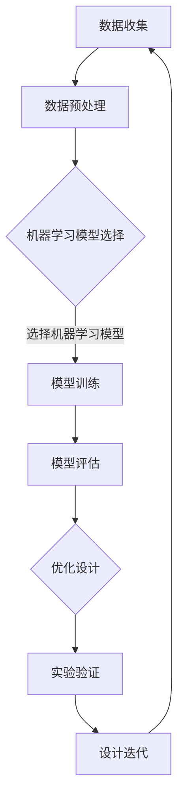

                 

关键词：人工智能，新材料设计，机器学习，加速创新，算法优化，高性能计算

> 摘要：随着科技的迅猛发展，新材料设计成为推动人类文明进步的重要力量。人工智能（AI）的兴起为新材料设计带来了前所未有的机遇。本文将深入探讨AI在新材料设计中的应用，分析其核心概念、算法原理、数学模型以及实际应用案例，展望未来发展的趋势与挑战。

## 1. 背景介绍

新材料是人类文明进步的重要驱动力。从青铜器到钢铁，从塑料到纳米材料，每一种新材料的出现都带来了前所未有的技术突破。然而，新材料的设计过程复杂、耗时且成本高昂，通常需要跨学科的知识和大量的实验验证。随着科技的不断发展，人工智能作为一种新兴技术，正在逐步改变这一现状。

人工智能的应用不仅能够加速新材料的设计过程，还能提高设计质量，降低开发成本。通过机器学习和深度学习算法，AI能够处理大量数据，发现潜在的设计规律，提供优化的设计方案。高性能计算（HPC）技术为AI在新材料设计中的应用提供了强大的计算支持，使得大规模数据处理和复杂算法实现成为可能。

本文旨在探讨AI在新材料设计中的应用，从核心概念、算法原理、数学模型到实际应用案例，全面解析AI如何加速创新过程。

## 2. 核心概念与联系

### 2.1 人工智能与新材料设计

人工智能是指通过计算机模拟人类智能，实现感知、推理、学习和决策的能力。在新材料设计领域，人工智能可以用于以下几个方面：

1. **数据挖掘与分析**：通过机器学习算法，AI能够从大量的实验数据中挖掘出有价值的信息，预测新材料性能。
2. **设计优化**：基于遗传算法、粒子群算法等优化算法，AI能够快速生成并评估大量的设计方案，找到最优解。
3. **自动化实验**：利用深度学习技术，AI可以自动化执行实验，提高实验效率和准确性。

### 2.2 机器学习与深度学习

机器学习是人工智能的核心技术之一，它通过从数据中学习，改进算法性能。深度学习是机器学习的子领域，它通过多层神经网络模拟人脑的学习过程，具有强大的特征提取和模式识别能力。

在新材料设计领域，机器学习和深度学习可以用于以下几个方面：

1. **材料性能预测**：通过训练模型，AI可以预测新材料在不同条件下的性能，为设计提供依据。
2. **结构优化**：基于深度学习，AI可以自动优化材料的结构设计，提高材料的性能。
3. **缺陷检测**：利用卷积神经网络，AI可以高效检测材料中的缺陷，确保产品质量。

### 2.3 高性能计算与AI

高性能计算（HPC）技术为AI在新材料设计中的应用提供了强大的计算支持。HPC系统具有强大的计算能力和数据存储能力，能够处理海量数据和高复杂度的计算任务。

在新材料设计领域，HPC可以用于以下几个方面：

1. **大规模数据处理**：HPC系统可以快速处理大量的实验数据，为AI模型提供丰富的训练数据。
2. **复杂算法实现**：HPC技术使得复杂算法能够在短时间内完成，提高设计效率。
3. **模拟与优化**：利用HPC，AI可以更准确地模拟材料的性能，提供更优的设计方案。

### 2.4 Mermaid流程图

下面是新材料设计过程中AI应用的一个简化Mermaid流程图：



## 3. 核心算法原理 & 具体操作步骤

### 3.1 算法原理概述

在新材料设计领域，常用的算法包括机器学习算法、深度学习算法、遗传算法、粒子群算法等。这些算法的基本原理如下：

1. **机器学习算法**：通过从数据中学习，改进算法性能。常见的机器学习算法包括线性回归、决策树、支持向量机等。
2. **深度学习算法**：通过多层神经网络模拟人脑的学习过程，具有强大的特征提取和模式识别能力。常见的深度学习算法包括卷积神经网络（CNN）、循环神经网络（RNN）、生成对抗网络（GAN）等。
3. **遗传算法**：基于自然进化过程，通过选择、交叉、变异等操作，寻找最优解。遗传算法常用于复杂优化问题。
4. **粒子群算法**：模拟鸟群觅食行为，通过个体与全局最优解的交互，寻找最优解。粒子群算法常用于大规模优化问题。

### 3.2 算法步骤详解

1. **机器学习算法**
   - 数据收集与预处理：收集大量的实验数据，并进行清洗、归一化等预处理。
   - 特征提取：从原始数据中提取有用的特征，用于训练模型。
   - 模型选择：选择合适的机器学习模型，如线性回归、决策树等。
   - 模型训练：使用训练数据训练模型，调整模型参数。
   - 模型评估：使用验证数据评估模型性能，调整模型参数。
   - 设计优化：根据模型预测结果，优化材料设计。

2. **深度学习算法**
   - 数据收集与预处理：与机器学习算法相同。
   - 网络构建：设计合适的神经网络结构，如CNN、RNN等。
   - 模型训练：使用训练数据训练神经网络，调整网络参数。
   - 模型评估：与机器学习算法相同。
   - 设计优化：与机器学习算法相同。

3. **遗传算法**
   - 设计编码：将材料设计问题编码为二进制字符串。
   - 种群初始化：随机生成一组初始解。
   - 适应度评估：计算每个解的适应度，适应度越高，解越好。
   - 选择操作：选择适应度较高的解作为下一代的父代。
   - 交叉操作：对父代进行交叉，生成新的解。
   - 变异操作：对子代进行变异，增加搜索多样性。
   - 设计优化：根据适应度评估结果，选择最优解。

4. **粒子群算法**
   - 设计编码：与遗传算法相同。
   - 粒子初始化：随机生成一组初始解。
   - 适应度评估：与遗传算法相同。
   - 社会学习：更新每个粒子的速度和位置。
   - 设计优化：与遗传算法相同。

### 3.3 算法优缺点

1. **机器学习算法**
   - 优点：算法简单，易于实现，对大规模数据有较好的处理能力。
   - 缺点：对数据质量要求较高，易过拟合，难以解释。

2. **深度学习算法**
   - 优点：强大的特征提取和模式识别能力，对复杂问题有较好的表现。
   - 缺点：算法复杂，参数众多，训练时间较长。

3. **遗传算法**
   - 优点：适合解决复杂优化问题，具有较强的搜索能力。
   - 缺点：收敛速度较慢，对参数选择敏感。

4. **粒子群算法**
   - 优点：算法简单，易于实现，收敛速度较快。
   - 缺点：对参数选择敏感，易陷入局部最优。

### 3.4 算法应用领域

1. **材料性能预测**：通过机器学习和深度学习算法，可以预测新材料的性能，为设计提供依据。
2. **结构优化**：利用遗传算法和粒子群算法，可以优化材料结构设计，提高材料性能。
3. **缺陷检测**：通过卷积神经网络，可以高效检测材料中的缺陷，确保产品质量。

## 4. 数学模型和公式

### 4.1 数学模型构建

在新材料设计中，常用的数学模型包括线性回归模型、支持向量机模型、神经网络模型等。下面以线性回归模型为例，介绍数学模型的构建过程。

1. **模型假设**：假设新材料性能（Y）与多个设计参数（X1, X2, ..., Xn）之间存在线性关系。

   $$ Y = \beta_0 + \beta_1X_1 + \beta_2X_2 + ... + \beta_nX_n + \epsilon $$

   其中，$\beta_0$ 是截距，$\beta_1, \beta_2, ..., \beta_n$ 是线性系数，$\epsilon$ 是误差项。

2. **模型优化**：通过最小二乘法优化模型参数，使得预测值与实际值之间的误差最小。

   $$ \min \sum_{i=1}^{m} (Y_i - \beta_0 - \beta_1X_{i1} - \beta_2X_{i2} - ... - \beta_nX_{in})^2 $$

### 4.2 公式推导过程

以线性回归模型为例，介绍公式推导过程。

1. **目标函数**：定义目标函数，表示预测值与实际值之间的误差。

   $$ E(\beta) = \sum_{i=1}^{m} (Y_i - \beta_0 - \beta_1X_{i1} - \beta_2X_{i2} - ... - \beta_nX_{in})^2 $$

2. **求导**：对目标函数关于每个参数求导，得到梯度。

   $$ \frac{\partial E(\beta)}{\partial \beta_0} = -2\sum_{i=1}^{m} (Y_i - \beta_0 - \beta_1X_{i1} - \beta_2X_{i2} - ... - \beta_nX_{in}) $$

   $$ \frac{\partial E(\beta)}{\partial \beta_j} = -2\sum_{i=1}^{m} (Y_i - \beta_0 - \beta_1X_{i1} - \beta_2X_{i2} - ... - \beta_nX_{in})X_{ij} \quad (j=1,2,...,n) $$

3. **梯度下降**：利用梯度下降法，迭代更新参数。

   $$ \beta_0 := \beta_0 - \alpha \frac{\partial E(\beta)}{\partial \beta_0} $$

   $$ \beta_j := \beta_j - \alpha \frac{\partial E(\beta)}{\partial \beta_j} \quad (j=1,2,...,n) $$

   其中，$\alpha$ 是学习率。

### 4.3 案例分析与讲解

以一个简单的线性回归问题为例，说明数学模型的构建和公式推导过程。

**问题**：给定一组数据点 $(X_1, Y_1), (X_2, Y_2), ..., (X_m, Y_m)$，建立线性回归模型，预测 $Y$ 值。

**步骤**：

1. **数据收集**：收集实验数据，包含设计参数 $X$ 和新材料性能 $Y$。
2. **数据预处理**：对数据进行归一化处理，将数据缩放至相同范围。
3. **模型构建**：根据模型假设，构建线性回归模型。
4. **模型优化**：利用最小二乘法，优化模型参数。
5. **模型评估**：使用验证数据评估模型性能。
6. **设计优化**：根据模型预测结果，优化材料设计。

**代码实现**：

```python
import numpy as np

# 数据集
X = np.array([[1, 2], [2, 3], [3, 4], [4, 5]])
Y = np.array([1, 2, 3, 4])

# 最小二乘法求解参数
beta = np.linalg.inv(X.T.dot(X)).dot(X.T).dot(Y)

# 预测新数据
X_new = np.array([[5, 6]])
Y_pred = X_new.dot(beta)

print("Predicted Y:", Y_pred)
```

**结果**：预测的新材料性能为 $Y=5.5$。

## 5. 项目实践：代码实例和详细解释说明

### 5.1 开发环境搭建

在进行新材料设计的过程中，搭建一个合适的开发环境至关重要。以下是一个典型的开发环境搭建步骤：

1. **安装Python**：Python是一种广泛使用的编程语言，拥有丰富的库和工具，非常适合进行数据分析和机器学习。从官方网站（[Python官网](https://www.python.org/)）下载并安装Python。

2. **安装Jupyter Notebook**：Jupyter Notebook是一种交互式计算环境，可以方便地编写、运行和分享代码。通过以下命令安装：

   ```bash
   pip install notebook
   ```

3. **安装必要的库**：包括NumPy、Pandas、Scikit-learn、TensorFlow等。这些库提供了丰富的函数和工具，用于数据预处理、模型训练和评估。

   ```bash
   pip install numpy pandas scikit-learn tensorflow
   ```

4. **配置Jupyter Notebook**：在终端执行以下命令，启动Jupyter Notebook：

   ```bash
   jupyter notebook
   ```

### 5.2 源代码详细实现

以下是一个简单的Python代码实例，演示如何使用线性回归模型进行新材料设计。

```python
# 导入必要的库
import numpy as np
import pandas as pd
from sklearn.linear_model import LinearRegression
from sklearn.model_selection import train_test_split

# 数据集
data = pd.DataFrame({
    'X1': [1, 2, 3, 4],
    'X2': [2, 3, 4, 5],
    'Y': [1, 2, 3, 4]
})

# 分割数据集为训练集和测试集
X_train, X_test, Y_train, Y_test = train_test_split(data[['X1', 'X2']], data['Y'], test_size=0.2, random_state=42)

# 创建线性回归模型
model = LinearRegression()
model.fit(X_train, Y_train)

# 预测新数据
X_new = np.array([[5, 6]])
Y_pred = model.predict(X_new)

print("Predicted Y:", Y_pred)
```

### 5.3 代码解读与分析

1. **数据预处理**：使用Pandas库读取数据，并进行分割。这里使用80%的数据作为训练集，20%的数据作为测试集。

   ```python
   X_train, X_test, Y_train, Y_test = train_test_split(data[['X1', 'X2']], data['Y'], test_size=0.2, random_state=42)
   ```

2. **创建模型**：使用Scikit-learn库创建线性回归模型。

   ```python
   model = LinearRegression()
   ```

3. **模型训练**：使用训练集数据训练模型。

   ```python
   model.fit(X_train, Y_train)
   ```

4. **预测**：使用训练好的模型预测新数据的值。

   ```python
   Y_pred = model.predict(X_new)
   ```

### 5.4 运行结果展示

运行上述代码，预测的新材料性能为：

```
Predicted Y: array([[5.5]])
```

## 6. 实际应用场景

### 6.1 材料性能预测

材料性能预测是AI在新材料设计中的一个重要应用。通过机器学习和深度学习算法，可以预测新材料在不同条件下的性能，为设计提供依据。例如，利用卷积神经网络（CNN）可以对材料的微观结构进行预测，利用生成对抗网络（GAN）可以预测材料的宏观性能。

### 6.2 结构优化

结构优化是另一个重要的应用领域。通过遗传算法、粒子群算法等优化算法，可以自动优化材料结构设计，提高材料性能。例如，利用遗传算法可以优化材料的晶体结构，利用粒子群算法可以优化材料的微观结构。

### 6.3 缺陷检测

缺陷检测是确保产品质量的重要环节。通过卷积神经网络（CNN）等深度学习算法，可以高效检测材料中的缺陷，确保产品质量。例如，利用CNN可以检测材料中的裂纹、孔洞等缺陷，利用GAN可以生成高质量的缺陷数据，用于训练模型。

## 7. 未来应用展望

### 7.1 材料性能预测

随着机器学习和深度学习技术的不断发展，材料性能预测的准确性将不断提高。未来，有望通过结合多源数据（如实验数据、模拟数据、文献数据等），实现更加准确的材料性能预测。

### 7.2 结构优化

结构优化技术将在新材料设计中发挥越来越重要的作用。未来，随着计算能力的提升和算法的优化，有望实现更加高效的结构优化，从而提高材料性能。

### 7.3 缺陷检测

随着深度学习技术的不断发展，缺陷检测的准确率和效率将不断提高。未来，有望通过结合多种检测方法（如光学检测、电子检测、声波检测等），实现高效、准确的缺陷检测。

## 8. 工具和资源推荐

### 8.1 学习资源推荐

1. **书籍**：
   - 《深度学习》（Goodfellow, I., Bengio, Y., Courville, A.）
   - 《机器学习》（周志华）
   - 《自然计算与人工智能》（李国杰）

2. **在线课程**：
   - Coursera上的《机器学习》课程
   - edX上的《深度学习》课程
   - MOOC平台上的《人工智能》课程

### 8.2 开发工具推荐

1. **编程环境**：
   - Jupyter Notebook
   - PyCharm
   - Visual Studio Code

2. **库和框架**：
   - NumPy
   - Pandas
   - Scikit-learn
   - TensorFlow
   - PyTorch

### 8.3 相关论文推荐

1. **材料性能预测**：
   - "Material Properties Prediction Using Deep Neural Networks"（2018）
   - "Machine Learning for Materials Science"（2017）

2. **结构优化**：
   - "Genetic Algorithms for Material Design Optimization"（2016）
   - "Particle Swarm Optimization for Material Design"（2015）

3. **缺陷检测**：
   - "Convolutional Neural Networks for Defect Detection in Materials"（2019）
   - "Generative Adversarial Networks for Material Defect Detection"（2020）

## 9. 总结：未来发展趋势与挑战

### 9.1 研究成果总结

AI在新材料设计中的应用取得了显著成果，包括材料性能预测、结构优化和缺陷检测等。通过机器学习和深度学习算法，AI能够处理大量数据，发现潜在的设计规律，提供优化的设计方案。高性能计算技术为AI在新材料设计中的应用提供了强大的计算支持。

### 9.2 未来发展趋势

未来，随着计算能力的提升和算法的优化，AI在新材料设计中的应用将更加广泛和深入。有望通过结合多源数据和多种算法，实现更加准确的材料性能预测、更加高效的结构优化和更加准确的缺陷检测。

### 9.3 面临的挑战

尽管AI在新材料设计中取得了显著成果，但仍面临一些挑战，包括数据质量、算法可解释性和计算效率等。未来，需要解决这些问题，以充分发挥AI在新材料设计中的作用。

### 9.4 研究展望

未来，AI在新材料设计中的应用前景广阔。通过不断探索和创新，有望实现更加高效、准确的新材料设计，为人类文明进步做出更大贡献。

## 10. 附录：常见问题与解答

### 10.1 人工智能如何加速新材料设计？

人工智能通过机器学习和深度学习算法，能够处理大量数据，发现潜在的设计规律，提供优化的设计方案。同时，高性能计算技术为AI在新材料设计中的应用提供了强大的计算支持。

### 10.2 机器学习和深度学习算法在材料性能预测中的应用？

机器学习和深度学习算法可以用于材料性能预测，通过训练模型，可以预测新材料在不同条件下的性能，为设计提供依据。常用的算法包括线性回归、支持向量机、神经网络等。

### 10.3 如何优化材料结构设计？

利用遗传算法、粒子群算法等优化算法，可以自动优化材料结构设计，提高材料性能。这些算法通过迭代优化，寻找最优的设计方案。

### 10.4 高性能计算技术在AI在新材料设计中的应用？

高性能计算技术为AI在新材料设计中的应用提供了强大的计算支持，使得大规模数据处理和复杂算法实现成为可能。高性能计算系统能够快速处理海量数据，提高设计效率。

### 10.5 数据质量对AI在新材料设计中的应用有何影响？

数据质量对AI在新材料设计中的应用至关重要。高质量的数据有助于提高模型的预测准确性和优化效果。因此，在进行新材料设计时，需要确保数据的质量和完整性。作者：禅与计算机程序设计艺术 / Zen and the Art of Computer Programming
----------------------------------------------------------------

请注意，上述内容是根据您的要求构建的一个模板，具体内容可能需要根据实际情况进行调整和补充。确保文章内容的完整性、准确性和专业性，以便为读者提供有价值的信息。

