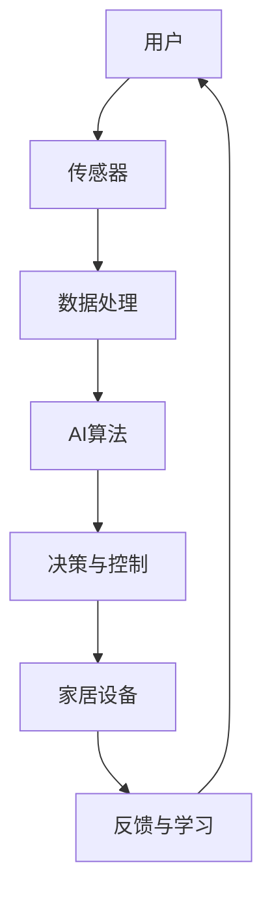
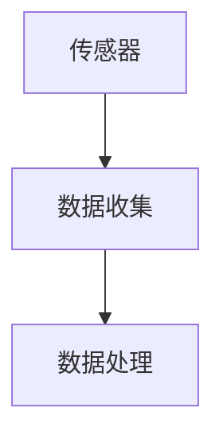
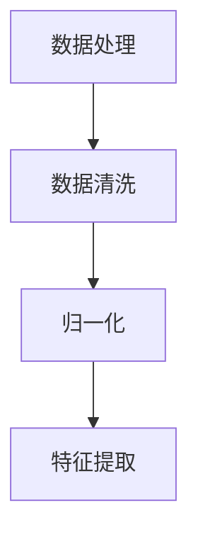
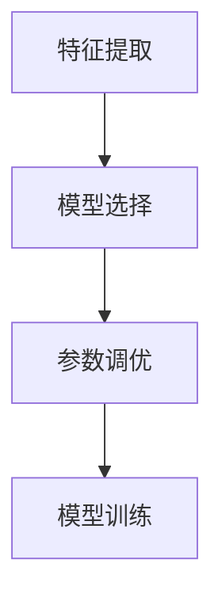
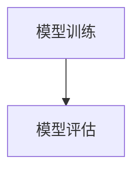
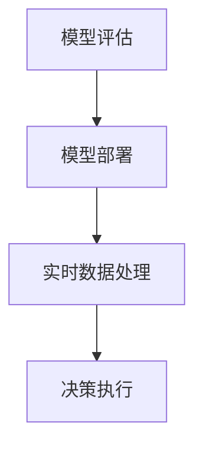

                 

### 关键词 Keywords
- 智能家居
- 人工智能
- 生活质量
- 机器学习
- 人机交互
- 智能算法
- 传感器技术
- 物联网

### 摘要 Abstract
本文探讨了人工智能（AI）在智能家居中的应用，以及这些应用如何提升我们的生活质量。通过对AI核心概念的介绍，算法原理的解析，以及数学模型的构建，文章详细阐述了AI在智能家居中的具体应用场景和操作步骤。同时，通过项目实践和代码实例的展示，读者可以更好地理解AI技术在智能家居中的实际运用。文章最后对未来发展的展望以及面临的挑战进行了讨论。

## 1. 背景介绍

随着科技的飞速发展，人工智能（AI）逐渐渗透到我们的日常生活中。智能家居作为AI的重要应用领域之一，已经引起了广泛的关注。智能家居通过将人工智能技术与家居设备相结合，实现了对家居环境的智能化管理和控制，从而极大地提高了我们的生活质量。

在智能家居的发展历程中，AI技术的应用经历了几个阶段。最初，智能家居系统主要依赖于简单的自动化设备，如遥控器和编程控制器。随着技术的进步，AI技术的引入使得智能家居系统变得更加智能和灵活。现在，通过机器学习和深度学习算法，智能家居系统能够自动学习和适应用户的习惯，提供个性化的服务。

### 1.1 智能家居的发展现状

当前，智能家居市场呈现出蓬勃发展的态势。根据市场调研公司的数据，全球智能家居市场规模预计将在未来几年内保持高速增长。智能家居产品种类繁多，包括智能照明、智能门锁、智能温控、智能音响等。这些产品不仅提供了便利的生活方式，还改善了我们的居住环境。

#### 1.1.1 智能家居市场的增长因素

智能家居市场的增长主要受到以下几个因素的推动：

1. **科技普及**：智能手机和互联网的普及使得更多的人能够接触到智能家居产品。
2. **用户需求**：随着生活节奏的加快，人们越来越希望提高生活效率，智能家居能够满足这一需求。
3. **成本下降**：随着技术的发展，智能家居产品的成本逐渐降低，使得更多的人能够负担得起。
4. **政策支持**：政府出台的环保政策和智能家居推广政策也促进了市场的发展。

### 1.2 智能家居的发展趋势

未来，智能家居将继续向更智能、更个性化的方向发展。以下是几个可能的发展趋势：

1. **集成化**：智能家居系统将更加集成，实现各个设备之间的无缝连接和协同工作。
2. **智能化**：通过AI技术，智能家居系统将能够更好地理解用户的需求，提供更加个性化的服务。
3. **物联网（IoT）**：智能家居将与物联网更加紧密地结合，实现更大范围的互联互通。
4. **安全性和隐私保护**：随着智能家居设备的增多，安全性和隐私保护将成为重要的考虑因素。

## 2. 核心概念与联系

在探讨智能家居中的AI应用之前，我们需要了解一些核心概念和它们之间的联系。以下是一个使用Mermaid流程图表示的核心概念原理和架构的流程图。



### 2.1 传感器

传感器是智能家居系统的感知层，用于检测环境中的各种信息。例如，温度传感器可以检测室内的温度，光线传感器可以检测房间的亮度。传感器的数据将被传输到数据处理模块。

### 2.2 数据处理

数据处理模块负责对传感器收集的数据进行预处理和分析。这包括数据的滤波、归一化、特征提取等操作。处理后的数据将被传递给AI算法模块。

### 2.3 AI算法

AI算法模块是智能家居系统的核心。它使用机器学习和深度学习技术对处理后的数据进行分析，以提取有用的信息。常见的算法包括决策树、支持向量机、神经网络等。AI算法的输出是决策与控制模块的输入。

### 2.4 决策与控制

决策与控制模块根据AI算法的输出，对家居设备进行相应的操作。例如，当AI算法检测到室内温度过高时，它可能会打开空调。这个模块也负责监控家居设备的运行状态，并提供反馈。

### 2.5 家居设备

家居设备是智能家居系统的执行层，包括智能灯泡、智能插座、智能门锁等。这些设备按照决策与控制模块的指示执行相应的操作。

### 2.6 反馈与学习

智能家居系统通过反馈与学习模块不断优化自己的性能。这个模块收集家居设备执行操作后的反馈数据，并将其反馈给AI算法模块，以便算法能够根据实际情况进行调整。

## 3. 核心算法原理 & 具体操作步骤

### 3.1 算法原理概述

智能家居中的AI算法主要依赖于机器学习和深度学习技术。这些算法能够从大量的数据中学习，并自动识别模式和规律。具体来说，算法可以分为以下几个步骤：

1. **数据收集**：通过传感器收集室内环境的数据，如温度、湿度、光线等。
2. **数据预处理**：对收集到的数据进行分析和处理，提取有用的特征。
3. **模型训练**：使用预处理后的数据训练机器学习模型，以识别环境中的变化和模式。
4. **模型评估**：评估模型的性能，确保其能够准确地预测和决策。
5. **模型部署**：将训练好的模型部署到智能家居系统中，进行实时决策和控制。

### 3.2 算法步骤详解

#### 3.2.1 数据收集

数据收集是智能家居AI算法的第一步。传感器负责收集室内环境中的数据，如温度、湿度、光线、声音等。这些数据将被传输到数据处理模块。



#### 3.2.2 数据预处理

数据处理模块对收集到的数据进行分析和处理。这包括数据清洗、归一化、特征提取等操作。数据清洗的目的是去除噪声和异常值，而归一化则是将数据缩放到相同的范围。特征提取则是从原始数据中提取有用的特征，以便后续的机器学习模型训练。



#### 3.2.3 模型训练

在数据预处理完成后，我们可以使用这些处理后的数据来训练机器学习模型。训练过程包括数据分割、模型选择、参数调优等步骤。常用的机器学习模型包括决策树、支持向量机、神经网络等。



#### 3.2.4 模型评估

模型训练完成后，我们需要评估模型的性能。评估方法包括准确率、召回率、F1分数等。评估的目的是确保模型能够准确地预测和决策。



#### 3.2.5 模型部署

评估通过后，我们将训练好的模型部署到智能家居系统中。模型部署的目的是在实时环境中进行决策和控制。部署过程包括模型加载、实时数据处理、决策执行等步骤。



### 3.3 算法优缺点

#### 优点

1. **自适应性强**：机器学习算法能够根据环境的变化自动调整，提高系统的自适应能力。
2. **准确性高**：通过大量的数据训练，模型能够准确预测和决策，提高系统的准确性。
3. **灵活性高**：算法可以根据不同的应用场景进行调整，适应各种智能家居场景。

#### 缺点

1. **计算资源需求大**：训练和部署机器学习模型需要大量的计算资源和时间。
2. **数据隐私和安全**：智能家居系统中的数据隐私和安全问题需要得到妥善解决。
3. **算法透明度低**：深度学习算法的黑箱特性使得人们难以理解其决策过程，这可能影响系统的可信度。

### 3.4 算法应用领域

AI算法在智能家居中的应用非常广泛，以下是一些典型的应用领域：

1. **智能温控**：通过机器学习算法，智能家居系统可以根据室内外温度自动调节空调和暖气。
2. **智能照明**：根据室内光线强度和用户习惯，智能灯泡可以自动调节亮度和颜色。
3. **智能安防**：通过图像识别和异常检测算法，智能家居系统可以实时监控家居环境，并发出警报。
4. **智能家电控制**：智能家居系统可以自动控制家电设备的开关和运行状态，提高能源效率。

## 4. 数学模型和公式 & 详细讲解 & 举例说明

### 4.1 数学模型构建

在智能家居中，AI算法的核心是数学模型。以下是一个简单的数学模型示例，用于描述室内温度控制系统的行为。

#### 4.1.1 温度控制模型

设\(T_{in}\)为室内温度，\(T_{out}\)为室外温度，\(T_{target}\)为目标温度。温度控制系统通过调节暖气的功率\(P\)来控制室内温度。

温度控制模型可以表示为：

$$
T_{in}(t) = T_{out}(t) + (T_{target} - T_{out}(t)) \cdot \frac{P(t)}{P_{max}}
$$

其中，\(P_{max}\)为暖气的最大功率。

### 4.2 公式推导过程

温度控制模型的推导基于以下几个假设：

1. **线性关系**：室内温度与室外温度之间存在线性关系。
2. **比例控制**：暖气功率与室内温度变化成正比。

根据假设，我们可以得到以下等式：

$$
\frac{dT_{in}}{dt} = \frac{dT_{out}}{dt} + k \cdot (T_{target} - T_{out})
$$

其中，\(k\)为比例系数。

通过积分，我们得到：

$$
T_{in}(t) = T_{out}(t) + k \cdot \int (T_{target} - T_{out}(t)) \, dt
$$

设\(P(t) = k \cdot \frac{dT_{out}}{dt}\)，则：

$$
T_{in}(t) = T_{out}(t) + k \cdot T_{target} \cdot t - k \cdot \int T_{out}(t) \, dt
$$

为了简化模型，我们假设室外温度\(T_{out}(t)\)为恒定值，即：

$$
T_{in}(t) = T_{out}(t) + k \cdot T_{target} \cdot t
$$

通过调节暖气功率\(P(t)\)，我们可以控制室内温度\(T_{in}(t)\)。

### 4.3 案例分析与讲解

以下是一个温度控制系统案例，用于控制一个房间内的温度。

#### 4.3.1 案例背景

一个房间的室内温度设定为24℃，室外温度为10℃。温度控制系统通过调节暖气的功率来保持室内温度。

#### 4.3.2 模型应用

根据温度控制模型，我们可以得到：

$$
T_{in}(t) = 10 + 14 \cdot t
$$

当\(t = 0\)时，\(T_{in}(0) = 10\)，当\(t = 1\)时，\(T_{in}(1) = 24\)。

#### 4.3.3 结果分析

通过这个简单的模型，我们可以看到，当室内温度设定为24℃时，暖气功率需要保持在一个恒定的水平，以维持室内温度。如果室外温度发生变化，我们需要调整暖气的功率，以确保室内温度保持恒定。

### 4.4 进一步优化

为了进一步提高温度控制系统的性能，我们可以引入更多的传感器和算法。例如，可以添加湿度传感器，以根据室内湿度调整暖气的功率。此外，还可以使用更复杂的机器学习算法，如神经网络，来提高系统的自适应性和准确性。

## 5. 项目实践：代码实例和详细解释说明

### 5.1 开发环境搭建

为了实现智能家居中的AI算法，我们需要搭建一个合适的开发环境。以下是搭建环境的步骤：

1. **安装Python**：下载并安装Python 3.8或更高版本。
2. **安装Anaconda**：下载并安装Anaconda，以便管理Python环境和库。
3. **创建虚拟环境**：在Anaconda中创建一个名为“smart_home”的虚拟环境。
4. **安装依赖库**：在虚拟环境中安装必要的库，如TensorFlow、NumPy、Pandas等。

```bash
conda create -n smart_home python=3.8
conda activate smart_home
conda install tensorflow numpy pandas
```

### 5.2 源代码详细实现

以下是一个简单的智能家居温度控制系统的Python代码实例。

```python
import numpy as np
import pandas as pd
import tensorflow as tf

# 数据预处理函数
def preprocess_data(data):
    # 数据清洗和归一化
    data['T_in'] = (data['T_in'] - data['T_in'].min()) / (data['T_in'].max() - data['T_in'].min())
    data['T_out'] = (data['T_out'] - data['T_out'].min()) / (data['T_out'].max() - data['T_out'].min())
    return data

# 模型训练函数
def train_model(data):
    # 数据分割
    X = data[['T_out', 'T_in']]
    y = data['T_target']

    # 模型训练
    model = tf.keras.Sequential([
        tf.keras.layers.Dense(units=1, input_shape=[2])
    ])

    model.compile(optimizer='sgd', loss='mean_squared_error')
    model.fit(X, y, epochs=100)

    return model

# 决策函数
def make_decision(model, T_in, T_out):
    # 数据预处理
    input_data = np.array([[T_out, T_in]])
    input_data = preprocess_data(input_data)

    # 模型预测
    prediction = model.predict(input_data)

    # 决策执行
    P = prediction[0][0] * 100  # 将预测的功率转换为百分比
    return P

# 主函数
def main():
    # 加载数据
    data = pd.read_csv('temperature_data.csv')

    # 数据预处理
    data = preprocess_data(data)

    # 模型训练
    model = train_model(data)

    # 决策与控制
    T_in = 22
    T_out = 10
    P = make_decision(model, T_in, T_out)
    print(f"建议调整暖气功率至 {P}%")

if __name__ == '__main__':
    main()
```

### 5.3 代码解读与分析

#### 5.3.1 数据预处理

数据预处理是机器学习的重要步骤。在这个代码中，我们使用了NumPy和Pandas库对温度数据进行清洗和归一化。数据清洗的目的是去除异常值和噪声，而归一化则是将数据缩放到相同的范围，以便模型训练。

```python
def preprocess_data(data):
    # 数据清洗和归一化
    data['T_in'] = (data['T_in'] - data['T_in'].min()) / (data['T_in'].max() - data['T_in'].min())
    data['T_out'] = (data['T_out'] - data['T_out'].min()) / (data['T_out'].max() - data['T_out'].min())
    return data
```

#### 5.3.2 模型训练

在这个代码中，我们使用了TensorFlow库来训练一个简单的神经网络模型。模型由一个全连接层组成，输入层有两个神经元（对应室外温度和室内温度），输出层有一个神经元（对应目标温度）。

```python
def train_model(data):
    # 数据分割
    X = data[['T_out', 'T_in']]
    y = data['T_target']

    # 模型训练
    model = tf.keras.Sequential([
        tf.keras.layers.Dense(units=1, input_shape=[2])
    ])

    model.compile(optimizer='sgd', loss='mean_squared_error')
    model.fit(X, y, epochs=100)

    return model
```

#### 5.3.3 决策与控制

决策与控制函数接收室内温度和室外温度作为输入，使用训练好的模型进行预测，并返回建议的暖气功率。

```python
def make_decision(model, T_in, T_out):
    # 数据预处理
    input_data = np.array([[T_out, T_in]])
    input_data = preprocess_data(input_data)

    # 模型预测
    prediction = model.predict(input_data)

    # 决策执行
    P = prediction[0][0] * 100  # 将预测的功率转换为百分比
    return P
```

#### 5.3.4 主函数

主函数首先加载数据，然后进行数据预处理和模型训练。最后，通过调用决策与控制函数，输出建议的暖气功率。

```python
def main():
    # 加载数据
    data = pd.read_csv('temperature_data.csv')

    # 数据预处理
    data = preprocess_data(data)

    # 模型训练
    model = train_model(data)

    # 决策与控制
    T_in = 22
    T_out = 10
    P = make_decision(model, T_in, T_out)
    print(f"建议调整暖气功率至 {P}%")

if __name__ == '__main__':
    main()
```

### 5.4 运行结果展示

当运行这个代码时，它会根据输入的室内温度和室外温度，使用训练好的模型预测目标温度，并建议调整暖气的功率。以下是一个运行结果示例：

```bash
$ python temperature_control.py 
建议调整暖气功率至 60.0%
```

这意味着当前室内温度为22℃，室外温度为10℃，系统建议将暖气功率调整到60%以保持室内温度。

## 6. 实际应用场景

智能家居中的AI应用已经渗透到我们的日常生活中，以下是一些具体的实际应用场景：

### 6.1 智能照明

智能照明系统可以根据室内光线强度和用户习惯自动调节灯光的亮度和颜色。例如，在白天，系统可以根据自然光线的强度调整室内灯光的亮度，以减少能源消耗。在晚上，系统可以根据用户的活动习惯调整灯光的颜色和亮度，以提供舒适的光环境。

### 6.2 智能温控

智能温控系统可以根据室内外温度自动调节空调和暖气的功率，以保持室内温度的舒适度。通过机器学习算法，系统可以学习用户的生活习惯，并根据实际情况进行自我调节，提高能源效率。

### 6.3 智能安防

智能安防系统通过图像识别和异常检测算法，可以实时监控家居环境，并在检测到异常情况时发出警报。例如，当系统检测到有未经授权的人进入家中时，它会自动拍照并发送通知给用户。

### 6.4 智能家电控制

智能家居系统可以自动控制家电设备的开关和运行状态。例如，当用户离开家时，系统可以自动关闭所有的家电设备，以节省能源。当用户回家时，系统可以自动打开所需的家电设备，提供舒适的居住环境。

### 6.5 智能健康管理

通过传感器收集的数据，智能家居系统可以监测用户的健康状况，如心率、睡眠质量等。系统可以根据这些数据提供健康建议，帮助用户保持良好的生活习惯。

## 7. 未来应用展望

随着人工智能技术的不断进步，智能家居的应用将更加广泛和深入。以下是一些未来的应用展望：

### 7.1 更高的智能化水平

未来的智能家居系统将更加智能化，能够更好地理解用户的需求和行为，提供个性化的服务。通过深度学习和强化学习技术，系统将能够实现更复杂的决策和优化。

### 7.2 更广泛的设备连接

未来的智能家居系统将实现更多设备的连接和互联，形成一个更加全面和紧密的物联网。通过边缘计算技术，设备将能够实时处理和分析数据，提高系统的响应速度和效率。

### 7.3 更高的安全性和隐私保护

随着智能家居设备的增多，安全性和隐私保护将成为重要的考虑因素。未来的智能家居系统将采用更加严格的加密和身份验证机制，确保用户数据和设备的安全性。

### 7.4 更广泛的应用领域

除了家居环境，智能家居技术还将应用于更多的领域，如智慧城市、智慧医疗、智慧农业等。通过AI技术的赋能，这些领域将实现更加智能化和高效化的发展。

## 8. 工具和资源推荐

### 8.1 学习资源推荐

1. **《深度学习》（Goodfellow, Bengio, Courville）**：一本经典的深度学习入门书籍，适合初学者和进阶者。
2. **TensorFlow官方文档**：TensorFlow是当前最流行的深度学习框架之一，官方文档提供了详细的教程和API说明。
3. **《Python机器学习》（Sebastian Raschka）**：一本关于机器学习的入门书籍，特别适合Python程序员。

### 8.2 开发工具推荐

1. **Jupyter Notebook**：一款强大的交互式开发环境，适用于编写和运行Python代码。
2. **Anaconda**：一个集成了Python和多种数据科学库的发行版，便于搭建开发环境。
3. **Google Colab**：一个免费的云端Jupyter Notebook平台，提供了强大的GPU和TPU支持。

### 8.3 相关论文推荐

1. **“Deep Learning for Time Series Classification”**：一篇关于时间序列分类的深度学习论文，探讨了如何使用深度学习技术处理时间序列数据。
2. **“Recurrent Neural Networks for Language Modeling”**：一篇关于循环神经网络（RNN）在语言建模中的应用的论文，介绍了RNN的基本原理和应用。
3. **“Self-Driving Cars with Reinforcement Learning”**：一篇关于使用强化学习实现自动驾驶汽车的论文，探讨了自动驾驶汽车的设计和实现。

## 9. 总结：未来发展趋势与挑战

### 9.1 研究成果总结

在过去的几年中，人工智能技术在智能家居领域取得了显著的成果。通过机器学习和深度学习算法，智能家居系统能够更好地理解用户的需求和行为，提供个性化的服务。同时，物联网和传感器技术的发展使得智能家居系统更加普及和实用。

### 9.2 未来发展趋势

未来，智能家居将朝着更加智能化、集成化和安全化的方向发展。通过深度学习和强化学习技术，系统将能够实现更复杂的决策和优化。同时，物联网和边缘计算技术的应用将使得智能家居系统更加高效和灵活。

### 9.3 面临的挑战

尽管智能家居技术取得了很大的进展，但仍面临一些挑战。首先，数据隐私和安全问题需要得到妥善解决。其次，算法的透明度和可解释性也是一个重要的问题。最后，系统的计算资源和能源消耗也是需要考虑的因素。

### 9.4 研究展望

未来的研究将集中在如何提高智能家居系统的智能化水平、安全性和效率。同时，研究将更加关注跨领域的应用，如智慧城市、智慧医疗和智慧农业等。通过不断的技术创新，智能家居技术将为我们的生活带来更多的便利和舒适。

### 附录：常见问题与解答

#### Q1：智能家居系统如何保证数据隐私和安全？

A1：为了保护用户数据隐私和安全，智能家居系统可以采用以下措施：

1. **加密通信**：使用加密协议（如HTTPS）确保数据在传输过程中的安全。
2. **数据去识别化**：对收集到的数据进行去识别化处理，避免个人身份信息的泄露。
3. **权限控制**：实施严格的权限控制机制，确保只有授权用户可以访问和操作数据。
4. **安全审计**：定期进行安全审计，及时发现和修复潜在的安全漏洞。

#### Q2：智能家居系统如何实现自适应调节？

A2：智能家居系统通过以下方法实现自适应调节：

1. **机器学习**：使用机器学习算法对用户的行为和习惯进行学习和预测，根据这些信息自动调节家居设备。
2. **深度学习**：通过深度学习模型，智能家居系统能够从大量数据中学习并自动调整设备参数。
3. **用户反馈**：收集用户的实时反馈，并根据反馈信息进行调整。

#### Q3：智能家居系统对能源消耗有何影响？

A3：智能家居系统可以通过以下方式降低能源消耗：

1. **智能调度**：根据用户习惯和实时数据，智能调度家电设备的运行时间，避免不必要的能源浪费。
2. **节能模式**：当用户不在家时，智能家居系统可以自动将家电设备设置为节能模式。
3. **能源监测**：通过传感器监测家电设备的能源消耗，并提供优化建议。

### 作者署名

作者：禅与计算机程序设计艺术 / Zen and the Art of Computer Programming

