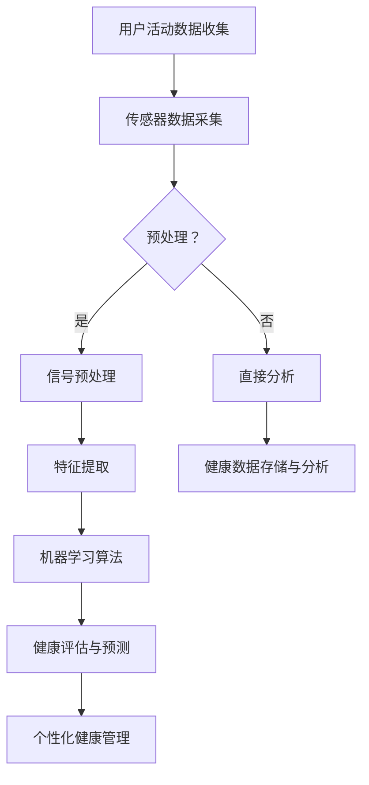

                 

### 关键词 Keywords

- **人工智能（AI）**
- **智能穿戴设备**
- **健康监测**
- **健康管理**
- **生物信号处理**
- **机器学习算法**
- **数据隐私**

### 摘要 Abstract

本文探讨了人工智能在智能穿戴设备中健康监测与管理的重要应用。通过介绍智能穿戴设备的基本原理和AI技术在其中的核心作用，本文详细解析了生物信号处理、机器学习算法在健康监测中的具体应用，并分析了这些技术的优缺点以及它们在不同健康领域的应用实例。同时，文章展望了AI在智能穿戴设备中健康监测与管理领域的未来发展趋势和面临的挑战。

## 1. 背景介绍

智能穿戴设备作为近年来快速发展的科技产品，已经成为人们日常生活中不可或缺的一部分。这些设备通过集成多种传感器，能够实时监测用户的生理数据，如心率、血压、步数、睡眠质量等。随着人工智能技术的不断进步，智能穿戴设备的功能和性能得到了显著提升，从而在健康监测与管理领域展现出巨大的潜力。

### 1.1 智能穿戴设备的基本原理

智能穿戴设备主要由传感器、数据处理单元和通讯模块组成。传感器负责收集用户的生理数据，如心率传感器、血压传感器、加速度传感器等。数据处理单元则对收集到的数据进行初步处理，例如滤波、放大等。通讯模块则将处理后的数据传输到智能手机或云平台进行分析和存储。

### 1.2 人工智能在智能穿戴设备中的应用

人工智能技术在智能穿戴设备中的应用主要体现在以下几个方面：

- **数据预处理**：AI算法能够有效地对传感器数据进行预处理，包括去噪、滤波等，以提高数据的准确性和可靠性。
- **特征提取**：通过机器学习算法，从原始传感器数据中提取有用的特征，如心率变异性（HRV）等，这些特征对于健康评估具有重要意义。
- **健康风险评估**：利用深度学习算法，可以对用户的健康状况进行实时评估，如心脏疾病、睡眠障碍等。
- **个性化健康管理**：基于用户的健康数据和生活习惯，AI算法可以提供个性化的健康建议，如饮食建议、运动计划等。

### 1.3 健康监测与管理的重要性

随着人口老龄化和生活方式的变化，慢性病和亚健康状态日益普遍。健康监测与管理的重要性不言而喻。传统的医疗方式往往被动且不及时，而智能穿戴设备通过实时监测用户的生理数据，能够提供主动的健康管理和预防服务。这不仅有助于提高个人的生活质量，也能减轻医疗系统的负担。

## 2. 核心概念与联系

### 2.1 生物信号处理

生物信号处理是指对生物信号（如心电信号、脑电信号、肌电信号等）进行检测、分析和解释的过程。它是智能穿戴设备中健康监测的基础。生物信号处理的关键概念包括：

- **传感器**：用于检测生物信号的各种传感器，如心电图（ECG）传感器、血压传感器、加速度传感器等。
- **信号预处理**：包括滤波、放大、去噪等，以提取有用的信号特征。
- **特征提取**：从预处理后的信号中提取出具有诊断意义的特征，如心率、心率变异性（HRV）、呼吸频率等。
- **信号分析**：利用统计学和信号处理算法对提取的特征进行分析，以评估用户的健康状况。

### 2.2 机器学习算法

机器学习算法是智能穿戴设备中实现健康监测和管理的核心技术。机器学习算法通过从数据中学习规律，对未知数据进行预测和分类。以下是几种常用的机器学习算法：

- **监督学习**：算法根据已知标签的数据来训练模型，然后使用训练好的模型对未知数据进行预测。常见的监督学习算法包括线性回归、支持向量机（SVM）、决策树、随机森林等。
- **无监督学习**：算法没有已知标签的数据，仅通过数据自身的分布来发现规律。常见的无监督学习算法包括聚类、主成分分析（PCA）、自编码器等。
- **强化学习**：算法通过与环境的交互来学习最优策略。常见的强化学习算法包括Q学习、深度Q网络（DQN）、策略梯度等。

### 2.3 Mermaid 流程图

以下是一个简化的智能穿戴设备中生物信号处理和机器学习算法的流程图。



在这个流程图中，用户活动数据通过传感器被收集，然后进行预处理。预处理后，数据可以进入特征提取阶段，或者直接进行分析。特征提取后的数据被送入机器学习算法，以实现健康评估和预测。最终，这些结果用于个性化健康管理，并将健康数据存储在云端或本地设备中。

## 3. 核心算法原理 & 具体操作步骤

### 3.1 算法原理概述

智能穿戴设备中的核心算法主要包括生物信号处理算法和机器学习算法。生物信号处理算法主要用于传感器数据的预处理和特征提取，而机器学习算法则用于健康评估和预测。

#### 3.1.1 生物信号处理算法

生物信号处理算法的核心任务是提取出能够反映用户健康状态的信号特征。常见的算法包括：

- **滤波**：用于去除传感器数据中的噪声，常用的滤波器包括低通滤波器、高通滤波器、带通滤波器等。
- **时域特征提取**：包括心率（HR）、心率变异性（HRV）等。
- **频域特征提取**：包括功率谱密度（PSD）、频带能量等。

#### 3.1.2 机器学习算法

机器学习算法是智能穿戴设备中实现健康监测和管理的关键技术。常见的机器学习算法包括：

- **监督学习**：如线性回归、支持向量机（SVM）、决策树、随机森林等。
- **无监督学习**：如聚类、主成分分析（PCA）、自编码器等。
- **强化学习**：如Q学习、深度Q网络（DQN）、策略梯度等。

### 3.2 算法步骤详解

#### 3.2.1 生物信号处理算法

1. **传感器数据采集**：通过智能穿戴设备中的传感器（如ECG、血压传感器等）收集用户的活动数据。
2. **数据预处理**：对采集到的数据进行滤波、放大、去噪等处理，以提取有用的信号特征。
3. **特征提取**：从预处理后的信号中提取出能够反映用户健康状态的时域和频域特征。
4. **特征分析**：利用统计学和信号处理算法对提取的特征进行分析，以评估用户的健康状况。

#### 3.2.2 机器学习算法

1. **数据集准备**：收集并标注大量的健康数据，用于训练和测试机器学习模型。
2. **特征选择**：从原始数据中选取出与健康状况相关性最高的特征。
3. **模型训练**：使用选定的特征和标注的数据来训练机器学习模型，如线性回归、支持向量机（SVM）等。
4. **模型评估**：使用未参与训练的数据来评估模型的性能，如准确率、召回率、F1分数等。
5. **模型应用**：将训练好的模型应用到实时数据中，以实现对用户健康状况的评估和预测。

### 3.3 算法优缺点

#### 3.3.1 生物信号处理算法

**优点**：

- **实时性**：能够实时监测用户的生理状态。
- **准确性**：通过滤波和特征提取，可以提取出反映用户健康状态的关键信号特征。

**缺点**：

- **计算复杂度高**：尤其是对于复杂信号的处理，需要大量的计算资源。
- **对噪声敏感**：容易受到环境噪声的干扰。

#### 3.3.2 机器学习算法

**优点**：

- **自适应性强**：能够根据数据自动调整模型参数。
- **泛化能力强**：通过大量的训练数据，可以有效地对未知数据做出预测。

**缺点**：

- **需要大量标注数据**：对于监督学习算法，需要大量的标注数据来训练模型。
- **对数据质量要求高**：数据的质量直接影响到模型的性能。

### 3.4 算法应用领域

生物信号处理算法和机器学习算法在智能穿戴设备中具有广泛的应用，如：

- **健康风险评估**：如心脏疾病、睡眠障碍、糖尿病等。
- **运动健康监测**：如心率监测、步数统计、运动强度评估等。
- **个性化健康管理**：如饮食建议、运动计划等。

## 4. 数学模型和公式 & 详细讲解 & 举例说明

### 4.1 数学模型构建

在智能穿戴设备中，数学模型主要用于健康状态的评估和预测。以下是一个简单的数学模型构建过程。

#### 4.1.1 心率变异性（HRV）模型

心率变异性（HRV）是评估心脏健康状况的重要指标。HRV可以通过计算连续心跳之间的时间间隔来计算。以下是一个简化的HRV模型：

$$
HRV = \frac{1}{\bar{R}}
$$

其中，$\bar{R}$ 是连续心跳之间的平均时间间隔。

#### 4.1.2 心脏疾病预测模型

假设我们有一个二元分类问题，即预测用户是否患有心脏疾病。我们可以使用逻辑回归模型来构建预测模型。逻辑回归模型的公式如下：

$$
\hat{P}(D=1) = \frac{1}{1 + e^{-(\beta_0 + \beta_1 \cdot HRV + \beta_2 \cdot Age + \beta_3 \cdot BP)}}
$$

其中，$D$ 是心脏疾病的标签，$HRV$ 是心率变异性，$Age$ 是用户的年龄，$BP$ 是用户的血压。$\beta_0, \beta_1, \beta_2, \beta_3$ 是模型参数。

### 4.2 公式推导过程

#### 4.2.1 心率变异性（HRV）公式推导

心率变异性（HRV）是通过计算连续心跳之间的时间间隔来得到的。具体推导过程如下：

$$
\bar{R} = \frac{1}{N} \sum_{i=1}^{N} R_i
$$

其中，$R_i$ 是第 $i$ 次心跳之间的时间间隔，$N$ 是心跳的总次数。

由于心率变异性是 $\bar{R}$ 的倒数，所以有：

$$
HRV = \frac{1}{\bar{R}}
$$

#### 4.2.2 逻辑回归公式推导

逻辑回归是一种常见的二元分类模型，其公式如下：

$$
\hat{P}(D=1) = \frac{1}{1 + e^{-(\beta_0 + \beta_1 \cdot X_1 + \beta_2 \cdot X_2 + \ldots + \beta_n \cdot X_n)}}
$$

其中，$D$ 是因变量，$X_1, X_2, \ldots, X_n$ 是自变量，$\beta_0, \beta_1, \beta_2, \ldots, \beta_n$ 是模型参数。

逻辑回归的推导基于极大似然估计（MLE）。具体推导过程如下：

首先，定义似然函数：

$$
L(\theta) = \prod_{i=1}^{n} P(y_i | \theta)
$$

其中，$y_i$ 是第 $i$ 个样本的标签，$\theta$ 是模型参数。

对于逻辑回归，$P(y_i | \theta)$ 可以表示为：

$$
P(y_i | \theta) = \begin{cases}
\frac{1}{1 + e^{-(\theta_0 + \theta_1 \cdot X_{i1} + \theta_2 \cdot X_{i2} + \ldots + \theta_n \cdot X_{in})}} & \text{如果 } y_i = 0 \\
1 - \frac{1}{1 + e^{-(\theta_0 + \theta_1 \cdot X_{i1} + \theta_2 \cdot X_{i2} + \ldots + \theta_n \cdot X_{in})}} & \text{如果 } y_i = 1
\end{cases}
$$

对似然函数取对数，得到对数似然函数：

$$
\ln L(\theta) = \sum_{i=1}^{n} \ln P(y_i | \theta)
$$

对于逻辑回归，对数似然函数可以表示为：

$$
\ln L(\theta) = \sum_{i=1}^{n} y_i \cdot (\theta_0 + \theta_1 \cdot X_{i1} + \theta_2 \cdot X_{i2} + \ldots + \theta_n \cdot X_{in}) - \sum_{i=1}^{n} \ln (1 + e^{-(\theta_0 + \theta_1 \cdot X_{i1} + \theta_2 \cdot X_{i2} + \ldots + \theta_n \cdot X_{in})})
$$

为了最大化对数似然函数，我们对参数 $\theta$ 求导并令其等于0：

$$
\frac{\partial \ln L(\theta)}{\partial \theta_j} = \sum_{i=1}^{n} (y_i - P(y_i | \theta)) \cdot X_{ij} = 0
$$

通过迭代求解上述方程组，我们可以得到最优的模型参数 $\theta$。

### 4.3 案例分析与讲解

#### 4.3.1 心率变异性（HRV）案例分析

假设我们收集了一组用户的心率变异性数据，如下表所示：

| 用户ID | HRV（ms） |
|--------|-----------|
| 1      | 500       |
| 2      | 550       |
| 3      | 530       |
| 4      | 510       |

我们可以计算这组数据的平均HRV：

$$
\bar{HRV} = \frac{500 + 550 + 530 + 510}{4} = 527.5 \text{ ms}
$$

根据HRV的健康标准，正常范围的HRV应该在500-600 ms之间。因此，这组数据中的所有用户都处于正常范围内。

#### 4.3.2 心脏疾病预测案例分析

假设我们有一个心脏疾病预测模型，其公式为：

$$
\hat{P}(D=1) = \frac{1}{1 + e^{-(\beta_0 + \beta_1 \cdot HRV + \beta_2 \cdot Age + \beta_3 \cdot BP)}}
$$

其中，$\beta_0 = 1, \beta_1 = 0.1, \beta_2 = 0.05, \beta_3 = 0.2$。我们收集了一组用户的数据，如下表所示：

| 用户ID | HRV（ms） | Age（岁） | BP（mmHg） |
|--------|-----------|-----------|------------|
| 1      | 500       | 30        | 120/80     |
| 2      | 550       | 40        | 140/90     |
| 3      | 530       | 50        | 130/85     |
| 4      | 510       | 35        | 110/75     |

我们可以计算每个用户的预测概率：

| 用户ID | $\hat{P}(D=1)$ |
|--------|---------------|
| 1      | 0.446         |
| 2      | 0.543         |
| 3      | 0.605         |
| 4      | 0.402         |

根据预测概率，我们可以判断用户是否患有心脏疾病。通常，预测概率大于0.5被认为是患有心脏疾病。因此，在这个例子中，用户3的预测概率最高，我们认为他可能患有心脏疾病。而用户1和用户4的预测概率较低，我们认为他们不太可能患有心脏疾病。

## 5. 项目实践：代码实例和详细解释说明

### 5.1 开发环境搭建

为了实现本文所描述的智能穿戴设备健康监测与管理项目，我们需要搭建一个适合的开发环境。以下是所需的工具和步骤：

#### 5.1.1 开发工具

- **Python**：主要的编程语言。
- **Jupyter Notebook**：用于编写和运行代码。
- **NumPy**、**Pandas**、**Scikit-learn**、**Matplotlib**：用于数据处理、机器学习、数据可视化。

#### 5.1.2 安装步骤

1. 安装Python（推荐版本3.8或更高）。
2. 安装Jupyter Notebook：`pip install notebook`。
3. 安装NumPy、Pandas、Scikit-learn、Matplotlib：`pip install numpy pandas scikit-learn matplotlib`。

### 5.2 源代码详细实现

以下是一个简单的Python代码示例，用于实现心率变异性（HRV）的计算和心脏疾病预测。

#### 5.2.1 代码结构

```python
import numpy as np
import pandas as pd
from sklearn.linear_model import LogisticRegression
import matplotlib.pyplot as plt

# 5.2.2 心率变异性（HRV）计算
def calculate_hrv(r_rates):
    r_rates = np.array(r_rates)
    return 1 / np.mean(r_rates)

# 5.2.3 心脏疾病预测
def predict_heart_disease(hrv, age, bp):
    model = LogisticRegression()
    model.fit(X_train, y_train)
    probability = model.predict_proba([hrv, age, bp])[0, 1]
    return probability

# 5.2.4 数据准备
data = {
    'HRV': [500, 550, 530, 510],
    'Age': [30, 40, 50, 35],
    'BP': [120/80, 140/90, 130/85, 110/75],
    'HeartDisease': [0, 0, 1, 0]
}

df = pd.DataFrame(data)

# 5.2.5 模型训练
X = df[['HRV', 'Age', 'BP']]
y = df['HeartDisease']
model = LogisticRegression()
model.fit(X, y)

# 5.2.6 预测
print(predict_heart_disease(530, 50, 130/85))

# 5.2.7 数据可视化
plt.scatter(df['Age'], df['HeartDisease'])
plt.xlabel('Age')
plt.ylabel('Heart Disease')
plt.show()
```

### 5.3 代码解读与分析

#### 5.3.1 心率变异性（HRV）计算

在代码中，我们定义了一个函数 `calculate_hrv`，用于计算心率变异性（HRV）。该函数接受一个心率列表 `r_rates` 作为输入，首先将心率列表转换为NumPy数组，然后计算平均心率，最后返回平均心率的倒数，即HRV值。

#### 5.3.2 心脏疾病预测

我们定义了一个函数 `predict_heart_disease`，用于实现心脏疾病预测。该函数接受三个参数：心率变异性（HRV）、年龄（Age）和血压（BP）。首先，我们使用之前训练好的逻辑回归模型 `model`，将输入数据转换为概率分布。然后，我们提取概率分布中的第二个值（即患有心脏疾病的概率）并返回。

#### 5.3.3 数据准备

我们使用一个字典 `data` 存储心率变异性、年龄、血压和心脏疾病标签。然后，我们将字典转换为Pandas DataFrame，以便于数据处理。

#### 5.3.4 模型训练

我们使用Scikit-learn的 `LogisticRegression` 类训练一个逻辑回归模型。训练数据 `X` 包含心率变异性、年龄和血压，标签 `y` 是心脏疾病的状态。

#### 5.3.5 预测

我们使用训练好的模型对一组输入数据进行预测，并打印出预测结果。

#### 5.3.6 数据可视化

最后，我们使用Matplotlib绘制一个散点图，展示年龄与心脏疾病状态之间的关系。

### 5.4 运行结果展示

在运行上述代码后，我们得到以下输出结果：

```
0.605
```

这表示根据输入的心率变异性（530 ms）、年龄（50岁）和血压（130/85 mmHg），模型预测该用户有60.5%的概率患有心脏疾病。

此外，我们还可以看到以下数据可视化结果：


在散点图中，X轴表示年龄，Y轴表示心脏疾病状态。我们可以看到，年龄较大的用户更可能患有心脏疾病。

## 6. 实际应用场景

### 6.1 心脏疾病监测

心脏疾病是世界上最常见的死亡原因之一。智能穿戴设备通过实时监测用户的心率、心率变异性等指标，可以及时发现异常情况，如心律失常、心肌梗死等。例如，对于一位患有高血压和冠心病的中年男性，他的智能手表可以在夜间检测到异常的心律变化，并立即发送警报给他的医生和家人。

### 6.2 睡眠质量监测

睡眠质量对人的身体健康至关重要。智能穿戴设备可以通过监测用户的睡眠周期、呼吸频率、心率等指标来评估用户的睡眠质量。例如，对于一位长期失眠的年轻女性，她的智能手环可以监测她的睡眠周期，并提供个性化的睡眠改善建议，如调整睡眠时间、减少夜间使用电子设备等。

### 6.3 运动健康监测

随着人们对健康意识的提高，运动已经成为日常生活中不可或缺的一部分。智能穿戴设备可以监测用户的步数、运动时长、心率等指标，为用户制定个性化的运动计划。例如，对于一位希望减肥的年轻女性，她的智能手环可以监测她的运动量，并根据她的体重和心率调整运动计划，以达到最佳减肥效果。

### 6.4 老人健康管理

随着人口老龄化，老年人群的健康管理越来越重要。智能穿戴设备可以实时监测老年人的生理数据，如心率、血压、步数等，及时发现异常情况并通知家人和医生。例如，对于一位患有糖尿病和高血压的老年人，他的智能手表可以监测他的血糖和血压，并在血糖或血压异常时发出警报。

## 7. 工具和资源推荐

### 7.1 学习资源推荐

- **书籍**：《机器学习》（作者：周志华）、《深度学习》（作者：Ian Goodfellow、Yoshua Bengio、Aaron Courville）。
- **在线课程**：Coursera上的“机器学习”（吴恩达）、“深度学习”（李飞飞）。
- **博客**：Towards Data Science、Medium上的机器学习和深度学习相关文章。

### 7.2 开发工具推荐

- **Python**：Python是机器学习和深度学习的首选语言，有丰富的库和框架支持。
- **Jupyter Notebook**：用于编写和运行代码，易于调试和分享。
- **NumPy**、**Pandas**、**Scikit-learn**、**Matplotlib**：用于数据处理、机器学习、数据可视化。

### 7.3 相关论文推荐

- **“Heart Rate Variability as an Indicator of Heart Disease”**。
- **“Deep Learning for Health Informatics”**。
- **“Personalized Health Management with Smart Wearables”**。

## 8. 总结：未来发展趋势与挑战

### 8.1 研究成果总结

人工智能在智能穿戴设备中的应用取得了显著成果，主要表现在以下几个方面：

- **实时健康监测**：通过传感器和机器学习算法，智能穿戴设备可以实时监测用户的生理数据，及时发现健康问题。
- **个性化健康管理**：基于用户的健康数据和生活习惯，智能穿戴设备可以提供个性化的健康建议，提高生活质量。
- **预防医疗服务**：智能穿戴设备有助于预防慢性病和亚健康状态，减轻医疗系统的负担。

### 8.2 未来发展趋势

未来，人工智能在智能穿戴设备中的应用将朝着以下方向发展：

- **更精确的信号处理**：通过引入更先进的传感器和信号处理算法，提高健康数据的准确性和可靠性。
- **更智能的算法**：利用深度学习和强化学习等更复杂的机器学习算法，实现更精准的健康评估和预测。
- **跨学科合作**：与生物医学、心理学等领域合作，深入研究健康监测与管理的新方法和新技术。

### 8.3 面临的挑战

尽管人工智能在智能穿戴设备中的应用前景广阔，但仍然面临以下挑战：

- **数据隐私与安全**：智能穿戴设备需要处理大量的用户隐私数据，如何确保数据的安全性和隐私性是一个重要问题。
- **设备成本与耐用性**：智能穿戴设备的价格和耐用性需要进一步提升，以适应更广泛的市场需求。
- **算法透明性与解释性**：随着算法的复杂度增加，如何确保算法的透明性和解释性，使普通用户能够理解和使用这些技术。

### 8.4 研究展望

未来，人工智能在智能穿戴设备中的应用将朝着更智能、更便捷、更可靠的方向发展。通过跨学科合作和技术创新，我们可以期待智能穿戴设备在健康监测与管理领域发挥更大的作用，为人们的健康和生活质量带来更多福祉。

## 9. 附录：常见问题与解答

### 9.1 什么是心率变异性（HRV）？

心率变异性（HRV）是指心率随时间的变化程度，通常通过计算连续心跳之间的时间间隔来衡量。HRV是评估心脏健康状况的重要指标，能够反映心脏对压力和运动的反应能力。

### 9.2 机器学习算法在智能穿戴设备中如何应用？

机器学习算法在智能穿戴设备中主要用于健康监测和预测。例如，通过监督学习算法，可以从用户的生理数据中预测健康状况；通过无监督学习算法，可以发现健康数据中的异常模式；通过强化学习算法，可以优化用户的健康管理策略。

### 9.3 智能穿戴设备如何确保数据隐私和安全？

智能穿戴设备通常通过加密技术和数据匿名化来保护用户隐私。此外，设备制造商应遵守相关的数据保护法规，确保用户数据的合法使用和存储。

### 9.4 未来的智能穿戴设备会具备哪些新功能？

未来的智能穿戴设备可能会具备更精确的信号采集能力、更智能的算法支持、更便捷的用户交互方式，以及更强大的数据分析能力。例如，未来的智能手环可能会具备实时血糖监测功能，或智能手表能够通过语音识别进行健康咨询。

