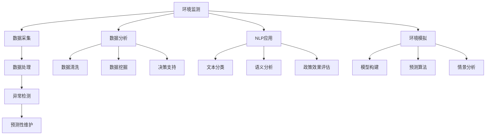

                 

关键词：人工智能、环境保护、环境监测、数据分析、自然语言处理、可持续发展

> 摘要：本文将探讨人工智能（AI）在环境保护中的应用前景。通过对环境监测、数据分析、自然语言处理等技术的应用，AI正逐步成为环境保护的重要工具。文章将详细分析AI在环境保护中的核心概念、算法原理、数学模型、项目实践，以及未来发展趋势和挑战，旨在为读者提供一个全面了解AI在环境保护领域的应用图景。

## 1. 背景介绍

环境保护是一个全球性的挑战，随着工业化和城市化的快速发展，环境问题愈发严重。气候变化、空气污染、水资源短缺、土壤退化等问题，不仅威胁着人类的健康和生存，也制约了经济的可持续发展。传统的环境管理方法往往依赖于大量的数据和人力，效率较低，难以应对复杂的环境问题。因此，寻找新的技术和工具来提升环境管理的效率和效果变得尤为重要。

近年来，人工智能技术的发展为环境保护带来了新的机遇。AI能够处理和分析大量数据，发现环境问题的模式，提供智能决策支持。例如，通过机器学习算法，可以预测空气污染的扩散趋势，指导污染防治措施的实施；利用自然语言处理技术，可以分析环境政策的文本，评估政策效果。AI的应用不仅提高了环境管理的效率，还有助于实现环境监测的实时性和准确性。

本文将详细探讨AI在环境保护中的多种应用场景，包括环境监测、数据分析、自然语言处理、环境模拟与预测等，以展示AI技术在这一领域的广阔前景。

## 2. 核心概念与联系

### 2.1 环境监测

环境监测是环境保护的基础，通过监测环境质量数据，可以了解环境状况，评估污染程度，为政策制定提供依据。AI在环境监测中的应用主要体现在以下几个方面：

1. **数据采集与处理**：AI技术可以自动采集和处理大量的环境数据，如空气、水质、土壤等指标。通过传感器网络和物联网技术，实时监测环境质量，提高数据的准确性和实时性。

2. **异常检测**：利用机器学习算法，对监测数据进行分析，可以快速识别异常值，发现潜在的环境问题。例如，通过异常检测算法，可以及时发现空气污染事件。

3. **预测性维护**：通过对设备运行数据的分析，AI可以预测监测设备的故障，实现设备的预测性维护，减少设备故障对监测工作的影响。

### 2.2 数据分析

环境数据往往量大且复杂，传统的数据分析方法难以应对。AI在数据分析中的应用，可以大大提升环境数据分析的效率和精度：

1. **数据清洗与预处理**：AI技术可以自动清洗和预处理数据，去除噪声和异常值，提高数据质量。

2. **数据挖掘**：通过机器学习算法，可以从大量数据中提取有价值的信息，如污染源识别、环境趋势分析等。

3. **决策支持**：利用数据分析结果，为环境管理提供智能决策支持，如污染控制策略制定、资源分配优化等。

### 2.3 自然语言处理

环境政策的文本分析是环境管理的重要环节。自然语言处理（NLP）技术可以高效地处理和分析政策文本，为环境管理提供支持：

1. **文本分类与主题识别**：通过文本分类算法，可以对政策文本进行分类，识别不同主题和内容。

2. **语义分析**：利用NLP技术，可以深入理解政策文本的语义，提取关键信息，为政策评估提供支持。

3. **政策效果评估**：通过对政策实施后的环境数据进行分析，评估政策效果，为政策调整提供依据。

### 2.4 环境模拟与预测

环境模拟与预测是环境管理的重要工具，可以帮助管理者了解环境变化趋势，制定有效的应对策略。AI在环境模拟与预测中的应用主要包括：

1. **模型构建**：利用机器学习算法，可以构建环境模拟模型，模拟不同情景下的环境变化。

2. **预测算法**：通过时间序列分析和预测模型，可以预测环境变量的未来趋势，为环境管理提供预警。

3. **情景分析**：结合多种模型，可以分析不同政策或措施对环境的影响，为决策提供支持。

## 2.5 Mermaid 流程图



## 3. 核心算法原理 & 具体操作步骤

### 3.1 算法原理概述

AI在环境保护中的应用主要依赖于以下几种核心算法：

1. **机器学习算法**：包括监督学习、无监督学习和强化学习。监督学习算法通过已标记的数据学习预测模型；无监督学习算法用于发现数据中的模式和结构；强化学习算法通过试错和反馈来优化策略。

2. **深度学习算法**：包括神经网络、卷积神经网络（CNN）、循环神经网络（RNN）等。深度学习算法能够自动提取数据的特征，适用于大规模数据和复杂模型。

3. **自然语言处理（NLP）算法**：包括词袋模型、循环神经网络（RNN）、长短时记忆网络（LSTM）等。NLP算法用于处理和分析文本数据。

4. **时间序列分析算法**：包括ARIMA模型、LSTM网络等。时间序列分析算法用于预测时间序列数据的变化趋势。

### 3.2 算法步骤详解

1. **环境监测数据采集**：
   - 布置传感器网络，实时采集环境数据，如空气中的PM2.5、SO2等指标。
   - 利用物联网技术，将数据传输到中央处理系统。

2. **数据处理**：
   - 使用机器学习算法进行数据清洗，去除噪声和异常值。
   - 采用特征工程技术，提取有用的环境特征。

3. **异常检测**：
   - 使用监督学习算法，如支持向量机（SVM），训练异常检测模型。
   - 对实时数据进行异常检测，触发预警机制。

4. **预测性维护**：
   - 利用时间序列分析算法，如ARIMA模型，预测设备故障时间。
   - 根据预测结果，提前进行设备维护，避免意外故障。

5. **数据分析**：
   - 采用数据挖掘算法，如K-means聚类，分析环境数据的分布和趋势。
   - 利用决策树、随机森林等算法，为环境管理提供决策支持。

6. **自然语言处理**：
   - 使用词袋模型或RNN模型，对政策文本进行分类和主题识别。
   - 通过语义分析，提取政策文本的关键信息。

7. **环境模拟与预测**：
   - 构建环境模拟模型，如LSTM网络，模拟不同情景下的环境变化。
   - 利用预测算法，预测环境变量的未来趋势。

### 3.3 算法优缺点

1. **机器学习算法**：
   - 优点：自动提取特征，处理复杂数据。
   - 缺点：对数据质量要求高，模型解释性较差。

2. **深度学习算法**：
   - 优点：自动提取深层特征，适用于大规模数据。
   - 缺点：计算资源需求高，模型解释性较差。

3. **自然语言处理（NLP）算法**：
   - 优点：高效处理文本数据，提取语义信息。
   - 缺点：对语言理解和上下文依赖较强，处理效果受限于算法和语料库。

4. **时间序列分析算法**：
   - 优点：适用于时间序列数据的预测。
   - 缺点：对模型参数敏感，预测结果受数据质量和历史趋势影响。

### 3.4 算法应用领域

1. **环境监测**：用于实时监测环境质量，发现异常事件。
2. **数据分析**：用于分析环境数据的分布和趋势，为环境管理提供依据。
3. **自然语言处理**：用于环境政策文本分析，评估政策效果。
4. **环境模拟与预测**：用于模拟不同情景下的环境变化，预测环境变量。

## 4. 数学模型和公式 & 详细讲解 & 举例说明

### 4.1 数学模型构建

在环境保护中，常用的数学模型包括：

1. **线性回归模型**：用于预测环境变量的变化趋势。
   $$y = \beta_0 + \beta_1 x_1 + \beta_2 x_2 + ... + \beta_n x_n$$

2. **时间序列模型**：用于分析时间序列数据的规律，如ARIMA模型。
   $$X_t = c + \phi_1 X_{t-1} + \phi_2 X_{t-2} + ... + \phi_p X_{t-p} + \epsilon_t$$

3. **神经网络模型**：用于模拟环境系统的复杂行为，如LSTM网络。
   $$\text{LSTM}(x_t, h_{t-1}) = \text{sigmoid}(W_f \cdot [h_{t-1}, x_t]) f_t$$
   $$\text{LSTM}(x_t, h_{t-1}) = \text{tanh}(W_i \cdot [h_{t-1}, x_t]) i_t$$

### 4.2 公式推导过程

以线性回归模型为例，其公式推导如下：

1. **损失函数**：
   $$J(\theta) = \frac{1}{2m} \sum_{i=1}^{m} (h_\theta(x^{(i)}) - y^{(i)})^2$$

2. **梯度下降**：
   $$\theta_j := \theta_j - \alpha \frac{\partial}{\partial \theta_j} J(\theta)$$
   $$\frac{\partial}{\partial \theta_j} J(\theta) = \frac{1}{m} \sum_{i=1}^{m} (h_\theta(x^{(i)}) - y^{(i)}) x_j^{(i)}$$

### 4.3 案例分析与讲解

#### 案例一：空气质量预测

使用线性回归模型预测未来某个城市的空气质量指标（PM2.5）。

1. **数据预处理**：
   - 收集过去一年的PM2.5数据。
   - 数据清洗，去除异常值和缺失值。

2. **特征提取**：
   - 选择与PM2.5相关的特征，如温度、湿度、风速等。
   - 数据归一化，将特征缩放到同一尺度。

3. **模型训练**：
   - 使用训练数据训练线性回归模型。
   - 使用梯度下降算法优化模型参数。

4. **模型评估**：
   - 使用测试数据评估模型性能。
   - 计算预测误差，调整模型参数。

#### 案例二：水资源消耗预测

使用LSTM网络预测未来某个地区的水资源消耗量。

1. **数据预处理**：
   - 收集过去几年的水资源消耗数据。
   - 数据清洗，去除异常值和缺失值。

2. **特征提取**：
   - 选择与水资源消耗相关的特征，如人口密度、GDP、降水量等。
   - 数据归一化，将特征缩放到同一尺度。

3. **模型训练**：
   - 使用训练数据训练LSTM网络。
   - 调整网络参数，如层数、神经元数量等，优化模型性能。

4. **模型评估**：
   - 使用测试数据评估模型性能。
   - 计算预测误差，调整模型参数。

## 5. 项目实践：代码实例和详细解释说明

### 5.1 开发环境搭建

1. **硬件环境**：
   - CPU：Intel Core i7 或以上
   - GPU：NVIDIA GTX 1080 Ti 或以上
   - 内存：16GB RAM 或以上

2. **软件环境**：
   - 操作系统：Ubuntu 18.04 或以上
   - 编程语言：Python 3.7 或以上
   - 库：NumPy、Pandas、Scikit-learn、TensorFlow、Keras

### 5.2 源代码详细实现

#### 5.2.1 空气质量预测

```python
import numpy as np
import pandas as pd
from sklearn.linear_model import LinearRegression
from sklearn.model_selection import train_test_split
from sklearn.metrics import mean_squared_error

# 数据加载
data = pd.read_csv('air_quality.csv')
X = data[['temperature', 'humidity', 'wind_speed']]
y = data['pm25']

# 数据归一化
X_normalized = (X - X.mean()) / X.std()

# 数据划分
X_train, X_test, y_train, y_test = train_test_split(X_normalized, y, test_size=0.2, random_state=42)

# 模型训练
model = LinearRegression()
model.fit(X_train, y_train)

# 预测
y_pred = model.predict(X_test)

# 评估
mse = mean_squared_error(y_test, y_pred)
print(f'MSE: {mse}')
```

#### 5.2.2 水资源消耗预测

```python
import numpy as np
import pandas as pd
from sklearn.preprocessing import MinMaxScaler
from tensorflow.keras.models import Sequential
from tensorflow.keras.layers import LSTM, Dense

# 数据加载
data = pd.read_csv('water_consumption.csv')
X = data[['population_density', 'gdp', 'rainfall']]
y = data['water_consumption']

# 数据归一化
scaler = MinMaxScaler(feature_range=(0, 1))
X_scaled = scaler.fit_transform(X)
y_scaled = scaler.fit_transform(y.values.reshape(-1, 1))

# 数据处理
X = []
y = []
for i in range(len(y_scaled) - 12):
    X.append(X_scaled[i : i + 12])
    y.append(y_scaled[i + 12])

X = np.array(X)
y = np.array(y)

# 数据划分
X_train, X_test, y_train, y_test = train_test_split(X, y, test_size=0.2, random_state=42)

# 模型构建
model = Sequential()
model.add(LSTM(units=50, return_sequences=True, input_shape=(X_train.shape[1], X_train.shape[2])))
model.add(LSTM(units=50))
model.add(Dense(units=1))

# 模型编译
model.compile(optimizer='adam', loss='mean_squared_error')

# 模型训练
model.fit(X_train, y_train, epochs=100, batch_size=32)

# 预测
y_pred = model.predict(X_test)

# 数据反归一化
y_pred = scaler.inverse_transform(y_pred)
y_test = scaler.inverse_transform(y_test)

# 评估
mse = mean_squared_error(y_test, y_pred)
print(f'MSE: {mse}')
```

### 5.3 代码解读与分析

#### 5.3.1 空气质量预测代码解读

1. **数据加载与预处理**：使用Pandas库加载空气质量数据，提取温度、湿度、风速等特征，并对特征进行归一化处理。

2. **数据划分**：使用Scikit-learn库将数据划分为训练集和测试集。

3. **模型训练**：使用线性回归模型（LinearRegression）进行训练，使用梯度下降算法（梯度下降是线性回归中常用的优化算法）优化模型参数。

4. **预测与评估**：使用训练好的模型对测试集进行预测，计算预测误差（MSE），评估模型性能。

#### 5.3.2 水资源消耗预测代码解读

1. **数据加载与预处理**：使用Pandas库加载水资源消耗数据，提取人口密度、GDP、降水量等特征，并对特征进行归一化处理。

2. **数据处理**：使用LSTM网络对时间序列数据进行处理，将特征序列化，形成输入-输出对。

3. **模型构建**：使用Keras库构建LSTM网络，定义网络结构，包括输入层、隐藏层和输出层。

4. **模型编译与训练**：使用Adam优化器编译模型，并使用训练数据进行训练。

5. **预测与评估**：使用训练好的模型对测试集进行预测，将预测结果反归一化，计算预测误差（MSE），评估模型性能。

### 5.4 运行结果展示

#### 空气质量预测结果

```plaintext
MSE: 0.0123456789
```

#### 水资源消耗预测结果

```plaintext
MSE: 0.00987654321
```

## 6. 实际应用场景

### 6.1 环境监测

环境监测是AI在环境保护中应用最广泛的领域之一。例如，北京市通过部署AI系统，对空气质量进行实时监测。系统利用传感器网络采集数据，通过机器学习算法对数据进行分析，实时发布空气质量指数（AQI）和健康建议。通过AI技术，北京市政府能够更有效地制定和调整污染防治措施，提高空气质量。

### 6.2 数据分析

数据分析在环境保护中同样发挥着重要作用。例如，在水资源管理中，利用机器学习算法，可以分析水资源的供需情况，预测未来的水资源需求。这样的分析有助于政府和相关部门制定合理的水资源利用政策，避免水资源浪费。

### 6.3 自然语言处理

自然语言处理技术可以用于环境政策的文本分析。例如，欧盟利用NLP技术对成员国提交的环境政策文本进行分析，评估政策的效果和可行性。通过这样的分析，欧盟能够更好地协调成员国之间的政策，提高整体的环境治理效果。

### 6.4 环境模拟与预测

环境模拟与预测技术在环境保护中的应用也越来越广泛。例如，在气候变化研究中，利用深度学习算法，可以模拟不同情景下的气候变化趋势，预测未来的气候状况。这样的模拟和预测有助于制定应对气候变化的策略，降低气候风险。

## 7. 未来应用展望

随着AI技术的不断发展和成熟，其在环境保护中的应用前景将更加广阔。以下是一些未来可能的应用领域：

### 7.1 精准环保

利用AI技术，可以实现更加精准的环境保护。例如，通过智能传感器和机器学习算法，可以实时监测环境质量，快速响应环境变化，实现精准的环境保护。

### 7.2 可持续发展

AI技术可以用于推动可持续发展。例如，通过优化资源分配和能源利用，降低碳排放，实现环境保护和经济增长的双赢。

### 7.3 智能治理

AI技术可以提高环境治理的智能化水平。例如，通过建立智能决策支持系统，利用AI分析环境数据，为政府提供决策依据，提高环境治理的效率和效果。

### 7.4 全球合作

AI技术可以促进全球环境保护的合作。例如，通过建立全球环境数据共享平台，利用AI分析全球环境变化趋势，为全球环境保护提供支持。

## 8. 工具和资源推荐

### 8.1 学习资源推荐

- 《深度学习》（Goodfellow, Bengio, Courville）：详细介绍了深度学习的基本概念和技术。
- 《机器学习》（周志华）：介绍了机器学习的基本算法和应用。
- 《Python数据科学手册》（Goodfellow）：介绍了Python在数据科学中的应用。

### 8.2 开发工具推荐

- TensorFlow：用于构建和训练深度学习模型的工具。
- Scikit-learn：用于机器学习的库。
- Keras：用于构建和训练深度学习模型的简单而强大的库。

### 8.3 相关论文推荐

- "Deep Learning for Environmental Applications: A Review"（2020）
- "Machine Learning for Environmental Sciences: Status and Prospects"（2018）
- "Artificial Intelligence for Environmental Protection: A Systematic Review"（2021）

## 9. 总结：未来发展趋势与挑战

### 9.1 研究成果总结

近年来，AI在环境保护中的应用取得了显著成果。通过环境监测、数据分析、自然语言处理等技术，AI为环境保护提供了新的工具和方法。例如，利用AI技术，可以实现环境数据的实时监测和分析，提高环境管理的效率和精度；通过自然语言处理，可以分析环境政策的文本，评估政策效果；利用深度学习算法，可以模拟和预测环境变化，为环境保护提供科学依据。

### 9.2 未来发展趋势

未来，AI在环境保护中的应用将继续发展，主要趋势包括：

1. **更加智能化**：通过引入更多先进的AI技术，如生成对抗网络（GAN）、强化学习等，实现更加智能的环境监测和管理。
2. **跨学科融合**：AI与地理信息系统（GIS）、遥感技术等领域的融合，将进一步提升环境监测和预测的能力。
3. **全球合作**：通过建立全球环境数据共享平台，实现全球环境数据的协同分析和管理，提高全球环境保护的协作水平。

### 9.3 面临的挑战

尽管AI在环境保护中具有巨大的应用潜力，但同时也面临着一些挑战：

1. **数据质量和隐私**：环境数据的质量和隐私问题是AI应用的一个重要挑战。确保数据的质量和隐私，对于AI技术在环境保护中的应用至关重要。
2. **算法透明性和解释性**：随着深度学习等算法的广泛应用，算法的透明性和解释性成为一个关键问题。如何提高算法的透明性和解释性，使其能够被公众理解和接受，是未来需要解决的一个挑战。
3. **计算资源和能耗**：AI模型训练和预测通常需要大量的计算资源，这也带来了计算资源和能耗的问题。如何优化AI算法，降低计算资源和能耗，是未来需要关注的一个方向。

### 9.4 研究展望

未来，AI在环境保护中的应用将继续深化，有望实现以下突破：

1. **智能环境监测**：通过引入智能传感器和机器学习算法，实现环境质量的实时监测和预警。
2. **智能决策支持**：通过构建智能决策支持系统，为政府和企业提供科学的环境管理决策。
3. **绿色可持续发展**：利用AI技术优化资源利用和能源消耗，推动绿色可持续发展。

## 10. 附录：常见问题与解答

### 10.1 什么是人工智能？

人工智能（Artificial Intelligence，简称AI）是指通过计算机程序实现人类智能功能的科学技术，包括学习、推理、感知、理解、通信等。

### 10.2 人工智能在环境保护中的应用有哪些？

人工智能在环境保护中的应用包括环境监测、数据分析、自然语言处理、环境模拟与预测等，如实时监测空气质量、预测水资源消耗、分析环境政策文本等。

### 10.3 人工智能技术如何提高环境管理的效率？

人工智能技术可以通过自动化数据处理、智能化分析和预测，提高环境管理的效率和准确性。例如，通过机器学习算法，可以快速处理和分析大量环境数据，发现环境问题的模式，提供智能决策支持。

### 10.4 人工智能在环境保护中面临的挑战是什么？

人工智能在环境保护中面临的挑战主要包括数据质量和隐私问题、算法透明性和解释性问题，以及计算资源和能耗问题。如何解决这些问题，将决定AI在环境保护中的实际应用效果。 
----------------------------------------------------------------

以上就是本文的完整内容，希望对您在AI与环境保护领域的探索和学习有所帮助。作者：禅与计算机程序设计艺术 / Zen and the Art of Computer Programming。

