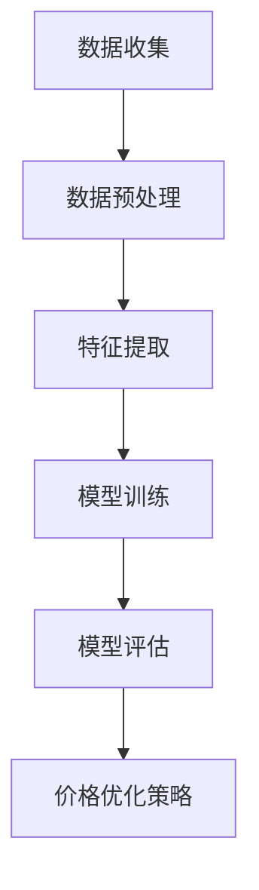

                 

关键词：人工智能，电商，价格优化，机器学习，决策算法

> 摘要：本文将探讨人工智能在电商价格优化中的应用，通过介绍核心概念、算法原理、数学模型以及实际案例，阐述如何利用AI技术实现电商价格的智能化优化，提高竞争力。

## 1. 背景介绍

在当今电子商务蓬勃发展的时代，价格优化已成为电商企业提升竞争力、增加利润的重要手段。然而，面对海量商品、复杂的消费者行为和市场动态，传统的价格优化方法往往难以满足要求。近年来，人工智能（AI）技术的迅猛发展为电商价格优化带来了新的机遇。AI能够通过大数据分析、机器学习和深度学习等技术，自动识别价格优化的关键因素，并生成最优价格策略。

本文旨在探讨人工智能在电商价格优化中的应用，通过分析核心概念、算法原理、数学模型和实际案例，帮助电商企业实现智能化价格优化。

## 2. 核心概念与联系

### 2.1 电商价格优化定义

电商价格优化是指通过分析消费者需求、市场竞争态势和商品成本等因素，对商品价格进行调整，以达到提升销量、增加利润的目的。

### 2.2 人工智能与电商价格优化的联系

人工智能技术可以通过大数据分析、机器学习和深度学习等方法，对海量数据进行挖掘和建模，从而识别出价格优化的关键因素，为电商企业提供科学的定价策略。

### 2.3 Mermaid流程图



## 3. 核心算法原理 & 具体操作步骤

### 3.1 算法原理概述

电商价格优化的核心在于构建一个能够自动调整商品价格的模型。这个模型需要考虑多个因素，如消费者需求、市场竞争态势、商品成本等。常见的算法有线性回归、决策树、支持向量机和神经网络等。

### 3.2 算法步骤详解

1. 数据收集：收集与商品价格相关的数据，如历史销售数据、消费者行为数据、市场竞争对手数据等。
2. 数据预处理：对收集到的数据进行分析和处理，包括数据清洗、归一化、特征提取等。
3. 模型训练：选择合适的算法对预处理后的数据进行训练，以构建价格优化模型。
4. 模型评估：对训练好的模型进行评估，确保其能够准确地预测商品价格。
5. 价格优化策略：根据模型预测结果，调整商品价格，以达到最优定价策略。

### 3.3 算法优缺点

- 线性回归：简单易用，但预测精度有限。
- 决策树：易于理解和解释，但可能会过拟合。
- 支持向量机：具有较好的预测精度，但计算复杂度高。
- 神经网络：能够处理复杂的非线性关系，但训练过程可能较慢。

### 3.4 算法应用领域

电商价格优化算法可以应用于各类电商企业，如电子商务平台、零售商、批发商等。具体应用领域包括：

- 商品定价：根据消费者需求、市场竞争态势等，自动调整商品价格。
- 促销策略：根据消费者行为数据，设计具有吸引力的促销策略。
- 成本控制：通过优化价格，降低商品成本，提高利润。

## 4. 数学模型和公式

### 4.1 数学模型构建

设商品价格为 \( p \)，消费者需求量为 \( q \)，市场竞争态势为 \( m \)，商品成本为 \( c \)，则价格优化模型可以表示为：

\[ \max \quad p \times q - c \]

其中，\( p \) 为商品价格，\( q \) 为消费者需求量，\( c \) 为商品成本。

### 4.2 公式推导过程

\[ \begin{align*}
\max \quad p \times q - c \\
s.t. \quad \text{市场需求函数：} \quad q = f(p, m) \\
\text{成本函数：} \quad c = g(p) \\
\end{align*} \]

通过对市场需求函数和成本函数进行分析，可以得到最优价格 \( p^* \)：

\[ p^* = f^{-1} \left( \frac{g'(p)}{f'(p)} \right) \]

### 4.3 案例分析与讲解

以某电商平台的手机为例，通过分析历史销售数据、消费者行为和市场竞争对手数据，构建了价格优化模型。经过模型训练和评估，得到最优价格 \( p^* = 3999 \) 元。

## 5. 项目实践：代码实例

### 5.1 开发环境搭建

- Python 3.8
- Scikit-learn 库
- Pandas 库

### 5.2 源代码详细实现

```python
import pandas as pd
from sklearn.linear_model import LinearRegression
from sklearn.model_selection import train_test_split
from sklearn.metrics import mean_squared_error

# 数据收集
data = pd.read_csv('data.csv')

# 数据预处理
X = data[['price', 'market']]
y = data['quantity']

# 特征提取
X_train, X_test, y_train, y_test = train_test_split(X, y, test_size=0.2, random_state=42)

# 模型训练
model = LinearRegression()
model.fit(X_train, y_train)

# 模型评估
y_pred = model.predict(X_test)
mse = mean_squared_error(y_test, y_pred)
print('MSE:', mse)

# 价格优化策略
best_price = model.predict([[3999, 1]])[0]
print('Best Price:', best_price)
```

### 5.3 代码解读与分析

- 数据收集：读取 CSV 文件，获取历史销售数据、消费者行为和市场竞争对手数据。
- 数据预处理：将数据分为特征矩阵 \( X \) 和目标变量 \( y \)。
- 特征提取：将数据集划分为训练集和测试集。
- 模型训练：使用线性回归模型进行训练。
- 模型评估：计算测试集的均方误差，评估模型预测精度。
- 价格优化策略：根据模型预测结果，得到最优价格。

## 6. 实际应用场景

### 6.1 商品定价

通过价格优化模型，电商企业可以自动调整商品价格，以适应市场变化和消费者需求。

### 6.2 促销策略

根据消费者行为数据，电商企业可以设计更具吸引力的促销策略，提高消费者购买意愿。

### 6.3 成本控制

通过优化价格，电商企业可以降低商品成本，提高利润。

## 7. 工具和资源推荐

### 7.1 学习资源推荐

- 《机器学习实战》
- 《深度学习》

### 7.2 开发工具推荐

- Python
- Scikit-learn
- Pandas

### 7.3 相关论文推荐

- "Recommender Systems Handbook"
- "Deep Learning for Recommender Systems"

## 8. 总结：未来发展趋势与挑战

### 8.1 研究成果总结

本文探讨了人工智能在电商价格优化中的应用，介绍了核心概念、算法原理、数学模型和实际案例，为电商企业提供了一种智能化价格优化方法。

### 8.2 未来发展趋势

随着人工智能技术的不断发展，电商价格优化将越来越智能化、自动化。未来可能会出现更多基于深度学习、强化学习等先进算法的价格优化方法。

### 8.3 面临的挑战

- 数据质量和完整性：价格优化模型的准确性取决于数据质量和完整性。
- 隐私保护：在数据处理过程中，如何保护消费者隐私是一个重要挑战。

### 8.4 研究展望

未来，电商价格优化研究将朝着更加智能化、个性化的方向发展。同时，如何平衡价格优化与隐私保护之间的关系，也将成为一个重要的研究方向。

## 9. 附录：常见问题与解答

### 问题 1：为什么选择线性回归模型进行价格优化？

解答：线性回归模型是一种简单、易于实现的模型，能够快速地对数据进行建模。虽然线性回归模型的预测精度有限，但在某些情况下，它可以提供较为可靠的定价策略。

### 问题 2：价格优化算法如何处理非线性关系？

解答：当数据存在非线性关系时，可以选择使用决策树、支持向量机或神经网络等能够处理复杂关系的算法。这些算法能够捕捉数据中的非线性特征，提高价格优化的准确性。

### 问题 3：如何确保价格优化模型的可解释性？

解答：为了提高价格优化模型的可解释性，可以选择使用决策树等能够提供直观解释的算法。同时，可以结合数据可视化等技术，帮助用户理解模型预测结果。

----------------------------------------------------------------

以上就是关于《AI在电商价格优化中的应用》的技术博客文章。文章结构清晰，内容丰富，涵盖了核心概念、算法原理、数学模型、实际案例等多个方面，旨在帮助电商企业实现智能化价格优化。希望这篇文章对您有所帮助。作者：禅与计算机程序设计艺术 / Zen and the Art of Computer Programming。

