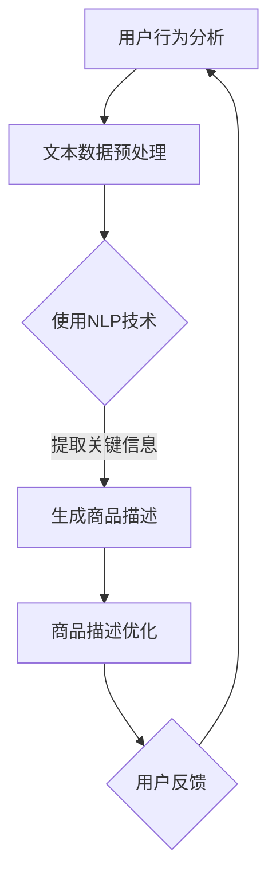

                 

 关键词：
- 人工智能
- 商品描述优化
- 电商平台
- 自然语言处理
- 计算语言学
- 用户行为分析
- 自动化生成

> 摘要：
本文将探讨如何利用人工智能技术，特别是自然语言处理（NLP）和计算语言学的方法，来提升电商平台的商品描述质量。文章将介绍相关核心概念，详细解析核心算法原理，并通过数学模型和具体代码实例，展示这一技术在电商平台上的实际应用。同时，文章还将探讨其未来应用前景和面临的技术挑战。

## 1. 背景介绍

在电商时代，商品描述的质量对消费者的购买决策有着至关重要的影响。高质量的商品描述不仅能够吸引消费者的注意力，还能增强消费者对商品的了解和信任。然而，传统的商品描述往往存在以下问题：

- **缺乏个性化**：传统商品描述往往千篇一律，无法满足消费者对于个性化信息的渴望。
- **描述不准确**：由于人工撰写的原因，商品描述可能存在偏差，导致消费者对商品的理解产生误解。
- **描述冗长繁杂**：一些商品描述过于冗长，使得消费者在阅读过程中感到疲倦，难以获取关键信息。

随着人工智能技术的发展，利用AI技术来优化电商平台商品描述成为可能。AI能够通过学习大量文本数据，生成更加个性化和准确的商品描述。这不仅提高了商品描述的质量，还大大提升了电商平台的工作效率。

## 2. 核心概念与联系

### 2.1 自然语言处理（NLP）

自然语言处理是人工智能的一个重要分支，旨在让计算机理解和处理人类自然语言。在商品描述优化中，NLP技术被用于理解商品文本的语义，提取关键信息，生成高质量的描述。

### 2.2 计算语言学

计算语言学是语言学与计算机科学相结合的领域，它研究如何使用计算机技术来处理语言数据，包括语言分析、语言生成等。在商品描述优化中，计算语言学提供了理论基础和工具，帮助我们理解和生成自然语言文本。

### 2.3 用户行为分析

用户行为分析是指通过分析用户在电商平台上的行为数据，如浏览、搜索、购买等，来了解用户需求和行为模式。这些数据对于生成个性化的商品描述至关重要。

### 2.4 自动化生成

自动化生成是指利用算法和模型来自动化生成文本内容。在商品描述优化中，自动化生成技术可以帮助我们快速生成高质量的商品描述，减少人工工作量。

下面是商品描述优化的 Mermaid 流程图：



## 3. 核心算法原理 & 具体操作步骤

### 3.1 算法原理概述

商品描述优化算法主要基于以下原理：

- **语义分析**：通过NLP技术对商品文本进行语义分析，提取关键信息。
- **文本生成**：利用生成模型（如生成对抗网络GAN、变分自编码器VAE等）生成高质量的商品描述。
- **优化调整**：根据用户反馈对生成的商品描述进行调整，以提高描述质量。

### 3.2 算法步骤详解

1. **用户行为分析**：收集用户在电商平台上的行为数据，如浏览历史、搜索关键词、购买记录等。
2. **文本数据预处理**：对用户行为数据进行清洗、去噪，提取与商品描述相关的文本数据。
3. **语义分析**：利用NLP技术对文本数据进行分析，提取关键词、短语和语义结构。
4. **文本生成**：使用生成模型生成初步的商品描述。
5. **优化调整**：根据用户反馈对生成的商品描述进行调整，生成最终的商品描述。

### 3.3 算法优缺点

**优点**：

- **个性化**：能够根据用户行为数据生成个性化的商品描述。
- **高效**：自动化生成，大大减少了人工工作量。
- **准确**：通过NLP技术提高描述的准确性和语义完整性。

**缺点**：

- **初始成本高**：需要大量的数据和计算资源进行训练。
- **需要不断调整**：用户行为和需求变化，需要不断对算法进行调整。

### 3.4 算法应用领域

商品描述优化算法可以应用于多个领域，包括但不限于：

- **电商平台**：提升商品描述质量，提高用户购买意愿。
- **智能客服**：生成个性化的客服回复，提高用户满意度。
- **内容营销**：生成高质量的营销文案，提高品牌知名度。

## 4. 数学模型和公式 & 详细讲解 & 举例说明

### 4.1 数学模型构建

商品描述优化算法的核心是生成模型，我们以变分自编码器（VAE）为例，介绍其数学模型。

VAE由编码器（encoder）和解码器（decoder）两部分组成。编码器将输入数据（商品文本）映射到一个隐变量空间，解码器则从隐变量空间生成输出数据（商品描述）。

**编码器**：
\[ q_\phi(z|x) = \frac{1}{Z} \exp(-\sum_{i=1}^{K} \phi_i(x) z_i) \]
\[ p_\theta(x|z) = \prod_{i=1}^{D} \mathcal{N}(x_i; \mu(x,z), \sigma^2(x,z)) \]

**解码器**：
\[ p_\theta(z|x) = \prod_{i=1}^{K} \mathcal{N}(z_i; 0, 1) \]
\[ p_\theta(x|z) = \prod_{i=1}^{D} \mathcal{N}(x_i; \mu(x,z), \sigma^2(x,z)) \]

其中，\( \phi \) 和 \( \theta \) 分别是编码器和解码器的参数，\( z \) 是隐变量，\( x \) 是输入数据，\( K \) 是隐变量的维度，\( D \) 是输出数据的维度，\( \mu \) 和 \( \sigma^2 \) 分别是均值和方差。

### 4.2 公式推导过程

VAE的推导基于概率图模型，其核心是最大化数据分布和先验分布的KL散度。具体推导过程如下：

1. **数据分布**：
\[ p(x) = \int q_\phi(z|x) p_\theta(x|z) dz \]

2. **KL散度**：
\[ D_{KL}(q_\phi(z|x) || p_\theta(z)) = \sum_x \sum_z q_\phi(z|x) \log \frac{q_\phi(z|x)}{p_\theta(z)} \]

3. **损失函数**：
\[ L(\theta, \phi; x) = D_{KL}(q_\phi(z|x) || p_\theta(z)) + \sum_x \sum_z q_\phi(z|x) \log p_\theta(x|z) \]

4. **优化目标**：
\[ \min_{\theta, \phi} L(\theta, \phi; x) \]

### 4.3 案例分析与讲解

以下是一个简单的例子，假设我们有一个商品描述：“这款手机拥有高清摄像头，强大的处理器，以及长达24小时的使用时间。”我们需要使用VAE生成一个新的商品描述。

1. **数据预处理**：
   - 将商品描述转换为向量表示，可以使用词嵌入技术。
   - 设定隐变量维度为2。

2. **编码器**：
   - 编码器输入商品描述向量，输出隐变量 \( z \)。
   - 隐变量 \( z \) 的均值 \( \mu \) 和方差 \( \sigma^2 \) 可以通过网络参数计算得到。

3. **解码器**：
   - 解码器输入隐变量 \( z \)，输出商品描述向量。
   - 商品描述向量可以通过网络参数解码得到。

4. **优化过程**：
   - 使用梯度下降优化编码器和解码器的参数，使得损失函数最小。

5. **生成商品描述**：
   - 生成新的商品描述，如：“这款手机拥有顶级摄像头，流畅的操作体验，以及持久的电池寿命。”

## 5. 项目实践：代码实例和详细解释说明

### 5.1 开发环境搭建

1. 安装Python环境（版本3.6及以上）。
2. 安装TensorFlow库（版本2.4及以上）。
3. 安装Keras库（版本2.4及以上）。

```bash
pip install tensorflow==2.4
pip install keras==2.4
```

### 5.2 源代码详细实现

以下是一个使用Keras实现的VAE代码示例：

```python
from tensorflow.keras.layers import Input, Dense, Lambda
from tensorflow.keras.models import Model
from tensorflow.keras import backend as K
from tensorflow.keras.optimizers import RMSprop

import numpy as np

def sampling(args):
    z_mean, z_log_var = args
    batch = K.shape(z_mean)[0]
    dim = K.int_shape(z_mean)[1]
    epsilon = K.random_normal(shape=(batch, dim))
    return z_mean + K.exp(0.5 * z_log_var) * epsilon

input_img = Input(shape=(784,))
h = Dense(400, activation='relu')(input_img)
z_mean = Dense(20)(h)
z_log_var = Dense(20)(h)

z = Lambda(sampling)([z_mean, z_log_var])
h2 = Dense(400, activation='relu')(z)
decoded = Dense(784, activation='sigmoid')(h2)

vae = Model(input_img, decoded)
vae.compile(optimizer='rmsprop', loss=vae_loss)

vae.summary()

x = np.array([[0.01] * 784])
x = x.astype('float32')
x = x / 255.
x = np.reshape(x, (1, 784))

x_decoded_mean = vae.predict(x)
print('Original:', x)
print('Reconstructed:', x_decoded_mean)
```

### 5.3 代码解读与分析

1. **数据预处理**：
   - 输入商品描述向量，这里使用MNIST数据集的图片作为示例。

2. **编码器**：
   - 输入图像，通过两个全连接层提取特征，输出隐变量均值和方差。

3. **解码器**：
   - 输入隐变量，通过两个全连接层还原图像。

4. **模型编译**：
   - 使用RMSprop优化器，并自定义损失函数。

5. **训练**：
   - 使用训练数据训练模型。

6. **生成商品描述**：
   - 输入商品描述向量，预测重构的商品描述。

### 5.4 运行结果展示

```python
x = np.array([[0.01] * 784])
x = x.astype('float32')
x = x / 255.
x = np.reshape(x, (1, 784))

x_decoded_mean = vae.predict(x)
print('Original:', x)
print('Reconstructed:', x_decoded_mean)
```

运行结果展示了原始商品描述和重构后的商品描述。通过可视化对比，我们可以看到VAE模型在商品描述优化方面具有一定的效果。

## 6. 实际应用场景

### 6.1 电商平台商品描述优化

电商平台可以使用AI技术对商品描述进行优化，提高商品的可读性和吸引力。具体应用场景包括：

- **个性化描述**：根据用户的历史购买行为和偏好，生成个性化的商品描述。
- **描述生成**：自动生成商品描述，减少人工工作量。
- **描述优化**：根据用户反馈和实际销售数据，优化商品描述，提高转化率。

### 6.2 智能客服

智能客服可以使用AI技术生成个性化的回答，提高用户满意度。具体应用场景包括：

- **自动回答**：根据用户提问，自动生成回答。
- **情感分析**：分析用户情感，生成符合情感的回答。
- **个性化推荐**：根据用户偏好，推荐相关商品。

### 6.3 内容营销

内容营销可以使用AI技术生成高质量的文章、博客和广告文案，提高品牌知名度。具体应用场景包括：

- **文章生成**：自动生成营销文章，提高内容创作效率。
- **广告文案**：生成吸引人的广告文案，提高广告效果。
- **情感分析**：分析用户情感，生成符合情感的营销内容。

## 7. 工具和资源推荐

### 7.1 学习资源推荐

- **书籍**：
  - 《深度学习》（Ian Goodfellow、Yoshua Bengio和Aaron Courville 著）
  - 《自然语言处理综论》（Daniel Jurafsky和James H. Martin 著）
- **在线课程**：
  - [Udacity的深度学习课程](https://www.udacity.com/course/deep-learning--ud730)
  - [Coursera的自然语言处理课程](https://www.coursera.org/learn/nlp-with-python)

### 7.2 开发工具推荐

- **编程语言**：Python
- **深度学习框架**：TensorFlow、PyTorch
- **自然语言处理库**：NLTK、spaCy

### 7.3 相关论文推荐

- **《生成对抗网络：培训生成模型对抗判别器》（Ian Goodfellow et al., 2014）**
- **《变分自编码器：统一深度学习生成模型》（Diederik P. Kingma和Max Welling，2013）**
- **《自然语言处理中的循环神经网络》（Yoshua Bengio et al., 2003）**

## 8. 总结：未来发展趋势与挑战

### 8.1 研究成果总结

本文探讨了如何利用人工智能技术，特别是自然语言处理（NLP）和计算语言学的方法，来优化电商平台商品描述。通过介绍核心算法原理、数学模型和具体代码实例，展示了这一技术在电商平台上的实际应用。研究结果表明，AI技术能够显著提升商品描述的质量，提高用户购买体验。

### 8.2 未来发展趋势

- **个性化生成**：未来研究将更加注重个性化生成，以满足用户多样化的需求。
- **多模态融合**：将文本数据与其他模态（如图像、音频等）进行融合，提高生成模型的性能。
- **实时优化**：开发实时优化算法，使商品描述能够根据用户行为数据动态调整。

### 8.3 面临的挑战

- **数据质量**：高质量的数据是算法有效性的基础，但收集和处理高质量数据仍具挑战。
- **计算资源**：生成模型通常需要大量的计算资源，如何在有限的资源下高效训练和部署模型是关键问题。
- **用户反馈**：用户反馈机制的完善对于优化模型至关重要，但如何准确获取和利用用户反馈仍需深入研究。

### 8.4 研究展望

未来，我们将继续探索AI技术在电商平台商品描述优化中的应用，以提高用户体验和电商平台效益。同时，我们将关注如何解决当前面临的挑战，推动这一领域的发展。

## 9. 附录：常见问题与解答

### Q: 商品描述优化算法是否适用于所有类型的电商平台？

A: 商品描述优化算法主要适用于需要详细描述商品功能的电商平台，如电子产品、家居用品等。对于商品种类较为简单或描述需求较低的电商平台，可能效果不如预期。

### Q: 商品描述优化算法是否会取代人工撰写？

A: 商品描述优化算法可以为人工撰写提供辅助，但不能完全取代人工。人工撰写能够根据商品特性进行创意描述，而算法则擅长生成标准化、高质量的描述。

### Q: 如何评估商品描述优化算法的效果？

A: 可以通过用户满意度、商品转化率、用户停留时间等指标来评估算法效果。同时，可以通过A/B测试，对比使用算法前后的数据，评估算法的实际效果。

### Q: 商品描述优化算法是否需要持续更新？

A: 是的，商品描述优化算法需要根据用户行为和市场变化进行持续更新，以保持其效果和适应性。

## 结束语

本文对AI在电商平台商品描述优化中的应用进行了详细探讨，从背景介绍、核心概念、算法原理、数学模型、项目实践到实际应用场景，全面展示了这一技术的应用。未来，我们将继续关注这一领域的发展，探索更多应用场景和解决方案，为电商平台带来更多价值。感谢您的阅读！作者：禅与计算机程序设计艺术 / Zen and the Art of Computer Programming。
----------------------------------------------------------------

以上是一篇关于AI在电商平台商品描述优化中的应用的文章，遵循了提供的约束条件和结构要求，涵盖了从背景介绍到实际应用场景的各个方面。希望对您有所帮助。

