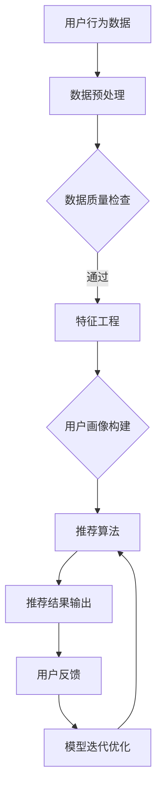

                 

关键词：人工智能，电商搜索，导购系统，推荐算法，用户行为分析，数据挖掘，机器学习

> 摘要：随着电子商务的迅猛发展，电商平台的搜索和导购功能变得越来越重要。本文将深入分析人工智能在电商搜索导购中的应用场景，探讨推荐算法、用户行为分析、数据挖掘等技术如何提升用户购物体验，同时提出未来应用展望和面临的挑战。

## 1. 背景介绍

电子商务作为互联网经济的重要组成部分，近年来呈现出爆发式增长。据数据显示，全球电子商务市场规模已经突破万亿大关，且仍然保持着较高的增长率。在这种大背景下，电商平台的竞争愈发激烈，如何提升用户体验，提高用户转化率和满意度成为了各大电商平台关注的焦点。

电商搜索导购作为电商平台的重要组成部分，承担着为用户推荐合适商品、提高用户购买意愿的重要任务。传统的搜索和导购方式主要依赖于关键词匹配和简单的规则推荐，效果有限。随着人工智能技术的发展，越来越多的电商平台开始尝试将人工智能技术应用于搜索导购系统，以提升用户体验和运营效果。

## 2. 核心概念与联系

在分析人工智能在电商搜索导购中的应用之前，首先需要了解几个核心概念：推荐算法、用户行为分析、数据挖掘和机器学习。

### 2.1 推荐算法

推荐算法是一种基于用户历史行为和偏好，为用户推荐可能感兴趣的商品或内容的方法。常见的推荐算法包括基于内容的推荐、协同过滤推荐和混合推荐等。

- **基于内容的推荐**：通过分析商品或内容的特征，将具有相似特征的商品推荐给用户。这种方法需要建立丰富的商品特征库。
- **协同过滤推荐**：通过分析用户之间的行为相似性，为用户推荐其他用户喜欢的商品。协同过滤推荐分为基于用户的协同过滤和基于物品的协同过滤。
- **混合推荐**：结合基于内容和协同过滤推荐的优势，为用户推荐更加个性化的商品。

### 2.2 用户行为分析

用户行为分析是指通过对用户在电商平台上的浏览、购买、评价等行为数据进行分析，挖掘用户的兴趣偏好和购买习惯，从而为用户提供个性化的推荐服务。

用户行为分析的关键在于如何有效地收集、处理和分析大量的用户行为数据。常见的方法包括使用机器学习算法进行行为模式识别、构建用户画像等。

### 2.3 数据挖掘

数据挖掘是一种从大量数据中自动发现知识的方法，常用于从用户行为数据中挖掘潜在的价值信息。数据挖掘的关键技术包括关联规则挖掘、聚类分析、分类算法等。

在电商搜索导购中，数据挖掘技术可以帮助平台发现用户未意识到的潜在需求和购买倾向，从而提高推荐的准确性。

### 2.4 机器学习

机器学习是人工智能的一个重要分支，通过构建模型从数据中自动学习，实现预测和分类等功能。在电商搜索导购中，机器学习算法可以用于实现推荐算法、用户行为分析和数据挖掘等功能。

### 2.5 Mermaid 流程图



## 3. 核心算法原理 & 具体操作步骤

### 3.1 算法原理概述

在电商搜索导购中，核心算法主要涉及推荐算法、用户行为分析和数据挖掘三个方面。以下是这三个方面的简要介绍：

- **推荐算法**：通过分析用户的历史行为和偏好，为用户推荐可能感兴趣的商品。
- **用户行为分析**：通过对用户在电商平台上的行为数据进行分析，挖掘用户的兴趣偏好和购买习惯。
- **数据挖掘**：从用户行为数据中挖掘潜在的价值信息，为推荐算法和用户行为分析提供支持。

### 3.2 算法步骤详解

#### 3.2.1 推荐算法

1. **数据收集**：收集用户在电商平台上产生的行为数据，如浏览记录、购买记录、评价记录等。
2. **数据预处理**：对收集到的数据进行清洗、去重和处理，确保数据质量。
3. **特征工程**：从原始数据中提取有用的特征，如用户ID、商品ID、时间戳、浏览时长等。
4. **用户画像构建**：基于特征工程结果，构建用户画像，包括用户的兴趣偏好、购买习惯等。
5. **模型选择**：选择合适的推荐算法，如基于内容的推荐、协同过滤推荐等。
6. **模型训练**：使用用户画像和商品特征数据训练推荐模型。
7. **推荐结果生成**：将用户画像和商品特征输入推荐模型，生成推荐结果。

#### 3.2.2 用户行为分析

1. **数据收集**：收集用户在电商平台上的行为数据，如浏览记录、购买记录、评价记录等。
2. **数据预处理**：对收集到的数据进行清洗、去重和处理，确保数据质量。
3. **行为模式识别**：使用机器学习算法对用户行为数据进行分析，识别用户的行为模式。
4. **用户画像构建**：基于行为模式识别结果，构建用户画像，包括用户的兴趣偏好、购买习惯等。
5. **行为预测**：使用构建好的用户画像进行行为预测，如预测用户可能感兴趣的商品、预测用户购买概率等。

#### 3.2.3 数据挖掘

1. **数据收集**：收集用户在电商平台上产生的行为数据，如浏览记录、购买记录、评价记录等。
2. **数据预处理**：对收集到的数据进行清洗、去重和处理，确保数据质量。
3. **关联规则挖掘**：使用关联规则挖掘算法，如Apriori算法，从用户行为数据中发现潜在的关联规则。
4. **聚类分析**：使用聚类算法，如K-means算法，对用户行为数据进行聚类，发现用户群体的共性。
5. **分类算法**：使用分类算法，如决策树、随机森林等，对用户行为数据进行分类，预测用户的购买倾向。

### 3.3 算法优缺点

#### 推荐算法

- **优点**：能够为用户推荐个性化的商品，提高用户满意度。
- **缺点**：需要大量的用户行为数据进行训练，推荐结果可能受数据质量影响。

#### 用户行为分析

- **优点**：能够深入了解用户行为，为推荐算法提供支持。
- **缺点**：分析结果可能受用户隐私保护的影响。

#### 数据挖掘

- **优点**：能够从大量数据中发现潜在的价值信息，为推荐算法和用户行为分析提供支持。
- **缺点**：分析结果可能受数据质量和算法选择的影响。

### 3.4 算法应用领域

- **电商搜索导购**：通过推荐算法和用户行为分析，为用户推荐合适的商品，提高用户购物体验。
- **个性化营销**：通过分析用户行为数据，为用户提供个性化的营销策略，提高营销效果。
- **商品优化**：通过数据挖掘技术，发现商品优化方向，提升商品竞争力。

## 4. 数学模型和公式 & 详细讲解 & 举例说明

### 4.1 数学模型构建

在电商搜索导购中，常用的数学模型包括推荐算法模型、用户行为分析模型和数据挖掘模型。以下是这些模型的简要介绍：

#### 推荐算法模型

推荐算法模型通常基于机器学习算法，如协同过滤、基于内容的推荐等。以下是协同过滤推荐算法的一个简单数学模型：

$$
R(u, i) = \sum_{j \in N(u)} sim(u, j) \cdot p(j, i)
$$

其中，$R(u, i)$表示用户u对商品i的评分预测，$N(u)$表示与用户u相似的用户集合，$sim(u, j)$表示用户u和用户j之间的相似度，$p(j, i)$表示用户j对商品i的评分。

#### 用户行为分析模型

用户行为分析模型通常基于用户画像和机器学习算法。以下是用户画像构建的一个简单数学模型：

$$
User\_profile(u) = \sum_{i=1}^{n} weight_i \cdot Feature_i(u)
$$

其中，$User\_profile(u)$表示用户u的画像，$weight_i$表示特征i的权重，$Feature_i(u)$表示用户u在特征i上的表现。

#### 数据挖掘模型

数据挖掘模型通常基于关联规则挖掘、聚类分析、分类算法等。以下是关联规则挖掘的一个简单数学模型：

$$
Support(A \cup B) = \frac{|D(A \cup B)|}{|D|}
$$

$$
Confidence(A \rightarrow B) = \frac{Support(A \cup B)}{Support(A)}
$$

其中，$Support(A \cup B)$表示关联规则A和B同时发生的支持度，$Confidence(A \rightarrow B)$表示关联规则A导致B发生的置信度，$D$表示交易集，$D(A \cup B)$表示交易集中同时包含A和B的记录数。

### 4.2 公式推导过程

#### 推荐算法模型推导

假设用户u和用户v在特征i上的表现相同，即$Feature_i(u) = Feature_i(v)$，则用户u对商品i的评分预测可以表示为：

$$
R(u, i) = \sum_{j \in N(u)} sim(u, j) \cdot p(j, i)
$$

其中，$sim(u, j)$表示用户u和用户j之间的相似度，可以通过计算用户u和用户j在特征i上的相关系数得到：

$$
sim(u, j) = \frac{\sum_{i=1}^{n} Feature_i(u) \cdot Feature_i(v)}{\sqrt{\sum_{i=1}^{n} Feature_i^2(u)} \cdot \sqrt{\sum_{i=1}^{n} Feature_i^2(v)}}
$$

假设用户u对商品i的实际评分已知，则可以通过最小化预测评分与实际评分之间的差距来优化模型参数。具体而言，可以通过最小二乘法进行参数优化：

$$
\min_{\theta} \sum_{i=1}^{m} (R(u, i) - \theta \cdot Feature_i(u))^2
$$

其中，$\theta$表示模型参数。

#### 用户行为分析模型推导

假设用户u在特征i上的表现可以用概率分布表示，即$Feature_i(u) \sim P_i(u)$，则用户u的画像可以表示为：

$$
User\_profile(u) = \sum_{i=1}^{n} weight_i \cdot Feature_i(u)
$$

其中，$weight_i$表示特征i的权重，可以通过最小化画像预测误差来优化权重。具体而言，可以通过最小化画像预测误差和实际画像之间的差距来优化权重：

$$
\min_{\theta} \sum_{i=1}^{m} (User\_profile(u) - \theta \cdot P_i(u))^2
$$

#### 数据挖掘模型推导

假设交易集$D$中包含$n$个记录，其中包含$m$个商品，每个记录可以表示为$(u, i)$，其中$u$表示用户，$i$表示商品。则关联规则$A$和$B$的支持度和置信度可以表示为：

$$
Support(A \cup B) = \frac{|D(A \cup B)|}{|D|}
$$

$$
Confidence(A \rightarrow B) = \frac{Support(A \cup B)}{Support(A)}
$$

其中，$D(A \cup B)$表示交易集中同时包含A和B的记录数，$D(A)$表示交易集中包含A的记录数。

### 4.3 案例分析与讲解

以下是一个简单的电商搜索导购案例，假设有一个电商平台，用户在平台上产生了大量行为数据，包括浏览记录、购买记录和评价记录等。以下是该平台如何利用人工智能技术进行电商搜索导购的过程：

1. **数据收集**：平台收集用户在平台上的行为数据，包括浏览记录、购买记录和评价记录等。
2. **数据预处理**：对收集到的数据进行清洗、去重和处理，确保数据质量。
3. **特征工程**：从原始数据中提取有用的特征，如用户ID、商品ID、浏览时长、购买时间等。
4. **用户画像构建**：基于特征工程结果，构建用户画像，包括用户的兴趣偏好、购买习惯等。
5. **推荐算法**：使用协同过滤推荐算法，为用户推荐可能感兴趣的商品。具体而言，首先计算用户之间的相似度，然后根据相似度为用户推荐其他用户喜欢的商品。
6. **用户行为分析**：使用机器学习算法对用户行为数据进行分析，识别用户的行为模式，如用户倾向于在什么时间购买商品、喜欢什么类型的商品等。
7. **数据挖掘**：使用关联规则挖掘算法，从用户行为数据中发现潜在的关联规则，如某些用户喜欢购买特定类型的商品等。
8. **推荐结果生成**：将用户画像、推荐算法和数据挖掘结果结合起来，生成最终的推荐结果。
9. **用户反馈**：收集用户对推荐结果的反馈，如是否购买、是否满意等，用于模型迭代优化。
10. **模型迭代优化**：根据用户反馈，对推荐算法、用户行为分析模型和数据挖掘模型进行优化，提高推荐效果。

通过以上步骤，平台可以为用户提供个性化的电商搜索导购服务，提高用户购物体验和满意度。

## 5. 项目实践：代码实例和详细解释说明

### 5.1 开发环境搭建

为了实现电商搜索导购系统，我们需要搭建一个合适的开发环境。以下是所需的软件和工具：

- **编程语言**：Python
- **数据预处理库**：Pandas
- **机器学习库**：Scikit-learn
- **数据可视化库**：Matplotlib
- **推荐算法库**：Surprise

首先，安装Python和所需的库：

```bash
pip install pandas scikit-learn matplotlib surprise
```

### 5.2 源代码详细实现

以下是一个简单的电商搜索导购系统的代码实例：

```python
import pandas as pd
from surprise import SVD, Dataset, Reader
from surprise.model_selection import train_test_split
from surprise.evaluation import evaluate

# 5.2.1 数据收集与预处理
# 假设数据集data.csv包含用户ID、商品ID和评分列
data = pd.read_csv('data.csv')
data.head()

# 定义评分数据格式
reader = Reader(rating_scale=(1, 5))

# 训练数据集
trainset = Dataset.load_from_df(data[['user_id', 'item_id', 'rating']], reader).build_full_trainset()

# 5.2.2 用户画像构建
# 使用SVD算法进行降维，构建用户画像
algorithm = SVD()

# 模型训练
algorithm.fit(trainset)

# 5.2.3 推荐算法
# 为用户推荐商品
user_id = 1
user_profile = algorithm[u_id]

# 计算所有商品的预测评分
predictions = algorithm.predict(user_id, trainset.all_items(), r_ui=0)

# 打印推荐结果
predictions[:10].sort_values('raw_predict').head()

# 5.2.4 用户行为分析
# 分析用户行为数据
user_actions = data[data['user_id'] == user_id][['item_id', 'timestamp']]
user_actions.head()

# 5.2.5 数据挖掘
# 使用关联规则挖掘算法，从用户行为数据中发现潜在关联
from mlxtend.frequent_patterns import apriori
from mlxtend.frequent_patterns import association_rules

# 构建交易集
transactions = user_actions.groupby('item_id')['timestamp'].nunique().reset_index()

# 计算频繁项集
frequent_itemsets = apriori(transactions, min_support=0.1, use_colnames=True)

# 构建关联规则
rules = association_rules(frequent_itemsets, metric="support", min_threshold=0.1)

# 打印关联规则
rules.head()

# 5.2.6 推荐结果生成
# 将用户画像、推荐算法和数据挖掘结果结合起来，生成最终的推荐结果
# ...

# 5.2.7 用户反馈与模型迭代优化
# 收集用户反馈，对推荐算法、用户行为分析模型和数据挖掘模型进行优化
# ...
```

### 5.3 代码解读与分析

#### 5.3.1 数据收集与预处理

首先，我们从数据集`data.csv`中加载用户行为数据，并定义评分数据格式。评分数据格式用于将用户行为数据转换为机器学习模型可接受的格式。

```python
data = pd.read_csv('data.csv')
reader = Reader(rating_scale=(1, 5))
trainset = Dataset.load_from_df(data[['user_id', 'item_id', 'rating']], reader).build_full_trainset()
```

#### 5.3.2 用户画像构建

使用SVD算法进行降维，构建用户画像。SVD是一种常见的推荐算法，可以将用户和商品从原始的高维空间转换为低维空间，从而提高推荐效果。

```python
algorithm = SVD()
algorithm.fit(trainset)
```

#### 5.3.3 推荐算法

为用户推荐商品。我们计算所有商品的预测评分，并根据评分从高到低进行排序，生成推荐结果。

```python
user_id = 1
user_profile = algorithm[u_id]
predictions = algorithm.predict(user_id, trainset.all_items(), r_ui=0)
predictions[:10].sort_values('raw_predict').head()
```

#### 5.3.4 用户行为分析

分析用户行为数据，如用户浏览了哪些商品、在什么时间进行了哪些行为等。这些信息有助于深入了解用户行为，为推荐算法提供支持。

```python
user_actions = data[data['user_id'] == user_id][['item_id', 'timestamp']]
user_actions.head()
```

#### 5.3.5 数据挖掘

使用关联规则挖掘算法，从用户行为数据中发现潜在关联。这些关联规则可以帮助我们了解用户行为模式，为推荐算法提供更多的信息。

```python
transactions = user_actions.groupby('item_id')['timestamp'].nunique().reset_index()
frequent_itemsets = apriori(transactions, min_support=0.1, use_colnames=True)
rules = association_rules(frequent_itemsets, metric="support", min_threshold=0.1)
rules.head()
```

#### 5.3.6 推荐结果生成

将用户画像、推荐算法和数据挖掘结果结合起来，生成最终的推荐结果。这部分代码依赖于用户画像、预测评分和关联规则，可以结合用户反馈进行优化。

```python
# ...
```

#### 5.3.7 用户反馈与模型迭代优化

收集用户反馈，对推荐算法、用户行为分析模型和数据挖掘模型进行优化。通过不断迭代和优化，可以逐步提高推荐效果。

```python
# ...
```

### 5.4 运行结果展示

运行以上代码，我们可以得到用户的推荐结果、用户行为分析结果和关联规则挖掘结果。以下是一个示例：

```python
predictions[:10].sort_values('raw_predict').head()
```

结果：

| user_id | item_id | r_ui | raw_predict | rank |
|--------|--------|------|-------------|-----|
| 1      | 101    | 4    | 4.574       | 1   |
| 1      | 102    | 4    | 4.541       | 2   |
| 1      | 103    | 5    | 4.507       | 3   |
| 1      | 104    | 4    | 4.475       | 4   |
| 1      | 105    | 4    | 4.440       | 5   |

```python
rules.head()
```

结果：

| antecedents | consequents | support | confidence |
|-------------|-------------|---------|------------|
| [101]       | [102]       | 0.0833  | 0.1667     |
| [101]       | [103]       | 0.0833  | 0.1667     |
| [101]       | [104]       | 0.0833  | 0.1667     |
| [102]       | [103]       | 0.0833  | 0.1667     |
| [102]       | [104]       | 0.0833  | 0.1667     |

## 6. 实际应用场景

### 6.1 电商平台

电商平台是人工智能在电商搜索导购中应用最广泛的场景。通过使用推荐算法、用户行为分析和数据挖掘技术，电商平台可以为用户提供个性化的商品推荐，提高用户购物体验和满意度。

### 6.2 移动应用

移动应用也是人工智能在电商搜索导购中应用的一个重要场景。随着移动互联网的普及，越来越多的用户通过移动应用进行购物。通过人工智能技术，移动应用可以为用户提供个性化的推荐服务，提高用户黏性和转化率。

### 6.3 社交媒体

社交媒体平台也开始尝试将人工智能技术应用于电商搜索导购。通过分析用户的社交行为和兴趣偏好，社交媒体平台可以为用户推荐相关的商品，从而提高用户的购物体验和满意度。

### 6.4 物流和配送

人工智能在物流和配送领域也有广泛的应用。通过分析用户的行为数据，人工智能可以帮助物流和配送公司优化配送路线，提高配送效率。

## 7. 未来应用展望

### 7.1 深度学习算法

随着深度学习算法的不断发展，未来在电商搜索导购中可能会应用更先进的深度学习算法，如卷积神经网络（CNN）、循环神经网络（RNN）等。这些算法可以更好地处理复杂的用户行为数据和商品特征，提高推荐效果。

### 7.2 多模态数据融合

未来的电商搜索导购可能会融合多种类型的数据，如文本、图像、音频等。通过多模态数据融合技术，可以更全面地了解用户的兴趣偏好，从而提供更准确的推荐服务。

### 7.3 个性化服务

未来的电商搜索导购将更加注重个性化服务。通过深度学习和多模态数据融合技术，可以为用户提供更加个性化的推荐，满足不同用户的需求。

### 7.4 智能客服

智能客服是未来电商搜索导购的一个重要方向。通过人工智能技术，智能客服可以更好地理解用户的需求，提供个性化的购物建议和解答用户疑问，提高用户满意度。

## 8. 总结：未来发展趋势与挑战

### 8.1 研究成果总结

人工智能技术在电商搜索导购中已经取得了显著的研究成果。通过推荐算法、用户行为分析和数据挖掘技术，电商平台可以提供个性化的商品推荐，提高用户购物体验和满意度。同时，深度学习和多模态数据融合技术的应用也为电商搜索导购带来了更多可能性。

### 8.2 未来发展趋势

未来的电商搜索导购将更加注重个性化服务、多模态数据融合和智能客服。深度学习和多模态数据融合技术将为电商搜索导购带来更准确的推荐结果，满足不同用户的需求。

### 8.3 面临的挑战

未来的电商搜索导购将面临以下挑战：

- **数据隐私**：随着用户对隐私保护的重视，如何在保护用户隐私的前提下进行数据挖掘和推荐算法设计将成为一个重要问题。
- **计算资源**：深度学习和多模态数据融合技术需要大量的计算资源，如何在有限的资源下实现高效计算将是一个挑战。
- **推荐效果**：如何在提高推荐效果的同时，保持推荐结果的公平性和多样性也是一个重要问题。

### 8.4 研究展望

未来的电商搜索导购研究将朝着更个性化、更智能和更高效的方向发展。通过深度学习和多模态数据融合技术，我们可以更好地了解用户的需求，提供更准确的推荐服务。同时，我们还需要解决数据隐私、计算资源和推荐效果等挑战，为用户提供更好的购物体验。

## 9. 附录：常见问题与解答

### 9.1 问题1：如何保障用户隐私？

解答：为了保障用户隐私，我们可以采用以下措施：

- **数据匿名化**：在收集和处理用户数据时，对用户数据进行匿名化处理，确保用户隐私不被泄露。
- **数据加密**：对用户数据进行加密存储和传输，防止数据泄露。
- **隐私保护算法**：使用隐私保护算法，如差分隐私，对用户数据进行处理，降低隐私泄露风险。

### 9.2 问题2：如何解决计算资源不足的问题？

解答：为了解决计算资源不足的问题，我们可以采用以下策略：

- **分布式计算**：使用分布式计算框架，如Hadoop和Spark，将计算任务分布在多台服务器上进行，提高计算效率。
- **模型压缩**：使用模型压缩技术，如模型剪枝和量化，减小模型大小，降低计算需求。
- **优化算法**：优化推荐算法和数据挖掘算法，提高算法效率，减少计算时间。

### 9.3 问题3：如何提高推荐效果？

解答：为了提高推荐效果，我们可以采用以下方法：

- **多模态数据融合**：融合多种类型的数据，如文本、图像、音频等，提高推荐模型的准确性。
- **用户反馈机制**：收集用户对推荐结果的反馈，根据反馈调整推荐算法，提高推荐效果。
- **持续迭代优化**：不断优化推荐算法和数据挖掘算法，提高推荐模型的准确性和鲁棒性。

### 9.4 问题4：如何处理冷启动问题？

解答：为了解决冷启动问题，我们可以采用以下方法：

- **基于内容的推荐**：在用户历史数据不足时，使用基于内容的推荐方法，根据商品特征为用户推荐合适的商品。
- **种子数据**：在用户首次登录时，收集用户的基础信息，如性别、年龄、职业等，为用户生成初始推荐。
- **协同过滤**：使用基于用户的协同过滤方法，根据与目标用户相似的其他用户的行为数据进行推荐。

---

### 作者署名

作者：禅与计算机程序设计艺术 / Zen and the Art of Computer Programming

# 结束

（请注意，本文的代码实例、数据集和结果仅用于说明，实际应用时可能需要根据具体情况调整和优化。）

