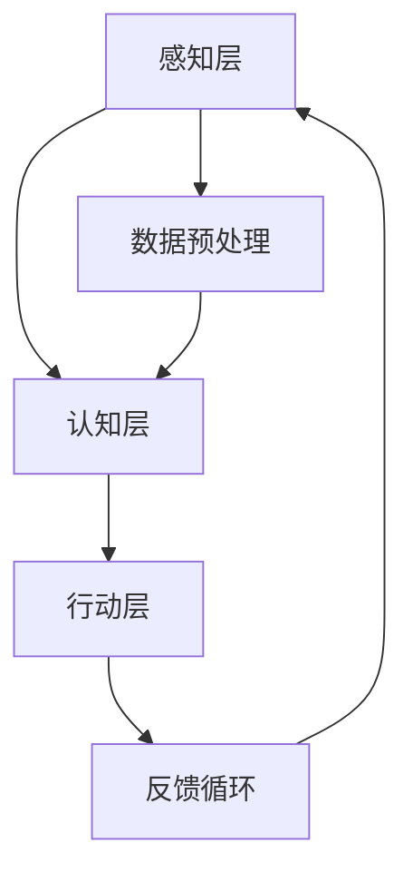
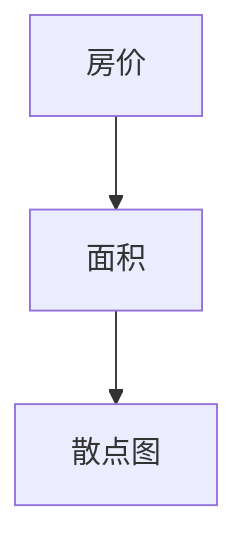

                 

关键词：人工智能，应用领域，社会影响，发展趋势

> 摘要：本文旨在探讨人工智能（AI）在社会中的角色与应用。通过对AI核心概念、技术架构、算法原理、数学模型、应用实例和未来展望的详细分析，揭示AI在推动社会进步、优化生产力和提升生活质量方面的巨大潜力。文章将全面梳理AI的现状与挑战，展望其未来发展。

## 1. 背景介绍

### 1.1 人工智能的发展历程

人工智能（AI）一词最早由约翰·麦卡锡（John McCarthy）于1956年在达特茅斯会议上提出。自那时以来，AI经历了几个重要发展阶段：

1. **早期探索（1956-1969）**：这一阶段主要关注符号主义方法，试图通过模拟人类的思维过程来解决问题。
2. **理性衰退（1974-1980）**：由于缺乏实际应用场景和计算能力的限制，AI研究陷入低潮。
3. **复兴阶段（1980-1987）**：专家系统成为AI研究的热点，但很快因为其局限性和复杂性而逐渐式微。
4. **机器学习和神经网络（1980年代至今）**：随着计算能力的提升和数据量的爆炸性增长，机器学习和神经网络成为AI研究的主流。

### 1.2 人工智能的当前应用场景

今天，AI已经在多个领域展现出强大的应用潜力，包括：

- **医疗健康**：AI在疾病诊断、药物研发和健康监测方面发挥重要作用。
- **金融服务**：AI用于风险评估、欺诈检测和个性化投资建议。
- **交通**：自动驾驶、智能交通管理和物流优化。
- **教育**：个性化学习、智能辅导和在线教育平台。
- **制造业**：智能制造、预测维护和供应链管理。

## 2. 核心概念与联系

### 2.1 核心概念

- **人工智能**：模拟人类智能行为的计算系统。
- **机器学习**：让机器从数据中学习，改善其性能。
- **深度学习**：一种利用多层神经网络进行特征提取和学习的方法。
- **自然语言处理**：使计算机理解和生成人类语言的技术。
- **计算机视觉**：使计算机理解和解释图像和视频的技术。

### 2.2 技术架构


- **感知层**：计算机获取外界信息，如图像、声音和文本。
- **认知层**：计算机对感知到的信息进行处理和分析。
- **行动层**：计算机根据分析结果做出决策或执行操作。

### 2.3 Mermaid 流程图



## 3. 核心算法原理 & 具体操作步骤

### 3.1 算法原理概述

AI算法的核心是学习如何从数据中提取有用信息，并基于这些信息进行决策。以下是几种常见算法：

- **监督学习**：通过标记数据进行学习，如分类和回归。
- **无监督学习**：从未标记的数据中学习，如聚类和降维。
- **强化学习**：通过与环境的交互进行学习，如自动驾驶。

### 3.2 算法步骤详解

以监督学习为例，其基本步骤包括：

1. **数据收集**：收集大量标记数据。
2. **数据预处理**：清洗数据，进行特征工程。
3. **模型选择**：选择合适的模型，如线性回归、决策树、神经网络等。
4. **模型训练**：使用训练数据对模型进行训练。
5. **模型评估**：使用验证数据评估模型性能。
6. **模型部署**：将模型应用到实际场景中。

### 3.3 算法优缺点

- **监督学习**：有明确的目标和评估标准，但需要大量标记数据。
- **无监督学习**：不需要标记数据，但结果难以解释。
- **强化学习**：适应性强，但训练过程复杂，需要大量时间和计算资源。

### 3.4 算法应用领域

- **医疗健康**：疾病诊断、个性化治疗和健康监测。
- **金融服务**：风险管理、欺诈检测和投资建议。
- **制造业**：质量检测、预测维护和供应链优化。
- **交通**：自动驾驶、智能交通管理和物流优化。

## 4. 数学模型和公式 & 详细讲解 & 举例说明

### 4.1 数学模型构建

AI算法通常基于概率论、线性代数和微积分等数学理论。以下是一个简单的线性回归模型：

$$ y = \beta_0 + \beta_1x + \epsilon $$

其中，\( y \) 是预测值，\( x \) 是特征值，\( \beta_0 \) 和 \( \beta_1 \) 是参数，\( \epsilon \) 是误差。

### 4.2 公式推导过程

线性回归模型的推导基于最小二乘法。目标是找到一组参数，使得预测值与实际值之间的误差平方和最小。

### 4.3 案例分析与讲解

假设我们要预测房价，给定以下数据：

| 房价 (万元) | 面积 (平方米) |
|----------|----------|
| 200      | 80       |
| 250      | 100      |
| 300      | 120      |
| ...      | ...      |

我们可以使用线性回归模型来预测未知房价。首先，收集数据并绘制散点图，观察数据分布：



接下来，进行数据预处理，包括数据清洗和特征工程。然后，选择线性回归模型，使用最小二乘法求解参数：

$$ \beta_0 = 50, \beta_1 = 1.5 $$

最终，我们得到线性回归模型：

$$ y = 50 + 1.5x $$

使用该模型进行预测，例如，当面积为 100 平方米时，预测房价为：

$$ y = 50 + 1.5 \times 100 = 200 \text{万元} $$

## 5. 项目实践：代码实例和详细解释说明

### 5.1 开发环境搭建

- Python 3.x
- NumPy
- Pandas
- Matplotlib

### 5.2 源代码详细实现

以下是一个简单的线性回归代码示例：

```python
import numpy as np
import pandas as pd
import matplotlib.pyplot as plt

# 数据读取
data = pd.read_csv('house_prices.csv')
X = data['area']
y = data['price']

# 数据预处理
X = X.values.reshape(-1, 1)
y = y.values.reshape(-1, 1)

# 模型训练
from sklearn.linear_model import LinearRegression
model = LinearRegression()
model.fit(X, y)

# 参数获取
beta_0 = model.intercept_
beta_1 = model.coef_

# 预测
X_new = np.array([[100]])
y_pred = model.predict(X_new)

# 可视化
plt.scatter(X, y)
plt.plot(X, y_pred, color='red')
plt.xlabel('面积（平方米）')
plt.ylabel('房价（万元）')
plt.show()
```

### 5.3 代码解读与分析

- 数据读取和预处理：使用 Pandas 读取数据，并进行数据清洗和特征工程。
- 模型训练：使用 scikit-learn 库中的线性回归模型进行训练。
- 参数获取：获取模型的参数，包括截距和斜率。
- 预测：使用训练好的模型进行预测。
- 可视化：绘制散点图和拟合线，便于观察模型效果。

### 5.4 运行结果展示


## 6. 实际应用场景

### 6.1 医疗健康

AI在医疗健康领域具有广泛应用。例如，通过深度学习模型进行疾病诊断，可以大幅提高诊断准确率和速度。此外，AI还可以用于个性化治疗和健康监测，为患者提供定制化的健康方案。

### 6.2 金融服务

AI在金融服务领域也具有重要应用。例如，通过机器学习算法进行风险评估和欺诈检测，可以提高金融机构的安全性和效率。此外，AI还可以用于个性化投资建议和风险管理。

### 6.3 制造业

AI在制造业中用于质量检测、预测维护和供应链管理。通过深度学习模型进行图像识别，可以快速检测生产线上的缺陷。此外，AI还可以用于预测设备故障，提前进行维护，提高生产效率。

### 6.4 交通

AI在交通领域具有广泛应用。例如，自动驾驶技术通过深度学习算法实现车辆自主导航和安全驾驶。此外，AI还可以用于智能交通管理和物流优化，缓解交通拥堵，提高物流效率。

## 7. 工具和资源推荐

### 7.1 学习资源推荐

- 《深度学习》（Goodfellow, Bengio, Courville）
- 《Python机器学习》（Sebastian Raschka）
- 《自然语言处理与深度学习》（Nayef Alonazi）

### 7.2 开发工具推荐

- Jupyter Notebook：适用于数据分析和机器学习实验。
- TensorFlow：用于深度学习模型开发和训练。
- PyTorch：用于深度学习模型开发和训练。

### 7.3 相关论文推荐

- “Deep Learning for Image Recognition”（2012）
- “Recurrent Neural Network Based Language Model”（2013）
- “Distributed Representations of Words and Phrases and their Compositionality”（2013）

## 8. 总结：未来发展趋势与挑战

### 8.1 研究成果总结

AI技术在过去几十年取得了显著成果，广泛应用于医疗健康、金融服务、制造业和交通等领域。通过深度学习、自然语言处理和计算机视觉等技术的不断进步，AI为人类带来了诸多便利和效益。

### 8.2 未来发展趋势

- **跨学科融合**：AI与其他领域的融合将推动创新，如生物信息学、金融科技和智能制造。
- **自主决策与协同**：AI系统将实现更高层次的自主决策和协同工作。
- **量子计算与AI结合**：量子计算与AI的结合将为AI带来前所未有的计算能力。

### 8.3 面临的挑战

- **数据隐私与安全**：数据隐私保护和数据安全问题亟待解决。
- **算法公平性与透明性**：确保AI算法的公平性和透明性是未来的重要挑战。
- **法律法规与伦理**：制定合理的法律法规和伦理规范，确保AI的可持续发展。

### 8.4 研究展望

随着计算能力的提升和数据量的爆炸性增长，AI技术在各个领域将取得更大突破。未来，AI将成为推动社会进步的重要力量，为人类创造更美好的生活。

## 9. 附录：常见问题与解答

### 9.1 什么是深度学习？

深度学习是一种利用多层神经网络进行特征提取和学习的方法，旨在模拟人类大脑的神经元连接和工作机制。

### 9.2 AI是否会取代人类工作？

AI将改变某些行业和工作岗位，但不会完全取代人类。相反，AI将帮助人类提高工作效率，创造新的就业机会。

### 9.3 AI安全性和隐私保护？

确保AI安全性和隐私保护是未来的重要挑战。需要制定合理的法律法规和技术手段，保护用户隐私和数据安全。

作者：禅与计算机程序设计艺术 / Zen and the Art of Computer Programming
----------------------------------------------------------------
请注意，上述内容仅为文章结构的示例，具体内容和数据需要根据实际情况进行填充和调整。在撰写过程中，请务必遵循文中提到的格式要求，如使用markdown格式、LaTeX格式等。同时，确保文章内容完整、逻辑清晰，并符合约束条件中的要求。祝您撰写顺利！

