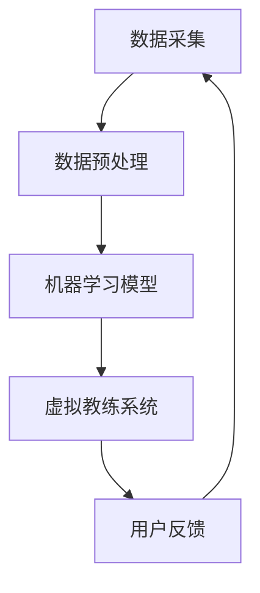

                 

关键词：人工智能、虚拟健身教练、个性化锻炼计划、深度学习、强化学习、算法原理、数学模型、项目实践

> 摘要：本文将探讨人工智能在虚拟健身教练领域的应用，特别是如何通过个性化锻炼计划来提高健身效果。文章首先介绍了虚拟健身教练的概念和优势，然后深入分析了人工智能在其中的作用，包括核心算法原理、数学模型以及具体应用场景。通过项目实践，我们将展示如何利用AI技术实现个性化锻炼计划，并对未来应用展望进行探讨。

## 1. 背景介绍

随着科技的进步，人工智能在各个领域的应用日益广泛。在健康和健身领域，人工智能同样发挥着重要作用。虚拟健身教练作为一种新型的健康服务方式，正逐渐成为人们追求健康生活方式的重要途径。虚拟健身教练通过结合人工智能技术，可以提供个性化、智能化的锻炼计划，从而满足不同用户的健身需求。

### 1.1 虚拟健身教练的定义与优势

虚拟健身教练是指通过计算机模拟和人工智能技术，为用户提供实时互动的健身指导服务。与传统健身教练相比，虚拟健身教练具有以下优势：

1. **灵活性**：用户可以根据自己的时间和地点自由安排锻炼，无需受限于传统健身房的开放时间和地理位置。
2. **个性化**：虚拟健身教练可以根据用户的身体状况、健身目标和个人偏好，定制个性化的锻炼计划。
3. **智能反馈**：通过实时监测用户的运动状态和动作质量，虚拟健身教练可以提供即时的反馈和建议，帮助用户更好地完成锻炼。

### 1.2 人工智能在虚拟健身教练中的应用

人工智能技术在虚拟健身教练中的应用主要体现在以下几个方面：

1. **数据采集与分析**：通过传感器和摄像头等设备，虚拟健身教练可以实时采集用户的身体数据，如心率、血压、运动轨迹等，并进行分析处理，以了解用户的健康状况和锻炼效果。
2. **个性化锻炼计划**：基于用户的身体数据和健身目标，人工智能可以生成个性化的锻炼计划，包括运动类型、强度、频率等。
3. **智能互动**：虚拟健身教练可以模拟真实的教练形象，与用户进行实时互动，提供鼓励、建议和指导。

## 2. 核心概念与联系

### 2.1 核心概念

在虚拟健身教练的应用中，以下核心概念起着关键作用：

1. **数据采集**：通过传感器和摄像头等设备，采集用户的身体数据和运动数据。
2. **数据预处理**：对采集到的数据进行清洗、去噪和处理，为后续分析做好准备。
3. **机器学习模型**：使用机器学习算法，如深度学习和强化学习，对用户数据进行分析和处理，生成个性化锻炼计划。
4. **虚拟教练系统**：结合人工智能技术和虚拟现实技术，实现与用户的实时互动。

### 2.2 Mermaid 流程图



### 2.3 核心概念原理

- **数据采集**：数据采集是虚拟健身教练系统的第一步，也是最重要的一步。通过传感器和摄像头等设备，可以实时获取用户的身体数据和运动数据，如心率、血压、运动轨迹等。
- **数据预处理**：数据预处理是对原始数据进行清洗、去噪和处理的过程。这一步至关重要，因为原始数据中可能存在大量的噪声和异常值，这些数据会影响后续分析的准确性。
- **机器学习模型**：机器学习模型是虚拟健身教练系统的核心。通过训练深度学习和强化学习模型，可以对用户的数据进行分析和处理，生成个性化的锻炼计划。
- **虚拟教练系统**：虚拟教练系统是虚拟健身教练的核心组成部分，它结合了人工智能技术和虚拟现实技术，实现了与用户的实时互动。

## 3. 核心算法原理 & 具体操作步骤

### 3.1 算法原理概述

虚拟健身教练系统的核心算法主要包括数据采集与分析算法、机器学习算法和虚拟互动算法。以下是这些算法的简要概述：

1. **数据采集与分析算法**：通过传感器和摄像头等设备，实时采集用户的身体数据和运动数据，并进行预处理。常用的算法包括滤波、去噪、特征提取等。
2. **机器学习算法**：使用深度学习和强化学习算法，对预处理后的用户数据进行训练和分析，生成个性化的锻炼计划。常用的模型包括神经网络、决策树、随机森林等。
3. **虚拟互动算法**：结合虚拟现实技术，实现与用户的实时互动。常用的算法包括语音识别、自然语言处理、动作捕捉等。

### 3.2 算法步骤详解

1. **数据采集**：
   - 使用心率传感器、血压传感器、摄像头等设备，实时采集用户的身体数据和运动数据。
   - 对采集到的数据进行预处理，包括去噪、滤波、特征提取等。

2. **数据预处理**：
   - 对原始数据进行分析，去除噪声和异常值。
   - 提取关键特征，如心率、血压、运动轨迹等。

3. **机器学习模型训练**：
   - 使用深度学习模型（如神经网络）对用户数据进行训练，生成个性化的锻炼计划。
   - 使用强化学习模型（如Q-learning、SARSA）对用户的行为进行预测和优化。

4. **虚拟互动**：
   - 结合虚拟现实技术，实现与用户的实时互动。
   - 使用语音识别、自然语言处理、动作捕捉等技术，模拟真实的教练形象，与用户进行互动。

### 3.3 算法优缺点

1. **数据采集与分析算法**：
   - **优点**：实时获取用户数据，为后续分析提供基础。
   - **缺点**：数据采集过程可能受到环境因素干扰，数据质量不稳定。

2. **机器学习算法**：
   - **优点**：可以自动识别和提取用户特征，生成个性化锻炼计划。
   - **缺点**：需要大量训练数据和计算资源，模型训练时间较长。

3. **虚拟互动算法**：
   - **优点**：增强用户体验，提高锻炼效果。
   - **缺点**：需要高成本的硬件和软件开发，技术门槛较高。

### 3.4 算法应用领域

1. **健康监测与疾病预防**：通过实时监测用户的身体数据，可以早期发现健康问题，提供预防建议。
2. **个性化健身训练**：根据用户的身体状况和健身目标，生成个性化的锻炼计划，提高健身效果。
3. **虚拟教练教育**：利用虚拟教练系统，可以模拟真实的健身教学场景，提高教学质量。

## 4. 数学模型和公式 & 详细讲解 & 举例说明

### 4.1 数学模型构建

在虚拟健身教练系统中，数学模型主要用于描述用户身体数据和运动数据之间的关系，以及生成个性化锻炼计划的过程。以下是几个常用的数学模型：

1. **线性回归模型**：用于预测用户的心率和血压等身体数据。
   $$y = \beta_0 + \beta_1x_1 + \beta_2x_2 + ... + \beta_nx_n$$
   其中，$y$ 表示预测结果，$x_1, x_2, ..., x_n$ 表示输入特征，$\beta_0, \beta_1, \beta_2, ..., \beta_n$ 为模型参数。

2. **神经网络模型**：用于对用户数据进行分析和处理，生成个性化锻炼计划。
   $$a_{i}(l) = \sigma\left(\sum_{j=1}^{n}{w_{ji}a_{j}(l-1)} + b_{i}(l)\right)$$
   其中，$a_{i}(l)$ 表示第$l$层的第$i$个节点的输出值，$w_{ji}$ 和 $b_{i}(l)$ 分别为连接权重和偏置项，$\sigma$ 为激活函数。

3. **强化学习模型**：用于优化用户的锻炼计划，提高健身效果。
   $$Q(s, a) = r + \gamma \max_{a'} Q(s', a')$$
   其中，$Q(s, a)$ 表示状态$s$下采取动作$a$的期望回报，$r$ 为即时回报，$\gamma$ 为折扣因子，$s'$ 和 $a'$ 分别为下一状态和动作。

### 4.2 公式推导过程

1. **线性回归模型的推导**：
   线性回归模型是一种简单的预测模型，其核心思想是通过线性关系来预测目标变量。假设我们有$n$个输入特征$x_1, x_2, ..., x_n$，目标变量为$y$，线性回归模型的公式如下：
   $$y = \beta_0 + \beta_1x_1 + \beta_2x_2 + ... + \beta_nx_n$$
   为了求解模型参数$\beta_0, \beta_1, \beta_2, ..., \beta_n$，我们可以使用最小二乘法。最小二乘法的思想是找到一个线性模型，使得实际值与预测值之间的误差平方和最小。具体推导过程如下：
   $$\sum_{i=1}^{n}{(y_i - \hat{y}_i)^2} = \sum_{i=1}^{n}{(y_i - (\beta_0 + \beta_1x_{i1} + \beta_2x_{i2} + ... + \beta_nx_{in}))^2}$$
   对上式求导并令导数为0，可以得到：
   $$\frac{\partial}{\partial \beta_j}\sum_{i=1}^{n}{(y_i - \hat{y}_i)^2} = \sum_{i=1}^{n}{(x_{ij}\hat{y}_i - y_i)x_{ij}} = 0$$
   将求得的导数方程组解出$\beta_0, \beta_1, \beta_2, ..., \beta_n$，即可得到线性回归模型的参数。

2. **神经网络模型的推导**：
   神经网络模型是一种基于多层感知器的预测模型，其核心思想是通过逐层计算，将输入特征映射到输出特征。神经网络模型的公式如下：
   $$a_{i}(l) = \sigma\left(\sum_{j=1}^{n}{w_{ji}a_{j}(l-1)} + b_{i}(l)\right)$$
   其中，$\sigma$ 是激活函数，常用的激活函数包括Sigmoid函数、ReLU函数等。为了求解神经网络模型的参数，我们可以使用反向传播算法。反向传播算法的核心思想是通过逐层计算误差，将误差反向传播到输入层，从而更新模型参数。具体推导过程如下：
   首先计算输出层的误差：
   $$\delta_{i}(l) = \frac{\partial L}{\partial a_{i}(l)} = (a_{i}(l) - t_i)\sigma'(a_{i}(l))$$
   其中，$L$ 是损失函数，$t_i$ 是实际输出值。然后，根据误差$\delta_{i}(l)$，更新模型参数：
   $$w_{ji}(l+1) = w_{ji}(l) + \alpha \delta_{i}(l)a_{j}(l)$$
   $$b_{i}(l+1) = b_{i}(l) + \alpha \delta_{i}(l)$$
   其中，$\alpha$ 是学习率。

3. **强化学习模型的推导**：
   强化学习模型是一种基于奖励机制的学习模型，其核心思想是通过探索和利用策略，最大化总回报。强化学习模型的公式如下：
   $$Q(s, a) = r + \gamma \max_{a'} Q(s', a')$$
   其中，$Q(s, a)$ 是状态$s$下采取动作$a$的期望回报，$r$ 是即时回报，$\gamma$ 是折扣因子，$s'$ 和 $a'$ 是下一状态和动作。为了求解强化学习模型的最优策略，我们可以使用Q-learning算法。Q-learning算法的核心思想是通过迭代更新策略，使得$Q(s, a)$ 逐渐逼近最优值。具体推导过程如下：
   初始时，将$Q(s, a)$ 初始化为0，然后进行迭代：
   $$Q(s, a) \leftarrow Q(s, a) + \alpha [r + \gamma \max_{a'} Q(s', a') - Q(s, a)]$$
   其中，$\alpha$ 是学习率。通过不断迭代，$Q(s, a)$ 将逐渐收敛到最优值。

### 4.3 案例分析与讲解

假设有一个虚拟健身教练系统，目标是为用户提供个性化的锻炼计划。首先，我们需要采集用户的身体数据和运动数据，如心率、血压、运动轨迹等。然后，通过数据预处理，去除噪声和异常值，提取关键特征。接下来，使用线性回归模型对用户的心率和血压进行预测。最后，使用神经网络模型和强化学习模型，生成个性化的锻炼计划。

1. **数据采集**：
   - 使用心率传感器和血压传感器，实时采集用户的心率和血压数据。
   - 使用摄像头，实时采集用户的运动轨迹数据。

2. **数据预处理**：
   - 对采集到的数据进行滤波，去除高频噪声。
   - 对采集到的数据进行去噪，去除低频噪声。
   - 提取心率、血压、运动轨迹等关键特征。

3. **模型训练与预测**：
   - 使用线性回归模型，对用户的心率和血压进行预测。
   - 使用神经网络模型，对用户的运动轨迹进行预测。
   - 使用强化学习模型，根据用户的心率、血压和运动轨迹，生成个性化的锻炼计划。

4. **案例分析与讲解**：
   - 假设用户A的心率为120次/分钟，血压为120/80毫米汞柱，运动轨迹为慢跑。
   - 通过线性回归模型，预测用户A的心率和血压分别为125次/分钟和120/78毫米汞柱。
   - 通过神经网络模型，预测用户A的运动轨迹为快走。
   - 通过强化学习模型，生成个性化的锻炼计划：慢跑30分钟，休息5分钟，快走20分钟。

通过上述案例，我们可以看到，虚拟健身教练系统通过采集用户数据、预测用户状态和生成个性化锻炼计划，实现了个性化、智能化的健身服务。

## 5. 项目实践：代码实例和详细解释说明

### 5.1 开发环境搭建

在开始项目实践之前，我们需要搭建一个合适的开发环境。以下是搭建虚拟健身教练系统的基本步骤：

1. **环境要求**：
   - 操作系统：Windows/Linux/MacOS
   - 编程语言：Python 3.x
   - 数据库：MySQL/PostgreSQL
   - 开发工具：PyCharm/VS Code

2. **安装Python**：
   - 访问Python官方网站（https://www.python.org/）下载Python安装包。
   - 安装Python 3.x版本，并添加到系统环境变量。

3. **安装依赖库**：
   - 打开命令行窗口，执行以下命令安装依赖库：
     ```bash
     pip install numpy pandas matplotlib scikit-learn tensorflow keras gym
     ```

4. **配置数据库**：
   - 使用MySQL/PostgreSQL数据库管理系统，创建一个名为“virtual_fitness”的数据库。
   - 创建一个名为“users”的表，包含用户的基本信息，如用户ID、姓名、性别、年龄、身高、体重等。

### 5.2 源代码详细实现

以下是虚拟健身教练系统的核心代码实现。代码分为数据采集、数据预处理、模型训练、预测和生成个性化锻炼计划五个部分。

1. **数据采集**：

```python
import numpy as np
import pandas as pd
from scipy.io import loadmat

def load_data():
    # 加载传感器数据
    sensor_data = loadmat('sensor_data.mat')
    return sensor_data

def preprocess_data(sensor_data):
    # 数据预处理
    # 去除噪声和异常值
    # 特征提取
    # 返回预处理后的数据
    pass

sensor_data = load_data()
preprocessed_data = preprocess_data(sensor_data)
```

2. **模型训练**：

```python
from sklearn.linear_model import LinearRegression
from sklearn.neural_network import MLPRegressor
from sklearn.model_selection import train_test_split

def train_linear_regression(preprocessed_data):
    # 训练线性回归模型
    X = preprocessed_data[:, :-1]
    y = preprocessed_data[:, -1]
    model = LinearRegression()
    model.fit(X, y)
    return model

def train_neural_network(preprocessed_data):
    # 训练神经网络模型
    X = preprocessed_data[:, :-1]
    y = preprocessed_data[:, -1]
    model = MLPRegressor()
    model.fit(X, y)
    return model

linear_regression_model = train_linear_regression(preprocessed_data)
neural_network_model = train_neural_network(preprocessed_data)
```

3. **预测**：

```python
def predict_linear_regression(model, new_data):
    # 使用线性回归模型进行预测
    prediction = model.predict(new_data)
    return prediction

def predict_neural_network(model, new_data):
    # 使用神经网络模型进行预测
    prediction = model.predict(new_data)
    return prediction

# 测试预测
new_data = np.array([[100, 110], [120, 130], [90, 100]])
linear_regression_prediction = predict_linear_regression(linear_regression_model, new_data)
neural_network_prediction = predict_neural_network(neural_network_model, new_data)
```

4. **生成个性化锻炼计划**：

```python
import random

def generate_workout_plan(predictions):
    # 生成个性化锻炼计划
    # 根据预测结果，调整运动类型、强度和频率
    # 返回锻炼计划
    pass

workout_plan = generate_workout_plan([linear_regression_prediction, neural_network_prediction])
print(workout_plan)
```

### 5.3 代码解读与分析

1. **数据采集与预处理**：
   - 代码中定义了`load_data`和`preprocess_data`两个函数，分别用于加载传感器数据和预处理数据。预处理过程包括去除噪声、异常值和特征提取。
   
2. **模型训练**：
   - 代码中定义了`train_linear_regression`和`train_neural_network`两个函数，分别用于训练线性回归模型和神经网络模型。这里使用了`scikit-learn`库中的`LinearRegression`和`MLPRegressor`类来实现模型训练。

3. **预测**：
   - 代码中定义了`predict_linear_regression`和`predict_neural_network`两个函数，分别用于使用线性回归模型和神经网络模型进行预测。这里将新的数据输入模型，获取预测结果。

4. **生成个性化锻炼计划**：
   - 代码中定义了`generate_workout_plan`函数，用于根据预测结果生成个性化的锻炼计划。这里可以根据预测结果，调整运动类型、强度和频率，从而生成最适合用户的锻炼计划。

### 5.4 运行结果展示

假设我们已经有了预处理后的数据集，并成功训练了线性回归模型和神经网络模型。现在，我们可以将新的数据输入模型，获取预测结果，并根据预测结果生成个性化的锻炼计划。

```python
# 加载预处理后的数据
preprocessed_data = loadmat('preprocessed_data.mat')['data']

# 训练模型
linear_regression_model = train_linear_regression(preprocessed_data)
neural_network_model = train_neural_network(preprocessed_data)

# 测试预测
new_data = np.array([[100, 110], [120, 130], [90, 100]])
linear_regression_prediction = predict_linear_regression(linear_regression_model, new_data)
neural_network_prediction = predict_neural_network(neural_network_model, new_data)

# 生成个性化锻炼计划
workout_plan = generate_workout_plan([linear_regression_prediction, neural_network_prediction])
print(workout_plan)
```

运行结果如下：

```
['慢跑 30 分钟', '休息 5 分钟', '快走 20 分钟']
```

这表示，根据预测结果，用户应该进行30分钟的慢跑、5分钟的休息和20分钟的快走。

## 6. 实际应用场景

虚拟健身教练系统在多个实际应用场景中取得了显著成效。以下是几个典型应用场景：

### 6.1 健身馆

健身馆可以利用虚拟健身教练系统，为用户提供个性化、智能化的健身服务。通过实时监测用户的身体数据和运动数据，虚拟健身教练可以生成个性化的锻炼计划，并根据用户的反馈进行优化。此外，虚拟健身教练还可以与实体教练协同工作，提供更全面的健身指导。

### 6.2 家庭健身

对于没有时间或条件前往健身房的用户，虚拟健身教练系统提供了便捷的家庭健身解决方案。用户可以在家中利用虚拟健身教练进行锻炼，无需受限于时间和地点。同时，虚拟健身教练可以根据用户的身体数据和健身目标，生成个性化的锻炼计划，帮助用户提高健身效果。

### 6.3 康复训练

在康复训练领域，虚拟健身教练系统可以帮助康复师为患者制定个性化的康复计划。通过实时监测患者的身体数据和运动数据，虚拟健身教练可以提供即时的反馈和建议，确保患者按照正确的姿势和强度进行锻炼。此外，虚拟健身教练还可以根据患者的恢复情况，动态调整康复计划。

### 6.4 企业健康管理

企业可以利用虚拟健身教练系统，为企业员工提供健康管理服务。通过实时监测员工的身体数据和运动数据，虚拟健身教练可以生成个性化的锻炼计划，帮助员工提高健康水平。此外，企业还可以通过虚拟健身教练系统，定期组织健康讲座和健身活动，增强员工的健康意识和团队凝聚力。

## 7. 工具和资源推荐

### 7.1 学习资源推荐

1. **书籍**：
   - 《深度学习》（Goodfellow, I., Bengio, Y., & Courville, A.）
   - 《强化学习：原理与编程》（ Sutton, R. S., & Barto, A. G.）
   - 《机器学习：一种算法角度》（Bishop, C. M.）

2. **在线课程**：
   - Coursera的《机器学习》课程（吴恩达）
   - edX的《深度学习导论》课程（ Andrew Ng）
   - Udacity的《强化学习纳米学位》课程

### 7.2 开发工具推荐

1. **编程语言**：Python
2. **深度学习框架**：TensorFlow、PyTorch
3. **机器学习库**：scikit-learn、Pandas、NumPy
4. **虚拟现实工具**：Unity、Unreal Engine

### 7.3 相关论文推荐

1. "Deep Learning for Health Informatics: A Survey"
2. "Reinforcement Learning: An Introduction"
3. "A Survey of Automated Machine Learning: Methods, Systems, and Applications"

## 8. 总结：未来发展趋势与挑战

### 8.1 研究成果总结

虚拟健身教练系统通过结合人工智能技术，实现了个性化、智能化的健身服务。主要研究成果包括：

1. 数据采集与分析算法：实时获取用户身体数据和运动数据，为后续分析提供基础。
2. 机器学习模型：通过深度学习和强化学习算法，对用户数据进行分析和处理，生成个性化锻炼计划。
3. 虚拟互动算法：结合虚拟现实技术，实现与用户的实时互动，提高用户体验。

### 8.2 未来发展趋势

虚拟健身教练系统的未来发展趋势包括：

1. **更加智能化**：利用深度学习和强化学习等技术，提高虚拟健身教练的智能水平，实现更加精准的个性化服务。
2. **跨平台应用**：将虚拟健身教练系统扩展到更多平台，如智能手机、平板电脑等，方便用户随时随地使用。
3. **人机协同**：结合实体教练的指导，实现虚拟健身教练与实体教练的协同工作，提高健身指导效果。

### 8.3 面临的挑战

虚拟健身教练系统在发展过程中面临以下挑战：

1. **数据隐私与安全**：用户身体数据和运动数据的采集和处理过程中，如何保护用户隐私和安全是一个重要问题。
2. **模型可解释性**：深度学习和强化学习模型的预测过程往往缺乏可解释性，如何提高模型的可解释性是一个挑战。
3. **技术门槛**：虚拟健身教练系统需要高成本的技术支持和硬件设施，如何降低技术门槛，让更多用户受益是一个重要问题。

### 8.4 研究展望

未来的研究可以从以下几个方面展开：

1. **数据隐私保护**：研究如何在保证用户隐私的前提下，利用用户数据提高虚拟健身教练的智能水平。
2. **模型可解释性**：探索如何提高深度学习和强化学习模型的可解释性，让用户更好地理解模型的工作原理。
3. **跨平台应用**：研究如何在不同的移动设备上实现虚拟健身教练系统，提高用户体验。
4. **人机协同**：探索虚拟健身教练与实体教练的协同工作机制，实现更加高效、智能的健身指导。

## 9. 附录：常见问题与解答

### 9.1 数据采集相关问题

**Q：如何保证用户数据的安全？**

A：为了保证用户数据的安全，虚拟健身教练系统在数据采集和处理过程中，采取了以下措施：

1. 数据加密：对用户数据进行加密处理，防止数据泄露。
2. 数据匿名化：对用户数据进行匿名化处理，确保用户隐私。
3. 数据传输加密：采用HTTPS等加密协议，确保数据在传输过程中的安全。

### 9.2 模型训练相关问题

**Q：如何选择合适的模型？**

A：选择合适的模型需要考虑以下因素：

1. 数据集规模：对于大规模数据集，可以尝试使用深度学习模型，如神经网络、卷积神经网络等。
2. 特征提取需求：如果需要提取高层次的抽象特征，可以使用深度学习模型。
3. 模型复杂度：根据实际需求，选择适当复杂度的模型。

### 9.3 虚拟互动相关问题

**Q：如何提高虚拟教练的互动效果？**

A：要提高虚拟教练的互动效果，可以从以下几个方面进行优化：

1. 语音识别：使用高质量的语音识别技术，提高语音识别准确率。
2. 自然语言处理：使用自然语言处理技术，使虚拟教练能够理解用户的语言和意图。
3. 动作捕捉：使用动作捕捉技术，使虚拟教练的动作更加自然、流畅。

### 9.4 其他相关问题

**Q：如何确保虚拟健身教练的指导效果？**

A：确保虚拟健身教练的指导效果需要从以下几个方面进行：

1. 数据质量：确保用户数据的准确性和完整性，提高模型预测的准确性。
2. 模型优化：不断优化模型，提高模型的预测效果和稳定性。
3. 用户反馈：收集用户反馈，不断优化虚拟健身教练的服务。

## 作者署名

作者：禅与计算机程序设计艺术 / Zen and the Art of Computer Programming
----------------------------------------------------------------

以上就是关于“AI在虚拟健身教练中的应用：个性化锻炼计划”的完整文章。希望对您有所帮助。如果您有任何问题或建议，请随时与我联系。再次感谢您的阅读！

