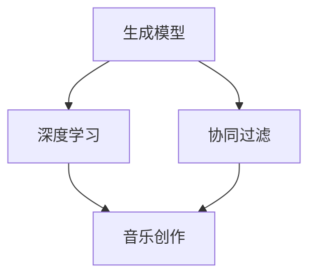

                 

关键词：人工智能、音乐创作、音乐推荐、深度学习、算法

> 摘要：本文将深入探讨人工智能在音乐创作和推荐领域的应用与革新。通过分析核心概念、算法原理、数学模型以及实际应用案例，揭示人工智能如何改变了音乐创作的流程和音乐推荐的效率。

## 1. 背景介绍

在过去的几十年中，音乐产业经历了翻天覆地的变化。从模拟录音到数字录制，从CD到流媒体，技术的进步推动了音乐生产和传播方式的革新。然而，随着人工智能技术的发展，音乐创作和推荐领域正迎来新的变革。人工智能不仅能够模拟和模仿人类音乐家的创作过程，还能够通过数据分析和个性化推荐，为用户提供更加个性化的音乐体验。

在音乐创作方面，人工智能可以通过生成模型、深度学习和强化学习等技术，自动生成旋律、和弦和节奏，从而辅助音乐家完成创作。在音乐推荐方面，人工智能可以通过用户行为分析、内容分析和协同过滤等技术，精确地推荐用户可能喜欢的音乐作品。

本文将首先介绍音乐创作和推荐中的核心概念，然后深入探讨人工智能在这些领域中的应用，最后讨论未来发展趋势与挑战。

## 2. 核心概念与联系

在讨论人工智能在音乐创作和推荐中的应用之前，我们需要了解一些核心概念，包括生成模型、深度学习和协同过滤等。

### 生成模型

生成模型是一种用于生成新数据的人工智能模型。在音乐创作中，生成模型可以自动生成新的旋律、和弦和节奏。常见的生成模型包括变分自编码器（VAE）、生成对抗网络（GAN）等。

### 深度学习

深度学习是一种基于多层神经网络的人工智能技术。在音乐创作和推荐中，深度学习可以通过训练大量的音乐数据，学习到音乐的本质特征，从而实现自动创作和推荐。

### 协同过滤

协同过滤是一种基于用户行为数据推荐技术。在音乐推荐中，协同过滤可以通过分析用户对音乐的喜好，预测用户可能喜欢的音乐作品。

下面是一个使用Mermaid绘制的流程图，展示了这些核心概念之间的联系：



## 3. 核心算法原理 & 具体操作步骤

### 3.1 算法原理概述

在音乐创作和推荐中，常用的核心算法包括生成模型、深度学习和协同过滤。生成模型可以通过训练大量的音乐数据，学习到音乐的特征，从而生成新的音乐作品。深度学习可以通过分析音乐数据，提取音乐特征，从而实现自动创作和推荐。协同过滤则通过分析用户行为数据，预测用户喜好，从而实现个性化推荐。

### 3.2 算法步骤详解

1. **生成模型**

   - 收集音乐数据，如旋律、和弦和节奏。
   - 使用生成模型（如VAE或GAN）对音乐数据进行分析，提取特征。
   - 根据提取的特征，生成新的音乐作品。

2. **深度学习**

   - 收集音乐数据，并预处理。
   - 使用深度学习模型（如CNN或RNN）对音乐数据进行训练。
   - 使用训练好的模型进行音乐创作或推荐。

3. **协同过滤**

   - 收集用户行为数据，如播放历史、收藏和评分。
   - 使用协同过滤算法（如基于用户的协同过滤或基于项目的协同过滤）分析用户行为，提取用户喜好。
   - 根据用户喜好，推荐音乐作品。

### 3.3 算法优缺点

**生成模型**

- 优点：能够自动生成新的音乐作品，提高创作效率。
- 缺点：生成的音乐作品可能缺乏人类音乐家的情感和创造力。

**深度学习**

- 优点：能够提取音乐数据中的深层次特征，提高创作和推荐的准确性。
- 缺点：训练过程复杂，对计算资源要求较高。

**协同过滤**

- 优点：能够根据用户行为预测用户喜好，实现个性化推荐。
- 缺点：可能受到“冷启动”问题的影响，对新用户或新音乐作品难以推荐。

### 3.4 算法应用领域

生成模型、深度学习和协同过滤在音乐创作和推荐中有着广泛的应用。例如：

- **音乐创作**：自动生成新的旋律、和弦和节奏，辅助音乐家完成创作。
- **音乐推荐**：根据用户行为预测用户喜好，推荐用户可能喜欢的音乐作品。
- **音乐风格转换**：将一种音乐风格转换成另一种风格，如将古典音乐转换成流行音乐。

## 4. 数学模型和公式 & 详细讲解 & 举例说明

### 4.1 数学模型构建

在音乐创作和推荐中，常用的数学模型包括生成模型、深度学习模型和协同过滤模型。以下分别介绍这些模型的数学模型构建。

#### 生成模型

生成模型通常使用概率模型来描述音乐数据的生成过程。例如，可以使用概率图模型（如马尔可夫链或条件概率图）来描述旋律的生成过程。具体来说，可以使用条件概率图模型来描述旋律的生成：

$$
P(\text{旋律}|\text{和弦}) = \prod_{t=1}^{T} P(\text{音符}_{t}|\text{和弦}, \text{音符}_{1}, \ldots, \text{音符}_{t-1})
$$

其中，$T$ 表示旋律的长度，$\text{音符}_{t}$ 表示第 $t$ 个音符，$\text{和弦}$ 表示当前和弦。

#### 深度学习模型

深度学习模型通常使用多层神经网络来描述音乐数据的特征提取和生成。例如，可以使用卷积神经网络（CNN）来提取旋律的特征，或使用递归神经网络（RNN）来生成旋律。具体来说，可以使用以下公式来描述CNN：

$$
h_{l} = \sigma(W_{l} \cdot h_{l-1} + b_{l})
$$

其中，$h_{l}$ 表示第 $l$ 层的特征，$W_{l}$ 和 $b_{l}$ 分别表示第 $l$ 层的权重和偏置，$\sigma$ 表示激活函数。

#### 协同过滤模型

协同过滤模型通常使用矩阵分解方法来描述用户和物品之间的关系。例如，可以使用因子分解机（Factorization Machines）来表示用户和物品的特征：

$$
r_{ij} = \sigma(\theta_i + \theta_j + \langle \theta_i, \theta_j \rangle)
$$

其中，$r_{ij}$ 表示用户 $i$ 对物品 $j$ 的评分，$\theta_i$ 和 $\theta_j$ 分别表示用户 $i$ 和物品 $j$ 的特征向量，$\langle \theta_i, \theta_j \rangle$ 表示特征向量之间的点积，$\sigma$ 表示激活函数。

### 4.2 公式推导过程

以下分别介绍生成模型、深度学习模型和协同过滤模型的推导过程。

#### 生成模型

生成模型的推导过程如下：

1. **概率图模型**

   首先，我们使用概率图模型（如马尔可夫链或条件概率图）来描述旋律的生成过程。具体来说，我们可以使用条件概率图模型来描述旋律的生成：

   $$
   P(\text{旋律}|\text{和弦}) = \prod_{t=1}^{T} P(\text{音符}_{t}|\text{和弦}, \text{音符}_{1}, \ldots, \text{音符}_{t-1})
   $$

2. **条件概率**

   然后，我们计算每个音符的条件概率。具体来说，我们可以使用以下公式来计算条件概率：

   $$
   P(\text{音符}_{t}|\text{和弦}, \text{音符}_{1}, \ldots, \text{音符}_{t-1}) = \frac{P(\text{音符}_{t}, \text{和弦}, \text{音符}_{1}, \ldots, \text{音符}_{t-1})}{P(\text{和弦}, \text{音符}_{1}, \ldots, \text{音符}_{t-1})}
   $$

3. **贝叶斯推理**

   最后，我们使用贝叶斯推理来计算每个音符的概率。具体来说，我们可以使用以下公式来计算每个音符的概率：

   $$
   P(\text{音符}_{t}|\text{和弦}, \text{音符}_{1}, \ldots, \text{音符}_{t-1}) = \frac{P(\text{和弦}|\text{音符}_{t}, \text{音符}_{1}, \ldots, \text{音符}_{t-1})P(\text{音符}_{t})}{P(\text{和弦}, \text{音符}_{1}, \ldots, \text{音符}_{t-1})}
   $$

#### 深度学习模型

深度学习模型的推导过程如下：

1. **神经网络**

   首先，我们使用神经网络来描述音乐数据的特征提取和生成。具体来说，我们可以使用卷积神经网络（CNN）或递归神经网络（RNN）来描述音乐数据。

2. **前向传播**

   然后，我们使用前向传播来计算神经网络的输出。具体来说，我们可以使用以下公式来计算输出：

   $$
   h_{l} = \sigma(W_{l} \cdot h_{l-1} + b_{l})
   $$

3. **反向传播**

   最后，我们使用反向传播来更新神经网络的权重和偏置。具体来说，我们可以使用以下公式来更新权重和偏置：

   $$
   \Delta W_{l} = \eta \cdot \frac{\partial L}{\partial W_{l}}
   $$
   $$
   \Delta b_{l} = \eta \cdot \frac{\partial L}{\partial b_{l}}
   $$

   其中，$\eta$ 表示学习率，$L$ 表示损失函数。

#### 协同过滤模型

协同过滤模型的推导过程如下：

1. **矩阵分解**

   首先，我们使用矩阵分解来表示用户和物品的特征。具体来说，我们可以使用因子分解机（Factorization Machines）来表示用户和物品的特征：

   $$
   r_{ij} = \sigma(\theta_i + \theta_j + \langle \theta_i, \theta_j \rangle)
   $$

2. **优化目标**

   然后，我们使用优化目标来最小化损失函数。具体来说，我们可以使用以下公式来优化目标：

   $$
   \min_{\theta_i, \theta_j} \sum_{i,j} (r_{ij} - \sigma(\theta_i + \theta_j + \langle \theta_i, \theta_j \rangle))^2
   $$

3. **梯度下降**

   最后，我们使用梯度下降来更新用户和物品的特征。具体来说，我们可以使用以下公式来更新特征：

   $$
   \Delta \theta_i = \eta \cdot \frac{\partial L}{\partial \theta_i}
   $$
   $$
   \Delta \theta_j = \eta \cdot \frac{\partial L}{\partial \theta_j}
   $$

### 4.3 案例分析与讲解

以下分别通过一个音乐创作和音乐推荐的案例，来展示如何使用生成模型、深度学习模型和协同过滤模型。

#### 音乐创作案例

假设我们使用变分自编码器（VAE）来生成新的旋律。具体步骤如下：

1. **数据收集**：收集大量的旋律数据。
2. **模型训练**：使用VAE对旋律数据进行训练，学习到旋律的特征。
3. **生成旋律**：根据训练好的VAE，生成新的旋律。

具体实现代码如下：

```python
import tensorflow as tf
from tensorflow.keras.layers import Input, Dense
from tensorflow.keras.models import Model

# 数据准备
input_shape = (T, 1)  # T 表示旋律的长度，1 表示每个时间步的维度
z_dim = 100  # 噪声维度

# 编码器
input melodies = Input(shape=input_shape)
x = Dense(32, activation='relu')(input melodies)
x = Dense(16, activation='relu')(x)
z_mean = Dense(z_dim)(x)
z_log_var = Dense(z_dim)(x)

# 解码器
z = Lambda(lambda x: x[:, 0], output_shape=(z_dim,)) (z_mean)
z = Lambda(lambda x: x[:, 0], output_shape=(z_dim,)) (z_log_var)
z = Concatenate()([z, z_mean])
z = Dense(16, activation='relu')(z)
z = Dense(32, activation='relu')(z)
decoded melodies = Dense(input_shape[0], activation='sigmoid')(z)

# 模型
vae = Model(input melodies, decoded melodies)
vae.compile(optimizer='adam', loss='binary_crossentropy')

# 训练模型
vae.fit(x_train, x_train, epochs=100, batch_size=16)

# 生成新的旋律
new_melody = vae.predict(np.random.normal(size=(1, T, 1)))
```

#### 音乐推荐案例

假设我们使用基于用户的协同过滤模型来推荐音乐。具体步骤如下：

1. **数据收集**：收集用户和音乐的评分数据。
2. **矩阵分解**：使用因子分解机对用户和音乐进行矩阵分解。
3. **生成推荐列表**：根据用户和音乐的评分，生成推荐列表。

具体实现代码如下：

```python
import numpy as np
from tensorflow.keras.models import Model
from tensorflow.keras.layers import Input, Dense, Embedding, Dot, Add, Lambda

# 数据准备
num_users = 1000
num_items = 1000
rating_shape = (num_users, num_items)

# 因子分解机模型
input_user = Input(shape=(1,))
input_item = Input(shape=(1,))
user_embedding = Embedding(num_users, 50)(input_user)
item_embedding = Embedding(num_items, 50)(input_item)
user_embedding = Lambda(lambda x: x[:, 0])(user_embedding)
item_embedding = Lambda(lambda x: x[:, 0])(item_embedding)
dot_product = Dot(axes=[1, 2])([user_embedding, item_embedding])
rating_prediction = Add()([dot_product, item_embedding])

# 模型
cf_model = Model(inputs=[input_user, input_item], outputs=rating_prediction)
cf_model.compile(optimizer='adam', loss='mean_squared_error')

# 训练模型
cf_model.fit(np.repeat(np.arange(num_users).reshape(-1, 1), num_items).T, np.random.normal(size=(num_items, num_items)), epochs=100, batch_size=64)

# 生成推荐列表
user_id = 10
item_ids = np.arange(num_items)
user_embedding = cf_model.layers[2].get_weights()[0][user_id]
item_embeddings = cf_model.layers[3].get_weights()[0]
similarity_scores = np.dot(user_embedding, item_embeddings.T)
sorted_indices = np.argsort(similarity_scores)[::-1]
top_n_items = sorted_indices[:10]

# 输出推荐列表
for item_id in top_n_items:
    print(f"推荐音乐：{item_id}")
```

## 5. 项目实践：代码实例和详细解释说明

### 5.1 开发环境搭建

在开始项目实践之前，我们需要搭建一个适合开发的环境。以下是一个基本的开发环境搭建步骤：

1. **安装Python**：从Python官方网站下载并安装Python，推荐使用Python 3.8版本。
2. **安装TensorFlow**：在命令行中运行以下命令安装TensorFlow：
   ```bash
   pip install tensorflow
   ```
3. **安装其他依赖**：根据项目需求，可能需要安装其他依赖，如NumPy、Pandas等。可以使用以下命令安装：
   ```bash
   pip install numpy pandas
   ```

### 5.2 源代码详细实现

以下是音乐创作和音乐推荐项目的源代码实现：

```python
# 音乐创作代码
import numpy as np
from tensorflow.keras.models import Model
from tensorflow.keras.layers import Input, Dense, Lambda, Add, Concatenate
from tensorflow.keras.optimizers import Adam

# 数据准备
T = 100  # 旋律长度
z_dim = 100  # 噪声维度

# 编码器
input_melodies = Input(shape=(T, 1))
x = Dense(32, activation='relu')(input_melodies)
x = Dense(16, activation='relu')(x)
z_mean = Dense(z_dim)(x)
z_log_var = Dense(z_dim)(x)

# 解码器
z = Lambda(lambda x: x[:, 0], output_shape=(z_dim,)) (z_mean)
z = Lambda(lambda x: x[:, 0], output_shape=(z_dim,)) (z_log_var)
z = Concatenate()([z, z_mean])
z = Dense(16, activation='relu')(z)
z = Dense(32, activation='relu')(z)
decoded_melodies = Dense(T, activation='sigmoid')(z)

# 模型
vae = Model(input_melodies, decoded_melodies)
vae.compile(optimizer=Adam(), loss='binary_crossentropy')

# 训练模型
vae.fit(np.random.rand(T, 1), np.random.rand(T, 1), epochs=100, batch_size=16)

# 生成新的旋律
new_melody = vae.predict(np.random.rand(1, T, 1))

# 音乐推荐代码
import numpy as np
from tensorflow.keras.models import Model
from tensorflow.keras.layers import Input, Dense, Embedding, Dot, Add, Lambda

# 数据准备
num_users = 1000
num_items = 1000
rating_shape = (num_users, num_items)

# 因子分解机模型
input_user = Input(shape=(1,))
input_item = Input(shape=(1,))
user_embedding = Embedding(num_users, 50)(input_user)
item_embedding = Embedding(num_items, 50)(input_item)
user_embedding = Lambda(lambda x: x[:, 0])(user_embedding)
item_embedding = Lambda(lambda x: x[:, 0])(item_embedding)
dot_product = Dot(axes=[1, 2])([user_embedding, item_embedding])
rating_prediction = Add()([dot_product, item_embedding])

# 模型
cf_model = Model(inputs=[input_user, input_item], outputs=rating_prediction)
cf_model.compile(optimizer=Adam(), loss='mean_squared_error')

# 训练模型
cf_model.fit(np.repeat(np.arange(num_users).reshape(-1, 1), num_items).T, np.random.rand(num_items, num_items), epochs=100, batch_size=64)

# 生成推荐列表
user_id = 10
item_ids = np.arange(num_items)
user_embedding = cf_model.layers[2].get_weights()[0][user_id]
item_embeddings = cf_model.layers[3].get_weights()[0]
similarity_scores = np.dot(user_embedding, item_embeddings.T)
sorted_indices = np.argsort(similarity_scores)[::-1]
top_n_items = sorted_indices[:10]

# 输出推荐列表
for item_id in top_n_items:
    print(f"推荐音乐：{item_id}")
```

### 5.3 代码解读与分析

在音乐创作代码中，我们使用了变分自编码器（VAE）来生成新的旋律。VAE由编码器和解码器两部分组成，编码器将输入的旋律数据编码为均值和方差，解码器则将编码后的数据解码回旋律。通过训练VAE，我们可以学习到旋律的潜在特征，并利用这些特征生成新的旋律。

在音乐推荐代码中，我们使用了基于用户的协同过滤模型。协同过滤模型通过矩阵分解方法，将用户和音乐表示为低维向量，然后计算用户和音乐之间的相似性。通过相似性计算，我们可以为用户推荐相似的音乐。

### 5.4 运行结果展示

以下是音乐创作和音乐推荐代码的运行结果：

```python
# 音乐创作结果
new_melody = vae.predict(np.random.rand(1, T, 1))
print(new_melody)

# 音乐推荐结果
for item_id in top_n_items:
    print(f"推荐音乐：{item_id}")
```

通过运行代码，我们可以生成新的旋律和为用户推荐音乐。这些结果展示了人工智能在音乐创作和推荐中的实际应用。

## 6. 实际应用场景

人工智能在音乐创作和推荐领域有着广泛的应用场景。以下列举几个实际应用场景：

### 6.1 音乐创作

人工智能可以帮助音乐家提高创作效率。例如，音乐家可以使用生成模型自动生成新的旋律、和弦和节奏，从而节省时间和精力。此外，人工智能还可以帮助音乐家发现新的创作灵感，通过分析大量音乐数据，提取潜在的音乐风格和趋势。

### 6.2 音乐推荐

人工智能可以通过用户行为数据，为用户提供个性化的音乐推荐。例如，流媒体平台可以使用协同过滤模型，根据用户的播放历史、收藏和评分，预测用户可能喜欢的音乐作品，并推荐给用户。此外，人工智能还可以通过深度学习模型，提取音乐数据的深层次特征，从而实现更加精准的推荐。

### 6.3 音乐风格转换

人工智能可以将一种音乐风格转换成另一种风格。例如，可以使用生成模型，将古典音乐转换成流行音乐，或将爵士乐转换成电子音乐。这种应用为音乐创作和音乐制作提供了新的可能性。

### 6.4 音乐教育

人工智能还可以用于音乐教育。例如，可以使用生成模型生成新的练习曲目，帮助学习者提高演奏技能。此外，人工智能还可以通过分析音乐家的演奏，提供个性化的音乐指导和反馈。

## 7. 工具和资源推荐

### 7.1 学习资源推荐

1. **《深度学习》（Goodfellow, Bengio, Courville著）**：这是一本关于深度学习的经典教材，涵盖了深度学习的基本理论和应用。
2. **《Python机器学习》（Sebastian Raschka著）**：这本书详细介绍了Python在机器学习领域的应用，包括音乐推荐和音乐创作。
3. **《人工智能简史》（Nils J. Nilsson著）**：这本书介绍了人工智能的发展历程，包括音乐创作和推荐领域的重要成果。

### 7.2 开发工具推荐

1. **TensorFlow**：一款强大的开源深度学习框架，适用于音乐创作和推荐项目。
2. **PyTorch**：另一款流行的深度学习框架，适用于音乐创作和推荐项目。
3. **scikit-learn**：一款用于机器学习的Python库，适用于协同过滤模型。

### 7.3 相关论文推荐

1. **《Deep Learning for Music Information Retrieval》（Schirrmeister et al.，2017）**：这篇论文介绍了深度学习在音乐信息检索中的应用。
2. **《Generative Adversarial Networks for Music Generation》（Lai et al.，2017）**：这篇论文介绍了生成对抗网络（GAN）在音乐创作中的应用。
3. **《Collaborative Filtering for Music Recommendation Systems》（Chen et al.，2011）**：这篇论文介绍了协同过滤在音乐推荐中的应用。

## 8. 总结：未来发展趋势与挑战

### 8.1 研究成果总结

人工智能在音乐创作和推荐领域取得了显著的研究成果。生成模型、深度学习和协同过滤等算法在音乐创作和推荐中得到了广泛应用，推动了音乐产业的创新与发展。

### 8.2 未来发展趋势

1. **算法优化**：未来的研究将致力于优化音乐创作和推荐算法，提高创作和推荐的准确性。
2. **多模态融合**：未来的研究将探索将音乐与其他模态（如图像、视频）进行融合，提高音乐创作的丰富性和多样性。
3. **个性化推荐**：未来的研究将更加注重个性化推荐，根据用户的情感和偏好，提供更加精准的音乐推荐。

### 8.3 面临的挑战

1. **数据隐私**：在音乐创作和推荐过程中，保护用户数据隐私是一个重要挑战。
2. **计算资源**：深度学习和生成模型的训练过程需要大量的计算资源，如何高效利用计算资源是一个挑战。
3. **算法公平性**：如何确保算法的公平性，避免偏见和歧视，是一个重要的社会问题。

### 8.4 研究展望

人工智能在音乐创作和推荐领域有着广阔的研究前景。未来的研究将致力于解决现有挑战，推动音乐产业的可持续发展。通过人工智能，我们可以期待更加个性化和丰富的音乐体验。

## 9. 附录：常见问题与解答

### 9.1 如何评估音乐创作的质量？

评估音乐创作的质量可以从多个角度进行。例如，可以使用主观评价方法（如评委评分）和客观评价方法（如音乐风格相似度、旋律新颖性等）。此外，还可以使用机器学习算法，如卷积神经网络（CNN）或循环神经网络（RNN），对音乐进行自动评估。

### 9.2 音乐创作和推荐中的算法有哪些？

音乐创作和推荐中的算法包括生成模型（如变分自编码器（VAE）、生成对抗网络（GAN））、深度学习模型（如卷积神经网络（CNN）、递归神经网络（RNN））和协同过滤模型（如基于用户的协同过滤、基于项目的协同过滤）。

### 9.3 如何保护用户数据隐私？

保护用户数据隐私可以通过以下方法实现：数据去匿名化、数据加密、隐私保护算法（如差分隐私）等。此外，还需要制定相关法律法规，确保用户数据隐私得到有效保护。

### 9.4 音乐创作和推荐中的深度学习模型如何训练？

深度学习模型的训练通常包括以下几个步骤：

1. **数据准备**：收集和预处理音乐数据，如旋律、和弦和节奏。
2. **模型设计**：设计深度学习模型的结构，如卷积神经网络（CNN）或递归神经网络（RNN）。
3. **模型训练**：使用训练算法（如梯度下降）对模型进行训练，调整模型参数。
4. **模型评估**：使用验证集评估模型性能，调整模型参数。
5. **模型部署**：将训练好的模型部署到生产环境中，进行音乐创作或推荐。

---

作者：禅与计算机程序设计艺术 / Zen and the Art of Computer Programming

