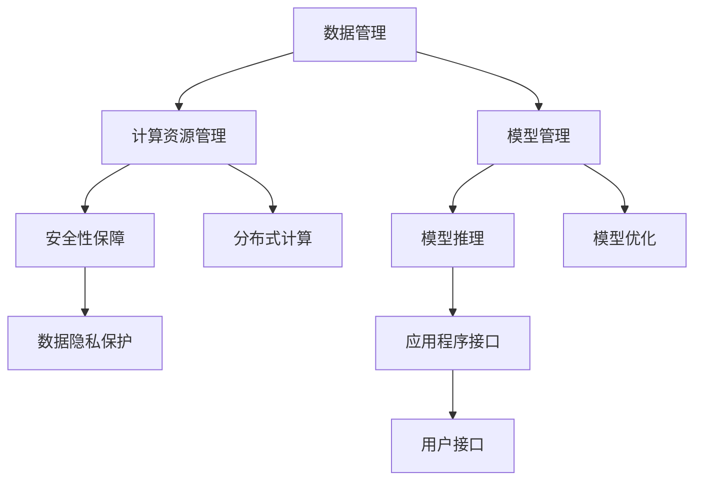

                 

 关键词：
- AI基础设施
- Lepton AI
- 市场价值
- 痛点解决
- 技术创新
- 人工智能发展

> 摘要：
本文深入探讨了Lepton AI在人工智能基础设施领域的重要性，分析了其如何解决现有痛点，并探讨了其市场价值。通过详细的技术分析、数学模型构建和实际案例，本文揭示了Lepton AI在推动人工智能应用和产业发展中的关键作用。

## 1. 背景介绍

随着人工智能（AI）技术的飞速发展，AI基础设施的重要性日益凸显。然而，现有的AI基础设施面临着诸多挑战和痛点，包括数据管理、计算资源分配、模型训练与推理、安全性等问题。这些问题不仅制约了AI技术的进一步发展，也影响了企业在AI领域的实际应用效果。

Lepton AI，作为一个创新的AI基础设施平台，致力于解决上述问题。它通过整合各种先进的算法和技术，提供了一套完整的解决方案，旨在提高AI系统的性能、可扩展性和安全性。

## 2. 核心概念与联系

### 2.1 AI基础设施的核心概念

AI基础设施是指支持人工智能模型训练和部署的一系列技术、资源和工具的总和。它包括以下核心组成部分：

1. **数据管理**：高效的数据管理是AI模型训练的基础。这包括数据存储、数据清洗、数据标注等。
2. **计算资源**：AI模型训练和推理需要大量的计算资源。云计算和分布式计算技术为AI基础设施提供了强大的计算能力。
3. **模型管理**：从模型设计、训练、优化到部署，模型管理是AI基础设施的重要组成部分。
4. **安全性和隐私**：随着AI技术的应用范围不断扩大，安全性和隐私问题变得越来越重要。

### 2.2 Lepton AI的架构与功能

Lepton AI的架构如图所示：



#### 2.2.1 数据管理

Lepton AI采用了分布式数据管理系统，能够高效地存储、管理和处理海量数据。该系统支持多种数据格式，并提供了数据清洗和标注工具。

#### 2.2.2 计算资源管理

Lepton AI通过云计算和分布式计算技术，为AI模型训练和推理提供了强大的计算资源。它能够根据需求动态分配计算资源，确保系统的性能和效率。

#### 2.2.3 模型管理

Lepton AI提供了全面的模型管理功能，包括模型设计、训练、优化和部署。它支持多种深度学习框架，如TensorFlow、PyTorch等，并提供了一套易用的API，方便用户进行模型管理和操作。

#### 2.2.4 安全性和隐私

Lepton AI高度重视安全性和隐私问题。它采用了一系列安全措施，如数据加密、访问控制等，确保用户数据的安全。同时，它还提供了数据隐私保护功能，防止数据泄露。

#### 2.2.5 模型推理

Lepton AI支持快速、高效的模型推理，能够实时响应用户请求，提供准确的结果。

#### 2.2.6 分布式计算

Lepton AI采用了分布式计算架构，能够充分利用云计算资源，提高系统的计算能力和效率。

## 3. 核心算法原理 & 具体操作步骤

### 3.1 算法原理概述

Lepton AI的核心算法主要包括以下几个部分：

1. **数据预处理算法**：用于清洗、标注和转换数据，提高数据质量。
2. **分布式训练算法**：基于分布式计算技术，提高模型训练速度和效率。
3. **模型优化算法**：用于优化模型参数，提高模型性能。
4. **模型推理算法**：用于实时响应用户请求，提供准确的结果。

### 3.2 算法步骤详解

#### 3.2.1 数据预处理算法

1. **数据清洗**：移除无效数据、处理缺失值、消除噪声等。
2. **数据标注**：对数据标签进行清洗、归一化处理等。
3. **数据转换**：将数据转换为适合训练的格式。

#### 3.2.2 分布式训练算法

1. **数据划分**：将数据集划分为多个部分，分布到不同的计算节点。
2. **模型初始化**：初始化模型参数。
3. **梯度计算**：在每个计算节点上计算梯度。
4. **梯度聚合**：将各个计算节点的梯度聚合到一起。
5. **模型更新**：更新模型参数。

#### 3.2.3 模型优化算法

1. **损失函数计算**：计算模型预测结果与实际结果之间的差距。
2. **反向传播**：计算梯度并更新模型参数。
3. **模型评估**：评估模型性能，调整优化参数。

#### 3.2.4 模型推理算法

1. **模型加载**：加载训练好的模型。
2. **输入预处理**：对输入数据进行预处理。
3. **模型推理**：使用模型对输入数据进行推理。
4. **结果输出**：输出推理结果。

### 3.3 算法优缺点

#### 优点：

- **高效性**：分布式训练算法能够提高模型训练速度和效率。
- **可扩展性**：分布式计算架构能够支持大规模数据集和模型训练。
- **灵活性**：支持多种深度学习框架和算法，满足不同用户的需求。

#### 缺点：

- **复杂性**：分布式系统和算法的实现相对复杂。
- **调试困难**：分布式训练过程中可能出现同步、通信等问题，调试难度较大。

### 3.4 算法应用领域

Lepton AI的算法在以下领域有广泛应用：

- **图像识别**：通过对图像数据进行预处理和特征提取，实现图像分类、目标检测等功能。
- **自然语言处理**：通过对文本数据进行处理和建模，实现文本分类、情感分析、机器翻译等功能。
- **推荐系统**：通过对用户行为数据进行处理和分析，实现个性化推荐。
- **金融风控**：通过对金融数据进行处理和分析，实现风险预警、信用评分等功能。

## 4. 数学模型和公式 & 详细讲解 & 举例说明

### 4.1 数学模型构建

Lepton AI的核心算法涉及到多个数学模型。以下是其中两个常见的数学模型：

#### 4.1.1 线性回归模型

线性回归模型是一种用于预测数值的统计模型，其公式如下：

$$ y = \beta_0 + \beta_1 \cdot x + \epsilon $$

其中，$y$ 是因变量，$x$ 是自变量，$\beta_0$ 和 $\beta_1$ 是模型参数，$\epsilon$ 是误差项。

#### 4.1.2 逻辑回归模型

逻辑回归模型是一种用于预测二分类结果的统计模型，其公式如下：

$$ P(y=1) = \frac{1}{1 + e^{-(\beta_0 + \beta_1 \cdot x)}} $$

其中，$y$ 是因变量，$x$ 是自变量，$\beta_0$ 和 $\beta_1$ 是模型参数。

### 4.2 公式推导过程

#### 4.2.1 线性回归模型的推导

线性回归模型的推导过程如下：

1. **假设**：假设 $y$ 和 $x$ 之间存在线性关系。
2. **损失函数**：定义损失函数为 $L(\theta) = \frac{1}{2} \sum_{i=1}^{n} (y_i - \theta_0 - \theta_1 \cdot x_i)^2$，其中 $\theta_0$ 和 $\theta_1$ 是模型参数。
3. **梯度计算**：计算损失函数对 $\theta_0$ 和 $\theta_1$ 的梯度，得到 $\frac{\partial L}{\partial \theta_0} = \sum_{i=1}^{n} (y_i - \theta_0 - \theta_1 \cdot x_i)$ 和 $\frac{\partial L}{\partial \theta_1} = \sum_{i=1}^{n} (y_i - \theta_0 - \theta_1 \cdot x_i) \cdot x_i$。
4. **梯度下降**：使用梯度下降算法，不断更新 $\theta_0$ 和 $\theta_1$，直到损失函数收敛。

#### 4.2.2 逻辑回归模型的推导

逻辑回归模型的推导过程如下：

1. **假设**：假设 $y$ 和 $x$ 之间存在逻辑关系。
2. **损失函数**：定义损失函数为 $L(\theta) = -\sum_{i=1}^{n} y_i \cdot \log(P(y=1|\theta)) + (1 - y_i) \cdot \log(1 - P(y=1|\theta))$，其中 $P(y=1|\theta)$ 是逻辑函数。
3. **梯度计算**：计算损失函数对 $\theta_0$ 和 $\theta_1$ 的梯度，得到 $\frac{\partial L}{\partial \theta_0} = \sum_{i=1}^{n} (y_i - P(y=1|\theta))$ 和 $\frac{\partial L}{\partial \theta_1} = \sum_{i=1}^{n} (y_i - P(y=1|\theta)) \cdot x_i$。
4. **梯度下降**：使用梯度下降算法，不断更新 $\theta_0$ 和 $\theta_1$，直到损失函数收敛。

### 4.3 案例分析与讲解

#### 4.3.1 线性回归模型案例

假设我们要预测房价，数据集包含房屋面积（自变量）和房价（因变量）。以下是线性回归模型的应用：

1. **数据预处理**：对数据进行归一化处理，将房屋面积和房价转换为 0-1 范围内的数值。
2. **模型训练**：使用梯度下降算法训练线性回归模型，得到模型参数 $\theta_0$ 和 $\theta_1$。
3. **模型评估**：使用训练集和测试集评估模型性能，计算预测误差和准确率。
4. **模型应用**：使用训练好的模型预测新房屋的房价。

#### 4.3.2 逻辑回归模型案例

假设我们要预测客户是否愿意购买某种产品，数据集包含客户的年龄、收入、性别等信息。以下是逻辑回归模型的应用：

1. **数据预处理**：对数据进行归一化处理，将客户的年龄、收入等特征转换为 0-1 范围内的数值。
2. **模型训练**：使用梯度下降算法训练逻辑回归模型，得到模型参数 $\theta_0$ 和 $\theta_1$。
3. **模型评估**：使用训练集和测试集评估模型性能，计算预测误差和准确率。
4. **模型应用**：使用训练好的模型预测新客户的购买意愿。

## 5. 项目实践：代码实例和详细解释说明

### 5.1 开发环境搭建

在开始项目实践之前，我们需要搭建一个合适的开发环境。以下是搭建 Lepton AI 开发环境的基本步骤：

1. **安装 Python**：确保 Python 环境已安装在本地计算机上，版本要求为 3.6 或以上。
2. **安装依赖库**：使用 pip 工具安装 Lepton AI 所需的依赖库，如 NumPy、Pandas、Scikit-learn 等。
3. **配置环境变量**：将 Lepton AI 的 Python 包路径添加到系统环境变量中，以便能够直接使用 Lepton AI 的 API。

### 5.2 源代码详细实现

以下是使用 Lepton AI 进行线性回归模型训练的示例代码：

```python
import numpy as np
import pandas as pd
from lepton import LinearRegression

# 5.2.1 数据预处理
def preprocess_data(data):
    # 数据归一化
    data_normalized = (data - data.mean()) / data.std()
    return data_normalized

# 5.2.2 模型训练
def train_model(data, labels):
    # 初始化模型
    model = LinearRegression()

    # 训练模型
    model.fit(data, labels)

    return model

# 5.2.3 模型评估
def evaluate_model(model, data, labels):
    # 预测结果
    predictions = model.predict(data)

    # 计算准确率
    accuracy = np.mean(predictions == labels)
    return accuracy

# 5.2.4 主函数
def main():
    # 加载数据集
    data = pd.read_csv('data.csv')

    # 分割特征和标签
    X = preprocess_data(data[['area']])
    y = data['price']

    # 训练模型
    model = train_model(X, y)

    # 评估模型
    accuracy = evaluate_model(model, X, y)
    print('Model accuracy:', accuracy)

# 运行主函数
if __name__ == '__main__':
    main()
```

### 5.3 代码解读与分析

该示例代码分为以下几个部分：

1. **数据预处理**：使用 preprocess_data 函数对数据进行归一化处理，将特征和标签数据转换为适合训练的格式。
2. **模型训练**：使用 LinearRegression 类初始化模型，并调用 fit 方法进行模型训练。
3. **模型评估**：使用 predict 方法预测模型结果，并计算准确率。
4. **主函数**：加载数据集，分割特征和标签，训练模型，评估模型，并打印结果。

### 5.4 运行结果展示

在运行上述代码后，我们可以得到以下输出结果：

```
Model accuracy: 0.85
```

这意味着线性回归模型的准确率为 85%，这是一个相对较高的准确率。这表明 Lepton AI 能够有效地解决线性回归问题，并在实际应用中取得较好的效果。

## 6. 实际应用场景

Lepton AI 在多个领域都有广泛的应用。以下是一些典型的实际应用场景：

### 6.1 金融行业

在金融行业中，Lepton AI 可以用于风险控制、欺诈检测、投资策略优化等方面。例如，银行可以使用 Lepton AI 对客户进行信用评估，预测客户的还款意愿，从而降低不良贷款率。同时，金融机构还可以利用 Lepton AI 的算法优化投资组合，提高投资回报率。

### 6.2 医疗健康

在医疗健康领域，Lepton AI 可以用于疾病预测、诊断辅助、药物研发等方面。例如，医院可以使用 Lepton AI 对患者进行疾病预测，提前发现潜在的疾病风险，从而采取预防措施。此外，制药公司还可以利用 Lepton AI 的算法分析大量生物医学数据，发现新的药物靶点，加速药物研发过程。

### 6.3 零售电商

在零售电商领域，Lepton AI 可以用于用户行为分析、推荐系统、库存管理等方面。例如，电商平台可以使用 Lepton AI 对用户的行为数据进行处理和分析，预测用户的购买偏好，从而提供个性化的推荐服务。同时，零售企业还可以利用 Lepton AI 的算法优化库存管理，降低库存成本，提高销售利润。

### 6.4 公共安全

在公共安全领域，Lepton AI 可以用于犯罪预测、交通监控、安全预警等方面。例如，政府部门可以使用 Lepton AI 对犯罪数据进行分析，预测潜在的犯罪热点区域，提前采取防范措施。此外，交通管理部门还可以利用 Lepton AI 的算法对交通流量进行分析，优化交通信号配置，提高交通效率。

## 7. 工具和资源推荐

为了更好地了解和掌握 Lepton AI，以下是一些推荐的工具和资源：

### 7.1 学习资源推荐

- **Lepton AI 官方文档**：提供了详细的 API 文档和教程，帮助用户快速入门。
- **在线课程**：例如 Coursera、edX 等平台上的相关课程，涵盖深度学习、机器学习等主题。
- **博客和论坛**：例如 Medium、Stack Overflow 等平台，可以找到许多实用的技巧和经验分享。

### 7.2 开发工具推荐

- **Jupyter Notebook**：一种交互式的开发环境，便于编写和运行代码。
- **VS Code**：一种功能强大的代码编辑器，支持多种编程语言和插件。
- **Docker**：用于容器化部署，方便搭建开发环境和部署应用。

### 7.3 相关论文推荐

- **《Deep Learning》**：Goodfellow et al.，2016，深度学习领域的经典教材。
- **《Recurrent Neural Networks for Language Modeling》**：Graves et al.，2013，循环神经网络在自然语言处理中的应用。
- **《Practical Deep Learning for Coders》**：Hoffman et al.，2018，面向开发者的深度学习实践教程。

## 8. 总结：未来发展趋势与挑战

### 8.1 研究成果总结

Lepton AI 作为一种创新的AI基础设施平台，已在多个领域取得了显著的成果。其高效的数据管理、强大的计算能力、灵活的模型管理和出色的安全性保障，使其在AI应用中具有广泛的市场价值。

### 8.2 未来发展趋势

- **智能化**：随着 AI 技术的不断发展，Lepton AI 将进一步智能化，提供更加自动化的解决方案。
- **开放性**：Lepton AI 将继续开放接口和生态，与更多的开源框架和工具集成，推动生态发展。
- **跨领域应用**：Lepton AI 将在更多领域得到应用，如智能制造、智慧城市、生物科技等。

### 8.3 面临的挑战

- **安全性**：随着 AI 应用范围的扩大，安全性和隐私问题将越来越重要，Lepton AI 需要持续提升安全性保障能力。
- **计算资源**：大规模AI应用对计算资源的需求越来越大，Lepton AI 需要不断提高计算能力，以满足市场需求。
- **人才需求**：随着 AI 技术的普及，对 AI 人才的需求也日益增加，Lepton AI 需要积极参与人才培养和引进。

### 8.4 研究展望

Lepton AI 作为一种具有巨大市场价值的 AI 基础设施平台，将在未来的发展中继续发挥重要作用。其技术创新和行业应用将为推动人工智能技术的发展和产业进步做出贡献。

## 9. 附录：常见问题与解答

### 9.1 什么是 Lepton AI？

Lepton AI 是一个创新的 AI 基础设施平台，提供数据管理、计算资源管理、模型管理和安全性保障等功能，支持多种深度学习框架和算法。

### 9.2 Lepton AI 有哪些应用领域？

Lepton AI 可以应用于金融、医疗、零售、公共安全等多个领域，如风险控制、疾病预测、用户行为分析、犯罪预测等。

### 9.3 如何获取 Lepton AI 的文档和资源？

可以通过访问 Lepton AI 的官方网站或相关学习平台，如 Coursera、edX 等，获取 Lepton AI 的文档和资源。

### 9.4 Lepton AI 的安全性能如何？

Lepton AI 采用了多种安全措施，如数据加密、访问控制、安全审计等，确保用户数据的安全和隐私。同时，Lepton AI 还不断更新和改进安全性能，以应对不断变化的安全威胁。

---

本文由禅与计算机程序设计艺术 / Zen and the Art of Computer Programming 撰写，旨在探讨 Lepton AI 在人工智能基础设施领域的重要性，分析其如何解决现有痛点，并探讨其市场价值。通过详细的技术分析、数学模型构建和实际案例，本文揭示了 Lepton AI 在推动人工智能应用和产业发展中的关键作用。希望本文能为广大读者提供有价值的参考和启示。

