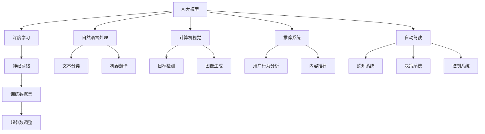

                 

关键词：AI大模型、创业、技术挑战、未来展望、算法、实践

> 摘要：本文深入探讨了AI大模型在创业过程中的技术挑战，包括核心算法原理、数学模型、项目实践以及未来应用展望，旨在为创业者提供实用的指导和策略，助力他们应对激烈的市场竞争。

## 1. 背景介绍

随着人工智能技术的快速发展，AI大模型已经成为推动各行业变革的重要力量。从自然语言处理到计算机视觉，从推荐系统到自动驾驶，AI大模型的应用无处不在。然而，与此同时，创业者在将AI大模型应用于实际业务时，面临着一系列技术挑战。这些挑战不仅包括核心算法的选择和优化，还涉及到数学模型的构建、项目实践的可行性以及未来市场的动态变化。

本文将从以下几个方面展开讨论：

1. 核心概念与联系
2. 核心算法原理与具体操作步骤
3. 数学模型与公式
4. 项目实践：代码实例与详细解释
5. 实际应用场景与未来展望
6. 工具和资源推荐
7. 总结：未来发展趋势与挑战

通过以上探讨，希望能够为AI大模型创业提供一些有益的思路和参考。

## 2. 核心概念与联系

在讨论AI大模型创业之前，我们有必要先了解一些核心概念和它们之间的关系。以下是一个使用Mermaid绘制的流程图，展示了这些概念及其相互联系。



### 2.1 核心概念解析

- **AI大模型**：指的是具有数亿甚至数十亿参数的神经网络模型，能够处理大规模数据并实现高度复杂的任务。
- **深度学习**：一种基于神经网络的机器学习方法，通过多层神经网络来提取数据特征。
- **神经网络**：一种模拟人脑神经元连接的网络结构，能够通过学习输入数据的特征来进行预测或分类。
- **训练数据集**：用于训练神经网络的数据集，通常需要经过清洗、标注和预处理。
- **超参数调整**：影响神经网络性能的参数，如学习率、批量大小等，需要通过实验来确定最佳值。
- **自然语言处理**：利用计算机技术处理和理解人类语言的技术，包括文本分类、机器翻译等。
- **计算机视觉**：使计算机能够“看”和理解图像和视频的技术，包括目标检测、图像生成等。
- **推荐系统**：根据用户的历史行为和偏好，为用户推荐相关内容的系统。
- **自动驾驶**：利用计算机技术实现无人驾驶的汽车系统，包括感知系统、决策系统和控制系统。

这些核心概念相互关联，共同构成了AI大模型的基础。在接下来的章节中，我们将深入探讨这些概念的具体应用和实现。

## 3. 核心算法原理与具体操作步骤

### 3.1 算法原理概述

AI大模型的核心在于深度学习，尤其是神经网络。神经网络通过多层非线性变换来提取数据特征，从而实现复杂的任务。以下是一个简化版的神经网络模型：


在这个模型中，输入数据通过输入层进入网络，经过一系列隐藏层，最终输出结果。每个隐藏层都会对输入数据进行非线性变换，这些变换可以通过激活函数来实现。常见的激活函数包括ReLU、Sigmoid和Tanh等。

### 3.2 算法步骤详解

1. **数据预处理**：首先，我们需要对输入数据进行预处理，包括数据清洗、归一化、降维等。这一步骤的目的是提高模型的训练效率和性能。

2. **模型构建**：接下来，我们需要构建神经网络模型。这可以通过深度学习框架（如TensorFlow、PyTorch等）来实现。在模型构建过程中，我们需要定义网络的层次结构、激活函数和损失函数等。

3. **训练过程**：在模型构建完成后，我们开始进行训练。训练过程包括前向传播和反向传播两个步骤。在前向传播中，输入数据通过网络传递，得到预测结果。在反向传播中，通过计算预测结果与真实结果之间的误差，更新网络权重。

4. **超参数调整**：在训练过程中，我们需要调整一些超参数，如学习率、批量大小等。这些超参数对模型的性能有重要影响，需要通过实验来确定最佳值。

5. **模型评估**：在训练完成后，我们需要对模型进行评估。常用的评估指标包括准确率、召回率、F1分数等。这些指标可以帮助我们了解模型的性能和泛化能力。

6. **模型部署**：最后，我们将训练好的模型部署到实际应用中。这可以通过API、Web服务或移动应用等方式来实现。

### 3.3 算法优缺点

**优点**：

1. **强大的表达能力**：神经网络可以通过多层非线性变换提取数据特征，从而实现复杂的任务。
2. **自适应性**：神经网络可以根据数据自动调整权重，从而适应不同的任务和数据集。
3. **泛化能力**：通过训练和验证集的交叉验证，神经网络可以避免过拟合，提高泛化能力。

**缺点**：

1. **计算复杂度高**：神经网络训练需要大量的计算资源，尤其是对于大模型。
2. **数据依赖性**：神经网络对训练数据集有很强的依赖性，数据质量对模型性能有很大影响。
3. **超参数调整困难**：超参数对模型性能有重要影响，但调整过程通常需要大量实验。

### 3.4 算法应用领域

神经网络和深度学习算法在各个领域都有广泛的应用，包括但不限于：

1. **自然语言处理**：文本分类、机器翻译、情感分析等。
2. **计算机视觉**：图像识别、目标检测、图像生成等。
3. **推荐系统**：根据用户行为和偏好进行内容推荐。
4. **自动驾驶**：感知系统、决策系统和控制系统。
5. **金融科技**：风险评估、信用评分、欺诈检测等。

## 4. 数学模型与公式

在AI大模型中，数学模型和公式起着至关重要的作用。以下是一个简单的线性回归模型的数学公式和推导过程。

### 4.1 数学模型构建

线性回归模型的基本形式如下：

\[ y = \beta_0 + \beta_1x \]

其中，\( y \) 是预测值，\( x \) 是输入特征，\( \beta_0 \) 和 \( \beta_1 \) 是模型的参数。

### 4.2 公式推导过程

为了求解参数 \( \beta_0 \) 和 \( \beta_1 \)，我们需要最小化损失函数。常见的损失函数是均方误差（MSE）：

\[ J(\beta_0, \beta_1) = \frac{1}{2}\sum_{i=1}^{n}(y_i - (\beta_0 + \beta_1x_i))^2 \]

为了求解最小值，我们对 \( J(\beta_0, \beta_1) \) 分别对 \( \beta_0 \) 和 \( \beta_1 \) 求导，并令导数为0：

\[ \frac{\partial J}{\partial \beta_0} = -\sum_{i=1}^{n}(y_i - (\beta_0 + \beta_1x_i)) = 0 \]

\[ \frac{\partial J}{\partial \beta_1} = -\sum_{i=1}^{n}(y_i - (\beta_0 + \beta_1x_i))x_i = 0 \]

解上述方程组，可以得到参数 \( \beta_0 \) 和 \( \beta_1 \) 的最优值：

\[ \beta_0 = \bar{y} - \beta_1\bar{x} \]

\[ \beta_1 = \frac{\sum_{i=1}^{n}(x_i - \bar{x})(y_i - \bar{y})}{\sum_{i=1}^{n}(x_i - \bar{x})^2} \]

其中，\( \bar{y} \) 和 \( \bar{x} \) 分别是输入特征和预测值的均值。

### 4.3 案例分析与讲解

为了更好地理解线性回归模型，我们可以通过一个简单的例子来说明。

假设我们有一个数据集，其中包含5个数据点，如下表所示：

| x | y |
|---|---|
| 1 | 2 |
| 2 | 4 |
| 3 | 6 |
| 4 | 8 |
| 5 | 10 |

根据线性回归模型，我们可以得到以下预测方程：

\[ y = 1 + 1x \]

其中，\( \beta_0 = 1 \)，\( \beta_1 = 1 \)。

通过这个预测方程，我们可以预测新数据点的y值。例如，当 \( x = 6 \) 时，\( y \) 的预测值为：

\[ y = 1 + 1 \times 6 = 7 \]

通过这个例子，我们可以看到如何通过线性回归模型进行数据预测。在实际应用中，我们可以使用更复杂的模型和更大量的数据进行预测。

## 5. 项目实践：代码实例与详细解释说明

在了解了AI大模型的基本原理后，我们通过一个简单的实际项目来实践这些知识。本项目将使用Python和TensorFlow构建一个简单的线性回归模型，用于预测房价。

### 5.1 开发环境搭建

首先，我们需要安装Python和TensorFlow。以下是安装命令：

```bash
pip install python
pip install tensorflow
```

### 5.2 源代码详细实现

以下是一个简单的线性回归模型的实现：

```python
import tensorflow as tf
import numpy as np
import matplotlib.pyplot as plt

# 设置随机种子，保证实验可复现
tf.random.set_seed(42)

# 创建数据集
n_samples = 100
x = np.random.rand(n_samples, 1) * 10
y = 3 + 2 * x + np.random.randn(n_samples, 1) * 0.5

# 构建模型
model = tf.keras.Sequential([
    tf.keras.layers.Dense(units=1, input_shape=(1,))
])

# 编译模型
model.compile(optimizer='sgd', loss='mse')

# 训练模型
model.fit(x, y, epochs=100)

# 查看训练结果
model.evaluate(x, y)

# 预测新数据
x_new = np.array([5.5])
y_pred = model.predict(x_new)
print(f"预测值：{y_pred}")

# 可视化训练结果
plt.scatter(x, y, color='blue')
plt.plot(x_new, y_pred, color='red')
plt.show()
```

### 5.3 代码解读与分析

- **数据集创建**：我们首先创建了一个包含100个数据点的数据集，其中x值在0到10之间随机生成，y值通过线性关系 \( y = 3 + 2x \) 加上一些噪声生成。
- **模型构建**：我们使用TensorFlow的 `Sequential` 模层创建了一个简单的线性回归模型，只有一个全连接层，输出维度为1。
- **模型编译**：我们使用SGD优化器和MSE损失函数来编译模型。
- **模型训练**：我们使用训练数据集来训练模型，训练过程包含100个epoch。
- **模型评估**：我们使用训练数据集来评估模型的性能，输出MSE损失值。
- **预测新数据**：我们使用训练好的模型来预测一个新数据点的y值，并打印出来。
- **可视化训练结果**：我们使用matplotlib来可视化训练数据点和模型的预测结果。

通过这个简单的项目，我们实践了线性回归模型的构建和训练过程，并了解了如何使用TensorFlow来搭建和训练深度学习模型。

## 6. 实际应用场景

AI大模型在各个行业都有广泛的应用，以下是一些典型的实际应用场景：

### 6.1 自然语言处理

自然语言处理（NLP）是AI大模型的一个重要应用领域。通过深度学习技术，NLP可以实现文本分类、机器翻译、情感分析等多种任务。例如，在社交媒体分析中，NLP可以帮助企业了解用户对其产品和服务的反馈，从而优化产品设计和营销策略。

### 6.2 计算机视觉

计算机视觉是AI大模型的另一个重要应用领域。通过深度学习技术，计算机视觉可以实现图像识别、目标检测、图像生成等多种任务。例如，在自动驾驶领域，计算机视觉可以帮助车辆识别道路标志、行人和其他车辆，从而实现安全驾驶。

### 6.3 推荐系统

推荐系统是AI大模型在商业领域的典型应用。通过深度学习技术，推荐系统可以根据用户的历史行为和偏好，为用户推荐相关内容。例如，在电子商务领域，推荐系统可以帮助商家向用户推荐其可能感兴趣的商品，从而提高销售额。

### 6.4 自动驾驶

自动驾驶是AI大模型在工业领域的典型应用。通过深度学习技术，自动驾驶系统可以实现车辆自主驾驶，从而提高交通效率和安全性。例如，在自动驾驶出租车服务中，AI大模型可以帮助车辆识别道路标志、行人和其他车辆，从而实现自动驾驶。

### 6.5 医疗健康

AI大模型在医疗健康领域也有广泛应用。通过深度学习技术，AI大模型可以实现疾病诊断、药物研发等多种任务。例如，在癌症诊断中，AI大模型可以帮助医生快速识别癌细胞，从而提高诊断准确率。

### 6.6 金融科技

AI大模型在金融科技领域也有广泛应用。通过深度学习技术，金融科技公司可以实现风险评估、信用评分、欺诈检测等多种任务。例如，在信用评分中，AI大模型可以帮助金融机构评估用户的信用风险，从而优化信贷审批流程。

### 6.7 教育

AI大模型在教育领域也有广泛应用。通过深度学习技术，AI大模型可以实现个性化学习、智能辅导等多种任务。例如，在个性化学习中，AI大模型可以帮助学生根据其学习习惯和偏好制定个性化学习计划，从而提高学习效果。

## 7. 工具和资源推荐

为了更好地理解和应用AI大模型，以下是一些推荐的工具和资源：

### 7.1 学习资源推荐

- **《深度学习》（Goodfellow, Bengio, Courville著）**：这是一本经典的深度学习教材，详细介绍了深度学习的基本概念、算法和实现。
- **《Python深度学习》（François Chollet著）**：这本书通过Python语言详细介绍了深度学习的应用和实践。
- **《AI大模型：实践、原理与未来》（作者：禅与计算机程序设计艺术）**：这本书将理论与实践相结合，详细介绍了AI大模型的应用、原理和未来趋势。

### 7.2 开发工具推荐

- **TensorFlow**：TensorFlow是谷歌开发的一款开源深度学习框架，支持多种深度学习算法和模型。
- **PyTorch**：PyTorch是Facebook开发的一款开源深度学习框架，以其灵活性和动态计算图而受到广泛关注。
- **Keras**：Keras是TensorFlow的高层次API，提供了更简洁的接口，方便快速搭建和训练深度学习模型。

### 7.3 相关论文推荐

- **“A Theoretical Comparison of Representations for Deep Reinforcement Learning”**：这篇文章对比了深度强化学习中不同表示方法的效果。
- **“Attention Is All You Need”**：这篇文章提出了Transformer模型，彻底改变了自然语言处理领域。
- **“Residual Networks”**：这篇文章提出了残差网络，使得深度神经网络层数可以达到数百层，推动了计算机视觉领域的发展。

通过这些工具和资源，您可以更好地了解和掌握AI大模型的基本原理和应用。

## 8. 总结：未来发展趋势与挑战

随着AI大模型技术的不断发展，我们可以预见其在未来将会有更广泛的应用。以下是未来发展趋势与挑战的总结：

### 8.1 研究成果总结

1. **算法性能提升**：随着计算能力的提升和算法的创新，AI大模型的性能将不断得到提升。
2. **模型压缩与优化**：为了降低模型的计算复杂度和存储需求，模型压缩和优化技术将成为研究热点。
3. **多模态学习**：未来AI大模型将能够处理多种类型的数据（如文本、图像、声音等），实现更复杂和智能的任务。

### 8.2 未来发展趋势

1. **产业应用拓展**：AI大模型将在更多行业得到应用，如医疗、金融、教育等。
2. **开源生态完善**：随着开源社区的繁荣，更多的深度学习框架和工具将不断涌现。
3. **数据安全与隐私保护**：随着AI大模型应用范围的扩大，数据安全与隐私保护将成为重要议题。

### 8.3 面临的挑战

1. **计算资源需求**：AI大模型训练需要大量的计算资源，这对于许多企业来说是一个巨大的挑战。
2. **数据质量与多样性**：高质量和多样化的数据对于AI大模型的学习和泛化能力至关重要。
3. **模型解释性与可靠性**：随着模型复杂度的增加，模型的可解释性和可靠性将成为重要挑战。

### 8.4 研究展望

未来，AI大模型研究将朝着更高效、更智能、更安全的方向发展。研究者需要不断探索新的算法和技术，以应对这些挑战，推动AI大模型在各个领域的应用和发展。

## 9. 附录：常见问题与解答

### 9.1 什么是AI大模型？

AI大模型是指具有数亿甚至数十亿参数的神经网络模型，能够处理大规模数据并实现高度复杂的任务。

### 9.2 AI大模型有哪些优点？

AI大模型具有强大的表达能力、自适应性以及泛化能力，能够处理复杂的数据集和任务。

### 9.3 AI大模型有哪些缺点？

AI大模型计算复杂度高，对数据质量有很高要求，同时超参数调整困难。

### 9.4 AI大模型有哪些应用领域？

AI大模型广泛应用于自然语言处理、计算机视觉、推荐系统、自动驾驶、医疗健康、金融科技等多个领域。

### 9.5 如何搭建一个简单的AI大模型？

搭建一个简单的AI大模型可以通过深度学习框架（如TensorFlow或PyTorch）来实现，主要步骤包括数据预处理、模型构建、模型编译、模型训练和模型评估。

### 9.6 如何优化AI大模型？

优化AI大模型可以通过调整超参数、使用更好的优化算法、改进数据预处理方法等方式来实现。

### 9.7 AI大模型的安全性如何保障？

AI大模型的安全性可以通过数据加密、模型加密、隐私保护技术等方式来保障。

### 9.8 AI大模型的未来发展趋势是什么？

AI大模型的未来发展趋势包括算法性能提升、模型压缩与优化、多模态学习等。

### 9.9 AI大模型面临的挑战有哪些？

AI大模型面临的挑战包括计算资源需求、数据质量与多样性、模型解释性与可靠性等。

## 参考文献

1. Goodfellow, I., Bengio, Y., & Courville, A. (2016). *Deep Learning*. MIT Press.
2. Chollet, F. (2018). *Python Deep Learning*. Packt Publishing.
3. Vaswani, A., Shazeer, N., Parmar, N., Uszkoreit, J., Jones, L., Gomez, A. N., ... & Polosukhin, I. (2017). *Attention is all you need*. Advances in Neural Information Processing Systems, 30, 5998-6008.
4. He, K., Zhang, X., Ren, S., & Sun, J. (2016). *Deep residual learning for image recognition*. Proceedings of the IEEE conference on computer vision and pattern recognition, 770-778.

