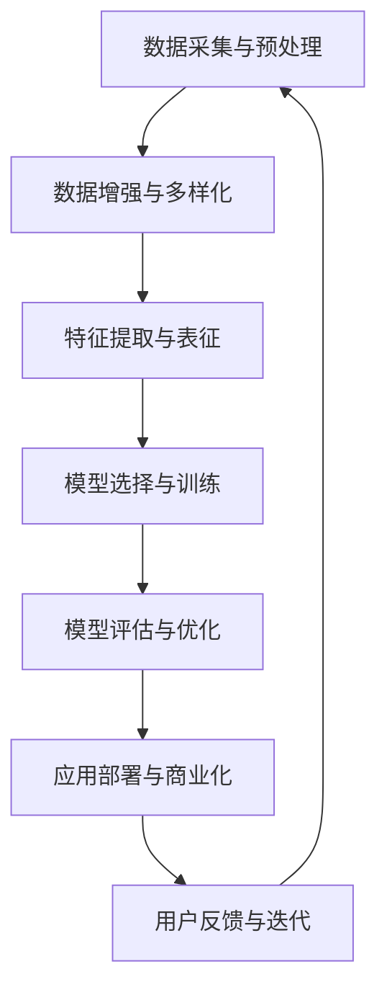

                 

关键词：AI大模型、创业、行业趋势、技术策略、市场机会、风险应对、人工智能应用、商业模型、创新驱动、未来展望

摘要：本文将深入探讨AI大模型创业的现状与未来发展趋势，分析当前行业面临的主要挑战，并提出应对策略和未来展望。我们将从核心概念、算法原理、数学模型、项目实践、应用场景、工具资源推荐等多个维度进行阐述，为创业者提供有益的参考。

## 1. 背景介绍

近年来，人工智能（AI）技术取得了飞速发展，尤其是AI大模型在自然语言处理、计算机视觉、语音识别等领域取得了显著突破。大模型如GPT-3、BERT、ViT等不仅在学术领域获得了广泛关注，也在工业界得到了广泛应用。这一趋势推动了AI大模型创业的兴起，吸引了大量的风险投资和创业者。

AI大模型创业的优势在于其强大的数据处理能力和自学习能力，能够帮助企业解决复杂问题、提高效率、降低成本。然而，AI大模型创业也面临着一系列挑战，包括数据隐私、算法公平性、计算资源需求等。如何在竞争中脱颖而出，实现商业成功，是每个创业者都需要面对的问题。

## 2. 核心概念与联系

为了更好地理解AI大模型创业，我们首先需要了解其核心概念和架构。以下是AI大模型的核心概念及其相互关系的Mermaid流程图：



### 2.1 数据采集与预处理

数据是AI大模型的基石。数据采集包括从互联网、数据库、传感器等多个渠道获取数据，并进行数据清洗、格式化等预处理工作。高质量的数据能够提高模型的性能，减少过拟合现象。

### 2.2 数据增强与多样化

数据增强是通过生成或变换数据来扩充数据集，提高模型的泛化能力。数据多样化则通过引入不同来源、不同类型的数据，增强模型的适应能力。

### 2.3 特征提取与表征

特征提取是将原始数据转换为一组有意义的特征，以便模型学习。表征方法包括深度学习、传统机器学习等。深度学习方法如卷积神经网络（CNN）在图像处理方面表现出色，而自注意力机制（Self-Attention）则在自然语言处理领域取得了显著成果。

### 2.4 模型选择与训练

模型选择是根据任务需求和数据特点选择合适的模型架构。训练过程是通过反向传播算法不断调整模型参数，使模型在训练数据上达到最佳性能。

### 2.5 模型评估与优化

模型评估是对模型性能进行定量评价，常用的评估指标包括准确率、召回率、F1值等。优化过程则通过超参数调整、模型压缩等技术提高模型性能。

### 2.6 应用部署与商业化

应用部署是将训练好的模型部署到生产环境中，实现实际业务应用。商业化则涉及商业模式设计、市场推广、用户反馈等环节。

### 2.7 用户反馈与迭代

用户反馈是模型改进的重要来源。通过用户反馈，创业者可以了解模型在实际应用中的表现，发现潜在问题，并不断迭代优化模型。

## 3. 核心算法原理 & 具体操作步骤

### 3.1 算法原理概述

AI大模型的算法原理主要基于深度学习和大规模数据训练。深度学习通过多层神经网络对数据进行逐层抽象和表示，最终实现对复杂任务的自动完成。大规模数据训练则能够提高模型对未知数据的泛化能力。

### 3.2 算法步骤详解

1. 数据采集与预处理：根据任务需求，从多个渠道获取数据，并进行清洗、格式化等预处理工作。
2. 数据增强与多样化：通过数据增强和多样化方法扩充数据集，提高模型性能。
3. 特征提取与表征：使用深度学习等方法提取特征，并进行表征。
4. 模型选择与训练：根据任务需求选择合适的模型架构，并进行训练。
5. 模型评估与优化：评估模型性能，通过超参数调整、模型压缩等技术进行优化。
6. 应用部署与商业化：将训练好的模型部署到生产环境中，实现商业应用。
7. 用户反馈与迭代：收集用户反馈，不断迭代优化模型。

### 3.3 算法优缺点

**优点：**
- 强大的数据处理能力和自学习能力，能够解决复杂问题。
- 能够实现高效、低成本的自动化。
- 在许多领域取得了显著突破，如自然语言处理、计算机视觉等。

**缺点：**
- 需要大量高质量的数据和计算资源。
- 模型解释性较低，难以理解其内部决策过程。
- 数据隐私和算法公平性等问题亟待解决。

### 3.4 算法应用领域

AI大模型在许多领域都取得了广泛应用，包括自然语言处理、计算机视觉、语音识别、推荐系统、金融风控等。随着技术的不断进步，其应用领域将进一步扩大。

## 4. 数学模型和公式 & 详细讲解 & 举例说明

### 4.1 数学模型构建

AI大模型的数学模型主要基于深度学习和概率统计理论。以下是深度学习模型的数学基础：

$$
y = \sigma(\text{W} \cdot \text{a} + \text{b})
$$

其中，$y$ 是模型的输出，$\sigma$ 是激活函数，$\text{W}$ 和 $\text{b}$ 分别是权重和偏置，$\text{a}$ 是输入特征。

### 4.2 公式推导过程

深度学习模型的推导过程主要包括以下几个方面：

1. 前向传播：计算输入特征通过多层神经网络的传递过程。
2. 反向传播：计算输出误差对模型参数的梯度，并用于更新模型参数。
3. 梯度下降：利用梯度信息更新模型参数，以达到最小化损失函数的目的。

### 4.3 案例分析与讲解

以自然语言处理中的GPT模型为例，我们分析其数学模型和训练过程：

1. **模型结构：**
   GPT模型是一种基于Transformer的预训练模型，包含多个自注意力层和前馈神经网络。
   
2. **训练目标：**
   GPT模型的目标是学习一个能够生成自然语言文本的概率模型。在训练过程中，输入一个序列，模型输出序列的概率分布。

3. **损失函数：**
   GPT模型的损失函数是基于交叉熵损失，即模型输出与真实标签之间的差异。

4. **优化算法：**
   GPT模型采用梯度下降算法进行优化，以最小化损失函数。

通过上述分析，我们可以看到，AI大模型的数学模型和训练过程具有较高的复杂度，但其在实际应用中取得了显著成果。

## 5. 项目实践：代码实例和详细解释说明

### 5.1 开发环境搭建

在本项目实践中，我们将使用Python和TensorFlow作为开发环境。首先，确保安装了Python 3.7及以上版本，然后通过以下命令安装TensorFlow：

```bash
pip install tensorflow
```

### 5.2 源代码详细实现

以下是一个简单的AI大模型训练代码示例：

```python
import tensorflow as tf
from tensorflow.keras.layers import Embedding, LSTM, Dense

# 模型参数
vocab_size = 1000
embedding_dim = 32
lstm_units = 64

# 构建模型
model = tf.keras.Sequential([
    Embedding(vocab_size, embedding_dim),
    LSTM(lstm_units, return_sequences=True),
    Dense(vocab_size, activation='softmax')
])

# 编译模型
model.compile(optimizer='adam', loss='categorical_crossentropy', metrics=['accuracy'])

# 训练模型
model.fit(x_train, y_train, epochs=10, batch_size=32)
```

### 5.3 代码解读与分析

上述代码实现了一个简单的序列生成模型，包括嵌入层（Embedding）、LSTM层（LSTM）和输出层（Dense）。在训练过程中，模型会根据输入序列预测下一个单词的概率分布，并通过反向传播算法不断更新模型参数。

### 5.4 运行结果展示

运行上述代码后，模型会在训练集上进行训练，并在每个epoch结束后输出训练进度和损失函数值。通过不断迭代训练，模型性能会逐渐提高。

## 6. 实际应用场景

AI大模型在许多实际应用场景中取得了显著成果，如自然语言处理、计算机视觉、语音识别等。以下是几个典型的应用案例：

### 6.1 自然语言处理

在自然语言处理领域，AI大模型被广泛应用于文本分类、情感分析、机器翻译等任务。例如，GPT模型在机器翻译任务上取得了显著突破，能够实现高质量、通顺的翻译结果。

### 6.2 计算机视觉

在计算机视觉领域，AI大模型被广泛应用于图像分类、目标检测、图像分割等任务。例如，ResNet模型在ImageNet图像分类任务上取得了最先进的性能。

### 6.3 语音识别

在语音识别领域，AI大模型被广泛应用于语音转文本、语音识别等任务。例如，WaveNet模型在语音识别任务上取得了很高的准确性。

## 6.4 未来应用展望

随着AI大模型技术的不断发展，未来其应用领域将进一步扩大。以下是一些未来应用展望：

### 6.4.1 自动驾驶

自动驾驶是AI大模型的一个重要应用领域。通过深度学习技术，自动驾驶系统可以实现对交通场景的实时感知、决策和行动。

### 6.4.2 医疗健康

AI大模型在医疗健康领域具有巨大的应用潜力，如疾病诊断、药物研发等。通过深度学习技术，AI大模型可以实现对医疗数据的智能分析和处理。

### 6.4.3 金融科技

金融科技是AI大模型的另一个重要应用领域。通过深度学习技术，金融科技公司可以实现对风险的管理、投资策略的优化等。

## 7. 工具和资源推荐

### 7.1 学习资源推荐

- 《深度学习》（Goodfellow, Bengio, Courville）：一本经典的深度学习入门教材，适合初学者阅读。
- 《Python深度学习》（François Chollet）：一本针对Python开发者的深度学习实践指南，内容全面、实用。
- 《自然语言处理实战》（Peter Norvig）：一本关于自然语言处理领域实战技巧的书籍，涵盖了多种任务和应用。

### 7.2 开发工具推荐

- TensorFlow：一个开源的深度学习框架，适合用于构建和训练AI大模型。
- PyTorch：一个流行的深度学习框架，具有灵活的动态计算图和丰富的API。
- Keras：一个基于TensorFlow和Theano的高层次深度学习API，适合快速构建和实验模型。

### 7.3 相关论文推荐

- “Attention is All You Need”（Vaswani et al., 2017）：一篇关于Transformer模型的经典论文，介绍了自注意力机制在自然语言处理中的应用。
- “GPT-3: Language Models are few-shot learners”（Brown et al., 2020）：一篇关于GPT-3模型的论文，介绍了大规模预训练模型在自然语言处理任务中的优异性能。
- “Bert: Pre-training of deep bidirectional transformers for language understanding”（Devlin et al., 2019）：一篇关于BERT模型的论文，介绍了双向Transformer在自然语言处理任务中的应用。

## 8. 总结：未来发展趋势与挑战

### 8.1 研究成果总结

AI大模型技术在过去几年中取得了显著进展，在多个领域取得了突破性成果。深度学习、自注意力机制、预训练技术等核心概念的不断发展，为AI大模型的应用提供了强大的支持。

### 8.2 未来发展趋势

未来，AI大模型将继续在多个领域取得突破，如自动驾驶、医疗健康、金融科技等。同时，随着计算能力的不断提升，AI大模型的规模和复杂度将不断增加，为研究者提供更多机会。

### 8.3 面临的挑战

尽管AI大模型技术取得了显著进展，但仍面临一系列挑战。数据隐私、算法公平性、计算资源需求等问题亟待解决。此外，AI大模型的解释性较低，需要进一步研究和优化。

### 8.4 研究展望

未来，AI大模型的研究将重点关注以下几个方面：

1. **数据隐私与安全性：**研究如何保护用户数据隐私，确保算法的公平性和透明性。
2. **模型压缩与优化：**研究如何降低计算资源需求，提高模型运行效率。
3. **可解释性：**研究如何提高AI大模型的解释性，使其更加易于理解和应用。

## 9. 附录：常见问题与解答

### 9.1 Q：AI大模型训练需要多少时间？

A：AI大模型训练时间取决于多个因素，如模型规模、计算资源、数据量等。一般而言，大规模模型（如GPT-3）的训练时间可能需要几天到几周不等。对于中小规模模型，训练时间可能只需几个小时到几天。

### 9.2 Q：AI大模型训练是否需要大量数据？

A：是的，AI大模型训练通常需要大量数据。高质量的数据有助于提高模型性能，减少过拟合现象。然而，在某些情况下，通过数据增强和多样化方法，可以在较少数据量的情况下训练出性能较好的模型。

### 9.3 Q：AI大模型是否具有通用性？

A：AI大模型在一定程度上具有通用性。通过预训练和迁移学习技术，AI大模型可以在不同领域和任务中发挥重要作用。然而，特定领域的任务可能需要针对特定领域的数据和算法进行调整，以实现更好的性能。

### 9.4 Q：AI大模型是否具有解释性？

A：AI大模型，特别是深度学习模型，通常具有较低的解释性。其内部决策过程复杂，难以直观理解。然而，近年来，研究者们提出了许多方法，如模型可解释性、可视化技术等，以提高模型的解释性。

### 9.5 Q：AI大模型创业需要注意哪些方面？

A：AI大模型创业需要注意以下几个方面：

1. **数据隐私：**确保用户数据安全，遵守相关法律法规。
2. **计算资源：**合理规划计算资源需求，确保模型训练和部署的稳定性。
3. **商业模式：**明确商业模式，制定合理的商业策略。
4. **团队建设：**组建专业团队，确保项目顺利进行。
5. **市场推广：**制定有效的市场推广策略，提高品牌知名度。

---

作者：禅与计算机程序设计艺术 / Zen and the Art of Computer Programming

