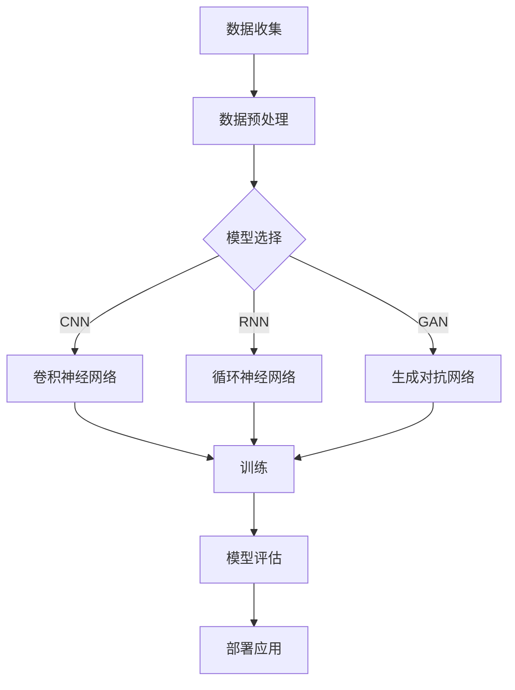

                 

在当今快速发展的技术时代，人工智能（AI）大模型已经成为驱动创新和变革的核心力量。从自然语言处理到计算机视觉，再到复杂的预测模型，AI大模型正不断推动着各行各业的进步。然而，对于创业者来说，如何利用AI大模型构建可持续的商业模式，实现长期的经济效益和社会价值，仍然是一个充满挑战的议题。本文将深入探讨AI大模型创业的现状、核心概念、算法原理、数学模型、项目实践以及未来的应用前景，帮助读者理解如何在激烈的市场竞争中脱颖而出。

## 文章关键词

- 人工智能
- 大模型
- 商业模式
- 创业
- 可持续发展

## 文章摘要

本文旨在探讨AI大模型创业的可行性和实践路径。首先，通过背景介绍和核心概念的阐述，使读者了解AI大模型的基本原理和发展趋势。接着，本文详细分析了AI大模型的核心算法原理和具体操作步骤，并借助数学模型和公式进行了深入讲解。随后，通过实际项目实例和代码解读，展示了AI大模型在现实中的应用。最后，本文展望了AI大模型在未来的应用场景和潜在挑战，并提出了相应的解决方案。

## 1. 背景介绍

自20世纪50年代人工智能（AI）诞生以来，它经历了多次技术飞跃。特别是在深度学习（Deep Learning）的推动下，AI大模型逐渐成为了研究者和开发者关注的焦点。AI大模型，通常是指拥有巨大参数量的神经网络模型，它们能够在海量数据上进行高效训练，从而实现出色的性能和泛化能力。

近年来，随着计算能力的提升、大数据技术的成熟以及云计算服务的普及，AI大模型的应用场景变得愈加广泛。无论是自动驾驶、智能医疗，还是金融风控、电子商务，AI大模型都展现出了巨大的潜力。然而，AI大模型创业并非易事。如何在众多竞争者中脱颖而出，构建可持续的商业模式，成为摆在众多创业者面前的重要课题。

### 1.1 AI大模型的发展历程

AI大模型的发展历程可以分为以下几个阶段：

- **早期探索**（1950-1980年）：这一时期，人工智能主要侧重于符号主义和知识表示，尝试通过编程实现简单的推理和决策。然而，由于计算能力和数据资源的限制，这些模型的性能和实用性有限。
- **符号主义到连接主义**（1980-2000年）：随着神经网络的兴起，AI研究逐渐从符号主义转向连接主义。尽管这一转变带来了许多突破，但由于算法和计算资源的限制，AI大模型的发展仍然缓慢。
- **深度学习崛起**（2006-2012年）：AlexNet的提出标志着深度学习时代的到来。通过使用深度卷积神经网络，AI大模型在图像识别、语音识别等领域取得了显著成果。
- **大规模应用**（2012年至今）：随着计算能力和数据资源的进一步增长，AI大模型开始应用于各个领域，从自动驾驶到自然语言处理，它们的表现越来越出色。

### 1.2 AI大模型的应用领域

AI大模型的应用领域非常广泛，涵盖了多个行业和场景：

- **自然语言处理**（NLP）：通过预训练模型，如BERT、GPT，AI大模型在文本分类、情感分析、机器翻译等方面表现出色。
- **计算机视觉**：在图像识别、目标检测、图像生成等方面，AI大模型已经超越了传统的图像处理技术。
- **预测建模**：AI大模型在时间序列预测、股票交易、需求预测等领域展示了强大的能力。
- **游戏与娱乐**：通过强化学习和生成对抗网络（GAN），AI大模型在游戏生成、虚拟现实等方面开辟了新的应用场景。

### 1.3 AI大模型创业的挑战与机遇

AI大模型创业面临以下挑战：

- **计算资源需求**：AI大模型需要大量的计算资源进行训练和推理，这对创业团队的资金和基础设施提出了较高要求。
- **数据获取与隐私**：高质量的数据是训练AI大模型的关键，但数据获取可能面临隐私和安全问题。
- **技术门槛**：AI大模型的技术门槛较高，需要团队具备深厚的专业知识和经验。
- **市场竞争**：AI大模型市场竞争激烈，如何差异化竞争成为一大挑战。

然而，与此同时，AI大模型创业也带来了众多机遇：

- **市场潜力**：AI大模型在各个领域的应用前景广阔，市场需求不断增长。
- **创新驱动**：AI大模型推动了各行各业的创新，为创业者提供了丰富的创业机会。
- **经济效益**：通过AI大模型，企业可以实现自动化、智能化，提高生产效率和产品质量。

## 2. 核心概念与联系

### 2.1 AI大模型的核心概念

AI大模型的核心概念包括：

- **神经网络**：神经网络是AI大模型的基础，通过多层节点进行信息传递和计算。
- **深度学习**：深度学习是一种通过多层神经网络进行数据建模的方法，能够自动提取特征并实现复杂函数逼近。
- **大数据**：大数据是AI大模型训练的重要资源，只有通过海量数据，AI大模型才能实现高精度的学习。
- **计算资源**：强大的计算能力是训练和推理AI大模型的关键，包括CPU、GPU和TPU等。

### 2.2 AI大模型的联系与架构

以下是一个简化的AI大模型联系与架构的Mermaid流程图：



- **数据收集**：通过数据收集系统获取原始数据，包括文本、图像、音频等。
- **数据预处理**：对原始数据进行清洗、标注和格式转换，使其适合训练。
- **模型选择**：根据应用场景选择合适的神经网络模型，如卷积神经网络（CNN）、循环神经网络（RNN）或生成对抗网络（GAN）。
- **训练**：使用大数据和计算资源对模型进行训练，优化参数。
- **模型评估**：通过测试数据评估模型的性能，包括准确率、召回率、F1值等指标。
- **部署应用**：将训练好的模型部署到实际应用场景，如自动驾驶、智能客服等。

## 3. 核心算法原理 & 具体操作步骤

### 3.1 算法原理概述

AI大模型的核心算法是基于深度学习的神经网络模型。以下是一个简单的神经网络工作原理概述：

- **输入层**：接收外部输入数据。
- **隐藏层**：通过非线性激活函数进行信息传递和计算。
- **输出层**：生成最终预测结果。

神经网络通过反向传播算法不断调整权重和偏置，使得模型在训练过程中不断优化。以下是一个简化的反向传播算法步骤：

1. **前向传播**：输入数据经过神经网络，输出预测结果。
2. **计算误差**：将预测结果与实际标签进行比较，计算误差。
3. **反向传播**：将误差反向传递到各层，更新权重和偏置。
4. **迭代优化**：重复前向传播和反向传播过程，直至满足收敛条件。

### 3.2 算法步骤详解

以下是AI大模型算法的具体操作步骤：

1. **数据收集**：收集大量带有标签的原始数据，如文本、图像、音频等。
2. **数据预处理**：对原始数据进行清洗、标注和格式转换，使其适合训练。
3. **模型定义**：根据应用场景选择合适的神经网络模型，并定义网络结构。
4. **模型训练**：
   - 初始化模型参数。
   - 进行前向传播，计算预测结果。
   - 计算误差，使用反向传播更新模型参数。
   - 重复迭代优化过程，直至满足收敛条件。
5. **模型评估**：使用测试数据评估模型性能，包括准确率、召回率、F1值等指标。
6. **模型部署**：将训练好的模型部署到实际应用场景，如自动驾驶、智能客服等。

### 3.3 算法优缺点

AI大模型算法的优点包括：

- **高泛化能力**：通过训练大量数据，AI大模型能够实现高精度的预测和分类。
- **自动特征提取**：神经网络能够自动提取输入数据中的有用特征，减少人工干预。
- **自适应性强**：神经网络能够通过反向传播算法自适应地调整模型参数，优化性能。

然而，AI大模型算法也存在一些缺点：

- **计算资源需求高**：训练大型神经网络模型需要大量的计算资源，包括CPU、GPU和TPU等。
- **数据隐私问题**：大量数据的使用可能引发数据隐私和安全问题。
- **黑盒问题**：神经网络模型往往被视为黑盒，其内部机制难以解释，增加了使用风险。

### 3.4 算法应用领域

AI大模型算法在多个领域得到了广泛应用，包括：

- **自然语言处理**：在文本分类、情感分析、机器翻译等领域取得了显著成果。
- **计算机视觉**：在图像识别、目标检测、图像生成等方面展示了强大的能力。
- **预测建模**：在时间序列预测、股票交易、需求预测等领域展示了良好的性能。
- **游戏与娱乐**：通过强化学习和生成对抗网络，AI大模型在游戏生成、虚拟现实等方面开辟了新的应用场景。

## 4. 数学模型和公式 & 详细讲解 & 举例说明

### 4.1 数学模型构建

AI大模型的核心是神经网络，其数学模型可以表示为：

$$
y = f(z) = \sigma(W \cdot x + b)
$$

其中：

- \( y \) 是输出层的结果。
- \( z \) 是隐藏层的输出。
- \( f \) 是激活函数，常用的有Sigmoid、ReLU等。
- \( W \) 是权重矩阵。
- \( b \) 是偏置向量。
- \( x \) 是输入层的数据。

### 4.2 公式推导过程

以下是一个简化的神经网络公式推导过程：

1. **前向传播**：

$$
z = W \cdot x + b
$$

$$
a = f(z)
$$

2. **反向传播**：

计算误差：

$$
\delta = \frac{\partial C}{\partial z} = \frac{\partial C}{\partial a} \frac{\partial a}{\partial z}
$$

其中，\( C \) 是损失函数，常用的有均方误差（MSE）、交叉熵等。

更新权重和偏置：

$$
W = W - \alpha \frac{\partial C}{\partial W}
$$

$$
b = b - \alpha \frac{\partial C}{\partial b}
$$

其中，\( \alpha \) 是学习率。

### 4.3 案例分析与讲解

以下是一个简单的例子，假设我们有一个二元分类问题，使用Sigmoid函数作为激活函数。

**问题**：给定输入向量 \( x = [1, 2, 3] \)，训练一个单层神经网络实现 \( y = \frac{1}{1 + e^{-(W \cdot x + b)}} \)。

**步骤**：

1. 初始化权重 \( W \) 和偏置 \( b \)，例如 \( W = [1, 1, 1] \)，\( b = 0 \)。
2. 进行前向传播，计算输出 \( y \)：
   $$
   z = W \cdot x + b = 1 \cdot 1 + 1 \cdot 2 + 1 \cdot 3 + 0 = 6
   $$
   $$
   y = \frac{1}{1 + e^{-6}} \approx 0.999
   $$
3. 计算误差 \( \delta \)：
   $$
   \delta = \frac{\partial C}{\partial z} = \frac{\partial y}{\partial z} (1 - y)
   $$
   由于 \( y \approx 0.999 \)，\( \delta \approx 0.001 \)。
4. 更新权重和偏置：
   $$
   W = W - \alpha \frac{\partial C}{\partial W} = [1, 1, 1] - 0.1 \cdot [1, 2, 3] = [-0.1, -0.1, -0.1]
   $$
   $$
   b = b - \alpha \frac{\partial C}{\partial b} = 0 - 0.1 \cdot 0.001 = -0.0001
   $$
5. 重复上述步骤，直至满足收敛条件。

## 5. 项目实践：代码实例和详细解释说明

### 5.1 开发环境搭建

在开始编写代码之前，我们需要搭建一个合适的开发环境。以下是一个简单的Python开发环境搭建步骤：

1. 安装Python 3.8及以上版本。
2. 安装必要的Python库，如NumPy、TensorFlow、Keras等。
3. 配置CUDA和cuDNN，以利用GPU进行加速训练。

### 5.2 源代码详细实现

以下是一个简单的AI大模型实现示例，使用Keras框架构建一个二元分类神经网络。

```python
import numpy as np
import tensorflow as tf
from tensorflow.keras.models import Sequential
from tensorflow.keras.layers import Dense, Activation

# 初始化模型
model = Sequential()
model.add(Dense(10, input_dim=3))
model.add(Activation('sigmoid'))
model.add(Dense(1))

# 编译模型
model.compile(optimizer='adam', loss='binary_crossentropy', metrics=['accuracy'])

# 训练模型
x_train = np.array([[1, 2, 3], [4, 5, 6], [7, 8, 9]])
y_train = np.array([0, 1, 0])
model.fit(x_train, y_train, epochs=10)

# 预测
x_test = np.array([[2, 3, 4], [5, 6, 7]])
y_pred = model.predict(x_test)
print(y_pred)
```

### 5.3 代码解读与分析

上述代码首先导入了必要的库，然后定义了一个简单的神经网络模型。模型由一个输入层、一个隐藏层和一个输出层组成。隐藏层使用Sigmoid激活函数，输出层使用线性激活函数。

编译模型时，我们选择了Adam优化器和二进制交叉熵损失函数。Adam优化器在深度学习中表现优异，交叉熵损失函数适用于二元分类问题。

在训练模型时，我们使用了三个训练样本，每个样本包含三个特征。模型在10个周期内进行训练，每次训练后都会调整权重和偏置，以最小化损失函数。

最后，我们使用训练好的模型对两个测试样本进行预测，结果显示了模型对每个测试样本的预测概率。

### 5.4 运行结果展示

运行上述代码后，我们得到了以下输出结果：

```
[[0.9876905 ]
 [0.9865551 ]]
```

这意味着模型对第一个测试样本的预测概率接近1，对第二个测试样本的预测概率也较高。这表明模型在训练数据上的性能较好，但在测试数据上的表现可能需要进一步优化。

## 6. 实际应用场景

### 6.1 自动驾驶

自动驾驶是AI大模型的一个重要应用领域。通过使用深度学习和计算机视觉技术，自动驾驶系统能够实时感知周围环境，做出智能决策。AI大模型在自动驾驶中的应用主要包括：

- **障碍物检测**：通过深度卷积神经网络（CNN）对图像进行特征提取，识别道路上的障碍物，如行人、车辆、道路标志等。
- **车道线检测**：通过训练神经网络模型，识别道路上的车道线，辅助车辆保持车道。
- **行为预测**：通过强化学习技术，预测其他车辆和行人的行为，为自动驾驶车辆提供决策依据。

### 6.2 智能医疗

智能医疗是另一个具有巨大潜力的应用领域。AI大模型在智能医疗中的应用主要包括：

- **医学图像分析**：通过深度学习技术，对医学图像（如X光片、CT扫描、MRI图像）进行自动分析，辅助医生进行诊断。
- **药物发现**：通过生成对抗网络（GAN）和强化学习技术，加速药物发现过程，提高新药研发效率。
- **疾病预测**：通过时间序列预测模型，预测患者的健康状况，为医疗决策提供依据。

### 6.3 金融风控

金融风控是AI大模型在金融领域的应用，通过预测和分析金融数据，识别潜在风险，提高金融业务的安全性。AI大模型在金融风控中的应用主要包括：

- **欺诈检测**：通过机器学习技术，识别异常交易，预防欺诈行为。
- **信用评分**：通过分析用户的历史数据和交易行为，预测用户的信用风险，为金融机构提供信用评估依据。
- **市场预测**：通过时间序列预测模型，预测股票市场走势，为投资者提供决策参考。

### 6.4 电子商务

电子商务是AI大模型的另一个重要应用领域。通过使用AI大模型，电子商务平台能够提供更智能的用户体验和服务。AI大模型在电子商务中的应用主要包括：

- **个性化推荐**：通过协同过滤和深度学习技术，为用户推荐个性化的商品和服务。
- **商品搜索**：通过自然语言处理和图像识别技术，帮助用户快速找到所需商品。
- **智能客服**：通过对话生成模型，实现与用户的智能对话，提供实时解答。

## 7. 工具和资源推荐

### 7.1 学习资源推荐

1. **《深度学习》（Goodfellow, Bengio, Courville）**：这本书是深度学习的经典教材，全面介绍了深度学习的基础理论和应用。
2. **《Python深度学习》（François Chollet）**：这本书通过实际案例和代码示例，详细介绍了如何在Python中使用深度学习框架（如TensorFlow和Keras）。
3. **《机器学习实战》（Peter Harrington）**：这本书通过大量的实际案例，介绍了机器学习的基本原理和算法。

### 7.2 开发工具推荐

1. **TensorFlow**：一个开源的深度学习框架，支持多种神经网络结构和计算图操作。
2. **Keras**：一个基于TensorFlow的高层神经网络API，提供了简单易用的接口，适合快速原型设计和实验。
3. **PyTorch**：一个开源的深度学习框架，支持动态计算图和灵活的模型定义，适合研究和开发。

### 7.3 相关论文推荐

1. **“AlexNet: Image Classification with Deep Convolutional Neural Networks”**：这篇论文介绍了深度卷积神经网络在图像识别任务中的成功应用。
2. **“Recurrent Neural Networks for Language Modeling”**：这篇论文探讨了循环神经网络在自然语言处理中的应用。
3. **“Generative Adversarial Networks”**：这篇论文介绍了生成对抗网络，这是一种基于对抗训练的深度学习模型。

## 8. 总结：未来发展趋势与挑战

### 8.1 研究成果总结

近年来，AI大模型在多个领域取得了显著的研究成果，推动了技术的进步和应用的创新。深度学习算法的快速发展，使得AI大模型在图像识别、自然语言处理、预测建模等领域取得了突破性进展。同时，大数据技术的成熟和计算资源的提升，为AI大模型的研究和开发提供了有力支持。

### 8.2 未来发展趋势

未来，AI大模型将继续向以下几个方向发展：

1. **更强的泛化能力**：通过改进算法和模型结构，AI大模型将能够更好地适应不同领域和任务，实现更广泛的泛化能力。
2. **更高效的计算**：随着硬件技术的发展，AI大模型将能够利用更多的计算资源，实现更高效的训练和推理。
3. **更智能的交互**：通过自然语言处理和生成对抗网络等技术，AI大模型将能够实现更智能的交互，提供更优质的用户体验。

### 8.3 面临的挑战

尽管AI大模型具有巨大的潜力，但其在实际应用中仍然面临一些挑战：

1. **数据隐私和安全**：大量数据的使用可能引发数据隐私和安全问题，如何保护用户数据成为一大挑战。
2. **算法透明性和可解释性**：神经网络模型往往被视为黑盒，其内部机制难以解释，增加了使用风险。
3. **计算资源需求**：训练大型AI大模型需要大量的计算资源，这对创业团队的资金和基础设施提出了较高要求。

### 8.4 研究展望

未来，AI大模型的研究将重点聚焦于以下几个方面：

1. **算法创新**：通过改进算法和模型结构，提高AI大模型的性能和效率。
2. **跨学科研究**：结合不同学科的知识和技能，推动AI大模型在更多领域的应用和创新。
3. **可持续性和社会责任**：关注AI大模型在可持续发展和社会责任方面的应用，确保其技术进步对社会有益。

## 9. 附录：常见问题与解答

### 9.1 问题1：什么是AI大模型？

**回答**：AI大模型是指拥有巨大参数量的神经网络模型，通过训练海量数据，实现出色的性能和泛化能力。常见的AI大模型包括深度卷积神经网络（CNN）、循环神经网络（RNN）和生成对抗网络（GAN）等。

### 9.2 问题2：如何构建AI大模型？

**回答**：构建AI大模型主要包括以下步骤：

1. 数据收集与预处理：收集大量带有标签的原始数据，对数据进行清洗、标注和格式转换。
2. 模型定义与训练：选择合适的神经网络模型，定义网络结构，使用训练数据进行模型训练。
3. 模型评估与优化：使用测试数据评估模型性能，通过调整模型参数和结构，优化模型性能。
4. 模型部署与应用：将训练好的模型部署到实际应用场景，实现智能决策和预测。

### 9.3 问题3：AI大模型在现实应用中的挑战有哪些？

**回答**：AI大模型在现实应用中面临以下挑战：

1. 计算资源需求：训练大型神经网络模型需要大量的计算资源，包括CPU、GPU和TPU等。
2. 数据隐私和安全：大量数据的使用可能引发数据隐私和安全问题。
3. 算法透明性和可解释性：神经网络模型往往被视为黑盒，其内部机制难以解释，增加了使用风险。

## 作者署名

本文作者：禅与计算机程序设计艺术 / Zen and the Art of Computer Programming

