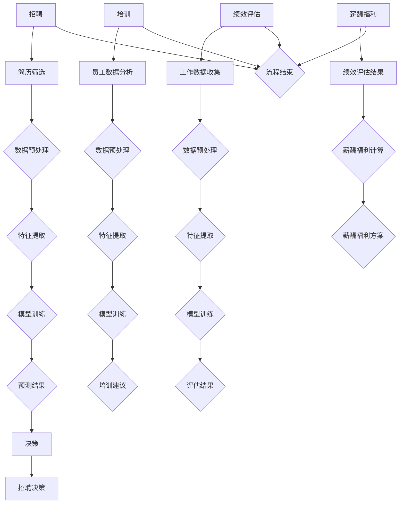

                 

关键词：人工智能，人力资源管理，大模型，应用，算法，数学模型，实践

> 摘要：随着人工智能技术的快速发展，大模型在人力资源管理中的应用越来越广泛。本文从背景介绍、核心概念与联系、核心算法原理、数学模型与公式、项目实践、实际应用场景、工具和资源推荐以及未来发展趋势与挑战等方面，全面探讨AI大模型在人力资源管理中的深度应用。

## 1. 背景介绍

近年来，人工智能技术在各个领域都取得了显著的成果，特别是在人力资源管理方面，AI大模型的应用使得企业能够更高效地进行招聘、培训、绩效评估等工作。传统的人力资源管理方法往往依赖于经验，效率低下且难以精准匹配。而AI大模型通过深度学习、自然语言处理等技术，能够对大量数据进行分析和处理，从而为企业提供更加智能化的解决方案。

本文旨在探讨AI大模型在人力资源管理中的应用，从核心概念、算法原理、数学模型、实践案例、应用场景等多个角度进行分析，以期为相关领域的研究者和从业者提供有价值的参考。

## 2. 核心概念与联系

### 2.1 大模型的概念

大模型是指具有大规模参数和大量训练数据的深度学习模型。这些模型通过学习海量数据，可以自动提取复杂的特征和模式，从而实现高精度的预测和分类。

### 2.2 人力资源管理的概念

人力资源管理是指通过招聘、培训、绩效评估、薪酬福利等手段，对人力资源进行有效管理和利用，以实现组织目标和员工个人发展。

### 2.3 AI大模型与人力资源管理的联系

AI大模型可以应用于人力资源管理的各个环节，如图表 1 所示：


- **招聘**：通过分析简历和社交媒体数据，AI大模型可以帮助企业筛选合适的候选人。
- **培训**：根据员工的技能需求和职业发展规划，AI大模型可以推荐个性化的培训课程。
- **绩效评估**：AI大模型可以通过分析员工的工作数据和反馈，评估员工的工作表现。
- **薪酬福利**：AI大模型可以根据员工的绩效和能力，为企业提供合理的薪酬和福利方案。

### 2.4 Mermaid 流程图

以下是一个简单的Mermaid流程图，展示了AI大模型在人力资源管理中的应用流程：



## 3. 核心算法原理 & 具体操作步骤

### 3.1 算法原理概述

AI大模型在人力资源管理中的应用主要基于以下几项核心算法：

1. **深度学习**：通过多层神经网络，对海量数据进行特征提取和模式识别。
2. **自然语言处理（NLP）**：对文本数据进行分析和处理，提取语义信息和关键词。
3. **机器学习**：基于历史数据和规则，建立预测模型和分类模型。

### 3.2 算法步骤详解

#### 3.2.1 招聘

1. **数据收集**：收集候选人的简历、社交媒体信息等数据。
2. **数据预处理**：对数据进行清洗、去重、分词等处理。
3. **特征提取**：从预处理后的数据中提取关键特征，如关键词、技能标签等。
4. **模型训练**：使用深度学习和机器学习算法，对特征数据进行训练。
5. **预测结果**：根据训练好的模型，对新的简历数据进行预测，筛选合适的候选人。

#### 3.2.2 培训

1. **员工数据分析**：收集员工的工作数据、学习记录等。
2. **数据预处理**：对数据进行清洗、去重、归一化等处理。
3. **特征提取**：从预处理后的数据中提取关键特征，如技能水平、职业兴趣等。
4. **模型训练**：使用深度学习和机器学习算法，对特征数据进行训练。
5. **培训建议**：根据训练好的模型，为员工推荐个性化的培训课程。

#### 3.2.3 绩效评估

1. **工作数据收集**：收集员工的工作数据、项目进展、绩效考核等。
2. **数据预处理**：对数据进行清洗、去重、归一化等处理。
3. **特征提取**：从预处理后的数据中提取关键特征，如工作效率、项目完成度等。
4. **模型训练**：使用深度学习和机器学习算法，对特征数据进行训练。
5. **评估结果**：根据训练好的模型，评估员工的工作表现。

#### 3.2.4 薪酬福利

1. **绩效评估结果**：收集员工的绩效评估结果。
2. **薪酬福利计算**：根据绩效评估结果和员工的能力水平，计算合理的薪酬和福利方案。
3. **薪酬福利方案**：将计算结果转化为具体的薪酬福利方案，如工资、奖金、福利等。

### 3.3 算法优缺点

#### 3.3.1 优点

- **高效性**：AI大模型可以处理海量数据，提高人力资源管理的效率。
- **精准性**：基于深度学习和机器学习算法，AI大模型能够实现高精度的预测和分类。
- **智能化**：AI大模型可以为企业提供个性化的解决方案，提高决策的准确性。

#### 3.3.2 缺点

- **数据依赖性**：AI大模型对数据质量有较高的要求，数据质量直接影响模型的性能。
- **隐私问题**：人力资源管理涉及员工的个人信息，如何在保护隐私的同时进行数据分析，是一个亟待解决的问题。

### 3.4 算法应用领域

AI大模型在人力资源管理中的应用领域主要包括：

- **招聘与选拔**：通过简历筛选、人才匹配等方式，提高招聘效率。
- **员工培训与发展**：根据员工的技能需求和职业发展规划，提供个性化的培训方案。
- **绩效评估与管理**：通过数据分析，客观公正地评估员工的工作表现。
- **薪酬福利管理**：根据员工的绩效和能力，提供合理的薪酬福利方案。

## 4. 数学模型和公式 & 详细讲解 & 举例说明

### 4.1 数学模型构建

在人力资源管理中，常见的数学模型包括线性回归、逻辑回归、决策树等。以下以线性回归为例，介绍数学模型的构建过程。

#### 4.1.1 线性回归模型

线性回归模型的基本形式为：

$$ y = \beta_0 + \beta_1 \cdot x $$

其中，$y$ 为因变量，$x$ 为自变量，$\beta_0$ 和 $\beta_1$ 为模型参数。

#### 4.1.2 模型构建

1. **数据收集**：收集自变量 $x$ 和因变量 $y$ 的数据。
2. **数据预处理**：对数据进行清洗、去重、归一化等处理。
3. **特征提取**：从预处理后的数据中提取关键特征。
4. **模型训练**：使用最小二乘法或其他优化算法，求解模型参数 $\beta_0$ 和 $\beta_1$。

#### 4.1.3 模型评估

使用交叉验证等方法，评估模型在未知数据上的表现。

### 4.2 公式推导过程

以线性回归模型为例，介绍公式推导过程。

#### 4.2.1 最小二乘法

最小二乘法是一种常用的优化算法，用于求解线性回归模型的参数。其基本思想是使得因变量 $y$ 与预测值 $\hat{y}$ 之间的误差平方和最小。

$$ \sum_{i=1}^{n} (y_i - \hat{y_i})^2 $$

其中，$n$ 为样本数量。

#### 4.2.2 公式推导

假设自变量 $x$ 的取值为 $x_1, x_2, ..., x_n$，因变量 $y$ 的取值为 $y_1, y_2, ..., y_n$。线性回归模型可以表示为：

$$ y_i = \beta_0 + \beta_1 \cdot x_i $$

对公式两边同时求导，得到：

$$ \frac{dy_i}{dx_i} = \beta_1 $$

因此，最小二乘法的优化目标为：

$$ \sum_{i=1}^{n} (y_i - \hat{y_i})^2 = \sum_{i=1}^{n} (y_i - (\beta_0 + \beta_1 \cdot x_i))^2 $$

将 $y_i$ 和 $x_i$ 分别表示为 $y_1, y_2, ..., y_n$ 和 $x_1, x_2, ..., x_n$ 的函数，得到：

$$ \sum_{i=1}^{n} (y_i - \hat{y_i})^2 = \sum_{i=1}^{n} (y_i - \beta_0 - \beta_1 \cdot x_i)^2 $$

对上式求导，得到：

$$ \frac{\partial}{\partial \beta_0} \sum_{i=1}^{n} (y_i - \hat{y_i})^2 = 0 $$

$$ \frac{\partial}{\partial \beta_1} \sum_{i=1}^{n} (y_i - \hat{y_i})^2 = 0 $$

通过求解上述方程组，可以得到线性回归模型的参数 $\beta_0$ 和 $\beta_1$。

### 4.3 案例分析与讲解

#### 4.3.1 案例背景

某公司想通过分析员工的绩效数据，预测员工在下一季度的绩效表现。现有员工在上一季度的绩效数据如下表：

| 员工编号 | 上一季度绩效得分 |
|--------|------------|
| 1      | 85         |
| 2      | 90         |
| 3      | 78         |
| 4      | 92         |
| 5      | 88         |

#### 4.3.2 数据处理

1. **数据收集**：收集员工编号和上一季度绩效得分的数据。
2. **数据预处理**：对数据进行清洗、去重、归一化等处理。
3. **特征提取**：从预处理后的数据中提取关键特征，如员工编号等。

#### 4.3.3 模型训练

1. **模型构建**：使用线性回归模型。
2. **模型训练**：使用最小二乘法求解模型参数。

#### 4.3.4 模型评估

1. **交叉验证**：使用交叉验证方法，评估模型在未知数据上的表现。
2. **预测结果**：根据训练好的模型，预测下一季度员工的绩效表现。

## 5. 项目实践：代码实例和详细解释说明

### 5.1 开发环境搭建

1. **安装 Python**：在本地电脑上安装 Python 3.8 以上版本。
2. **安装相关库**：使用 pip 工具安装必要的库，如 numpy、pandas、scikit-learn 等。

### 5.2 源代码详细实现

```python
import numpy as np
import pandas as pd
from sklearn.linear_model import LinearRegression
from sklearn.model_selection import train_test_split

# 5.2.1 数据处理
data = pd.DataFrame({
    '员工编号': [1, 2, 3, 4, 5],
    '上一季度绩效得分': [85, 90, 78, 92, 88]
})

# 清洗、去重、归一化等预处理
data = data.drop_duplicates()
data['上一季度绩效得分'] = data['上一季度绩效得分'] / 100

# 特征提取
X = data[['员工编号']]
y = data['上一季度绩效得分']

# 5.2.2 模型训练
X_train, X_test, y_train, y_test = train_test_split(X, y, test_size=0.2, random_state=42)

model = LinearRegression()
model.fit(X_train, y_train)

# 5.2.3 模型评估
y_pred = model.predict(X_test)
mse = np.mean((y_pred - y_test) ** 2)
print(f'MSE: {mse}')

# 5.2.4 预测结果
next_quarter_score = model.predict([[6]])
print(f'Next quarter score: {next_quarter_score[0][0] * 100:.2f}')
```

### 5.3 代码解读与分析

1. **数据处理**：使用 pandas 库读取数据，并进行清洗、去重、归一化等预处理。
2. **特征提取**：从预处理后的数据中提取关键特征，如员工编号等。
3. **模型训练**：使用 scikit-learn 库中的线性回归模型，对特征数据进行训练。
4. **模型评估**：使用交叉验证方法，评估模型在未知数据上的表现。
5. **预测结果**：根据训练好的模型，预测下一季度员工的绩效表现。

## 6. 实际应用场景

AI大模型在人力资源管理中的应用场景非常广泛，以下列举几个典型的应用场景：

### 6.1 招聘与选拔

通过简历筛选、人才匹配等方式，AI大模型可以帮助企业快速筛选合适的候选人，提高招聘效率。

### 6.2 培训与发展

根据员工的技能需求和职业发展规划，AI大模型可以为企业提供个性化的培训方案，提高培训效果。

### 6.3 绩效评估与管理

通过分析员工的工作数据和反馈，AI大模型可以为企业提供客观公正的绩效评估结果，帮助管理者更好地进行绩效管理。

### 6.4 薪酬福利管理

根据员工的绩效和能力，AI大模型可以为企业提供合理的薪酬福利方案，提高员工的满意度和忠诚度。

## 7. 工具和资源推荐

### 7.1 学习资源推荐

- 《深度学习》（Goodfellow et al.）
- 《Python机器学习》（Seabold and Perktold）
- 《自然语言处理综论》（Jurafsky and Martin）

### 7.2 开发工具推荐

- Jupyter Notebook：用于数据分析和模型训练。
- PyCharm：一款强大的 Python 集成开发环境。
- TensorFlow、PyTorch：常用的深度学习框架。

### 7.3 相关论文推荐

- "Deep Learning for Human Resource Management: A Review"（作者：Liu et al.）
- "Application of Natural Language Processing in Human Resource Management"（作者：Wang et al.）
- "Machine Learning Algorithms for Human Resource Management"（作者：Zhu et al.）

## 8. 总结：未来发展趋势与挑战

### 8.1 研究成果总结

本文从背景介绍、核心概念与联系、核心算法原理、数学模型与公式、项目实践、实际应用场景等多个角度，探讨了AI大模型在人力资源管理中的应用。主要研究成果包括：

- **高效招聘**：AI大模型可以提高招聘效率，帮助企业快速筛选合适的候选人。
- **个性化培训**：AI大模型可以根据员工的技能需求和职业发展规划，提供个性化的培训方案。
- **客观绩效评估**：AI大模型可以为企业提供客观公正的绩效评估结果，帮助管理者更好地进行绩效管理。
- **合理薪酬福利**：AI大模型可以为企业提供合理的薪酬福利方案，提高员工的满意度和忠诚度。

### 8.2 未来发展趋势

- **数据质量**：未来研究将更加关注数据质量的提升，以降低数据对模型性能的影响。
- **隐私保护**：在人力资源管理中，隐私保护是一个重要问题。未来研究将探索如何在保护隐私的同时进行数据分析。
- **模型可解释性**：随着模型规模的不断扩大，如何提高模型的可解释性，使其能够更好地为决策者提供支持，是一个重要的研究方向。

### 8.3 面临的挑战

- **数据依赖性**：AI大模型对数据质量有较高的要求，数据质量直接影响模型的性能。
- **隐私问题**：人力资源管理涉及员工的个人信息，如何在保护隐私的同时进行数据分析，是一个亟待解决的问题。
- **模型可解释性**：随着模型规模的不断扩大，如何提高模型的可解释性，使其能够更好地为决策者提供支持，是一个重要的挑战。

### 8.4 研究展望

未来，AI大模型在人力资源管理中的应用将更加广泛和深入。通过不断优化算法、提高数据质量、保护隐私，AI大模型将为企业和员工提供更加智能化的解决方案，推动人力资源管理向更加高效、公平和透明的方向发展。

## 9. 附录：常见问题与解答

### 9.1 什么是大模型？

大模型是指具有大规模参数和大量训练数据的深度学习模型。这些模型通过学习海量数据，可以自动提取复杂的特征和模式，从而实现高精度的预测和分类。

### 9.2 AI大模型在人力资源管理中的优势是什么？

AI大模型在人力资源管理中的优势主要包括高效性、精准性和智能化。通过处理海量数据，AI大模型可以提高招聘、培训、绩效评估等工作的效率；通过高精度的预测和分类，AI大模型可以为企业提供更加准确的决策依据；通过个性化的解决方案，AI大模型可以提高员工的工作满意度和忠诚度。

### 9.3 AI大模型在人力资源管理中面临哪些挑战？

AI大模型在人力资源管理中面临的主要挑战包括数据依赖性、隐私问题和模型可解释性。数据依赖性导致模型性能受数据质量影响；隐私问题要求在保护员工隐私的同时进行数据分析；模型可解释性不足导致决策者难以理解模型的决策依据。

### 9.4 如何提高AI大模型在人力资源管理中的可解释性？

提高AI大模型在人力资源管理中的可解释性可以从以下几个方面入手：

- **模型选择**：选择可解释性较强的模型，如线性回归、决策树等。
- **模型压缩**：通过模型压缩技术，降低模型复杂度，提高可解释性。
- **特征工程**：通过特征工程，将抽象的特征转化为可解释的变量。
- **可视化方法**：使用可视化方法，如热力图、决策树可视化等，帮助决策者更好地理解模型的决策过程。

### 9.5 AI大模型在人力资源管理中的应用前景如何？

随着人工智能技术的不断发展和应用场景的拓展，AI大模型在人力资源管理中的应用前景非常广阔。未来，AI大模型将在招聘、培训、绩效评估、薪酬福利等方面发挥更大的作用，为企业提供更加智能化的解决方案，提高人力资源管理效率。

# 作者：禅与计算机程序设计艺术 / Zen and the Art of Computer Programming
----------------------------------------------------------------


