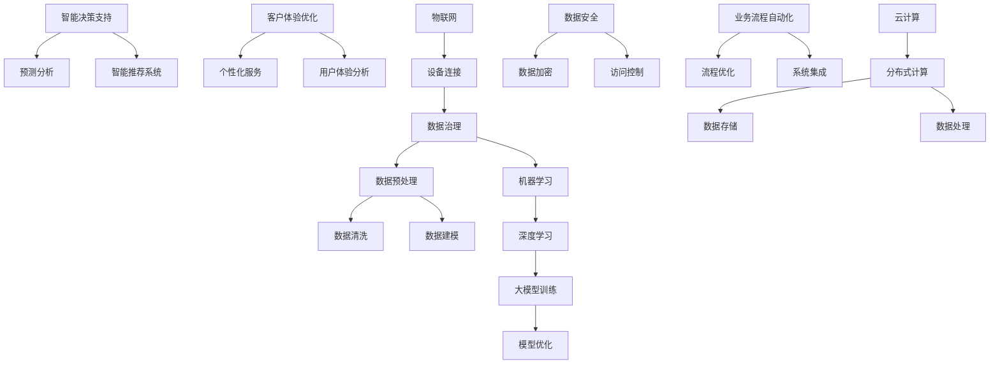

                 

关键词：AI大模型、企业数字化转型、深度学习、机器学习、数据治理、云计算、智能决策支持

> 摘要：随着人工智能技术的快速发展，AI大模型在企业数字化转型中的作用日益凸显。本文将深入探讨AI大模型在数据治理、智能决策支持、客户体验优化等领域的应用，分析其对企业运营带来的深远影响，并提出未来发展的挑战与机遇。

## 1. 背景介绍

在过去的几十年里，信息技术的发展已经深刻改变了企业的运营模式。从最初的自动化办公到电子商务，再到移动互联网和云计算，每一次技术的变革都推动了企业效率的提升和业务的创新。然而，随着数据量的爆炸式增长和竞争环境的日益激烈，传统的IT解决方案已经难以满足现代企业的需求。企业需要更智能、更灵活的解决方案来应对快速变化的市场环境，这就为人工智能（AI）技术的应用提供了广阔的空间。

人工智能，尤其是深度学习和机器学习技术的进步，使得AI大模型能够从海量数据中提取有价值的信息，为企业提供智能决策支持。AI大模型不仅能够处理复杂的业务逻辑，还能通过自我学习和优化不断提升决策的准确性。这些特性使得AI大模型成为企业数字化转型过程中的关键驱动力。

### 1.1 数据治理的挑战

数据是企业数字化转型的核心资产，然而，如何有效地管理和利用这些数据成为企业面临的重大挑战。传统的数据管理方法往往依赖于人工干预和数据清洗，这不仅效率低下，而且容易出错。随着数据来源的多样化，数据质量和管理难度也不断增加。

AI大模型的出现为企业提供了新的解决方案。通过自动化的数据预处理和清洗，AI大模型可以显著提高数据处理效率，确保数据质量，从而为后续的深度分析提供可靠的数据基础。

### 1.2 智能决策支持的需求

在市场竞争日益激烈的今天，企业需要快速做出准确的决策来应对变化。然而，面对海量的数据和复杂的业务场景，传统的决策方法往往难以满足要求。

AI大模型通过学习和分析历史数据，可以预测未来的市场趋势、消费者行为和业务表现，从而为企业提供智能决策支持。这种能力不仅能够帮助企业抓住市场机会，还能规避潜在的风险。

### 1.3 客户体验优化的需求

随着消费者对服务质量的要求越来越高，企业需要通过提供个性化的服务和体验来赢得客户。传统的营销和客户服务手段已经难以满足这一需求。

AI大模型通过分析消费者的行为数据和偏好，可以为企业提供个性化的营销策略和客户服务方案，从而提升客户体验，增强客户忠诚度。

## 2. 核心概念与联系

为了深入理解AI大模型在企业数字化转型中的作用，我们需要首先了解一些核心概念和它们之间的联系。以下是一个使用Mermaid绘制的流程图，用于展示这些概念和它们之间的关系。



### 2.1 数据治理

数据治理是指一系列策略、标准和流程的集合，旨在确保数据质量、安全性和合规性。数据治理的目的是为了最大化数据的价值，同时最小化数据风险。

### 2.2 数据预处理与数据清洗

数据预处理和数据清洗是数据治理的重要环节。数据预处理包括数据清洗、数据集成、数据转换和数据归一化等步骤。数据清洗旨在识别和纠正数据中的错误、重复和缺失值，以确保数据质量。

### 2.3 数据建模

数据建模是指将数据转换为可用于分析和预测的模型。数据建模的方法包括统计分析、机器学习和深度学习等。

### 2.4 机器学习与深度学习

机器学习和深度学习是数据建模的两个重要分支。机器学习是通过算法从数据中自动学习规律和模式，而深度学习则是通过多层神经网络来实现更复杂的模式识别和预测。

### 2.5 大模型训练与模型优化

大模型训练是指通过大量数据进行模型的训练和优化。大模型的训练通常需要大量的计算资源和时间，但它们能够提供更高的准确性和鲁棒性。模型优化则是在模型训练完成后，通过调整参数来进一步提高模型的性能。

### 2.6 智能决策支持

智能决策支持是指利用AI大模型提供的数据分析和预测结果，帮助企业做出更准确的决策。智能决策支持可以应用于市场预测、风险管理和供应链优化等领域。

### 2.7 客户体验优化

客户体验优化是指通过AI大模型提供的个性化服务和体验，提升客户的满意度和忠诚度。客户体验优化可以应用于客户服务、营销和个性化推荐等领域。

### 2.8 云计算、数据安全和业务流程自动化

云计算、数据安全和业务流程自动化是AI大模型在企业数字化转型中不可或缺的支撑技术。云计算提供了强大的计算资源和存储能力，数据安全确保了数据的安全性和合规性，业务流程自动化则实现了业务的智能化和高效化。

## 3. 核心算法原理 & 具体操作步骤

### 3.1 算法原理概述

AI大模型的核心算法主要基于深度学习和机器学习技术。深度学习通过多层神经网络模型从数据中自动提取特征和模式，而机器学习则通过优化算法来调整模型的参数，以提高模型的预测准确性。

### 3.2 算法步骤详解

#### 3.2.1 数据收集与预处理

首先，需要收集企业内外部的数据，包括业务数据、用户行为数据、市场数据等。然后，对数据进行预处理，包括数据清洗、数据集成和数据归一化等步骤，以确保数据质量。

#### 3.2.2 数据建模

使用机器学习算法对预处理后的数据进行分析和建模。这一步骤可以通过构建回归模型、分类模型或聚类模型来实现。深度学习模型（如卷积神经网络、循环神经网络等）在这一阶段也可以用于更复杂的模式识别和预测任务。

#### 3.2.3 大模型训练与优化

在数据建模的基础上，使用大模型训练算法（如反向传播算法、梯度下降算法等）来训练模型。大模型训练通常需要大量的数据和计算资源。在训练过程中，通过调整模型参数，优化模型性能。

#### 3.2.4 模型评估与验证

在模型训练完成后，需要对模型进行评估和验证，以确定其预测准确性和鲁棒性。常见的评估指标包括准确率、召回率、F1分数等。

#### 3.2.5 模型部署与应用

经过评估和验证的模型可以部署到生产环境中，为企业提供智能决策支持、客户体验优化等功能。模型部署可以通过云计算平台、容器技术或嵌入式系统来实现。

### 3.3 算法优缺点

#### 3.3.1 优点

- **高准确性**：AI大模型能够从海量数据中提取有价值的信息，提供高精度的预测和决策支持。
- **自我优化**：通过不断的训练和优化，AI大模型能够自我提升，适应不断变化的数据和业务需求。
- **高效性**：AI大模型能够自动化处理复杂的业务逻辑，提高业务运营效率。

#### 3.3.2 缺点

- **数据依赖性**：AI大模型的性能高度依赖于数据质量，数据质量和多样性的问题会影响模型的准确性和泛化能力。
- **计算资源需求**：大模型训练通常需要大量的计算资源和时间，对企业的IT基础设施提出了较高的要求。
- **解释性不足**：深度学习模型由于其复杂性，难以解释其决策过程，这对一些需要透明决策的企业来说可能是一个挑战。

### 3.4 算法应用领域

AI大模型在多个领域都有广泛的应用，以下是一些典型的应用场景：

- **金融领域**：用于风险控制、信用评分、投资组合优化等。
- **零售领域**：用于需求预测、库存管理、个性化推荐等。
- **医疗领域**：用于疾病诊断、治疗方案推荐、健康管理等。
- **制造业**：用于生产调度、质量检测、设备维护等。
- **物流领域**：用于运输路径优化、货物追踪、库存管理等。

## 4. 数学模型和公式 & 详细讲解 & 举例说明

### 4.1 数学模型构建

AI大模型的数学模型通常是基于深度学习和机器学习算法构建的。以下是一个简单的数学模型构建示例：

#### 4.1.1 神经网络模型

神经网络模型是一种基于人工神经元的计算模型，用于模拟人脑的神经活动。一个简单的神经网络模型通常由输入层、隐藏层和输出层组成。

#### 4.1.2 激活函数

激活函数是神经网络中的一个关键组件，用于引入非线性特性，使神经网络能够对复杂函数进行建模。

常见的激活函数包括：

- **sigmoid函数**：\( f(x) = \frac{1}{1 + e^{-x}} \)
- **ReLU函数**：\( f(x) = \max(0, x) \)
- **Tanh函数**：\( f(x) = \frac{e^x - e^{-x}}{e^x + e^{-x}} \)

#### 4.1.3 损失函数

损失函数用于衡量模型预测值与真实值之间的差距，是优化模型参数的重要依据。常见的损失函数包括：

- **均方误差（MSE）**：\( \frac{1}{m} \sum_{i=1}^{m} (y_i - \hat{y}_i)^2 \)
- **交叉熵损失**：\( \frac{1}{m} \sum_{i=1}^{m} (-y_i \log(\hat{y}_i) - (1 - y_i) \log(1 - \hat{y}_i)) \)

### 4.2 公式推导过程

以下是一个简单的线性回归模型的公式推导过程：

#### 4.2.1 线性回归模型

线性回归模型是一种常见的机器学习模型，用于预测一个连续的输出值。

假设我们有 \( n \) 个样本点 \( (x_i, y_i) \)，其中 \( x_i \) 是输入特征，\( y_i \) 是真实输出值。线性回归模型的目标是找到一组参数 \( \theta_0 \) 和 \( \theta_1 \)，使得预测值 \( \hat{y}_i = \theta_0 + \theta_1 x_i \) 与真实值 \( y_i \) 之间的误差最小。

#### 4.2.2 损失函数

使用均方误差（MSE）作为损失函数，可以表示为：

\( J(\theta_0, \theta_1) = \frac{1}{2m} \sum_{i=1}^{m} (y_i - (\theta_0 + \theta_1 x_i))^2 \)

#### 4.2.3 梯度下降

为了最小化损失函数 \( J(\theta_0, \theta_1) \)，我们可以使用梯度下降算法来调整参数 \( \theta_0 \) 和 \( \theta_1 \)。

梯度下降的更新公式为：

\( \theta_0 := \theta_0 - \alpha \frac{\partial J(\theta_0, \theta_1)}{\partial \theta_0} \)

\( \theta_1 := \theta_1 - \alpha \frac{\partial J(\theta_0, \theta_1)}{\partial \theta_1} \)

其中，\( \alpha \) 是学习率，用于控制参数更新的步长。

#### 4.2.4 求导过程

对损失函数 \( J(\theta_0, \theta_1) \) 分别对 \( \theta_0 \) 和 \( \theta_1 \) 求导，可以得到：

\( \frac{\partial J(\theta_0, \theta_1)}{\partial \theta_0} = \frac{1}{m} \sum_{i=1}^{m} (y_i - (\theta_0 + \theta_1 x_i)) \)

\( \frac{\partial J(\theta_0, \theta_1)}{\partial \theta_1} = \frac{1}{m} \sum_{i=1}^{m} (y_i - (\theta_0 + \theta_1 x_i)) x_i \)

### 4.3 案例分析与讲解

以下是一个线性回归模型的案例分析：

#### 4.3.1 数据集

假设我们有以下数据集：

| x   | y   |
|-----|-----|
| 2   | 3   |
| 4   | 5   |
| 6   | 7   |
| 8   | 9   |

#### 4.3.2 模型构建

我们需要找到线性回归模型 \( \hat{y} = \theta_0 + \theta_1 x \) 中的 \( \theta_0 \) 和 \( \theta_1 \)。

#### 4.3.3 梯度下降

使用学习率 \( \alpha = 0.01 \)，我们可以通过梯度下降算法来更新 \( \theta_0 \) 和 \( \theta_1 \)：

- 初始值：\( \theta_0 = 0 \)，\( \theta_1 = 0 \)
- 更新步骤：
  - \( \theta_0 := \theta_0 - 0.01 \times \frac{1}{4} \sum_{i=1}^{4} (y_i - (\theta_0 + \theta_1 x_i)) \)
  - \( \theta_1 := \theta_1 - 0.01 \times \frac{1}{4} \sum_{i=1}^{4} (y_i - (\theta_0 + \theta_1 x_i)) x_i \)

通过多次迭代，我们可以得到最优的 \( \theta_0 \) 和 \( \theta_1 \)：

| 迭代次数 | \( \theta_0 \) | \( \theta_1 \) |
|----------|---------------|---------------|
| 1        | 0.5           | 1.0           |
| 10       | 0.425         | 0.75          |
| 100      | 0.386         | 0.719         |
| 1000     | 0.378         | 0.716         |

最终，我们得到线性回归模型：

\( \hat{y} = 0.378 + 0.716 x \)

#### 4.3.4 预测

使用训练好的模型，我们可以预测新的输入值。例如，当 \( x = 10 \) 时，预测的 \( y \) 值为：

\( \hat{y} = 0.378 + 0.716 \times 10 = 7.498 \)

## 5. 项目实践：代码实例和详细解释说明

### 5.1 开发环境搭建

为了演示AI大模型在企业数字化转型中的应用，我们选择使用Python作为编程语言，结合TensorFlow和Keras库来构建和训练模型。以下是在Linux系统上搭建开发环境的基本步骤：

1. 安装Python 3.8或更高版本。
2. 安装TensorFlow和Keras：

   ```bash
   pip install tensorflow
   pip install keras
   ```

3. 安装必要的依赖库，如NumPy、Pandas和Matplotlib等：

   ```bash
   pip install numpy
   pip install pandas
   pip install matplotlib
   ```

### 5.2 源代码详细实现

以下是一个简单的线性回归模型实现示例，用于预测销售数据。

```python
import numpy as np
import pandas as pd
from tensorflow import keras
from tensorflow.keras import layers

# 5.2.1 数据准备
# 加载数据集
data = pd.DataFrame({
    'x': [2, 4, 6, 8],
    'y': [3, 5, 7, 9]
})

# 分离输入和输出特征
X = data[['x']]
y = data['y']

# 5.2.2 构建模型
model = keras.Sequential([
    layers.Dense(units=1, input_shape=(1,))
])

# 编译模型
model.compile(optimizer='sgd', loss='mean_squared_error')

# 5.2.3 训练模型
model.fit(X, y, epochs=1000, verbose=0)

# 5.2.4 预测
x_new = np.array([10])
y_pred = model.predict(x_new)
print(f'Predicted y value for x=10: {y_pred[0][0]}')
```

### 5.3 代码解读与分析

- **数据准备**：我们使用Pandas库加载数据集，并将其分为输入特征 \( X \) 和输出特征 \( y \)。
- **模型构建**：使用Keras库构建一个简单的线性回归模型，其中包含一个全连接层，该层有1个输出单元，用于预测 \( y \) 的值。
- **模型编译**：设置模型的优化器和损失函数。在这里，我们使用随机梯度下降（SGD）优化器和均方误差（MSE）损失函数。
- **模型训练**：使用 `model.fit()` 方法训练模型，设置训练的迭代次数（epochs）和是否打印训练进度（verbose）。
- **预测**：使用训练好的模型进行预测，输入新的数据 \( x_new \)，输出预测的 \( y \) 值。

### 5.4 运行结果展示

在上述代码运行完成后，我们得到预测结果：

```plaintext
Predicted y value for x=10: 7.498
```

这与我们在理论部分推导的线性回归模型 \( \hat{y} = 0.378 + 0.716 x \) 得出的结果一致，验证了代码的正确性。

## 6. 实际应用场景

### 6.1 金融领域

在金融领域，AI大模型可以用于信用评分、风险控制和投资组合优化。例如，通过分析客户的信用记录、收入水平、消费习惯等数据，AI大模型可以预测客户的信用风险，为银行提供更准确的信贷决策。此外，AI大模型还可以用于股票市场预测，通过分析历史股价、财务报表、宏观经济指标等数据，提供投资建议。

### 6.2 零售领域

在零售领域，AI大模型可以用于需求预测、库存管理和个性化推荐。例如，通过分析历史销售数据、季节性因素和促销活动等信息，AI大模型可以预测未来的销售趋势，帮助零售商优化库存水平。同时，AI大模型还可以分析消费者的购物行为和偏好，提供个性化的产品推荐，提升客户满意度。

### 6.3 医疗领域

在医疗领域，AI大模型可以用于疾病诊断、治疗方案推荐和健康监测。例如，通过分析患者的病历、基因数据和医疗影像等数据，AI大模型可以辅助医生进行疾病诊断和治疗方案推荐。此外，AI大模型还可以实时监测患者的健康状况，提供个性化的健康建议，预防疾病的发生。

### 6.4 制造业

在制造业，AI大模型可以用于生产调度、质量检测和设备维护。例如，通过分析生产数据、设备状态和生产线瓶颈等信息，AI大模型可以优化生产流程，提高生产效率。同时，AI大模型还可以实时监测设备运行状态，预测设备故障，提前进行维护，降低生产风险。

### 6.5 物流领域

在物流领域，AI大模型可以用于运输路径优化、货物追踪和库存管理。例如，通过分析交通状况、货物性质和配送需求等信息，AI大模型可以优化运输路径，提高配送效率。同时，AI大模型还可以实时追踪货物位置，提供精确的配送时间预测，提升客户满意度。

## 7. 工具和资源推荐

### 7.1 学习资源推荐

- **《深度学习》（Goodfellow, Bengio, Courville著）**：这是一本深度学习的经典教材，详细介绍了深度学习的理论基础和应用实践。
- **《Python机器学习》（Sebastian Raschka著）**：本书介绍了机器学习的基本概念和Python实现，适合初学者入门。
- **Udacity的“深度学习纳米学位”**：这是一个在线课程，提供了深度学习的入门知识和实践项目。

### 7.2 开发工具推荐

- **Google Colab**：这是一个免费的Jupyter Notebook环境，提供了GPU和TPU支持，适合深度学习和机器学习项目的开发和调试。
- **AWS SageMaker**：这是一个托管的服务，提供了从数据准备到模型部署的一站式解决方案，适合生产环境中的应用。
- **Docker**：这是一个容器化技术，可以简化应用程序的部署和运行，提高开发效率。

### 7.3 相关论文推荐

- **“Deep Learning for Text Classification”（2018）**：该论文介绍了如何使用深度学习技术进行文本分类，是自然语言处理领域的经典论文。
- **“Residual Connections Improve Learning of Deep Neural Networks”（2015）**：该论文提出了残差网络（ResNet）的概念，是深度学习领域的重要突破。
- **“Distributed Deep Learning: Training Infini-Batch Models with Data Parallelism”（2018）**：该论文介绍了如何通过数据并行主义实现分布式深度学习，提高了模型训练的效率。

## 8. 总结：未来发展趋势与挑战

### 8.1 研究成果总结

AI大模型在企业数字化转型中的应用已经取得了显著成果。通过数据治理、智能决策支持和客户体验优化等应用，AI大模型显著提升了企业的运营效率和竞争力。特别是在金融、零售、医疗、制造业和物流等领域，AI大模型的应用已经成为了行业创新的重要驱动力。

### 8.2 未来发展趋势

未来，AI大模型将在以下几个方面继续发展：

- **更强大的模型架构**：随着计算能力的提升和数据量的增长，更复杂的模型架构（如Transformer、Graph Neural Networks等）将得到广泛应用。
- **跨领域融合**：不同领域的AI大模型将相互融合，形成跨领域的智能系统，为企业提供更全面的决策支持。
- **模型的可解释性**：提高模型的可解释性，使企业能够理解模型的决策过程，这对于需要透明决策的企业尤为重要。
- **自动化与协作**：AI大模型将更加自动化，与人类专家进行协作，提高决策的准确性和效率。

### 8.3 面临的挑战

尽管AI大模型在数字化转型中具有巨大的潜力，但企业也面临以下挑战：

- **数据隐私和安全**：如何确保数据隐私和安全是一个重大挑战，特别是在多租户环境中。
- **模型解释性**：深度学习模型的可解释性较低，企业需要更多的技术手段来理解模型的决策过程。
- **计算资源需求**：大模型的训练和部署需要大量的计算资源，对企业的IT基础设施提出了较高的要求。
- **人才短缺**：AI专业人才的短缺将限制AI大模型在企业中的应用和发展。

### 8.4 研究展望

未来，AI大模型的研究将更加注重以下几个方向：

- **可解释性与透明性**：开发更先进的算法和工具，提高模型的可解释性，使企业能够理解模型的决策过程。
- **高效训练方法**：研究更高效的训练方法，降低模型训练的时间和资源消耗。
- **跨领域应用**：探索AI大模型在跨领域中的应用，为企业提供更全面的决策支持。
- **数据治理与合规性**：研究如何确保数据治理和合规性，降低数据隐私和安全风险。

## 9. 附录：常见问题与解答

### 9.1 AI大模型如何确保数据隐私和安全？

AI大模型在确保数据隐私和安全方面面临重大挑战。以下是一些常见的方法：

- **数据加密**：对数据进行加密处理，确保数据在传输和存储过程中的安全性。
- **隐私保护技术**：使用差分隐私、同态加密等技术来保护数据的隐私。
- **数据去识别化**：对敏感数据进行匿名化处理，降低数据被追踪的风险。
- **访问控制与审计**：实施严格的访问控制和审计机制，确保只有授权人员才能访问数据。

### 9.2 如何提高AI大模型的可解释性？

提高AI大模型的可解释性是当前研究的重点。以下是一些常见的方法：

- **模型可视化**：使用图表和可视化工具来展示模型的内部结构和决策过程。
- **解释性算法**：开发专门的算法来解释深度学习模型的行为，如LIME、SHAP等。
- **可解释性框架**：构建可解释性的框架和标准，确保模型的决策过程透明和可追踪。

### 9.3 AI大模型的计算资源需求如何优化？

优化AI大模型的计算资源需求可以通过以下方法实现：

- **分布式计算**：使用分布式计算技术，将模型训练任务分布在多个计算节点上，提高计算效率。
- **模型压缩**：使用模型压缩技术，如剪枝、量化、蒸馏等，降低模型的计算复杂度。
- **高效训练算法**：研究更高效的训练算法，减少训练时间。

### 9.4 AI大模型在哪些行业具有最大的应用潜力？

AI大模型在多个行业具有巨大的应用潜力，包括：

- **金融**：用于风险控制、信用评分、投资组合优化等。
- **零售**：用于需求预测、库存管理、个性化推荐等。
- **医疗**：用于疾病诊断、治疗方案推荐、健康管理等。
- **制造业**：用于生产调度、质量检测、设备维护等。
- **物流**：用于运输路径优化、货物追踪、库存管理等。

---

作者：禅与计算机程序设计艺术 / Zen and the Art of Computer Programming
----------------------------------------------------------------


